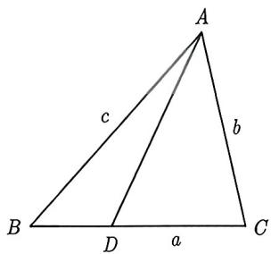
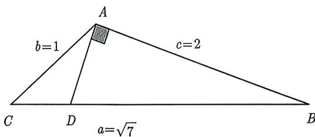
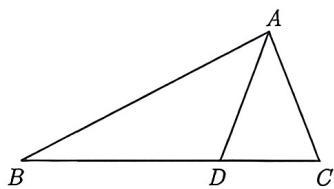
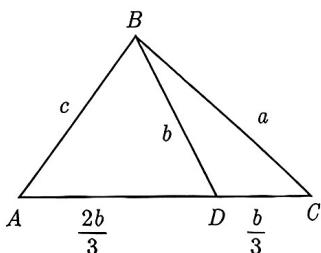
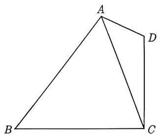
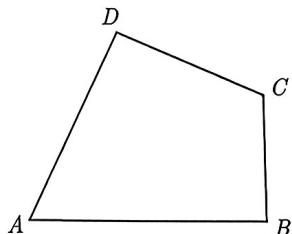
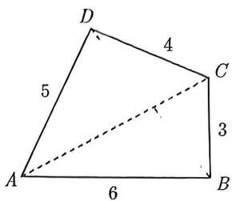
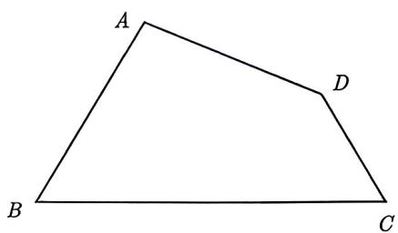
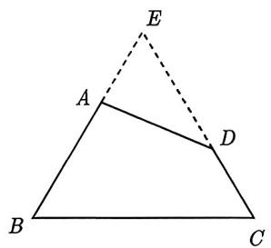
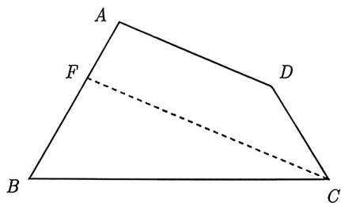

import Guide from '@/components/Guide.astro';
import Knowledge from '@/components/Knowledge.astro';
import Example from '@/components/Example.astro';
import Analysis from '@/components/Analysis.astro';
import Solution from '@/components/Solution.astro';
import Variant from '@/components/Variant.astro';
import Note from '@/components/Note.astro';
import Block from '@/components/Block.astro';
import Summary from '@/components/Summary.astro';

将三角形或四边形分割成多个三角形, 然后在多个三角形中解三角形, 此类题型综合性较强, 是高考中常见题型.

我们先来研究对三角形进行分割的问题. 如图 2-1 所示, 在 $\triangle ABC$ 中, 边 $BC$ 上存在点 $D$ , 连接 $AD$ , 则线段 $AD$ 将 $\triangle ABC$ 分割成 $\triangle ABD$ 和 $\triangle ADC$ , 若要解这组三角形, 我们要先观察哪个三角形已知三个元素, 然后利用正弦定理或余弦定理解该三角形, 进而求解其他三角形.

<figure class="vp-figure">
  
  <figcaption>图2-1</figcaption>
</figure>

<figure class="vp-figure">
  
  <figcaption>图2-2</figcaption>
</figure>

<Example title="例 2.16">
(2023 全国乙理 18) 在 $\triangle ABC$ 中, 已知 $\angle BAC = 120^{\circ}, AB = 2, AC = 1$ .

(I) 求 $\sin \angle ABC$ ;

(Ⅱ) 若 $D$ 为 $BC$ 上一点, 且 $\angle BAD = 90^{\circ}$ , 求 $\triangle ADC$ 的面积.

<Solution title="解析">
(I) 如图 2-2 所示, 记 $AB = c$ , $AC = b$ , $BC = a$ . 由余弦定理可得 $a^2 = b^2 + c^2 - 2bc \cos A = 4 + 1 - 2 \times 2 \times 1 \times \cos 120^\circ = 7$ , 则 $\cos B = \frac{a^2 + c^2 - b^2}{2ac} = \frac{7 + 4 - 1}{2 \times 2 \times \sqrt{7}} = \frac{5\sqrt{7}}{14}$ . 所以 $\sin B = \sqrt{1 - \cos^2 B} = \frac{\sqrt{21}}{14}$ .
</Solution>

(Ⅱ)【解析1】由(I)得 $\sin B = \frac{\sqrt{21}}{14},\cos B = \frac{5\sqrt{7}}{14}$ 则 $\tan B = \frac{\sin B}{\cos B} = \frac{\sqrt{3}}{5}$ ，在Rt△ADB中， $AD = 2\tan B = 2\times \frac{\sqrt{3}}{5} = \frac{2\sqrt{3}}{5},\angle CAD = \angle BAC - \angle BAD = 30^{\circ}$ ，则 $S_{\triangle ADC} = \frac{1}{2} AD\cdot AC\cdot \sin \angle CAD = \frac{1}{2}\times \frac{2\sqrt{3}}{5}\times 1\times \frac{1}{2} = \frac{\sqrt{3}}{10}.$

例2.16其实我们可以不用去解三角形, 由于 $\angle BAC = 120^{\circ}$ , 而 $\angle BAD = 90^{\circ}$ , 所以 $\angle CAD = 30^{\circ}$ , 而 $AD$ 为 $\triangle CAD$ 与 $\triangle BAD$ 的公共边, 因此可以得到这两个三角形的面积之比.

<Solution title="解析2">
由三角面积公式可得 $\frac{S_{\triangle ABD}}{S_{\triangle ACD}} = \frac{\frac{1}{2} \times AB \times AD \times \sin 90^\circ}{\frac{1}{2} \times AC \times AD \times \sin 30^\circ} = 4,$ 则 $S_{\triangle ACD} = \frac{1}{5} S_{\triangle ABC} = \frac{1}{5}\left(\frac{1}{2} \times 2 \times 1 \times \sin 120^\circ\right) = \frac{\sqrt{3}}{10}.$
</Solution>
</Example>

并不是所有的分割三角形都像例2.16中存在一个三角形可解, 如果分割的三角形都不可解, 那么就得整体观察它们, 然后从它们的公共角、补角或公共边入手, 根据正弦定理或余弦定理建立方程, 进而解出未知数.

<Example title="例 2.17">
(2015 全国Ⅱ理 17) 在 $\triangle ABC$ 中, D 是 BC 上的点, AD 平分 $\angle BAC$ , $\triangle ABD$ 面积是 $\triangle ADC$ 面积的 2 倍.

(I) 求 $\frac{\sin B}{\sin C}$ ;

(Ⅱ) 若 $AD = 1, DC = \frac{\sqrt{2}}{2}$ , 求 $BD$ 和 $AC$ 的长.

<Solution title="解析">
(I) 由 $AD$ 平分 $\angle BAC$ , 得 $\angle BAD = \angle CAD$ , 又 $\triangle ABD$ 面积是 $\triangle ADC$ 面积的 2 倍, 所以 $\frac{\frac{1}{2}AB \cdot AD \sin \angle BAD}{\frac{1}{2}AC \cdot AD \sin \angle CAD} = \frac{AB}{AC} = 2$ , 由正弦定理得 $\frac{\sin B}{\sin C} = \frac{AC}{AB} = \frac{1}{2}$ .

(Ⅱ) 因为 $\frac{S_{\triangle ABD}}{S_{\triangle ADC}} = \frac{BD}{DC} = 2$ ，且 $DC = \frac{\sqrt{2}}{2}$ ，所以 $BD = \sqrt{2}$ .

难点是求 $AC$ , 观察条件 $\frac{\sin B}{\sin C} = \frac{1}{2}, AD = 1, DC = \frac{\sqrt{2}}{2}, BD = \sqrt{2}$ , 发现这些条件对于图2-3中任意一个三角形都不能解决三角形问题, 这时候我们就得同时观察两个三角形了, 比如 $\triangle ABD$ 和 $\triangle ACD$ , 在这两个三角形中, $\angle ADB + \angle ADC = 180^\circ$ , 通过 (I) 还能得到 $\frac{AC}{AB} = \frac{1}{2}$ , 而这两个三角形其余的边都知道, 那么就不难想到用余弦定理就可以构造关于 $AC$ 的方程了.

<figure class="vp-figure">
  
  <figcaption>图2-3</figcaption>
</figure>

在 $\triangle ABD$ 和 $\triangle ACD$ 中, 由余弦定理得

$$
\cos \angle A D B = \frac {A D ^ {2} + D B ^ {2} - A B ^ {2}}{2 A D \cdot D B} = \frac {3 - 4 A C ^ {2}}{2 \sqrt {2}},
$$

$$
\cos \angle A D C = \frac {A D ^ {2} + D C ^ {2} - A C ^ {2}}{2 D A \cdot D C} = \frac {\frac {3}{2} - A C ^ {2}}{\sqrt {2}}.
$$

因为 $\cos \angle ADB + \cos \angle ADC = 0$ ，所以 $\frac{3 - 4AC^2}{2\sqrt{2}} + \frac{\frac{3}{2} - AC^2}{\sqrt{2}} = 0$ ，解得 $AC = 1$ .
</Solution>

在 (Ⅱ) 中, 还可以在两个三角形中, 找到两个相同的角, 再通过余弦定理构造关于 $AC$ 的方程, 具体为

(1) 在 $\triangle ABD$ 和 $\triangle ACD$ 中, $\angle BAD = \angle CAD$ ;

(2) 在 $\triangle ABD$ 和 $\triangle ABC$ 中, $\angle ABD = \angle ABC$ ;

(3) 在 $\triangle ACD$ 和 $\triangle ABC$ 中, $\angle ACB = \angle ACD$ .
</Example>

例2.17是典型的考查角平分线定理, 而在三角形中角平分线定理往往会与三角形面积之比有关, 因此第 (I) 问要证明 $\frac{\sin B}{\sin C}$ 可以利用正弦定理转化为边之比 $\frac{AB}{AC}$ , 而边的比值证明就需要借助面积之比. 当然这仅仅是考查角平分线定理的一个方面, 除了比例关系, 同样可以考查三角形的内切圆, 下面我们就例2.17(II) 增加一个问题: 求 $\triangle ABC$ 内切圆的半径.

<Solution title="解析">
由(Ⅱ)可知 $AC = 1, AD = 1, DC = \frac{\sqrt{2}}{2}, BD = \sqrt{2}, AB = 2,$ 所以在 $\triangle ABD$ 中，由余弦定理可得

$$
\cos B = \frac {A B ^ {2} + B D ^ {2} - A D ^ {2}}{2 A B \cdot B D} = \frac {4 + 2 - 1}{2 \times 2 \times \sqrt {2}} = \frac {5 \sqrt {2}}{8}.
$$

于是 $\sin B = \sqrt{1 - \cos^2 B} = \frac{\sqrt{14}}{8}$ , 所以 $S_{\triangle ABD} = \frac{1}{2} AB \cdot BD \cdot \sin B = \frac{\sqrt{7}}{4}$ . 又由 $\triangle ABD$ 面积是 $\triangle ADC$ 面积的 2 倍, 可知 $S_{\triangle ACD} = \frac{\sqrt{7}}{8}$ , 而 $\triangle ABC$ 的面积是 $\triangle ABD$ 的面积与 $\triangle ACD$ 的面积之和, 即 $S_{\triangle ABC} = \frac{3\sqrt{7}}{8}$ . 不妨设 $\triangle ABC$ 的内切圆半径为 $r$ , 设内切圆的圆心为 $I$ , 则

$$
S _ {\triangle A B C} = S _ {\triangle I B C} + S _ {\triangle I A B} + S _ {\triangle I A C},
$$

即

$$
\frac {1}{2} r \cdot (A B + A C + B C) = \frac {3 \sqrt {7}}{8}.
$$

又由 $AB + AC + BC = 3 + \frac{3\sqrt{2}}{2}$ , 可得 $r = \frac{2\sqrt{7} - \sqrt{14}}{4}$ .
</Solution>

对于内切圆问题, 我们就必须联想到三角形的面积, 可知内切圆半径 $r$ 与三角形的面积存在如下关系:

设 $\triangle ABC$ 的内切圆的半径为 r，则 $S_{\triangle ABC} = \frac{1}{2} r (AB + AC + BC)$ .

通过对例2.17的分析与解答, 我们把这类三角形分割问题作一个总结:

<Block title="经验总结 2.1">
对于三角形分割的三个三角形, 如果任意一个三角形都不可解, 那么我们可以从这三个三角形的公共角、补角或公共边入手, 再根据正、余弦定理建立方程求解.
</Block>

<Example title="例 2.18">
(2021 新高考 I 19) 记 $\triangle ABC$ 的内角 A, B, C 所对的边分别为 a, b, c. 已知 $b^{2} = ac$ , 点 D 在边 AC 上, $BD \sin \angle ABC = a \sin C$ .

(I) 证明: $BD = b$ ;

(Ⅱ) 若 $AD = 2DC$ , 求 $\cos \angle ABC$ .

<Solution title="解析">
(I) 由正弦定理得 $\frac{\sin\angle ABC}{\sin C} = \frac{b}{c}$ , 又由题设得 $\frac{\sin\angle ABC}{\sin C} = \frac{a}{BD}$ , 因此 $\frac{b}{c} = \frac{a}{BD}$ , 又因为 $b^2 = ac$ , 所以 $BD = \frac{ac}{b} = \frac{b^2}{b} = b$ .

图2-4

(Ⅱ) 如图 2-4 所示, 因为 $AD = 2DC$ , 所以 $AD = \frac{2b}{3}, CD = \frac{b}{3}$ , 由 (I) 知 $BD = b$ , 故在 $\triangle BCD$ 和

$\triangle DBC$ 中, 分别用余弦定理得

$$
\cos \angle B C D = \frac {B C ^ {2} + C D ^ {2} - B D ^ {2}}{2 B C \cdot C D} = \frac {a ^ {2} + \frac {b ^ {2}}{9} - b ^ {2}}{2 a \cdot \frac {b}{3}}, \qquad \cos \angle B C A = \frac {a ^ {2} + b ^ {2} - c ^ {2}}{2 a b}.
$$

因为 $\angle BCD = \angle BCA$ ，所以 $\frac{a^2 + \frac{b^2}{9} - b^2}{2a \cdot \frac{b}{3}} = \frac{a^2 + b^2 - c^2}{2ab}$ 整理得 $6a^2 - 11b^2 + 3c^2 = 0$ ，将 $b^2 = ac$ 代入得 $6a^2 - 11ac + 3c^2 = 0$ ，即 $(3a - c)(2a - 3c) = 0$ ，解得 $a = \frac{c}{3}$ 或 $a = \frac{3}{2} c.$

(i) 若 $a = \frac{c}{3}$ , 则 $b = \sqrt{ac} = \frac{\sqrt{3}}{3} c$ , 此时 $a + b = \frac{1 + \sqrt{3}}{3} c < c$ , 不符合题意, 舍去.

(i) 若 $a = \frac{3}{2} c,$ 则 $b = \sqrt{ac} = \frac{\sqrt{6}}{2} c,$ 此时

$$
\cos \angle A B C = \frac {a ^ {2} + c ^ {2} - b ^ {2}}{2 a c} = \frac {\frac {9}{4} c ^ {2} + c ^ {2} - \frac {3}{2} c ^ {2}}{2 \times \frac {3}{2} c \cdot c} = \frac {7}{1 2}.
$$

故 $\cos \angle ABC = \frac{7}{12}$ .
</Solution>
</Example>

<Variant title="变式 2.18.1">
(2023 新高考 II 17) 记 $\triangle ABC$ 的内角 A, B, C 的对边分别为 a, b, c, 已知 $\triangle ABC$ 的面积为 $\sqrt{3}$ , D 为 BC 的中点, 且 AD = 1.

(I) 若 $\angle ADC = \frac{\pi}{3}$ , 求 $\tan B$ ;

(Ⅱ) 若 $b^{2} + c^{2} = 8$ , 求 $b, c$ .
</Variant>

通过以上的例题与变式我们掌握了三角形分割成多个三角形如何去解三角形, 往后我们遇到的就不仅仅是三角形了, 有可能是多边形, 那么我们还是采取同样的方式, 把多边形分割成多个三角形, 然后来解三角形即可.

<Example title="例 2.19">
(2014 湖南理 18) 如图 2-5 所示, 在平面四边形 ABCD 中, AD = 1, CD = 2, AC = $\sqrt{7}$ .

(I) 求 $\cos \angle CAD$ 的值;

图2-5

(Ⅱ) 若 $\cos \angle BAD = -\frac{\sqrt{7}}{14}, \sin \angle CBA = \frac{\sqrt{21}}{6}$ , 求 $BC$ 的长.

<Analysis>
观察图 2-5, 对角线 $AC$ 将四边形 $ABCD$ 分成了 $\triangle ADC$ 和 $\triangle ABC$ , 其中 $\triangle ADC$ 给的条件最多, 故我们从 $\triangle ADC$ 入手, 然后过渡到 $\triangle ABC$ , 进而求出 $BC$ .
</Analysis>

<Solution title="解析">
(I) 在 $\triangle ADC$ 中, 由余弦定理及题设得

$$
\cos \angle C A D = \frac {A C ^ {2} + A D ^ {2} - C D ^ {2}}{2 A C \cdot A D} = \frac {7 + 1 - 4}{2 \times 1 \times \sqrt {7}} = \frac {2 \sqrt {7}}{7}.
$$

(Ⅱ) 令 $\angle CAD = \alpha, \angle BAD = \beta$ , 则 $\sin \alpha = \sqrt{1 - \cos^2 \alpha} = \frac{\sqrt{21}}{7}$ , $\sin \beta = \sqrt{1 - \cos^2 \beta} = \frac{3\sqrt{21}}{14}$ , 于是

$$
\sin \angle B A C = \sin (\beta - \alpha) = \sin \beta \cos \alpha - \cos \beta \sin \alpha = \frac {3 \sqrt {2 1}}{1 4} \times \frac {2 \sqrt {7}}{7} - \left(- \frac {\sqrt {7}}{1 4}\right) \times \frac {\sqrt {2 1}}{7} = \frac {\sqrt {3}}{2}.
$$

在 $\triangle ABC$ 中, 由正弦定理 $\frac{BC}{\sin\angle BAC} = \frac{AC}{\sin\angle CBA}$ , 得 $BC = \frac{AC\sin\angle BAC}{\sin\angle CBA} = \frac{\sqrt{7} \times \frac{\sqrt{3}}{2}}{\frac{\sqrt{21}}{6}} = 3.$
</Solution>
</Example>

在例2.19给出的图 2-5中连接了对角线 AC, 有了这条对角线就使我们的思路有了方向, 但是还有些题所给的四边形没有连接对角线, 这时就需要我们根据题意来连接对角线了, 请看下面的例题.

<Example title="例 2.20">
(2015 四川理 19) 如图 2-6 所示, A, B, C, D 为平面四边形 ABCD 的四个内角.

(I) 证明: $\tan \frac{A}{2} = \frac{1 - \cos A}{\sin A}$ ;

(Ⅱ) 若 $A + C = 180^{\circ}$ , $AB = 6$ , $BC = 3$ , $CD = 4$ , $AD = 5$ , 求 $\tan \frac{A}{2} + \tan \frac{B}{2} + \tan \frac{C}{2} + \tan \frac{D}{2}$ 的值.

<Solution title="解析">

$$
\tan \frac {A}{2} = \frac {\sin \frac {A}{2}}{\cos \frac {A}{2}} = \frac {2 \sin^ {2} \frac {A}{2}}{2 \sin \frac {A}{2} \cos \frac {A}{2}} = \frac {1 - \cos A}{\sin A}.
$$

<figure class="vp-figure">
  
  <figcaption>图2-6</figcaption>
</figure>

(Ⅱ) 由 $A + C = 180^{\circ}$ , 得 $C = 180^{\circ} - A$ , $D = 180^{\circ} - B$ , 由 (I) 得

$$
\begin{array}{l} \tan \frac {A}{2} + \tan \frac {B}{2} + \tan \frac {C}{2} + \tan \frac {D}{2} \\ = \frac {1 - \cos A}{\sin A} + \frac {1 - \cos B}{\sin B} + \frac {1 - \cos (1 8 0 ^ {\circ} - A)}{\sin (1 8 0 ^ {\circ} - A)} + \frac {1 - \cos (1 8 0 ^ {\circ} - B)}{\sin (1 8 0 ^ {\circ} - B)} \\ = \frac {2}{\sin A} + \frac {2}{\sin B}. \end{array}
$$

如图 2-7 所示, 连接 BD, 在 $\triangle ABD$ 中和 $\triangle BCD$ 中, 利用余弦定理可得

$$
B D ^ {2} = A B ^ {2} + A D ^ {2} - 2 A B \cdot A D \cdot \cos A,
$$

$$
B D ^ {2} = B C ^ {2} + C D ^ {2} - 2 B C \cdot C D \cdot \cos C.
$$

所以 $AB^{2} + AD^{2} - 2AB\cdot AD\cos A = BC^{2} + CD^{2} - 2BC\cdot CD\cos C,$ 又由 $\cos C = -\cos A$ ，则

$$
\cos A = \frac {A B ^ {2} + A D ^ {2} - B C ^ {2} - C D ^ {2}}{2 (A B \cdot A D + B C \cdot C D)} = \frac {6 ^ {2} + 5 ^ {2} - 3 ^ {2} - 4 ^ {2}}{2 (6 \times 5 + 3 \times 4)} = \frac {3}{7}.
$$

于是 $\sin A = \sqrt{1 - \cos^2 A} = \frac{2\sqrt{10}}{7}$ . 连接 $AC$ , 在 $\triangle ACD$ 和 $\triangle ABC$ 中, 利用余弦定理, 同理可得 $\cos B = \frac{1}{19}, \sin B = \frac{6\sqrt{10}}{19}$ , 所以 $\tan \frac{A}{2} + \tan \frac{B}{2} + \tan \frac{C}{2} + \tan \frac{D}{2} = \frac{2}{\sin A} + \frac{2}{\sin B} = \frac{4\sqrt{10}}{3}$ .

图2-7
</Solution>
</Example>

非特殊的四边形需要分割成三角形来求解, 但有时候也有例外, 有些四边形是通过三角形截去一个三角形得到的四边形, 那么我们同样可以还原成三角形来解决四边形问题.

<Example title="例 2.21">
(2015 全国 I 理 16) 在平面四边形 ABCD 中, $\angle A = \angle B = \angle C = 75^{\circ}$ , BC = 2, 则 AB 的取值范围是 \_\_\_\_.

<Solution title="解析">
如图2-8所示, 因为四边形ABCD的每个内角都是固定的, 不能变, 所以AD只能平行移动, 但是又要保证ABCD能形成四边形, 所以AD只能在 $\triangle BCE$ 上沿着于AD平行的方向移动, 如图2-9所示, 显然, $D$ 的极端位置是 $E$ 和 $C$ .

(1) 在 $\triangle BCE$ 中, 由 $\angle B = \angle C = 75^{\circ}$ , 可得 $\angle E = 30^{\circ}$ , 又由 $BC = 2$ 和正弦定理可得

$$
\frac {B C}{\sin \angle E} = \frac {B E}{\sin \angle C} \Rightarrow B E = \sqrt {6} + \sqrt {2}.
$$

(2) 如图 2-10 所示, 在 $\triangle BCF$ 中, $\angle B = 75^{\circ}$ , $\angle FCB = 30^{\circ}$ , 由正弦定理可得

$$
\frac {B F}{\sin \angle F C B} = \frac {B C}{\sin \angle B F C} \Rightarrow B F = \sqrt {6} - \sqrt {2}.
$$

<figure class="vp-figure">
  
  <figcaption>图2-8</figcaption>
</figure>

<figure class="vp-figure">
  
  <figcaption>图2-9</figcaption>
</figure>

<figure class="vp-figure">
  
  <figcaption>图2-10</figcaption>
</figure>

显然 $D$ 不能与 $E$ 和 $C$ 重合, 所以 $AB \in (\sqrt{6} - \sqrt{2}, \sqrt{6} + \sqrt{2})$ , 故填 $(\sqrt{6} - \sqrt{2}, \sqrt{6} + \sqrt{2})$ .
</Solution>
</Example>

<Variant title="变式 2.21.1">
(2023 湖南模考) 在平面四边形 ABCD 中, AB = 1, AD = 4, BC = CD = 2, 则四边形 ABCD 面积的最大值为 ( ).

A. $\frac{5\sqrt{7}}{4}$ B. $\frac{5\sqrt{7}}{8}$ C. $4\sqrt{2}$ D. $2\sqrt{2}$
</Variant>
