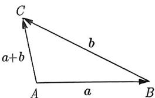
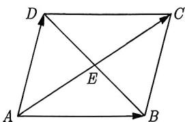
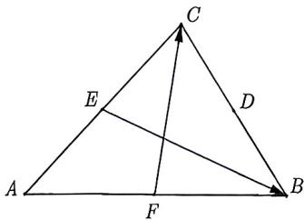
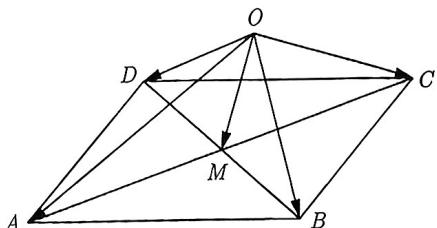

import Guide from '@/components/Guide.astro';
import Knowledge from '@/components/Knowledge.astro';
import Example from '@/components/Example.astro';
import Analysis from '@/components/Analysis.astro';
import Solution from '@/components/Solution.astro';
import Variant from '@/components/Variant.astro';
import Note from '@/components/Note.astro';
import Block from '@/components/Block.astro';
import Summary from '@/components/Summary.astro';

<Knowledge title="知识点 3.1">
向量加法的三角形法则: 如图 3-1 所示, $a + b = \overrightarrow{AB} + \overrightarrow{BC} = \overrightarrow{AC}$ . 向量加法的平行四边形法则: 如图 3-2 所示, 在平行四边形 $ABCD$ 中, $\overrightarrow{AB} + \overrightarrow{AD} = \overrightarrow{AC}$ .

<figure class="vp-figure">
  
  <figcaption>图3-1</figcaption>
</figure>

<figure class="vp-figure">
  
  <figcaption>图3-2</figcaption>
</figure>

在如图3-2所示的平行四边形ABCD中，连接AC,BD,交点为E，则由平行四边形法则得 $\overrightarrow{AB} + \overrightarrow{AD} = \overrightarrow{AC} = 2\overrightarrow{AE}$ 这个式子是三角形中线的向量形式，总结如下：
</Knowledge>

在 $\triangle ABD$ 中, E 是边 BD 的中点, 则 $\overrightarrow{AE} = \frac{1}{2} (\overrightarrow{AB} + \overrightarrow{AD})$ .

<Example title="例 3.1">
设 D, E, F 分别为 $\triangle ABC$ 三边 BC, CA, AB 的中点，则 $\overrightarrow{EB} + \overrightarrow{FC} = (\quad)$ .
A. $\overrightarrow{AD}$ B. $\frac{1}{2}\overrightarrow{AD}$ C. $\frac{1}{2}\overrightarrow{BC}$ D. $\overrightarrow{BC}$

<Solution title="解析 1">
如图 3-3 所示, 因为 D, E, F 分别为 BC, CA, AB 的中点, 所以 $\overrightarrow{EB} + \overrightarrow{FC} = (\overrightarrow{EC} + \overrightarrow{CB}) + (\overrightarrow{FB} + \overrightarrow{BC}) = \overrightarrow{EC} + \overrightarrow{FB} = \frac{1}{2} \overrightarrow{AC} + \frac{1}{2} \overrightarrow{AB} = \frac{1}{2} (\overrightarrow{AC} + \overrightarrow{AB}) = \overrightarrow{AD}$ , 故选 A.
</Solution>

<Solution title="解析 2">
$\overrightarrow{EB} + \overrightarrow{FC} = -\overrightarrow{BE} - \overrightarrow{CF} = -\frac{\overrightarrow{BA} + \overrightarrow{BC}}{2} - \frac{\overrightarrow{CA} + \overrightarrow{CB}}{2} = \frac{\overrightarrow{AB} + \overrightarrow{AC}}{2} = \overrightarrow{AD}$ . 故选 A.
</Solution>

比较解析 1 与解析 2, 发现恰当地运用三角形中线的向量形式可以简化向量的运算.
</Example>

<Example title="例 3.2">
(2014 福建文 10) 设 M 为平行四边形 ABCD 对角线的交点, O 为平行四边形 ABCD 所在平面内任意一点, 则 $\overrightarrow{OA} + \overrightarrow{OB} + \overrightarrow{OC} + \overrightarrow{OD}$ 等于 ( ). A. $\overrightarrow{OM}$ B. $2\overrightarrow{OM}$ C. $3\overrightarrow{OM}$ D. $4\overrightarrow{OM}$

<Solution title="解析">
如图3-4所示, $OM$ 既是 $\triangle OAC$ 的中线, 也是 $\triangle OBD$ 的中线, 根据三角形中线的向量形式得到 $\overrightarrow{OA} + \overrightarrow{OC} = 2\overrightarrow{OM}$ , $\overrightarrow{OB} + \overrightarrow{OD} = 2\overrightarrow{OM}$ , 所以 $\overrightarrow{OA} + \overrightarrow{OB} + \overrightarrow{OC} + \overrightarrow{OD} = 4\overrightarrow{OM}$ , 故选D.
</Solution>

<figure class="vp-figure">
  
  <figcaption>图3-3</figcaption>
</figure>

<figure class="vp-figure">
  
  <figcaption>图3-4</figcaption>
</figure>
</Example>

向量加法的特征是首尾衔接, 例如 $\overrightarrow{AB} + \overrightarrow{BC} = \overrightarrow{AC}$ . 而向量的减法规则是将两个向量的起点放在一起, 以减向量的终点为起点, 被减向量的终点为终点, 得到的向量称为差向量.

如果你觉得减法的规则很绕, 可以将减法转化为加法, 即取减向量的相反向量, 然后进行向量的加法运算. 例如, $\overrightarrow{AB} - \overrightarrow{AC} = \overrightarrow{AB} + (-\overrightarrow{AC}) = \overrightarrow{AB} + \overrightarrow{CA} = \overrightarrow{CB}$ . 这样可以更方便地处理减法运算.

<Example title="例 3.3">
已知 P 为 $\triangle ABC$ 所在平面内的任意一点, 若 $\overrightarrow{PA} + \overrightarrow{PB} + \overrightarrow{PC} = \overrightarrow{AB}$ , 则点 P 与 $\triangle ABC$ 的位置关系是 ( ).

A. 点 P 在线段 AB 上
B. 点 P 在线段 BC 上
C. 点 P 在线段 AC 上
D. 点 P 在 $\triangle ABC$ 外部

<Solution title="解析">
由 $\overrightarrow{PA} + \overrightarrow{PB} + \overrightarrow{PC} = \overrightarrow{AB}$ 得到 $\overrightarrow{PA} + \overrightarrow{PB} + \overrightarrow{PC} = \overrightarrow{PB} - \overrightarrow{PA}$ ，即 $\overrightarrow{PC} = -2\overrightarrow{PA} = 2\overrightarrow{AP}$ ，所以点 P 在线段 AC 上。故选 C.
</Solution>
</Example>

在进行向量运算时, 要尽量将问题转化到平行四边形或三角形中, 选择从同一顶点出发的向量或首尾相接的向量, 并选用合适的回路. 通过运用向量的加法和减法运算, 来求解问题. 这种方法可以简化向量运算的过程, 使问题更易于处理和理解.

<Example title="例 3.4">
(2023 安徽统考) 已知 $\triangle ABC$ 的面积为 3, P, Q 为 $\triangle ABC$ 所在平面内异于点 A 的两个不同的点, 若 $\overrightarrow{PA} - (1 + 2\lambda)\overrightarrow{PC} = 0$ , 且 $\overrightarrow{QA} + \lambda\overrightarrow{QB} + \lambda\overrightarrow{QC} = \lambda\overrightarrow{BC}$ , 其中 $\lambda > 0$ , 则 $\triangle APQ$ 的面积为 \_\_\_\_.

<Analysis>
因为 $\triangle ABC$ 与 $\triangle APQ$ 含有公共角 $A$ , 故只需找到 $AP$ 与 $AC$ , $AQ$ 与 $AB$ 的数量关系即可得出面积.
</Analysis>

<Solution title="解析">
首先, 由 $\lambda > 0$ , $\overrightarrow{PA} - (1 + 2\lambda)\overrightarrow{PC} = 0$ 可知 $P$ 在 $AC$ 的延长线上, 设 $AC = 1$ , $CP = x$ , 则由 $\overrightarrow{PA} - (1 + 2\lambda)\overrightarrow{PC} = 0$ , 可知 $1 + x = (1 + 2\lambda)x$ , 即 $x = \frac{1}{2\lambda}$ , 也就是 $\overrightarrow{AP} = \frac{1 + 2\lambda}{2\lambda}\overrightarrow{AC}$ .

又因为 $\overrightarrow{QA} + \lambda \overrightarrow{QB} + \lambda \overrightarrow{QC} = \lambda \overrightarrow{BC}$ , 所以 $\overrightarrow{QA} + \lambda \overrightarrow{QB} + \lambda \overrightarrow{QC} = \lambda (\overrightarrow{QC} - \overrightarrow{QB})$ , 即 $\overrightarrow{AQ} = 2\lambda \overrightarrow{QB}$ , 这说明 $Q$ 在 $AB$ 之间. 设 $QB = 1$ , 则 $AQ = 2\lambda$ , 所以 $\overrightarrow{AQ} = \frac{2\lambda}{1 + 2\lambda}\overrightarrow{AB}$ .

因此 $|AP| = \frac{1 + 2\lambda}{2\lambda} |AC|$ , $|AQ| = \frac{2\lambda}{1 + 2\lambda} |AB|$ . 因为 $\triangle ABC$ 的面积为 3, 所以 $S_{\triangle ABC} = \frac{1}{2} |AB| \cdot |AC| \sin A = 3$ , 则 $S_{\triangle APQ} = \frac{1}{2} \cdot \frac{1 + 2\lambda}{2\lambda} |AC| \cdot \frac{2\lambda}{1 + 2\lambda} |AB| \sin A = \frac{1}{2} |AC| \cdot |AB| \sin A = 3$ . 所以 $\triangle APQ$ 的面积为 3, 故填 3.
</Solution>
</Example>

<Variant title="变式 3.4.1">
(2023 山东统考) 在 $\triangle ABC$ 中, 若 $|\overrightarrow{AB} + \overrightarrow{AC}| = 2$ , $|\overrightarrow{BC} + \overrightarrow{BA}| = 3$ , 则 $\triangle ABC$ 面积的最大值为 ( ).

A. $\frac{3}{8}$ B. $\frac{3}{4}$ C. 1

D. $\frac{\sqrt{5}}{2}$
</Variant>

<Knowledge title="知识点 3.2">
向量共线定理: 向量 $a(a \neq 0)$ 与向量 b 共线的充要条件是: 存在唯一一个实数 $\lambda$ , 使得 $b = \lambda a$ .
</Knowledge>

向量共线定理的应用需要特别注意 $a \neq 0$ ，否则，若 $a = 0$ 且 $b \neq 0$ ，则不存在 $\lambda \in \mathbb{R}$ ，使得 $b = \lambda a$ ；若 $a = 0$ 且 $b = 0$ ，则使得 $b = \lambda a$ 成立的实数 $\lambda$ 不唯一。

<Example title="例 3.5">
(2015 全国Ⅱ理 13) 设向量 a, b 不平行, 向量 $\lambda a + b$ 与 $a + 2b$ 平行, 则实数 $\lambda =$ \_\_\_\_ .

<Solution title="解析">
由于向量 $\lambda a + b$ 与 $a + 2b$ 平行, 所以由向量共线定理可知, 存在唯一的实数 $\mu$ , 使得 $\lambda a + b = \mu(a + 2b)$ , 对照系数可得 $\left\{\begin{aligned}\mu &= \lambda \\ 2\mu &= 1\end{aligned}\right.$ , 解得 $\lambda = \frac{1}{2}$ . 故填 $\frac{1}{2}$ .
</Solution>
</Example>

向量只有大小和方向两个要素, 与起点无关. 不同的是, 有向线段有起点、方向与长度三个要素. 如果将向量用有向线段表示, 那么共线定理就可以解决三点共线问题.

<Example title="例 3.6">
已知向量 $e_{1}, e_{2}$ 是两个不共线的向量, $\overrightarrow{AB} = 3e_{1} + 2e_{2}, \overrightarrow{CB} = ke_{1} + e_{2}, \overrightarrow{CD} = 3e_{1} - 2ke_{2}$ , 若 A, B, D 三点共线, 则 k 等于 ( ).

A. $-\frac{9}{4}$ B. $-\frac{4}{9}$ C. $-\frac{3}{8}$ D. $-\frac{8}{3}$

<Solution title="解析">
若 A, B, D 三点共线，则存在一个实数 $\lambda$ ，使得 $\overrightarrow{AB} = \lambda \overrightarrow{BD}$ ，又 $\overrightarrow{AB} = 3e_{1} + 2e_{2}$ ，而 $\overrightarrow{BD} = \overrightarrow{CD} - \overrightarrow{CB} = (3 - k)e_{1} - (2k + 1)e_{2}$ ，则 $3e_{1} + 2e_{2} = \lambda[(3 - k)e_{1} - (2k + 1)e_{2}]$ ，对照系数可得 $\left\{\begin{aligned}&3=\lambda(3-k)\\ &2=-\lambda(2k+1)\end{aligned}\right.$ ，解得 $k=-\frac{9}{4}$ . 故选 A.
</Solution>
</Example>

<Example title="例 3.7">
(2022 新高考 I 3) 在 $\triangle ABC$ 中, 点 D 在边 AB 上, BD = 2DA. 记 $\overrightarrow{CA} = m, \overrightarrow{CD} = n$ , 则 $\overrightarrow{CB} = (\quad)$ .
A. $3m - 2n$ B. $-2m + 3n$ C. $3m + 2n$ D. $2m + 3n$

<Solution title="解析">
因为 $\overrightarrow{BD}=2\overrightarrow{DA}$ ，所以 B, D, A 三点共线。由向量的减法可得 $\overrightarrow{CD}-\overrightarrow{CB}=2(\overrightarrow{CA}-\overrightarrow{CD})$ ，整理得 $\overrightarrow{CB}=3\overrightarrow{CD}-2\overrightarrow{CA}=3n-2m$ 。故选 B.
</Solution>
</Example>

虽然本小节的三点共线我们讲的很基础, 但是三点共线问题的难易度不会止步于此, 我们会在 3.4 节深入研究三点共线问题.

<Variant title="变式 3.7.1">
（2023 重庆统考）已知点 D, G 为 $\triangle ABC$ 所在平面内的点， $\overrightarrow{AD} = \frac{1}{4}\overrightarrow{AB} + \frac{3}{4}\overrightarrow{AC}$ ， $\overrightarrow{AG} = \frac{1}{3}(\overrightarrow{AB} + \overrightarrow{AC})$ ，记 $S_{1}, S_{2}$ 分别为 $\triangle ABC, \triangle BDG$ 的面积，那么 $\frac{S_{2}}{S_{1}} = (\quad)$ .
A. $\frac{1}{4}$ B. $\frac{1}{5}$ C. $\frac{1}{6}$ D. $\frac{1}{7}$
</Variant>
