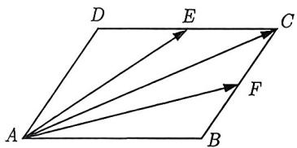
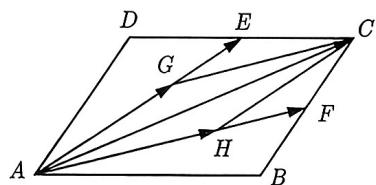
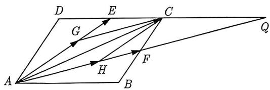

import Guide from '@/components/Guide.astro';
import Knowledge from '@/components/Knowledge.astro';
import Example from '@/components/Example.astro';
import Analysis from '@/components/Analysis.astro';
import Solution from '@/components/Solution.astro';
import Variant from '@/components/Variant.astro';
import Note from '@/components/Note.astro';
import Block from '@/components/Block.astro';

在高中数学中, 能被称为基本定理的不多, 可见向量基本定理在向量中的地位, 内容如下所示:

<Block title="平面向量基本定理">
如果 $e_1, e_2$ 是同一平面内的两个不共线向量，那么对于这一平面内的任一向量 $a$ ，有且只有一对实数 $\lambda_1, \lambda_2$ ，使 $a = \lambda_1 e_1 + \lambda_2 e_2$ ，其中 $\{e_1, e_2\}$ 是一组基底。
</Block>

<Example title="例 3.8">
如图 3-5 所示, 在平行四边形 ABCD 中, E 和 F 分别是边 CD 和 BC 的中点, 若 $\overrightarrow{AC} = \lambda \overrightarrow{AE} + \mu \overrightarrow{AF}$ , 其中 $\lambda, \mu \in R$ , 则 $\lambda + \mu =$ \_\_\_\_ .

<figure class="vp-figure">
  
  <figcaption>图3-5</figcaption>
</figure>

<figure class="vp-figure">
  
  <figcaption>图3-6</figcaption>
</figure>

<figure class="vp-figure">
  
  <figcaption>图3-7</figcaption>
</figure>

<Solution title="解析 1">
分解法: 如图 3-6 所示, 过 C 分别作 AF 和 AE 的平行线, 交 AE 于 G, AF 于 H, 得到平行四边形 AHCG, 则 $\overrightarrow{AC} = \overrightarrow{AG} + \overrightarrow{AH} = \lambda \overrightarrow{AE} + \mu \overrightarrow{AF}$ , 其中 $\lambda = \frac{|\overrightarrow{AG}|}{|\overrightarrow{AE}|}, \mu = \frac{|\overrightarrow{AH}|}{|\overrightarrow{AF}|}$ .

如图3-7所示, 设 $DC$ 和 $AF$ 的延长线交于点 $Q$ , 因为 $F$ 为 $BC$ 中点, $CF \parallel DA$ , 所以 $\frac{QC}{QD} = \frac{CF}{DA} = \frac{1}{2}$ , 又因为 $E$ 为 $CD$ 中点, $CH \parallel AE$ , 所以 $\lambda = \frac{AG}{AE} = \frac{CH}{AE} = \frac{QC}{EQ} = \frac{QC}{\frac{3}{4} QD} = \frac{2}{3}$ , 同理, $\mu = \frac{AH}{AF} = \frac{2}{3}$ . 因此 $\lambda + \mu = \frac{4}{3}$ .
</Solution>

除了分解法, 我们还可以利用向量加法和减法绕来绕去的特点, 采用回路法表示向量, 请看下面解法:

<Solution title="解析 2">
回路法: 如图 3-5 所示, 因为 E 和 F 分别是边 CD 和 BC 的中点, 所以

$$
\overrightarrow {A C} = \overrightarrow {A E} + \overrightarrow {E C} = \overrightarrow {A E} + \frac {1}{2} \overrightarrow {A B},
$$

$$
\overrightarrow {A C} = \overrightarrow {A F} + \overrightarrow {F C} = \overrightarrow {A F} + \frac {1}{2} \overrightarrow {A D}.
$$

两式相加得 $2\overrightarrow{AC} = \overrightarrow{AE} +\overrightarrow{AF} +\frac{1}{2} (\overrightarrow{AB} +\overrightarrow{AD}) = \overrightarrow{AE} +\overrightarrow{AF} +\frac{1}{2}\overrightarrow{AC},$ 即 $\overrightarrow{AC} = \frac{2}{3}\overrightarrow{AE} +\frac{2}{3}\overrightarrow{AF},$ 所以 $\lambda +\mu = \frac{4}{3}.$ 故填 $\frac{4}{3}.$
</Solution>
</Example>

我们知道在平面直角坐标系中, 每一个点都可以用一对有序实数 (即它的坐标) 表示, 那么对于直角坐标平面内的每一个向量, 同样可以用有序实数对来表示它的坐标.

<Knowledge title="知识点 3.3">
1. 向量加法、减法、数乘向量
(1) 设 $\boldsymbol{a} = (x_{1}, y_{1})$ , $\boldsymbol{b} = (x_{2}, y_{2})$ ，则 $\boldsymbol{a} + \boldsymbol{b} = (x_{1} + x_{2}, y_{1} + y_{2})$ , $\boldsymbol{a} - \boldsymbol{b} = (x_{1} - x_{2}, y_{1} - y_{2})$ , $\lambda\boldsymbol{a}=(\lambda x_{1},\lambda y_{1}).$ (2) 设 $A(x_{1},y_{1})$ , $B(x_{2},y_{2})$ , 则 $\overrightarrow{AB}=(x_{2}-x_{1},y_{2}-y_{1})$ .
2. 平面向量共线
设 $\boldsymbol{a}=(x_{1},y_{1}),\boldsymbol{b}=(x_{2},y_{2})$ ，其中 $b\neq0$ ，则 $a\parallel b\Leftrightarrow x_{1}y_{2}-x_{2}y_{1}=0$ .
</Knowledge>

<Example title="例 3.9">
(2023 河南联考) 已知平面向量 $a = (-2, 1)$ , $b = (3, 2)$ ，且 $2a - c = b$ 。若 $(a - mc) \parallel (2b - a)$ ，则 m = \_\_\_\_.

<Solution>
由 $a=(-2,1)$ , $b=(3,2)$ , 2a-c=b, 可得 $c=2a-b=(-4,2)-(3,2)=(-7,0)$ , 而 $a-mc=(-2,1)-m(-7,0)=(7m-2,1)$ , $2b-a=(6,4)-(-2,1)=(8,3)$ . 因为 $(a-mc)/(2b-a)$ , 所以 $3(7m-2)-1\times8=0$ , 解得 $m=\frac{2}{3}$ , 故填 $\frac{2}{3}$ .
</Solution>
</Example>

<Example title="例 3.10">
(2023 广东佛山统考) 在平面直角坐标系 $xOy$ 中, 点 $P$ 为单位圆上的任意一点, $M(3,0)$ , $N(-1,1)$ . 若 $\overrightarrow{OP} = \lambda \overrightarrow{OM} + \mu \overrightarrow{ON}$ , 则 $3\lambda + \mu$ 的最大值为 \_\_\_\_.

<Solution>
因为点 P 为单位圆上的任一点, 所以可设 $P(\cos \alpha, \sin \alpha)$ , 由 $\overrightarrow{OP} = \lambda \overrightarrow{OM} + \mu \overrightarrow{ON} = \lambda (3, 0) + \mu (-1, 1) = (3\lambda - \mu, \mu)$ , 所以 $\left\{\begin{aligned}3\lambda - \mu &= \cos \alpha \\ \mu &= \sin \alpha\end{aligned}\right.$ , 可得 $\left\{\begin{aligned}\lambda &= \frac{1}{3} \cos \alpha + \frac{1}{3} \sin \alpha \\ \mu &= \sin \alpha\end{aligned}\right.$ , 则

$$
3 \lambda + \mu = \sin \alpha + \cos \alpha + \sin \alpha = 2 \sin \alpha + \cos \alpha = \sqrt {5} \sin (\alpha + \varphi) \leqslant \sqrt {5},
$$

其中 $\varphi$ 为锐角, 且 $\tan \varphi = \frac{1}{2}$ , 所以 $3\lambda + \mu$ 的最大值为 $\sqrt{5}$ , 故填 $\sqrt{5}$ .
</Solution>
</Example>
