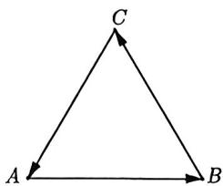
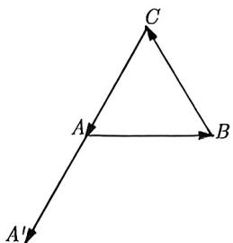
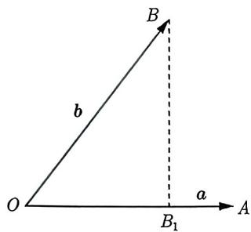
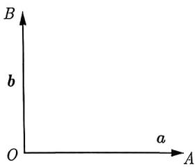
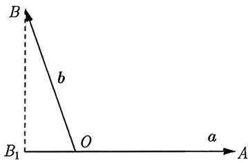
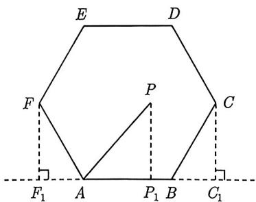
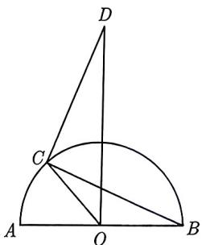

import Guide from '@/components/Guide.astro';
import Knowledge from '@/components/Knowledge.astro';
import Example from '@/components/Example.astro';
import Analysis from '@/components/Analysis.astro';
import Solution from '@/components/Solution.astro';
import Variant from '@/components/Variant.astro';
import Note from '@/components/Note.astro';
import Block from '@/components/Block.astro';

在3.1.1节中, 我们详细阐述了向量的加法、减法以及数乘运算, 这些都属于向量的线性运算. 在本小节中, 我们将学习向量的另一种运算, 即向量的数量积.

<Knowledge title="知识点 3.4">
已知两个非零向量 a 和 b，它们的夹角为 $\theta$ ，把数量 $|a||b|\cos\theta$ 叫作 a 和 b 的数量积（或内积），记作 $a \cdot b$ ，即 $a \cdot b = |a||b|\cos\theta$ .
</Knowledge>

<Example title="例 3.11">
 等边 $\triangle ABC$ 的边长为 1, $\overrightarrow{BC} = a$ , $\overrightarrow{CA} = b$ , $\overrightarrow{AB} = c$ , 那么 $a \cdot b + b \cdot c + c \cdot a$ 等于 ( ). A. 3 B. -3 C. $\frac{3}{2}$ D. $-\frac{3}{2}$

<Solution>
如图 3-8 所示, 由于 $\triangle ABC$ 为等边三角形, 故三个内角都为 $60^{\circ}$ . 如图 3-9 所示, 将向量 $\overrightarrow{CA}$ 平移到向量 $\overrightarrow{AA'}$ , 得到 $\langle b, c \rangle = \langle \overrightarrow{CA}, \overrightarrow{AB} \rangle = \langle \overrightarrow{AA'}, \overrightarrow{AB} \rangle = 120^{\circ}$ , 同理 $\langle a, b \rangle = \langle a, c \rangle = 120^{\circ}$ . 则 $a \cdot b + b \cdot c + c \cdot a = |a||b|\cos 120^{\circ} + |b||c|\cos 120^{\circ} + |a||c|\cos 120^{\circ} = -\frac{3}{2}$ , 故选 D.

<figure class="vp-figure">
  
  <figcaption>图3-8</figcaption>
</figure>

<figure class="vp-figure">
  
  <figcaption>图3-9</figcaption>
</figure>
</Solution>
</Example>

在例3.11中, 因为知道向量的模长, 并且能求出任意两个向量的夹角, 所以我们能够求出数量积. 当然, 并不是所有的数量积都需要找出向量的夹角, 有时我们通过数量积的运算律也可以绕开向量的夹角, 比如下面例题:

<Example title="例 3.12">
（2021 新高考 II 15）已知向量 $a + b + c = 0, |a| = 1, |b| = |c| = 2,$ 则 $a \cdot b + b \cdot c + c \cdot a =$ \_\_\_\_.

<Solution>
由 $a + b + c = 0$ ，等式两边同时平方，可得 $a^{2} + b^{2} + c^{2} + 2a \cdot b + 2a \cdot c + 2b \cdot c = 0$ ，又因为 $|a| = 1, |b| = |c| = 2$ ，所以 $a \cdot b + b \cdot c + c \cdot a = -\frac{9}{2}$ 。故填 $-\frac{9}{2}$ 。
</Solution>
</Example>

<Variant title="变式 3.12.1">
(2022 全国乙理 3) 已知向量 a, b 满足 $|a| = 1$ , $|b| = \sqrt{3}$ , $|a - 2b| = 3$ , 则 $a \cdot b =$ ( ). A. -2 B. -1 C. 1 D. 2
</Variant>

<Knowledge title="知识点 3.5">
已知两个非零向量 $\pmb{a}$ 和 $\pmb{b}$ , 则 $|\lambda a + \mu b| = \sqrt{\lambda^2 a^2 + \mu^2 b^2 + 2\lambda\mu a \cdot b}$ .
</Knowledge>

<Example title="例 3.13">
（2020 全国Ⅲ理 6）已知向量 a, b 满足 $|a| = 5, |b| = 6, a \cdot b = -6$ ，则 $\cos\langle a, a + b\rangle =$ A. $-\frac{31}{35}$ B. $-\frac{19}{35}$ C. $\frac{17}{35}$ D. $\frac{19}{35}$

<Solution>
因为 $|a| = 5, |b| = 6, a \cdot b = -6$ , 所以 $a \cdot (a + b) = a^2 + a \cdot b = 25 - 6 = 19$ , 又因为 $|a + b| = \sqrt{(a + b)^2} = \sqrt{a^2 + 2a \cdot b + b^2} = \sqrt{25 - 12 + 36} = 7$ , 则

$$
\cos \langle \boldsymbol {a}, \boldsymbol {a} + \boldsymbol {b} \rangle = \frac {\boldsymbol {a} \cdot (\boldsymbol {a} + \boldsymbol {b})}{| \boldsymbol {a} | \cdot | \boldsymbol {a} + \boldsymbol {b} |} = \frac {1 9}{5 \times 7} = \frac {1 9}{3 5}.
$$

故选D.
</Solution>
</Example>

<Example title="例 3.14">
(2014 江西理 14) 已知单位向量 $e_{1}$ 与 $e_{2}$ 的夹角为 $\alpha$ ，且 $\cos\alpha=\frac{1}{3}$ ，向量 $a=3e_{1}-2e_{2}$ ， $b=3e_{1}-e_{2}$ 的夹角为 $\beta$ ，则 $\cos\beta=$ \_\_\_\_.

<Solution>
由于已知 $e_1$ 与 $e_2$ 的模长和夹角，故以 $\{e_1, e_2\}$ 为基底，分别求出 $a \cdot b, |a|, |b|$ .

$$
\boldsymbol {a} \cdot \boldsymbol {b} = (3 e _ {1} - 2 e _ {2}) \cdot (3 e _ {1} - e _ {2}) = 9 e _ {1} ^ {2} - 9 e _ {1} \cdot e _ {2} + 2 e _ {2} ^ {2} = 8,
$$

$$
\left| \boldsymbol {a} \right| = \left| 3 e _ {1} - 2 e _ {2} \right| = \sqrt {\left(3 e _ {1} - 2 e _ {2}\right) ^ {2}} = \sqrt {9 e _ {1} ^ {2} - 1 2 e _ {1} \cdot e _ {2} + 4 e _ {2} ^ {2}} = 3,
$$

$$
| \boldsymbol {b} | = | 3 \boldsymbol {e} _ {1} - \boldsymbol {e} _ {2} | = \sqrt {\left(3 \boldsymbol {e} _ {1} - \boldsymbol {e} _ {2}\right) ^ {2}} = \sqrt {9 \boldsymbol {e} _ {1} ^ {2} - 6 \boldsymbol {e} _ {1} \cdot \boldsymbol {e} _ {2} + \boldsymbol {e} _ {2} ^ {2}} = \sqrt {8},
$$

则 $\cos \beta = \frac{\pmb{a} \cdot \pmb{b}}{|\pmb{a}| |\pmb{b}|} = \frac{2\sqrt{2}}{3}$ , 故填 $\frac{2\sqrt{2}}{3}$ .
</Solution>
</Example>

<Variant title="变式 3.14.1">
（2013 浙江文 17）设 $e_{1}, e_{2}$ 是单位向量，非零向量 $b = xe_{1} + ye_{2}$ ，若 $e_{1}, e_{2}$ 的夹角为 $\frac{\pi}{6}$ ，则 $\frac{|x|}{|b|}$ 的最大值等于 \_\_\_\_.
</Variant>

<Variant title="变式 3.14.2">
已知向量 a, b 满足 $|a| = |b| = 1$ ，且 $|ka + b| = \sqrt{3}|a - kb|(k > 0)$ ，则向量 a 与 b 的夹角的最大值为 \_\_\_\_.
</Variant>

<Knowledge title="知识点 3.6">
设 $a, b$ 是两个非零向量， $a$ 与 $b$ 的夹角为 $\theta$ ，则称 $|b| \cos \theta = \frac{a \cdot b}{|a|}$ 为向量 $b$ 在向量 $a$ 上的投影数量.

令 $a = \overrightarrow{OA}, b = \overrightarrow{OB}$ ，则 b 在 a 方向上的投影数量有以下三种情况：

(1) 如图 3-10 所示, b 在 a 上的投影数量为 $\left|\overrightarrow{OB_{1}}\right| = \left|b\right| \cos\langle a, b\rangle$ , 故 $a \cdot b = \left|\overrightarrow{OB_{1}}\right|\left|\overrightarrow{OA}\right|$ ;

(2) 如图 3-11 所示, b 在 a 上的投影数量为 0, 故 $a \cdot b = 0 \cdot |\overrightarrow{OA}| = 0$ ;

(3) 如图 3-12 所示, b 在 a 上的投影数量为 $-|\overrightarrow{OB_{1}}| = |b| \cos\langle a, b\rangle$ , 故 $a \cdot b = -|\overrightarrow{OB_{1}}||\overrightarrow{OA}|$ .

<figure class="vp-figure">
  
  <figcaption>图3-10</figcaption>
</figure>

<figure class="vp-figure">
  
  <figcaption>图3-11</figcaption>
</figure>

<figure class="vp-figure">
  
  <figcaption>图3-12</figcaption>
</figure>

通过投影数量的定义不难理解, 当 $|a|$ 为定值时, $\pmb{a} \cdot \pmb{b}$ 的取值范围是由 $\pmb{b}$ 在 $\pmb{a}$ 上的投影数量 $|b|\cos \langle a, b \rangle$ 决定的, 请看下面例题:
</Knowledge>

<Example title="例 3.15">
(2020 新高考 I7) 已知 P 是边长为 2 的正六边形 ABCDEF 内的一点, 则 $\overrightarrow{AP} \cdot \overrightarrow{AB}$ 的取值范围是 ( ).

A. $(-2,6)$ B. $(-6,2)$ C. $(-2,4)$ D. $(-4,6)$

<Solution>
如图3-13所示， $\overrightarrow{AP} \cdot \overrightarrow{AB} = |\overrightarrow{AP}| |\overrightarrow{AB}| \cos \langle \overrightarrow{AP}, \overrightarrow{AB} \rangle$ ，它的几何意义是 $\overrightarrow{AP}$ 在向量 $\overrightarrow{AB}$ 方向上的投影数量与 $\overrightarrow{AB}$ 的长度的乘积，显然， $P$ 在 $C$ 处时，投影数量取得最大值，则

$$
| \overrightarrow {A C _ {1}} | = | \overrightarrow {A B} | + | \overrightarrow {B C _ {1}} | = | \overrightarrow {A B} | + | \overrightarrow {B C} | \cos 6 0 ^ {\circ} = 3.
$$

所以 $\overrightarrow{AP} \cdot \overrightarrow{AB} < |\overrightarrow{AC_1}| |\overrightarrow{AB}| = 2 \times 3 = 6$ . 同理, 在点 $F$ 处投影数量取得最小值为

图3-13

$$
- | \overrightarrow {A F _ {1}} | = | \overrightarrow {A F} | \cos 1 2 0 ^ {\circ} = 2 \times \left(- \frac {1}{2}\right) = - 1.
$$

所以 $\overrightarrow{AP} \cdot \overrightarrow{AB} > -|\overrightarrow{AF_1}| |\overrightarrow{AB}| = -1 \times 2 = -2$ , 则 $\overrightarrow{AP} \cdot \overrightarrow{AB}$ 的取值范围是 $(-2,6)$ . 故选 A.
</Solution>
</Example>

数量积的几何意义指的是向量的投影问题, 这个投影就是我们常见的投影的数量, 而新教材中对于向量的投影问题新加了一个名词——投影向量.

<Knowledge title="知识点 3.7">
设 $a, b$ 是两个非零向量, $a$ 与 $b$ 的夹角为 $\theta$ . 设 $e$ 是与 $b$ 方向相同的单位向量, 则向量 $a$ 在向量 $b$ 上的投影向量为 $|a|e\cos \theta = |a|\frac{b}{|b|}\cdot \cos \theta = \frac{a\cdot b}{|b|}\cdot \frac{b}{|b|}$ .
</Knowledge>

<Example title="例 3.16">
(2023 江苏统考) 已知向量 a 与 b 满足 $|a| = 2, |b| = 1, |a + b| = \sqrt{3}$ ，则向量 $a + b$ 在向量 a 上的投影向量为（）.
A. $-\frac{1}{4}a$ B. $\frac{1}{4}a$ C. $-\frac{3}{4}a$ D. $\frac{3}{4}a$

<Solution>
因为 $|a + b| = \sqrt{3}$ , 所以 $a^2 + 2a \cdot b + b^2 = 3$ , 又由 $|a| = 2$ , $|b| = 1$ , 可知 $4 + 2a \cdot b + 1 = 3$ , 从而可得 $a \cdot b = -1$ , 所以 $(a + b) \cdot a = a^2 + a \cdot b = 4 - 1 = 3$ . 设 $a + b$ 与 $a$ 的夹角为 $\alpha$ , 则$\cos \alpha = \frac{(\pmb{a} + \pmb{b}) \cdot \pmb{a}}{|\pmb{a} + \pmb{b}| \cdot |\pmb{a}|} = \frac{3}{2\sqrt{3}} = \frac{\sqrt{3}}{2}$ , 于是向量 $\pmb{a} + \pmb{b}$ 在向量 $\pmb{a}$ 上的投影向量为 $|\pmb{a} + \pmb{b}| \cdot \cos \alpha \cdot \frac{\pmb{a}}{|\pmb{a}|} = \sqrt{3} \times \frac{\sqrt{3}}{2} \cdot \frac{\pmb{a}}{2} = \frac{3}{4}\pmb{a}$ , 故选 D.
</Solution>
</Example>

<Variant title="变式 3.16.1">
(2023 福建统考) 如图 3-14 所示, 动点 C 在以 AB 为直径的半圆上 (异于 A, B), $\angle DCB = \frac{\pi}{2}$ , 且 DC = CB, 若 AB = 2, 则 $\overrightarrow{OC} \cdot \overrightarrow{OD}$ 的取值范围为 \_\_\_\_.

</Variant>

下面我们给出数量积坐标运算的相关知识点.

<Knowledge title="知识点 3.8">
已知两个非零向量 $\pmb {a} = (x_{1},y_{1}),\pmb {b} = (x_{2},y_{2})$ ，其中 $\alpha$ 为 $\pmb{a}$ 与 $\pmb{b}$ 的夹角，则(1） $|\pmb {a}| = \sqrt{x_1^2 + y_1^2};$ (2） $\pmb {a}\cdot \pmb {b} = x_1x_2 + y_1y_2;$ (3） $\pmb {a}\bot \pmb {b}\Leftrightarrow x_1x_2 + y_1y_2 = 0;$ (4） $\cos \alpha = \frac{x_1x_2 + y_1y_2}{\sqrt{x_1^2 + y_1^2}\cdot\sqrt{x_2^2 + y_2^2}}.$
</Knowledge>

<Example title="例 3.17">
（2023 衡阳统考 - 多选题）已知点 $A(1,2)$ , $B(3,1)$ , $C(4,m+1)$ , $m \in R$ ，则下列说法正确的是（）.
A. $|\overrightarrow{AB}| = \sqrt{5}$ B. 若 $\overrightarrow{AB} \perp \overrightarrow{BC}$ ，则 m = -2
C. 与向量 $\overrightarrow{AB}$ 同方向的单位向量坐标为 $\left(\frac{2\sqrt{5}}{5}, -\frac{\sqrt{5}}{5}\right)$ D. 若 $\overrightarrow{BA}, \overrightarrow{BC}$ 的夹角为锐角，则 m < 2 且 $m \neq -\frac{1}{2}$

<Solution>
因为 $A(1,2)$ , $B(3,1)$ , $C(4,m+1)$ , 所以 $\overrightarrow{AB} = (2,-1)$ , $\overrightarrow{BC} = (1,m)$ .

选项 A, 由向量模长公式可得 $|\overrightarrow{AB}| = \sqrt{2^2 + (-1)^2} = \sqrt{5}$ , 所以 A 正确.

选项 B, 因为 $\overrightarrow{AB} \perp \overrightarrow{BC}$ , 所以 $\overrightarrow{AB} \cdot \overrightarrow{BC} = 0$ , 从而可得 2 - m = 0, 即 m = 2, 所以 B 错误.

选项 C, 与向量 $\overrightarrow{AB}$ 同方向的单位向量为 $\frac{\overrightarrow{AB}}{|\overrightarrow{AB}|} = \frac{(2, -1)}{\sqrt{5}} = \left(\frac{2\sqrt{5}}{5}, -\frac{\sqrt{5}}{5}\right)$ , 所以 C 正确.

选项 D, 因为 $\overrightarrow{BA}, \overrightarrow{BC}$ 的夹角为锐角, 且 $\overrightarrow{BA} = (-2,1)$ , 所以 $\left\{\begin{aligned}\overrightarrow{BA} \cdot \overrightarrow{BC} &= m - 2 > 0 \\ -\frac{1}{2} \neq \frac{m}{1}\end{aligned}\right.$ ，解得 m > 2, 所以 D 错误.

综上所述, 选 AC.
</Solution>

(1) 向量 $\overrightarrow{AB}$ 同方向的单位向量为 $\frac{\overrightarrow{AB}}{|\overrightarrow{AB}|}$ , 反方向的单位向量为 $-\frac{\overrightarrow{AB}}{|\overrightarrow{AB}|}$ .

(2) 若向量 $a$ 与 $b$ 的夹角为锐角, 则 $a \cdot b > 0$ 且 $a$ 与 $b$ 不共线; 若向量 $a$ 与 $b$ 的夹角为钝角, 则 $a \cdot b < 0$ 且 $a$ 与 $b$ 不共线.
</Example>

<Example title="例 3.18">
(2022 新高考Ⅱ4) 已知 $a = (3, 4)$ , $b = (1, 0)$ , $c = a + tb$ , 若 $\langle a, c \rangle = \langle b, c \rangle$ , 则 t = ( ). A. -6 B. -5 C. 5 D. 6

<Solution>
根据题意可得 $c = a + tb = (3,4) + t(1,0) = (3 + t,4)$ ，由 $\langle a,c\rangle = \langle b,c\rangle$ ，可得 $\cos \langle a,c\rangle = \cos \langle b,c\rangle$ ，于是 $\frac{a\cdot c}{|a||c|} = \frac{b\cdot c}{|b||c|}$ ，即 $\frac{9 + 3t + 16}{5|c|} = \frac{3 + t}{|c|}$ ，解得 $t = 5$ ，故选C.
</Solution>
</Example>

<Example title="例 3.19">
(2021 新高考 I 10 - 多选题) 已知 O 为坐标原点, 点 $P_{1}(\cos \alpha, \sin \alpha)$ , $P_{2}(\cos \beta, -\sin \beta)$ , $P_{3}(\cos (\alpha + \beta), \sin (\alpha + \beta))$ , $A(1, 0)$ , 则 ( ).  
A. $|\overrightarrow{OP_{1}}| = |\overrightarrow{OP_{2}}|$ B. $|\overrightarrow{AP_{1}}| = |\overrightarrow{AP_{2}}|$ C. $\overrightarrow{OA} \cdot \overrightarrow{OP_{3}} = \overrightarrow{OP_{1}} \cdot \overrightarrow{OP_{2}}$ D. $\overrightarrow{OA} \cdot \overrightarrow{OP_{1}} = \overrightarrow{OP_{2}} \cdot \overrightarrow{OP_{3}}$

<Solution>
由题意可知 $\overrightarrow{OP_1} = (\cos \alpha, \sin \alpha), \overrightarrow{OP_2} = (\cos \beta, -\sin \beta), \overrightarrow{OP_3} = (\cos (\alpha + \beta), \sin (\alpha + \beta)),$ $\overrightarrow{OA} = (1, 0), \overrightarrow{AP_1} = (\cos \alpha - 1, \sin \alpha), \overrightarrow{AP_2} = (\cos \beta - 1, -\sin \beta)$ .

选项 A, $\left|\overrightarrow{OP_{1}}\right|=\sqrt{\cos^{2}\alpha+\sin^{2}\alpha}=1,\left|\overrightarrow{OP_{2}}\right|=\sqrt{\cos^{2}\beta+(-\sin^{2}\beta)}=1,$ 所以 A 正确.

选项 B, 因为 $\left|\overrightarrow{AP_{1}}\right|=\sqrt{(\cos\alpha-1)^{2}+\sin^{2}\alpha}=\sqrt{2-2\cos\alpha},\left|\overrightarrow{AP_{2}}\right|=\sqrt{(\cos\beta-1)^{2}+\sin^{2}\beta}=\sqrt{2-2\cos\beta},$ 且 $\alpha$ 与 $\beta$ 不确定, 所以 $\left|\overrightarrow{AP_{1}}\right|=\left|\overrightarrow{AP_{2}}\right|$ 不一定成立, 故 B 错误.

选项 C, 因为 $\overrightarrow{OA} \cdot \overrightarrow{OP_3} = 1 \times \cos (\alpha + \beta) + 0 \times \sin (\alpha + \beta) = \cos (\alpha + \beta), \overrightarrow{OP_1} \cdot \overrightarrow{OP_2} = \cos \alpha \cos \beta - \sin \alpha \sin \beta = \cos (\alpha + \beta)$ , 所以 $\overrightarrow{OA} \cdot \overrightarrow{OP_3} = \overrightarrow{OP_1} \cdot \overrightarrow{OP_2}$ , 故 C 正确.

选项D, 因为 $\overrightarrow{OA} \cdot \overrightarrow{OP_1} = 1 \times \cos \alpha + 0 \times \sin \alpha = \cos \alpha, \overrightarrow{OP_2} \cdot \overrightarrow{OP_3} = \cos \beta \cos (\alpha + \beta) - \sin \beta \sin (\alpha + \beta) = \cos (\alpha + 2\beta)$ , 所以 $\overrightarrow{OA} \cdot \overrightarrow{OP_1} \neq \overrightarrow{OP_2} \cdot \overrightarrow{OP_3}$ , 故D错误.

综上所述, 选 AC.
</Solution>
</Example>

<Variant title="变式 3.19.1">
(2023 新高考 I 3) 已知向量 $\boldsymbol{a} = (1, 1)$ , $\boldsymbol{b} = (1, -1)$ ，若 $(\boldsymbol{a} + \lambda \boldsymbol{b}) \perp (\boldsymbol{a} + \mu \boldsymbol{b})$ ，则（）.
A. $\lambda + \mu = 1$ B. $\lambda + \mu = -1$ C. $\lambda\mu = 1$ D. $\lambda\mu = -1$
</Variant>
