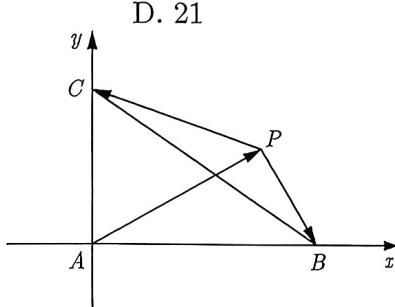
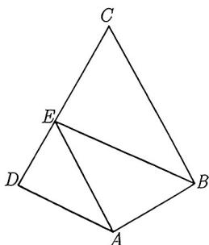
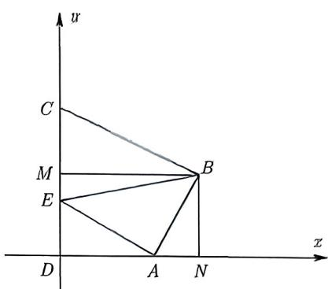

import Guide from '@/components/Guide.astro';
import Knowledge from '@/components/Knowledge.astro';
import Example from '@/components/Example.astro';
import Analysis from '@/components/Analysis.astro';
import Solution from '@/components/Solution.astro';
import Variant from '@/components/Variant.astro';
import Note from '@/components/Note.astro';
import Block from '@/components/Block.astro';

若图形中含有直角, 则这样的图形往往会选择以直角点为坐标系的原点, 两直角边所在直线为坐标轴建立坐标系.

<Example title="例 3.20">
(2015 福建理 9) 已知 $\overrightarrow{AB} \perp \overrightarrow{AC}, |\overrightarrow{AB}| = \frac{1}{t}, |\overrightarrow{AC}| = t.$ 若点 P 是 $\triangle ABC$ 所在平面内的一点，且 $\overrightarrow{AP} = \frac{\overrightarrow{AB}}{|\overrightarrow{AB}|} + \frac{4\overrightarrow{AC}}{|\overrightarrow{AC}|}$ ，则 $\overrightarrow{PB} \cdot \overrightarrow{PC}$ 的最大值等于（）.
A. 13 B. 15 C. 19 D. 21

<figure class="vp-figure">
  
  <figcaption>图3-15</figcaption>
</figure>

<Solution>
因为 $\overrightarrow{AB} \perp \overrightarrow{AC}$ ，出现了垂直关系，故考虑以 A 为坐标原点， $\overrightarrow{AB}, \overrightarrow{AC}$ 所在直线为坐标轴建立直角坐标系，如图 3-15 所示。因为 $|\overrightarrow{AB}| = \frac{1}{t}, |\overrightarrow{AC}| = t$ ，所以 $B\left(\frac{1}{t}, 0\right), C(0, t)$ 。设 $P(x_0, y_0)$ ，由 $\overrightarrow{AP} = \frac{\overrightarrow{AB}}{|\overrightarrow{AB}|} + \frac{4\overrightarrow{AC}}{|\overrightarrow{AC}|}$ 可得点 P 的坐标为 (1,4)。于是

$\overrightarrow{PB} \cdot \overrightarrow{PC} = \left(\frac{1}{t} - 1, -4\right) \cdot (-1, t - 4) = 17 - \left(4t + \frac{1}{t}\right) \leqslant -4 + 17 = 13 (t > 0)$ , 当且仅当 $\frac{1}{t} = 4t$ , 即 $t = \frac{1}{2}$ 时等号成立. 所以 $\overrightarrow{PB} \cdot \overrightarrow{PC}$ 的最大值为 13, 故选 A.
</Solution>
</Example>

例3.20之所以考虑建系的关键在于出现了一个“直角”的信息. 如果几何图形不止一个直角, 那么我们该如何建系呢?

<Example title="例 3.21">
(2018 天津理 8) 如图 3-16 所示, 在平面四边形 ABCD 中, $AB \perp BC$ , $AD \perp CD$ , $\angle BAD = 120^{\circ}$ , AD = AB = 1. 若点 E 为边 CD 上的动点, 则 $\overrightarrow{AE} \cdot \overrightarrow{BE}$ 的最小值为 ( ). A. $\frac{21}{16}$ B. $\frac{3}{2}$ C. $\frac{25}{16}$ D. 3

<Analysis>
由于四边形形状非常特殊, 题干告诉了两个直角, 另一个角为 $120^{\circ}$ , 则第四个内角必然为 $60^{\circ}$ . 要选择 $B, D$ 中的一个点作为坐标原点, 选择哪一个呢? 我们应该选择把动点固定在坐标轴上, 这样会减少变量, 因此, 考虑直角 $\angle ADC$ 来建系.

图3-16
</Analysis>

<Solution>
因为 $AD \perp CD$ ，出现了垂直关系，故考虑以点 D 为坐标原点，DA, DC 所在直线分别为 x 轴、y 轴建立直角坐标系。如图 3-17 所示，过点 B 作 $BN \perp x$ 轴， $BM \perp y$ 轴，在 Rt△ABN 中，因为 AB = 1， $\angle BAN = 180^{\circ} - 120^{\circ} = 60^{\circ}$ ，所以

$$
A N = A B \cos \angle B A N = \frac {1}{2}, \quad B N = A B \sin \angle B A N = \frac {\sqrt {3}}{2}.
$$

故 $BM = DN = AD + AN = \frac{3}{2}$ . 又因为 $\angle C = 360^{\circ} - 90^{\circ} - 90^{\circ} - 120^{\circ} = 60^{\circ}$ , 所以在 Rt $\triangle BMC$ 中, $CM = \frac{BM}{\tan 60^{\circ}} = \frac{\sqrt{3}}{2}$ , 因此 $DC = DM + MC = \sqrt{3}$ , 故 $A(1,0), B\left(\frac{3}{2}, \frac{\sqrt{3}}{2}\right)$ .

图3-17

设 $E(0,y)$ , 其中 $y \in [0,\sqrt{3}]$ , 则 $\overrightarrow{AE} = (-1,y), \overrightarrow{BE} = \left(-\frac{3}{2}, y - \frac{\sqrt{3}}{2}\right)$ , 可得

$$
\overrightarrow {A E} \cdot \overrightarrow {B E} = y ^ {2} - \frac {\sqrt {3}}{2} y + \frac {3}{2} = \left(y - \frac {\sqrt {3}}{4}\right) ^ {2} + \frac {2 1}{1 6} \geqslant \frac {2 1}{1 6},
$$

当且仅当 $y = \frac{\sqrt{3}}{4}$ 时等号成立, 所以 $\overrightarrow{AE} \cdot \overrightarrow{BE}$ 的最小值为 $\frac{21}{16}$ , 故选 A.
</Solution>
</Example>

虽然例3.20与例3.21都是通过建系来解决向量问题, 但是我们还是可以从这两个例子中得出一些建系经验, 这种经验可以很好地引导我们去建系.

<Block title="建议一">
找直角, 如果存在多个直角的情况, 我们应该尽量让参与运算的点中有尽可能多的点位于坐标轴上, 尤其是动点.
</Block>

还有一类题型, 题目中没有告知是什么图形, 相关信息都是用向量表示的, 此时如果含有垂直关系, 那么我们是否能建立平面直角坐标系呢? 请看下面例题:

<Example title="例 3.22">
(2023 成都一诊) 已知平面向量 a, b, c 满足 $a \cdot b = 0$ , $|a| = |b| = 1$ , $(c - a) \cdot (c - b) = \frac{1}{2}$ , 则 $|c - a|$ 的最大值为 ( ).

A. $\sqrt{2}$ B. $1 + \frac{\sqrt{2}}{2}$ C. $\frac{3}{2}$ D. 2

<Solution title="解析 1">
令 $\overrightarrow{OA}=a,\overrightarrow{OB}=b,\overrightarrow{OC}=c,$ 由 $a\cdot b=0,$ 可知 $\overrightarrow{OA}\perp\overrightarrow{OB},$ 出现了垂直关系, 故考虑以 O 为坐标原点, OA, OB 所在直线分别为 x 轴、y 轴建立直角坐标系. 由 $|a|=|b|=1,$ 可知 A(1,0), B(0,1), 因为不确定点 C 的坐标, 故设 $C(x,y)$ . 由 $(c-a)\cdot(c-b)=\frac{1}{2}$ , 可得 $(\overrightarrow{OC}-\overrightarrow{OA})\cdot(\overrightarrow{OC}-\overrightarrow{OB})=\frac{1}{2}$ , 即 $(x-1,y)\cdot(x,y-1)=\frac{1}{2}$ , 化简可得

$$
\left(x - \frac {1}{2}\right) ^ {2} + \left(y - \frac {1}{2}\right) ^ {2} = 1.
$$

而 $|c - a| = |\overrightarrow{OC} -\overrightarrow{OA}| = |\overrightarrow{AC}| = \sqrt{(x - 1)^2 + y^2}$ ，从而所求为圆上的点 $C(x,y)$ 与点 $A(1,0)$ 的距离的最大值，可知圆心 $\left(\frac{1}{2},\frac{1}{2}\right)$ 与点 $A(1,0)$ 的距离 $d$ 加上半径1为最大值，即

$$
\left| \boldsymbol {c} - \boldsymbol {a} \right| _ {\max} = \left| \overrightarrow {A C} \right| _ {\max} = \sqrt {\left(1 - \frac {1}{2}\right) ^ {2} + \left(0 - \frac {1}{2}\right) ^ {2}} + 1 = 1 + \frac {\sqrt {2}}{2},
$$

即 $|\pmb{c} - \pmb{a}|$ 的最大值为 $1 + \frac{\sqrt{2}}{2}$ , 故选 B.
</Solution>

在解析 1 中求 $|c - a|$ 我们利用了几何关系, 很明显通过建系我们得到了点 $C(x, y)$ 满足的圆的方程, 进而考虑了几何法. 当然我们依然可以用代数法, 在有关圆的最值问题中我们更多会用到圆的参数方程.

<Knowledge title="知识点 3.9">
圆 $(x - a)^2 +(y - b)^2 = r^2$ 的参数方程为 $\left\{ \begin{array}{ll}x = a + r\cos \alpha \\ y = b + r\sin \alpha \end{array} \right.$ （α为参数）.
</Knowledge>

<Solution title="解析 2">
由解析 1 可知点 $C(x,y)$ 满足的方程为 $\left(x-\frac{1}{2}\right)^{2}+\left(y-\frac{1}{2}\right)^{2}=1$ ，由圆的参数方程可得 $C\left(\frac{1}{2}+\cos\alpha,\frac{1}{2}+\sin\alpha\right)$ ，则

$$
| \overrightarrow {A C} | = \sqrt {\left(\cos \alpha - \frac {1}{2}\right) ^ {2} + \left(\frac {1}{2} + \sin \alpha\right) ^ {2}} = \sqrt {\frac {3}{2} + \sqrt {2} \sin \left(\alpha - \frac {\pi}{4}\right)}.
$$

由于 $\alpha \in [0,2\pi)$ , 故当 $\sin \left(\alpha - \frac{\pi}{4}\right) = 1$ 时, $|\overrightarrow{AC}|_{\max} = \sqrt{\frac{3 + 2\sqrt{2}}{2}} = \frac{\sqrt{2} + 1}{\sqrt{2}} = 1 + \frac{\sqrt{2}}{2}$ , 故选 B.
</Solution>
</Example>

<Variant title="变式 3.22.1">
(2024 天津 14) 在边长为 1 的正方形 ABCD 中, 点 E 为线段 CD 的三等分点, $CE = \frac{1}{2} DE$ , $\overrightarrow{BE} = \lambda \overrightarrow{BA} + \mu \overrightarrow{BC}$ , 则 $\lambda + \mu =$ \_\_\_\_ ; F 为线段 BE 上的动点, G 为 AF 中点, 则 $\overrightarrow{AF} \cdot \overrightarrow{DG}$ 的最小值为 \_\_\_\_.
</Variant>
