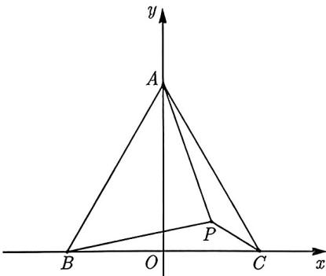
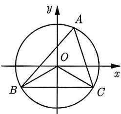
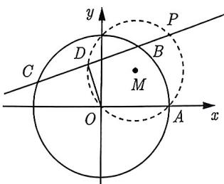
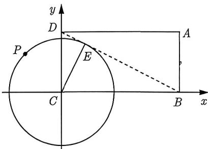

import Guide from '@/components/Guide.astro';
import Knowledge from '@/components/Knowledge.astro';
import Example from '@/components/Example.astro';
import Analysis from '@/components/Analysis.astro';
import Solution from '@/components/Solution.astro';
import Variant from '@/components/Variant.astro';
import Note from '@/components/Note.astro';
import Block from '@/components/Block.astro';

在例3.20～例3.22中，几何图形都出现了明显的直角，并且可以通过直角来建立直角坐标系。然而，在某些题目中，直角并没有那么明显，但建立直角坐标系仍然非常方便。

<Example title="例 3.23">
(2017 全国 II 理 12) 已知 $\triangle ABC$ 是边长为 2 的等边三角形, $P$ 为平面 $ABC$ 内一点, 则 $\overrightarrow{PA} \cdot (\overrightarrow{PB} + \overrightarrow{PC})$ 的最小值是 ( ).

A. -2
B. $-\frac{3}{2}$ C. $-\frac{4}{3}$ D. -1

<Solution>
由于 $\triangle ABC$ 是等边三角形, 取 $BC$ 的中点 $O$ , 则 $AO \perp BC$ , 出现了直角关系, 故以 $O$ 为坐标原点, $OA$ , $BC$ 所在直线分别为 $x$ 轴、 $y$ 轴建立直角坐标系, 如图3-18所示. 由等边三角形的边长为2, 可得 $A(0, \sqrt{3})$ , $B(-1, 0)$ , $C(1, 0)$ .

设 $P(x,y)$ ，由 $\overrightarrow{PA} = (-x,\sqrt{3} -y),\overrightarrow{PB} +\overrightarrow{PC} = (-2x, - 2y),$ 则

$$
\overrightarrow {P A} \cdot (\overrightarrow {P B} + \overrightarrow {P C}) = 2 x ^ {2} + 2 y ^ {2} - 2 \sqrt {3} y = 2 x ^ {2} + 2 \left(y - \frac {\sqrt {3}}{2}\right) ^ {2} - \frac {3}{2} \geqslant - \frac {3}{2},
$$

图3-18

当且仅当 $x = 0, y = \frac{\sqrt{3}}{2}$ 时等号成立, 所以 $\overrightarrow{PA} \cdot (\overrightarrow{PB} + \overrightarrow{PC})$ 的最小值是 $-\frac{3}{2}$ . 故选 B.
</Solution>

</Example>

实际上, 垂直关系虽然非常重要, 但并不是建立坐标系的关键. 本题的关键在于几何图形的对称性. 几何图形上的点几乎都位于坐标轴上, 这为运算带来了极大的便利. 基于此, 对于对称的图形, 我们提出以下建议:

<Block title="建议二">
如果图形是轴对称图形, 那么以对称轴为坐标轴来建系.
</Block>

在众多几何图形中, 对称轴最多的图形莫过于圆, 而涉及圆的考题, 我们往往将圆心作为坐标原点来建系.

<Example title="例 3.24">
(2023 云南模考 7) 已知 $\triangle ABC$ 的外接圆的圆心为 $O$ , 且 $A = \frac{\pi}{3}$ , $BC = 2\sqrt{3}$ , 则 $\overrightarrow{OB} \cdot \overrightarrow{AC}$ 的最大值为 ( ).

A. $\frac{3}{2}$ B. $\sqrt{3}$ C. 2

D. 3

<Solution>
由 $A = \frac{\pi}{3}, BC = 2\sqrt{3}$ 可得圆 $O$ 的直径 $2r = \frac{BC}{\sin A} = 4,$ 即 $r = 2,$ 圆 $O$ 的方程为 $x^{2} + y^{2} = 4,$ 即点 $A$ 为圆 $O$ 上的动点.由 $A = \frac{\pi}{3}$ , 可知 $\angle BOC = \frac{2\pi}{3}$ , 固定 $BC$ , 不妨以圆心 $O$ 为坐标原点, 设 $BC \perp y$ 轴, 建立平面直角坐标系, 如图3-19所示, 可得 $B(-\sqrt{3}, - 1),C(\sqrt{3}, - 1)$ , 为了便于运算, 点 $A$ 的坐标用参数方程来表示, 设为 $A(2\cos \alpha ,2\sin \alpha),\alpha \in \left[0,\frac{7\pi}{6}\right)\cup \left(\frac{7\pi}{6},\frac{11\pi}{6}\right)\cup \left(\frac{11\pi}{6},2\pi\right).$

<figure class="vp-figure">
  
  <figcaption>图3-19</figcaption>
</figure>

由 $\overrightarrow{OB} = (-\sqrt{3}, - 1),\overrightarrow{AC} = (\sqrt{3} -2\cos \alpha , - 1 - 2\sin \alpha)$ ，则

$$
\overrightarrow {O B} \cdot \overrightarrow {A C} = 2 \sin \alpha + 2 \sqrt {3} \cos \alpha - 2 = 4 \sin \left(\alpha + \frac {\pi}{3}\right) - 2.
$$

因为 $\alpha \in \left[0, \frac{7\pi}{6}\right) \cup \left(\frac{7\pi}{6}, \frac{11\pi}{6}\right) \cup \left(\frac{11\pi}{6}, 2\pi\right)$ , 所以 $\sin \left(\alpha + \frac{\pi}{3}\right) \in (-1, 1]$ , 则 $\overrightarrow{OB} \cdot \overrightarrow{AC} \in (-6, 2]$ , 所以 $\overrightarrow{OB} \cdot \overrightarrow{AC}$ 的最大值为 2, 故选 C.
</Solution>

</Example>

在例3.24中, 动点是点 $A$ , 因此 $B, C$ 的位置可以固定. 在建立坐标系时, 我们需要确定真正的"核心动点", 其他点看似是动点, 但实际上固定这些点的位置不会影响整个问题的解答. 例如, 接下来的例子中, 关键在于确定哪个点是真正的"核心动点".

<Example title="例 3.25">
(2023 全国乙理 12) 已知 $\odot O$ 的半径为 1, 直线 $PA$ 与 $\odot O$ 相切于点 $A$ , 直线 $PB$ 与 $\odot O$ 交于 $B, C$ 两点, $D$ 为 $BC$ 的中点, 若 $|PO| = \sqrt{2}$ , 则 $\overrightarrow{PA} \cdot \overrightarrow{PD}$ 的最大值为 ( ).

A. $\frac{1 + \sqrt{2}}{2}$ B. $\frac{1 + 2\sqrt{2}}{2}$ C. $1 + \sqrt{2}$ D. $2 + \sqrt{2}$

<Solution>
以 $\odot O$ 的圆心 $O$ 为坐标原点, $\overrightarrow{OA}$ 为 $x$ 轴的正方向, 建立直角坐标系, 因为直线 $PA$ 与 $\odot O$ 相切于点 $A$ , 所以固定点 $A$ 在坐标轴上, 令 $A(1,0)$ , 如图3-20所示. 又由 $|PO| = \sqrt{2}$ , 此时点 $P$ 的坐标也可以固定, 可求得 $P(1,1)$ . 又由直线 $PB$ 与 $\odot O$ 交于 $B,C$ 两点, 直线 $PB$ 是绕着点 $P$ 在旋转, 而 $D$ 为 $BC$ 的中点, 故点 $D$ 是本题中的"核心动点". 由垂径定理可知 $OD \perp DP$ . 设 $D(x,y)$ , 则 $\overrightarrow{OD} = (x,y)$ , $\overrightarrow{PD} = (x - 1,y - 1)$ , 由 $\overrightarrow{OD} \cdot \overrightarrow{PD} = 0$ , 可得 $\left(x - \frac{1}{2}\right)^2 + \left(y - \frac{1}{2}\right)^2 = \frac{1}{2}$ , 可知点 $D(x,y)$ 是在以 $M\left(\frac{1}{2}, \frac{1}{2}\right)$ 为圆

<figure class="vp-figure">
  
  <figcaption>图3-20</figcaption>
</figure>

心, $\frac{\sqrt{2}}{2}$ 为半径的圆上 (注意点 $D$ 的轨迹不是完整的圆, 具体见下面的注释). 为了便于代数运算, 故设点 $D$ 为 $\left(\frac{1}{2} + \frac{\sqrt{2}}{2} \cos \alpha, \frac{1}{2} + \frac{\sqrt{2}}{2} \sin \alpha\right)$ . 又由 $\overrightarrow{PA} = (0, -1)$ , $\overrightarrow{PD} = \left(\frac{\sqrt{2}}{2} \cos \alpha - \frac{1}{2}, \frac{\sqrt{2}}{2} \sin \alpha - \frac{1}{2}\right)$ , 可知

$$
\overrightarrow {P A} \cdot \overrightarrow {P D} = \frac {1}{2} - \frac {\sqrt {2}}{2} \sin \alpha \leqslant \frac {1 + \sqrt {2}}{2},
$$

当且仅当 $\sin \alpha = -1$ 时等号成立, 此时 $D$ 的坐标为 $\left(\frac{1}{2}, \frac{1 - \sqrt{2}}{2}\right)$ , 显然此时 $D$ 落在圆 $O$ 内, 即能取到最大值, 且 $\overrightarrow{PA} \cdot \overrightarrow{PD}$ 的最大值为 $\frac{1 + \sqrt{2}}{2}$ , 故选 A.
</Solution>

因为点 D 始终是落在圆 $x^{2}+y^{2}=1$ 内，因此点 D 的轨迹方程不是完整的圆，仅仅是圆 $\left(x-\frac{1}{2}\right)^{2}+\left(y-\frac{1}{2}\right)^{2}=\frac{1}{2}$ 的一部分。由 $\left\{\begin{aligned}x^{2}+y^{2}&=1\\ \left(x-\frac{1}{2}\right)^{2}+\left(y-\frac{1}{2}\right)^{2}&=\frac{1}{2}\end{aligned}\right.$ 得到两圆的交线为 $x+y=1$ ，可知点 D 的轨迹为直线 $x+y=1$ 下方部分的圆弧。

</Example>

通过例3.23～例3.25我们可以得出如下经验：

<Block title="经验总结 3.1">
几何图形的对称轴越多, 建系往往越方便.
</Block>

对于拥有多个对称轴的图形, 我们会毫不犹豫地利用其对称性来建立直角坐标系. 多个对称轴的图形在建系方面具有天然的优势. 然而, 当对称图形与其他图形同时存在时, 我们应该如何建立坐标系呢? 下面通过例子来进行说明:

<Example title="例 3.26">
(2017 全国Ⅲ理 12) 在矩形 ABCD 中, AB = 1, AD = 2, 动点 P 在以点 C 为圆心且与 BD 相切的圆上. 若 $\overrightarrow{AP} = \lambda \overrightarrow{AB} + \mu \overrightarrow{AD}$ , 则 $\lambda + \mu$ 的最大值为 ( ).

A. 3
B. $2\sqrt{2}$ C. $\sqrt{5}$ D. 2

<Analysis>
既要考虑圆的对称性, 又要考虑矩形的邻边垂直, 故我们以圆心 $C$ 为原点, 矩形的两个邻边 $CB, CD$ 所在直线为坐标轴建系.
</Analysis>

<Solution title="解析 1">
建立如图 3-21 所示的平面直角坐标系, 则 A(2,1), B(2,0), D(0,1).

设 $P(x,y)$ , 则 $\overrightarrow{AP} = (x - 2, y - 1)$ , $\overrightarrow{AB} = (0, -1)$ , $\overrightarrow{AD} = (-2, 0)$ . 在 Rt $\triangle ABD$ 中, $AB = 1$ , $AD = 2$ , 所以 $BD = \sqrt{AB^2 + AD^2} = \sqrt{5}$ . 设 $BD$ 切圆 $C$ 于点 $E$ , 则 $CE = \frac{BC \cdot CD}{BD} = \frac{2\sqrt{5}}{5}$ , 从而圆 $C$ 的方程为 $x^2 + y^2 = \frac{4}{5}$ , 故

<figure class="vp-figure">
  
  <figcaption>图3-21</figcaption>
</figure>

$$
\overrightarrow {A P} = \lambda \overrightarrow {A B} + \mu \overrightarrow {A D} \Rightarrow \left\{ \begin{array}{l l} x - 2 = - 2 \mu \\ y - 1 = - \lambda \end{array} \right. \Rightarrow \lambda + \mu = - \frac {1}{2} x - y + 2.
$$

设 $z = -\frac{1}{2} x - y + 2$ ，即 $x + 2y + 2z - 4 = 0$ 。又因为点 $P(x, y)$ 在圆 $x^2 + y^2 = \frac{4}{5}$ 上，所以直线 $x + 2y + 2z - 4 = 0$ 与圆有交点，于是圆心 $(0, 0)$ 到直线 $x + 2y + 2z - 4 = 0$ 的距离小于或等于半径，即 $\frac{|2z - 4|}{\sqrt{1^2 + 2^2}} \leqslant \frac{2\sqrt{5}}{5}$ ，解得 $1 \leqslant z \leqslant 3$ 。故选 A.
</Solution>

在求解 $\lambda + \mu$ 取值范围的过程中, 解析 1 最终利用了几何意义. 在本题中, 我们同样可以利用代数运算来确定这个范围. 因此, 我们考虑使用圆的参数方程来求解.

<Solution title="解析2">
由解析1可知点 $P$ 的轨迹方程为 $x^{2} + y^{2} = \frac{4}{5}$ , 故可设 $P\left(\frac{2\sqrt{5}}{5}\cos \alpha, \frac{2\sqrt{5}}{5}\sin \alpha\right)$ , 由解析1知 $A(2,1), B(2,0), D(0,1)$ , 则

$$
\overrightarrow {A P} = \lambda \overrightarrow {A B} + \mu \overrightarrow {A D} \Rightarrow \lambda + \mu = 2 - \frac {2 \sqrt {5}}{5} \sin \alpha - \frac {\sqrt {5}}{5} \cos \alpha = 2 - \sin (\alpha + \varphi) \leqslant 3,
$$

其中 $\tan\varphi=\frac{1}{2}$ ，当且仅当 $\sin(\alpha+\varphi)=-1$ 时等号成立，所以 $\lambda+\mu$ 的最大值为 3，故选 A.
</Solution>

</Example>

在例3.26中, 我们了解到当多个图形同时存在时, 我们需要尽量满足各个图形的特征. 在考虑这些前提条件的情况下, 建立坐标系的选择将会大大减少. 因此, 针对这种情况, 我们提出以下建议:

<Block title="建议三">
建系涉及两个图形时需尽量使用几何图形的对称性或直角.
</Block>

<Variant title="变式 3.26.1">
已知 O 是 $\triangle ABC$ 的外心, $\angle C = 45^{\circ}$ , 则 $\overrightarrow{OC} = m\overrightarrow{OA} + n\overrightarrow{OB}$ , 则 $m + n$ 的取值范围是 ( ).

A. $[-\sqrt{2}, \sqrt{2}]$ B. $[-\sqrt{2}, 1)$ C. $[-\sqrt{2}, -1]$ D. $(1, \sqrt{2}]$
</Variant>
