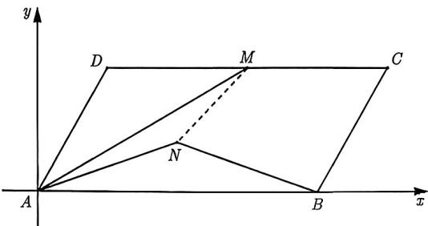
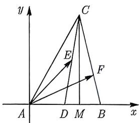
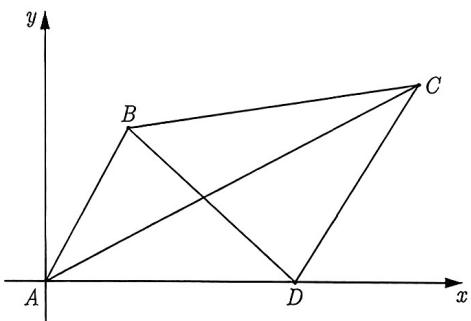
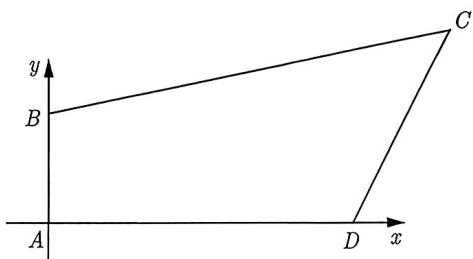

import Guide from '@/components/Guide.astro';
import Knowledge from '@/components/Knowledge.astro';
import Example from '@/components/Example.astro';
import Analysis from '@/components/Analysis.astro';
import Solution from '@/components/Solution.astro';
import Variant from '@/components/Variant.astro';
import Note from '@/components/Note.astro';
import Block from '@/components/Block.astro';

虽然垂直和对称性为建立坐标系提供了便利, 但这只是众多图形中的几种具有的特殊性质而已. 很多时候, 图形并不具备这些优势, 下面就是一个例子.

<Example title="例 3.27">
在平行四边形 ABCD 中, AB = 4, AD = 2, $\angle A = 60^{\circ}$ , M 为 CD 的中点, N 为平面 ABCD 内一点, 若 $|AN| = |MN|$ , 则 $\overrightarrow{AM} \cdot \overrightarrow{AN}$ 的值为 \_\_\_\_.

<Solution>
以点 A 为坐标原点, 直线 AB 为 x 轴, AB 的垂线为 y 轴建立直角坐标系. 如图 3-22 所示, 因为 $\angle A = 60^{\circ}$ , 所以 $A(0,0)$ , $B(4,0)$ , $D(1,\sqrt{3})$ , $C(5,\sqrt{3})$ , $M(3,\sqrt{3})$ .

设 $N(x,y)$ , 由 $|AN| = |MN|$ 可得 $\sqrt{x^2 + y^2} = \sqrt{(x - 3)^2 + (y - \sqrt{3})^2}$ , 化简可得 $3x + \sqrt{3}y = 6$ . 而 $\overrightarrow{AM} = (3, \sqrt{3}), \overrightarrow{AN} = (x,y)$ , 则 $\overrightarrow{AM} \cdot \overrightarrow{AN} = 3x + \sqrt{3}y = 6$ , 故填 6.

  
图3-22
</Solution>
</Example>

就像例3.27那样, 这个图形本身并没有特殊性. 然而, 只要我们给出具体的图形, 并明确了相应的角度和长度, 建立直角坐标系仍然是可行的. 在这种情况下, 我们提出以下建议:

<Block title="建议四">
所给角度的顶点设为坐标原点, 并尽可能让参与运算的点或线段位于坐标轴上.
</Block>

如果所给的长度无法出现在坐标轴上, 我们应该如何处理呢? 是设定点的坐标还是设定线段的长度? 下面通过一个例子进行说明:

<Example title="例 3.28">
(2023 天津 14) 在 $\triangle ABC$ 中, $\angle A = 60^{\circ}$ , BC = 1, 点 D 为 AB 的中点, 点 E 为 CD 的中点, 若 $\overrightarrow{BF} = \frac{1}{3}\overrightarrow{BC}$ , 则 $\overrightarrow{AE} \cdot \overrightarrow{AF}$ 的最大值为 \_\_\_\_.

<Solution>
以 $A$ 为坐标原点, $AB$ 所在直线为 $x$ 轴, 建立如图3-23所示的平面直角坐标系. 过点 $C$ 作 $CM \perp x$ 轴, 垂足为 $M$ . 下面我们该如何确定点 $B, C$ 的坐标呢? 直接设点 $B, C$ 的坐标吗? 当然不是, 因为已知 $\angle A = 60^{\circ}$ , 所以需要充分利用角度来解三角形, 故设 $AB, AC$ 的长度, 设 $AB = 2x$ , $AC = 2y$ , 由 $\angle A = 60^{\circ}$ , 可得 $AM = y$ , $CM = \sqrt{3}y$ , 可得点 $C$ 的坐标为 $(y, \sqrt{3}y)$ , 点 $B$ 的坐标为 $(2x, 0)$ , 由 $BC = 1$ , 可得 $4x^{2} + 4y^{2} - 4xy = 1$ .

  
图3-23

设 $F(x_0,y_0)$ ，则 $\overrightarrow{BF} = (x_0 - 2x,y_0),\overrightarrow{BC} = (y - 2x,\sqrt{3} y)$ ，由 $\overrightarrow{BF} =$ $\frac{1}{3}\overrightarrow{BC},$ 可得

$$
\left\{ \begin{array}{l l} y - 2 x = 3 (x _ {0} - 2 x) \\ \sqrt {3} y = 3 y _ {0} \end{array} \right. \Rightarrow \left\{ \begin{array}{l l} x _ {0} = \frac {1}{3} (4 x + y) \\ y _ {0} = \frac {\sqrt {3}}{3} y \end{array} \right.
$$

所以点 $F$ 的坐标为 $\left(\frac{4x + y}{3},\frac{\sqrt{3}}{3} y\right)$ . 又因为 $D$ 为 $AB$ 中点, 所以 $D(x,0)$ , 而点 $E$ 为 $CD$ 的中点, 所以 $E\left(\frac{x + y}{2},\frac{\sqrt{3}}{2} y\right)$ , 又由 $A(0,0)$ , 则

$$
\overrightarrow {A E} \cdot \overrightarrow {A F} = \frac {1}{6} (4 x ^ {2} + 4 y ^ {2} + 5 x y).
$$

利用 $4x^{2} + 4y^{2} - 4xy = 1$ 可得

$$
\overrightarrow {A E} \cdot \overrightarrow {A F} = \frac {1}{6} (1 + 9 x y).
$$

由 $4x^{2} + 4y^{2} - 4xy = 1$ 可得 $1 + 4xy = 4(x^{2} + y^{2})\geqslant 8xy,$ 解得 $xy\leqslant \frac{1}{4}$ ，代入上式可得

$$
\overrightarrow {A E} \cdot \overrightarrow {A F} = \frac {1}{6} (1 + 9 x y) \leqslant \frac {1}{6} \left(1 + \frac {9}{4}\right) = \frac {1 3}{2 4},
$$

当且仅当 $x = y = \frac{1}{2}$ 时等号成立, 故填 $\frac{13}{24}$ .
</Solution>
</Example>

例3.27与例3.28的题干都是既明确了相应的线段长, 又明确了相应的角度, 但有时候角度与长度不一定都具备, 若是遇到只明确两者之一的题呢? 那么这样的问题还能建系吗?

<Example title="例 3.29">
在平面四边形 ABCD 中, 已知 AB = 1, BC = 4, CD = 2, DA = 3, 则 $\overrightarrow{AC} \cdot \overrightarrow{BD}$ 的值为 \_\_\_\_.

<Solution title="解析1">
由于题中只给出了线段长，并没有给出角度，因此尽可能把已知线段放在坐标轴上，但是发现只可能一条线段放在坐标轴上, 因此任选一条放在坐标轴上, 不妨选 $AD$ 在坐标轴上, 以点 $A$ 为坐标原点, 如图3-24所示, 则可得 $A(0,0), D(3,0)$ . 不妨设 $B(x_1,y_1), C(x_2,y_2)$ , 根据题意可知 $\overrightarrow{AC} = (x_2,y_2), \overrightarrow{BD} = (3 - x_1, -y_1)$ , 则

$$
\overrightarrow {A C} \cdot \overrightarrow {B D} = (x _ {2}, y _ {2}) \cdot (3 - x _ {1}, - y _ {1}) = 3 x _ {2} - (x _ {1} x _ {2} + y _ {1} y _ {2}).\tag{3.2.1}
$$

我们要求式(3.2.1)的值, 那么需要从条件中挖掘信息, 由 AB = 1, BC = 4, CD = 2, 可得

$$
\left\{ \begin{array}{l l} x _ {1} ^ {2} + y _ {1} ^ {2} = 1 \\ (x _ {1} - x _ {2}) ^ {2} + (y _ {1} - y _ {2}) ^ {2} = 1 6 \\ (x _ {2} - 3) ^ {2} + y _ {2} ^ {2} = 4 \end{array} \right. \Rightarrow \left\{ \begin{array}{l l} x _ {1} ^ {2} + y _ {1} ^ {2} = 1 \\ x _ {1} ^ {2} + y _ {1} ^ {2} - 2 (x _ {1} x _ {2} + y _ {1} y _ {2}) + x _ {2} ^ {2} + y _ {2} ^ {2} = 1 6 \\ x _ {2} ^ {2} + y _ {2} ^ {2} - 6 x _ {2} + 9 = 4 \end{array} \right.\tag{\textcircled{1}}
$$

②

③

由②-①-③可得 $3x_{2} - (x_{1}x_{2} + y_{1}y_{2}) = 10$ ，将其代入式(3.2.1)可得 $\overrightarrow{AC} \cdot \overrightarrow{BD} = 3x_{2} - (x_{1}x_{2} + y_{1}y_{2}) = 10$ 故填10.

  
图3-24
</Solution>

本题的四边形 $ABCD$ 虽然知道了四边的边长, 但是四个顶角是变化的, 我们完全可以令 $A$ 等于 $90^{\circ}$ , 在此基础上建系, 运算量会小很多.

<Solution title="解析 2">
不妨设 $A = 90^{\circ}$ ，以 A 为坐标原点，AD 所在直线为 x 轴，建立如图 3-25 所示的平面直角坐标系，则 $A(0,0)$ ， $D(3,0)$ ， $B(0,1)$ ，设 $C(x,y)$ ，由 BC = 4，CD = 2，可得

$$
\left\{ \begin{array}{l l} x ^ {2} + (y - 1) ^ {2} = 1 6 \\ (x - 3) ^ {2} + y ^ {2} = 4 \end{array} \right. \Rightarrow \left\{ \begin{array}{l l} x ^ {2} + y ^ {2} - 2 y = 1 5 \\ x ^ {2} + y ^ {2} - 6 x = - 5 \end{array} \right.\tag{\textcircled{1}}
$$

②

由 ①-② 可得 $3x - y = 10$ , 所以 $\overrightarrow{AC} \cdot \overrightarrow{BD} = (x, y) \cdot (3, -1) = 3x - y = 10$ , 故填 10.

  
图3-25
</Solution>
</Example>

<Variant title="变式 3.29.1">
(2023 泉州三模) 已知平面向量 a, b, c 满足 $|a| = 1$ , $b \cdot c = 0$ , $a \cdot b = 1$ , $a \cdot c = -1$ , 则 $|b + c|$ 的最小值为 ( ). A. 1 B. $\sqrt{2}$ C. 2 D. 4
</Variant>
