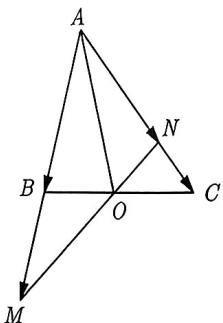
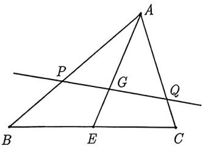
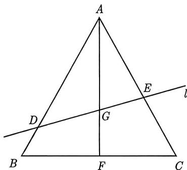
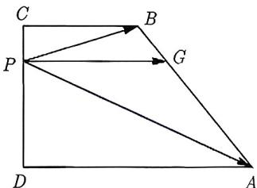
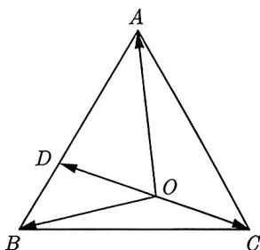

import Guide from '@/components/Guide.astro';
import Knowledge from '@/components/Knowledge.astro';
import Example from '@/components/Example.astro';
import Analysis from '@/components/Analysis.astro';
import Solution from '@/components/Solution.astro';
import Variant from '@/components/Variant.astro';
import Note from '@/components/Note.astro';
import Block from '@/components/Block.astro';
import Summary from '@/components/Summary.astro';

从历年真题和模拟题来看, 三点共线往往与某种特殊的图形结合, 这种图形与字母 X 很像, 我们通

过如下例题来阐述. 首先, 我们利用结论总结3.2再重新解一次例3.35.

<Example title="例 3.36">
(2007 江西 15) 如图 3-31 所示, 在 $\triangle ABC$ 中, 点 $O$ 是 $BC$ 的中点, 过点 $O$ 的直线分别交直线 $AB$, $AC$ 于不同的两点 $M$, $N$. 若 $\overrightarrow{AB} = m\overrightarrow{AM}$, $\overrightarrow{AC} = n\overrightarrow{AN}$, 则 $m + n$ 的值为 \_\_\_\_.

<Analysis>
由题意可知 O 是一个非常关键的点, 观察图 3-31, BC 与 MN 形成了一个 “X” 形, 这个 “X” 形的交点是 O, 而与 O 相关的三点共线有 B, O, C 和 M, O, N 两组, 故我们需要用两次三点共线定理就可以解决问题.

图3-31
</Analysis>

<Solution>
因为 O 是 BC 的中点, 所以 $\overrightarrow{AO} = \frac{1}{2}\overrightarrow{AB} + \frac{1}{2}\overrightarrow{AC}$. 又因为 $\overrightarrow{AB} = m\overrightarrow{AM}, \overrightarrow{AC} = n\overrightarrow{AN}$, 所以 $\overrightarrow{AO} = \frac{m}{2}\overrightarrow{AM} + \frac{n}{2}\overrightarrow{AN}$. 因为 M, O, N 三点共线, 所以 $\frac{m}{2} + \frac{n}{2} = 1$, 即 $m + n = 2$. 故填 2.
</Solution>

</Example>

对比例3.35与例3.36你就发现, 建系不如共线定理来的直接, 对于例3.36这类题型, 我们给出如下经验总结.

<Block title="经验总结 3.2">
“X”形图形求基底系数之和问题,一般要用到两次三点共线定理.
</Block>

<Example title="例 3.37">
已知 G 为 $\triangle ABC$ 的重心, 过点 G 的直线与边 AB, AC 分别交于点 P, Q. 若 $\overrightarrow{AP} = \frac{3}{5}\overrightarrow{AB}$, 则 $\triangle ABC$ 与 $\triangle APQ$ 的面积之比为 \_\_\_\_.

<Solution>
因为 $\triangle ABC$ 与 $\triangle APQ$ 有公共顶点 $A$, 所以

$$
\frac {S _ {\triangle A B C}}{S _ {\triangle A P Q}} = \frac {\frac {1}{2} | A B | \cdot | A C | \sin A}{\frac {1}{2} | A P | \cdot | A Q | \sin A} = \frac {5}{3} \times \frac {| A C |}{| A Q |}.
$$

延长 $AG$ 交 $BC$ 于 $E$, 如图3-32所示. 因为 $G$ 是重心, 所以 $E$ 是 $BC$ 的中点, 从而有 $\overrightarrow{AE} = \frac{1}{2}\overrightarrow{AB} + \frac{1}{2}\overrightarrow{AC}$. 设 $\overrightarrow{AC} = m\overrightarrow{AQ}$, 由 $\overrightarrow{AP} = \frac{3}{5}\overrightarrow{AB}$ 且 $G$ 为 $\triangle ABC$ 的重心, 可知

图3-32

$$
\overrightarrow {A G} = \frac {2}{3} \overrightarrow {A E} = \frac {2}{3} \left(\frac {1}{2} \times \frac {5}{3} \overrightarrow {A P} + \frac {1}{2} m \overrightarrow {A Q}\right) = \frac {5}{9} \overrightarrow {A P} + \frac {m}{3} \overrightarrow {A Q}.
$$

因为 $P, G, Q$ 三点共线，所以 $\frac{5}{9} + \frac{m}{3} = 1$，解得 $m = \frac{4}{3}$，于是所求面积之比为 $\frac{S_{\triangle ABC}}{S_{\triangle APQ}} = \frac{5}{3} \times \frac{|AC|}{|AQ|} = \frac{5}{3} \times \frac{4}{3} = \frac{20}{9}$. 故填 $\frac{20}{9}$.
</Solution>

</Example>

例3.37是利用三点共线来求两个三角形的面积之比, 那么如果是求两个三角形的周长之比, 又该如何求呢? 请看下面的例子:

<Example title="例 3.38">
(2023 江苏模考) 已知 $\triangle ABC$ 为等边三角形, 点 $G$ 是 $\triangle ABC$ 的重心. 过点 $G$ 的直线 $\ell$ 与线段 $AB$ 交于点 $D$, 与线段 $AC$ 交于点 $E$. 设 $\overrightarrow{AD} = \lambda \overrightarrow{AB}, \overrightarrow{AE} = \mu \overrightarrow{AC}$, 则 $\frac{1}{\lambda} + \frac{1}{\mu} =$ \_\_\_\_; $\triangle ADE$ 与 $\triangle ABC$ 周长之比的取值范围为 \_\_\_\_.

<Solution>
连接 $AG$ 并延长, 交 $BC$ 于 $F$, 如图3-33所示, 因为点 $F$ 是 $BC$ 的中点, 所以 $\overrightarrow{AF} = \frac{1}{2}\overrightarrow{AB} + \frac{1}{2}\overrightarrow{AC}$, 又由 $G$ 为重心, 可知 $\overrightarrow{AF} = \frac{3}{2}\overrightarrow{AG}$, 于是

$\frac{3}{2}\overrightarrow{AG} = \frac{1}{2}\overrightarrow{AB} +\frac{1}{2}\overrightarrow{AC} = \frac{1}{2\lambda}\overrightarrow{AD} +\frac{1}{2\mu}\overrightarrow{AE}\Longrightarrow \overrightarrow{AG} = \frac{1}{3\lambda}\overrightarrow{AD} +\frac{1}{3\mu}\overrightarrow{AE}.$ 因为 $D,G,E$ 三点共线，所以 $\frac{1}{3\lambda} +\frac{1}{3\mu} = 1,$ 即 $\frac{1}{\lambda} +\frac{1}{\mu} = 3.$

<figure class="vp-figure">
  
  <figcaption>图3-33</figcaption>
</figure>

设 $\triangle ABC$ 的边长为 1, $\triangle ADE$ 与 $\triangle ABC$ 周长之比为 $\frac{C_1}{C_2}$, 则

$$
\frac {C _ {1}}{C _ {2}} = \frac {\lambda | A B | + \mu | A C | + | D E |}{3 | A B |} = \frac {\lambda + \mu}{3} + \frac {| D E |}{3}.
$$

此时很明确需要把 $|DE|$ 的值用 $\lambda$ 与 $\mu$ 来表示. 由于 $\triangle ABC$ 是等边三角形, 所以角度是确定的, 要找边与边之间的关系可以利用余弦定理. 在 $\triangle ADE$ 中, 由余弦定理可得

$$
\cos A = \frac {\lambda^ {2} | A B | ^ {2} + \mu^ {2} | A C | ^ {2} - | D E | ^ {2}}{2 \lambda | A B | \cdot \mu | A C |} = \frac {1}{2} \Longrightarrow | D E | = \sqrt {\lambda^ {2} + \mu^ {2} - \lambda \mu}.
$$

于是

$$
\frac {C _ {1}}{C _ {2}} = \frac {\lambda + \mu + \sqrt {\lambda^ {2} + \mu^ {2} - \lambda \mu}}{3} = \frac {\lambda + \mu + \sqrt {(\lambda + \mu) ^ {2} - 3 \lambda \mu}}{3}.\tag{3.4.1}
$$

又因为 $\frac{1}{\lambda} + \frac{1}{\mu} = 3$，所以 $\lambda + \mu = 3\lambda \mu$，代入式(3.4.1)，可得

$$
\frac {C _ {1}}{C _ {2}} = \lambda \mu + \sqrt {\lambda^ {2} \mu^ {2} - \frac {\lambda \mu}{3}}.
$$

此时需要把 $\lambda \mu$ 看成一个变量，所以需要把 $\lambda \mu$ 的范围求出来，由题意可知 $\left\{ \begin{array}{l} 0 < \lambda \leqslant 1 \\ 0 < \mu \leqslant 1 \end{array} \right.$，所以 $\left\{ \begin{array}{l} \frac{1}{\lambda} \geqslant 1 \\ \frac{1}{\mu} \geqslant 1 \end{array} \right.$，又由 $\frac{1}{\lambda} = 3 - \frac{1}{\mu} \leqslant 2$，所以 $1 \leqslant \frac{1}{\lambda} \leqslant 2$。又因为 $\mu = \frac{\lambda}{3\lambda - 1}$，所以

$$
\lambda \mu = \frac {\lambda^ {2}}{3 \lambda - 1} = \frac {1}{- \left(\frac {1}{\lambda} - \frac {3}{2}\right) ^ {2} + \frac {9}{4}}.
$$

因为 $1 \leqslant \frac{1}{\lambda} \leqslant 2$, 所以 $\frac{4}{9} \leqslant \lambda \mu \leqslant \frac{1}{2}$. 令 $x = \lambda \mu$, 所以 $\frac{4}{9} \leqslant x \leqslant \frac{1}{2}$, 令 $f(x) = x + \sqrt{x^2 - \frac{1}{3}x}$, 因为函数 $y = x$ 在 $\left[\frac{4}{9}, \frac{1}{2}\right]$ 上单调递增, 函数 $y = x^2 - \frac{1}{3}x$ 在 $\left[\frac{4}{9}, \frac{1}{2}\right]$ 上也是单调递增, 所以 $f(x)$ 在 $\left[\frac{4}{9}, \frac{1}{2}\right]$ 上单调递增, 于是 $f\left(\frac{4}{9}\right) \leqslant f(x) \leqslant f\left(\frac{1}{2}\right)$, 即 $\frac{2}{3} \leqslant f(x) \leqslant \frac{3 + \sqrt{3}}{6}$, 所以 $\triangle ADE$ 与 $\triangle ABC$ 周长之比的取值范围为 $\left[\frac{2}{3}, \frac{3 + \sqrt{3}}{6}\right]$.

综上所述, $\frac{1}{\lambda} + \frac{1}{\mu} = 3$, $\triangle ADE$ 与 $\triangle ABC$ 周长之比的取值范围为 $\left[\frac{2}{3}, \frac{3 + \sqrt{3}}{6}\right]$. 故填 3; $\left[\frac{2}{3}, \frac{3 + \sqrt{3}}{6}\right]$.
</Solution>

</Example>

<Variant title="变式 3.38.1">
已知 O 为 $\triangle ABC$ 内一点, 且 $\overrightarrow{AO} = \frac{1}{2} \left( \overrightarrow{OB} + \overrightarrow{OC} \right)$, $\overrightarrow{AD} = t \overrightarrow{AC}$, 若 B, O, D 三点共线, 则 $t = (\quad)$. A. $\frac{1}{4}$ B. $\frac{1}{3}$ C. $\frac{1}{2}$ D. $\frac{2}{3}$
</Variant>

我们回顾结论总结3.2:

A, P, B 三点共线 $\Longleftrightarrow \overrightarrow{OP} = x\overrightarrow{OA} + y\overrightarrow{OB}$，且 $x + y = 1$.

但是这个结论不够全面, 它没有给出 $P$ 在 $AB$ 上的具体位置. 细心的同学或许注意到了, 其实在结论总结3.2的推导过程中, 已经给出了 $P$ 在 $AB$ 上的具体位置, 即 $\overrightarrow{AP} = \frac{y}{x}\overrightarrow{PB}$, 或者 $\frac{AP}{PB} = \frac{|y|}{|x|}$. 总结如下:

如果 A, P, B 三点共线 $\Longleftrightarrow \overrightarrow{OP} = x\overrightarrow{OA} + y\overrightarrow{OB}(x + y = 1)$，且 $\frac{AP}{PB} = \frac{|y|}{|x|}$.

结论总结3.3的前半部分就是结论总结3.2, 相信绝大多数同学都能记得住, 但是后面的 $\frac{AP}{PB} = \frac{|y|}{|x|}$ 有记忆难度. 很多同学记不清 $\frac{AP}{PB}$ 是 $\frac{|y|}{|x|}$ 还是 $\frac{|x|}{|y|}$.

这里我们提供一个记忆这个结论的方法, 不妨设 $x, y > 0$. 若 $x > y$, 也就是 $\overrightarrow{OA}$ 的贡献要比 $\overrightarrow{OB}$ 的贡献大, 所以 $P$ 离 $A$ 要比离 $B$ 近, 即 $AP < PB$. 另一方面, $\frac{x}{y} > 1$, $\frac{y}{x} < 1$, 所以 $\frac{AP}{PB} = \frac{y}{x} = \frac{|y|}{|x|}$. 若同学们不能接受我们提供的记忆方法, 可以设计一个自己能记得住的方式, 掌握推导.

<Example title="例 3.39">
(2011 天津理 14) 已知直角梯形 ABCD 中, $AD \parallel BC$, $\angle ADC = 90^{\circ}$, AD = 2, BC = 1, P 是腰 DC 上的动点, 则 $|\overrightarrow{PA} + 3\overrightarrow{PB}|$ 的最小值为 \_\_\_\_.

<Solution>
因为 $\overrightarrow{PA} + 3\overrightarrow{PB} = 4\left(\frac{\overrightarrow{PA}}{4} + \frac{3\overrightarrow{PB}}{4}\right)$, 设 $\overrightarrow{PG} = \frac{\overrightarrow{PA}}{4} + \frac{3\overrightarrow{PB}}{4}$, 则 $A, B, G$ 三点共线且 $G$ 离点 $B$ 更近, 于是 $\frac{AG}{GB} = 3$, 即 $G$ 是线段 $AB$ 的四等分点, 如图3-34所示. 当且仅当 $\overrightarrow{PG} \perp \overrightarrow{DC}$ 时 $|\overrightarrow{PG}|$ 取得最小值, 设 $AB$ 与 $CD$ 的中点分别为 $E, F$, 则

<figure class="vp-figure">
  
  <figcaption>图3-34</figcaption>
</figure>

$$
| \overrightarrow {P G} | = \frac {1}{2} (B C + E F) = \frac {1}{2} \left(B C + \frac {B C + A D}{2}\right) = \frac {5}{4}.
$$

故此时 $|\overrightarrow{PA} + 3\overrightarrow{PB}| = 4|\overrightarrow{PG}| = 5,$ 即 $|\overrightarrow{PA} + 3\overrightarrow{PB} |$ 的最小值为5.故填5.
</Solution>

</Example>

例3.39中这种特殊的图形有天然的直角, 当我们面对这种情况时, 第一个想法通常是建立一个直角坐标系, 具体的方法可以参考例3.20. 然而, 在这里我们可以通过提取 4 来构造系数并使它们的和等于 1 来确定点 $G$ 的位置. 这种处理方法与三角函数中的“辅助角公式”有一些相似之处. 现在我们来总结一下这种处理方法:

<Block title="经验总结 3.3">
若已知 O, A, B 不共线且 $x\overrightarrow{OA} + y\overrightarrow{OB}$，其中 $x, y \in R^{*}$，则
(1) 提取公因式 $x + y$，即 $x\overrightarrow{OA} + y\overrightarrow{OB} = (x + y)\left(\frac{x}{x + y}\overrightarrow{OA} + \frac{y}{x + y}\overrightarrow{OB}\right)$.
(2) 令 $\overrightarrow{OP} = \frac{x}{x + y}\overrightarrow{OA} + \frac{y}{x + y}\overrightarrow{OB}$，则 P 是线段 AB 上一点，且根据 x, y 的大小可以判断 P 离 A, B 谁更近，可以进一步确定 AP 与 PB 的长度比.
</Block>

<Example title="例 3.40">
已知 O 是正 $\triangle ABC$ 内部的一点, $\overrightarrow{OA} + 2\overrightarrow{OB} + 3\overrightarrow{OC} = 0$, 则 $\triangle AOB, \triangle AOC, \triangle BOC$ 的面积之比等于 ( ).

A. 9:4:1
B. 1:4:9
C. 3:2:1
D. 1:2:3

<Solution>
由于 $\overrightarrow{OA} + 2\overrightarrow{OB} = 3\left(\frac{1}{3}\overrightarrow{OA} + \frac{2}{3}\overrightarrow{OB}\right)$, 设 $\overrightarrow{OD} = \frac{1}{3}\overrightarrow{OA} + \frac{2}{3}\overrightarrow{OB}$, 所以 $D$ 在线段 $AB$ 上且 $D$ 离 $B$ 更近, 于是 $\frac{AD}{DB} = 2$, 如图3-35所示. 另外

$$
\overrightarrow {O A} + 2 \overrightarrow {O B} + 3 \overrightarrow {O C} = \mathbf {0} \Longrightarrow 3 \overrightarrow {O D} + 3 \overrightarrow {O C} = \mathbf {0} \Longrightarrow \overrightarrow {O D} = - \overrightarrow {O C}.
$$

所以 $O$ 是 $CD$ 的中点. 设 $S_{\triangle ABC} = 1$, 则

图3-35

$$
S _ {\triangle A O B} = \frac {1}{2} S _ {\triangle A B C} = \frac {1}{2}, \quad S _ {\triangle A O C} = \frac {1}{2} S _ {\triangle A D C} = \frac {1}{2} \times \frac {2}{3} S _ {\triangle A B C} = \frac {1}{3}.
$$

于是 $S_{\triangle BOC} = 1 - S_{\triangle AOB} - S_{\triangle AOC} = \frac{1}{6}$, 所以 $S_{\triangle AOB}: S_{\triangle AOC}: S_{\triangle BOC} = 3:2:1$. 故选 C.
</Solution>

本例实际上是奔驰定理的一个特例. 设 $O$ 为 $\triangle ABC$ 所在平面上的一点且 $\alpha \overrightarrow{OA} + \beta \overrightarrow{OB} + \gamma \overrightarrow{OC} = 0$, 则 $S_{\triangle BOC}: S_{\triangle AOC}: S_{\triangle AOB} = |\alpha|: |\beta|: |\gamma|$. 更多细节见3.7.2节.

</Example>

<Variant title="变式 3.40.1">
设 P 为 $\triangle ABC$ 所在平面上一点, 且满足 $3\overrightarrow{PA} + 4\overrightarrow{PC} = m\overrightarrow{AB} (m > 0)$, 若 $\triangle ABP$ 的面积为 8, 则 $\triangle ABC$ 的面积为 \_\_\_\_.
</Variant>
