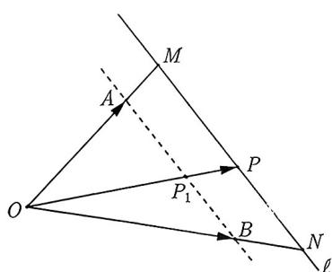
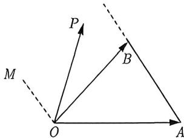
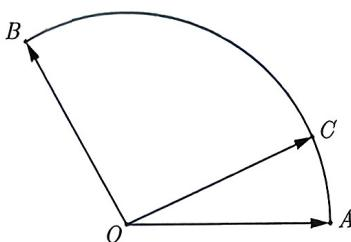
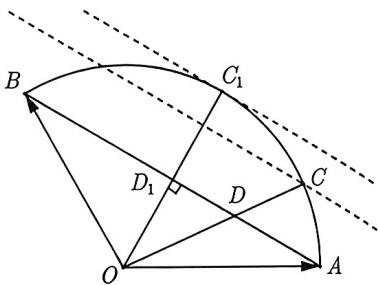
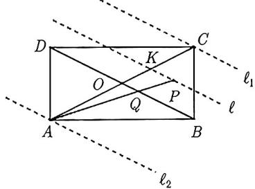
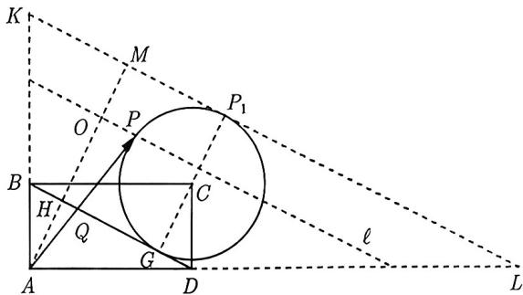
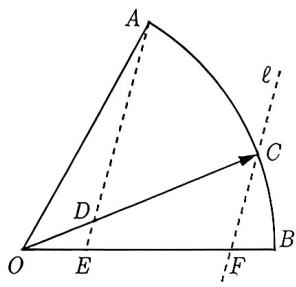
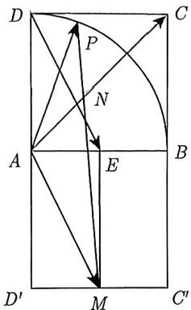
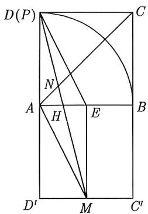
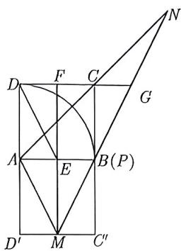

import Guide from '@/components/Guide.astro';
import Knowledge from '@/components/Knowledge.astro';
import Example from '@/components/Example.astro';
import Analysis from '@/components/Analysis.astro';
import Solution from '@/components/Solution.astro';
import Variant from '@/components/Variant.astro';
import Note from '@/components/Note.astro';
import Block from '@/components/Block.astro';
import Method from '@/components/Method.astro';

如果 $P$ 是直线 $AB$ 上一动点且 $\overrightarrow{OP} = x\overrightarrow{OA} + y\overrightarrow{OB}$ , 则 $x + y$ 恒为定值且为 1; 反之, 若 $\overrightarrow{OP} = x\overrightarrow{OA} + y\overrightarrow{OB}$ 且 $x + y$ 恒为 1, 则 $P$ 的轨迹是直线 $AB$ . 现在, 我们的问题是:

<Block title="问题">
设 A, B 是平面上两定点, 是否存在异于直线 AB 的直线 $\ell$ , 使得当点 P 在 $\ell$ 上移动且 $\overrightarrow{OP} = x\overrightarrow{OA} + y\overrightarrow{OB}$ 时, 始终能保持 $x + y$ 为定值?

如图 3-36 所示, 作直线 AB 的平行线 $\ell$ , 延长 OA, OB 分别交直线 $\ell$ 于 M, N 两点. 设 P 是 MN 上任意一点, 由 M, N, P 三点共线可得 $\overrightarrow{OP} = \lambda \overrightarrow{OM} + (1 - \lambda) \overrightarrow{ON}$ . 注意到 $\triangle OAB$ 与 $\triangle OMN$ 相似, 不妨设相似比为 k, 即 $\frac{OM}{OA} = \frac{ON}{OB} = \frac{OP}{OP_{1}} = k$ . 于是

$$
\overrightarrow {O P} = \lambda \overrightarrow {O M} + (1 - \lambda) \overrightarrow {O N} = \lambda k \overrightarrow {O A} + (1 - \lambda) k \overrightarrow {O B}.
$$

因为 $\overrightarrow{OP} = x\overrightarrow{OA} + y\overrightarrow{OB}$ , 利用平面向量基本定理可得 $x = \lambda k, y = (1 - \lambda)k$ , 即 $x + y = k$ (定值).

图3-36

在上面的讨论中, $AB$ 介于起点 $O$ 与 $MN$ 之间, 这只是其中一种情形. 另外一种情形, 即起点 $O$ 落在 $AB$ 与 $MN$ 之间, 此时 $x + y = -k$ , 细节请大家自己推导.

也就是说, 只要 $\ell //AB$ , 则无论 $P$ 如何移动, 其系数和始终为定值. 正是基于这个原因, 大家称呼这样与 $AB$ 平行的直线 $\ell$ 叫“等和线”. 在实际解题中, 我们往往用到的是如下定理.
</Block>

<Block title="等和线定理">
设 A, B 是平面上两定点, 且 $\ell \parallel AB$ . 若 P 是 $\ell$ 上一动点, 且有 $\overrightarrow{OP} = x\overrightarrow{OA} + y\overrightarrow{OB}$ , 则 $x + y$ 恒为定值且 $\ell$ 称为 “等和线”. 另外, 设 OP 与 AB 交于 $P_{1}$ , 则

(1) 若 $O$ 位于 $AB$ 与“等和线 $\ell$ ”之外时, $x + y = \frac{OP}{OP_1}$ ;

(2) 若 $O$ 位于 $AB$ 与“等和线 $\ell$ ”之间时, $x + y = -\frac{OP}{OP_1}$ .
</Block>

将等和线 $\ell$ 沿着与 $AB$ 平行的方向移动, 再结合等和线定理可得如下结论:

① 当 $AB$ 位于 $O$ 与“等和线”之间时, $x + y > 1$ ; ② 当“等和线”恰好为直线 $AB$ 时, $x + y = 1$ ; ③ 当“等和线”位于点 $O$ 与 $AB$ 之间时, $0 < x + y < 1$ ; ④ 当“等和线”过点 $O$ 时, $x + y = 0$ .

<Example title="例 3.41">
(2006 湖南 15) 如图 3-37 所示, $OM \parallel AB$ , 点 $P$ 在由射线 $OM$ , 线段 $OB$ 及 $AB$ 的延长线围成的区域内 (不含边界) 运动, 且 $\overrightarrow{OP} = x\overrightarrow{OA} + y\overrightarrow{OB}$ , 则 $x$ 的取值范围是\_\_\_\_; 当 $x = -\frac{1}{2}$ 时, $y$ 的取值范围是\_\_\_\_.
<Solution>
因为 P 介于 OM 和 AB 之间, 所以延长 OP 必与 AB 相交, 设交点为 $P_{1}$ , 则存在 $\lambda > 0$ 使得 $\overrightarrow{OP_{1}} = \lambda \overrightarrow{OP} = \lambda x \overrightarrow{OA} + \lambda y \overrightarrow{OB}$ . 注意到 $P_{1}$ 落在线段 AB 外且离 A 远, 所以 $\overrightarrow{OA}$ 的系数为负, 即 $\lambda x < 0$ , 解得 x < 0.

又因为 $P$ 介于 $AB$ 和 $OM$ 之间, 所以 $0 < x + y < 1$ . 结合 $x = -\frac{1}{2}$ 可得 $\frac{1}{2} < y < \frac{3}{2}$ .

故填 $(- \infty, 0)$ ; $\left(\frac{1}{2}, \frac{3}{2}\right)$ .

<figure class="vp-figure">
  
  <figcaption>图3-37</figcaption>
</figure>
</Solution>
</Example>

<figure class="vp-figure">
  
  <figcaption>图3-38</figcaption>
</figure>

<Example title="例 3.42">
(2009 安徽理 14) 给定两个长度为 1 的平面向量 $\overrightarrow{OA}, \overrightarrow{OB}$ ，其夹角为 $120^{\circ}$ ，如图 3-38 所示，点 C 在以 O 为圆心的圆弧 AB 上变动，若 $\overrightarrow{OC} = x\overrightarrow{OA} + y\overrightarrow{OB}$ ，其中 $x, y \in R$ ，则 $x + y$ 的最大值为 \_\_\_\_.
<Solution>
连接 $AB$ ，设 $OC$ 与 $AB$ 的交点为 $D$ ，由等和线定理可知 $x + y = \frac{OC}{OD}$ 。因为 $C$ 是圆弧 $AB$ 上一点, 所以 $OC = 1$ , 于是 $x + y = \frac{1}{OD}$ . 因此, 求 $x + y$ 的最大值等价于求 $OD$ 的最小值. 显然, 当 $OD \perp AB$ 时, $OD$ 最小, 即如图3-39所示 $D_{1}$ 的位置, 此时 $|OD_{1}| = |OA| \sin 30^{\circ} = \frac{1}{2}$ , 所以 $x + y \leqslant \frac{1}{OD_{1}} = 2$ . 故填2.

</Solution>
</Example>

在例3.42中, 当 $C$ 运动时, 由三点共线得到 $x + y = \frac{OC}{OD}$ . 因为 $OC = 1$ , 故问题转化为通过求单变量 $OD$ 的范围进而求 $x + y$ 的范围.

图3-39

<Example title="例 3.43">
在矩形 ABCD 中, AB = 2, AD = 1, 点 P 为矩形 ABCD 内部及其边界上的动点, 若 $\overrightarrow{AP} = x\overrightarrow{AB} + y\overrightarrow{AD}$ , 则 $x + y$ 的取值范围为 ( ) .
A. [0,2] B. [0,3] C. [1,2] D. [1,3]
<Solution>
如图 3-40 所示, 作 BD 的平行线 $\ell$ , 设 P 是 $\ell$ 上一点, Q 为 AP 与 BD 的交点, O 为 BD 的中点, 连接 AO 并延长交 $\ell$ 于点 K, 则由等和线原理可知 $x + y = \frac{AP}{AQ} = \frac{AK}{AO}$ . 现考虑将直线 $\ell$ 沿着与 BD 平行的方向移动, 尽管 AP 与 AQ 都在变, 但是 AO 保持不变, 因此只要 AK 取最值即可. 显然图 3-40 中的 $\ell_{1}$ 和 $\ell_{2}$ 是两极端位置. 当 P 与 A 重合时, $x + y = 0$ ; 当 P 与 C 重合时, $x + y = \frac{AC}{AQ} = 2$ . 故选 A.

在例3.43中, 我们由三点共线得到 $x + y = \frac{AP}{AQ} = \frac{AK}{AO}$ . 当 $P$ 在运动时, $AP$ 和 $AQ$ 都是变化的, 是双变量问题. 但是 $AO$ 是确定的, 也就是说只考虑 $AK$ 即可. 这种将双变量问题转化为单变量问题的方式值得我们学习. 另外例3.43的解析过程也给我们提供了针对这类问题 (向量系数和最值, 双变量) 的一个方法, 总结如下:

<Method title="方法总结 3.1">
<table><tr><td>利用等和线求向量系数和取值范围的步骤如下:</td></tr><tr><td>第一步:确定系数和为1的直线;</td></tr><tr><td>第二步:平移该直线,结合题给出的动点范围,分析在何处取得最值.</td></tr></table>
</Method>

<figure class="vp-figure">
  
  <figcaption>图3-40</figcaption>
</figure>
</Solution>
</Example>

<Example title="例 3.44">
(2017 全国 III 理 12) 在矩形 ABCD 中, AB = 1, AD = 2, 动点 P 在以点 C 为圆心且与 BD 相切的圆上. 若 $\overrightarrow{AP} = \lambda \overrightarrow{AB} + \mu \overrightarrow{AD}$ , 则 $\lambda + \mu$ 的最大值为 ( ).
A. 3  B. $2\sqrt{2}$ C. $\sqrt{5}$ D. 2
<Solution>
如图3-41所示, 作 $BD$ 的平行线 $\ell$ , 设 $P$ 是圆上一点, $Q$ 为 $AP$ 与 $BD$ 的交点, $H$ 为 $AH \perp BD$ 的垂足, 连接 $AH$ 并延长交 $\ell$ 于点 $O$ . 由等和线原理可知 $\lambda + \mu = \frac{AP}{AQ} = \frac{AO}{AH}$ . 现考虑将直线 $\ell$ 沿着与 $BD$ 平行的方向移动, 尽管 $AP$ 与 $AQ$ 都在变, 但是 $AH$ 保持不变, 因此只要 $AO$ 取最值即可. 显然图3-41中的 $KL$ 是取最大值的位置. 此时,

$$
\lambda + \mu = \frac {| A M |}{| A H |} = \frac {| A H | + | H M |}{| A H |} = \frac {| A H | + | G P _ {1} |}{| A H |} = \frac {3 | A H |}{| A H |} = 3,
$$

即 $\lambda + \mu$ 的最大值为 3. 故选 A.

<figure class="vp-figure">
  
  <figcaption>图3-41</figcaption>
</figure>
</Solution>
</Example>

通过前面例题的讲解, 我们知道, “等和线” 是求基底向量系数和最值的利器, 那么问题来了, 如果所求的表达式与基底向量的系数和形式不一致, 那么能否用 “等和” 来处理呢? 答案是肯定的, 我们只需要 “调节” 基底, 使得新基底向量的系数与所求表达式的形式一致即可, 见下例.

<Example title="例 3.45">
在扇形 OAB 中, $\angle AOB = 60^{\circ}$ , C 为弧 AB 上一动点, 若 $\overrightarrow{OC} = m\overrightarrow{OA} + n\overrightarrow{OB}$ , 则 $m + 4n$ 的取值范围为 ( ).
A. [0,2]    B. [0,4]    C. [1,2]    D. [1,4]
<Analysis>
如果直接找“等和线”，那么只能得到 $m + n$ 的取值范围，为了能用等和线求 $m + 4n$ 的范围，我们需要“调节”基向量，使“调节”的基向量的系数分别是 $m$ 和 $4n$ ，即 $\overrightarrow{OC} = m\overrightarrow{OA} + 4n \cdot \frac{1}{4}\overrightarrow{OB}$ 则以 $\overrightarrow{OA}$ 和 $\frac{1}{4}\overrightarrow{OB}$ 为新的基底，那么就可以构造“等和线”求 $m + 4n$ 的取值范围了.
</Analysis>
<Solution>
如图3-42所示, 令 $\overrightarrow{OE} = \frac{1}{4}\overrightarrow{OB}$ , 则 $\overrightarrow{OC} = m\overrightarrow{OA} + 4n \cdot \overrightarrow{OE}$ . 过 $C$ 作 $AE$ 的平行线 $\ell$ 交 $OB$ 于点 $F$ , 则由等和线原理可知 $m + 4n = \frac{OC}{OD} = \frac{OF}{OE}$ . 现考虑将直线 $\ell$ 沿着与 $AE$ 平行的方向移动, 注意到 $OE$ 保持不变, 因此只要 $OF$ 取最值即可. 当 $F$ 与 $E$ 重合时, $m + 4n = 1$ ; 当 $F$ 与 $B$ 重合时, $m + 4n = \frac{OB}{OE} = 4$ . 所以 $m + 4n$ 的取值范围为[1,4], 故选D.

<figure class="vp-figure">
  
  <figcaption>图3-42</figcaption>
</figure>
</Solution>
</Example>

<Variant title="变式 3.45.1">
已知 A, B, C 是圆 O 上的三点, CO 的延长线与线段 BA 的延长线交于圆 O 外的点 D, 若 $\overrightarrow{OC} = m\overrightarrow{OA} + n\overrightarrow{OB}$ , 则 $m + n$ 的取值范围是 ( ).
A. (0,1)    B. (1, +∞)    C. (-∞, -1)    D. (-1,0)
</Variant>

我们之前给出了连续的五个例子, 分别是例 $3.41 \sim$ 例3.45. 现在让我们回过头来看看这五个例子中的相似之处. 令人惊讶的是, 这五个例子中的向量共起点. 然而, 这引发了一个直观的问题: 如果向量没有共起点, 那么我们能否直接使用等和线呢? 不幸的是, 答案是否定的.

<Block title="经验总结 3.4">
向量共起点是等和线直接使用的前提.
</Block>

不必感到沮丧, 因为向量是可以进行任意平移的. 因此, 在使用等和线时, 我们可以对具有不同起点的向量进行平移, 以使它们的起点一致. 下面请看一个例子:

<Example title="例 3.46">
在正方形 ABCD 中, E 为 AB 的中点, P 为以 A 为圆心, AB 为半径的圆弧上的任意一点, 若 $\overrightarrow{AC} = \lambda \overrightarrow{DE} + \mu \overrightarrow{AP}$ , 则 $\lambda + \mu$ 的取值范围为 \_\_\_\_.
<Solution>
由 $\overrightarrow{AC} = \lambda \overrightarrow{DE} + \mu \overrightarrow{AP}$ 可知, 右端两向量的起点分别为 D 与 A, 与左端起点 A 不一致. 为统一起点, 构造向量 $\overrightarrow{AM}$ , 使得 $\overrightarrow{DE} = \overrightarrow{AM}$ . 具体方法如下: 如图 3-43 所示, 作正方形 $ABC'D'$ , 取边 $C'D'$ 的中点 M, 连接 EM, 则四边形 DAME 为平行四边形, 故 $\overrightarrow{DE} = \overrightarrow{AM}$ . 于是原式可改写为

$$
\overrightarrow {A C} = \lambda \overrightarrow {A M} + \mu \overrightarrow {A P}.
$$

连接 $PM$ , 设其与 $AC$ 交于点 $N$ . 由于 $A, N, C$ 共线, 故可设 $\overrightarrow{AN} = k\overrightarrow{AC}$ , 代入上式得

$$
\overrightarrow {A N} = k \lambda \overrightarrow {A M} + k \mu \overrightarrow {A P}.
$$

另一方面, 由于 $P, N, M$ 三点共线, 故

$$
k \lambda + k \mu = 1 \Longrightarrow \lambda + \mu = \frac {1}{k} = \frac {A C}{A N}.
$$

由于 $AC$ 为定长, 故求 $\lambda + \mu$ 的取值范围, 等价于求 $AN$ 的取值范围.

(1) 如图 3-44 所示, 当点 $P$ 与点 $D$ 重合时, $AN$ 取得最小值. 设 $PM$ 与 $AB$ 交于点 $H$ , 连接 $ME$ . 由于四边形 $ADEM$ 为平行四边形, $PM$ 与 $AE$ 为其对角线, 故 $H$ 为 $AE$ 的中点, 进而 $AH = \frac{1}{4} AB$ . 又因 $\triangle AHN \sim \triangle CDN$ , 有

$$
\frac {C N}{A N} = \frac {C D}{A H} = \frac {A B}{\frac {1}{4} A B} = 4 \quad \Rightarrow \quad \frac {A C}{A N} = 1 + \frac {C N}{A N} = 5 \quad \Rightarrow \quad (\lambda + \mu) _ {\max} = \frac {A C}{A N} = 5.
$$

(2) 如图 3-45 所示, 当点 $P$ 与点 $B$ 重合时, $AN$ 取得最大值. 由图中所示, $CB$ 为 $\triangle GFM$ 的中位线, 故 $CG = \frac{1}{2} FG$ . 又因为 $F$ 为 $DC$ 的中点, 得 $CG = CF = \frac{1}{2} CD = \frac{1}{2} AB$ , 且 $CG \parallel AB$ , 所以 $CG$ 为 $\triangle NAB$ 的中位线, 故

$$
\frac {A C}{A N} = \frac {1}{2} \quad \Rightarrow \quad (\lambda + \mu) _ {\mathrm{min}} = \frac {1}{2}.
$$

$$
\frac {A C}{A N} = \frac {1}{2} \quad \Rightarrow \quad (\lambda + \mu) _ {\mathrm{min}} = \frac {1}{2}.
$$

图3-43  
<figure class="vp-figure">
  
  <figcaption>图3-44</figcaption>
</figure>

<figure class="vp-figure">
  
  <figcaption>图3-45</figcaption>
</figure>

综上所述, $\lambda + \mu$ 的取值范围为 $\left[\frac{1}{2}, 5\right]$ , 故填 $\left[\frac{1}{2}, 5\right]$ .
</Solution>
</Example>
