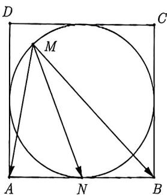
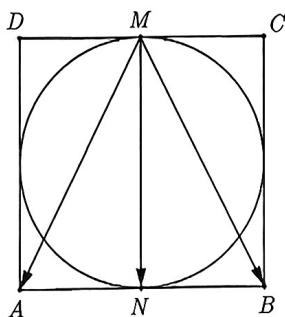
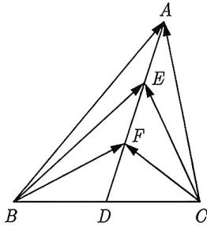
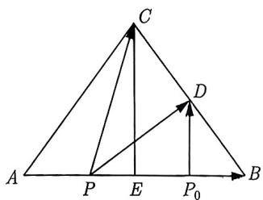
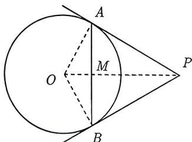

import Guide from '@/components/Guide.astro';
import Knowledge from '@/components/Knowledge.astro';
import Example from '@/components/Example.astro';
import Analysis from '@/components/Analysis.astro';
import Solution from '@/components/Solution.astro';
import Variant from '@/components/Variant.astro';
import Note from '@/components/Note.astro';
import Block from '@/components/Block.astro';

我们知道, 对于任意 $a, b \in \mathbb{R}$ , 恒有 $(a + b)^2 = a^2 + 2ab + b^2$ , $(a - b)^2 = a^2 - 2ab + b^2$ , 类比到平面向量中, 也有类似的结论:

$$
\begin{array}{l} (a + b) ^ {2} = a ^ {2} + b ^ {2} + 2 a \cdot b, \\ (a - b) ^ {2} = a ^ {2} + b ^ {2} - 2 a \cdot b. \end{array}
$$

将两式相减可得 $\boldsymbol{a} \cdot \boldsymbol{b} = \frac{1}{4} \left[ (\boldsymbol{a} + \boldsymbol{b})^{2} - (\boldsymbol{a} - \boldsymbol{b})^{2} \right]$ ，这个等式在数学上称为极化恒等式.

极化恒等式表明, 向量的数量积可以由向量的模来表示, 可以建立起向量与几何长度之间的等量关系. 对于极化恒等式, 可以借助图形给出它的两个几何意义.

<Block title="几何解释 1">
(平行四边形模型) 如图 3-49 所示, 以 AB, AD 为一组邻边构造平行四边形 ABCD, $\overrightarrow{AB} = a, \overrightarrow{AD} = b$ , 则 $\overrightarrow{AC} = a + b, \overrightarrow{BD} = b - a$ , 由 $a \cdot b = \frac{1}{4}[(a + b)^2 - (a - b)^2]$ , 得 $\overrightarrow{AB} \cdot \overrightarrow{AD} = \frac{1}{4}(AC^2 - BD^2)$ , 即 “从平行四边形一个顶点出发的两个边向量的数量积是对角线长的平方差的 $\frac{1}{4}$ ”.
</Block>

<Block title="几何解释 2">
(三角形模型) 如图 3-50 所示, 在平行四边形模型结论的基础上, 设 M 为对角线的交点, 则由 $\overrightarrow{AB} \cdot \overrightarrow{AD} = \frac{1}{4}(AC^{2} - BD^{2})$ 变形为 $\overrightarrow{AB} \cdot \overrightarrow{AD} = \frac{1}{4}(AC^{2} - BD^{2}) = \frac{1}{4}(4AM^{2} - BD^{2})$ , 得 $\overrightarrow{AB} \cdot \overrightarrow{AD} = AM^{2} - \frac{1}{4}BD^{2}$ , 该等式即是极化恒等式在三角形中的体现, 也是我们最常用的极化恒等式的几何模型.
</Block>

<Example title="例 3.51">
(2012 浙江理 15) 在 $\triangle ABC$ 中, M 是 BC 的中点, AM = 3, BC = 10, 则 $\overrightarrow{AB} \cdot \overrightarrow{AC} =$ \_\_\_\_.
<Solution>
由极化恒等式可得 $\overrightarrow{AB} \cdot \overrightarrow{AC} = |\overrightarrow{AM}|^{2} - \frac{1}{4} |\overrightarrow{BC}|^{2} = -16,$ 故填 -16.
</Solution>
</Example>

例3.51是直接考查极化恒等式的三角形模型, 当然, 极化恒等式也是数量积的基底运算的一种延伸, 比如例3.51, 利用基底法也很简单, $\overrightarrow{AB} = \overrightarrow{AM} + \overrightarrow{MB}$ , $\overrightarrow{AC} = \overrightarrow{AM} + \overrightarrow{MC}$ , 所以 $\overrightarrow{AB} \cdot \overrightarrow{AC} = |\overrightarrow{AM}|^2 - \frac{1}{4} |\overrightarrow{BC}|^2 = 16$ , 其中 $\overrightarrow{MB} = \overrightarrow{CM} = \frac{1}{2}\overrightarrow{CB}$ . 平时积累这些常见的二级结论确实可以节省不少运算, 但不能把这些二级结论当作救命稻草.

<Example title="例 3.52">
已知点 M 是边长为 2 的正方形 ABCD 的内切圆内 (含边界) 一动点, 则 $\overrightarrow{MA} \cdot \overrightarrow{MB}$ 的取值范围是 ( ). A. [-1,0] B. [-1,2] C. [-1,3] D. [-1,4]
<Solution>
如图3-51所示, 由向量 $\overrightarrow{MA}$ 和 $\overrightarrow{MB}$ 构成的 $\triangle MAB$ 的底边 $AB$ 为定值, 故可以用极化恒等式, 得

$$
\overrightarrow {M A} \cdot \overrightarrow {M B} = | \overrightarrow {M N} | ^ {2} - \frac {1}{4} | \overrightarrow {A B} | ^ {2} = | \overrightarrow {M N} | ^ {2} - 1.
$$

当点 $M$ 与点 $N$ 重合时, $|\overrightarrow{MN}|$ 取得最小值为 0 , 当点 $M$ 运动到如图 3-52 所示的位置, 即 $MN \perp AB$ 时, $|\overrightarrow{MN}|$ 取得最大值为 2 , 由此可知 $\overrightarrow{MA} \cdot \overrightarrow{MB} \in [-1,3]$ . 故选 C.

<figure class="vp-figure">
  
  <figcaption>图3-51</figcaption>
</figure>

<figure class="vp-figure">
  
  <figcaption>图3-52</figcaption>
</figure>
</Solution>
</Example>

<Block title="经验总结 3.6">
已知 $\triangle ABC, M$ 是 BC 的中点, 若 BC 已知, 利用极化恒等式, 则 $\overrightarrow{AB} \cdot \overrightarrow{AC}$ 只有中线 (AM) 这一个变量.
</Block>

极化恒等式与三角形的底边和中线有关, 但是在经验总结3.6中为什么只强调了底边已知呢? 那是因为若底边也在变, 其相应的中线也必然在变, 不能轻松地将双变量问题转化为单变量问题. 例3.52利用极化恒等式将两个变量转化为单个变量, 这就大大降低了解题难度.

如果题中含有多个数量积, 且它们构成的三角形底边都一样, 那么这时不必知道底边的长度, 因为底边只是沟通这几个数量积的桥梁, 如下例所示.

<Example title="例 3.53">
(2016 江苏 13) 如图 3-53 所示, 在 $\triangle ABC$ 中, $D$ 是 $BC$ 的中点, $E, F$ 是 $AD$ 上的两个三等分点, $\overrightarrow{BA} \cdot \overrightarrow{CA} = 4$ , $\overrightarrow{BF} \cdot \overrightarrow{CF} = -1$ , 则 $\overrightarrow{BE} \cdot \overrightarrow{CE}$ 的值是 \_\_\_\_.
<Analysis>
观察 $\triangle BFC, \triangle BEC, \triangle BAC$ , 发现这三个三角形都有共同的底边 $BC$ , 并且它们的中线都在一条直线上, 所以通过极化恒等式就能将 $\overrightarrow{BA} \cdot \overrightarrow{CA}, \overrightarrow{BF} \cdot \overrightarrow{CF}, \overrightarrow{BE} \cdot \overrightarrow{CE}$ 联系起来.
</Analysis>

<Solution>
已知 $D$ 是 $BC$ 的中点, $E, F$ 是 $AD$ 上的两个三等分点, 可得 $FD = \frac{1}{3} AD$ , $ED = \frac{2}{3} AD$ , 由极化恒等式可得

图3-53

$$
\left\{ \begin{array}{l} \overrightarrow {B A} \cdot \overrightarrow {C A} = A D ^ {2} - \frac {1}{4} B C ^ {2} = 4 \\ \overrightarrow {B F} \cdot \overrightarrow {C F} = \frac {1}{9} A D ^ {2} - \frac {1}{4} B C ^ {2} = - 1 \end{array} \right. \Longrightarrow \left\{ \begin{array}{l} A D ^ {2} = \frac {4 5}{8} \\ B C ^ {2} = \frac {1 3}{2} \end{array} \right.
$$

又因为 $\overrightarrow{BE} \cdot \overrightarrow{CE} = ED^2 - \frac{1}{4} BC^2 = \frac{4}{9} AD^2 - \frac{1}{4} BC^2 = \frac{7}{8}$ , 故填 $\frac{7}{8}$ .
</Solution>
</Example>

<Block title="经验总结 3.7">
如果由多个数量积构成的三角形都有共同的底边, 或者底边之间存在某种关系, 则多个数量积之间可以通过极化恒等式建立联系.
</Block>

<Example title="例 3.54">
(2013 浙江理 7) 设 $\triangle ABC, P_{0}$ 是边 AB 上一定点, 满足 $P_{0}B = \frac{1}{4}AB$ , 且对于边 AB 上任一点 P, 恒有 $\overrightarrow{PB} \cdot \overrightarrow{PC} \geqslant \overrightarrow{P_{0}B} \cdot \overrightarrow{P_{0}C}$ , 则 ( ). A. $\angle ABC = 90^{\circ}$ B. $\angle BAC = 90^{\circ}$ C. AB = AC D. AC = BC
<Analysis>
数量积 $\overrightarrow{PB} \cdot \overrightarrow{PC}$ 与 $\overrightarrow{P_{0}B} \cdot \overrightarrow{P_{0}C}$ 有共同的底边 BC, 当 P 在 AB 上运动时, BC 长度不变, 所以可用极化恒等式.
</Analysis>
<Solution>
如图3-54所示, 设 $D$ 为 $BC$ 的中点, 因为 $\overrightarrow{PB} \cdot \overrightarrow{PC} \geqslant \overrightarrow{P_0B} \cdot \overrightarrow{P_0C}$ , 则通过极化恒等式可得

$$
\begin{array}{c} | \overrightarrow {P D} | ^ {2} - \frac {1}{4} | \overrightarrow {B C} | ^ {2} \geqslant | \overrightarrow {P _ {0} D} | ^ {2} - \frac {1}{4} | \overrightarrow {B C} | ^ {2} \Rightarrow | \overrightarrow {P D} | ^ {2} \\ \geqslant | \overrightarrow {P _ {0} D} | ^ {2} \Rightarrow | \overrightarrow {P D} | \geqslant | \overrightarrow {P _ {0} D} | \Rightarrow P _ {0} D \perp A B. \end{array}
$$

<figure class="vp-figure">
  
  <figcaption>图3-54</figcaption>
</figure>

设 $E$ 为 $AB$ 的中点, 因为 $D, P_0$ . 分别是 $BC, BE$ 的中点, 所以 $CE \parallel P_0 D$ , 因此 $CE \perp AB$ , 从而 $AC = BC$ . 故选 D.
</Solution>
</Example>

例3.51～例3.54这四个例子我们都是利用二级结论极化恒等式来完成解答．然而，这四个例子同样可以使用建立直角坐标系的方法来求解，并且运算量也不大．我们鼓励同学们尝试使用建系的方式进行求解．再次强调，如果所给条件方便建系且运算量不大，我们自然会优先选择建立坐标系的方法．但这并不意味着一定要建系，也可以尝试其他方法，技多不压身．

<Variant title="变式 3.54.1">
(2017 全国 II 理 12) 已知 $\triangle ABC$ 是边长为 2 的等边三角形, $P$ 为平面 $ABC$ 内一点, 则 $\overrightarrow{PA} \cdot (\overrightarrow{PB} + \overrightarrow{PC})$ 的最小值是 ( ). A. -2 B. $-\frac{3}{2}$ C. $-\frac{4}{3}$ D. -1
</Variant>

若底边已知, 或者多个数量积共底边, 都可以考虑利用极化恒等式来处理数量积. 现在的问题是, 若底边在变, 还有可能用极化恒等式吗? 答案是有可能, 只要能建立底边与中线的关系就有可能. 下面通过例子来说明:

<Example title="例 3.55">
(2010 全国 I 理 11) 已知圆 O 的半径为 1, PA, PB 为该圆的两条切线, A, B 为两切点, 那么 $\overrightarrow{PA} \cdot \overrightarrow{PB}$ 的最小值为 ( ). A. $-4 + \sqrt{2}$ B. $-3 + \sqrt{2}$ C. $-4 + 2\sqrt{2}$ D. $-3 + 2\sqrt{2}$
<Analysis>
如图3-55所示, 设 $M$ 为 $AB$ 的中点, 当 $P$ 运动时, $AB$ 和 $PM$ 都在变化, 表面看起来利用极化恒等式 $\overrightarrow{PA} \cdot \overrightarrow{PB} = PM^2 - \frac{1}{4} AB^2$ 以后它依然是双变量问题. 不过, 设 $AB = 2x$ , 则可以求得 (细节见解析) $PM = \frac{1}{\sqrt{1 - x^2}} - \sqrt{1 - x^2}$ , 也就是说, 它本质上还是单变量问题.

</Analysis><Solution>
设 $\overrightarrow{PA} \cdot \overrightarrow{PB}$ 取最小值时 AB = 2x，则 $x \in (0,1)$ . 如图 3-55 所示，记 AB 的中点为 M，则 $OM = \sqrt{1 - x^{2}}$ , $OP = \frac{1}{\sqrt{1 - x^{2}}}$ , 于是 $PM = \frac{1}{\sqrt{1 - x^{2}}} - \sqrt{1 - x^{2}}$ . 由极化恒等式可得

图3-55

$$
\overrightarrow {P A} \cdot \overrightarrow {P B} = P M ^ {2} - \frac {1}{4} A B ^ {2} = \left(\frac {1}{\sqrt {1 - x ^ {2}}} - \sqrt {1 - x ^ {2}}\right) ^ {2} - x ^ {2} = \frac {1}{1 - x ^ {2}} - 2 x ^ {2} - 1.
$$

令 $1 - x^{2} = t$ ，则 $t\in (0,1)$ ，于是

$$
\overrightarrow {P A} \cdot \overrightarrow {P B} = \frac {1}{t} - 2 (1 - t) - 1 = \frac {1}{t} + 2 t - 3 \geqslant 2 \sqrt {\frac {1}{t} \cdot 2 t} - 3 = 2 \sqrt {2} - 3,
$$

当且仅当 $t = \frac{\sqrt{2}}{2}$ 时等号成立, 故选D.
</Solution>
</Example>

对于例3.55, 我们也可以考虑使用建系的方法进行求解, 计算量与利用极化恒等式差不多. 有兴趣的同学可以尝试一下. 此外, 在下一章中, 我们还将介绍另一种解析方法, 具体内容请参考例4.65.

接下来, 让我们回顾一下本节开篇给出的例3.47. 我们已经看到, 通过建系的方式进行求解会导致计算过程非常烦琐. 这个例子向我们阐明了一个重要观点, 即建系是首选方法, 非常重要! 然而, 我们不能仅仅为了建系而建系, 而是需要掌握一些解决建系求解问题的技巧. 现在, 让我们再次来解例3.47, 你会发现使用极化恒等式要比建系简便得多!

<Example title="例 3.56">
(2023 合肥模考) 已知 A, B, C 是单位圆上的三个动点, 则 $\overrightarrow{AB} \cdot \overrightarrow{AC}$ 的最小值为 ( ) . A. -1 B. $-\frac{1}{2}$ C. $-\frac{1}{3}$ D. $-\frac{1}{4}$
<Solution>
设 BC = 2x 时， $\overrightarrow{AB} \cdot \overrightarrow{AC}$ 取最小值。取 BC 的中点 M，则由极化恒等式可得 $\overrightarrow{AB} \cdot \overrightarrow{AC} = AM^{2} - \frac{1}{4} BC^{2} = AM^{2} - x^{2}$ 。显然，要让 $\overrightarrow{AB} \cdot \overrightarrow{AC}$ 取最小值，则需要此时 AM 也取最小值。设单位圆的圆心为 O， $AM \geqslant AO - OM = 1 - \sqrt{1 - x^{2}}$ ，当且仅当 O, A, M 三点共线时等号成立，于是

$$
\overrightarrow {A B} \cdot \overrightarrow {A C} \geqslant \left(1 - \sqrt {1 - x ^ {2}}\right) ^ {2} - x ^ {2} = 2 (1 - x ^ {2}) - 2 \sqrt {1 - x ^ {2}}.
$$

令 $t = \sqrt{1 - x^2}$ , 则 $1 - x^2 = t^2$ , 于是 $\overrightarrow{AB} \cdot \overrightarrow{AC} \geqslant 2(t^2 - t) = 2\left(t - \frac{1}{2}\right)^2 - \frac{1}{2} \geqslant -\frac{1}{2}$ , 当且仅当 $t = \frac{1}{2}$ , 即 $x = \frac{\sqrt{3}}{2}$ 时等号成立. 故选 B.
</Solution>
</Example>
