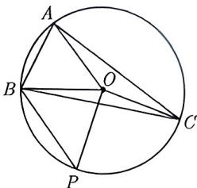

import Guide from '@/components/Guide.astro';
import Knowledge from '@/components/Knowledge.astro';
import Example from '@/components/Example.astro';
import Analysis from '@/components/Analysis.astro';
import Solution from '@/components/Solution.astro';
import Variant from '@/components/Variant.astro';
import Note from '@/components/Note.astro';
import Block from '@/components/Block.astro';

在 $\triangle ABC$ 中, 一方面由余弦定理公式可得 $2AB \cdot AC \cdot \cos A = AB^2 + AC^2 - BC^2$ , 另一方面由向量数量积夹角公式可得 $\cos A = \frac{\overrightarrow{AB} \cdot \overrightarrow{AC}}{AB \cdot AC}$ . 于是我们得到如下所示的向量余弦式.

<Block title="向量余弦式">
在 $\triangle ABC$ 中, $2\overrightarrow{AB} \cdot \overrightarrow{AC} = AB^2 + AC^2 - BC^2$ .
</Block>

与三角形的余弦公式一样, 向量余弦式也常用于边多角少的情形.

<Example title="例 3.57">
在 $\triangle ABC$ 中, AB = 2, AC = 3, $\overrightarrow{AB} \cdot \overrightarrow{BC} = 1$ , 则 $BC = (\quad)$ .
A. $\sqrt{3}$ B. $\sqrt{7}$ C. $2\sqrt{2}$ D. $2\sqrt{3}$

<Solution>
因为 $\overrightarrow{AB} \cdot \overrightarrow{BC} = -\overrightarrow{BA} \cdot \overrightarrow{BC}$ ，所以 $2\overrightarrow{AB} \cdot \overrightarrow{BC} = \overrightarrow{CA}^{2} - \overrightarrow{BA}^{2} - \overrightarrow{BC}^{2}$ ，又因为 AB = 2, AC = 3，代入可得 $BC = \sqrt{3}$ ，故选 A.
</Solution>

向量内积要与边长建立联系, 自然想到余弦定理向量式, 因为 $\overrightarrow{AB} \cdot \overrightarrow{BC}$ 与边长 $BC$ 联系起来, 此时要特别注意的是 $\overrightarrow{AB}$ 与 $\overrightarrow{BC}$ 的夹角并不是 $\angle B$ , 而是它的补角, 因此要进行转化 $\overrightarrow{AB} \cdot \overrightarrow{BC} = -\overrightarrow{BA} \cdot \overrightarrow{BC}$ , 进而用向量余弦式.
</Example>

<Example title="例 3.58">
(2023 福建厦门二模) 圆 O 为锐角 $\triangle ABC$ 的外接圆, AC = 2AB = 2, 点 P 在圆 O 上, 则 $\overrightarrow{BP} \cdot \overrightarrow{AO}$ 的取值范围为 ( ).

A. $\left[-\frac{1}{2}, 4\right)$ B. [0, 2) C. $\left[-\frac{1}{2}, 2\right)$ D. [0, 4)

<Solution>
因为 O 是 $\triangle ABC$ 的外心, 所以 OA = OB = OP = r, 如图 3-56 所示. 又因为 $\overrightarrow{BP} = \overrightarrow{OP} - \overrightarrow{OB}$ , 所以 $\overrightarrow{BP} \cdot \overrightarrow{AO} = (\overrightarrow{OP} - \overrightarrow{OB}) \cdot \overrightarrow{AO} = \overrightarrow{OA} \cdot \overrightarrow{OB} - \overrightarrow{OA} \cdot \overrightarrow{OP}$ , 由向量余弦式可得 $\overrightarrow{OA} \cdot \overrightarrow{OB} - \overrightarrow{OA} \cdot \overrightarrow{OP}$ $= \frac{|\overrightarrow{OA}|^{2} + |\overrightarrow{OB}|^{2} - |\overrightarrow{AB}|^{2}}{2} - \frac{|\overrightarrow{OA}|^{2} + |\overrightarrow{OP}|^{2} - |\overrightarrow{AP}|^{2}}{2} = \frac{1}{2} (|\overrightarrow{AP}|^{2} - 1)$ .

因为 A, P 是圆上的动点, 所以 $|AP| \in [0, 2r]$ , 这 $\overrightarrow{BP} \cdot \overrightarrow{AO} \in [-\frac{1}{2}, 2r^{2} - \frac{1}{2}]$ . 因此, 我们只需要把外接圆半径 r 的范围求出来即可.

<figure class="vp-figure">
  
  <figcaption>图3-56</figcaption>
</figure>

(1) 因为点 $O$ 为锐角 $\triangle ABC$ 的圆心, 所以点 $O$ 在 $\triangle ABC$ 的内部, 而在 $\triangle OAC$ 中, 要构 $\triangle OAC$ , 由 $AC = 2$ , 可得 $OA + OC > AC$ , 得 $2r > 2$ , 即 $r > 1$ .

(2) 因为 $AB = 1$ , $AC = 2$ , $\triangle ABC$ 为锐角三角形, 所以 $\angle BAC = 90^\circ$ 为临界值, 此时可得临界值 $BC = \sqrt{5}$ , 故得 $BC < \sqrt{5}$ . 由正弦定理可知 $2r \sin \angle BAC < \sqrt{5}$ 恒成立, 整理得 $2r < \frac{\sqrt{5}}{\sin \angle BAC}$ , 所以 $r < \frac{\sqrt{5}}{2}$ .

由 (1) 与 (2) 可得 $1 < r < \frac{\sqrt{5}}{2}$ , 所以 $2r^2 - \frac{1}{2} < 2$ 恒成立, 故 $\overrightarrow{BP} \cdot \overrightarrow{AO} \in \left[-\frac{1}{2}, 2\right)$ , 故选 C.
</Solution>
</Example>

变形是一门很灵活的技巧, 就是把陌生的变为熟悉的, 把不能使用的变为能够使用的, 这种技巧并不是轻易就能掌握的, 需要在做大量试题的基础上总结提炼, 下面这个题表面上跟我们所讲的内容并无联系, 但是通过变形你就会发现两者是完全可以建立联系的.

<Example title="例 3.59">
已知 O 为锐角 $\triangle ABC$ 的外心， $|\overrightarrow{AB}| = 16, |\overrightarrow{AC}| = 10\sqrt{2}$ ，若 $\overrightarrow{AO} = x\overrightarrow{AB} + y\overrightarrow{AC}$ ，且 $32x + 25y = 25$ ，则 $|\overrightarrow{AO}|$ 的值为（）.
A. 4 B. 6 C. 8 D. 10

<Solution>
所求的是 $OA$ 的模长, 对于向量要出现模长, 最直接的办法就是数量积, 因此考虑对 $\overrightarrow{AO} = x\overrightarrow{AB} + y\overrightarrow{AC}$ 构造出数量积, 很明显只需两边乘 $\overrightarrow{AO}$ 即可, 由此可得 $\overrightarrow{AO^2} = x \cdot \overrightarrow{AB} \cdot \overrightarrow{AO} + y \cdot \overrightarrow{AC} \cdot \overrightarrow{AO}$ , 然后利用向量余弦式

$$
\overrightarrow {A O} ^ {2} = x \frac {| \overrightarrow {A B} | ^ {2} + | \overrightarrow {A O} | ^ {2} - | \overrightarrow {O B} | ^ {2}}{2} + y \frac {| \overrightarrow {A C} | ^ {2} + | \overrightarrow {A O} | ^ {2} - | \overrightarrow {O C} | ^ {2}}{2} = 4 (3 2 x + 2 5 y).
$$

又因为题中条件给出 $32x + 25y = 25$ ，所以 $\overrightarrow{AO}^2 = 100$ ，则 $|\overrightarrow{AO}| = 10$ ，故选D.
</Solution>
</Example>

<Variant title="变式 3.59.1">
（2019 长沙一模）在 $\triangle ABC$ 中，AB = 10, BC = 6, CA = 8，且 O 是 $\triangle ABC$ 的外心，则 $\overrightarrow{CA} \cdot \overrightarrow{AO} = (\quad)$ .
A. 16 B. 32 C. -16 D. -32
</Variant>
