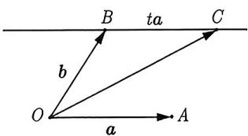
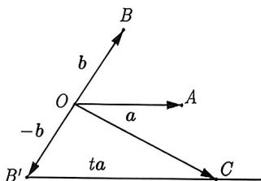
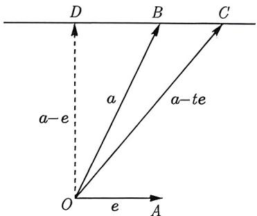
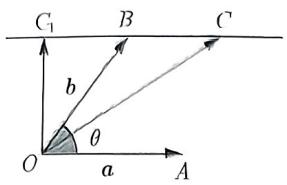
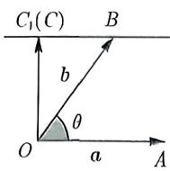
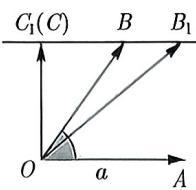
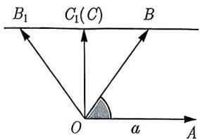
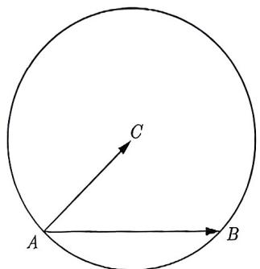
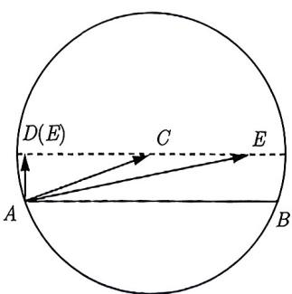

import Guide from '@/components/Guide.astro';
import Knowledge from '@/components/Knowledge.astro';
import Example from '@/components/Example.astro';
import Analysis from '@/components/Analysis.astro';
import Solution from '@/components/Solution.astro';
import Variant from '@/components/Variant.astro';
import Note from '@/components/Note.astro';
import Block from '@/components/Block.astro';
import Summary from '@/components/Summary.astro';

下面我们来了解一种常见的几何问题, 即与平行线的最值问题有关的问题. 对于形如 $ta \pm b$ 的向量表达式, 通过图形辅助解题, 往往比使用代数方法简单得多.

<Knowledge title="知识点 3.10">
将不共线的向量 a, b, c 平移成共起点 O，设它们的终点依次为 A, B, C.
(1) 若 $c = ta + b$ ，则 C 的轨迹是一条直线，且这条直线与 a 平行并且 B 落在该直线上.
(2) 若 $c = ta - b$ ，则 C 的轨迹是一条直线，且这条直线与 a 平行并且 $B'$ 落在该直线上，这里 $B'$ 是 B 关于 O 的对称点.
</Knowledge>

<Solution>
令 $a = \overrightarrow{OA}, b = \overrightarrow{OB}, c = \overrightarrow{OC}, -b = \overrightarrow{OB'}$ ，则

(1) 如图 3-57 所示, 由 $c = b + ta$ , 得 $\overrightarrow{OC} = \overrightarrow{OB} + t\overrightarrow{OA}$ , 故 $\overrightarrow{OC} - \overrightarrow{OB} = t\overrightarrow{OA}$ , 所以 $C$ 的轨迹是一条直线, 且这条直线与 $a$ 平行并且 $B$ 落在该直线上.

(2) 如图 3-58 所示, 由 $c = -b + ta$ , 得 $\overrightarrow{OC} = \overrightarrow{OB'} + t\overrightarrow{OA}$ , 故 $\overrightarrow{OC} - \overrightarrow{OB'} = t\overrightarrow{OA}$ , 所以 $C$ 的轨迹是一条直线, 且这条直线与 $a$ 平行并且 $B'$ 落在该直线上, 这里 $B'$ 是 $B$ 关于 $O$ 的对称点.

<figure class="vp-figure">
  
  <figcaption>图3-57</figcaption>
</figure>

<figure class="vp-figure">
  
  <figcaption>图3-58</figcaption>
</figure>
</Solution>

由知识点3.10可知, $C$ 在直线 $BC$ (见图3-57) 或直线 $B'C$ (见图3-58) 上运动时, 如果 $OC \perp BC$ 或 $OC \perp B'C$ , 那么线段 $OC$ 取到最小值, 即 $|ta \pm b|$ 取得最小值. 现总结如下:

 $|ta \pm b|$ (其中 t 为任意实数) 的最小值在 $(ta \pm b) \perp a$ 处取得.

我们也可以利用函数的最值思想来推导上述结论. 以 $|ta + b|$ 的最小值为例作说明, $|ta + b|$ 的情形可类似得到. 设 $f(t) = |ta + b|^2$ , 利用向量模长的公式可得

$$
f (t) = (t \boldsymbol {a} + \boldsymbol {b}) \cdot (t \boldsymbol {a} + \boldsymbol {b}) = | \boldsymbol {a} | ^ {2} t ^ {2} + (2 \boldsymbol {a} \cdot \boldsymbol {b}) t + | \boldsymbol {b} | ^ {2}.
$$

显然, $f(t)$ 是关于 $t$ 的二次函数且 $t \in \mathbb{R}$ , 因此其最值在对称轴处取得, 即 $t = -\frac{\boldsymbol{a} \cdot \boldsymbol{b}}{|\boldsymbol{a}|^2}$ . 进一步化简可得 $(ta + b) \cdot a = 0$ , 即 $(ta + b) \perp a$ , 则 $|ta + b|$ 的最小值在 $(ta + b) \perp a$ 处取得.

<Example title="例 3.67">
已知向量 $a \neq e, |e| = 1$ ，对任意 $t \in R$ ，恒有 $|a - te| \geqslant |a - e|$ ，则（）.
A. $a \perp e$ B. $a \perp (a - e)$ C. $e \perp (a - e)$ D. $(a + e) \perp (a - e)$

<Solution title="解析 1">
 因为对任意 $t \in R$ ，恒有 $|a - te| \geqslant |a - e|$ ，所以 $|a - te|$ 最小值为 $|a - e|$ .

令 $e = \overrightarrow{OA}, a = \overrightarrow{OB}, a - te = \overrightarrow{OC}$ , 由知识点3.10可知 $BC / / OA$ , 过 $O$ 作 $OD \perp BC$ , 垂足为 $D$ , 则当 $C$ 在直线 $BC$ 上运动时, $|OC|$ 取得最小值 $|OD|$ , 如图3-59所示, 此时 $\overrightarrow{OD} = a - e$ , 所以 $e \perp (a - e)$ . 故选 C.

</Solution>

<Solution title="解析 2">
 因为向量 $a \neq e, |e| = 1$ ，对任意 $t \in R, |a - te| \geqslant |a - e|$ ，图 3-59

所以对不等式两边同时平方, 化简整理可得 $t^2 - 2aet + 2ae - 1 \geqslant 0$ 对任意 $t \in \mathbb{R}$ 都成立. 于是

$$
\Delta = 4 (\boldsymbol {a} \cdot \boldsymbol {e}) ^ {2} - 4 (2 \boldsymbol {a} \cdot \boldsymbol {e} - 1) \leqslant 0 \Rightarrow (\boldsymbol {a} \cdot \boldsymbol {e} - 1) ^ {2} \leqslant 0 \Rightarrow \boldsymbol {a} \cdot \boldsymbol {e} = 1.
$$

根据选项, 可知 C 选项中, 因为 $e \perp (a - e)$ , 所以 $e \cdot (a - e) = 0$ , 即为 $a \cdot e = 1$ , 故选 C.
</Solution>
</Example>

<Example title="例 3.68">
(2014 浙江文 9) 设 $\theta$ 为两个非零向量 $a, b$ 的夹角, 已知对任意实数 $t$ , $|b + ta|$ 的最小值为 1 , 则 ( ).

A. 若 $\theta$ 确定, 则 $|a|$ 唯一确定 B. 若 $\theta$ 确定, 则 $|b|$ 唯一确定 C. 若 $|a|$ 确定, 则 $\theta$ 唯一确定 D. 若 $|b|$ 确定, 则 $\theta$ 唯一确定

<Solution title="解析 1">
令 $a = \overrightarrow{OA}, b = \overrightarrow{OB}, c = \overrightarrow{OC}$ ，如图 3-60 所示， $\overrightarrow{OC} = c = b + ta = \overrightarrow{OB} + t\overrightarrow{OA}$ ，即 $\overrightarrow{BC} = t\overrightarrow{OA}$ ，所以 C 点的轨迹为过 B 且与 OA 平行的直线。当 C 与 $C_{1}$ 重合时， $|b + ta|$ 取得最小值为 $|\overrightarrow{OC_{1}}| = 1$ 。

选项 A, 如图 3-60 所示, 在 Rt△OC₁B 中, $\tan\angle OBC_{1}=\frac{|\overrightarrow{OC_{1}}|}{|\overrightarrow{BC_{1}}|}$ , 则 $\tan\theta=\frac{1}{|t||a|}$ , 即 $|a|=\frac{1}{|t|\tan\theta}$ , 当 $\theta$ 确定时, 若 $|t|$ 取不同的值, 得到的 $|a|$ 不唯一, 因此 A 错误.

选项 B, 如图 3-61 所示, 在 Rt△OC₁B 中, $\sin\angle OBC_{1}=\frac{|\overrightarrow{OC_{1}}|}{|\overrightarrow{OB}|}$ , 则 $|\overrightarrow{OB}|=\frac{|\overrightarrow{OC_{1}}|}{\sin\angle OBC_{1}}$ , 即 $|b|=\frac{1}{\sin\theta}$ , 可知当 $\theta$ 确定时, $|b|$ 是定值, 因此 B 正确.

选项 C, 如图 3-62 所示, 在 Rt△OC₁B 中, $\tan\angle OBC_{1}=\frac{|\overrightarrow{OC_{1}}|}{|\overrightarrow{BC_{1}}|}$ , 即 $\tan\theta=\frac{1}{|t||a|}$ , 可知当 $|a|$ 确定时, 若 $|t|$ 取不同的值, $\theta$ 不是唯一确定的, 因此 C 错误.

选项 D, 如图 3-63 所示, 在 Rt△OC₁B 中, $\sin\angle OBC_{1}=\frac{|\overrightarrow{OC_{1}}|}{|\overrightarrow{OB}|}$ , 即 $\sin\theta=\frac{1}{|b|}$ , $\theta$ 可能是锐角或钝角, 因此 D 错误.

故选 B.

你的非排 ？平面几何与三角函数(第二版)

<figure class="vp-figure">
  
  <figcaption>图3-60</figcaption>
</figure>

<figure class="vp-figure">
  
  <figcaption>图3-61</figcaption>
</figure>

<figure class="vp-figure">
  
  <figcaption>图3-62</figcaption>
</figure>

<figure class="vp-figure">
  
  <figcaption>图3-63</figcaption>
</figure>

</Solution>

<Solution title="解析 2">
令 $f(t)=|b+ta|^{2}$ ，则 $f(t)=a^{2}t^{2}+2|a||b|\cos\theta t+b^{2}$ ，由于 $|a|\neq0$ ，所以 $f(t)$ 是关于 t 的二次函数，对称轴为 $t=-\frac{|b|\cos\theta}{|a|}$ ，所以 $f(t)_{\min}=f\left(-\frac{|b|\cos\theta}{|a|}\right)=1$ ，即为

$$
f \left(- \frac {| \boldsymbol {b} | \cos \theta}{| \boldsymbol {a} |}\right) = \boldsymbol {a} ^ {2} \cdot \left(- \frac {| \boldsymbol {b} | \cos \theta}{| \boldsymbol {a} |}\right) ^ {2} + 2 | \boldsymbol {a} | | \boldsymbol {b} | \cos \theta \cdot \left(- \frac {| \boldsymbol {b} | \cos \theta}{| \boldsymbol {a} |}\right) + \boldsymbol {b} ^ {2} = 1,
$$

化简可得 $\boldsymbol{b}^{2}(1-\cos^{2}\theta)=1$ ，整理得 $b^{2}\sin^{2}\theta=1$ ，即 $\sin\theta=\frac{1}{|b|}$ 。当 $|b|$ 确定， $\theta$ 会出现两个值，分别为第一象限角与第二象限角，故 D 错误。当 $\theta$ 确定， $|b|$ 唯一确定。故选 B.
</Solution>
</Example>

对于 $c = ta + b$ （其中 $t$ 为任意实数）这类题型，同学们可以考虑两种解题思路：几何意义和函数思想。在例3.67和例3.68中，我们也可以采用坐标法解题，但建系法的运算相对复杂，如果同学们有兴趣，也可以尝试使用坐标法。

现在, 让我们再次来看例3.66, 为了完善叙述的完整性并便于同学们对比, 将题目再复制如下. 在本节的开篇, 我们通过建系的方式求解本题, 虽然建系比较简单, 但计算却相对复杂. 在这里, 我们将通过几何意义来解决.

<Example title="例 3.69">
已知定圆 C 的半径为 3, A, B 为圆 C 上两点, 且 $\left|\overrightarrow{AC} + t\overrightarrow{AB}\right|$ 的最小值为 1, 则 $\left|\overrightarrow{AB}\right| =$ \_\_\_\_.

<Solution>
根据题意, 画出草图, 图像如图 3-64 所示. 令 $\overrightarrow{AE} = \overrightarrow{AC} + t\overrightarrow{AB}$ , 即 $\overrightarrow{CE} = t\overrightarrow{AB}$ , 所以点 $E$ 的轨迹为过点 $C$ 且与 $AB$ 平行的直线. 当 $E$ 与 $D$ 点重合, 即 $AD \perp CD$ 时, $|\overrightarrow{AC} + t\overrightarrow{AB}|$ 取得最小值为 $|AD| = 1$ , 如图 3-65 所示. 可得圆心 $C$ 到线段 $AB$ 的距离 $d = 1$ , 所以由圆内弦长公式可知 $|AB| = 2\sqrt{r^2 - d^2} = 4\sqrt{2}$ , 故填 $4\sqrt{2}$ .

<figure class="vp-figure">
  
  <figcaption>图3-64</figcaption>
</figure>

<figure class="vp-figure">
  
  <figcaption>图3-65</figcaption>
</figure>
</Solution>
</Example>

对比例3.66和例3.69这两个例子的解析, 你会发现建系法相比几何意义来说并不直接. 再次强调, 建系是向量问题的首选方法, 但在某些情况下, 建系并不方便且运算量较大, 这时候建系就不可取, 应当选择其他方法来解决问题.

<Variant title="变式 3.69.1">
（2023 天津模考）在 $\triangle ABC$ 中， $A = \frac{\pi}{3}$ ，点 $D$ 满足 $\overrightarrow{BD} = \frac{1}{3}\overrightarrow{AB} + \frac{2}{3}\overrightarrow{BC}$ ，则 $\frac{AD}{AC} =$ \_\_\_\_；若对任意 $x \in \mathbb{R}$ ， $|x\overrightarrow{AC} + \overrightarrow{AB}| \geqslant |\overrightarrow{AD} - \overrightarrow{AB}|$ 恒成立，则 $\cos \angle ABC =$ \_\_\_\_.
</Variant>
