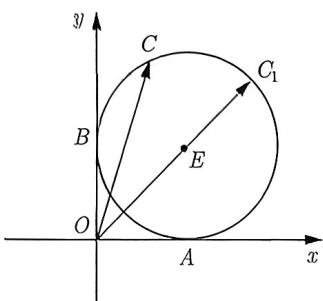
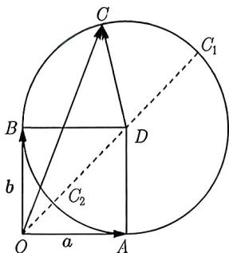
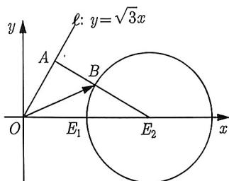
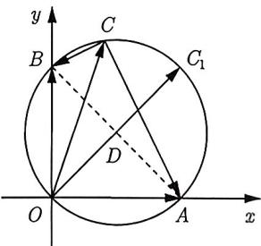
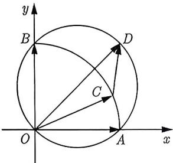
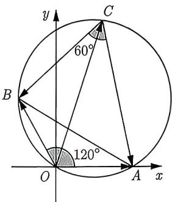

import Guide from '@/components/Guide.astro';
import Knowledge from '@/components/Knowledge.astro';
import Example from '@/components/Example.astro';
import Analysis from '@/components/Analysis.astro';
import Solution from '@/components/Solution.astro';
import Variant from '@/components/Variant.astro';
import Note from '@/components/Note.astro';
import Block from '@/components/Block.astro';

<Knowledge title="知识点 3.11">
若 $\left|a-a_{0}\right|=r, a_{0}$ 是确定的, 如果将不共线的 a, $a_{0}$ 平移成共起点, 则 a 的终点轨迹是以 $a_{0}$ 的终点为圆心, 半径为 r 的圆.
</Knowledge>

<Example title="例 3.70">
（2013 湖南理 6）已知 a, b 是单位向量, $a \cdot b = 0$ . 若向量 c 满足 $|c - a - b| = 1$ , 则 $|c|$ 的取值范围是 ( ). A. $[\sqrt{2} - 1, \sqrt{2} + 1]$ B. $[\sqrt{2} - 1, \sqrt{2} + 2]$ C. $[1, \sqrt{2} + 1]$ D. $[1, \sqrt{2} + 2]$

<Solution title="解析 1">
向量问题首选建系, 本例特征很明显, 由已知 a, b 是单位向量, $a \cdot b = 0$ , 把向量 a, b 固定在坐标轴上, 为了便于理解与叙述, 故令 $a = \overrightarrow{OA}$ , $b = \overrightarrow{OB}$ , $c = \overrightarrow{OC}$ . 因为 $\overrightarrow{OA} \perp \overrightarrow{OB}$ , 故以 O 为原点, 分别以 $\overrightarrow{OA}$ , $\overrightarrow{OB}$ 方向为 x, y 轴, 建立如图 3-66 所示的平面直角坐标系, 则 $A(1,0)$ , $B(0,1)$ . 设 $C(x,y)$ , 则

$$
| \overrightarrow {O C} - \overrightarrow {O A} - \overrightarrow {O B} | = 1 \Rightarrow | (x, y) - (1, 0) - (0, 1) | = 1 \Rightarrow (x - 1) ^ {2} + (y - 1) ^ {2} = 1.
$$

因为 $|\overrightarrow{OC}|$ 表示原点到圆 $E$ 上点的距离, 注意到 $O$ 在圆外, 所以 $|\overrightarrow{OC}|$ 的最大值为 $O$ 到圆心的距离加上圆的半径, 为 $|OE| + r = \sqrt{1^2 + 1^2} + 1$ . 而 $|\overrightarrow{OC}|$ 的最小值为 $O$ 到圆心的距离减去圆的半径, 为 $|OE| - r = \sqrt{1^2 + 1^2} - 1$ , 所以 $|c|$ 的取值范围是 $[\sqrt{2} - 1, \sqrt{2} + 1]$ , 故选 A.
</Solution>

例3.70通过建系得到点 $C$ 的轨迹方程, 这是建系最大的优势, 选择建系可以把动点的运动轨迹方程确定. 当然我们也可以直接考虑其几何意义, 下面见解析2:

<Solution title="解析 2">
令 $a = \overrightarrow{OA}, b = \overrightarrow{OB}, c = \overrightarrow{OC}, a + b = \overrightarrow{OD}$ ，如图 3-67 所示。由 $|c - a - b| = 1$ ，得 $|\overrightarrow{OC} - \overrightarrow{OD}| = |\overrightarrow{DC}| = 1$ ，所以动点 C 在以 D 为圆心，1 为半径的圆上。

当 C 运动到 $C_{1}$ 时, $|c|$ 取得最大值, 且最大值为 $|\overrightarrow{OC_{1}}| = |\overrightarrow{OD}| + DC_{1} = \sqrt{2} + 1;$

当 $C$ 运动到 $C_2$ 时， $|c|$ 取得最小值，且最小值为 $|\overrightarrow{OC}_2| = |\overrightarrow{OD}| - DC_1 = \sqrt{2} - 1.$ 故选A.
</Solution>

<figure class="vp-figure">
  
  <figcaption>图3-66</figcaption>
</figure>

<figure class="vp-figure">
  
  <figcaption>图3-67</figcaption>
</figure>
</Example>

对于大多数同学来说, 解例3.70更加倾向于使用解析 1, 因为解析 1 具有明显的代数特征, 而解析 2 相对来说较为抽象. 因此, 在方便建系时, 我们需要考虑使用建系法. 对于后面的例子和变式, 如果建系方便且运算量不大, 我们应该优先考虑建系法. 然而, 如果建系较为困难, 我们可以考虑采用几何意义来解决问题.

当然, 我们更希望同学们能够同时尝试使用建系和几何意义这两种思路. 这样可以提升解题的灵活性, 让同学们在不同类型的问题中都能找到最优解的方法.

<Example title="例 3.71">
(2018 浙江 9) 已知 a, b, e 是平面向量, e 是单位向量. 若非零向量 a 与 e 的夹角为 $\frac{\pi}{3}$ ，向量 b 满足 $b^{2}-4e\cdot b+3=0$ ，则 $|a-b|$ 的最小值是（）.
A. $\sqrt{3}-1$ B. $\sqrt{3}+1$ C. 2
D. $2-\sqrt{3}$

<Solution>
令 $a=\overrightarrow{OA}, b=\overrightarrow{OB}, e=\overrightarrow{OE_{1}}, 2e=\overrightarrow{OE_{2}}$ . 把 e 的坐标固定在坐标轴上, 令 $e=\overrightarrow{OE_{1}}=(1,0)$ , 点 A 的坐标设为 $(x,y)$ , 因为 a 与 e 的夹角为 $\frac{\pi}{3}$ , 所以 A 在射线 $\ell:y=\sqrt{3}x(x>0)$ 上. 同样假设 $\boldsymbol{b}=\overrightarrow{OB}=(x,y)$ , 由 $b^{2}-4e\cdot b+3=0$ , 可得 $(x-2)^{2}+y^{2}=1$ , 所以点 B 在以 $E_{2}(2,0)$ 为圆心, 1 为半径的圆上. 因为 $|a-b|=|\overrightarrow{OA}-\overrightarrow{OB}|=|\overrightarrow{BA}|$ , 所以 $|a-b|$ 可以理解为圆上一点与射线 $\ell$ 上一点的连线的距离.

<figure class="vp-figure">
  
  <figcaption>图3-68</figcaption>
</figure>

因为 $E_{2}$ 到 $\ell$ 的距离 $d = \frac{|0 - 2\sqrt{3}|}{\sqrt{1 + 3}} = \sqrt{3}$ , 所以 $|\overrightarrow{BA}|_{\min} = d - 1 = \sqrt{3} - 1$ . 图像如图3-68所示, 故选A.
</Solution>
</Example>

在圆的性质之中, 率先想到的莫过于直径所对的圆周角为直角, 而向量的数量积恰恰是角度最好的体现, 则有如下知识点:

<Knowledge title="知识点 3.12">
 若 $(a-b)\cdot(a-c)=0(b,c$ 是确定的)，如果将不共线的 a, b, c 平移成共起点，则 a 的终点轨迹是以 b, c 的终点连线为直径的圆.
</Knowledge>

<Example title="例 3.72">
（2008 浙江理 9）已知 a, b 是平面内两个互相垂直的单位向量，若向量 c 满足 $(a - c) \cdot (b - c) = 0$ ，则 $|c|$ 的最大值是（）.

A. 1 B. 2 C. $\sqrt{2}$ D. $\frac{\sqrt{2}}{2}$

<Solution>
如图3-69所示, 令 $a = \overrightarrow{OA}, b = \overrightarrow{OB}, c = \overrightarrow{OC}$ , 则 $a - c = \overrightarrow{CA}, b - c = \overrightarrow{CB}$ , 由已知得 $\overrightarrow{CA} \cdot \overrightarrow{CB} = 0$ , 即点 $C$ 在以 $AB$ 为直径的圆上. 因为 $O$ 在圆上, 所以当 $OC$ 为它的直径, 即 $C$ 与 $C_1$ 重合时, $|c|$ 最大, 且最大值为 $\sqrt{2}$ . 故选 C.
</Solution>
</Example>

<Example title="例 3.73">
(2011 辽宁 10) 若 a, b, c 均为单位向量, 且 $a \cdot b = 0, (a - c) \cdot (b - c) \leqslant 0$ , 则 $|a + b - c|$ 的最大值为 ( ).

A. $\sqrt{2} - 1$ B. 1

C. $\sqrt{2}$ D. 2

<Solution>
如图3-70所示, 令 $a = \overrightarrow{OA}, b = \overrightarrow{OB}, c = \overrightarrow{OC}$ , 则 $a - c = \overrightarrow{CA}, b - c = \overrightarrow{CB}$ , 由已知得 $\overrightarrow{CA} \cdot \overrightarrow{CB} \leqslant 0$ , 于是点 $C$ 在以 $AB$ 为直径的圆内或圆上. 又因为 $|c| = 1$ , 所以 $C$ 点只能在以 $O$ 为圆心的 $\widehat{AB}$ 上移动. 令 $a + b = \overrightarrow{OD}$ , 则 $a + b - c = \overrightarrow{OD} - \overrightarrow{OC} = \overrightarrow{CD}$ , 由于 $D$ 为定点, 故显然当 $C$ 与 $A$ 或 $B$ 重合时, $|\overrightarrow{CD}|$ 取得最大值为1, 即 $|a + b - c|$ 的最大值为1. 故选B.
</Solution>
</Example>

<figure class="vp-figure">
  
  <figcaption>图3-69</figcaption>
</figure>

<figure class="vp-figure">
  
  <figcaption>图3-70</figcaption>
</figure>

<Variant title="变式 3.73.1">
(2009 全国 I 理 6) 设 a, b, c 是单位向量, 且 $a \cdot b = 0$ , 则 $(a - c) \cdot (b - c)$ 的最小值为 ( ).

A. -2
B. $\sqrt{2} - 2$ C. -1
D. $1 - \sqrt{2}$
</Variant>

在遇到以线段长为直径的圆的时候, 我们要做的就是转化圆上的点与线段的两端点所构成的数量积为零. 但我们都知道直径是特殊的弦长, 由特殊性必然可以推广到一般性, 以线段长为直径的圆的向量形式为 $(c - a)(c - b) = 0$ . 这是以 $|a - b|$ 为直径的圆. 正是由于角度的特殊性, 可以通过数量积体现出直角, 若不是直角则数量积就没有一般性了, 因此我们把以线段长为直径的圆的向量式一般化就可以得到 $\langle c - a, c - b \rangle = 90^{\circ}$ , 其中 $|a - b|$ 为定值. 由此得到更一般的形式:

<Knowledge title="知识点 3.13">
若 $\langle c-a, c-b\rangle = \theta$ ，且 a, b 是确定的，如果将不共线的 a, b, c 平移成共起点，则 c 的终点的轨迹是圆，其直径为 $\frac{|a-b|}{\sin\theta}$ .
</Knowledge>

<Example title="例 3.74">
（2011 全国理 12）设 a, b, c 满足 $|a| = |b| = 1$ , $a \cdot b = -\frac{1}{2}$ , $\langle a - c, b - c \rangle = 60^\circ$ , 则 $|c|$ 的最大值等于 ( ).

A. 2
B. $\sqrt{3}$ C. $\sqrt{2}$ D. 1

<Solution>
如图3-71所示, 令 $a = \overrightarrow{OA}, b = \overrightarrow{OB}, c = \overrightarrow{OC}$ , 则 $a - c = \overrightarrow{OA} - \overrightarrow{OC} = \overrightarrow{CA}, b - c = \overrightarrow{OB} - \overrightarrow{OC} = \overrightarrow{CB}$ , 故由 $\langle a - c, b - c \rangle = 60^\circ$ , 得 $\angle ACB = 60^\circ$ . 因为 $a \cdot b = |a||b|\cos \angle AOB = -\frac{1}{2}$ , 且 $|a| = |b| = 1$ , 则 $\cos \angle AOB = -\frac{1}{2}$ , 即 $\angle AOB = 120^\circ$ . 因为 $\angle AOB + \angle ACB = 180^\circ$ , 所以 $A, O, B, C$ 四点共圆, 且 $\triangle AOB$ 为等腰三角形, 从而 $\angle OAB = 30^\circ$ , 由正弦定理得圆的直径为 $2R = \frac{OB}{\sin \angle OAB} = 2$ . 因为 $O$ 在圆上, 所以当 $\overrightarrow{OC}$ 为圆的直径时, $|c|$ 取得最大值为2. 故选A.
</Solution>

<figure class="vp-figure">
  
  <figcaption>图3-71</figcaption>
</figure>
</Example>

<Variant title="变式 3.74.1">
已知平面向量 a, b 满足 $\left|a\right|=\frac{\sqrt{3}}{4}$ , $b=e_{1}+\lambda e_{2}(\lambda\in\mathbb{R})$ ，其中 $e_{1}, e_{2}$ 为不共线的单位向量，若对符合上述条件的任意向量 a, b 恒有 $\left|a-b\right|\geqslant\frac{\sqrt{3}}{4}$ ，则 $e_{1}, e_{2}$ 夹角的最小值为（）.
A. $\frac{\pi}{6}$ B. $\frac{\pi}{3}$ C. $\frac{2\pi}{3}$ D. $\frac{5\pi}{6}$
</Variant>
