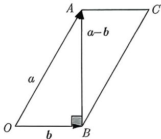
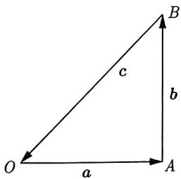
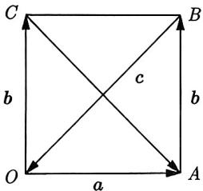
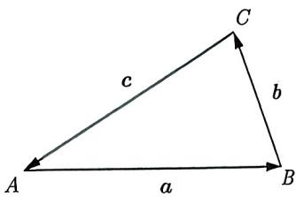
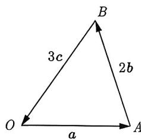
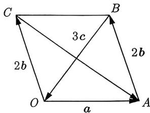

import Guide from '@/components/Guide.astro';
import Knowledge from '@/components/Knowledge.astro';
import Example from '@/components/Example.astro';
import Analysis from '@/components/Analysis.astro';
import Solution from '@/components/Solution.astro';
import Variant from '@/components/Variant.astro';
import Note from '@/components/Note.astro';
import Block from '@/components/Block.astro';

<Knowledge title="知识点 3.14">
若 a, b 是不共线的非零向量, 则以 a, b 为邻边可以构造一个平行四边形, $a + b$ 和 a - b 分别为这个平行四边形的对角线.
</Knowledge>

如果题中出现 $a + b$ 或 $a - b$ , 那么我们可以尝试构造以 $a, b$ 为邻边的平行四边形, 使其对角线为 $a + b$ 或 $a - b$ , 如下例所示.

<Example title="例 3.75">
(2019 全国 I 理 7) 已知非零向量 a, b 满足 $|a| = 2|b|$ ，且 $(a - b) \perp b$ ，则 a 与 b 的夹角为（）.
A. $\frac{\pi}{6}$ B. $\frac{\pi}{3}$ C. $\frac{2\pi}{3}$ D. $\frac{5\pi}{6}$

<Solution>
记 $a = \overrightarrow{OA}, b = \overrightarrow{OB}$ ，则 $a - b = \overrightarrow{BA}$ 。因为 $(a - b) \perp b$ ，所以 $AB \perp OB$ 。于是以 OB，OA 为邻边，构造出如图 3-72 所示的平行四边形。因为 $|a| = 2|b|$ ，所以在 Rt△OBA 中， $\cos \angle AOB = \frac{OB}{OA} = \frac{1}{2}$ ，得到 $\angle AOB = \frac{\pi}{3}$ ，故选 B.

</Solution>
</Example>

其实, 例3.75用代数法也是很简单的. 接下来的例题和变式实际上采用代数法会更简单一些, 但我们的目的是想训练同学们几何法和作图的能力. 因此, 在这些例题中, 我们只给出几何法的解析, 代数法留给同学们独立完成.

图3-72

这样能够帮助同学们在几何问题中更加灵活和熟练地运用几何方法, 同时也提升几何直觉和解题技巧.

<Example title="例 3.76">
(2014 浙江理 8) 记 $\max\{x,y\}=\left\{\begin{aligned}&x,x\geqslant y\\ &y,x<y\end{aligned}\right.$ ， $\min\{x,y\}=\left\{\begin{aligned}&y,x\geqslant y\\ &x,x<y\end{aligned}\right.$ ，设 a,b 为平面向量，则（）.

A. $\min\{|a+b|,|a-b|\}\leqslant\min\{|a|,|b|\}$ B. $\min\{|a+b|,|a-b|\}\geqslant\min\{|a|,|b|\}$ C. $\max\{|a+b|^{2},|a-b|^{2}\}\leqslant|a|^{2}+|b|^{2}$ D. $\max\{|a+b|^{2},|a-b|^{2}\}\geqslant|a|^{2}+|b|^{2}$

<Solution>
因为 $a + b$ 和 $a - b$ 表示以 $a, b$ 为邻边的平行四边形的两条对角线. 由平行四边形对角线原理可知 $|a + b|^2 + |a - b|^2 = 2(|a|^2 + |b|^2)$ , 即 $|a|^2 + |b|^2$ 是 $|a + b|^2$ 和 $|a - b|^2$ 的等差中项, 也就是说 $|a|^2 + |b|^2$ 一定落在 $|a - b|^2$ 和 $|a + b|^2$ 的中间, 即

$$
\min \left\{\left| a - b \right| ^ {2}, \left| a + b \right| ^ {2} \right\} \leqslant \left| a \right| ^ {2} + \left| b \right| ^ {2} \leqslant \max \left\{\left| a + b \right| ^ {2}, \left| a - b \right| ^ {2} \right\}.
$$

故选D.
</Solution>
</Example>

如果题目中既有 $a + b + c = 0$ ，又有 $a + b$ 或 $a - b$ ，那么我们可以先构造三角形，再构造以 $a, b$ 为邻边的平行四边形，使其对角线满足 $a + b$ 和 $a - b$ ，请看下面的例题：

<Example title="例 3.77">
(2006 浙江理 13) 设向量 a, b, c 满足 $a + b + c = 0$ , $(a - b) \perp c$ , $a \perp b$ , 若 $|a| = 1$ , 则 $|a|^{2} + |b|^{2} + |c|^{2}$ 的值是 \_\_\_\_.

<Solution>
由 $a + b + c = 0$ 和 $a \perp b$ ，构造如图 3-73 所示的 Rt△OAB，其中 $a = \overrightarrow{OA}, b = \overrightarrow{AB}, c = \overrightarrow{BO}$ ，过 O 作 $\overrightarrow{OC} = b$ ，得到平行四边形 OABC，如图 3-74 所示，其中 $\overrightarrow{CA} = a - b$ ，又因为 $(a - b) \perp c$ ，即 $CA \perp OB$ ，故四边形 OABC 是边长为 1 的正方形，所以 $|a|^{2} + |b|^{2} + |c|^{2} = 1 + 1 + 2 = 4$ 。故填 4.

<figure class="vp-figure">
  
  <figcaption>图3-73</figcaption>
</figure>

<figure class="vp-figure">
  
  <figcaption>图3-74</figcaption>
</figure>
</Solution>
</Example>

我们由 $a \pm b$ 会联想到平行四边形. 那么三角形又是什么情形呢? 如图3-75所示, 在 $\triangle ABC$ 中, 令 $a = \overrightarrow{AB}, b = \overrightarrow{BC}, c = \overrightarrow{CA}$ , 则 $a + b + c = 0$ . 反过来, 如果 $a + b + c = 0$ , 且 $a, b, c$ 是不共线的非零向量, 那么 $a, b, c$ 可以刻画一个三角形.

<Block title="经验总结 3.8">
设 a, b, c 是不共线的非零向量, 若 $a + b + c = 0$ , 令 $a = \overrightarrow{OA}$ , $b = \overrightarrow{AB}$ , $c = \overrightarrow{BO}$ , 则 $a + b + c = 0$ 可以构造一个 $\triangle OAB$ .
</Block>

<Example title="例 3.78">
设向量 a, b, c 满足 $a + 2b + 3c = 0$ 且 $(a - 2b) \perp c$ ，若 $|a| = 1$ ，则 $|b| =$ \_\_\_\_ .

<Solution>
由 $a + 2b + 3c = 0$ ，构造如图 3-76 所示的三角形，其中 $\overrightarrow{OA} = a, \overrightarrow{AB} = 2b, \overrightarrow{BO} = 3c$ 。过 O 作 $\overrightarrow{OC} = 2b$ ，得到平行四边形 OABC，如图 3-77 所示。因为 $a - 2b = \overrightarrow{CA}$ ，且 $(a - 2b) \perp c$ ，所以 $CA \perp OB$ ，故四边形 OABC 是菱形，于是 $2|b| = |a| = 1$ ，得 $|b| = \frac{1}{2}$ ，故填 $\frac{1}{2}$ 。

<figure class="vp-figure">
  
  <figcaption>图3-76</figcaption>
</figure>

<figure class="vp-figure">
  
  <figcaption>图3-77</figcaption>
</figure>
</Solution>
</Example>

<Variant title="变式 3.78.1">
若非零向量 a, b 满足 $|a + b| = |b|$ ，则（）.
A. $|2a| > |2a + b|$ B. $|2a| < |2a + b|$ C. $|2b| > |a + 2b|$ D. $|2b| < |a + 2b|$
</Variant>
