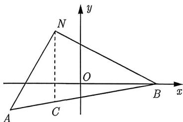

import Guide from '@/components/Guide.astro';
import Knowledge from '@/components/Knowledge.astro';
import Example from '@/components/Example.astro';
import Analysis from '@/components/Analysis.astro';
import Solution from '@/components/Solution.astro';
import Variant from '@/components/Variant.astro';
import Note from '@/components/Note.astro';
import Block from '@/components/Block.astro';
import Method from '@/components/Method.astro';

<Knowledge title="知识点 4.1">
直线 $\ell$ 的倾斜角为 $\alpha$ , 任取直线 $\ell$ 上两点 $P_{1}(x_{1},y_{1}), P_{2}(x_{2},y_{2})(x_{1} \neq x_{2})$ , 则 (1) 斜率: $k = \tan \alpha, \alpha \in \left[0, \frac{\pi}{2}\right) \cup \left(\frac{\pi}{2}, \pi\right)$ ; (2) 斜率公式: $k = \frac{y_{2} - y_{1}}{x_{2} - x_{1}}$ .
</Knowledge>

直线的倾斜角 $\alpha$ 的取值范围为 $\alpha \in [0, \pi)$ .

<Example title="例 4.1">
已知 $A(-1,-2)$ , $B(2,1)$ , $C(x,2)$ 三点共线, 则 x= \_\_\_\_, 直线 AB 的倾斜角为 \_\_\_\_.
<Solution>
因为 $A(-1, -2), B(2, 1), C(x, 2)$ 三点共线，所以 $k_{AB} = k_{BC}$ ，即 $\frac{1 + 2}{2 + 1} = \frac{2 - 1}{x - 2}$ ，解得 $x = 3$ ，设直线 $AB$ 的倾斜角为 $\alpha$ ，则 $\tan \alpha = 1$ ，因此 $\alpha = \frac{\pi}{4}$ ，故填 $3; \frac{\pi}{4}$ .
</Solution>
</Example>

再看斜率公式 $k = \frac{y_2 - y_1}{x_2 - x_1}$ , 这是关于 $x, y$ 的一次分式, 根据这个特征, 如果题目中遇到关于 $x, y$ 的一次分式, 我们就可以尝试构造斜率.

<Example title="例 4.2">
已知点 $A(-1-\sqrt{3},-1)$ , $B(3,0)$ ，若点 $M(x,y)$ 在线段 AB 上，则 $\frac{y-2}{x+1}$ 的取值范围是 \_\_\_\_.
<Solution>
如图4-1所示, 设 $N$ 为 $(-1,2)$ , $C$ 为 $AB$ 上一点且 $CN \parallel y$ 轴. 由 $\frac{y - 2}{x + 1} = \frac{y - 2}{x - (-1)}$ , 得 $\frac{y - 2}{x + 1}$ 为点 $M(x,y)$ 与点 $N(-1,2)$ 连线的斜率 $k_{MN}$ , 由于 $k_{NA} = \frac{-1 - 2}{-1 - \sqrt{3} + 1} = \sqrt{3}, k_{NB} = \frac{2 - 0}{-1 - 3} = -\frac{1}{2}$ , 则当 $M$ 从 $A$ 无限趋近于 $C$ 时, $k_{MN} \in [\sqrt{3}, +\infty)$ , 当 $M$ 从 $C$ 运动到 $B$ 时, $k_{MN} \in \left(-\infty, -\frac{1}{2}\right]$ , 故填 $\left(-\infty, -\frac{1}{2}\right] \cup [\sqrt{3}, +\infty)$ .
</Solution>
</Example>

<figure class="vp-figure">
  
  <figcaption>图4-1</figcaption>
</figure>

一次分式型转直线斜率, 是一个很重要的技巧, 现总结如下:

<Method title="方法总结 4.1">
分式型 $\frac{y - n}{x - m}$ 可以转化为(m,n)与(x,y)连线的斜率.
</Method>

<Variant title="变式 4.2.1">
(2023 湖北期末) 已知幂函数 $f(x)$ 的图像经过点 $\left(\frac{1}{8}, \frac{\sqrt{2}}{4}\right)$ . $P(x_{1}, y_{1})$ , $Q(x_{2}, y_{2})(x_{1} < x_{2})$ 是函数图像上的任意不同两点, 则以下结论正确的有 ( ).

A. $x_{1}f(x_{1}) > x_{2}f(x_{2})$ B. $x_{1}f(x_{1}) <   x_{2}f(x_{2})$ C. $\frac{f(x_1)}{x_1} >\frac{f(x_2)}{x_2}$ D. $\frac{f(x_1)}{x_1} <  \frac{f(x_2)}{x_2}$
</Variant>
