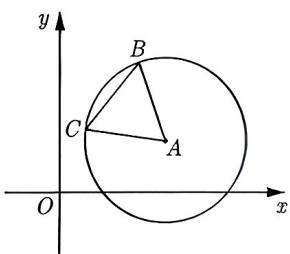

import Guide from '@/components/Guide.astro';
import Knowledge from '@/components/Knowledge.astro';
import Example from '@/components/Example.astro';
import Analysis from '@/components/Analysis.astro';
import Solution from '@/components/Solution.astro';
import Variant from '@/components/Variant.astro';
import Note from '@/components/Note.astro';
import Block from '@/components/Block.astro';

在 4.2.1 节和 4.2.2 节, 我们侧重从代数的角度研究圆的方程. 本节我们主要从几何的角度研究圆的表示形式, 以及如何从几何形式转化为代数形式.

1. 定点且定长

<Knowledge title="知识点 4.10">
若 $\left|MA\right|=r$ ，其中 M 是动点，A 是定点，r 是大于 0 的定值，则点 M 的轨迹为圆，圆心是 A，半径为 r.
</Knowledge>

<Example title="例 4.21">
已知等腰三角形的一个顶点 A(4,2)，底边的一个端点 B(3,5)，求底边另一个端点 C 的轨迹方程，并说明它是什么图形.

<Solution>
根据题意可知 $|AB| = |AC|$ ，因为 $A(4,2), B(3,5)$ ，所以 $|AB| = \sqrt{10}$ ，则 $|AC| = \sqrt{10}$ ，如图4-3所示。根据圆的定义可知顶点 $C$ 在以 $A$ 为圆心，以 $\sqrt{10}$ 为半径的圆上，又点 $A, B, C$ 构成三角形，则 $B, A, C$ 不能共线。设 $B$ 关于 $A$ 的对称点为 $B'(x', y')$ ，所以顶点 $C$ 的轨迹要挖去 $B, B'$ 。 $\frac{x' + 3}{2} = 4, \frac{y' + 5}{2} = 2$ ，解得 $x' = 5, y' = -1$ ，故 $B'(5, -1)$ 。设点 $C$ 的坐标为 $(x, y)$ ，则 $C$ 点的轨迹方程为 $(x - 4)^2 + (y - 2)^2 = 10$ ，并且去除 $(3, 5), (5, -1)$ 两点。

<figure class="vp-figure">
  
  <figcaption>图4-3</figcaption>
</figure>
</Solution>

</Example>

例 4.21 中因为 $\triangle ABC$ 为等腰三角形, 所以很容易得到 $|AC|$ 为定值, 但更多的题目中动点到定点的距离为定值给的比较隐晦, 需要我们进行转化才能找到.

<Example title="例 4.22">
长为 2a 的线段 AB 的两个端点 A 和 B 分别在 x 轴和 y 轴上滑动, 求线段 AB 的中点的轨迹方程.

<Solution>
设线段 AB 的中点为 M, 因为 M 是 Rt△AOB 斜边 AB 的中点, 所以 $|OM| = \frac{1}{2}|AB| = a$ , 可知 M 的轨迹是以 $(0,0)$ 为圆心, a 为半径的圆, 圆的方程为 $x^{2} + y^{2} = a^{2}$ .
</Solution>

</Example>

<Variant title="变式 4.22.1">
线段 MN 的长度为 1, 端点 M, N 在边长不小于 1 的正方形 ABCD 的四边上滑动, 当点 M, N 沿正方形的四边滑动一周时, MN 的中点 O 所形成的轨迹为 G, 若 G 的周长为 $\ell$ , 其围成的面积为 S, 则 $\ell - S$ 的最大值为 \_\_\_\_.
</Variant>
