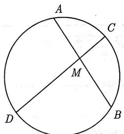
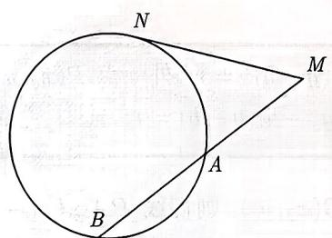
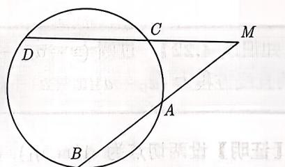
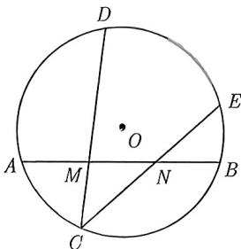
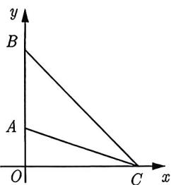
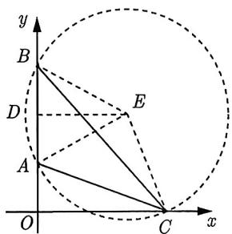
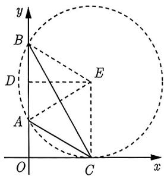

import Guide from '@/components/Guide.astro';
import Knowledge from '@/components/Knowledge.astro';
import Example from '@/components/Example.astro';
import Analysis from '@/components/Analysis.astro';
import Solution from '@/components/Solution.astro';
import Variant from '@/components/Variant.astro';
import Note from '@/components/Note.astro';
import Block from '@/components/Block.astro';
import Summary from '@/components/Summary.astro';
import Method from '@/components/Method.astro';

接下来介绍圆的另外一个性质——圆幂定理, 这个性质不少读者并不熟悉. 这类题在解析几何中考查的难度不会小 (尤其是在圆锥曲线中考查圆幂定理, 例如四点共圆情形). 圆幂定理又分为三个定理, 分别是相交弦定理、切割线定理和割线定理, 总结如下:

（1）相交弦定理：如图 4-14 所示，过圆内一点 M 作两条弦，分别交圆于点 A, B, C, D，则 $\left|MA\right| \cdot \left|MB\right| = \left|MC\right| \cdot \left|MD\right|$ .

(2) 切割线定理: 如图 4-15 所示, 从圆外一点 $M$ 作圆的一条割线, 交圆于 $A, B$ , 再作 $MN$ 切圆于点 $N$ , 则 $|MN|^2 = |MA| \cdot |MB|$ .

(3) 割线定理: 如图 4-16 所示, 从圆外一点 $M$ 作圆的两条割线, 分别交圆于点 $A, B, C, D$ , 则 $|MA| \cdot |MB| = |MC| \cdot |MD|$ .

<figure class="vp-figure">
  
  <figcaption>图4-14</figcaption>
</figure>

<figure class="vp-figure">
  
  <figcaption>图4-15</figcaption>
</figure>

<figure class="vp-figure">
  
  <figcaption>图4-16</figcaption>
</figure>

<Example title="例 4.46">
(2015 天津理 5) 如图 4-17 所示, 在圆 O 中, M, N 是弦 AB 的三等分点, 弦 CD, CE 分别经过点 M, N, 若 CM = 2, MD = 4, CN = 3, 则线段 NE 的长为 ( ).

A. $\frac{8}{3}$ B. 3 C. $\frac{10}{3}$ D. $\frac{5}{2}$

<Solution>
由相交弦定理可得 $MC \cdot MD = MA \cdot MB, NC \cdot NE = NA \cdot NB,$ 又因为 M, N 是弦 AB 的三等分点，所以 $NA \cdot NB = MA \cdot MB = MC \cdot MD,$ 从而 $NC \cdot NE = MC \cdot MD,$ 即 $NE = \frac{MC \cdot MD}{NC} = \frac{8}{3}.$ 故选 A.
</Solution>

图4-17
</Example>

<Variant title="变式 4.46.1">
过点 $P(-4,4)$ 作直线 $\ell$ 与圆 $C:(x-1)^{2}+y^{2}=25$ 交于 A, B 两点, 若 $|PA|=2$ , 则圆心 C 到直线 $\ell$ 的距离为 ( ) .
A. 5 B. 4 C. 3 D. 2
</Variant>

圆幂定理的应用是非常广泛的, 下面再来看看它在仰角模型中的应用.

<Example title="例 4.47">
如图 4-18 所示, 在平面直角坐标系中, 在 y 轴的正半轴 (坐标原点除外) 上给定两点 A, B, 试在 x 轴的正半轴 (坐标原点除外) 上找一点 C, 使得 $\angle ACB$ 取得最大值.

<Solution>
如图4-19所示, 设点 $A(0, a), B(0, b), C(x, 0)$ , 过 $A, B, C$ 三点确定圆 $E$ . 作弦 $AB$ 所对的圆心角 $\angle AEB = 2\angle ACB$ . 取 $AB$ 中点 $D$ , 连接 $DE$ , 则 $\angle AEB = 2\angle AED$ , 于是 $\angle AED = \angle ACB$ . 又因为 $\sin \angle AED = \frac{|AD|}{|AE|} = \frac{|AD|}{|EC|}$ , 所以 $|EC|$ 越小, $\angle AED$ 越大, 而当 $EC \perp x$ 轴时, $|EC|$ 最小, 此时 $\angle ACB$ 最大, 圆与 $x$ 轴相切, $C$ 为切点, 如图4-20所示. 由切割线定理有 $|OC|^2 = |OA| \cdot |OB|$ , 即 $x^2 = ab$ , 解得 $x = \sqrt{ab}$ . 故切点 $C$ 的坐标为 $(\sqrt{ab}, 0)$ .
</Solution>

<figure class="vp-figure">
  
  <figcaption>图4-18</figcaption>
</figure>

<figure class="vp-figure">
  
  <figcaption>图4-19</figcaption>
</figure>

<figure class="vp-figure">
  
  <figcaption>图4-20</figcaption>
</figure>
</Example>

<Method title="方法总结 4.3">
给定平面上两定点 A, B, 求直线 $\ell$ 上的一点 C, 使得 $\angle ACB$ 取得最大值. 这类模型可以转化为 “以 AB 为定弦的圆与直线 $\ell$ 有交点, 求点 C 与弦 AB 的张角的最大值, 即圆与直线 $\ell$ 相切时 $\angle ACB$ 取得最大值”.
</Method>
