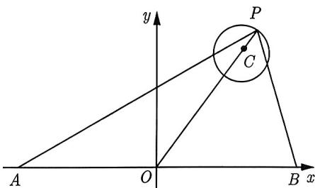
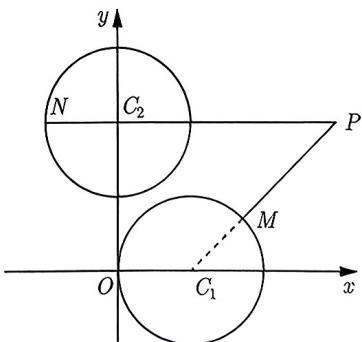
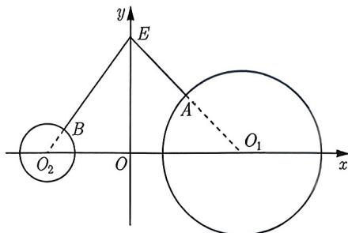
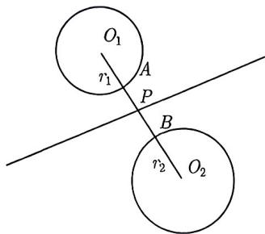
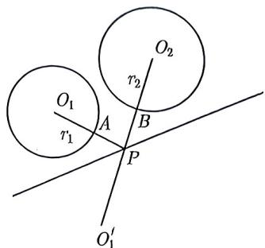
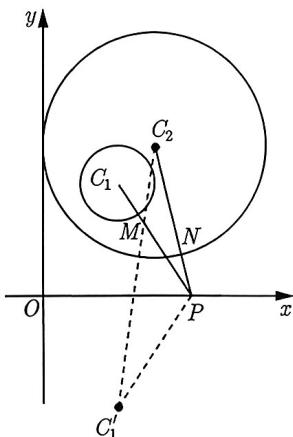
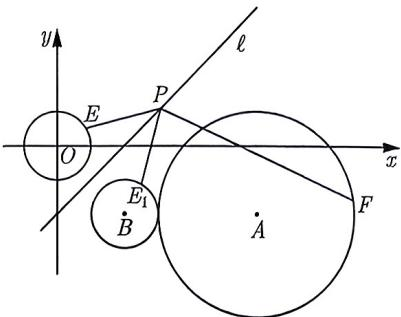
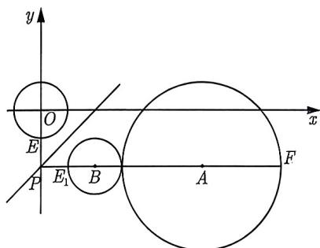

import Guide from '@/components/Guide.astro';
import Knowledge from '@/components/Knowledge.astro';
import Example from '@/components/Example.astro';
import Analysis from '@/components/Analysis.astro';
import Solution from '@/components/Solution.astro';
import Variant from '@/components/Variant.astro';
import Note from '@/components/Note.astro';
import Block from '@/components/Block.astro';

定点到圆上动点的距离的最值是初中的核心考点, 即无论点在圆外、圆上还是圆内, 它到圆上的动点的距离最大值为定点到圆心的距离加半径, 最小值为定点到圆心的距离减半径, 如果是负的再添加绝对值.

<Knowledge title="知识点 4.23">
设 P 是平面上一定点, Q 是圆 C 上的动点, r 是圆的半径, 则 $\left|PQ\right|_{\max}=\left|PC\right|+r,\quad\left|PQ\right|_{\min}=\left|\left|PC\right|-r\right|$
</Knowledge>

<Example title="例 4.48">
已知点 $P(3,2)$ ，点 M 是圆 $C_{1}:(x-1)^{2}+y^{2}=1$ 上的动点，则 $|PM|$ 的最大值和最小值分别为 \_\_\_\_；\_\_\_\_。

<Solution>
圆 $C_1$ 的圆心 $C_1(1,0)$ , 半径 $r = 1$ , 又因为 $P(3,2)$ , 所以 $|PC_1| = \sqrt{(3 - 1)^2 + 2^2} = 2\sqrt{2}$ , 则由知识点4.23得 $|PM|_{\max} = |PC_1| + r = 2\sqrt{2} + 1$ , $|PM|_{\min} = 2\sqrt{2} - 1$ , 故填 $2\sqrt{2} + 1; 2\sqrt{2} - 1$ .
</Solution>
</Example>

<Example title="例 4.49">
(2014 北京文 7) 已知圆 $C: (x - 3)^{2} + (y - 4)^{2} = 1$ 和两点 $A(-m, 0)$ , $B(m, 0) (m > 0)$ . 若圆 C 上存在点 P, 使得 $\angle APB = 90^{\circ}$ , 则 m 的最大值为 ( ). A. 7 B. 6 C. 5 D. 4

<Solution>
如图4-21所示，因为 $\angle APB = 90^{\circ}$ ，且 $O$ 为 Rt $\triangle ABP$ 斜边 $AB$ 的中点，所以 $|OP| = \frac{1}{2} |AB| = m$ ，故只需求 $|OP|$ 的最大值即可。因为 $|OP|_{\max} = |OC| + |CP| = 6$ ，所以 $m$ 的最大值为6。故选B。

</Solution>
</Example>

<Variant title="变式 4.49.1">
（2023 山东模拟）已知实数 a, b 满足 $a^{2} + b^{2} - 4a + 3 = 0$ ，则 $a^{2} + (b + 2)^{2}$ 的最大值为 \_\_\_\_.
</Variant>

图4-21

<Variant title="变式 4.49.2">
(2023 北京模拟) 在平面直角坐标系 xOy 中, 已知 P 是圆 $C: (x-3)^{2} + (y-4)^{2} = 1$ 上的动点. 若 $A(-a,0)$ , $B(a,0)$ , $a \neq 0$ , 则 $|\overrightarrow{PA} + \overrightarrow{PB}|$ 的最大值为 ( ). A. 16 B. 12 C. 8 D. 6
</Variant>

以上例题及其变式都是圆上一动点与一定点距离的最值问题, 下面我们做一点点拓展, 探讨一定点到几个不同圆上的距离和或差的问题. 这类问题很简单, 我们先给出如下知识点:

<Knowledge title="知识点 4.24">
设 P 是平面上一定点, A 和 B 分别是圆 $O_{1}$ 和圆 $O_{2}$ 上的动点, 则 $(|PA|+|PB|)_{\min}=|PA|_{\min}+|PB|_{\min}.$
</Knowledge>

一般来说, 求多个代数式之和的最小值不能简单地转化为求每一项的最小值, 我们需要进行整体处理. 然而, 在这里之所以可以这样做, 是因为 $A$ 和 $B$ 是相互独立的, 所以 $|PA|$ 和 $|PB|$ 是两个不相关的变量. 类似的问题在函数成立问题中也经常遇到.

同样地, 我们可以求解其他几种情形下的最值问题. 原理都是一样的, 只要抓住 $|PA|$ 和 $|PB|$ 是两个不相关的变量, 求它们的和或差的最值可以转化为求每一项的最值. 接下来, 我们将陈述这些结论, 不必刻意去记忆, 只要掌握原理即可.

$$
\begin{array}{l} (| P A | + | P B |) _ {\max} = | P A | _ {\max} + | P B | _ {\max}, \\ (| P A | - | P B |) _ {\max} = | P A | _ {\max} - | P B | _ {\min}, \\ (| P A | - | P B |) _ {\min} = | P A | _ {\min} - | P B | _ {\max}. \end{array}
$$

<Example title="例 4.50">
(2023 山东模拟) 已知点 $P(3,2)$ ，点 M 是圆 $C_{1}:(x-1)^{2}+y^{2}=1$ 上的动点，点 N 是 $C_{2}:x^{2}+(y-2)^{2}=1$ 上的动点，则 $|PN|-|PM|$ 的最大值是（）.

A. $5-2\sqrt{2}$ B. $5+2\sqrt{2}$ C. $2\sqrt{2}-2$ D. $3-2\sqrt{2}$

<Solution>
如图4-22所示, 因为动点 $M$ 和动点 $N$ 不相关, 因此 $|PN| - |PM|$ 最大值等价于 $|PN|$ 取最大且 $|PM|$ 取最小. 因为 $|PN|$ 最大值为 $|PC_2| + 1$ , $|PM|$ 的最小值为 $|PC_1| - 1$ , 所以 $|PN| - |PM|$ 最大值是 $(|PC_2| + 1) - (|PC_1| - 1) = |PC_2| - |PC_1| + 2 = 5 - 2\sqrt{2}$ , 故选A.
</Solution>
</Example>

<Example title="例 4.51">
已知 a, b, $e_{1}$ , $e_{2}$ 是平面向量, $e_{1}$ , $e_{2}$ 是单位向量且 $e_{1} \cdot e_{2} = 0$ . 若 $a^{2} - 4a \cdot e_{1} + 2e_{1}^{2} = 0$ , $b^{2} + 3b \cdot e_{1} + 2e_{1}^{2} = 0$ , 则 $|a - 2e_{2}| + |b - 2e_{2}|$ 的最小值为 \_\_\_\_.

<figure class="vp-figure">
  
  <figcaption>图4-22</figcaption>
</figure>

<table><tr><td>(|PA|+|PB|)min=|PO1|-r1+|PO2|-r2=|O1O2|-r1-r2.</td></tr><tr><td>(2)若圆O1和圆O2在直线l的同侧,如图4-25所示,作O1关于直线l的对称点,记为O1&#x27;,则线段O1&#x27;O2与直线l的交点为P,且</td></tr><tr><td>(|PA|+|PB|)min=|PO1|-r1+|PO2|-r2=|PO1&#x27;-r1+|PO2|-r2=|O1&#x27;O2|-r1-r2.</td></tr></table>

上式表示为点 $E(0,2)$ 到点 $A(x_{1},y_{1})$ 与 $B(x_{2},y_{2})$ 的距离之和，即求 $|EA| + |EB|$ 的最小值。又因为点 $A$ 和点 $B$ 相互独立，所以 $(|EA| + |EB|)_{\min} = |EA|_{\min} + |EB|_{\min}$ ，于是  
则 $|a - 2e_2| + |b - 2e_2|$ 的最小值为 $\sqrt{2} + 2$ , 故填 $2 + \sqrt{2}$ .  
我们回顾下知识点4.24, 其中 $P$ 是定点. 若 $P$ 是某条直线 $\ell$ 上一动点, 则求 $|PA| + |PB|$ 的最小值可以转化为将军饮马模型.  
下面, 我们回忆一下经典的将军饮马模型: 定点 $A$ , $B$ 分布在定直线 $\ell$ 同侧, 在 $\ell$ 上找一点 $P$ , 使得 $|PA| + |PB|$ 最小. 众所周知的做法是作点 $A$ 关于 $\ell$ 的对称点 $A'$ , 连接 $A'B$ , 它与 $\ell$ 的交点就是所求点 $P$ , 且 $(|PA| + |PB|)_{\min} = |A'B|$ .  
对于将军饮马问题, 我们需要对条件 “定点 A, B 分布在定直线 $\ell$ 同侧” 引起重视, 因为若定点 A, B 分布在定直线 $\ell$ 两侧, 就不需要作对称点了, 只要连接 AB 就可以了.  
根据上述的讨论, 我们可以得到如下知识点:

<Analysis>
已知题中的 $a^2 - 4a \cdot e_1 + 2e_1^2 = 0$ 和 $b^2 + 3b \cdot e_1 + 2e_1^2 = 0$ 是两个数量积圆, 而题中求的是两个模长和的最小值. 我们可以通过建系求出两个圆的方程, 将所求的模长转化为一定点到两圆上的动点的距离和问题.
</Analysis>

<Solution>
先把向量 $e_1$ 的坐标固定在坐标轴上，令 $\overrightarrow{OM} = e_1 = (1,0)$ ，由 $e_2$ 是单位向量且 $e_1 \cdot e_2 = 0$ ，可令 $\overrightarrow{ON} = e_2 = (0,1)$ . 向量 $a$ 的坐标不能确定，故设 $\overrightarrow{OA} = a = (x_1, y_1)$ ，由 $a^2 - 4a \cdot e_1 + 2e_1^2 = 0$ 可得 $x_1^2 + y_1^2 - 4x_1 + 2 = 0$ ，整理可得 $(x_1 - 2)^2 + y_1^2 = 2$ ，即点 $A$ 在以 $O_1(2,0)$ 为圆心， $\sqrt{2}$ 为半径的圆上.

如图 4-23 所示, 设 $\overrightarrow{OB} = \boldsymbol{b} = (x_{2}, y_{2})$ , 由 $b^{2} + 3be_{1} + 2e_{1}^{2} = 0$ 可得 $\left(x_{2} + \frac{3}{2}\right)^{2} + y_{2}^{2} = \frac{1}{4}$ , 即点 B 在以 $O_{2}\left(-\frac{3}{2}, 0\right)$ 为圆心, $\frac{1}{2}$ 为半径的圆上. 于是

图4-23

$$
\left| \boldsymbol {a} - 2 \boldsymbol {e} _ {2} \right| + \left| \boldsymbol {b} - 2 \boldsymbol {e} _ {2} \right| = \left| \overrightarrow {O A} - 2 \overrightarrow {O N} \right| + \left| \overrightarrow {O B} - 2 \overrightarrow {O N} \right| = \sqrt {x _ {1} ^ {2} + (y _ {1} - 2) ^ {2}} + \sqrt {x _ {2} ^ {2} + (y _ {2} - 2) ^ {2}}.
$$

$$
\left(| E A | + | E B |\right) _ {\min} = \left(| E O _ {1} | - r _ {1}\right) + \left(| E O _ {2} | - r _ {2}\right) = | E O _ {1} | + | E O _ {2} | - \sqrt {2} - \frac {1}{2} = \sqrt {2} + 2,
$$

<figure class="vp-figure">
  
  <figcaption>图4-24</figcaption>
</figure>

<figure class="vp-figure">
  
  <figcaption>图4-25</figcaption>
</figure>
</Solution>
</Example>

<Example title="例 4.52">
(2013 重庆理 7) 已知圆 $C_{1}:(x-2)^{2}+(y-3)^{2}=1$ ，圆 $C_{2}:(x-3)^{2}+(y-4)^{2}=9$ ，M, N 分别是圆 $C_{1}, C_{2}$ 上的动点，P 为 x 轴上的动点，则 $|PM|+|PN|$ 的最小值为（）.

A. $5\sqrt{2}-4$ B. $\sqrt{17}-1$ C. $6-2\sqrt{2}$ D. $\sqrt{17}$

<Solution>
在 $x$ 轴上任取一点 $P$ , 由于 $M, N$ 分别是圆 $C_1, C_2$ 上的动点, 所以 $|PM|$ 的最小值为 $|PC_1|-1, |PN|$ 的最小值为 $|PC_2|-3$ , 即 $|PM| + |PN|$ 的最小值为 $|PC_1| + |PC_2|-4$ , 如图 4-26 所示, 作 $C_1(2,3)$ 关于 $x$ 轴的对称点 $C_1'(2,-3)$ , 则

$$
\left| P C _ {1} \right| + \left| P C _ {2} \right| - 4 = \left| P C _ {1} ^ {\prime} \right| + \left| P C _ {2} \right| - 4 \geqslant \left| C _ {1} ^ {\prime} C _ {2} \right| - 4 = 5 \sqrt {2} - 4.
$$

故选 A.
</Solution>
</Example>

<Variant title="变式 4.52.1">
（2023 河南模拟）已知点 P 为直线 $y = x + 1$ 上的一点，M, N 分别为圆 $C_{1}:(x - 4)^{2} + (y - 1)^{2} = 1$ 与圆 $C_{2}:(x - 3)^{2} + (y - 1)^{2} = 1$ 上的点，则 $|PM| + |PN|$ 的最小值为（）.

A. 5 B. 3 C. 2  D. 1
</Variant>

<Variant title="变式 4.52.2">
(2023 浙江模拟) 已知圆 $C: x^{2} + y^{2} - 4y + 3 = 0$ ，点 $M(7,12)$ ，直线 $\ell: y = x$ 。点 P 是圆 C 上的动点，点 Q 是 $\ell$ 上的动点，则 $|PQ| + |QM|$ 的最小值为（）.A. 11
B. 12
C. 13
D. 14
</Variant>

<Example title="例 4.53">
(2023 泉州模考) 已知点 P 在直线 y = x - 2 上运动, 点 E 是圆 $x^{2} + y^{2} = 1$ 上的动点, 点 F 是圆 $(x - 6)^{2} + (y + 2)^{2} = 9$ 上的动点, 则 $|PF| - |PE|$ 的最大值为 ( ). A. 6 B. 7 C. 8 D. 9

<Analysis>
由三角不等式可得 $|PF| - |PE| \leqslant |EF|$ ，当且仅当 $E, F, P$ 三点共线且 $E$ 在 $F, P$ 之间时等号成立。但是，由图4-27可知，直线 $\ell$ 在两圆之间，即 $E$ 不可能落在 $F, P$ 之间，因此我们不能直接利用三角不等式。为此我们需要作 $x^{2} + y^{2} = 1$ 关于直线 $y = x - 2$ 的对称圆，把 $|PE|$ 转化到与 $|PF|$ 同侧，然后再利用三角不等式。

</Analysis>

<Solution>
圆 $(x - 6)^2 +(y + 2)^2 = 9$ 的圆心为 $A(6, - 2)$ ，半径为3，圆 $x^{2} + y^{2} = 1$ 关于直线 $y = x - 2$ 的对称圆为圆 $B$ ，设圆心 $B$ 的坐标为 $(m,n)$ ，则 $\left\{ \begin{array}{l} \frac{n}{m} = -1 \\ \frac{n}{2} = \frac{m}{2} - 2 \end{array} \right.$ ，解得 $\left\{ \begin{array}{l} m = 2 \\ n = -2 \end{array} \right.$ 故圆 $B$ 的圆心为 $(2, - 2)$ ，半径为1．如图4-27所示，由于此时圆心 $A$ 与圆心 $B$ 的距离为4，等于两圆的半径之和，所以两圆外切，此时 $E$ 的对称点为 $E_{1}$ ，且 $|PE| = |PE_{1}|$ ，所以

图4-27  
<figure class="vp-figure">
  
  <figcaption>图4-28</figcaption>
</figure>

$$
\left| P F \right| - \left| P E \right| = \left| P F \right| - \left| P E _ {1} \right|,
$$

当 $P, B, A, E_{1}, F$ 五点共线时，且 $E_{1}$ 在圆 $B$ 的左侧，点 $F$ 在圆

A 的右侧时, $|PF|-|PE|$ 最大, 如图 4-28 所示, 最大值为 $|E_{1}F|=|E_{1}B|+|BA|+|AF|=1+4+3=8$ , 故选 C.
</Solution>
</Example>
