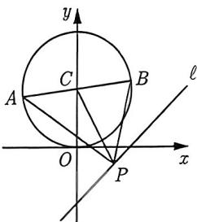

import Guide from '@/components/Guide.astro';
import Knowledge from '@/components/Knowledge.astro';
import Example from '@/components/Example.astro';
import Analysis from '@/components/Analysis.astro';
import Solution from '@/components/Solution.astro';
import Variant from '@/components/Variant.astro';
import Note from '@/components/Note.astro';
import Block from '@/components/Block.astro';

在上一小节, 我们学习了求定点与圆上动点的距离的最值. 同样地, 我们也可以类似地求解圆上动点到定直线的距离的最值. 核心思想是一样的, 即将问题转化为求圆心到直线的距离.

<Knowledge title="知识点 4.26">
已知直线 $\ell$ 和圆 $C$ , 若圆心到直线 $\ell$ 的距离为 $d$ , 圆 $C$ 的半径为 $r$ , 则: (1) 当 $\ell$ 与圆 $C$ 相离时, 圆上的点到 $\ell$ 的距离的最大值为 $d + r$ , 最小值为 $d - r$ . (2) 当 $\ell$ 与圆 $C$ 相切或相交时, 圆上的点到 $\ell$ 的距离的最大值为 $d + r$ , 最小值为 0.
</Knowledge>

<Example title="例 4.54">
(2018 全国Ⅲ理 6) 直线 $x + y + 2 = 0$ 分别与 x 轴、y 轴交于 A, B 两点，点 P 在圆 $(x - 2)^{2} + y^{2} = 2$ 上，则 $\triangle ABP$ 面积的取值范围是（）.
A. [2,6] B. [4,8] C. $[\sqrt{2},3\sqrt{2}]$ D. $[2\sqrt{2},3\sqrt{2}]$

<Solution title="解析">
由题意可知, $A(-2,0), B(0,-2), |AB| = 2\sqrt{2}$ . 要求 $\triangle ABP$ 面积的取值范围, 则只需求出点 $P$ 到直线 $x + y + 2 = 0$ 上的距离 $d_{1}$ 的取值范围. 因为圆心到直线的距离 $d_{2} = 2\sqrt{2} > r = \sqrt{2}$ , 所以直线与圆相离, 于是 $d_{1} \in [d_{2} - r, d_{2} + r] = [\sqrt{2}, 3\sqrt{2}]$ , 即 $S_{\triangle ABP} \in [2,6]$ , 故选 A.
</Solution>
</Example>

<Variant title="变式 4.54.1">
(2023 安徽期末) 已知动直线 $\ell: kx - y - 2k + 2 = 0$ 恒过定点 $A, B$ 为圆 $C: (x - 1)^2 + (y - 3)^2 = 8$ 上一动点, $O$ 为坐标原点, 则 $\triangle AOB$ 面积的最大值为
</Variant>

<Knowledge title="知识点 4.27">
若 PC 是 $\triangle PAB$ 的边 AB 的中线, 则 $|PA|^{2} + |PB|^{2} = 2(|PC|^{2} + |CA|)^{2}$ .
</Knowledge>

<Example title="例 4.55">
如图 4-29 所示, 已知 AB 为圆 $C: x^{2} + y^{2} - 2y = 0$ 的直径, 点 P 为直线 $\ell: y = x - 1$ 上任意一点, 则 $|PA|^{2} + |PB|^{2}$ 的最小值为 \_\_\_\_.

<Solution title="解析">
圆的标准方程为 $x^{2} + (y - 1)^{2} = 1$ ，由知识点4.27可得 $|PA|^2 + |PB|^2 = 2(|PC|^2 + |AC|^2) = 2|PC|^2 + 2.$ 因此原问题等价于求 $|PC|$ 的最小值.因为圆心到直线 $\ell$ 的距离 $d = \frac{|0 - 1 - 1|}{\sqrt{2}} = \sqrt{2}$ ，所以 $|PC|_{\min} = \sqrt{2}$ 即 $|PA|^2 + |PB|^2$ 的最小值为 $2 \times (\sqrt{2})^2 + 2 = 6$ ，故填6.
</Solution>
</Example>

<figure class="vp-figure">
  
  <figcaption>图4-29</figcaption>
</figure>
