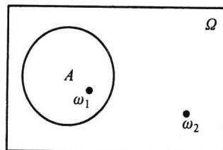
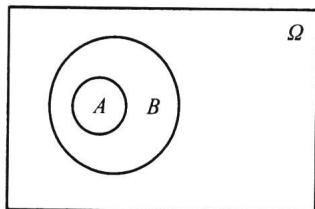
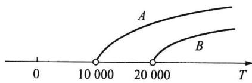
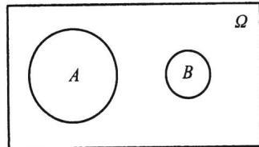
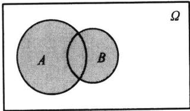
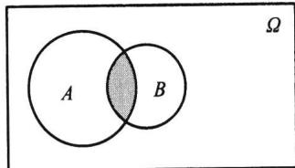
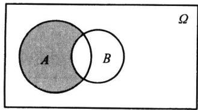
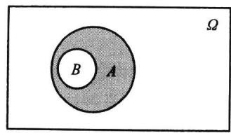
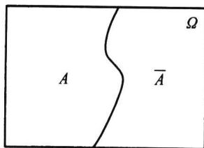

import Guide from '@/components/Guide.astro';
import Knowledge from '@/components/Knowledge.astro';
import Example from '@/components/Example.astro';
import Analysis from '@/components/Analysis.astro';
import Solution from '@/components/Solution.astro';
import Variant from '@/components/Variant.astro';
import Note from '@/components/Note.astro';
import Block from '@/components/Block.astro';
import Method from '@/components/Method.astro';
import Exercise from '@/components/Exercise.astro';

## 第1章 随机事件与概率

概率论与数理统计研究的对象是随机现象. 概率论研究随机现象的模型(即概率分布)及其性质, 详见前四章, 数理统计研究随机现象的数据收集、处理及统计推断, 详见后四章. 下面从随机现象开始逐步叙述这些内容.

## 1.1.1 随机现象

在一定的条件下,并不总是出现相同结果的现象称为随机现象,如抛一枚硬币与掷一颗骰子.随机现象有两个特点:
(1) 结果不止一个;
(2) 哪一个结果出现,人们事先并不知道.
只有一个结果的现象称为确定性现象.例如,太阳从东方升起,水往低处流,异性电荷相吸,一个口袋中有十只完全相同的白球,从中任取一只必然为白球.

<Example title="例 1.1.1">
随机现象的例子.
(1) 抛一枚硬币, 有可能正面朝上, 也有可能反面朝上.
(2) 掷一颗骰子, 出现的点数.
(3) 一天内进入某商场的顾客数.
(4) 某种型号电视机的寿命.
(5) 测量某物理量(长度、直径等)的误差.
随机现象到处可见.
对在相同条件下可以重复的随机现象的观察、记录、实验称为随机试验。也有很多随机现象是不能重复的，例如某场足球赛的输赢是不能重复的，某些经济现象（如失业、经济增长速度等）也不能重复。概率论与数理统计主要研究能大量重复的随机现象，但也十分注意研究不能重复的随机现象。
</Example>

## 1.1.2 样本空间

随机现象的一切可能基本结果组成的集合称为样本空间, 记为 $\Omega = \{\omega\}$ , 其中 $\omega$ 表示基本结果, 又称为样本点. 样本点是今后抽样的最基本单元. 认识随机现象首先要列出它的样本空间.
例 1.1.2 下面给出例 1.1.1 中随机现象的样本空间.
（1）抛一枚硬币的样本空间为 $\Omega_{1}=\left\{\omega_{1},\omega_{2}\right\}$ ，其中 $\omega_{1}$ 表示正面朝上， $\omega_{2}$ 表示反面朝上.
（2）掷一颗骰子的样本空间为 $\Omega_{2}=\{\omega_{1},\omega_{2},\cdots,\omega_{6}\}$ ，其中 $\omega_{i}$ 表示出现 i 点， $i=1,2,\cdots,6$ 。也可更直接明了地记此样本空间为 $\Omega_{2}=\{1,2,\cdots,6\}$ 。
(3) 一天内进入某商场的顾客数的样本空间为
$$
\Omega_ {3} = \{0, 1, 2, \dots , 5 0 0, \dots , 1 0 ^ {5}, \dots \},
$$
其中“0”表示“一天内无人进入此商场”，而“ $10^{5}$ ”表示“一天内有十万人进入此商场”。虽然此两种情况很少发生，但我们无法说此两种情况不可能发生，甚至于我们不能确切地说出一天内进入该商场的最多人数，所以该样本空间用非负整数集表示，既不脱离实际情况，又便于数学上的处理。
（4）电视机寿命的样本空间为 $\Omega_{4}=\{t:t\geqslant0\}$ ，其中 t 为一台电视机开始工作到首次发生故障的时间间隔.
（5）测量误差的样本空间为 $\Omega_5 = \{x: -\infty < x < \infty\}$ ，其中 $x$ 为测量值 $y$ 与真值 $\mu$ 之间的差，即 $x = y - \mu$ .
需要注意的是：
(1) 样本空间中的元素可以是数也可以不是数.
（2）随机现象的样本空间至少有两个样本点，如果将确定性现象放在一起考虑，则含有一个样本点的样本空间对应的为确定性现象.
（3）从样本空间含有样本点的个数来区分，样本空间可分为有限与无限两类，譬如以上样本空间 $\Omega_{1}$ 和 $\Omega_{2}$ 中样本点的个数为有限个，而 $\Omega_{3},\Omega_{4}$ 及 $\Omega_{5}$ 中样本点的个数为无限个.但 $\Omega_{3}$ 中样本点的个数为可列个，而 $\Omega_{4}$ 和 $\Omega_{5}$ 中的样本点的个数为不可列无限个.在以后的数学处理上，我们往往将样本点的个数为有限个或可列的情况归为一类，称为离散样本空间.而将样本点的个数为不可列无限个的情况归为另一类，称为连续样本空间.由于这两类样本空间有着本质上的差异，故分别称呼之.

## 1.1.3 随机事件

随机现象的某些样本点组成的集合称为随机事件,简称事件,常用大写字母 A, B, C, … 表示.如在掷一颗骰子中, $A=$ “出现奇数点”是一个事件,即 $A=\{1,3,5\}$ ,它是相应样本空间 $\Omega=\{1,2,3,4,5,6\}$ 的一个子集.
在以上事件的定义中,要注意以下几点:
(1) 任一事件 $A$ 是相应样本空间的一个子集. 在概率论中常用一个长方形表示样
本空间 $\Omega$ ，用其中一个圆或其他几何图形表示事件 $A$ ，见图1.1.1，这类图形称为维恩(Venn)图.
（2）当子集 $A$ 中某个样本点出现了，就说事件 $A$ 发生了，或者说事件 $A$ 发生当且仅当 $A$ 中某个样本点出现了.

（3）事件可以用集合表示,也可用明白无误的语言描述.
图1.1.1 事件 $A$ 的维恩图
（4）由样本空间 $\Omega$ 中的单个元素组成的子集称为基本事件。而样本空间 $\Omega$ 的最大子集（即 $\Omega$ 本身）称为必然事件。样本空间 $\Omega$ 的最小子集（即空集 $\varnothing$ ）称为不可能事件。

<Example title="例 1.1.3">
掷一颗骰子的样本空间为 $\Omega=\{1,2,\cdots,6\}$ .
事件 A=“出现 1 点”，它由 $\Omega$ 的单个样本点“1”组成.
事件 B=“出现偶数点”，它由 $\Omega$ 的三个样本点“2,4,6”组成.
事件 C=“出现的点数小于 7”，它由 $\Omega$ 的全部样本点“1,2,3,4,5,6”组成，即必然事件 $\Omega$ .
事件 D=“出现的点数大于 6”， $\Omega$ 中任一样本点都不在 D 中，所以 D 是空集，即不可能事件 $\varnothing$ .
</Example>

## 1.1.4 随机变量

用来表示随机现象结果的变量称为随机变量,常用大写字母 X,Y,Z 表示.很多事件都可用随机变量表示,表示时应写明随机变量的含义.而随机变量的含义是人们按需要设置出来的.下面通过一些例子来说明是如何进行设置的.

<Example title="例 1.1.4">
很多随机现象的结果本身就是数, 把这些数看作某特设变量的取值就可获得随机变量. 如掷一颗骰子, 可能出现 1, 2, 3, 4, 5, 6 诸点. 若设置 X = “掷一颗骰子出现的点数”, 则 1, 2, 3, 4, 5, 6 就是随机变量 X 的可能取值, 这时
\- 事件“出现3点”可用“ $X = 3$ ”表示.
\- 事件“出现点数超过3点”可用“X>3”表示.
\- “ $X \leqslant 6$ ”是必然事件 $\Omega$ .
\- “X=7”是不可能事件∅.
在这个随机现象中,若再设 Y=“掷一颗骰子 6 点出现的次数”,则 Y 是仅取 0 或 1 两个值的随机变量,这是与 X 不同的另一个随机变量.这时
\- “Y=0”表示事件“没有出现6点”.
\- “Y=1”表示事件“出现6点”.
\- “ $Y \leqslant 1$ ”是必然事件 $\Omega$ .
\- “ $Y \geqslant 2$ ”是不可能事件 $\varnothing$ .
上述讨论表明: 在同一个随机现象中, 不同的设置可获得不同的随机变量, 如何设置可按需要进行.
</Example>

<Example title="例 1.1.5">
有些随机现象的结果虽然不是数,但仍可根据需要设计出有意义的随机变量.如检验一件产品的可能结果有两个:合格品与不合格品.若我们把注意点放在不合格品上,则设置 X=“检查一件产品所得的不合格品数”,X 是仅取 0 与 1 的随机变量,且“X=0”表示事件“出现合格品”;“X=1”表示事件“出现不合格品”.
若检查 10 件产品, 其中不合格品数 Y 是一个随机变量, 它仅可能取 0, 1, 2, …, 10 等 11 个值, 且
\- 事件“不合格品数不多于1件”可用“ $Y \leqslant 1$ ”表示.
\- “Y=0”表示事件“全是合格品”.
\- “Y=10”表示事件“全是不合格品”.
\- “Y&lt;0”是不可能事件∅.
\- “ $Y \leqslant 10$ ”是必然事件 $\Omega$ .
由此可见,随机变量是人们根据研究和需要设置出来的,若把它用等号或不等号与某些实数联结起来就可以表示很多事件.这种表示方法形式简洁、含义明确、使用方便.今后遇到的大量事件都将用随机变量表示,这里关键在于随机变量的设置要事先说明.
</Example>

## 1.1.5 事件间的关系

下面的讨论总是假设在同一个样本空间 $\Omega$ （即同一个随机现象）中进行.事件间的关系与集合间的关系一样，主要有以下几种：

## 一、包含关系

如果属于 $A$ 的样本点必属于 $B$ , 则称 $A$ 被包含在 $B$ 中 (见图1.1.2), 或称 $B$ 包含 $A$ , 记为 $A \subset B$ , 或 $B \supset A$ . 用概率论的语言说: 事件 $A$ 发生必然导致事件 $B$ 发生.
譬如掷一颗骰子,事件 A=“出现 4 点”的发生必然导致事件 B=“出现偶数点”的发生,故 $A \subset B$ .
又如电视机的寿命 T 超过 10 000 h（记为事件 $A=\{T>10\ 000\}$ ）和 T 超过 20 000 h（记为事件 $B=\{T>20\ 000\}$ ），则 $A \supset B$ ，见图 1.1.3.
  
图1.1.2 $A\subset B$
  
图1.1.3 $\{T > 10000\} \supset \{T > 20000\}$
对任一事件 A, 必有 $\varnothing \subset A \subset \Omega$ .

## 二、相等关系

如果事件 A 与事件 B 满足: 属于 A 的样本点必属于 B, 而且属于 B 的样本点必属于 A, 即 $A \subset B$ 且 $B \subset A$ , 则称事件 A 与 B 相等, 记为 A = B.
从集合论观点看,两个事件相等就意味着这两事件是同一个集合.下例说明:有时不同语言描述的事件也可能是同一事件.

<Example title="例 1.1.6">
掷两颗骰子, 以 A 记事件“两颗骰子的点数之和为奇数”, 以 B 记事件“两颗骰子的点数为一奇一偶”. 很容易证明: A 发生必然导致 B 发生, 而且 B 发生也必然导致 A 发生, 所以 A = B.
</Example>

<Example title="例 1.1.7">
口袋中有 a 个黑球, b 个白球 (a 与 b 都大于零), 从中不返回地一个一个摸球, 直到摸完为止. 以 A 记事件“最后摸出的几个球全是黑球”, 以 B 记事件“最后摸出的一个球是黑球”. 对于此题粗看好像是 $A \neq B$ , 但只要设想将球全部摸完为止, 则明显有: A 发生必然会导致 B 发生, 即 $A \subset B$ ; 反之注意到事件 A 中所述的“几个”最少是 1 个, 也可以是 2 个, …, 最多为 a 个, 则 B 发生时 A 也必然会发生 (对于这点请读者仔细体会), 即 $B \subset A$ , 由此得 A = B.
</Example>

## 三、互不相容

如果 A 与 B 没有相同的样本点(见图 1.1.4)，则称 A 与 B 互不相容。用概率论的语
言说: A 与 B 互不相容就是事件 A 与事件 B 不可能同时发生.
如在电视机寿命试验中，“寿命小于1万小时”与“寿命大于5万小时”是两个互不相容的事件，因为它们不可能同时发生.
  
图1.1.4 $A$ 与 $B$ 互不相容

## 1.1.6 事件间的运算

事件的运算与集合的运算相当,有并、交、差和余四种运算.

## 一、事件 $A$ 与 $B$ 的并

记为 $A \cup B$ . 其含义为“由事件 $A$ 与 $B$ 中所有的样本点（相同的只计入一次）组成的新事件”（见图1.1.5）. 或用概率论的语言说“事件 $A$ 与 $B$ 中至少有一个发生”.
如在掷一颗骰子的试验中, 记事件 $A =$ “出现奇数点” $= \{1,3,5\}$ , 记事件 $B =$ “出现的点数不超过 $3" = \{1,2,3\}$ , 则 $A$ 与 $B$ 的并为 $A \cup B = \{1,2,3,5\}$ .

## 二、事件 $A$ 与 $B$ 的交

记为 $A \cap B$ , 或简记为 $AB$ . 其含义为“由事件 $A$ 与 $B$ 中公共的样本点组成的新事件”（见图1.1.6）. 或用概率论的语言说“事件 $A$ 与 $B$ 同时发生”.
  
图1.1.5 $A$ 与 $B$ 的并
  
图1.1.6 $A$ 与 $B$ 的交
如在掷一颗骰子的试验中,记事件 A=“出现奇数点”= $\{1,3,5\}$ ,记事件 B=“出现的点数不超过 3”= $\{1,2,3\}$ ,则 A 与 B 的交为 $AB=\{1,3\}$ .
若事件 $A$ 与 $B$ 互不相容, 则其交必为不可能事件, 即 $AB = \emptyset$ , 反之亦然. 这表明: $AB = \emptyset$ 就意味着 $A$ 与 $B$ 是互不相容事件.
事件的并与交运算可推广到有限个或可列个事件,譬如有事件 $A_{1},A_{2},\cdots$ ,则 $\bigcup_{i=1}^{n}A_{i}$ 称为有限并, $\bigcup_{i=1}^{\infty}A_{i}$ 称为可列并, $\bigcap_{i=1}^{n}A_{i}$ 称为有限交, $\bigcap_{i=1}^{\infty}A_{i}$ 称为可列交.

## 三、事件 $A$ 对 $B$ 的差

记为 A-B. 其含义为“由在事件 A 中而不在 B 中的样本点组成的新事件”（见图 1.1.7）. 或用概率论的语言说“事件 A 发生而 B 不发生”.
如在掷一颗骰子的试验中,记事件 A=“出现奇数点”= $\{1,3,5\}$ ,记事件 B=“出现的点数不超过 3”= $\{1,2,3\}$ ,则 A 对 B 的差为 $A-B=\{5\}$ .
  
(a) $A - B$
  
图1.1.7  
(b) $A - B (A \supset B)$
若设 X 为随机变量, 则有
$$
\{X = a \} = \{X \leqslant a \} - \{X <   a \}, \quad \{a <   X \leqslant b \} = \{X \leqslant b \} - \{X \leqslant a \}.
$$

## 四、对立事件

事件 $A$ 的对立事件, 记为 $A$ , 即“由在 $\Omega$ 中而不在 $A$ 中的样本点组成的新事件” (见图 1.1.8), 或用概率论的语言说“ $A$ 不发生”, 即 $\overline{A} = \Omega - A$ . 注意, 对立事件是相互的, 即 $A$ 的对立事件是 $\overline{A}$ , 而 $\overline{A}$ 的对立事件是 $A$ , 即 $\overline{\overline{A}} = A$ . 必然事件 $\Omega$ 与不可能事件 $\varnothing$ 互为对立事件, 即 $\overline{\Omega} = \varnothing, \overline{\varnothing} = \Omega$ .
如在掷一颗骰子的试验中,事件 A=“出现奇数点”= $\{1,3,5\}$ 的对立事件是 $\overline{A}=\{2,4,6\}$ ,事件 B=“出现的点数不超过 $3=\{1,2,3\}$ 的对立事件是 $\overline{B}=\{4,5,6\}$ .

$A$ 与 $B$ 互为对立事件的充要条件是: $A \cap B = \varnothing$ , 且 $A \cup B = \Omega$ .
图 1.1.8 A 的对立事件 $\overline{A}$
此性质也可作为对立事件的另一种定义,即如果事件
A 与 B 满足: $A \cap B = \varnothing$ , 且 $A \cup B = \Omega$ , 则称 A 与 B 互为对立事件, 记为 $\overline{A} = B, \overline{B} = A$ .
需要注意的是：
（1）对立事件一定是互不相容的事件，即 $A \cap \overline{A} = \emptyset$ 。但互不相容的事件不一定是对立事件。
(2) A-B 可以记为 $A \overline{B}$ .

<Example title="例 1.1.8">
从数字 $1,2,\cdots,9$ 中可重复地任取 n 次 ( $n \geqslant 2$ )，以 A 表示事件“所取的 n 个数字的乘积能被 10 整除”。因为乘积能被 10 整除必须既取到数字 5，又要取到偶数，所以 A 的对立事件 $\overline{A}$ 为“所取的 n 个数字中或者没有 5，或者没有偶数”。如果记 B = “所取的 n 个数字中没有 5”，C = “所取的 n 个数字中没有偶数”，则 $\overline{A} = B \cup C$ 。
</Example>

<Example title="例 1.1.9">
设 A, B, C 是某个随机现象的三个事件, 则
(1) 事件“A 与 B 发生, C 不发生”可表示为: $AB \overline{C} = AB - C$ .
(2) 事件“A, B, C 中至少有一个发生”可表示为: $A \cup B \cup C$ .
(3) 事件“A, B, C 中至少有两个发生”可表示为: $AB \cup AC \cup BC$ .
(4) 事件“A, B, C 中恰好有两个发生”可表示为: $AB \overline{C} \cup A \overline{B}C \cup \overline{A}BC.$
(5) 事件“A, B, C 同时发生”可表示为: ABC.
(6) 事件“A, B, C 都不发生”可表示为: $\overline{A} \overline{B} \overline{C}$ .
(7) 事件“A, B, C 不全发生”可表示为: $\overline{A} \cup \overline{B} \cup \overline{C}$ .
</Example>

## 五、事件的运算性质

1. 交换律
$$
A \cup B = B \cup A, \quad A B = B A.\tag{1.1.1}
$$
2. 结合律
$$
(A \cup B) \cup C = A \cup (B \cup C),\tag{1.1.2}
$$
$$
(A B) C = A (B C).\tag{1.1.3}
$$
3. 分配律
$$
(A \cup B) \cap C = A C \cup B C,\tag{1.1.4}
$$
$$
(A \cap B) \cup C = (A \cup C) \cap (B \cup C).\tag{1.1.5}
$$
4. 对偶律(德摩根公式)
$$
\text { 事件并的对立等于对立的交: } \quad \overline {{A \cup B}} = \overline {{A}} \cap \overline {{B}},\tag{1.1.6}
$$
$$
\text { 事件交的对立等于对立的并: } \quad \overline {{A \cap B}} = \overline {{A}} \cup \overline {{B}}.\tag{1.1.7}
$$
事件运算的对偶律是很有用的公式.这些性质是不难证明的,在此我们用集合论的语言证明其中的(1.1.6)式.
(1.1.6)式的证明
设 $\omega \in \overline{A \cup B}$ , 即 $\omega \notin A \cup B$ , 这表明 $\omega$ 既不属于 $A$ , 也不属于 $B$ , 这意味着 $\omega \notin A$ 和 $\omega \notin B$ 同时成立, 所以 $\omega \in \overline{A}$ 与 $\omega \in \overline{B}$ 同时成立, 于是有 $\omega \in \overline{A} \cap \overline{B}$ , 这说明
$$
\overline {{{A \cup B}}} \subset \overline {{{A}}} \cap \overline {{{B}}}.
$$
反之, 设 $\omega \in \overline{A} \cap \overline{B}$ , 即同时有 $\omega \in \overline{A}$ 和 $\omega \in \overline{B}$ , 从而同时有 $\omega \notin A$ 和 $\omega \notin B$ , 这意味着 $\omega$ 不属于 $A$ 与 $B$ 中的任一个, 即 $\omega \notin A \cup B$ , 也就是有 $\omega \in \overline{A \cup B}$ , 这说明
$$
\overline {{{A \cup B}}} \supset \overline {{{A}}} \cap \overline {{{B}}}.
$$
综合上述两方面,可得
$$
\overline {{{A \cup B}}} = \overline {{{A}}} \cap \overline {{{B}}}.
$$
(1.1.6)式得证.
德摩根公式可推广到多个事件及可列个事件场合：
$$
\overline {{\bigcup_ {i = 1} ^ {n} A _ {i}}} = \bigcap_ {i = 1} ^ {n} \overline {{A}} _ {i}, \quad \overline {{\bigcup_ {i = 1} ^ {\infty} A _ {i}}} = \bigcap_ {i = 1} ^ {\infty} \overline {{A}} _ {i},\tag{1.1.8}
$$
$$
\overline {{\bigcap_ {i = 1} ^ {n} A _ {i}}} = \bigcup_ {i = 1} ^ {n} \overline {{A}} _ {i}, \quad \overline {{\bigcap_ {i = 1} ^ {\infty} A _ {i}}} = \bigcup_ {i = 1} ^ {\infty} \overline {{A}} _ {i}.\tag{1.1.9}
$$

## 1.1.7 事件域

在此我们要给出的“事件域”概念,目的是为下一节定义事件的概率作准备.
所谓的“事件域”从直观上讲就是一个样本空间中某些子集及其运算(并、交、差、对立)结果而组成的集合类,以后记事件域为 $\mathcal{F}$ . 这里“某些子集”可以是全体子集,也可以是部分子集.这要看样本空间的性质而定.
对离散样本空间,用其所有子集的全体就可构成所需的事件域.而对连续样本空间,构造事件域就不那么简单.如当样本空间是实数轴上的一个区间时,可以人为地构造出无法测量其长度的子集,这样的子集常被称为不可测(不可度量)集.如果将这些不可测集也看成是事件,那么这些事件将无概率可言,这是我们不希望出现的现象,为了避免这种现象出现,我们没有必要将连续样本空间的所有子集都看成是事件,只需将我们可“度量”的子集(又称可测集)看成是事件即可.
现在的问题是:我们应该对哪些子集感兴趣,或换句话说, $\mathcal{F}$ 中应该有哪些元素?首先 $\mathcal{F}$ 应该包括 $\Omega$ 和 $\varnothing$ ,其次应该保证事件经过前面所定义的各种运算(并、交、差、对立)后仍然是事件,特别,对可列并和可列交运算也有封闭性,总之, $\mathcal{F}$ 要对集合的运算都有封闭性.经过研究人们发现
\- 交的运算可通过并与对立来实现(德摩根公式).
\- 差的运算可通过对立与交来实现 $(A - B = A\overline{B})$
这样一来，并与对立是最基本的运算，于是可给出事件域的定义如下.

<Knowledge title="定义 1.1.1">
设 $\Omega$ 为一样本空间, $\mathcal{F}$ 为 $\Omega$ 的某些子集所组成的集合类. 如果 $\mathcal{F}$ 满足:
(1) $\Omega \in \mathcal{F}$ ;
(2) 若 $A \in F$ ，则对立事件 $\overline{A} \in F$ ;
(3) 若 $A_{n} \in F, n = 1, 2, \cdots$ ，则可列并 $\bigcup_{n=1}^{\infty} A_{n} \in F$ ，则称 F 为一个事件域，又称为 $\sigma$ 域或 $\sigma$ 代数.
在概率论中,又称 $(\Omega,\mathcal{F})$ 为可测空间,在可测空间上才可定义概率.这时F中都是有概率可言的事件.
</Knowledge>

<Example title="例 1.1.10">
常见的事件域
（1）若样本空间只含两个样本点 $\Omega = \{\omega_1, \omega_2\}$ ，记 $A = \{\omega_1\}, \overline{A} = \{\omega_2\}$ ，则其事件域为 $\mathcal{F} = \{\varnothing, A, \overline{A}, \Omega\}$ .
（2）若样本空间含有 n 个样本点 $\Omega=\left\{\omega_{1},\omega_{2},\cdots,\omega_{n}\right\}$ ，则其事件域 F 是由空集 $\varnothing$ 、n 个单元素集、 $\binom{n}{2}$ 个双元素集、 $\binom{n}{3}$ 个三元素集……和 $\Omega$ 组成的集合类，这时 F 中共有 $\binom{n}{0}+\binom{n}{1}+\binom{n}{2}+\cdots+\binom{n}{n}=2^{n}$ 个事件.
（3）若样本空间含有可列个样本点 $\Omega=\{\omega_{1},\omega_{2},\cdots,\omega_{n},\cdots\}$ ，则其事件域 F 是由空集 $\varnothing$ 、可列个单元素集、可列个双元素集……可列个 n 元素集……和 $\Omega$ 组成的集合类，这时 F 由可列个的可列个（仍为可列个）元素（事件）组成.
（4）若样本空间含有全体实数 $\Omega = (-\infty, \infty) = \mathbf{R}$ . 这时事件域 $\mathcal{F}$ 中的元素无法一一列出，而是由一个基本集合类逐步扩展形成，具体操作如下：
\- 取基本集合类 $\mathcal{P} =$ “全体半直线组成的类”，即
$$
\mathcal {P} = \left\{\left(- \infty , x\right) \mid - \infty <   x <   \infty \right\}.
$$
\- 利用事件域的要求,首先把有限的左闭右开区间扩展进来
$[a,b) = (-\infty ,b) - (-\infty ,a)$ ，其中 $a,b$ 为任意实数.
\- 再把闭区间、单点集、左开右闭区间、开区间扩展进来
$$
[ a, b ] = \bigcap_ {n = 1} ^ {\infty} \left[ a, b + \frac {1}{n}\right),
$$
$$
\{b \} = [ a, b ] - [ a, b),
$$
$$
(a, b ] = [ a, b ] - \{a \},
$$
$$
(a, b) = [ a, b) - \{a \}.
$$
\- 最后用(有限个或可列个)并运算和交运算把实数集中一切有限集、可列集、开集、闭集都扩展进来.
经过上述几步扩展所得之集的全体就是人们希望得到的事件域 $\mathcal{F}$ , 因为它满足事件域的定义. 这样的事件域 $\mathcal{F}$ 又称为博雷尔 (Borel) 事件域, 域中的每个元素 (集合) 又称为博雷尔集, 或称为可测集, 这种可测集都是有概率可言的事件.
</Example>

<Knowledge title="定义 1.1.2 样本空间的分割">
对样本空间 $\Omega$ ，如果有 n 个事件 $D_{1}, D_{2}, \cdots, D_{n}$ 满足：
$$
\text { 诸 } D _ {i} \text { 互不相容,且 } \bigcup_ {i = 1} ^ {n} D _ {i} = \Omega .
$$
则称 $D_{1}, D_{2}, \cdots, D_{n}$ 为样本空间 $\Omega$ 的一组分割. 也可以是可列个互不相容的事件 $D_{1}, D_{2}, \cdots, D_{n}, \cdots$ 组成 $\Omega$ 的一个分割.
分割常在概率与统计研究中使用,因为它可以化简被研究的问题(具体可见1.4.3节的全概率公式).譬如,电视机的彩色浓度x是重要的质量指标,它的目标值是m.彩色浓度过大或过小都是不适当的,由于随机性,要在生产中把彩色浓度控制在点m上也是不可能的.因为没有必要对彩色浓度的每个可能出现的值进行考察,所以常把彩色浓度按顾客可接受的情况分为如下几档(其中a为某个常数):
$$
\begin{array}{r l} & {D _ {1} = \{\mid x - m \mid \leqslant a \} (\text {一等品}),} \\ & {D _ {2} = \{a <   | x - m | \leqslant 2 a \} (\text {二等品}),} \\ & {D _ {3} = \{2 a <   | x - m | \leqslant 3 a \} (\text {三等品}),} \\ & {D _ {4} = \{\mid x - m \mid > 3 a \} (\text {不合格品}).} \end{array}
$$
这样就把彩色浓度的样本空间 $\Omega = (-\infty, \infty)$ 划分成四个互不相容的事件，产生一个分割 $\mathcal{D} = \{D_1, D_2, D_3, D_4\}$ . 这时人们的研究只要限制在由分割 $\mathcal{D} = \{D_1, D_2, D_3, D_4\}$ 中一切可能的并及空集 $\varnothing$ 组成的事件域上，因此该事件域称为由分割 $\mathcal{D}$ 产生的事件域，记为 $\sigma(\mathcal{D})$ . 该事件域仅含 $2^4 = 16$ 个不同的事件，研究就简化了.
一般场合, 若分割 $D=\{D_{1},D_{2},\cdots,D_{n}\}$ 由 n 个事件组成, 则其产生的事件域 $\sigma(\mathcal{D})$ 共含有 $2^{n}$ 个不同的事件. 分割方法常在一些问题的研究中被采用, 它可使事件域得以简化.
</Knowledge>

<Block title="习题1.1">
1. 写出下列随机试验的样本空间：
(1) 抛三枚硬币；
(2) 抛三颗骰子；
(3) 连续抛一枚硬币, 直至出现正面为止;
(4) 口袋中有黑、白、红球各一个, 先从中任取出一个, 放回后再任取出一个;
(5) 口袋中有黑、白、红球各一个, 先从中任取出一个, 不放回后再任取出一个.
2. 先抛一枚硬币, 若出现正面 (记为 $Z$ ), 则再掷一颗骰子, 试验停止; 若出现反面 (记为 $F$ ), 则再抛一次硬币, 试验停止. 那么该试验的样本空间 $\Omega$ 是什么?
3. 设 $A, B, C$ 为三事件，试表示下列事件：
(1) A, B, C 都发生或都不发生；
(2) $A, B, C$ 中不多于一个发生；
(3) A, B, C 中不多于两个发生；
(4) A, B, C 中至少有两个发生.
4. 指出下列事件等式成立的条件：
(1) $A \cup B = A$ ;
(2) $AB = A$ ;
(3) $A - B = A$ .
5. 设 $X$ 为随机变量, 其样本空间为 $\Omega = \{0 \leqslant X \leqslant 2\}$ , 记事件 $A = \{0.5 < X \leqslant 1\}, B = \{0.25 \leqslant X < 1.5\}$ , 写出下列各事件:
(1) $\overline{A} B$ ; (2) $\overline{A} \cup B$ ; (3) $\overline{AB}$ ; (4) $\overline{A \cup B}$ .
6. 检查三件产品, 只区分每件产品是合格品 (记为 0) 与不合格品 (记为 1), 设 $X$ 为三件产品中的不合格品数, 指出下列事件所含的样本点:
$$
A = \text { “ } X = 1 \text { ” }, \quad B = \text { “ } X > 2 \text { ” }, \quad C = \text { “ } X = 0 \text { ” }, \quad D = \text { “ } X = 4 \text { ” }.
$$
7. 试问下列命题是否成立？
(1) $A - (B - C) = (A - B) - C;$
(2) 若 $AB = \varnothing$ 且 $C \subset A$ ，则 $BC = \varnothing$ ;
(3) $(A\cup B) - B = A$
(4) $(A - B) \cup B = A$ .
8. 若事件 $ABC = \varnothing$ ，是否一定有 $AB = \varnothing$ ？
9. 请叙述下列事件的对立事件：
(1) A = “掷两枚硬币,皆为正面”;
(2) B=“射击三次,皆命中目标”;
(3) $C =$ “加工四个零件,至少有一个合格品”.
10. 证明下列事件的运算公式：
(1) $A = AB \cup A\overline{B}$ ;
(2) $A \cup B = A \cup \overline{A} B.$
11. 设 $\mathcal{F}$ 为一事件域, 若 $A_{n} \in \mathcal{F}, n = 1, 2, \cdots$ , 试证:
(1) $\varnothing \in \mathcal{F}$ ;
(2) 有限并 $\bigcup_{i=1} A_i \in \mathcal{F}$ , $n \geqslant 1$ ;
(3) 有限交 $\bigcap_{i=1}^{n} A_i \in \mathcal{F}$ , $n \geqslant 1$ ;
(4) 可列交 $\bigcap_{i=1} A_{i} \in F$ ;
(5) 差运算 $A_{1}-A_{2}\in\mathcal{F}$ .
</Block>
