import Guide from '@/components/Guide.astro';
import Knowledge from '@/components/Knowledge.astro';
import Example from '@/components/Example.astro';
import Analysis from '@/components/Analysis.astro';
import Solution from '@/components/Solution.astro';
import Variant from '@/components/Variant.astro';
import Note from '@/components/Note.astro';
import Block from '@/components/Block.astro';
import Method from '@/components/Method.astro';
import Exercise from '@/components/Exercise.astro';

在这一节中,我们要给出概率的定义及其确定方法,这是概率论中最基本的一个问题.简单而直观的说法就是:概率是随机事件发生的可能性大小.对此我们先看下面一些经验事实:
（1）随机事件的发生是带有偶然性的，但随机事件发生的可能性是有大小之分的，例如口袋中有10个相同大小的球，其中9个黑球，1个红球，从口袋中任取1球，人们的共识是：取出黑球的可能性比取出红球的可能性大.
（2）随机事件发生的可能性是可以设法度量的，就好比一根木棒有长度，一块土地有面积一样。例如抛一枚硬币，出现正面与出现反面的可能性是相同的，各为1/2。足球裁判就用抛硬币的方法让双方队长选择场地，以示机会均等。
（3）在日常生活中，人们对一些随机事件发生的可能性大小往往是用百分比(0到1之间的一个数)进行度量的。例如购买彩票后可能中奖，可能不中奖，但中奖的可能性大小可以用中奖率来度量；抽取一件产品可能为合格品，也可能为不合格品，但产品质量的好坏可以用不合格品率来度量；新生婴儿可能为男孩，也可能为女孩，但生男孩的可能性可以用男婴出生率来度量。这些中奖率、不合格品率、男婴出生率等都是概率的原型。
在概率论发展的历史上,曾有过概率的古典定义、概率的几何定义、概率的频率定义和概率的主观定义.这些定义各适合一类随机现象.那么如何给出适合一切随机现象的概率的最一般的定义呢?1900年数学家希尔伯特(Hilbert,1862—1943)提出要建立概率的公理化定义以解决这个问题,即以最少的几条本质特性出发去刻画概率的概念.1933年苏联数学家柯尔莫戈洛夫(Kolmogorov,1903—1987)首次提出了概率的公理化定义,这个定义既概括了历史上几种概率定义中的共同特性,又避免了各自的局限性和含混之处,不管什么随机现象,只有满足该定义中的三条公理,才能说它是概率.这一公理化体系迅速获得举世公认,是概率论发展史上的一个里程碑.有了这个公理化定义后,概率论得到了迅速发展.

## 1.2.1 概率的公理化定义

<Knowledge title="定义 1.2.1">
设 $\Omega$ 为一个样本空间, $\mathcal{F}$ 为 $\Omega$ 的某些子集组成的一个事件域. 如果对任一事件 $A \in \mathcal{F}$ , 定义在 $\mathcal{F}$ 上的一个实值函数 $P(A)$ 满足:
(1) 非负性公理 若 $A \in F$ ，则 $P(A) \geqslant 0$ ;
(2) 正则性公理 $P(\Omega)=1$ ;
(3) 可列可加性公理 若 $A_{1}, A_{2}, \cdots, A_{n}, \cdots$ 互不相容，则
$$
P \left(\bigcup_ {i = 1} ^ {\infty} A _ {i}\right) = \sum_ {i = 1} ^ {\infty} P (A _ {i}),\tag{1.2.1}
$$
则称 $P(A)$ 为事件 $A$ 的概率, 称三元素 $(\Omega, \mathcal{F}, P)$ 为概率空间.
概率的公理化定义刻画了概率的本质, 概率是集合(事件)的函数, 若在事件域 $\mathcal{F}$ 上给出一个函数, 当这个函数能满足上述三条公理, 就被称为概率; 当这个函数不能满足上述三条公理中任一条, 就被认为不是概率.
公理化定义没有告诉人们如何去确定概率.历史上在公理化定义出现之前,概率的频率定义、古典定义、几何定义和主观定义都在一定的场合下,有着各自确定概率的方法,所以在有了概率的公理化定义之后,把它们看作确定概率的方法是恰当的.下面先介绍在确定概率的古典方法中大量使用的排列与组合公式,然后分别讲述确定概率的方法.
</Knowledge>

## 1.2.2 排列与组合公式

排列与组合都是计算“从 $n$ 个元素中任取 $r$ 个元素”的取法总数公式，其主要区别在于：如果不讲究取出元素间的次序，则用组合公式，否则用排列公式。而所谓讲究元素间的次序，可以从实际问题中得以辨别，例如两个人相互握手是不讲次序的；而两个人排队是讲次序的，因为“甲右乙左”与“乙右甲左”是两件事。
排列与组合公式的推导都基于如下两条计数原理：

### 1. 乘法原理

如果某件事需经 k 个步骤才能完成, 做第一步有 $m_{1}$ 种方法, 做第二步有 $m_{2}$ 种方法, ……, 做第 k 步有 $m_{k}$ 种方法, 那么完成这件事共有 $m_{1} \times m_{2} \times \cdots \times m_{k}$ 种方法.
譬如,由甲城到乙城有3条旅游线路,由乙城到丙城有2条旅游线路,那么从甲城经乙城去丙城共有 $3\times2=6$ 条旅游线路.

### 2. 加法原理

如果某件事可由 k 类不同途径之一去完成, 在第一类途径中有 $m_{1}$ 种完成方法, 在第二类途径中有 $m_{2}$ 种完成方法, ……, 在第 k 类途径中有 $m_{k}$ 种完成方法, 那么完成这件事共有 $m_{1} + m_{2} + \cdots + m_{k}$ 种方法.
譬如,由甲城到乙城去旅游有三类交通工具:汽车、火车和飞机.而汽车有8个班次,火车有5个班次,飞机有3个班次,那么从甲城到乙城共有 $8+5+3=16$ 个班次供旅游者选择.
排列与组合的定义及其计算公式如下.

### 1. 排列

从 n 个不同元素中任取 $r (r \leqslant n)$ 个元素排成一列（考虑元素先后出现次序），称此为一个排列，此种排列的总数记为 $P_{n}^{r}$ . 按乘法原理，取出的第一个元素有 n 种取法，取出的第二个元素有 n-1 种取法，……，取出的第 r 个元素有 $n-r+1$ 种取法，所以有
$$
\mathrm{P} _ {n} ^ {r} = n \times (n - 1) \times \dots \times (n - r + 1) = \frac {n !}{(n - r) !}.\tag{1.2.2}
$$
若 r=n，则称为全排列，记为 $P_{n}$ . 显然，全排列 $P_{n}=n!$ .

### 2. 重复排列

从 $n$ 个不同元素中每次取出一个，放回后再取下一个，如此连续取 $r$ 次所得的排列称为重复排列，此种重复排列数共有 $n^r$ 个.注意：这里的 $r$ 允许大于 $n$ .

### 3. 组合

从 $n$ 个不同元素中任取 $r (r \leqslant n)$ 个元素并成一组（不考虑元素间的先后次序），称此为一个组合，此种组合的总数记为 $\binom{n}{r}$ 或 $\mathrm{C}_n^r$ . 按乘法原理此种组合的总数为
$$
\binom {n} {r} = \frac {\mathrm{P} _ {n} ^ {r}}{r !} = \frac {n (n - 1) \cdots (n - r + 1)}{r !} = \frac {n !}{r ! (n - r) !}.\tag{1.2.3}
$$
在此规定 $0! = 1$ 与 $\binom{n}{0} = 1$ . 组合具有性质：
$$
\binom {n} {r} = \binom {n} {n - r}.
$$

### 4. 重复组合

从 n 个不同元素中每次取出一个, 放回后再取下一个, 如此连续取 r 次所得的组合称为重复组合, 此种重复组合总数为 $\binom{n+r-1}{r}$ . 注意: 这里的 r 也允许大于 n.
重复组合数的得出可如下考虑: 将此 n 个元素画成 n 个盒子(用 $n+1$ 根火柴棒示意, 见图 1.2.1), 如果第 i 个元素取到过一次, 则在此盒子中用“○”作一
图 1.2.1 重复组合示意图
记号.图1.2.1所示意味着:第一个元素取到过2次,第2个元素取到过0次,第3个元素取到过1次,……,第n个元素取到过3次.因为共取r次,所以共有r个“○”, $n+1$ 个“|”.如此所有的r个“○”和 $n+1$ 个“|”中除了两端的那两个“|”不可以动外,共有 $n+r-1$ 个“○”和“|”可随意放置,不同的放置表示不同的取法.因此重复组合数就等于在此 $n+r-1$ 个位置上任选r个放“○”,或此 $n+r-1$ 个位置上任选n-1个放“|”,而 $\binom{n+r-1}{r}$ 和 $\binom{n+r-1}{n-1}$ 是相等的.
上述四种排列组合及其计算公式,在确定概率的古典方法中经常使用,但在使用中要注意识别是否讲次序、是否重复.

## 1.2.3 确定概率的频率方法

确定概率的频率方法是在大量重复试验中,用频率的稳定值去获得概率的一种方法,其基本思想是:
(1) 与考察事件 A 有关的随机现象可大量重复进行.
(2) 在 $n$ 次重复试验中, 记 $n(A)$ 为事件 $A$ 出现的次数, 又称 $n(A)$ 为事件 $A$ 的频
数.称
$$
f _ {n} (A) = \frac {n (A)}{n}\tag{1.2.4}
$$
为事件 A 出现的频率.
（3）人们的长期实践表明：随着试验重复次数 $n$ 的增加，频率 $f_{n}(A)$ 会稳定在某一常数 $a$ 附近，我们称这个常数为频率的稳定值。这个频率的稳定值就是我们所求的概率。

<Note>
确定概率的频率方法虽然是很合理的, 但此方法的缺点也是很明显的: 在现实世界里, 人们无法把一个试验无限次地重复下去, 因此要精确获得频率的稳定值是困难的. 频率方法提供了概率的一个可供想象的具体值, 并且在试验重复次数 $n$ 较大时, 可用频率给出概率的一个近似值, 这一点是频率方法最有价值的地方. 在统计学中就是如此做的, 且称频率为概率的估计值. 譬如, 在足球比赛中, 人们很关心罚点球命中的可能性大小. 有人曾对 1930 年至 1988 年世界各地的 53274 场重大足球比赛作了统计: 在判罚的 15382 个点球中有 11172 个命中. 由此可得罚点球命中率的估计值为 $11172 / 15382 = 0.726$ .
容易验证:用频率方法确定的概率满足公理化定义,它的非负性与正则性是显然的,而可加性只需注意到:当A与B互不相容时,计算 $A\cup B$ 的频数可以分别计算的A的频数和B的频数,然后再相加,这意味着 $n(A\cup B)=n(A)+n(B)$ ,从而有
$$
\begin{array}{r l} f _ {n} (A \cup B) & = \frac {n (A \cup B)}{n} = \frac {n (A) + n (B)}{n} \\ & = \frac {n (A)}{n} + \frac {n (B)}{n} = f _ {n} (A) + f _ {n} (B). \end{array}
$$
</Note>

## 例 1.2.1 说明频率稳定性的例子.

### (1) 抛硬币试验(见[3])

历史上有不少人做过抛硬币试验,其结果见表1.2.1,从表中的数据可以看出:出现正面的频率逐渐稳定在0.5.用频率的方法可以说:出现正面的概率为0.5.
表 1.2.1 历史上抛硬币试验的若干结果
<table><tr><td>试验者</td><td>抛硬币次数</td><td>出现正面次数</td><td>频率</td></tr><tr><td>德摩根(De Morgan)</td><td>2 048</td><td>1 061</td><td>0.518 1</td></tr><tr><td>蒲丰(Buffon)</td><td>4 040</td><td>2 048</td><td>0.506 9</td></tr><tr><td>费勒(Feller)</td><td>10 000</td><td>4 979</td><td>0.497 9</td></tr><tr><td>皮尔逊(Pearson)</td><td>12 000</td><td>6 019</td><td>0.501 6</td></tr><tr><td>皮尔逊</td><td>24 000</td><td>12 012</td><td>0.500 5</td></tr></table>

### (2) 英文字母的频率(见[3])

人们在生活实践中已经认识到:英文中某些字母出现的频率要高于另外一些字母.但26个英文字母各自出现的频率到底是多少？有人对各类典型的英文书刊中字母出现的频率进行统计，发现各个字母的使用频率相当稳定（见表1.2.2).这项研究对计算机键盘的设计（在方便的地方安排使用频率最高的字母键）、信息的编码（用较短的码编排使用频率最高的字母）等方面都是十分有用的.
表 1.2.2 英文字母的使用频率
<table><tr><td>字母</td><td>使用频率</td><td>字母</td><td>使用频率</td><td>字母</td><td>使用频率</td></tr><tr><td>E</td><td>0.126 8</td><td>L</td><td>0.039 4</td><td>P</td><td>0.018 6</td></tr><tr><td>T</td><td>0.097 8</td><td>D</td><td>0.038 9</td><td>B</td><td>0.015 6</td></tr><tr><td>A</td><td>0.078 8</td><td>U</td><td>0.028 0</td><td>V</td><td>0.010 2</td></tr><tr><td>O</td><td>0.077 6</td><td>C</td><td>0.026 8</td><td>K</td><td>0.006 0</td></tr><tr><td>I</td><td>0.070 7</td><td>F</td><td>0.025 6</td><td>X</td><td>0.001 6</td></tr><tr><td>N</td><td>0.070 6</td><td>M</td><td>0.024 4</td><td>J</td><td>0.001 0</td></tr><tr><td>S</td><td>0.063 4</td><td>W</td><td>0.021 4</td><td>Q</td><td>0.000 9</td></tr><tr><td>R</td><td>0.059 4</td><td>Y</td><td>0.020 2</td><td>Z</td><td>0.000 6</td></tr><tr><td>H</td><td>0.057 3</td><td>G</td><td>0.018 7</td><td></td><td></td></tr></table>

### (3) 女婴出生频率(见[7])

研究女婴出生频率,对人口统计是很重要的.历史上较早研究这个问题的有拉普拉斯(Laplace,1749—1827),他对伦敦、彼得堡、柏林和全法国的大量人口资料进行研究,发现女婴出生频率总是在21/43左右波动.
统计学家克拉默（Cramer, 1893—1985）用瑞典 1935 年的官方统计资料（见表 1.2.3），发现女婴出生频率总是在 0.482 左右波动。
表 1.2.3 瑞典 1935 年各月出生女婴的频率
<table><tr><td>月份</td><td>1</td><td>2</td><td>3</td><td>4</td><td>5</td><td>6</td><td></td></tr><tr><td>婴儿数</td><td>7 280</td><td>6 957</td><td>7 883</td><td>7 884</td><td>7 892</td><td>7 609</td><td></td></tr><tr><td>女婴数</td><td>3 537</td><td>3 407</td><td>3 866</td><td>3 711</td><td>3 775</td><td>3 665</td><td></td></tr><tr><td>频率</td><td>0.486</td><td>0.490</td><td>0.490</td><td>0.471</td><td>0.478</td><td>0.482</td><td></td></tr><tr><td>月份</td><td>7</td><td>8</td><td>9</td><td>10</td><td>11</td><td>12</td><td>全年</td></tr><tr><td>婴儿数</td><td>7 585</td><td>7 393</td><td>7 203</td><td>6 903</td><td>6 552</td><td>7 132</td><td>88 273</td></tr><tr><td>女婴数</td><td>3 621</td><td>3 596</td><td>3 491</td><td>3 391</td><td>3 160</td><td>3 371</td><td>42 591</td></tr><tr><td>频率</td><td>0.477</td><td>0.486</td><td>0.485</td><td>0.491</td><td>0.482</td><td>0.473</td><td>0.482 5</td></tr></table>

## 1.2.4 确定概率的古典方法

确定概率的古典方法是概率论历史上最先开始研究的情形.它简单、直观,不需要做大量重复试验,而是在经验事实的基础上,对被考察事件的可能性进行逻辑分析后得出该事件的概率.
古典方法的基本思想如下：
(1) 所涉及的随机现象只有有限个样本点,譬如为 n 个.
(2) 每个样本点发生的可能性相等(称为等可能性).例如,抛一枚均匀硬币,“出现正面”与“出现反面”的可能性相等;抛一枚均匀骰子,出现各点(1\~6)的可能性相等;从一副扑克牌中任取一张,每张牌被取到的可能性相等.
(3) 若事件 A 含有 k 个样本点, 则事件 A 的概率为
$$
P (A) = \frac {\text { 事件 } A \text { 所含样本点的个数 }}{\Omega \text { 中所有样本点的个数 }} = \frac {k}{n}.\tag{1.2.5}
$$
容易验证,由上式确定的概率满足公理化定义,它的非负性与正则性是显然的.而满足可加性的理由与频率方法类似:当A与B互不相容时,计算 $A\cup B$ 的样本点个数可以分别计算A的样本点个数和B的样本点个数,然后再相加,从而有可加性 $P(A\cup B)=P(A)+P(B)$ .
古典方法是概率论发展初期确定概率的常用方法,故所得的概率又称为古典概率.在古典方法中,求事件 A 的概率归结为计算 A 中含有的样本点的个数和 $\Omega$ 中含有的样本点的总数.所以在计算中经常用到排列组合工具.

<Example title="例 1.2.2">
掷两枚硬币,求出现一个正面一个反面的概率.

<Solution title="解">
此例的样本空间为 $\Omega = \{(\text{正}, \text{正}), (\text{正}, \text{反}), (\text{反}, \text{正}), (\text{反}, \text{反})\}$ . 所以 $\Omega$ 中含有样本点的个数为 4, 事件“出现一个正面一个反面”含有的样本点的个数为 2, 因此所求概率为 $1/2$ .
</Solution>
</Example>

<Note>
如果将此样本空间记成 $\Omega_{1} = \{(\text{二正}), (\text{二反}), (\text{一正一反})\}$ ，则此3个样本点不是等可能的。
在计算古典概率时,一般不用把样本空间详细写出,但一定要保证样本点为等可能.以下是一些较为有用的模型,请读者熟练掌握和灵活运用.
</Note>

<Example title="例 1.2.3 抽样模型">
一批产品共有 N 件, 其中 M 件是不合格品, N-M 件是合格品. 从中随机取出 n 件 ( $n \leqslant N$ ), 试求事件 $A_{m} =$ “取出的 n 件产品中有 m 件不合格品” 的概率 ( $m \leqslant M, n - m \leqslant N - M$ ).

<Solution title="解">
先计算样本空间 $\Omega$ 中样本点的总数: 从 $N$ 件产品中任取 $n$ 件, 因为不讲次序, 所以样本点的总数为 $\binom{N}{n}$ . 又因为是随机抽取的, 所以这 $\binom{N}{n}$ 个样本点是等可能的.
</Solution>
</Example>

下面我们先计算事件 $A_0, A_1$ 的概率, 然后再计算 $A_m$ 的概率.
因为事件 $A_{0}=$ “取出的 n 件产品中有 0 件不合格品” = “取出的 n 件产品全是合格品”，这意味着取出的 n 件产品全是从 N-M 件合格品中抽取，所以有 $\binom{N-M}{n}$ 种取法，故 $A_{0}$ 的概率为
$$
P (A _ {0}) = \frac {\binom {N - M} {n}}{\binom {N} {n}}.
$$
事件 $A_{1}=$ “取出的 n 件产品中有 1 件不合格品”，要使取出的 n 件产品中只有 1 件不合格品，其他 n-1 件是合格品，那么必须分两步进行：
第一步：从 M 件不合格品中随机取出 1 件，共有 $\binom{M}{1}$ 种取法.
第二步：从 $N - M$ 件合格品中随机取出 $n - 1$ 件，共有 $\binom{N - M}{n - 1}$ 种取法.
所以根据乘法原理, $A_{1}$ 中共有 $\binom{M}{1}\binom{N-M}{n-1}$ 个样本点.故 $A_{1}$ 的概率为
$$
P (A _ {1}) = \frac {\binom {M} {1} \binom {N - M} {n - 1}}{\binom {N} {n}}.
$$
有了以上对 $A_0$ 和 $A_1$ 的分析, 我们就容易计算一般事件 $A_m$ 中含有的样本点个数: 要使 $A_m$ 发生, 必须从 $M$ 件不合格品中抽 $m$ 件, 再从 $N - M$ 件合格品中抽 $n - m$ 件, 根据乘法原理, $A_m$ 含有 $\binom{M}{m} \binom{N - M}{n - m}$ 个样本点, 由此得 $A_m$ 的概率为
$$
P (A _ {m}) = \frac {\binom {M} {m} \binom {N - M} {n - m}}{\binom {N} {n}}, \quad m = 0, 1, 2, \dots , r, \quad r = \min \{n, M \}.\tag{1.2.6}
$$

<Note>
在此应有 $m \leqslant n, m \leqslant M$ , 所以 $m \leqslant \min\{n, M\}$ , 否则其概率为 0.
如果取 $N = 9, M = 3, n = 4$ ，则有
$$
P (A _ {0}) = \frac {\binom {6} {4}}{\binom {9} {4}} = \frac {1 5}{1 2 6} = \frac {5}{4 2},
$$
$$
P (A _ {1}) = \frac {\binom {6} {3} \binom {3} {1}}{\binom {9} {4}} = \frac {6 0}{1 2 6} = \frac {2 0}{4 2},
$$
$$
P (A _ {2}) = \frac {\binom {6} {2} \binom {3} {2}}{\binom {9} {4}} = \frac {4 5}{1 2 6} = \frac {1 5}{4 2},
$$
$$
P (A _ {3}) = \frac {\binom {6} {1} \binom {3} {3}}{\binom {9} {4}} = \frac {6}{1 2 6} = \frac {2}{4 2}.
$$
将以上计算结果列成一个表格(表 1.2.4):
表 1.2.4 事件 ${A}_{m}$ 的概率
<table><tr><td>m</td><td>0</td><td>1</td><td>2</td><td>3</td></tr><tr><td> $P(A_m)$ </td><td> $\frac{5}{42}$ </td><td> $\frac{20}{42}$ </td><td> $\frac{15}{42}$ </td><td> $\frac{2}{42}$ </td></tr></table>
由于表中概率之和为1,这意味着 $m$ 取0,1,2,3等四种情况中必有之一发生.所以可称其为一个概率分布.若把 $m$ 看作随机变量，则此分布为 $m$ 的分布.
从表面上看,概率分布是由一些互不相容的事件及其概率用一个随机变量联系起来而成的一张表,实际上概率分布是全面地(一个不漏)、动态地描述随机变量取值的概率规律,从中可提取更多信息,研究随机现象更深层次的问题.从第二章开始,随机变量及其概率分布将是我们的主要研究对象.
</Note>

<Example title="例 1.2.4 放回抽样">
抽样有两种方式: 不放回抽样与放回抽样. 上例讨论的是不放回抽样. 放回抽样是抽取一件后放回, 然后再抽取下一件……如此重复直至抽出 n 件为止. 现对例 1.2.3 在有放回抽样情况下, 讨论事件 $B_{m}$ = “取出的 n 件产品中有 m 件不合格品” 的概率.

<Solution title="解">
同样我们先计算样本空间 $\Omega$ 中样本点的总数: 第一次抽取时, 可从 $N$ 件中任取一件, 有 $N$ 种取法. 因为是放回抽取, 所以第二次抽取时, 仍有 $N$ 种取法……如此下去, 每一次都有 $N$ 种取法, 一共抽取了 $n$ 次, 所以共有 $N^n$ 个等可能的样本点.
事件 $B_{0} =$ “取出的 $\pmb{n}$ 件产品全是合格品”发生必须从 $N - M$ 件合格品中有放回地抽取 $\pmb{n}$ 次，所以 $B_{0}$ 中含有 $(N - M)^{n}$ 个样本点，故 $B_{0}$ 的概率为
$$
P (B _ {0}) = \frac {(N - M) ^ {n}}{N ^ {n}} = \left(1 - \frac {M}{N}\right) ^ {n}.
$$
事件 $B_{1} =$ “取出的 $\pmb{n}$ 件产品中恰有1件不合格品”发生必须从 $N - M$ 件合格品中有放回地抽取 $n - 1$ 次，从 $M$ 件不合格品中抽取1次，这样就有 $M\cdot (N - M)^{n - 1}$ 种取法.再考虑到这件不合格品可能在第一次抽取中得到，也可能在第二次抽取中得到……也可能在第 $\pmb{n}$ 次抽取中得到，总共有 $\pmb{n}$ 种可能.所以 $B_{1}$ 中含有 $\pmb {n}\cdot \pmb {M}\cdot (N - M)^{n - 1}$ 个样本点，故 $B_{1}$ 的概率为
$$
P (B _ {1}) = \frac {n M (N - M) ^ {n - 1}}{N ^ {n}} = n \frac {M}{N} \left(1 - \frac {M}{N}\right) ^ {n - 1}.
$$
事件 $B_{m} =$ “取出的 $\pmb{n}$ 件产品中恰有 $\pmb{m}$ 件不合格品”发生必须从 $N - M$ 件合格品中有放回地抽取 $n - m$ 次，从 $\pmb{M}$ 件不合格品中有放回地抽取 $\pmb{m}$ 次，这样就有 $M^{m}\cdot (N-$ $M)^{n - m}$ 种取法.再考虑到这 $\pmb{m}$ 件不合格品可能在 $\pmb{n}$ 次中的任何 $\pmb{m}$ 次抽取中得到，总共有 $\binom{n}{m}$ 种可能.所以事件 $B_{m}$ 含有 $\binom{n}{m}M^{m}(N - M)^{n - m}$ 个样本点，故 $B_{m}$ 的概率为
$$
\begin{array}{r l} P (B _ {m}) & = \binom {n} {m} \frac {M ^ {m} (N - M) ^ {n - m}}{N ^ {n}} \\ & = \binom {n} {m} \left(\frac {M}{N}\right) ^ {m} \left(1 - \frac {M}{N}\right) ^ {n - m}, \quad m = 0, 1, 2, \dots , n. \end{array}\tag{1.2.7}
$$
由于是放回抽样,不合格品在整批产品中所占比例 M/N 是不变的,记此比例为 p,则上式可改写为
$$
P (B _ {m}) = \binom {n} {m} p ^ {m} (1 - p) ^ {n - m}, \quad m = 0, 1, 2, \dots , n.
$$
同样取 $N = 9, M = 3, n = 4$ ，则有
$$
P (B _ {0}) = \left(1 - \frac {3}{9}\right) ^ {4} = \left(\frac {2}{3}\right) ^ {4} = \frac {1 6}{8 1},
$$
$$
P (B _ {1}) = 4 \cdot \frac {1}{3} \left(\frac {2}{3}\right) ^ {3} = \frac {3 2}{8 1},
$$
$$
P (B _ {2}) = 6 \left(\frac {1}{3}\right) ^ {2} \left(\frac {2}{3}\right) ^ {2} = \frac {2 4}{8 1},
$$
$$
P (B _ {3}) = 4 \left(\frac {1}{3}\right) ^ {3} \left(\frac {2}{3}\right) ^ {1} = \frac {8}{8 1},
$$
$$
P (B _ {4}) = \left(\frac {1}{3}\right) ^ {4} = \frac {1}{8 1}.
$$
将以上计算结果列成一个表格(表 1.2.5):
表 1.2.5 事件 ${B}_{m}$ 的概率
<table><tr><td>m·</td><td>0</td><td>1</td><td>2</td><td>3</td><td>4</td></tr><tr><td> $P(B_m)$ </td><td> $\frac{16}{81}$ </td><td> $\frac{32}{81}$ </td><td> $\frac{24}{81}$ </td><td> $\frac{8}{81}$ </td><td> $\frac{1}{81}$ </td></tr></table>
表中的概率之和为 1, 它也是一个概率分布. 从上表中我们可以看出:
$$
P (m \leqslant 1) = P (m = 0) + P (m = 1) = \frac {1 6}{8 1} + \frac {3 2}{8 1} = \frac {1 6}{2 7}.
$$
</Solution>
</Example>

<Example title="例 1.2.5 彩票问题">
一种福利彩票称为幸运 35 选 7, 即购买时从 01, 02, …, 35 中任选 7 个号码, 开奖时从 01, 02, …, 35 中不重复地选出 7 个基本号码和一个特殊号码. 中各等奖的规则如下:
表 1.2.6 幸运 35 选 7 的中奖规则
<table><tr><td>中奖级别</td><td>中奖规则</td></tr><tr><td>一等奖</td><td>7个基本号码全中</td></tr><tr><td>二等奖</td><td>中6个基本号码及特殊号码</td></tr><tr><td>三等奖</td><td>中6个基本号码</td></tr><tr><td>四等奖</td><td>中5个基本号码及特殊号码</td></tr><tr><td>五等奖</td><td>中5个基本号码</td></tr><tr><td>六等奖</td><td>中4个基本号码及特殊号码</td></tr><tr><td>七等奖</td><td>中4个基本号码,或中3个基本号码及特殊号码</td></tr></table>
试求各等奖的中奖概率.

<Solution title="解">
因为不重复地选号码是一种不放回抽样,所以样本空间 $\Omega$ 含有 $\binom{35}{7}$ 个样本点.要中奖应把抽取看成是在三种类型中抽取:
第一类号码:7个基本号码.
第二类号码:1个特殊号码.
第三类号码:27个无用号码.
</Solution>
</Example>

<Note>
意到例 1.2.3 中是在两类元素(合格品和不合格品)中抽取,如今在三类号码中抽取,若记 $p_{i}$ 为中第 i 等奖的概率 $(i=1,2,\cdots,7)$ ,仿照例 1.2.3 的方法,可得各等奖的中奖概率如下:
$$
p _ {1} = \frac {\binom {7} {7} \binom {1} {0} \binom {2 7} {0}}{\binom {3 5} {7}} = \frac {1}{6 7 2 4 5 2 0} = 0. 1 4 9 \times 1 0 ^ {- 6},
$$
$$
p _ {2} = \frac {\binom {7} {6} \binom {1} {1} \binom {2 7} {0}}{\binom {3 5} {7}} = \frac {7}{6 7 2 4 5 2 0} = 1. 0 4 \times 1 0 ^ {- 6},
$$
$$
p _ {3} = \frac {\binom {7} {6} \binom {1} {0} \binom {2 7} {1}}{\binom {3 5} {7}} = \frac {1 8 9}{6 7 2 4 5 2 0} = 2 8. 1 0 6 \times 1 0 ^ {- 6},
$$
$$
p _ {4} = \frac {\binom {7} {5} \binom {1} {1} \binom {2 7} {1}}{\binom {3 5} {7}} = \frac {5 6 7}{6 7 2 4 5 2 0} = 8 4. 3 1 8 \times 1 0 ^ {- 6},
$$
$$
p _ {5} = \frac {\binom {7} {5} \binom {1} {0} \binom {2 7} {2}}{\binom {3 5} {7}} = \frac {7 3 7 1}{6 7 2 4 5 2 0} = 1. 0 9 6 \times 1 0 ^ {- 3},
$$
$$
p _ {6} = \frac {\binom {7} {4} \binom {1} {1} \binom {2 7} {2}}{\binom {3 5} {7}} = \frac {1 2 2 8 5}{6 7 2 4 5 2 0} = 1. 8 2 7 \times 1 0 ^ {- 3},
$$
$$
p _ {7} = \frac {\binom {7} {4} \binom {1} {0} \binom {2 7} {3} + \binom {7} {3} \binom {1} {1} \binom {2 7} {3}}{\binom {3 5} {7}} = \frac {2 0 4 7 5 0}{6 7 2 4 5 2 0} = 3 0. 4 4 8 \times 1 0 ^ {- 3}.
$$
若记 $A$ 为事件“中奖”，则 $\overline{A}$ 为事件“不中奖”，且由 $P(A) + P(\overline{A}) = P(\Omega) = 1$ 可得
$$
\begin{array}{r l} P (\text {中奖}) & = P (A) = p _ {1} + p _ {2} + p _ {3} + p _ {4} + p _ {5} + p _ {6} + p _ {7} \\ & = \frac {2 2 5 1 7 0}{6 7 2 4 5 2 0} = 0. 0 3 3 4 8 5, \end{array}
$$
$$
P (\text {   不中奖  )   } = P (\overline {{A}}) = 1 - P (A) = 0. 9 6 6 5 1 5.
$$
这就说明:一百个人中约有3人中奖,而中头奖的概率只有 $0.149\times10^{-6}$ ,即两千万个人中约有3人中头奖.因此购买彩票要有平常心,期望值不宜过高.
</Note>

<Example title="例 1.2.6 盒子模型">
设有 n 个球, 每个球都等可能地被放到 N 个不同盒子中的任一个, 每个盒子所放球数不限. 试求
(1) 指定的 $n (n \leqslant N)$ 个盒子中各有一球的概率 $p_{1}$ ;
(2) 恰好有 $n (n \leqslant N)$ 个盒子各有一球的概率 $p_{2}$ .

<Solution title="解">
因为每个球都可放到 $N$ 个盒子中的任一个, 所以 $n$ 个球放的方式共有 $N^n$ 种, 它们是等可能的.
（1）因为各有一球的 n 个盒子已经指定，余下的没有球的 N-n 个盒子也同时被指定，所以只要考虑 n 个球在这指定的 n 个盒子中各放 1 个的放法数。设想第 1 个球有 n 种放法，第 2 个球只有 n-1 种放法，……，第 n 个球只有 1 种放法，所以根据乘法原理，其可能总数为 $n!$ ，于是其概率为
$$
p _ {1} = \frac {n !}{N ^ {n}}.\tag{1.2.8}
$$
(2)与(1)的差别在于:此n个盒子可以在N个盒子中任意选取.此时可分两步做:第一步从N个盒子中任取n个盒子准备放球,共有 $\binom{N}{n}$ 种取法;第二步将n个球放入选中的n个盒子中,每个盒子各放1个球,共有 $n!$ 种放法.所以根据乘法原理共有
$$
\binom {N} {n} \cdot n! = \mathrm{P} _ {N} ^ {n} = N (N - 1) (N - 2) \dots (N - n + 1)
$$
种放法.其实这个放法数可以更直接地考虑成:第1个球可放在N个盒子中的任一个,第2个球只可放在余下的N-1个盒子中的任一个,……,第n个球只可放在余下的 $N-n+1$ 个盒子中的任一个,由乘法原理即可得以上放法数.因此所求概率为
$$
p _ {2} = \frac {\mathrm{P} _ {N} ^ {n}}{N ^ {n}} = \frac {N !}{N ^ {n} (N - n) !}.\tag{1.2.9}
$$
表面上看,盒子模型讨论的是球和盒子问题,似乎是一种游戏,但实际上我们可以将这个模型应用到很多实际问题中.譬如将球解释为“粒子”,把盒子解释为相空间中的小“区域”,则这个问题便是统计物理学中的麦克斯威-玻尔兹曼(Maxwell-Boltzmann)统计.若n个“粒子”是不可辨的,便是玻色-爱因斯坦(Bose-Einstein)统计.若n个“粒子”是不可辨的,且每个“盒子”里最多只能放一个“粒子”,这时就是费米-狄拉克(Fermi-Dirac)统计.这三种统计在物理学中有各自的适用范围,详细情况请参看文献[1].
</Solution>
</Example>

下面我们用盒子模型来讨论概率论历史上颇为有名的“生日问题”.

<Example title="例 1.2.7 生日问题">
n 个人的生日全不相同的概率 $p_{n}$ 是多少?

<Solution title="解">
把 $n$ 个人看成是 $n$ 个球, 将一年365天看成是 $N = 365$ 个盒子, 则“ $n$ 个人的生日全不相同”就相当于“恰好有 $n (n \leqslant N)$ 个盒子各有一球”, 所以 $n$ 个人的生日全不相同的概率为
$$
p _ {n} = \frac {3 6 5 !}{3 6 5 ^ {n} (3 6 5 - n) !} = \left(1 - \frac {1}{3 6 5}\right) \left(1 - \frac {2}{3 6 5}\right) \dots \left(1 - \frac {n - 1}{3 6 5}\right).\tag{1.2.10}
$$
上式看似简单,但其具体计算是烦琐的,对此可用以下方法作近似计算:
（1）当 $n$ 较小时，(1.2.10)式右边中各因子的第二项之间的乘积 $\frac{i}{365} \times \frac{j}{365}$ 都可以忽略，于是有近似公式
$$
p _ {n} \approx 1 - \frac {1 + 2 + \cdots + (n - 1)}{3 6 5} = 1 - \frac {n (n - 1)}{7 3 0}.\tag{1.2.11}
$$
(2) 当 n 较大时, 因为对较小的正数 x, 有 $\ln(1-x) \approx -x$ , 所以由 (1.2.10) 式得
$$
\ln p _ {n} \approx - \frac {1 + 2 + \cdots + (n - 1)}{3 6 5} = - \frac {n (n - 1)}{7 3 0}.\tag{1.2.12}
$$
例如当 n=10 时，由（1.2.12）式给出的近似值为 0.8840，而精确值为 $p_{n}=0.8831\cdots;n=30$ 时，近似值为 0.3037，精确值为 $p_{n}=0.2937$ .
这个数值结果是令人吃惊的,因为许多人会认为:一年365天,30个人的生日全不相同的可能性是较大的,至少会大于1/2.甚至有人会认为:100个人的生日全不相同的可能性也是较大的.对一些不同的n值,表1.2.7列出用(1.2.12)近似公式计算出的 $p_{n}$ 值.
表 1.2.7 $p_n$ 的近似值
<table><tr><td>n</td><td>10</td><td>20</td><td>30</td><td>40</td><td>50</td><td>60</td></tr><tr><td> $p_n$ </td><td>0.884 0</td><td>0.594 2</td><td>0.303 7</td><td>0.118 0</td><td>0.034 9</td><td>0.007 8</td></tr><tr><td> $1-p_n$ </td><td>0.116 0</td><td>0.405 8</td><td>0.696 3</td><td>0.882 0</td><td>0.965 1</td><td>0.992 2</td></tr></table>
表中最后一行是对立事件“n个人中至少有两个人生日相同”的概率 $1-p_{n}$ .当n=60时, $1-p_{n}=0.9922$ 表明在60个人的群体中至少有两个人生日相同的概率超过99%,这是出乎人们预料的.而通过进一步的计算我们可以得出:当 $n\geqslant23$ 时,有 $1-p_{n}>0.5$ .
</Solution>
</Example>

## 1.2.5 确定概率的几何方法

确定概率的几何方法,其基本思想是:
（1）如果一个随机现象的样本空间 $\Omega$ 充满某个区域，其度量（长度、面积或体积等）大小可用 $S_{\Omega}$ 表示.
(2) 任意一点落在度量相同的子区域内(可能位置不同)是等可能的,譬如在样本空间 $\Omega$ 中有一单位正方形 $A$ 和直角边为 1 与 2 的直角三角形 $B$ , 而点落在区域 $A$ 和区域 $B$ 是等可能的, 因为这两个区域面积相等(见图1.2.1).
（3）若事件 $A$ 为 $\Omega$ 中的某个子区域（见图1.2.2），且其度量大小可用 $S_{A}$ 表示，则事件 $A$ 的概率为
$$
P (A) = \frac {S _ {A}}{S _ {\Omega}}.\tag{1.2.13}
$$
这个概率称为几何概率,它满足概率的公理化定义.
求几何概率的关键是对样本空间 $\Omega$ 和所求事件 $A$ 用图形描述清楚（一般用平面或空间图形）. 然后计算出相关图形的度量（一般为面积或体积）.
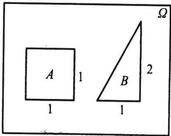  
图1.2.1 落在度量相同的  
子区域内的等可能性
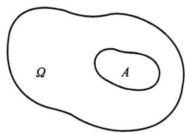  
图1.2.2 几何概率

<Example title="例 1.2.8 会面问题">
甲乙两人约定在下午 6 时到 7 时之间在某处会面, 并约定先到者应等候另一个人 20 min, 过时即可离去. 求两人能会面的概率.

<Solution title="解">
以 x 和 y 分别表示甲、乙两人到达约会地点的时间（以 min 为单位），在平面上建立 xOy 直角坐标系（见图 1.2.3）.
因为甲、乙都是在0至 $60\mathrm{min}$ 内等可能地到达，所以由等可能性知这是一个几何概率问题. $(x,y)$ 的所有可能取值在边长为60的正方形区域内，其面积为 $S_{\Omega} = 60^{2}$ 而事件 $A =$ “两人能够会面”相当于
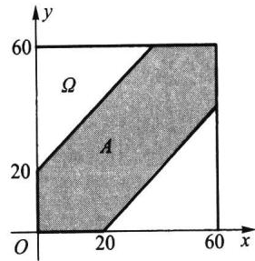  
图1.2.3 会面问题中的 $\Omega$ 与 $A$
$$
\mid x - y \mid \leqslant 2 0,
$$
即图中的阴影部分,其面积为 $S_{A}=60^{2}-40^{2}$ , 由(1.2.13)式知
$$
P (A) = \frac {S _ {A}}{S _ {\Omega}} = \frac {6 0 ^ {2} - 4 0 ^ {2}}{6 0 ^ {2}} = \frac {5}{9} = 0. 5 5 5 6.
$$
结果表明:按此规则约会,两人能会面的概率不超过0.6.若把约定时间改为在下午6时到6时30分,其他不变,则两人能会面的概率提高到0.8889.
</Solution>
</Example>

<Example title="例 1.2.9 比丰投针问题(见[1]">
) 平面上画有间隔为 $d(d>0)$ 的等距平行线, 向平面任意投掷一枚长为 $l(l<d)$ 的针, 求针与任一平行线相交的概率.

<Solution title="解">
以 $x$ 表示针的中点与最近一条平行线的距离, 又以 $\varphi$ 表示针与此直线间的夹角, 见图1.2.4. 易知样本空间 $\Omega$ 满足
$$
0 \leqslant x \leqslant d / 2, \quad 0 \leqslant \varphi \leqslant \pi ,
$$
由这两式可以确定 $\varphi Ox$ 平面上的一个矩形 $\Omega$ , 这就是样本空间, 其面积为 $S_{\Omega} = d\pi / 2$ . 这时针与平行线相交 (记为事件 $A$ ) 的充要条件是
$$
x \leqslant \frac {l}{2} \sin \varphi .
$$
由这个不等式表示的区域是图 1.2.5 中的阴影部分.
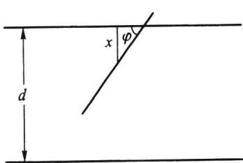  
图1.2.4 比丰投针问题
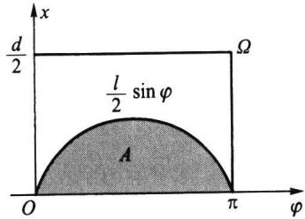  
图1.2.5 比丰投针问题中的 $\Omega$ 和 $A$
由于针是向平面任意投掷的,所以由等可能性知这是一个几何概率问题.由此得
$$
P (A) = \frac {S _ {A}}{S _ {\Omega}} = \frac {\int_ {0} ^ {\pi} \frac {l}{2} \sin \varphi \mathrm{d} \varphi}{\frac {d}{2} \pi} = \frac {2 l}{d \pi}.
$$
如果 $l, d$ 为已知，则以 $\pi$ 的值代入上式即可计算得 $P(A)$ 之值。反之，如果已知 $P(A)$ 的值，则也可以利用上式去求 $\pi$ ，而关于 $P(A)$ 的值，可用从试验中获得的频率去近似它: 即投针 N 次, 其中针与平行线相交 n 次, 则频率 n/N 可作为 $P(A)$ 的估计值, 于是由
$$
\frac {n}{N} \approx P (A) = \frac {2 l}{d \pi},
$$
可得
$$
\pi \approx \frac {2 l N}{d n}.
$$
历史上有一些学者曾亲自做过这个试验,下表记录了他们的试验结果.
表 1.2.8 比丰投针试验结果
<table><tr><td>试验者</td><td>年份</td><td>l/d</td><td>投掷次数</td><td>相交次数</td><td> $\pi$ 的近似值</td></tr><tr><td>沃尔夫(Wolf)</td><td>1 850</td><td>0.8</td><td>5 000</td><td>2 532</td><td>3.159 6</td></tr><tr><td>福克斯(Fox)</td><td>1 884</td><td>0.75</td><td>1 030</td><td>489</td><td>3.159 5</td></tr><tr><td>拉泽里尼(Lazzerini)</td><td>1 901</td><td>0.83</td><td>3 408</td><td>1 808</td><td>3.141 5</td></tr><tr><td>雷娜(Reina)</td><td>1 925</td><td>0.54</td><td>2 520</td><td>859</td><td>3.179 5</td></tr></table>
这是一个颇为奇妙的方法: 只要设计一个随机试验, 使一个事件的概率与某个未知数有关, 然后通过重复试验, 以频率估计概率, 即可求得未知数的近似解. 一般来说, 试验次数越多, 则求得的近似解就越精确. 随着计算机的出现, 人们便可利用计算机来大量重复地模拟所设计的随机试验. 这种方法得到了迅速的发展和广泛的应用. 人们称这种方法为随机模拟法, 也称为蒙特卡罗 (Monte Carlo) 法.
</Solution>
</Example>

<Example title="例 1.2.10">
在长度为 a 的线段内任取两点将其分为三段, 求它们可以构成一个三角形的概率.

<Solution title="解">
由于是将线段任意分成三段,所以由等可能性知这是一个几何概率问题.分别用 $x, y$ 和 $a - x - y$ 表示线段被分成的三段长度(见图1.2.6),则显然应该有
$$
0 <   x <   a, \quad 0 <   y <   a, \quad 0 <   a - (x + y) <   a.
$$
第三个式子等价于 $0 < x + y < a$ . 所以样本空间为 (见图 1.2.7)
$$
\Omega = \{(x, y): 0 <   x <   a, 0 <   y <   a, 0 <   x + y <   a \}.
$$
$\Omega$ 的面积为
$$
S _ {\Omega} = \frac {a ^ {2}}{2}.
$$
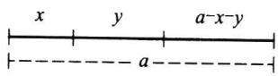  
图1.2.6 长度为 $a$ 的
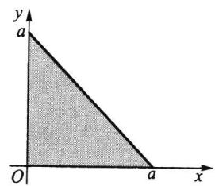  
线段分成三段  
图1.2.7 线段分成三段  
的样本空间 $\Omega$
又根据构成三角形的条件:三角形中任意两边之和大于第三边,得事件 A 所含样
本点 $(x, y)$ 必须同时满足
$$
0 <   a - (x + y) <   x + y,
$$
$$
0 <   x <   y + (a - x - y),
$$
$$
0 <   y <   x + (a - x - y).
$$
整理得
$$
\frac {a}{2} <   x + y <   a, \quad 0 <   x <   \frac {a}{2}, \quad 0 <   y <   \frac {a}{2}.
$$
所以事件 A 可用图 1.2.8 中的阴影部分表示.
事件 $A$ 的面积为
$$
S _ {A} = \frac {a ^ {2}}{8}.
$$
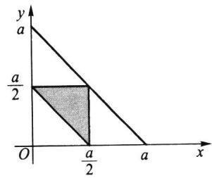  
图1.2.8 构成三角形的条件
由此得
$$
P (A) = \frac {1}{4}.
$$
</Solution>
</Example>

<Example title="例 1.2.11 贝特朗奇论(见[1]">
) 在一圆内任取一条弦,问其长度超过该圆内接等边三角形的边长的概率是多少?
这是一个几何概率问题,它有三种解法,具体如下:

<Solution title="解法一">
由于对称性, 可只考察某指定方向的弦. 作一条直径垂直于这个方向. 显然, 只有交直径于 $1/4$ 与 $3/4$ 之间的弦才能超过正三角形的边长 (见图1.2.9(a)), 如此, 所求概率为 $1/2$ .
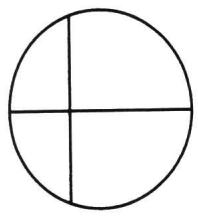  
(a)
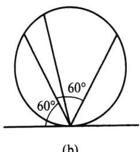  
(b)
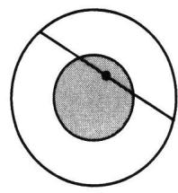  
(c)  
图1.2.9 贝特朗奇论的三种解法
</Solution>

<Solution title="解法二">
由于对称性, 可让弦的一端点固定, 让另一端点在圆周上作随机移动. 若在固定端点作一切线, 则与此切线夹角在 $60^{\circ}$ 与 $120^{\circ}$ 之间的弦才能超过正三角形的边长 (见图 1.2.9(b)), 如此, 所求概率为 $1/3$ .
</Solution>

<Solution title="解法三">
圆内弦的位置被其中点唯一确定. 在圆内作一同心圆, 其半径仅为大圆半径的一半, 则大圆内弦的中点落在小圆内, 此弦长才能超过正三角形的边长 (见图 1.2.9(c)), 如此, 所求概率为 $1/4$ .
同一问题有三种不同答案,究其原因在于圆内“取弦”时规定尚不够具体,不同的“等可能性假定”导致了不同的样本空间,具体如下:其中“均匀分布”应理解为“等可能取点”.
解法一中假定弦的中点在直径上均匀分布, 直径上的点组成样本空间 $\Omega_{1}$ .
解法二中假定弦的另一活动端点在圆周上均匀分布,圆周上的点组成样本空
间 $\Omega_{2}$
解法三中假定弦的中点在大圆内均匀分布,大圆内的点组成样本空间 $\Omega_{3}$ .
可见,上述三个答案是针对三个不同样本空间引起的,它们都是正确的,贝特朗奇论引起人们注意,在定义概率时要事先明确指出样本空间是什么.
</Solution>
</Example>

## 1.2.6 确定概率的主观方法

在现实世界里有一些随机现象是不能重复的或不能大量重复的,这时有关事件的概率如何确定呢?
统计界的贝叶斯学派认为:一个事件的概率是人们根据经验对该事件发生的可能性所给出的个人信念.这样给出的概率称为主观概率.
这种利用经验确定随机事件发生可能性大小的例子是很多的,人们也常依据某些主观概率来行事.

<Example title="例 1.2.12">
用主观方法确定概率的例子.
（1）在气象预报中，往往会说“明天下雨的概率为 $90\%$ ”，这是气象专家根据气象专业知识和最近的气象情况给出的主观概率。听到这一信息的人，大多出门会带伞。
（2）一个企业家根据他多年的经验和当时的一些市场信息，认为“某项新产品在未来市场上畅销”的可能性为 $80\%$
（3）一个外科医生根据自己多年的临床经验和一位患者的病情，认为“此手术成功”的可能性为 $90\%$
(4) 一个教师根据自己多年的教学经验和甲、乙两学生的学习情况,认为“甲学生能考取大学”的可能性为 $95\%$ , “乙学生能考取大学”的可能性为 $40\%$ .
从以上例子可以看出：
（1）主观概率和主观臆造有着本质上的不同，前者要求当事人对所考察的事件有透彻的了解和丰富的经验，甚至是这一行的专家，并能对历史信息和当时信息进行仔细分析，如此确定的主观概率是可信的。从某种意义上说，不利用这些丰富的经验也是一种浪费。
（2）用主观方法得出的随机事件发生的可能性大小,本质上是对随机事件概率的一种推断和估计.虽然结论的精确性有待实践的检验和修正,但结论的可信性在统计意义上是有其价值的.
（3）在遇到的随机现象无法大量重复时，用主观方法去做决策和判断是适合的。从这点看，主观方法至少是频率方法的一种补充。
另外要说明的是,主观概率的确定除根据自己的经验外,决策者还可以利用别人的经验.例如,对一项有风险的投资,决策者向某位专家咨询的结果为“成功的可能性为60%”.而决策者很熟悉这位专家,认为专家的估计往往是偏保守的、过分谨慎的.为此决策者将结论修改为“成功的可能性为70%”.
主观给定的概率要符合公理化的定义.
</Example>

<Block title="习题1.2">
1. 对于组合数 $\binom{n}{r}$ , 证明:
(1) $\binom{n}{r} = \binom{n}{n - r}$ ;
(2) $\binom{n}{r} = \binom{n - 1}{r - 1} + \binom{n - 1}{r}$ ;
(3) $\binom{n}{0} + \binom{n}{1} + \dots + \binom{n}{n} = 2^n$ ;
(4) $\binom{n}{1} + 2\binom{n}{2} + \cdots + n\binom{n}{n} = n2^{n-1}$ ;
(5) $\binom{a}{0}\binom{b}{n} + \binom{a}{1}\binom{b}{n - 1} + \dots + \binom{a}{n}\binom{b}{0} = \binom{a + b}{n},\quad n = \min \{a,b\};$
(6) $\binom{n}{0}^2 +\binom{n}{1}^2 +\dots +\binom{n}{n}^2 = \binom{2n}{n}$ .
2. 抛三枚硬币, 求至少出现一个正面的概率.
3. 任取两个正整数, 求它们的和为偶数的概率.
4. 掷两颗骰子，求下列事件的概率：
(1) 点数之和为 6;
(2) 点数之和不超过 6;
(3) 至少有一个 6 点.
5. 考虑一元二次方程 $x^{2} + Bx + C = 0$ ，其中 $B, C$ 分别是将一颗骰子接连掷两次先后出现的点数，求该方程有实根的概率 $p$ 和有重根的概率 $q$ .
6. 从一副 52 张的扑克牌中任取 4 张, 求下列事件的概率:
(1) 全是黑桃；
(2) 同花；
(3) 没有两张同一花色；
(4) 同色.
7. 设 9 件产品中有 2 件不合格品. 从中不返回地任取 2 件, 求取出的 2 件中全是合格品、仅有一件合格品和没有合格品的概率各为多少?
8. 口袋中有 7 个白球、3 个黑球，从中任取两个，求取到的两个球的颜色
(1) 相同的概率；
(2) 不同的概率.
9. 甲口袋有5个白球、3个黑球，乙口袋有4个白球、6个黑球。从两个口袋中各任取一球，求取到的两个球颜色相同的概率。
10. 从 n 个数 $1, 2, \cdots, n$ 中任取 2 个，问其中一个小于 k (1 &lt; k &lt; n)，另一个大于 k 的概率是多少？
11. 口袋中有 10 个球, 分别标有号码 1 到 10, 现从中不返回地任取 4 个, 记下取出球的号码, 试求:
(1) 最小号码为 5 的概率；
(2) 最大号码为 5 的概率.
12. 掷三颗骰子,求以下事件的概率:
(1) 所得的最大点数小于等于 5;
(2) 所得的最大点数等于 5.
13. 把 10 本书任意地放在书架上, 求其中指定的 4 本书放在一起的概率.
14. $n$ 个人随机地围一圆桌而坐，求甲、乙两人相邻而坐的概率.
15. 同时掷 5 枚骰子, 观察点数, 试证明:
(1) $P(\text{每枚都不一样}) = 0.0926$ ; (2) $P(\text{一对}) = 0.4630$ ; (3) $P(\text{两对}) = 0.2315$ ; (4) $P(\text{三枚一样}) = 0.1543$ ; (5) $P(\text{四枚一样}) = 0.0193$ ; (6) $P(\text{五枚一样}) = 0.0008$ .
16. 一个人把六根草紧握在手中,仅露出它们的头和尾,然后随机地把六个头两两相接,六个尾也两两相接.求放开手后六根草恰巧连成一个环的概率.
17. 把 $n$ 个“0”与 $n$ 个“1”随机地排列, 求没有两个“1”连在一起的概率.
18. 设 10 件产品中有 2 件不合格品, 从中任取 4 件, 设其中不合格品数为 $X$ , 求 $X$ 的概率分布.
19. $n$ 个男孩, $m$ 个女孩 $(m \leqslant n + 1)$ 随机地排成一排, 试求任意两个女孩都不相邻的概率.
20. 将 3 个球随机地放入 4 个杯子中去, 求杯子中球的最大个数 $X$ 的概率分布.
21. 将 12 个球随机地放入 3 个盒子中, 试求第一个盒子中有 3 个球的概率.
22. 将 $n$ 个完全相同的球（这时也称球是不可辨的）随机地放入 $N$ 个盒子中，试求：
(1) 某个指定的盒子中恰好有 k 个球的概率；
(2) 恰好有 m 个空盒的概率；
(3) 某指定的 m 个盒子中恰好有 j 个球的概率.
23. 在区间 $(0,1)$ 中随机地取两个数，求事件“两数之和小于 $7 / 5$ ”的概率.
24. 甲乙两艘轮船驶向一个不能同时停泊两艘轮船的码头, 它们在一昼夜内到达的时间是等可能的. 如果甲船的停泊时间是一小时, 乙船的停泊时间是两小时, 求它们中任何一艘都不需要等候码头空出的概率是多少?
25. 在平面上画有间隔为 $d$ 的等距平行线, 向平面任意投掷一个边长为 $a, b, c$ (均小于 $d$ ) 的三角形, 求三角形与平行线相交的概率.
26. 在半径为 $R$ 的圆内画平行弦, 如果这些弦与垂直于弦的直径的交点在该直径上的位置是等可能的, 即交点在直径上一个区间内的可能性与此区间的长度成比例, 求任意画弦的长度大于 $R$ 的概率.
27. 设一个质点落在 $xOy$ 平面上由 $x$ 轴、 $y$ 轴及直线 $x + y = 1$ 所围成的三角形内，而落在此三角形内各点处的可能性相等，即落在此三角形内任何区域上的概率与该区域的面积成正比，试求此质点的位置还满足 $y < 2x$ 的概率是多少？
28. 设 $a > 0$ ，有任意两数 $x, y$ ，且 $0 < x < a, 0 < y < a$ ，试求 $xy < a^2 / 4$ 的概率.
29. 用主观方法确定: 大学生中戴眼镜的概率是多少?
30. 用主观方法确定: 学生中考试作弊的概率是多少?
</Block>
