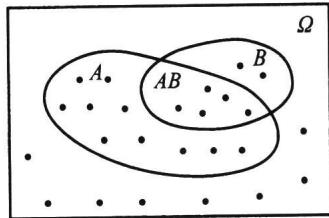
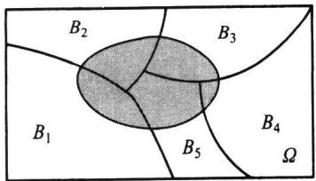
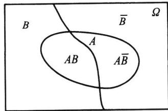
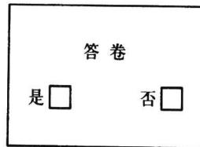

import Guide from '@/components/Guide.astro';
import Knowledge from '@/components/Knowledge.astro';
import Example from '@/components/Example.astro';
import Analysis from '@/components/Analysis.astro';
import Solution from '@/components/Solution.astro';
import Variant from '@/components/Variant.astro';
import Note from '@/components/Note.astro';
import Block from '@/components/Block.astro';
import Method from '@/components/Method.astro';
import Exercise from '@/components/Exercise.astro';

条件概率是概率论中的一个既重要又实用的概念.

## 1.4.1 条件概率的定义

所谓条件概率,是指在某事件 B 发生的条件下,另一事件 A 发生的概率,记为
$P(A \mid B)$ ，它与 $P(A)$ 是不同的两类概率。下面用一个例子说明之。

<Example title="例 1.4.1">
考察有两个小孩的家庭, 其样本空间为 $\Omega=\{bb,bg,gb,gg\}$ , 其中 b 代表男孩, g 代表女孩, bg 表示大的是男孩、小的是女孩. 其他样本点可类似说明.
在 $\Omega$ 中 4 个样本点等可能情况下,我们来讨论如下一些事件的概率.
(1) 事件 $A =$ “家中至少有一个女孩”发生的概率为
$$
P (A) = \frac {3}{4}.
$$
(2) 若已知事件 $B =$ “家中至少有一个男孩”发生, 再求事件 $A$ 发生的概率为
$$
P (A \mid B) = \frac {2}{3}.
$$
这是因为事件 $B$ 的发生，排除了 $gg$ 发生的可能性，这时样本空间 $\Omega$ 也随之改为 $\Omega_B = \{bb, bg, gb\}$ ，而在 $\Omega_B$ 中事件 $A$ 只含2个样本点，故 $P(A|B) = 2/3$ . 这就是条件概率，它与（无条件）概率 $P(A)$ 是不同的两个概念.
(3) 若对上述条件概率的分子分母各除以 4, 则可得
$$
P (A \mid B) = \frac {2 / 4}{3 / 4} = \frac {P (A B)}{P (B)},
$$
其中交事件 AB = “家有一男一女两个小孩”.
这个关系具有一般性,即条件概率是两个无条件概率之商,这就是条件概率的定义.
</Example>

<Knowledge title="定义 1.4.1">
设 A 与 B 是样本空间 $\Omega$ 中的两事件, 若 $P(B)>0$ , 则称
$$
P (A \mid B) = \frac {P (A B)}{P (B)}\tag{1.4.1}
$$
为“在 B 发生下 A 的条件概率”，简称条件概率.
</Knowledge>

<Example title="例 1.4.2">
设某样本空间 $\Omega$ 含有 25 个等可能的样本点, 事件 A 含有 15 个样本点, 事件 B 含有 7 个样本点, 交事件 AB 含有 5 个样本点, 具体见图 1.4.1.
这时有
$$
P (A) = \frac {1 5}{2 5}, \quad P (B) = \frac {7}{2 5},
$$
  
图1.4.1 例1.4.2的维恩图
$$
P (A B) = \frac {5}{2 5}.
$$
则在事件 B 发生的条件下, 事件 A 的条件概率为
$$
P (A \mid B) = \frac {P (A B)}{P (B)} = \frac {5 / 2 5}{7 / 2 5} = \frac {5}{7}.
$$
此结果也可以如此考虑:事件 B 发生,表明事件 $\overline{B}$ 不可能发生,因此 $\overline{B}$ 中的 18 个样本点可以不予考虑,此时在 B 中 7 个样本点中属于 A 的只有 5 个,所以 $P(A|B)=5/7$ .这意味着,计算条件概率 $P(A|B)$ 是在样本空间 $\Omega$ 缩小为 $\Omega_{B}=B$ 下进行的.
类似地
$$
P (B \mid A) = \frac {P (A B)}{P (A)} = \frac {5 / 2 5}{1 5 / 2 5} = \frac {5}{1 5} = \frac {1}{3}.
$$
它也可作如上解释.
我们要注意的是:条件概率 $P(A \mid B)$ 是在给定 B 下讨论事件 A 的概率,那么概率的性质对 $P(\cdot \mid B)$ 而言是否都成立呢?譬如,
$$
\begin{array}{r l} & P (\overline {{{A}}} \mid B) = 1 - P (A \mid B), \\ & P (A _ {1} \cup A _ {2} \mid B) = P (A _ {1} \mid B) + P (A _ {2} \mid B) - P (A _ {1} A _ {2} \mid B) \end{array}
$$
这些概率性质都成立吗？为此我们只要能验证条件概率满足三条公理即可回答这个问题.
</Example>

<Knowledge title="性质 1.4.1">
条件概率是概率, 即若设 $P(B) > 0$ , 则
(1) $P(A|B) \geqslant 0, A \in \mathcal{F}$ .
(2) $P(\Omega |B) = 1.$
(3) 若 $\mathcal{F}$ 中的 $A_{1}, A_{2}, \cdots, A_{n}, \cdots$ 互不相容，则
$$
P \left(\bigcup_ {n = 1} ^ {\infty} A _ {n} \mid B\right) = \sum_ {n = 1} ^ {\infty} P (A _ {n} \mid B).
$$

<Solution title="证明">
用条件概率的定义很容易证明(1)和(2)，下面来证明(3).因为 $A_{1},A_{2},\cdots,A_{n},\cdots$ 互不相容，所以 $A_{1}B,A_{2}B,\cdots,A_{n}B,\cdots$ 也互不相容，故
$$
\begin{array}{r l} P \left(\bigcup_ {n = 1} ^ {\infty} A _ {n} \mid B\right) & = \frac {P \left(\left(\bigcup_ {n = 1} ^ {\infty} A _ {n}\right) B\right)}{P (B)} = \frac {P \left(\bigcup_ {n = 1} ^ {\infty} (A _ {n} B)\right)}{P (B)} \\ & = \sum_ {n = 1} ^ {\infty} \frac {P (A _ {n} B)}{P (B)} = \sum_ {n = 1} ^ {\infty} P (A _ {n} \mid B). \end{array}
$$
以下给出条件概率特有的三个非常实用的公式:乘法公式、全概率公式和贝叶斯公式.这些公式可以帮助我们计算一些复杂事件的概率.
</Solution>
</Knowledge>

## 1.4.2 乘法公式

<Knowledge title="性质 1.4.2">
乘法公式
(1) 若 $P(B)>0$ , 则
$$
P (A B) = P (B) P (A \mid B).\tag{1.4.2}
$$
(2) 若 $P(A_{1}A_{2}\cdots A_{n-1})>0$ ，则
$$
P \left(A _ {1} A _ {2} \dots A _ {n}\right) = P \left(A _ {1}\right) P \left(A _ {2} \mid A _ {1}\right) P \left(A _ {3} \mid A _ {1} A _ {2}\right) \dots P \left(A _ {n} \mid A _ {1} A _ {2} \dots A _ {n - 1}\right).\tag{1.4.3}
$$

<Solution title="证明">
由条件概率的定义,整理即得(1.4.2)式.下证(1.4.3)式,因为
$$
P (A _ {1}) \geqslant P (A _ {1} A _ {2}) \geqslant \dots \geqslant P (A _ {1} A _ {2} \dots A _ {n - 1}) > 0,
$$
所以(1.4.3)式中的条件概率均有意义,且按条件概率的定义,(1.4.3)式的右边等于
$$
P (A _ {1}) \cdot \frac {P (A _ {1} A _ {2})}{P (A _ {1})} \cdot \frac {P (A _ {1} A _ {2} A _ {3})}{P (A _ {1} A _ {2})} \cdot \dots \cdot \frac {P (A _ {1} A _ {2} \cdots A _ {n})}{P (A _ {1} A _ {2} \cdots A _ {n - 1})} = P (A _ {1} A _ {2} \dots A _ {n}).
$$
从而(1.4.3)式成立.
</Solution>
</Knowledge>

<Example title="例 1.4.3">
一批零件共有 100 个, 其中有 10 个不合格品. 从中一个一个取出, 求第
三次才取得不合格品的概率是多少？

<Solution title="解">
以 $A_{i}$ 记事件“第 $i$ 次取出的是不合格品”， $i = 1,2,3$ . 则所求概率为 $P(\overline{A}_1\overline{A}_2A_3)$ ，由乘法公式得
$$
P (\overline {{{A}}} _ {1} \overline {{{A}}} _ {2} A _ {3}) = P (\overline {{{A}}} _ {1}) P (\overline {{{A}}} _ {2} | \overline {{{A}}} _ {1}) P (A _ {3} | \overline {{{A}}} _ {1} \overline {{{A}}} _ {2}) = \frac {9 0}{1 0 0} \cdot \frac {8 9}{9 9} \cdot \frac {1 0}{9 8} = 0. 0 8 2 6.
$$
其实,例 1.4.3 是下面例 1.4.4 的特例.
</Solution>
</Example>

<Example title="例 1.4.4 罐子模型">
设罐中有 b 个黑球、r 个红球，每次随机取出一个球，取出后将原球放回，还加进 c 个同色球和 d 个异色球。记 $B_{i}$ 为“第 i 次取出的是黑球”， $R_{j}$ 为“第 j 次取出的是红球”。
若连续从罐中取出三个球,其中有两个红球、一个黑球.则由乘法公式我们可得
$$
\begin{array}{r l} P (B _ {1} R _ {2} R _ {3}) & = P (B _ {1}) P (R _ {2} \mid B _ {1}) P (R _ {3} \mid B _ {1} R _ {2}) \\ & = \frac {b}{b + r} \cdot \frac {r + d}{b + r + c + d} \cdot \frac {r + d + c}{b + r + 2 c + 2 d}, \\ P (R _ {1} B _ {2} R _ {3}) & = P (R _ {1}) P (B _ {2} \mid R _ {1}) P (R _ {3} \mid R _ {1} B _ {2}) \\ & = \frac {r}{b + r} \cdot \frac {b + d}{b + r + c + d} \cdot \frac {r + d + c}{b + r + 2 c + 2 d}, \\ P (R _ {1} R _ {2} B _ {3}) & = P (R _ {1}) P (R _ {2} \mid R _ {1}) P (B _ {3} \mid R _ {1} R _ {2}) \\ & = \frac {r}{b + r} \cdot \frac {r + c}{b + r + c + d} \cdot \frac {b + 2 d}{b + r + 2 c + 2 d}. \end{array}
$$
以上概率与黑球在第几次被抽出有关.
罐子模型也称为波利亚(Pólya)模型,这个模型可以有各种变化,具体见下:
（1）当 $c = -1, d = 0$ 时，即为不返回抽样。此时前次抽取结果会影响后次抽取结果。但只要抽取的黑球与红球个数确定，则概率不依赖其抽出球的次序，都是一样的。此例中有
$$
P (B _ {1} R _ {2} R _ {3}) = P (R _ {1} B _ {2} R _ {3}) = P (R _ {1} R _ {2} B _ {3}) = \frac {b r (r - 1)}{(b + r) (b + r - 1) (b + r - 2)}.
$$
</Example>

<Example title="例 1.4.3">
可以归结为此种情况.
（2）当 c=0, d=0 时，即为返回抽样。此时前次抽取结果不会影响后次抽取结果。故上述三个概率相等，且都等于
$$
P (B _ {1} R _ {2} R _ {3}) = P (R _ {1} B _ {2} R _ {3}) = P (R _ {1} R _ {2} B _ {3}) = \frac {b r ^ {2}}{(b + r) ^ {3}}.
$$
(3) 当 $c > 0, d = 0$ 时, 称为传染病模型. 此时, 每次取出球后会增加下一次取到同色球的概率, 或换句话说, 每次发现一个传染病患者, 以后都会增加再传染的概率. 与 (1), (2) 一样, 以上三个概率都相等, 且都等于
$$
P (B _ {1} R _ {2} R _ {3}) = P (R _ {1} B _ {2} R _ {3}) = P (R _ {1} R _ {2} B _ {3}) = \frac {b r (r + c)}{(b + r) (b + r + c) (b + r + 2 c)}.
$$
从以上(1)、(2)和(3)中可以看出:在罐子模型中只要 d=0, 则以上三个概率都相等. 即只要抽取的黑球与红球个数确定, 则概率不依赖其抽出球的次序, 都是一样的. 但当 $d > 0$ 时, 就不同了, 见下面 (4).
（4）当 $c = 0, d > 0$ 时，称为安全模型。此模型可解释为：每当事故发生了（红球被取出），安全工作就抓紧一些，下次再发生事故的概率就会减少；而当事故没有发生时（黑球被取出），安全工作就放松一些，下次再发生事故的概率就会增大。在这种场合，上述三个概率分别为
$$
P (B _ {1} R _ {2} R _ {3}) = \frac {b}{b + r} \cdot \frac {r + d}{b + r + d} \cdot \frac {r + d}{b + r + 2 d},
$$
$$
P (R _ {1} B _ {2} R _ {3}) = \frac {r}{b + r} \cdot \frac {b + d}{b + r + d} \cdot \frac {r + d}{b + r + 2 d},
$$
$$
P (R _ {1} R _ {2} B _ {3}) = \frac {r}{b + r} \cdot \frac {r}{b + r + d} \cdot \frac {b + 2 d}{b + r + 2 d}.
$$
</Example>

## 1.4.3 全概率公式

全概率公式是概率论中的一个重要公式,它提供了计算复杂事件概率的一条有效途径,使一个复杂事件的概率计算问题化繁就简.

<Knowledge title="性质 1.4.3 全概率公式">
设 $B_{1}, B_{2}, \cdots, B_{n}$ 为样本空间 $\Omega$ 的一个分割（见图 1.4.2），即 $B_{1}, B_{2}, \cdots, B_{n}$ 互不相容，且 $\bigcup_{i=1}^{n} B_{i} = \Omega$ ，如果 $P(B_{i}) > 0, i = 1, 2, \cdots, n$ ，则对任一事件 A 有
$$
P (A) = \sum_ {i = 1} ^ {n} P (B _ {i}) P (A \mid B _ {i}).\tag{1.4.4}
$$

<Solution title="证明">
因为
$$
A = A \Omega = A \left(\bigcup_ {i = 1} ^ {n} B _ {i}\right) = \bigcup_ {i = 1} ^ {n} (A B _ {i}),
$$
且 $AB_{1}, AB_{2}, \cdots, AB_{n}$ 互不相容, 所以由可加性得
$$
P (A) = P \left(\bigcup_ {i = 1} ^ {n} (A B _ {i})\right) = \sum_ {i = 1} ^ {n} P (A B _ {i}),
$$
再将 $P(AB_{i})=P(B_{i})P(A|B_{i}), i=1,2,\cdots,n$ ，代入上式即得(1.4.4).
对于全概率公式,我们要注意以下几点:
(1) 全概率公式的最简单形式 假如 $0 < P(B) < 1$ ，则
$$
P (A) = P (B) P (A \mid B) + P (\overline {{B}}) P (A \mid \overline {{B}}).\tag{1.4.5}
$$
见图1.4.3.
(2) 条件 $B_{1}, B_{2}, \cdots, B_{n}$ 为样本空间的一个分割, 可改成 $B_{1}, B_{2}, \cdots, B_{n}$ 互不相容, 且 $A \subset \bigcup_{i=1}^{n} B_{i}$ , 全概率公式仍然成立.
（3）对可列个事件 $B_{1}, B_{2}, \cdots, B_{n}, \cdots$ 互不相容，且 $A \subset \bigcup_{i=1}^{n} B_{i}$ ，则全概率公式仍成立，只要将(1.4.4)式右边写成可列项之和即可.
  
图1.4.2 样本空间的一个分割 $(n = 5)$
  
图1.4.3 用 $B$ 和 $\overline{B}$ 来分割样本空间
</Solution>
</Knowledge>

<Example title="例 1.4.5 摸彩模型">
设在 n 张彩票中有一张可中奖. 求第二人摸到中奖彩票的概率是多少?

<Solution title="解">
设 $A_{i}$ 表示事件“第 i 人摸到中奖彩票”， $i=1,2,\cdots,n$ 。现在目的是求 $P(A_{2})$ 。因为 $A_{1}$ 是否发生直接关系到 $A_{2}$ 发生的概率，即
$$
P (A _ {2} \mid A _ {1}) = 0, \quad P (A _ {2} \mid \overline {{{A}}} _ {1}) = \frac {1}{n - 1}.
$$
而 $A_{1}$ 与 $\overline{A}_{1}$ 是两个概率大于0的事件：
$$
P (A _ {1}) = \frac {1}{n}, \quad P (\overline {{A}} _ {1}) = \frac {n - 1}{n}.
$$
于是由全概率公式得
$$
P (A _ {2}) = P (A _ {1}) P (A _ {2} \mid A _ {1}) + P (\overline {{{A}}} _ {1}) P (A _ {2} \mid \overline {{{A}}} _ {1}) = \frac {1}{n} \cdot 0 + \frac {n - 1}{n} \cdot \frac {1}{n - 1} = \frac {1}{n}.
$$
这表明:摸到中奖彩票的机会与先后次序无关.因后者可能处于“不利状况”(前者已摸到中奖彩票),但也可能处于“有利状况”(前者没摸到中奖彩票,从而增加后者摸到中奖彩票的机会),两种状况用全概率公式综合(加权平均)所得结果(机会均等)既公平又合情理.
用类似的方法可得
$$
P (A _ {3}) = P (A _ {4}) = \dots = P (A _ {n}) = \frac {1}{n}.
$$
如果设 $n$ 张彩票中有 $k (\leqslant n)$ 张可中奖, 则可得
$$
P (A _ {1}) = P (A _ {2}) = \dots = P (A _ {n}) = \frac {k}{n}.
$$
这说明,购买彩票时,不论先买后买,中奖机会是均等的.
</Solution>
</Example>

<Example title="例 1.4.6">
保险公司认为某险种的投保人可以分成两类:一类为易出事故者,另一类为安全者.统计表明:一个易出事故者在一年内发生事故的概率为 0.4,而安全者这个概率则减少为 0.1.若假定易出事故者占此险种投保人的比例为 20%.现有一个新的投保人来投保此险种,问该投保人在购买保单后一年内将出事故的概率有多大?

<Solution title="解">
记 $A =$ “投保人在一年内出事故”， $B =$ “投保人为易出事故者，则 $\overline{B} =$ “投保人为安全者”，且 $P(\overline{B}) = 0.8$ . 由全概率公式得
$$
P (A) = P (B) P (A \mid B) + P (\overline {{B}}) P (A \mid \overline {{B}}) = 0. 2 \times 0. 4 + 0. 8 \times 0. 1 = 0. 1 6.
$$
</Solution>
</Example>

<Example title="例 1.4.7 敏感性问题调查">
学生阅读黄色书刊和观看黄色影像会严重影响其身心健康发展.但这些都是避着教师与家长进行的,属个人隐私行为.现在要设计一个调查方案,从调查数据中估计出学生中看过黄色书刊或影像的比率p.
像这类敏感性问题的调查是社会调查的一类,如一群人中参加赌博的比率、吸毒人的比率、经营者中偷税漏税户的比率、学生中考试作弊的比率等等.
对敏感性问题的调查方案,关键要使被调查者愿意作出真实回答又能保守个人秘密.一旦调查方案设计有误,被调查者就会拒绝配合,所得调查数据将失去真实性.经过多年研究和实践,一些心理学家和统计学家设计了一种调查方案,在这个方案中被调查者只需回答以下两个问题中的一个问题,而且只需回答“是”或“否”.
问题 A: 你的生日是否在 7 月 1 日之前?
问题 B: 你是否看过黄色书刊或影像?
这个调查方案看似简单,但为了消除被调查者的顾虑,使被调查者确信他(她)参加这次调查不会泄露个人秘密,在操作上有以下关键点:
(1) 被调查者在没有旁人的情况下,独自一人在一个房间内操作和回答问题.
（2）被调查者从一个罐子中随机抽一只球，看过颜色后即放回.若抽到白球，则回答问题A；若抽到红球，则回答问题B.且罐中只有白球和红球.
被调查者无论回答问题 A 或问题 B, 只需在答卷(见图 1.4.4)上认可的方框内打钩, 然后把答卷放入一只密封的投票箱内.
如此的调查方法,主要在于旁人无法知道被调查者回答的是问题 A 还是问题 B,由此可以极大地消除被调查者的顾虑.
  
图1.4.4 敏感性  
问题的答卷
现在的问题是如何分析调查的结果.很显然,我们对问题A是不感兴趣的.
首先我们设有 $n$ 张答卷（ $n$ 较大，譬如 1000 以上），其中有 $k$ 张回答“是”。而我们又无法知道此 $n$ 张答卷中有多少张是回答问题 B 的，同样无法知道 $k$ 张回答“是”的答卷中有多少张是回答问题 B 的。但有两个信息我们是预先知道的，即
(1) 在参加人数较多的场合,任选一人其生日在 7 月 1 日之前的概率为 0.5.
（2）罐中红球的比率 $\pi$ 已知. 现在就要利用这4个数据 $(n, k, 0.5, \pi)$ 求出 $p$ . 因为由全概率公式得
$$
P (\text {   是   }) = P (\text {   白球   }) P (\text {   是   } \mid \text {   白球   }) + P (\text {   红球   }) P (\text {   是   } \mid \text {   红球   }).
$$
所以，将 $P(\text{红球}) = \pi, P(\text{白球}) = 1 - \pi, P(\text{是}|\text{白球}) = 0.5, P(\text{是}|\text{红球}) = p$ 代入上式右边，而上式左边用频率 $k / n$ 代替，得
$$
\frac {k}{n} = 0. 5 (1 - \pi) + p \cdot \pi .
$$
由此得
$$
p = \frac {k / n - 0 . 5 (1 - \pi)}{\pi}.
$$
因为我们用频率 $k / n$ 代替了概率 $P$ (是), 所以从上式得到的是 $p$ 的估计.
例如,在一次实际调查中,罐中放有红球30个、白球20个,则 $\pi=0.6$ ,调查结束后共收到1583张有效答卷,其中有389张回答“是”,由此可计算得
$$
p = \frac {3 8 9 / 1 5 8 3 - 0 . 5 \times 0 . 4}{0 . 6} = 0. 0 7 6 2.
$$
这表明:约有 7.62% 的学生看过黄色书刊或影像.
</Example>

## 1.4.4 贝叶斯公式

在乘法公式和全概率公式的基础上立即可推得如下一个很著名的公式.

<Knowledge title="性质 1.4.4 贝叶斯公式">
设 $B_{1}, B_{2}, \cdots, B_{n}$ 是样本空间 $\Omega$ 的一个分割，即 $B_{1}, B_{2}, \cdots, B_{n}$ 互不相容，且 $\bigcup_{i=1}^{n} B_{i} = \Omega$ ，如果 $P(A) > 0, P(B_{i}) > 0, i = 1, 2, \cdots, n$ ，则
$$
P (B _ {i} \mid A) = \frac {P (B _ {i}) P (A \mid B _ {i})}{\sum_ {j = 1} ^ {n} P (B _ {j}) P (A \mid B _ {j})}, \quad i = 1, 2, \dots , n.\tag{1.4.6}
$$

<Solution title="证明">
由条件概率的定义
$$
P (B _ {i} \mid A) = \frac {P (A B _ {i})}{P (A)}.
$$
对上式的分子用乘法公式、分母用全概率公式，
$$
P (A B _ {i}) = P (B _ {i}) P (A \mid B _ {i}),
$$
$$
P (A) = \sum_ {j = 1} ^ {n} P (B _ {j}) P (A \mid B _ {j}),
$$
即得
$$
P (B _ {i} \mid A) = \frac {P (B _ {i}) P (A \mid B _ {i})}{\sum_ {j = 1} ^ {n} P (B _ {j}) P (A \mid B _ {j})}.
$$
结论得证.
</Solution>
</Knowledge>

<Example title="例 1.4.8">
某地区居民的肝癌发病率为 0.0004, 现用甲胎蛋白法进行普查. 医学研究表明, 化验结果是可能存有错误的. 已知患有肝癌的人其化验结果 99% 呈阳性 (有病), 而没患肝癌的人其化验结果 99.9% 呈阴性 (无病). 现某人的检查结果呈阳性, 问他真的患肝癌的概率是多少?

<Solution title="解">
记 B 为事件“被检查者患有肝癌”，A 为事件“检查结果呈阳性”。由题设知
$$
P (B) = 0. 0 0 0 4, \quad P (\overline {{B}}) = 0. 9 9 9 6,
$$
$$
P (A \mid B) = 0. 9 9, \quad P (A \mid \overline {{{B}}}) = 0. 0 0 1.
$$
我们现在的目的是求 $P(B|A)$ . 由贝叶斯公式得
$$
\begin{array}{r l} P (B \mid A) & = \frac {P (B) P (A \mid B)}{P (B) P (A \mid B) + P (\overline {{{B}}}) P (A \mid \overline {{{B}}})} \\ & = \frac {0 . 0 0 0 4 \times 0 . 9 9}{0 . 0 0 0 4 \times 0 . 9 9 + 0 . 9 9 9 6 \times 0 . 0 0 1} = 0. 2 8 4. \end{array}
$$
这表明,在检查结果呈阳性的人中,真患肝癌的人不到30%.这个结果可能会使人吃惊,但仔细分析一下就可以理解了.因为肝癌发病率很低,在10 000个人中约有4人,而约有9 996个人不患肝癌.对10 000个人用甲胎蛋白法进行检查,按其错检的概率可知,9 996个不患肝癌者中约有 $9\ 996\times0.001=9.996$ 个呈阳性.另外4个真患肝癌者的检查报告中约有 $4\times0.99=3.96$ 个呈阳性.仅从13.956个呈阳性者中看,真患肝癌的3.96人约占28.4%.
进一步降低错检的概率是提高检验精度的关键.在实际中由于技术和操作等种种原因,降低错检的概率又是很困难的.所以在实际中,常采用复查的方法来减少错误率.或用另一些简单易行的辅助方法先进行初查,排除了大量明显不是肝癌的人后,再用甲胎蛋白法对被怀疑的对象进行检查.此时被怀疑的对象群体中,肝癌的发病率已大大提高了,譬如,对首次检查呈阳性的人群再进行复查,此时 $P(B)=0.284$ ,这时再用贝叶斯公式计算得
$$
P (B \mid A) = \frac {0 . 2 8 4 \times 0 . 9 9}{0 . 2 8 4 \times 0 . 9 9 + 0 . 7 1 6 \times 0 . 0 0 1} = 0. 9 9 7.
$$
这就大大提高了甲胎蛋白法的准确率了.
在上例中, 如果我们将事件 $B$ (“被检查者患有肝癌”) 看作是“原因”, 将事件 $A$ (“检查结果呈阳性”) 看作是“结果”, 则我们用贝叶斯公式在已知“结果”的条件下, 求出了“原因”的概率 $P(B \mid A)$ . 而求“结果”的(无条件)概率 $P(A)$ , 用全概率公式. 在上例中若取 $P(B) = 0.284$ , 则
$$
\begin{array}{r l} P (A) & = P (B) P (A \mid B) + P (\overline {{B}}) P (A \mid \overline {{B}}) \\ & = 0. 2 8 4 \times 0. 9 9 + 0. 7 1 6 \times 0. 0 0 1 = 0. 2 8 1 9. \end{array}
$$
条件概率的三个公式中,乘法公式是求事件交的概率,全概率公式是求一个复杂事件的概率,而贝叶斯公式是求一个条件概率.
在贝叶斯公式中, 如果称 $P(B_{i})$ 为 $B_{i}$ 的先验概率, 称 $P(B_{i} \mid A)$ 为 $B_{i}$ 的后验概率, 则贝叶斯公式是专门用于计算后验概率的, 也就是通过 $A$ 的发生这个新信息, 来对 $B_{i}$ 的概率作出的修正. 下面例子很好地说明了这一点.
</Solution>
</Example>

<Example title="例 1.4.9">
伊索寓言“孩子与狼”讲的是一个小孩每天到山上放羊, 山里有狼出没. 第一天, 他在山上喊: “狼来了! 狼来了!” 山下的村民闻声便去打狼, 可到山上, 发现狼没有来; 第二天仍是如此; 第三天, 狼真的来了, 可无论小孩怎么喊叫, 也没有人来救他, 因为前两次他说了谎, 人们不再相信他了.
现在用贝叶斯公式来分析此寓言中村民对这个小孩的信任程度是如何下降的.
首先记事件 A 为“小孩说谎”，记事件 B 为“小孩可信”。不妨设村民过去对这个小孩的印象为
$$
P (B) = 0. 8, \quad P (\overline {{{B}}}) = 0. 2.\tag{1.4.7}
$$
我们现在用贝叶斯公式来求 $P(B|A)$ , 亦即这个小孩说了一次谎后, 村民对他信任程度的改变.
在贝叶斯公式中我们要用到概率 $P(A \mid B)$ 和 $P(A \mid \overline{B})$ ，这两个概率的含义是：前者为“可信”(B) 的孩子“说谎”(A) 的可能性，后者为“不可信”( $\overline{B}$ ) 的孩子“说谎”(A) 的
可能性.在此不妨设
$$
P (A \mid B) = 0. 1, \quad P (A \mid \overline {{{B}}}) = 0. 5.
$$
第一次村民上山打狼,发现狼没有来,即小孩说了谎(A).村民根据这个信息,对这个小孩的信任程度改变为(用贝叶斯公式)
$$
P (B \mid A) = \frac {P (B) P (A \mid B)}{P (B) P (A \mid B) + P (\overline {{{B}}}) P (A \mid \overline {{{B}}})} = \frac {0 . 8 \times 0 . 1}{0 . 8 \times 0 . 1 + 0 . 2 \times 0 . 5} = 0. 4 4 4.
$$
这表明村民上了一次当后,对这个小孩的信任程度由原来的0.8调整为0.444,也就是(1.4.7)调整为
$$
P (B) = 0. 4 4 4, \quad P (\overline {{{B}}}) = 0. 5 5 6.\tag{1.4.8}
$$
在此基础上,我们再一次用贝叶斯公式来计算 $P(B \mid A)$ , 亦即这个小孩第二次说谎后,村民对他的信任程度改变为
$$
P (B \mid A) = \frac {0 . 4 4 4 \times 0 . 1}{0 . 4 4 4 \times 0 . 1 + 0 . 5 5 6 \times 0 . 5} = 0. 1 3 8.
$$
这表明村民们经过两次上当,对这个小孩的信任程度已经从0.8下降到了0.138,如此低的信任度,村民听到第三次呼叫时怎么会再上山打狼呢?
这个例子启发人们:若某人向银行贷款,连续两次未还,银行还会第三次贷款给他吗?
</Example>

<Block title="习题1.4">
1. 某班级学生的考试成绩数学不及格的占 $8\%$ ，语文不及格的占 $5\%$ ，这两门都不及格的占 $2\%$ .
(1) 已知一学生数学不及格,他语文也不及格的概率是多少?
(2) 已知一学生语文不及格,他数学也不及格的概率是多少?
2. 设一批产品中一、二、三等品各占 $60\%$ ， $35\%$ ， $5\%$ 。从中任意取出一件，结果不是三等品，求取到的是一等品的概率。
3. 掷两颗骰子, 以 $A$ 记事件“两颗点数之和为 10”, 以 $B$ 记事件“第一颗点数小于第二颗点数”, 试求条件概率 $P(A \mid B)$ 和 $P(B \mid A)$ .
4. 设某种动物由出生活到 10 岁的概率为 0.8, 而活到 15 岁的概率为 0.5. 问现年为 10 岁的这种动物能活到 15 岁的概率是多少?
5. 设 10 件产品中有 3 件不合格品, 从中任取两件, 已知其中一件是不合格品, 求另一件也是不合格品的概率.
6. 设 $n$ 件产品中有 $m$ 件不合格品, 从中任取两件, 已知两件中有一件是合格品, 求另一件也是合格品的概率.
7. 掷一颗骰子两次，以 $x, y$ 分别表示先后掷出的点数，记
$$
A = \{x + y <   1 0 \}, \quad B = \{x > y \},
$$
求 $P(B|A), P(A|B)$ .
8. 已知 $P(A) = 1 / 3, P(B \mid A) = 1 / 4, P(A \mid B) = 1 / 6$ ，求 $P(A \cup B)$ .
9. 已知 $P(\overline{A}) = 0.3, P(B) = 0.4, P(A\overline{B}) = 0.5$ ，求 $P(B|A \cup \overline{B})$ .
10. 设 $A, B$ 为两事件， $P(A) = P(B) = 1/3, P(A \mid B) = 1/6$ ，求 $P(\overline{A} \mid \overline{B})$ .
11. 口袋中有 1 个白球, 1 个黑球. 从中任取 1 个, 若取出白球, 则试验停止; 若取出黑球, 则把取出的黑球放回的同时, 再加入 1 个黑球, 如此下去, 直到取出的是白球为止, 试求下列事件的概率:
(1) 取到第 n 次, 试验没有结束;
(2) 取到第 n 次, 试验恰好结束.
12. 一盒晶体管中有8只合格品、2只不合格品。从中不返回地一只一只取出，试求第二次取出的是合格品的概率。
13. 甲口袋有 $a$ 个白球、 $b$ 个黑球，乙口袋有 $n$ 个白球、 $m$ 个黑球。
（1）从甲口袋任取1个球放入乙口袋，再从乙口袋任取1个球.试求最后从乙口袋取出的是白球的概率；
（2）从甲口袋任取2个球放入乙口袋，再从乙口袋任取1个球.试求最后从乙口袋取出的是白球的概率.
14. 有 $n$ 个口袋, 每个口袋中均有 $a$ 个白球、 $b$ 个黑球. 从第一个口袋中任取一球放入第二个口袋, 再从第二个口袋中任取一球放入第三个口袋, 如此下去, 从第 $n-1$ 个口袋中任取一球放入第 $n$ 个口袋, 最后从第 $n$ 个口袋中任取一球, 求此时取到的是白球的概率.
15. 钥匙掉了, 掉在宿舍里、教室里、路上的概率分别是 $50\%$ 、 $30\%$ 和 $20\%$ , 而掉在上述三处地方被找到的概率分别是 0.8、0.3 和 0.1. 试求找到钥匙的概率.
16. 两台车床加工同样的零件, 第一台出现不合格品的概率是 0.03, 第二台出现不合格品的概率是 0.06, 加工出来的零件放在一起, 并且已知第一台加工的零件比第二台加工的零件多一倍.
(1) 求任取一个零件是合格品的概率；
(2) 如果取出的零件是不合格品, 求它是由第二台车床加工的概率.
17. 有两箱零件, 第一箱装 50 件, 其中 20 件是一等品. 第二箱装 30 件, 其中 18 件是一等品. 现从两箱中随意挑出一箱, 然后从该箱中先后任取两个零件, 试求:
(1) 第一次取出的零件是一等品的概率；
(2) 在第一次取出的是一等品的条件下,第二次取出的零件仍然是一等品的概率.
18. 学生在做一道有 4 个选项的单项选择题时, 如果他不知道问题的正确答案, 就作随机猜测. 现从卷面上看题是答对了, 试在以下情况下求学生确实知道正确答案的概率:
(1) 学生知道正确答案和胡乱猜测的概率都是 $1 / 2$ ;
(2) 学生知道正确答案的概率是 0.2.
19. 已知男人中有 $5\%$ 是色盲患者, 女人中有 $0.25\%$ 是色盲患者, 今从男女比例为 22:21 的人群中随机地挑选一人, 发现恰好是色盲患者, 问此人是男性的概率是多少?
20. 口袋中有一个球, 不知它的颜色是黑的还是白的. 现再往口袋中放入一个白球, 然后从口袋中任意取出一个, 发现取出的是白球, 试问口袋中原来那个球是白球的可能性为多少?
21. 将 $n$ 根绳子的 $2n$ 个头任意两两相接, 求恰好结成 $n$ 个圈的概率.
22. $m$ 个人相互传球, 球从甲手中开始传出, 每次传球时, 传球者等可能地把球传给其余 $m - 1$ 个人中的任何一个. 求第 $n$ 次传球时仍由甲传出的概率.
23. 甲、乙两人轮流掷一颗骰子, 甲先掷. 每当某人掷出 1 点时, 则交给对方掷, 否则此人继续掷. 试求第 $n$ 次由甲掷的概率.
24. 甲口袋有1个黑球、2个白球，乙口袋有3个白球。每次从两口袋中各任取一球，交换后放入另一口袋。求交换 $n$ 次后，黑球仍在甲口袋中的概率。
25. 假设只考虑天气的两种情况: 有雨或无雨. 若已知今天的天气情况, 明天天气保持不变的概率为 $p$ , 变的概率为 $1 - p$ . 设第一天无雨, 试求第 $n$ 天也无雨的概率.
26. 设罐中有 $b$ 个黑球、 $r$ 个红球，每次随机取出一个球，取出后将原球放回，再加入 $c (c > 0)$ 个同
色的球.试证:第k次取到黑球的概率为 $b/(b+r)$ , $k=1,2,\cdots$ .
27. 口袋中有 $a$ 个白球, $b$ 个黑球和 $n$ 个红球, 现从中一个一个不返回地取球. 试证白球比黑球出现得早的概率为 $a / (a + b)$ , 与 $n$ 无关.
28. 设 $P(A) > 0$ ，证明：
$$
P (B \mid A) \geqslant 1 - \frac {P (\overline {{{B}}})}{P (A)}.
$$
29. 若事件 $A$ 与 $B$ 互不相容, 且 $P(\overline{B}) \neq 0$ , 证明:
$$
P (A \mid \overline {{{B}}}) = \frac {P (A)}{1 - P (B)}.
$$
30. 设 $A, B$ 为任意两个事件，且 $A \subset B, P(B) > 0$ ，证明 $P(A) \leqslant P(A|B)$ .
31. 若 $P(A|B) > P(A|\overline{B})$ ，证明 $P(B|A) > P(B|\overline{A})$ .
32. 设 $P(A) = p, P(B) = 1 - \varepsilon$ ，证明：
$$
\frac {p - \varepsilon}{1 - \varepsilon} \leqslant P (A \mid B) \leqslant \frac {p}{1 - \varepsilon}.
$$
33. 若 $P(A|B) = 1$ ，证明： $P(\overline{B}|\overline{A}) = 1$ .
</Block>
