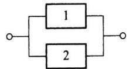
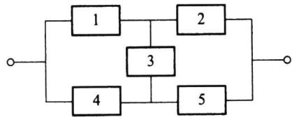
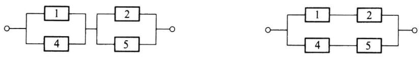

import Guide from '@/components/Guide.astro';
import Knowledge from '@/components/Knowledge.astro';
import Example from '@/components/Example.astro';
import Analysis from '@/components/Analysis.astro';
import Solution from '@/components/Solution.astro';
import Variant from '@/components/Variant.astro';
import Note from '@/components/Note.astro';
import Block from '@/components/Block.astro';
import Method from '@/components/Method.astro';
import Exercise from '@/components/Exercise.astro';

独立性是概率论中又一个重要概念,利用独立性可以简化概率的计算.下面先讨论两个事件之间的独立性,然后讨论多个事件之间的相互独立性,最后讨论试验之间的独立性.

## 1.5.1 两个事件的独立性

两个事件之间的独立性是指:一个事件的发生不影响另一个事件的发生.这在实际问题中是很多的,譬如在掷两颗骰子的试验中,记事件A为“第一颗骰子的点数为1”,记事件B为“第二颗骰子的点数为4”.则显然A与B的发生是相互不影响的.
另外,从概率的角度看,事件 A 的条件概率 $P(A \mid B)$ 与无条件概率 $P(A)$ 的差别在于:事件 B 的发生改变了事件 A 发生的概率,也即事件 B 对事件 A 有某种“影响”.如果事件 A 与 B 的发生是相互不影响的,则有 $P(A \mid B) = P(A)$ 和 $P(B \mid A) = P(B)$ ,它们都等价于
$$
P (A B) = P (A) P (B).\tag{1.5.1}
$$
另外对 $P(B) = 0$ ，或 $P(A) = 0$ ，(1.5.1)式仍然成立.为此，我们用(1.5.1)式作为两个事件相互独立的定义.

<Knowledge title="定义 1.5.1">
如果(1.5.1)式成立,则称事件 A 与 B 相互独立,简称 A 与 B 独立.否则称 A 与 B 不独立或相依.
在许多实际问题中,两个事件相互独立大多是根据经验(相互有无影响)来判断的,如上述掷两颗骰子问题中 A 与 B 的独立性.但在有些问题中,有时也用(1.5.1)式来判断两个事件间的独立性.
</Knowledge>

<Example title="例 1.5.1">
事件独立的例子
（1）从一副52张的扑克牌中任取1张，以 $A$ 记事件“取到黑桃”，以 $B$ 记事件“取到J”.则因为 $P(A) = 1 / 4, P(B) = 4 / 52 = 1 / 13$ ，而 $AB$ 表示“取到黑桃J”，故 $P(AB) = 1 / 52$ ，所以 $A$ 与 $B$ 相互独立.
(2) 考虑有三个小孩的家庭,并设所有 8 种情况
$$
b b b, \quad b b g, \quad b g b, \quad g b b, \quad b g g, \quad g b g, \quad g g b, \quad g g g
$$
是等可能的, 其中 $b$ 表示男孩, $g$ 表示女孩. 以 $A$ 记事件“家中男女孩都有”, 以 $B$ 记事件“家中至多一个女孩”. 则因为 $P(A) = 6 / 8$ , $P(B) = 4 / 8$ , 而 $AB$ 表示“家中恰有一个女孩”, 故 $P(AB) = 3 / 8$ , 所以 $A$ 与 $B$ 相互独立.
(3) 当考察的家庭有两个小孩时,样本空间只含 4 个样本点,它们是
$$
b b, \quad b g, \quad g b, \quad g g.
$$
若事件 $A, B$ 仍如 (2) 所设, 则 $P(A) = 2/4$ , $P(B) = 3/4$ , 而 $P(AB) = 2/4$ , 由于 $P(AB) \neq P(A)P(B)$ , 所以 $A$ 与 $B$ 不独立.
</Example>

<Knowledge title="性质 1.5.1">
若事件 A 与 B 独立, 则 A 与 $\overline{B}$ 独立, $\overline{A}$ 与 B 独立, $\overline{A}$ 与 $\overline{B}$ 独立.

<Solution title="证明">
由概率的性质知
$$
P (A \overline {{B}}) = P (A) - P (A B).
$$
又由 $A$ 与 $B$ 的独立性知
$$
P (A B) = P (A) P (B),
$$
所以
$$
P (A \overline {{B}}) = P (A) - P (A) P (B) = P (A) [ 1 - P (B) ] = P (A) P (\overline {{B}}),
$$
这表明 A 与 $\overline{B}$ 独立. 类似可证 $\overline{A}$ 与 B 独立, $\overline{A}$ 与 $\overline{B}$ 独立.
对于性质 1.5.1 的直观理解也是容易的: 因为 A 与 B 相互独立, 则 A 的发生不影响 B 的发生, 那么 A 的发生也不会影响 B 的不发生, A 的不发生也不会影响 B 的发生, A 的不发生也不会影响 B 的不发生.
</Solution>
</Knowledge>

## 1.5.2 多个事件的相互独立性

首先研究三个事件的相互独立性,对此我们先给出以下的定义

<Knowledge title="定义 1.5.2">
设 A, B, C 是三个事件, 如果有
$$
\left\{ \begin{array}{l} P (A B) = P (A) P (B), \\ P (A C) = P (A) P (C), \\ P (B C) = P (B) P (C), \end{array} \right.\tag{1.5.2}
$$
则称 A, B, C 两两独立. 若还有
$$
P (A B C) = P (A) P (B) P (C),\tag{1.5.3}
$$
则称 A, B, C 相互独立.
</Knowledge>

有例子可以证明由(1.5.2)式推不出(1.5.3)式,同样有例子可以证明由(1.5.3)式推不出(1.5.2)式.
由此我们可以定义三个以上事件的相互独立性.

<Knowledge title="定义 1.5.3">
设有 n 个事件 $A_{1}, A_{2}, \cdots, A_{n}$ ，对任意的 $1 \leqslant i < j < k < \cdots \leqslant n$ ，如果以下等式
均成立
$$
\left\{ \begin{array}{l} P (A _ {i} A _ {j}) = P (A _ {i}) P (A _ {j}), \\ P (A _ {i} A _ {j} A _ {k}) = P (A _ {i}) P (A _ {j}) P (A _ {k}), \\ \dots \dots \\ P (A _ {1} A _ {2} \dots A _ {n}) = P (A _ {1}) P (A _ {2}) \dots P (A _ {n}), \end{array} \right.\tag{1.5.4}
$$
则称此 n 个事件 $A_{1}, A_{2}, \cdots, A_{n}$ 相互独立.
从上述定义可以看出, $n$ 个相互独立的事件中的任意一部分内仍是相互独立的,而且任意一部分与另一部分也是独立的.与性质1.5.1类似,可以证明:将相互独立事件中的任一部分换为对立事件,所得的诸事件仍为相互独立的.
</Knowledge>

<Example title="例 1.5.2">
设 A, B, C 三事件相互独立, 试证 $A \cup B$ 与 C 相互独立.

<Solution title="证明">
因为
$$
\begin{array}{r l} P ((A \cup B) C) & = P (A C \cup B C) = P (A C) + P (B C) - P (A B C) \\ & = P (A) P (C) + P (B) P (C) - P (A) P (B) P (C) \\ & = (P (A) + P (B) - P (A) P (B)) P (C) = P (A \cup B) P (C), \end{array}
$$
所以 $A \cup B$ 与 C 相互独立.
仿照此题的证明,可很容易推得:AB与C独立,A-B与C独立.
</Solution>
</Example>

若 A, B, C 间只有两两独立, 则不能证明 $A \cup B$ 与 C 独立, 也不能证明 AB 与 C 独立, A-B 与 C 独立.

<Example title="例 1.5.3">
两射手彼此独立地向同一目标射击,设甲射中目标的概率为0.9,乙射中目标的概率为0.8,求目标被击中的概率是多少?

<Solution title="解">
记 A 为事件“甲射中目标”，B 为事件“乙射中目标”。注意到事件“目标被击中”=A∪B，故
$$
P (A \cup B) = P (A) + P (B) - P (A) P (B) = 0. 9 + 0. 8 - 0. 9 \times 0. 8 = 0. 9 8.
$$
此题也可用对立事件公式求解,具体是
$$
\begin{array}{r l} P (A \cup B) & = 1 - P (\overline {{A \cup B}}) = 1 - P (\overline {{A}} \overline {{B}}) \\ & = 1 - P (\overline {{A}}) P (\overline {{B}}) = 1 - (1 - 0. 9) (1 - 0. 8) \\ & = 1 - 0. 1 \times 0. 2 = 0. 9 8. \end{array}
$$
</Solution>
</Example>

<Example title="例 1.5.4">
某零件用两种工艺加工,第一种工艺有三道工序,各道工序出现不合格品的概率分别为 0.3,0.2,0.1;第二种工艺有两道工序,各道工序出现不合格品的概率分别为 0.3,0.2.试问:
(1) 用哪种工艺加工得到合格品的概率较大些?
(2) 第二种工艺两道工序出现不合格品的概率都是 0.3 时, 情况又如何?

<Solution title="解">
以 $A_{i}$ 记事件“用第 $i$ 种工艺加工得到合格品”， $i = 1,2$ .
(1) 由于各道工序可看作是独立工作的, 所以
$$
P (A _ {1}) = 0. 7 \times 0. 8 \times 0. 9 = 0. 5 0 4,
$$
$$
P (A _ {2}) = 0. 7 \times 0. 8 = 0. 5 6,
$$
即第二种工艺得到合格品的概率较大些.这个结果也是可以理解的,因为第二种工艺前两道工序出现不合格品的概率与第一种工艺相同,但少了一道工序,所以减少了出
现不合格品的机会.
(2) 当第二种工艺的两道工序出现不合格品的概率都是 0.3 时,
$$
P (A _ {2}) = 0. 7 \times 0. 7 = 0. 4 9,
$$
即第一种工艺得到合格品的概率较大些.
</Solution>
</Example>

<Example title="例 1.5.5">
有两名选手比赛射击,轮流对同一目标进行射击,甲命中目标的概率为 $\alpha$ ,乙命中目标的概率为 $\beta$ .甲先射,谁先命中谁得胜.问甲、乙两人获胜的概率各为多少?

<Solution title="解法一">
记事件 $A_{i}$ 为“第 i 次射击命中目标”， $i=1,2,\cdots$ 。因为甲先射，所以事件“甲获胜”可以表示为
$$
A _ {1} \cup \overline {{{A}}} _ {1} \overline {{{A}}} _ {2} A _ {3} \cup \overline {{{A}}} _ {1} \overline {{{A}}} _ {2} \overline {{{A}}} _ {3} \overline {{{A}}} _ {4} A _ {5} \cup \dots .
$$
又因为各次射击是独立的,所以得
$$
\begin{array}{r l} { P \{\text {甲获胜} \}} & {= \alpha + (1 - \alpha) (1 - \beta) \alpha + (1 - \alpha) ^ {2} (1 - \beta) ^ {2} \alpha + \dots} \\ & {= \alpha \sum_ {i = 0} ^ {\infty} (1 - \alpha) ^ {i} (1 - \beta) ^ {i}} \\ & {= \frac {\alpha}{1 - (1 - \alpha) (1 - \beta)}.} \end{array}
$$
同理可得
$$
\begin{array}{r l} { P \{\text {乙获胜} \}} & {= P (\overline {{{A}}} _ {1} A _ {2}   \cup   \overline {{{A}}} _ {1}   \overline {{{A}}} _ {2}   \overline {{{A}}} _ {3} A _ {4}   \cup   \dots)} \\ & {= (1 - \alpha) \beta + (1 - \alpha) (1 - \beta) (1 - \alpha) \beta + \dots} \\ & {= \beta (1 - \alpha)  \sum_ {i = 0} ^ {\infty} (1 - \alpha) ^ {i} (1 - \beta) ^ {i}} \\ & {= \frac {\beta (1 - \alpha)}{1 - (1 - \alpha) (1 - \beta)}.} \end{array}
$$
此题在等比级数求和时,应该有条件:公比 $\left|(1-\alpha)(1-\beta)\right|<1$ .这一点不难从题目的实际意义中得到.因为对本题而言, $\alpha,\beta$ 取值为零或1均是无意义的.
</Solution>

<Solution title="解法二">
因为
$$
P (\text { 甲获胜 }) = \alpha + (1 - \alpha) (1 - \beta) P (\text { 甲获胜 })
$$
由此解得
$$
P (\text { 甲获胜 }) = \frac {\alpha}{1 - (1 - \alpha) (1 - \beta)} = \frac {\alpha}{\alpha + \beta - \alpha \beta}.
$$
而
$$
P (\text { 乙   获   胜 }) = 1 - P (\text { 甲   获   胜 }) = \frac {\alpha + \beta - \alpha \beta - \alpha}{\alpha + \beta - \alpha \beta} = \frac {\beta (1 - \alpha)}{1 - (1 - \alpha) (1 - \beta)}.
$$
</Solution>
</Example>

<Example title="例 1.5.6">
系统由多个元件组成,且所有元件都独立地工作.设每个元件正常工作的概率都为 p=0.9,试求以下系统正常工作的概率.
(1) 串联系统 $S_{1}$
$$
\boxed {1} \boxed {2}
$$
(2) 并联系统 $S_{2}$

(3) 5个元件组成的桥式系统 $S_{3}$

<Solution title="解">
设 $S_{i}$ = “第 i 个系统正常工作”, $A_{i}$ = “第 i 个元件正常工作”.
（1）对串联系统而言，“系统正常工作”相当于“所有元件正常工作”，即 $S_{1}=A_{1}A_{2}$ ，所以
$$
P (S _ {1}) = P (A _ {1} A _ {2}) = P (A _ {1}) P (A _ {2}) = p ^ {2} = 0. 8 1.
$$
这也可看出:两个正常工作概率为0.9的元件组成的串联系统,其系统正常工作的概率下降为0.81.
（2）对并联系统而言，“系统正常工作”相当于“至少一个元件正常工作”，即 $S_{2} = A_{1}\cup A_{2}$ ，所以
$$
P \left(S _ {2}\right) = P \left(A _ {1} \cup A _ {2}\right) = P \left(A _ {1}\right) + P \left(A _ {2}\right) - P \left(A _ {1} A _ {2}\right) = p + p - p ^ {2} = 0. 9 9.
$$
或
$$
\begin{array}{r l} P (S _ {2}) & = 1 - P (\overline {{S}} _ {2}) = 1 - P (\overline {{A _ {1} \cup A _ {2}}}) = 1 - P (\overline {{A}} _ {1} \cap \overline {{A}} _ {2}) \\ & = 1 - P (\overline {{A}} _ {1}) P (\overline {{A}} _ {2}) = 1 - (1 - p) ^ {2} = 0. 9 9. \end{array}
$$
这也可看出:两个正常工作概率为0.9的元件组成的并联系统,其系统正常工作的概率提高至0.99.
(3) 在桥式系统中, 第 3 个元件是关键, 我们先用全概率公式得
$$
P (S _ {3}) = P (A _ {3}) P (S _ {3} \mid A _ {3}) + P (\overline {{A}} _ {3}) P (S _ {3} \mid \overline {{A}} _ {3}).
$$
因为在“第3个元件正常工作”的条件下,系统成为先并后串系统(见图1.5.1).所以
$$
\begin{array}{r l} P (S _ {3} \mid A _ {3}) & = P ((A _ {1} \cup A _ {4}) (A _ {2} \cup A _ {5})) = P (A _ {1} \cup A _ {4}) P (A _ {2} \cup A _ {5}) \\ & = [ 1 - (1 - p) ^ {2} ] ^ {2} = 0. 9 8 0 1. \end{array}
$$
又因为在“第3个元件不正常工作”的条件下,系统成为先串后并系统(见图1.5.2).所以
$$
P (S _ {3} \mid \overline {{{A}}} _ {3}) = P (A _ {1} A _ {2} \cup A _ {4} A _ {5}) = 1 - (1 - p ^ {2}) ^ {2} = 0. 9 6 3 9.
$$
<figure class="vp-figure">
  
  <figcaption>图 1.5.1 先并后串系统</figcaption>
</figure>
图1.5.2 先串后并系统
最后我们得
$$
\begin{array}{r l} P (S _ {3}) & = p [ 1 - (1 - p) ^ {2} ] ^ {2} + (1 - p) [ 1 - (1 - p ^ {2}) ^ {2} ] \\ & = 0. 9 \times 0. 9 8 0 1 + 0. 1 \times 0. 9 6 3 9 = 0. 9 7 8 5. \end{array}
$$
</Solution>
</Example>

## 1.5.3 试验的独立性

利用事件的独立性可以定义两个或更多个试验的独立性.

<Knowledge title="定义 1.5.4">
设有两个试验 $E_{1}$ 和 $E_{2}$ ，假如试验 $E_{1}$ 的任一结果（事件）与试验 $E_{2}$ 的任一结果（事件）都是相互独立的事件，则称这两个试验相互独立。
例如掷一枚硬币(试验 $E_{1}$ )与掷一颗骰子(试验 $E_{2}$ )是相互独立的试验.
类似地可以定义 n 个试验 $E_{1}, E_{2}, \cdots, E_{n}$ 的相互独立性: 如果 $E_{1}$ 的任一结果、 $E_{2}$ 的任一结果、……、 $E_{n}$ 的任一结果都是相互独立的事件, 则称试验 $E_{1}, E_{2}, \cdots, E_{n}$ 相互独立. 如果这 n 个独立试验还是相同的, 则称其为 n 重独立重复试验. 如果在 n 重独立重复试验中, 每次试验的可能结果为两个: A 或 $\overline{A}$ , 则称这种试验为 n 重伯努利 (Bernoulli) 试验.
例如掷 n 枚硬币、掷 n 颗骰子、检查 n 个产品等, 都是 n 重独立重复试验.
</Knowledge>

<Example title="例 1.5.7">
某彩票每周开奖一次,每次提供十万分之一的中奖机会,且各周开奖是相互独立的.若你每周买一张彩票,坚持十年(每年52周)之久,你从未中奖的可能性是多少?

<Solution title="解">
按假设,每次中奖的可能性是 $10^{-5}$ ,于是每次不中奖的可能性是 $1-10^{-5}$ .另外,十年中你共购买彩票520次,每次开奖都是相互独立的,相当于进行了520次独立重复试验.记 $A_{i}$ 为“第i次开奖不中奖”, $i=1,2,\cdots,520$ ,则 $A_{1},A_{2},\cdots,A_{520}$ 相互独立,由此得十年中你从未中奖的可能性是
$$
P (A _ {1} A _ {2} \dots A _ {5 2 0}) = (1 - 1 0 ^ {- 5}) ^ {5 2 0} = 0. 9 9 4 8.
$$
这个概率表明十年中你从未中奖是很正常的事.
如果将上例中每次中奖机会改成“万分之一”，则十年中从未中奖的可能性还是很大的，为0.9493.
</Solution>
</Example>

<Block title="习题1.5">
1. 三人独立地破译一个密码,他们能单独译出的概率分别为 $1 / 5, 1 / 4, 1 / 3$ , 求此密码被译出的概率.
2. 有甲乙两批种子, 发芽率分别为 0.8 和 0.9, 在两批种子中各任取一粒, 求:
(1) 两粒种子都能发芽的概率；
(2) 至少有一粒种子能发芽的概率；
(3) 恰好有一粒种子能发芽的概率.
3. 甲、乙两人独立地对同一目标射击一次, 其命中率分别为 0.8 和 0.7, 现已知目标被击中, 求它
是甲射中的概率.
4. 设电路由 A, B, C 三个元件组成, 若元件 A, B, C 发生故障的概率分别是 0.3, 0.2, 0.2, 且各元件独立工作, 试在以下情况下, 求此电路发生故障的概率:
(1) A, B, C 三个元件串联；
(2) A, B, C 三个元件并联；
(3) 元件 A 与两个并联的元件 B 及 C 串联.
5. 在一周内甲, 乙, 丙三台机床需维修的概率分别是 0.9, 0.8 和 0.85, 求一周内
(1) 没有一台机床需要维修的概率；
(2) 至少有一台机床不需要维修的概率；
(3) 至多只有一台机床需要维修的概率.
6. 设 $A_{1}, A_{2}, A_{3}$ 相互独立，且 $P(A_{i}) = 2 / 3, i = 1, 2, 3.$ 试求 $A_{1}, A_{2}, A_{3}$ 中
(1) 至少出现一个的概率；
(2) 恰好出现一个的概率；
(3) 最多出现一个的概率.
7. 若事件 $A$ 与 $B$ 相互独立且互不相容, 试求 $\min \{P(A), P(B)\}$ .
8. 假设 $P(A) = 0.4, P(A \cup B) = 0.9$ ，在以下情况下求 $P(B)$ ：
(1) A, B 不相容；
(2) A, B 独立；
(3) $A \subset B$ .
9. 设 A, B, C 两两独立，且 ABC = ∅.
(1) 如果 $P(A)=P(B)=P(C)=x$ ，试求 x 的最大值；
(2) 如果 $P(A)=P(B)=P(C)<1/2$ ，且 $P(A\cup B\cup C)=9/16$ ，求 $P(A)$ .
10. 事件 $A, B$ 独立, 两个事件仅 $A$ 发生的概率或仅 $B$ 发生的概率都是 $1/4$ , 求 $P(A)$ 及 $P(B)$ .
11. 一实习生用同一台机器接连独立地制造3个同种零件，第 $i$ 个零件是不合格品的概率为 $p_i = 1 / (i + 1), i = 1,2,3$ ，以 $X$ 表示3个零件中合格品的个数，求 $P(X \leqslant 2)$ .
12. 每门高射炮击中飞机的概率为 0.3, 独立同时射击时, 要以 99% 的把握击中飞机, 需要几门高射炮?
13. 投掷一枚骰子,问需要投掷多少次,才能保证至少有一次出现点数为 6 的概率大于 $1/2$ ?
14. 一射手对同一目标独立地进行四次射击, 若至少命中一次的概率为 80/81, 试求该射手进行一次射击的命中率.
15. 每次射击命中率为 0.5, 试求: 射击多少次才能使至少击中一次的概率不小于 0.95?
16. 设猎人在距离猎物 100 米处对猎物打第一枪, 命中猎物的概率为 0.5. 若第一枪未命中, 则猎人继续打第二枪, 此时猎物与猎人已相距 150 米. 若第二枪仍未命中, 则猎人继续打第三枪, 此时猎物与猎人已相距 200 米. 若第三枪还未命中, 则猎物逃脱. 假如该猎人命中猎物的概率与距离成反比, 试求该猎物被击中的概率.
17. 某血库急需 AB 型血, 要从身体合格的献血者中获得, 根据经验, 每百名身体合格的献血者中只有 2 名是 AB 型血的.
(1) 求在 20 名身体合格的献血者中至少有一人是 AB 型血的概率；
(2) 若要以 $95\%$ 的把握至少能获得一份AB型血, 需要多少位身体合格的献血者?
18. 一个人的血型为 A, B, AB, O 型的概率分别为 0.37, 0.21, 0.08, 0.34. 现任意挑选四个人，试求：
(1) 此四人的血型全不相同的概率；
(2) 此四人的血型全部相同的概率.
19. 甲、乙两选手进行乒乓球单打比赛, 已知在每局中甲胜的概率为 0.6, 乙胜的概率为 0.4. 比赛
可采用三局二胜制或五局三胜制，问哪一种比赛制度对甲更有利？
20. 甲、乙、丙三人进行比赛, 规定每局两个人比赛, 胜者与第三人比赛, 依次循环, 直至有一人连胜两次为止, 此人即为冠军. 而每次比赛双方取胜的概率都是 $1 / 2$ , 现假定甲、乙两人先比, 试求各人得冠军的概率.
21. 甲、乙两个赌徒在每一局获胜的概率都是 1/2. 两人约定谁先赢得一定的局数就获得全部赌本. 但赌博在中途被打断了, 请问在以下各种情况下, 应如何合理分配赌本:
(1) 甲、乙两个赌徒都各需赢 k 局才能获胜；
(2) 甲赌徒还需赢 2 局才能获胜, 乙赌徒还需赢 3 局才能获胜;
(3) 甲赌徒还需赢 n 局才能获胜, 乙赌徒还需赢 m 局才能获胜.
22. 一辆重型货车去边远山区送货. 修理工告诉司机, 由于车上六个轮胎都是旧的, 前面两个轮胎损坏的概率都是 0.1, 后面四个轮胎损坏的概率都是 0.2. 你能告诉司机, 此车在途中因轮胎损坏而发生故障的概率是多少吗?
23. 设 $0 < P(B) < 1$ ，试证事件 $A$ 与 $B$ 独立的充要条件是 $P(A \mid B) = P(A \mid \overline{B})$ .
24. 设 $0 < P(A) < 1, 0 < P(B) < 1, P(A|B) + P(\overline{A}|\overline{B}) = 1$ ，试证 $A$ 与 $B$ 独立.
25. 若 $P(A) > 0, P(B) > 0$ ，如果 $A, B$ 相互独立，试证 $A, B$ 相容。

</Block>
