import Example from '@/components/Example.astro';
import Knowledge from '@/components/Knowledge.astro';
import Solution from '@/components/Solution.astro';
import Note from '@/components/Note.astro';
import Block from '@/components/Block.astro';

## 第2章 随机变量及其分布

为了进行定量的数学处理,必须把随机现象的结果数量化.这就是引进随机变量的原因.随机变量概念的引进使得对随机现象的处理更简单与直接,也更统一而有力.本章我们将主要讨论一维随机变量及其分布.

在第一章中我们曾提及随机变量,在那里我们把“用来表示随机现象结果的变量”称为随机变量,其中“表示”一词的含义是什么?这是要进一步探讨的问题.

## 2.1.1 随机变量的概念

在随机现象中有很多样本点本身就是用数量表示的,由于样本点出现的随机性,其数量呈现为随机变量,譬如

\- 掷一颗骰子,出现的点数 X 是一个随机变量.

\- 每天进入某超市的顾客数 $Y$ , 顾客购买商品的件数 $U$ , 顾客排队等候付款的时间 $V$ , 这里 $Y, U, V$ 是三个不同的随机变量.

\- 电视机的寿命 $T$ 是一个随机变量.

\- 测量的误差 $\varepsilon$ 是一个随机变量.

在随机现象中还有不少样本点本身不是数,这时可根据研究需要设置随机变量,譬如

\- 检查一个产品, 只考察其合格与否, 则其样本空间为 $\Omega = \{\text{合格品}, \text{不合格品}\}$ . 这时可设置一个随机变量 $X$ 如下:

<table><tr><td>样本点</td><td>X的取值</td></tr><tr><td>合格品</td><td>0</td></tr><tr><td>不合格品</td><td>1</td></tr></table>

在此 X 就是“检查一个产品中不合格品数”，它仅可能取值 0 与 1。若此种产品的不合格品率为 p，则 X 取各种值及其概率可列表如下：

<table><tr><td>X</td><td>0</td><td>1</td></tr><tr><td>P</td><td>1-p</td><td>p</td></tr></table>

\- 检查三个产品,则有 8 个样本点,若记 $X$ 为“三个产品中的不合格品数”,则 $X$ 的取值与样本点之间有如下对应关系:

<table><tr><td>样本点</td><td></td><td>X的取值</td></tr><tr><td> ${\omega }_{1} = \left( {0,0,0}\right)$ </td><td> $\longrightarrow$ </td><td>0</td></tr><tr><td> ${\omega }_{2} = \left( {1,0,0}\right)$ </td><td> $\longrightarrow$ </td><td>1</td></tr><tr><td> ${\omega }_{3} = \left( {0,1,0}\right)$ </td><td> $\longrightarrow$ </td><td>1</td></tr><tr><td> ${\omega }_{4} = \left( {0,0,1}\right)$ </td><td> $\longrightarrow$ </td><td>1</td></tr><tr><td> ${\omega }_{5} = \left( {0,1,1}\right)$ </td><td> $\longrightarrow$ </td><td>2</td></tr><tr><td> ${\omega }_{6} = \left( {1,0,1}\right)$ </td><td> $\longrightarrow$ </td><td>2</td></tr><tr><td> ${\omega }_{7} = \left( {1,1,0}\right)$ </td><td> $\longrightarrow$ </td><td>2</td></tr><tr><td> ${\omega }_{8} = \left( {1,1,1}\right)$ </td><td> $\longrightarrow$ </td><td>3</td></tr></table>

这样 $X$ 取各种值就是如下的互不相容的事件：

$$

\begin{array}{l l} {\{X = 0 \}   =   \{\omega_ {1} \}  ,} & {\{X = 1 \}   =   \{\omega_ {2}  , \omega_ {3}  , \omega_ {4} \}  ,} \\ {\{X = 2 \}   =   \{\omega_ {5}  , \omega_ {6}  , \omega_ {7} \}  ,} & {\{X = 3 \}   =   \{\omega_ {8} \}  .} \end{array}

$$

若此种产品的不合格品率为 $p$ ，则 $X$ 取各种值的概率可列表如下：

<table><tr><td>X</td><td>0</td><td>1</td><td>2</td><td>3</td></tr><tr><td>P</td><td> $(1-p)^{3}$ </td><td> $3p(1-p)^{2}$ </td><td> $3p^{2}(1-p)$ </td><td> $p^{3}$ </td></tr></table>

下面我们给出随机变量的一般定义.

<Knowledge title="定义 2.1.1">
定义在样本空间 $\Omega$ 上的实值函数 $X = X(\omega)$ 称为随机变量, 常用大写字母 X, Y, Z 等表示随机变量, 其取值用小写字母 x, y, z 等表示.

假如一个随机变量仅可能取有限个或可列个值,则称其为离散随机变量.假如一个随机变量的可能取值充满数轴上的一个区间 $(a,b)$ ,则称其为连续随机变量,其中a可以是 $-\infty,b$ 可以是 $\infty$ .

这个定义表明:随机变量 X 是样本点 $\omega$ 的一个函数, 这个函数可以是不同样本点对应不同的实数, 也允许多个样本点对应同一个实数. 这个函数的自变量(样本点)可以是数, 也可以不是数, 但因变量一定是实数.

与微积分中的变量不同,概率论中的随机变量 X 是一种“随机取值的变量且伴随一个分布”.以离散随机变量为例,我们不仅要知道 X 可能取哪些值,而且还要知道它取这些值的概率各是多少,这就需要分布的概念.有没有分布是区分一般变量与随机变量的主要标志.
</Knowledge>

## 2.1.2 随机变量的分布函数

随机变量 $X$ 是样本点 $\omega$ 的一个实值函数, 若 $B$ 是某些实数组成的集合, 即 $B \subset \mathbb{R}$ , $\mathbf{R}$ 表示实数集, 则 $\{X \in B\}$ 表示如下的随机事件

$$

\{\omega : X (\omega) \in B \} \subset \Omega .

$$

特别,用等号或不等号把随机变量 X 与某些实数连接起来,用来表示事件.如 $\{X \leqslant a\}$ 、 $\{X > b\}$ 和 $\{a < X < b\}$ 都是随机事件.具体有

\- 记 $X$ 表示掷一颗骰子出现的点数, 则 $X$ 的可能取值为 $1, 2, \cdots, 6$ . 这是一个离散随机变量. 事件 $A =$ “点数小于等于3”, 可以表示为 $A = \{X \leqslant 3\}$ .

\- 记 $Y$ 表示一天内到达某商场的顾客数, 则 $Y$ 的可能取值为 $0, 1, 2, \dots, n, \dots$ . 这也是一个离散随机变量. 事件 $B =$ “至少来1000位顾客”, 可以表示为 $B = \{Y \geqslant 1000\}$ .

\- 记 $T$ 表示某种电器产品的使用寿命, 则 $T$ 的可能取值充满区间 $[0, \infty)$ . 这是一个连续随机变量. 事件 $C =$ “使用寿命在40000至50000小时之间”, 可以表示为 $C = \{40000 \leqslant T \leqslant 50000\}$ .

为了掌握 X 的统计规律性,我们只要掌握 X 取各种值的概率.由于

$$

\begin{array}{l} \{a <   X \leqslant b \} = \{X \leqslant b \} - \{X \leqslant a \}, \\ \{X > c \} = \Omega - \{X \leqslant c \}, \end{array}

$$

因此只要对任意实数 $x$ ，知道了事件 $\{X\leqslant x\}$ 的概率就够了，这个概率具有累积特性，常用 $F$ 表示.另外这个概率与 $x$ 有关，不同的 $x$ ，此累积概率的值也不同，为此记

$$

F (x) = P (X \leqslant x),

$$

于是 $F(x)$ 对所有 $x \in (-\infty, \infty)$ 都有定义，因而 $F(x)$ 是定义在 $(- \infty, \infty)$ 上、取值于[0, 1]的一个函数。这就是我们下面要引入的分布函数。

<Knowledge title="定义 2.1.2">
设 X 是一个随机变量, 对任意实数 x, 称

$$

F (x) = P (X \leqslant x)\tag{2.1.1}

$$

为随机变量 X 的分布函数. 且称 X 服从 $F(x)$ ，记为 $X \sim F(x)$ . 有时也可用 $F_{X}(x)$ 以表明是 X 的分布函数（把 X 写成 F 的下标）.
</Knowledge>

<Example title="例 2.1.1">
向半径为 r 的圆内随机抛一点, 求此点到圆心之距离 X 的分布函数 $F(x)$ , 并求 $P\left(X > \frac{2r}{3}\right)$ .

<Solution title="解">
事件“ $X \leqslant x$ ”表示所抛之点落在半径为 $x (0 \leqslant x \leqslant r)$ 的圆内，故由几何概率知

$$

F (x) = P (X \leqslant x) = \frac {\pi x ^ {2}}{\pi r ^ {2}} = \left(\frac {x}{r}\right) ^ {2},

$$

而当 $x < 0$ 时，有 $F(x) = 0$ ；当 $x > r$ 时，有 $F(x) = 1$ .

从而

$$

P \left(X > \frac {2 r}{3}\right) = 1 - P \left(X \leqslant \frac {2 r}{3}\right) = 1 - F \left(\frac {2 r}{3}\right) = 1 - \left(\frac {2}{3}\right) ^ {2} = \frac {5}{9}.

$$

从分布函数的定义可见,任一随机变量 X (离散的或连续的)都有一个分布函数.有了分布函数,就可据此算得与随机变量 X 有关事件的概率.下面先证明分布函数的三个基本性质.
</Solution>
</Example>

<Knowledge title="定理 2.1.1">
任一分布函数 $F(x)$ 都具有如下三条基本性质：

（1）单调性 $F(x)$ 是定义在整个实数轴 $(-\infty, \infty)$ 上的单调非减函数，即对任意的 $x_{1} < x_{2}$ ，有 $F(x_{1}) \leqslant F(x_{2})$ 。

(2) 有界性 对任意的 x, 有 $0 \leqslant F(x) \leqslant 1$ , 且

$$

F (- \infty) = \lim _ {x \to - \infty} F (x) = 0,

$$

$$

F (\infty) = \lim _ {x \to \infty} F (x) = 1.

$$

(3) 右连续性 $F(x)$ 是 x 的右连续函数, 即对任意的 $x_{0}$ , 有

$$

\lim _ {x \to x _ {0} + 0} F (x) = F (x _ {0}),

$$

即

$$

F (x _ {0} + 0) = F (x _ {0}).

$$

<Solution title="证明">
(1) 是显然的, 下证(2). 由于 $F(x)$ 是事件 $\{X \leqslant x\}$ 的概率, 所以 $0 \leqslant F(x) \leqslant 1$ . 由 $F(x)$ 的单调性知, 对任意整数 $m$ 和 $n$ , 有

$$

\lim _ {x \to - \infty} F (x) = \lim _ {m \to - \infty} F (m), \quad \lim _ {x \to \infty} F (x) = \lim _ {n \to \infty} F (n)

$$

都存在.又由概率的可列可加性得

$$

\begin{aligned} 1 & = P (- \infty <  X <   \infty) = P \Big(\bigcup_{i = -\infty}^{\infty}\{i - 1 <   X \leqslant i\} \Big) \\ & = \sum_{i = -\infty}^{\infty}P(i - 1 <   X \leqslant i) = \lim_{\substack{n\to \infty \\ m\to -\infty}}\sum_{i = m}^{n}P(i - 1 <   X \leqslant i) \\ & = \lim_{n\to \infty}F(n) - \lim_{m\to -\infty}F(m), \end{aligned}

$$

由此可得

$$

\lim _ {x \to - \infty} F (x) = 0, \quad \lim _ {x \to \infty} F (x) = 1.

$$

再证(3)，因为 $F(x)$ 是单调有界非降函数，所以其任一点 $x_{0}$ 的右极限 $F(x_{0}+0)$ 必存在。为证右连续性，只要对任意单调下降的数列 $x_{1}>x_{2}>\cdots>x_{n}>\cdots>x_{0}$ ，当 $x_{n}\rightarrow x_{0}$ （ $n\rightarrow\infty$ ）时，证明 $\lim_{n\to\infty}F(x_{n})=F(x_{0})$ 成立即可。因为

$$

\begin{array}{r l} F (x _ {1}) - F (x _ {0}) & = P (x _ {0} <   X \leqslant x _ {1}) = P \Big (\bigcup_ {i = 1} ^ {\infty} \{x _ {i + 1} <   X \leqslant x _ {i} \} \Big) \\ & = \sum_ {i = 1} ^ {\infty} P (x _ {i + 1} <   X \leqslant x _ {i}) = \sum_ {i = 1} ^ {\infty} [ F (x _ {i}) - F (x _ {i + 1}) ] \\ & = \lim _ {n \to \infty} [ F (x _ {1}) - F (x _ {n}) ] = F (x _ {1}) - \lim _ {n \to \infty} F (x _ {n}), \end{array}

$$

由此得

$$

F (x _ {0}) = \lim _ {n \to \infty} F (x _ {n}) = F (x _ {0} + 0).

$$

至此三条基本性质全部得证.

以上三条基本性质是分布函数必须具有的性质, 还可以证明: 满足这三条基本性质的函数必定是某个随机变量的分布函数. 从而这三条基本性质成为判别某个函数是否能成为分布函数的充要条件.

有了随机变量 $X$ 的分布函数, 那么有关 $X$ 的各种事件的概率都能方便地用分布函数来表示了. 例如, 对任意的实数 $a$ 与 $b$ , 有

$$

\begin{array}{l} {P (a <   X \leqslant b) = F (b) - F (a),} \\ {P (X = a) = F (a) - F (a - 0),} \\ {P (X \geqslant b) = 1 - F (b - 0),} \\ {P (X > b) = 1 - F (b),} \end{array}

$$

$$

P (X <   b) = F (b - 0),

$$

$$

P (a <   X <   b) = F (b - 0) - F (a),

$$

$$

P (a \leqslant X \leqslant b) = F (b) - F (a - 0),

$$

$$

P (a \leqslant X <   b) = F (b - 0) - F (a - 0).

$$

特别当 $F(x)$ 在 a 与 b 处连续时,有

$$

F (a - 0) = F (a), \quad F (b - 0) = F (b).

$$

这些公式将会在今后的概率计算中经常遇到.
</Solution>
</Knowledge>

<Example title="例 2.1.2">
设有一反正切函数

$$

F (x) = \frac {1}{\pi} \left(\arctan x + \frac {\pi}{2}\right), - \infty <   x <   \infty .

$$

它在整个数轴上是连续、严格单调增函数，且 $F(\infty)=1,F(-\infty)=0$ 。由于此 $F(x)$ 满足分布函数的三条基本性质，故 $F(x)$ 是一个分布函数。称这个分布函数为柯西分布函数，其图形见图2.1.1。

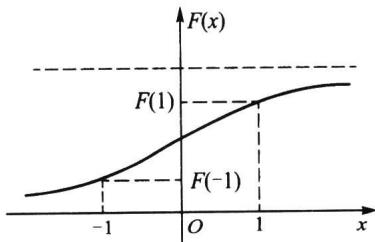  

图2.1.1 柯西分布函数

若 $X$ 服从柯西分布, 则

$$

P (- 1 \leqslant X \leqslant 1) = F (1) - F (- 1) = \frac {1}{\pi} [ \arctan (1) - \arctan (- 1) ] = \frac {1}{\pi} \left[ \frac {\pi}{4} - \left(- \frac {\pi}{4}\right) \right] = \frac {1}{2}.

$$
</Example>

## 2.1.3 离散随机变量的概率分布列

对离散随机变量而言,常用以下定义的分布列来表示其分布.

<Knowledge title="定义 2.1.3">
设 X 是一个离散随机变量, 如果 X 的所有可能取值是 $x_{1}, x_{2}, \cdots, x_{n}, \cdots$ , 则称 X 取 $x_{i}$ 的概率

$$

p _ {i} = p (x _ {i}) = P (X = x _ {i}), i = 1, 2, \dots , n, \dots\tag{2.1.2}

$$

为 X 的概率分布列或简称为分布列, 记为 $X \sim \{p_{i}\}$ .

分布列也可用如下列表方式来表示：

<table><tr><td>X</td><td> $x_{1}$ </td><td> $x_{2}$ </td><td>...</td><td> $x_{n}$ </td><td>...</td></tr><tr><td>P</td><td> $p(x_{1})$ </td><td> $p(x_{2})$ </td><td>...</td><td> $p(x_{n})$ </td><td>...</td></tr></table>

或记成

$$

\left( \begin{array}{c c c c c} x _ {1} & x _ {2} & \dots & x _ {n} & \dots \\ p (x _ {1}) & p (x _ {2}) & \dots & p (x _ {n}) & \dots \end{array} \right)

$$

第一章中我们已见过多个分布列,不同的离散随机变量可能有不同的分布列,甚至在一个样本空间上可以定义几个服从不同分布列的随机变量,这要看我们的研究需要,下面就是在同一样本空间上给出几个不同随机变量的具体例子.
</Knowledge>

<Example title="例 2.1.3">
掷两颗骰子, 其样本空间 $\Omega$ 含有 36 个等可能的样本点

$$

\Omega = \{(x, y): x, y = 1, 2, \dots , 6 \}.

$$

在 $\Omega$ 上定义如下3个随机变量 $X, Y$ 和 $Z$ :

\- $X$ 为点数之和, 其可能取值为 $2,3,\cdots,12$ 等共 11 个值, 其定义见图2.1.2(a).

\- $Y$ 为6点的骰子个数, 其可能取值为0,1,2等共3个值, 其定义见图2.1.2(b).

\- Z 为最大点数, 其可能取值为 $1,2,\cdots,6$ 等共 6 个值, 其定义见图 2.1.2(c).

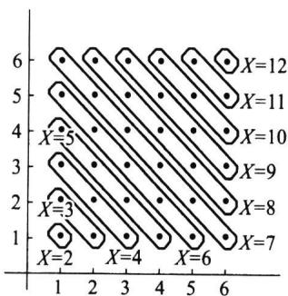  

(a) 点数之和 $X$ 的定义

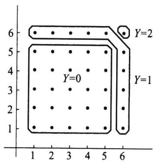  

(b) 6点的个数 $Y$ 的定义

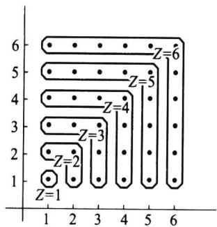  

(c) 最大点数 $Z$ 的定义  

图2.1.2 同一样本空间上不同随机变量

这三个随机变量的分布列可用古典方法算得如下：

<table><tr><td>X</td><td>2</td><td>3</td><td>4</td><td>5</td><td>6</td><td>7</td><td>8</td><td>9</td><td>10</td><td>11</td><td>12</td></tr><tr><td>P</td><td> $\frac{1}{36}$ </td><td> $\frac{2}{36}$ </td><td> $\frac{3}{36}$ </td><td> $\frac{4}{36}$ </td><td> $\frac{5}{36}$ </td><td> $\frac{6}{36}$ </td><td> $\frac{5}{36}$ </td><td> $\frac{4}{36}$ </td><td> $\frac{3}{36}$ </td><td> $\frac{2}{36}$ </td><td> $\frac{1}{36}$ </td></tr><tr><td>Y</td><td>0</td><td>1</td><td>2</td><td></td><td></td><td></td><td></td><td></td><td></td><td></td><td></td></tr><tr><td>P</td><td> $\frac{25}{36}$ </td><td> $\frac{10}{36}$ </td><td> $\frac{1}{36}$ </td><td></td><td></td><td></td><td></td><td></td><td></td><td></td><td></td></tr><tr><td>Z</td><td>1</td><td>2</td><td>3</td><td>4</td><td>5</td><td>6</td><td></td><td></td><td></td><td></td><td></td></tr><tr><td>P</td><td> $\frac{1}{36}$ </td><td> $\frac{3}{36}$ </td><td> $\frac{5}{36}$ </td><td> $\frac{7}{36}$ </td><td> $\frac{9}{36}$ </td><td> $\frac{11}{36}$ </td><td></td><td></td><td></td><td></td><td></td></tr></table>

类似地,还可以在这个样本空间上定义其他的离散随机变量.
</Example>

<Knowledge title="性质 2.1.1">
分布列的基本性质

(1) 非负性 $p(x_{i}) \geqslant 0, i = 1, 2, \cdots.$

(2) 正则性 $\sum_{i=1}^{\infty} p(x_{i}) = 1.$

以上两条基本性质是分布列必须具有的性质,也是判别某个数列是否能成为分布列的充要条件.

由离散随机变量 $X$ 的分布列很容易写出 $X$ 的分布函数

$$

F (x) = \sum_ {x _ {i} \leqslant x} p (x _ {i}).

$$

它的图形是有限级(或可列无穷级)的阶梯函数,具体见下面的例子.不过在离散场合,常用来描述其分布的是分布列,很少用到分布函数.因为求离散随机变量 X 的有关事件的概率时,用分布列比用分布函数来得更方便.
</Knowledge>

<Example title="例 2.1.4">
设离散随机变量 $X$ 的分布列为

<table><tr><td>X</td><td>-1</td><td>2</td><td>3</td></tr><tr><td>P</td><td>0.25</td><td>0.5</td><td>0.25</td></tr></table>

试求 $P(X \leqslant 0.5), P(1.5 < X \leqslant 2.5)$ ，并写出 $X$ 的分布函数。

<Solution title="解">
$$

P (X \leqslant 0. 5) = P (X = - 1) = 0. 2 5,

$$

$$

P (1. 5 <   X \leqslant 2. 5) = P (X = 2) = 0. 5,

$$

$$

F (x) = \left\{ \begin{array}{l l} 0, & x <   - 1, \\ 0. 2 5, & - 1 \leqslant x <   2, \\ 0. 2 5 + 0. 5 = 0. 7 5, & 2 \leqslant x <   3, \\ 0. 2 5 + 0. 5 + 0. 2 5 = 1, & x \geqslant 3. \end{array} \right.

$$

$F(x)$ 的图形如图 2.1.3 所示, 它是一条阶梯形的曲线, 在 X 的可能取值 -1, 2, 3 处有右连续的跳跃点, 其跳跃度分别为 X 在其可能取值点的概率: 0.25, 0.5, 0.25.

特别,常量 c 可看作仅取一个值的随机变量 X, 即

$$

P (X = c) = 1.

$$

这个分布常称为单点分布或退化分布,它的分布函数是

$$

F (x) = \left\{ \begin{array}{l l} 0, & x <   c, \\ 1, & x \geqslant c. \end{array} \right.\tag{2.1.3}

$$

其图形如图 2.1.4 所示.

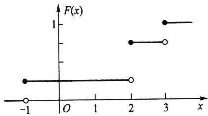  

图 2.1.3 离散随机变量的分布函数

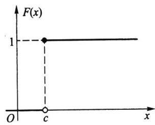  

图2.1.4 单点分布函数

以下例子说明:在具体求离散随机变量 X 的分布列时,关键是求出 X 的所有可能取值及取这些值的概率.
</Solution>
</Example>

<Example title="例 2.1.5">
一汽车沿一街道行驶,需要经过 3 个设有红绿信号灯的路口,若设每个信号灯显示红绿两种信号的时间相等,且各个信号灯工作相互独立.以 X 表示该汽车首次遇到红灯前已通过的路口数.试求 X 的概率分布列.

<Solution title="解">
由题设可知, X 的可能取值为 0, 1, 2, 3. 又记 $A_{i} =$ “汽车在第 i 个路口遇到红灯”, i = 1, 2, 3. 因为 $A_{1}, A_{2}, A_{3}$ 相互独立, 且

$$

P (A _ {i}) = P (\overline {{{A}}} _ {i}) = \frac {1}{2}, \quad i = 1, 2, 3.

$$

所以得

$$

P (X = 0) = P (A _ {1}) = \frac {1}{2},

$$

$$

P (X = 1) = P (\overline {{{A}}} _ {1} A _ {2}) = P (\overline {{{A}}} _ {1}) P (A _ {2}) = \frac {1}{4},

$$

$$

P (X = 2) = P (\overline {{{A}}} _ {1} \overline {{{A}}} _ {2} A _ {3}) = P (\overline {{{A}}} _ {1}) P (\overline {{{A}}} _ {2}) P (A _ {3}) = \frac {1}{8},

$$

$$

P (X = 3) = P (\overline {{{A}}} _ {1} \overline {{{A}}} _ {2} \overline {{{A}}} _ {3}) = P (\overline {{{A}}} _ {1}) P (\overline {{{A}}} _ {2}) P (\overline {{{A}}} _ {3}) = \frac {1}{8},

$$

故 $X$ 的分布列如下：

<table><tr><td>X</td><td>0</td><td>1</td><td>2</td><td>3</td></tr><tr><td>P</td><td>1/2</td><td>1/4</td><td>1/8</td><td>1/8</td></tr></table>
</Solution>
</Example>

## 2.1.4 连续随机变量的概率密度函数

前面我们从直观上描述了连续随机变量:一切可能取值充满某个区间 $(a,b)$ ，而在这个区间内有无穷不可列个实数,因此这类随机变量的概率分布不能再用分布列形式表示,而要改用概率密度函数表示.下面用一个例子来分析概率密度函数的由来.

<Example title="例 2.1.6">
加工机械轴的直径的测量值 X 是一个随机变量. 若我们一个接一个地测量轴的直径, 把测量值 x 一个接一个地放到数轴上去, 当累积很多测量值 x 时, 就形成一定的图形. 为了使这个图形得以稳定, 我们把纵轴由“单位长度上的频数”改为“单位长度上的频率”. 由于频率的稳定性, 随着测量值 x 的个数越多和单位长度越小, 这个图形就越稳定, 其外形就显现出一条光滑曲线 (见图 2.1.5(a)). 这时, 这条曲线的纵坐标已是“单位长度上的概率”, 当单位长度趋于 0 时, 其纵坐标就是“一点上的概率密度”. 这时, 这条曲线所表示的函数 $p(x)$ 称为概率密度函数, 它表示出 X “在一些地方 (如中部) 取值的机会大, 在另一些地方 (如两侧) 取值机会小” 的一种统计规律性. 概率密度函数 $p(x)$ 有多种形式, 有的位置不同, 有的散布不同, 有的形状不同 (见图 2.1.5(b)). 这正反映了不同随机变量的取值在统计规律性上的差别.

概率密度函数 $p(x)$ 的值虽不是概率, 但乘微分元 $\mathrm{d}x$ 就可得小区间 $(x, x + \mathrm{d}x)$ 上概率的近似值, 即

$$

p (x) \mathrm{d} x \approx P (x <   X <   x + \mathrm{d} x).

$$

在 $(a, b)$ 上很多相邻的微分元的累积就得到 $p(x)$ 在 $(a, b)$ 上的积分，这个积分值不是别的，就是 $X$ 在 $(a, b)$ 上取值的概率，即

$$

\int_ {a} ^ {b} p (x) \mathrm{d} x = P (a <   X <   b).

$$

特别，在 $(- \infty, x]$ 上 $p(x)$ 的积分就是分布函数 $F(x)$ ，即

$$

\int_ {- \infty} ^ {x} p (t) \mathrm{d} t = P (X \leqslant x) = F (x).

$$

这一关系式是连续随机变量 $X$ 的概率密度函数 $p(x)$ 最本质的属性. 这一切运算成为可能还要求 $p(x)$ 是非负可积函数. 综上所述, 可得概率密度函数 $p(x)$ 的如下严格定义.
</Example>

<Knowledge title="定义 2.1.4">
设随机变量 $X$ 的分布函数为 $F(x)$ , 如果存在实数轴上的一个非负可积函数 $p(x)$ , 使得对任意实数 $x$ 有

$$

F (x) = \int_ {- \infty} ^ {x} p (t) \mathrm{d} t,\tag{2.1.4}

$$

则称 $p(x)$ 为 $X$ 的概率密度函数, 简称为密度函数或密度. 同时称 $X$ 为连续随机变量, 称 $F(x)$ 为连续分布函数.

至此我们完成了连续随机变量及其分布的定义.从(2.1.4)式还可以看出,在 $F(x)$ 导数存在的点上有

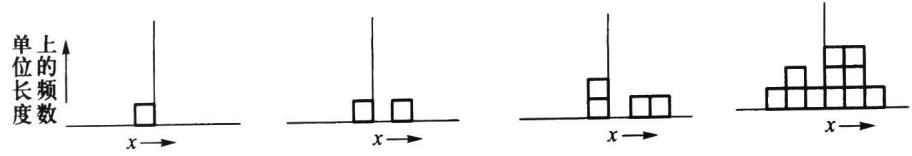

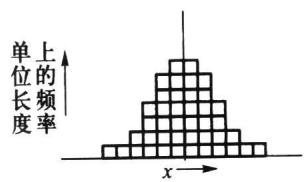

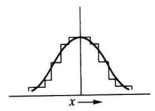

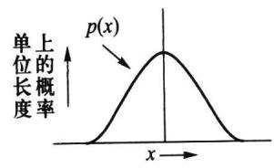  

(a) 概率密度函数 $p(x)$ 的形成过程

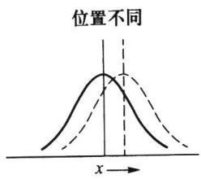

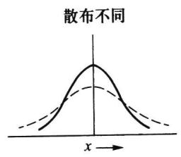  

(b) 概率密度函数 $p(x)$ 的不同形状

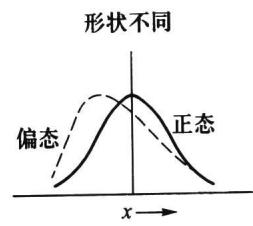  

图2.1.5

$$

F ^ {\prime} (x) = p (x).\tag{2.1.5}

$$

$F(x)$ 是(累积)概率函数,其导函数 $F'(x)$ 是概率密度函数,由此可看出 $p(x)$ 被称为概率密度函数的理由.

由(2.1.5)式,可从分布函数求得密度函数.譬如例2.1.2给出的柯西分布函数处处可导,故柯西分布的密度函数为

$$

p (x) = \frac {1}{\pi} \frac {1}{1 + x ^ {2}}, \quad - \infty <   x <   \infty .

$$
</Knowledge>

<Knowledge title="性质 2.1.2">
密度函数的基本性质

(1) 非负性 $p(x) \geqslant 0.$

(2) 正则性 $\int_{-\infty}^{\infty} p(x) \, dx = 1$ . (含有 $p(x)$ 的可积性)

以上两条基本性质是密度函数必须具有的性质,也是确定或判别某个函数是否成为密度函数的充要条件.譬如已知某个函数 $p(x)$ 为密度函数,若 $p(x)$ 中有一个待定常数,则可利用正则性 $\int_{-\infty}^{\infty}p(x)\mathrm{d}x=1$ 来确定该常数.
</Knowledge>

<Example title="例 2.1.7">
向区间 $(0,a)$ 上任意投点,用 X 表示这个点的坐标.设这个点落在 $(0,a)$ 中任一小区间的概率与这个小区间的长度成正比,而与小区间位置无关.求 X 的分布函数和密度函数.

<Solution title="解">
记 $X$ 的分布函数为 $F(x)$ , 则

当 $x < 0$ 时，因为 $\{X \leqslant x\}$ 是不可能事件，所以 $F(x) = P(X \leqslant x) = 0$

当 $x \geqslant a$ 时，因为 $\{X \leqslant x\}$ 是必然事件，所以 $F(x) = P(X \leqslant x) = 1$ ；

当 $0 \leqslant x < a$ 时，有 $F(x) = P(X \leqslant x) = P(0 \leqslant X \leqslant x) = kx$ ，其中 $k$ 为比例系数。因为 $1 = F(a) = ka$ ，所以得 $k = 1 / a$ 。

于是 $X$ 的分布函数为

$$

F (x) = \left\{ \begin{array}{l l} 0, & x <   0, \\ \frac {x}{a}, & 0 \leqslant x <   a, \\ 1, & x \geqslant a. \end{array} \right.

$$

下面求 X 的密度函数 $p(x)$ .

当 x&lt;0 或 x>a 时， $p(x)=F'(x)=0$ ;

当 0 &lt; x &lt; a 时, $p(x) = F'(x) = 1/a$ ,

而在 $x = 0$ 和 $x = a$ 处， $p(x)$ 可取任意值，一般就近取值为宜，这不会影响概率（积分）的计算。于是 $X$ 的密度函数为

$$

p (x) = \left\{ \begin{array}{l l} \frac {1}{a}, & 0 <   x <   a, \\ 0, & \text {其他}. \end{array} \right.

$$

这个分布就是区间 $(0, a)$ 上的均匀分布，记为 $U(0, a)$ ，其密度函数 $p(x)$ 和分布函数 $F(x)$ 的图形见图2.1.6.

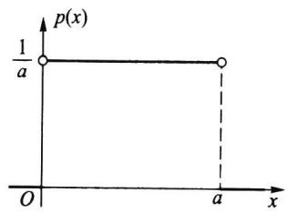  

(a) $p(x)$ 的图形

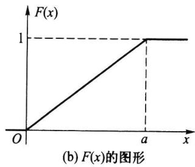  

图2.1.6 $(0,a)$ 上的均匀分布

其实此例就是第一章中所说的几何概率,这也建立了几何概率与均匀分布的联系.下面我们再给出一些连续随机变量的例子.
</Solution>
</Example>

<Example title="例 2.1.8">
某种型号电子元件的寿命 $X$ （以小时计）具有以下的概率密度函数

$$

p (x) = \left\{ \begin{array}{l l} \frac {1 0 0 0}{x ^ {2}}, & x > 1 0 0 0, \\ 0, & \text {其他}. \end{array} \right.

$$

现有一大批此种元件(设各元件工作相互独立),问:

(1) 任取 1 只, 其寿命大于 1500 小时的概率是多少?

(2) 任取 4 只, 4 只寿命都大于 1500 小时的概率是多少?

(3) 任取 4 只, 4 只中至少有 1 只寿命大于 1500 小时的概率是多少?

（4）若已知一只元件的寿命大于1500小时，则该元件的寿命大于2000小时的概率是多少？

<Solution title="解">
先计算 $X$ 的分布函数，

$$

F (x) = \int_ {1 0 0 0} ^ {x} p (t) \mathrm{d} t = - \frac {1 0 0 0}{t} \Bigg | _ {1 0 0 0} ^ {x} = 1 - \frac {1 0 0 0}{x}, \quad x > 1 0 0 0.

$$

(1) $P(X > 1500) = 1 - F(1500) = 1 - \left(1 - \frac{2}{3}\right) = \frac{2}{3}.$

(2) 各元件工作独立, 因此所求概率为

$P(4$ 只元件寿命都大于 $1500) = [P(X > 1500)]^4 = [1 - F(1500)]^4 = \left(\frac{2}{3}\right)^4 = \frac{16}{81}.$

(3) 所求概率为

$$

\begin{array}{r l} & P (4 \text {只中至少有} 1 \text {只寿命大于} 1 5 0 0) \\ & = 1 - P (4 \text {只元件寿命都小于等于} 1 5 0 0) \\ & = 1 - [ F (1 5 0 0) ] ^ {4} \\ & = 1 - \left(1 - \frac {2}{3}\right) ^ {4} = \frac {8 0}{8 1}. \end{array}

$$

(4) 这是求条件概率 $P(X>2\ 000|X>1\ 500)$ ，记

$$

A = \{X > 1 5 0 0 \}, B = \{X > 2 0 0 0 \}.

$$

因为 $P(A) = 2 / 3, P(B) = 1 / 2$ ，且 $B \subset A$ ，所以

$$

P (B \mid A) = \frac {P (A B)}{P (A)} = \frac {P (B)}{P (A)} = \frac {3}{4}.

$$

以下我们对密度函数与分布列的异同点作一些说明.

在离散随机变量场合，

$$

P (a <   X \leqslant b) = \sum_ {a <   x _ {i} \leqslant b} p (x _ {i}),

$$

其中诸 $x_{i}$ 为 $X$ 的可能取值.

而在连续随机变量场合，

$$

P (a <   X \leqslant b) = \int_ {a} ^ {b} p (x) \mathrm{d} x,

$$

其含义为图 2.1.7 中区间 $(a,b]$ 上的曲边梯形面积.

从这个意义上讲,概率密度函数与概率分布列所起的作用是类似的,但它们之间的差别也是明显的,具体有

（1）离散随机变量的分布函数 $F(x)$ 总是右连续的阶梯函数，而连续随机变量的分布函数 $F(x)$ 一定是整个数轴上的连续函数，前者已有明示，后者是因为对任意点 x 的增量 $\Delta x$ ，相应分布函数的增量总有

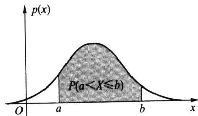  

图2.1.7 连续随机变量场合的概率

$$

F (x + \Delta x) - F (x) = \int_ {x} ^ {x + \Delta x} p (x) \mathrm{d} x \rightarrow 0 (\Delta x \rightarrow 0).

$$

(2) 离散随机变量 X 在其可能取值的点 $x_{1}, x_{2}, \cdots, x_{n}, \cdots$ 上的概率不为 0，而连续随机变量 X 在 $(-∞, ∞)$ 上任一点 a 的概率恒为 0，这是因为

$$

P (X = a) = \int_ {a} ^ {a} p (x) \mathrm{d} x = 0.

$$

这表明: 不可能事件的概率为 0, 但概率为 0 的事件 (如 $P(X = a) = 0$ ) 不一定是不可能事件. 类似地, 必然事件的概率为 1, 但概率为 1 的事件不一定是必然事件.

（3）由于连续随机变量 $X$ 仅取一点的概率恒为0，从而在事件 $\{a\leqslant X\leqslant b\}$ 中剔去 $x = a$ 或剔去 $x = b$ ，不影响其概率，即

$$

P (a \leqslant X \leqslant b) = P (a <   X \leqslant b) = P (a \leqslant X <   b) = P (a <   X <   b).

$$

这给计算带来很大方便.而这个性质在离散随机变量场合是不存在的,在离散随机变量场合计算概率要“点点计较”.

（4）由于在若干点上改变密度函数 $p(x)$ 的值并不影响其积分的值，从而不影响其分布函数 $F(x)$ 的值，这意味着一个连续分布的密度函数不唯一。譬如在例2.1.7中，改变 $x = 0$ 和 $x = a$ 处 $p(x)$ 的值如下：

$$

p _ {1} (x) = \left\{ \begin{array}{l l} 1 / a, & 0 \leqslant x \leqslant a, \\ 0, & \text {其他}; \end{array} \right. \quad p _ {2} (x) = \left\{ \begin{array}{l l} 1 / a, & 0 <   x <   a, \\ 0, & \text {其他}, \end{array} \right.

$$

它们都是 $(0, a)$ 上均匀分布的密度函数. 但仔细考察这两个函数 $p_1(x)$ 和 $p_2(x)$ , 可以发现

$$

P (p _ {1} (x) \neq p _ {2} (x)) = P (X = 0) + P (X = a) = 0.

$$

可见这两个函数在概率意义上是无差别的,在此称 $p_1(x)$ 与 $p_2(x)$ “几乎处处相等”,其意义是:在概率论中可剔去概率为0的事件后讨论两个函数相等及其他随机问题.这就是概率论与微积分不同之处,也是概率论的魅力之处.

除了离散分布和连续分布之外,还有既非离散又非连续的分布,见下例.
</Solution>
</Example>

<Example title="例 2.1.9">
以下的函数 $F(x)$ 确是一个分布, 它的图形如图 2.1.8 所示.

$$

F (x) = \left\{ \begin{array}{l l} 0, & x <   0, \\ \frac {1 + x}{2}, & 0 \leqslant x <   1, \\ 1, & x \geqslant 1. \end{array} \right.

$$

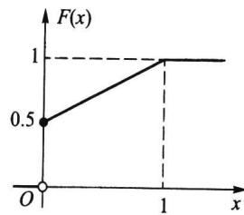  

图2.1.8 既非离散又非连续的分布函数示例

从图上可以看出:它既不是阶梯函数,又不是连续函数,所以它既非离散的又非连续的分布.它是新的一类分布,这

类分布函数 $F(x)$ 常可分解为两个分布函数的凸组合, 如例2.1.9中的分布函数可分解为

$$

F (x) = \frac {1}{2} F _ {1} (x) + \frac {1}{2} F _ {2} (x),

$$

其中

$$

F _ {1} (x) = \left\{ \begin{array}{l l} 0, & x <   0 \\ 1, & x \geqslant 0, \end{array} \right. F _ {2} (x) = \left\{ \begin{array}{l l} 0, & x <   0, \\ x, & 0 \leqslant x <   1, \\ 1, & x \geqslant 1. \end{array} \right.

$$

而 $F_{1}(x)$ 是(离散)单点分布函数， $F_{2}(x)$ 是(连续)均匀分布 $U(0,1)$ 的分布函数.

本书将不专门研究此类分布,只让大家知道山外有山,需要不断学习与研究.
</Example>

<Block title="习题2.1">
1. 口袋中有 5 个球, 编号为 1, 2, 3, 4, 5. 从中任取 3 个, 以 X 表示取出的 3 个球中的最大号码.

(1) 试求 X 的分布列；

(2) 写出 X 的分布函数, 并作图.

2. 一颗骰子抛两次, 求以下随机变量的分布列:

(1) X 表示两次所得的最小点数；

(2) Y 表示两次所得的点数之差的绝对值.

3. 口袋中有7个白球、3个黑球.

(1) 每次从中任取一个不放回, 求首次取出白球时的取球次数 X 的概率分布列;

(2) 如果取出的是黑球则不放回, 而另外放入一个白球, 求此时 X 的概率分布列.

4. 有 3 个盒子, 第一个盒子装有 1 个白球、4 个黑球; 第二个盒子装有 2 个白球、3 个黑球; 第三个盒子装有 3 个白球、2 个黑球. 现任取一个盒子, 从中任取 3 个球. 以 $X$ 表示所取到的白球数.

(1) 试求 X 的概率分布列；

(2) 取到的白球数不少于 2 个的概率是多少？

5. 掷一颗骰子 4 次, 求点数 6 出现的次数的概率分布.

6. 从一副 52 张的扑克牌中任取 5 张, 求其中黑桃张数的概率分布.

7. 一批产品共有 100 件, 其中 10 件是不合格品. 根据验收规则, 从中任取 5 件产品进行质量检验, 假如 5 件中无不合格品, 则这批产品被接收, 否则就要重新对这批产品逐个检验.

(1) 试求 5 件中不合格品数 X 的分布列；

(2) 需要对这批产品进行逐个检验的概率是多少?

8. 设随机变量 $X$ 的分布函数为

$$

F (x) = \left\{ \begin{array}{l l} 0, & x <   0, \\ 1 / 4, & 0 \leqslant x <   1, \\ 1 / 3, & 1 \leqslant x <   3, \\ 1 / 2, & 3 \leqslant x <   6, \\ 1, & x \geqslant 6. \end{array} \right.

$$

试求 $X$ 的概率分布列及 $P(X < 3), P(X \leqslant 3), P(X > 1), P(X \geqslant 1)$ .

9. 设随机变量 $X$ 的分布函数为

$$

F (x) = \left\{ \begin{array}{l l} 0, & x <   1, \\ \ln x, & 1 \leqslant x <   e, \\ 1, & x \geqslant e. \end{array} \right.

$$

试求 $P(X < 2), P(0 < X \leqslant 3), P(2 < X < 2.5)$ .

10. 若 $P(X \geqslant x_1) = 1 - \alpha, P(X \leqslant x_2) = 1 - \beta$ ，其中 $x_1 < x_2$ ，试求 $P(x_1 < X < x_2)$ .

11. 从 1,2,3,4,5 五个数中任取三个，按大小排列记为 $x_{1} < x_{2} < x_{3}$ ，令 $X = x_{2}$ ，试求：

(1) X 的分布函数；

(2) $P(X < 2)$ 及 $P(X > 4)$ .

12. 设随机变量 $X$ 的密度函数为

$$

p \left(  x  \right)   =   \left\{ \begin{array}{l l} {1   -    \mid   x    \mid  ,    -   1   \leqslant   x   \leqslant   1  ,} \\ {0  ,    \text {其他}.} \end{array} \right.

$$

试求 $X$ 的分布函数.

13. 如果随机变量 $X$ 的密度函数为

$$

p (x) = \left\{ \begin{array}{l l} x, & 0 \leqslant x <   1, \\ 2 - x, & 1 \leqslant x <   2, \\ 0, & \text {其他}. \end{array} \right.

$$

试求 $P(X \leqslant 1.5)$ .

14. 设随机变量 $X$ 的密度函数为

$$

p (x) = \left\{ \begin{array}{l l} A \cos x, & | x | \leqslant \frac {\pi}{2}, \\ 0, & | x | > \frac {\pi}{2}. \end{array} \right.

$$

试求：

(1) 系数 A;

(2) X 落在区间 $(0, \pi/4)$ 内的概率.

15. 设连续随机变量 $X$ 的分布函数为

$$

F (x) = \left\{ \begin{array}{l l} 0, & x <   0, \\ A x ^ {2}, & 0 \leqslant x <   1, \\ 1, & x \geqslant 1. \end{array} \right.

$$

试求：

(1) 系数 A;

(2) X 落在区间 $(0.3, 0.7)$ 内的概率；

(3) X 的密度函数.

16. 学生完成一道作业的时间 $X$ 是一个随机变量, 单位为小时. 它的密度函数为

$$

p \left(  x  \right)   =   \left\{ \begin{array}{l l} c x ^ {2}   +   x  , & 0 \leqslant x \leqslant 0. 5  , \\ 0  , & \text {其他}. \end{array} \right.

$$

(1) 确定常数 c;

(2) 写出 X 的分布函数；

(3) 试求在 $20 \mathrm{~min}$ 内完成一道作业的概率；

(4) 试求 $10 \mathrm{~min}$ 以上完成一道作业的概率.

17. 某加油站每周补给一次油. 如果这个加油站每周的销售量(单位: 千升)为一随机变量, 其密度函数为

$$

p \left(  x  \right) = \left\{ \begin{array}{l l} {0. 0 5   \left(  1 - \frac {x}{1 0 0}\right) ^ {4},} & {0 <   x <   1 0 0  ,} \\ {0  ,} & {\text {其他}.} \end{array} \right.

$$

试问该油站的储油罐需要多大,才能把一周内断油的概率控制在5%以下?

18. 设随机变量 $X$ 和 $Y$ 同分布, $X$ 的密度函数为

$$

p \left(  x  \right)   =   \left\{ \begin{array}{l l} { \frac {3}{8} x ^ {2}  ,    0   <     x   <     2  ,} \\ {0  ,    \text {其他}.} \end{array} \right.

$$

已知事件 $A = \{X > a\}$ 和 $B = \{Y > a\}$ 独立，且 $P(A \cup B) = 3 / 4$ ，求常数 $a$ .

19. 设连续随机变量 $X$ 的密度函数 $p(x)$ 是一个偶函数, $F(x)$ 为 $X$ 的分布函数, 求证对任意实数 $a > 0$ , 有

(1) $F(-a) = 1 - F(a) = 0.5 - \int_{0}^{a} p(x) \, \mathrm{d}x$ ;

(2) $P(|X| < a) = 2F(a) - 1$ ;

(3) $P(|X| > a) = 2[1 - F(a)]$ .
</Block>
