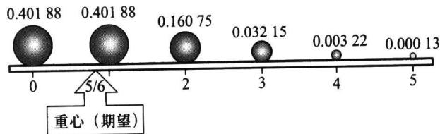

import Example from '@/components/Example.astro';
import Knowledge from '@/components/Knowledge.astro';
import Solution from '@/components/Solution.astro';
import Note from '@/components/Note.astro';
import Block from '@/components/Block.astro';

我们已经知道,每个随机变量都有一个分布(分布列、密度函数或分布函数),不同的随机变量可能拥有不同的分布,也可能拥有相同的分布.分布全面地描述了随机变量取值的统计规律性,由分布可以算出有关随机事件的概率.除此以外由分布还可以算得相应随机变量的均值、方差、分位数等特征数.这些特征数各从一个侧面描述了分布的特征.譬如,初生婴儿的体重是一个随机变量,其平均值就从一个侧面描述了体重的特征.已知随机变量的分布,如何求其均值,是本节需要研究的问题.

本节将介绍随机变量最重要的特征数:数学期望.

## 2.2.1 数学期望的概念

“期望”在我们日常生活中常指心中期盼的愿望,而在概率论中,数学期望源于历史上一个著名的分赌本问题.

<Example title="例 2.2.1">
(分赌本问题) 17 世纪中叶,一位赌徒向法国数学家帕斯卡(Pascal,1623—1662)提出一个使他苦恼长久的分赌本问题:甲、乙两赌徒赌技不相上下,各出赌注50法郎,每局中无平局.他们约定,谁先赢三局,则得全部赌本100法郎.当甲赢了二局、乙赢了一局时,因故(国王召见)要中止赌博.现问这100法郎如何分才算公平?

这个问题引起了不少人的兴趣.首先大家都认识到:平均分对甲不公平,全部归甲对乙不公平.合理的分法是,按一定的比例,甲多分些,乙少分些.所以问题的焦点在于:按怎样的比例来分?以下有两种分法:

（1）甲得 100 法郎中的 2/3, 乙得 100 法郎中的 1/3. 这是基于已赌局数: 甲赢了二局、乙赢了一局.

(2) 1654 年帕斯卡提出如下的分法: 设想再赌下去, 则甲最终所得 X 为一个随机变量, 其可能取值为 0 或 100. 再赌两局必可结束, 其结果不外乎以下四种情况之一:

$$

\mathrm{甲甲、甲乙、乙甲、乙乙}

$$

其中“甲乙”表示第一局甲胜第二局乙胜.在这四种情况中有三种可使甲获100法郎，只有一种情况(乙乙)下甲获0法郎.因为赌技不相上下，所以甲获得100法郎的可能性为3/4,获得0法郎的可能性为1/4,即X的分布列为

<table><tr><td>X</td><td>0</td><td>100</td></tr><tr><td>P</td><td>0.25</td><td>0.75</td></tr></table>

经上述分析,帕斯卡认为,甲的“期望”所得应为: $0\times0.25+100\times0.75=75$ (法郎).即甲得75法郎,乙得25法郎.这种分法不仅考虑了已赌局数,而且还包括了对再赌下去的一种“期望”,它比(1)的分法更为合理.

这就是数学期望这个名称的由来,其实这个名称称为“均值”更形象易懂.对上例而言,也就是再赌下去的话,甲“平均”可以赢75法郎.

现在我们来逐步分析如何由分布来求“均值”.

（1）算术平均 如果有 n 个数 $x_{1}, x_{2}, \cdots, x_{n}$ ，那么求这 n 个数的算术平均是很简单的事，只需将此 n 个数相加后除 n 即可.

（2）加权平均 如果这 n 个数中有相同的, 不妨设其中有 $n_{i}$ 个取值为 $x_{i}, i=1, 2, \cdots, k$ . 将其列表为

<table><tr><td>取值</td><td> $x_{1}$ </td><td> $x_{2}$ </td><td>...</td><td> $x_{k}$ </td></tr><tr><td>频数</td><td> $n_{1}$ </td><td> $n_{2}$ </td><td>...</td><td> $n_{k}$ </td></tr><tr><td>频率</td><td> $n_{1}/n$ </td><td> $n_{2}/n$ </td><td>...</td><td> $n_{k}/n$ </td></tr></table>

则其“均值”应为

$$

\frac {1}{n} \sum_ {i = 1} ^ {k} n _ {i} x _ {i} = \sum_ {i = 1} ^ {k} \frac {n _ {i}}{n} x _ {i}.

$$

其实这个加权平均的“权数” $\frac{n_{i}}{n}$ 就是出现数值 $x_{i}$ 的频率,而频率在n很大时,就稳定在其概率附近.

（3）对于一个离散随机变量 X，如果其可能取值为 $x_{1}, x_{2}, \cdots, x_{n}$ . 若将这 n 个数相加后除 n 作为“均值”，则肯定是不妥的. 其原因在于 X 取各个值的概率一般是不同的，概率大的出现的机会就大，则在计算中其权也应该大. 而上例分配赌本问题启示我们：用取值的概率作为一种“权数”作加权平均是十分合理的.

经以上分析,我们就可以给出数学期望的定义.
</Example>

## 2.2.2 数学期望的定义

<Knowledge title="定义 2.2.1">
设离散随机变量 $X$ 的分布列为

$$

p \left(x _ {i}\right) = P \left(X = x _ {i}\right), i = 1, 2, \dots , n, \dots .

$$

如果

$$

\sum_ {i = 1} ^ {\infty} \mid x _ {i} \mid p (x _ {i}) <   \infty ,

$$

则称

$$

E (X) = \sum_ {i = 1} ^ {\infty} x _ {i} p (x _ {i})\tag{2.2.1}

$$

为随机变量 $X$ 的数学期望, 或称为该分布的数学期望, 简称期望或均值. 若级数 $\sum_{i=1}^{\infty}|x_i|p(x_i)$ 不收敛, 则称 $X$ 的数学期望不存在.

以上定义中,要求级数绝对收敛的目的在于使数学期望唯一.因为随机变量的取值可正可负,取值次序可先可后,由无穷级数的理论知道,如果此无穷级数绝对收敛,则可保证其和不受次序变动的影响.由于有限项的和不受次序变动的影响,故取有限个可能值的随机变量的数学期望总是存在的.

连续随机变量数学期望的定义和含义完全类似于离散随机变量场合, 只要将求和改为求积分即可.
</Knowledge>

<Knowledge title="定义 2.2.2">

设连续随机变量 $X$ 的密度函数为 $p(x)$ . 如果

$$

\int_ {- \infty} ^ {\infty} | x | p (x) \mathrm{d} x <   \infty ,

$$

则称

$$

E (X) = \int_ {- \infty} ^ {\infty} x p (x) \mathrm{d} x\tag{2.2.2}

$$

为 $X$ 的数学期望, 或称为该分布 $p(x)$ 的数学期望, 简称期望或均值. 若 $\int_{-\infty}^{\infty}|x|p(x)\mathrm{d}x$ 不收敛, 则称 $X$ 的数学期望不存在.

</Knowledge>

数学期望 $E(X)$ 的物理解释是重心. 若把概率 $p(x_{i}) = P(X = x_{i})$ 看作点 $x_{i}$ 上的质量, 概率分布看作质量在 $x$ 轴上的分布, 则 $X$ 的数学期望 $E(X)$ 就是该质量分布的重心所在位置, 详见图2.2.1.

  

图 2.2.1 概率质量模型: 同时抛五颗骰子, 6 点出现个数 X 的数学期望 $E(X) = 5/6$ 就是重心所在的位置

数学期望的理论意义是深刻的,它是消除随机性的主要手段,这在本书以后各章中会清楚地看出.

数学期望在实际中应用广泛, $E(X)$ 常作为X的分布的代表(一种统计指标)参与同类指标的比较.如一盘磁带上的缺陷数有多有少,有随机性,不好比较,但多盘磁带上的平均缺陷数(期望值)可以比较,其越少越好.下面的实际例子将告诉人们数学期望应用的广泛性.

<Example title="例 2.2.2">
在一个人数为 N 的人群中普查某种疾病,为此要抽验 N 个人的血.如果将每个人的血分别检验,则共需检验 N 次.为了能减少工作量,一位统计学家提出一种方法:按 k 个人一组进行分组,把同组 k 个人的血样混合后检验,如果混合血样呈阴性反应,就说明这 k 个人的血都呈阴性反应,这 k 个人都无此疾病,因而这 k 个人只要检验 1 次就够了,相当于每个人检验 1/k 次,检验的工作量明显减少了.如果混合血样呈阳性反应,就说明这 k 个人中至少有一人的血呈阳性反应,则再对这 k 个人的血样分别进行检验,因而这 k 个人的血要检验 1+k 次,相当于每个人检验 1+1/k 次,这时增加了检验次数.假设该疾病的发病率为 p,且得此疾病相互独立.试问此种方法能否减少平均检验次数?

<Solution title="解">
令 X 为该人群中每个人需要的验血次数, 则 X 的分布列为

<table><tr><td>X</td><td>1/k</td><td>1+1/k</td></tr><tr><td>P</td><td> $(1-p)^k$ </td><td> $1-(1-p)^k$ </td></tr></table>

所以每人平均验血次数为

$$

E (X) = \frac {1}{k} (1 - p) ^ {k} + \left(1 + \frac {1}{k}\right) [ 1 - (1 - p) ^ {k} ] = 1 - (1 - p) ^ {k} + \frac {1}{k}.

$$

由此可知,只要选择 k 使

$$

1   -   (  1   -   p  ) ^ {k}   +   \frac {1}{k}   <     1 \quad \text {或} \quad (  1   -   p  ) ^ {k}   >   \frac {1}{k},

$$

就可减少验血次数,而且还可适当选择 $k$ 使 $E(X)$ 达到最小.譬如,当 $p = 0.1$ 时,对不同的 $k,E(X)$ 的值如表2.2.1所示.从表中可以看出:当 $k\geqslant 34$ 时,平均验血次数超过1,即比分别检验的工作量还大;而当 $k\leqslant 33$ 时,平均验血次数在不同程度上得到了减少,特别在 $k = 4$ 时,平均验血次数最少,验血工作量可减少 $40\%$ .

表 2.2.1 $p = {0.1}$ 时的 $E\left( X\right)$ 值

<table><tr><td>k</td><td>2</td><td>3</td><td>4</td><td>5</td><td>8</td><td>10</td><td>30</td><td>33</td><td>34</td></tr><tr><td>E(X)</td><td>0.690</td><td>0.604</td><td>0.594</td><td>0.610</td><td>0.695</td><td>0.751</td><td>0.991</td><td>0.999 4</td><td>1.001 6</td></tr></table>

我们也可以对不同的发病率 $p$ 计算出最佳的分组人数 $k_0$ ，见下表2.2.2.从表中也可以看出：发病率 $p$ 越小，则分组检验的效益越大。譬如在 $p = 0.01$ 时，若取11人为一组进行验血，则验血工作量可减少 $80\%$ 左右。这正是美国二战期间大量征兵时，对新兵验血所采用的减少工作量的措施。

表 2.2.2 不同发病率 p 时的最佳分组人数 $k_{0}$ 及其 $E(X)$

<table><tr><td> $p$ </td><td>0.14</td><td>0.10</td><td>0.08</td><td>0.06</td><td>0.04</td><td>0.02</td><td>0.01</td></tr><tr><td> $k_0$ </td><td>3</td><td>4</td><td>4</td><td>5</td><td>6</td><td>8</td><td>11</td></tr><tr><td> $E(X)$ </td><td>0.697</td><td>0.594</td><td>0.534</td><td>0.466</td><td>0.384</td><td>0.274</td><td>0.196</td></tr></table>
</Solution>
</Example>

<Example title="例 2.2.3">
每张福利彩票售价 5 元, 各有一个兑奖号. 每售出 100 万张设一个开奖组, 用摇奖器当众摇出一个 6 位数的中奖号码 (可以认为从 000 000 到 999 999 的每个数都等可能出现), 兑奖规则如下:

(1) 兑奖号与中奖号码的最后一位相同者获六等奖, 奖金 10 元.  

(2) 兑奖号与中奖号码的最后二位相同者获五等奖, 奖金 50 元.

(3) 兑奖号与中奖号码的最后三位相同者获四等奖, 奖金 500 元.  

(4) 兑奖号与中奖号码的最后四位相同者获三等奖, 奖金 5000 元.  

(5) 兑奖号与中奖号码的最后五位相同者获二等奖, 奖金 50 000 元.  

（6）兑奖号与中奖号码全部相同者获一等奖，奖金500 000元.另外规定，只领取其中最高额的奖金.试求每张彩票的平均所得奖金额  

<Solution title="解">
以 $X$ 记一张彩票的奖金额, 则 $X$ 的分布列如下:

<table><tr><td>X</td><td>500 000</td><td>50 000</td><td>5 000</td><td>500</td><td>50</td><td>10</td><td>0</td></tr><tr><td>P</td><td>0.000 001</td><td>0.000 009</td><td>0.000 09</td><td>0.000 9</td><td>0.009</td><td>0.09</td><td>0.9</td></tr></table>

所以每张彩票的平均所得为

$$

E (X) = 0. 5 + 0. 4 5 + 0. 4 5 + 0. 4 5 + 0. 4 5 + 0. 9 + 0 = 3. 2.

$$

这也意味:每一开奖组把筹得的500万元中的320万元以奖金形式返回给彩民,其余180万元则可用于福利事业及管理费用.

从这个例子也可以看出,彩票中奖与否是随机的,但一种彩票的平均所得是可以预先算出的,计算平均所得是设计一种彩票的基础.在我国,彩票发行由民政部门管理,只有当收益主要用于公益事业才被允许发行彩票.发行任一种彩票事先都要进行周密设计.
</Solution>
</Example>

<Example title="例 2.2.4">
设 X 服从区间 $(a, b)$ 上的均匀分布, 求 $E(X)$ .

<Solution title="解">
由例2.1.7知 $X$ 的密度函数为

$$

p (x) = \left\{ \begin{array}{c l} { \frac {1}{b - a},} & {a <   x <   b,} \\ {0,} & {\text {其他}.} \end{array} \right.

$$

所以

$$

E (X) = \int_ {a} ^ {b} x \cdot \frac {1}{b - a} \mathrm{d} x = \frac {1}{b - a} \cdot \frac {x ^ {2}}{2} \Bigg | _ {a} ^ {b} = \frac {a + b}{2}.

$$

这个结果是可以理解的, 因为 X 在区间 $(a, b)$ 上的取值是均匀的, 所以它的平均取值当然应该是 $(a, b)$ 的“中点”, 即 $(a + b)/2$ .
</Solution>
</Example>

<Example title="例 2.2.5">
柯西分布的数学期望不存在. 因为柯西分布的密度函数为

$$

p (x) = \frac {1}{\pi} \frac {1}{1 + x ^ {2}}, - \infty <   x <   \infty .

$$

所以由

$$

\int_ {- \infty} ^ {\infty} | x | \cdot \frac {1}{\pi} \frac {1}{1 + x ^ {2}} \mathrm{d} x = \infty ,

$$

知 $E(X)$ 不存在.
</Example>

## 2.2.3 数学期望的性质

按照随机变量 X 的数学期望 $E(X)$ 的定义, $E(X)$ 由其分布唯一确定. 若要求随机变量 X 的一个函数 $g(X)$ (仍是随机变量) 的数学期望, 当然要先求出 $Y = g(X)$ 的分布, 再用此分布来求 $E(Y)$ . 这一过程可用下面例子说明.

<Example title="例 2.2.6">
已知随机变量 X 的分布列如下:

<table><tr><td>X</td><td>-2</td><td>-1</td><td>0</td><td>1</td><td>2</td></tr><tr><td>P</td><td>0.2</td><td>0.1</td><td>0.1</td><td>0.3</td><td>0.3</td></tr></table>

要求 $Y=X^{2}$ 的数学期望,为此要分两步进行:

第一步,先求 $Y=X^{2}$ 的分布,这可从 X 的分布导出,即

<table><tr><td> $X^{2}$ </td><td> $(-2)^{2}$ </td><td> $(-1)^{2}$ </td><td> $0^{2}$ </td><td> $1^{2}$ </td><td> $2^{2}$ </td></tr><tr><td>P</td><td>0.2</td><td>0.1</td><td>0.1</td><td>0.3</td><td>0.3</td></tr></table>

然后对相等的值进行合并,并把对应的概率相加,可得

<table><tr><td> $X^{2}$ </td><td>0</td><td>1</td><td>4</td></tr><tr><td>P</td><td>0.1</td><td>0.4</td><td>0.5</td></tr></table>

第二步,利用 $X^{2}$ 的分布求 $E(X^{2})$ , 即得

$$

E (X ^ {2}) = 0 \times 0. 1 + 1 \times 0. 4 + 4 \times 0. 5 = 2. 4.

$$

假如我们用等值合并前的分布求 $E(X^2)$ ，可得相同的结果

$$

E \left(X ^ {2}\right) = (- 2) ^ {2} \times 0. 2 + (- 1) ^ {2} \times 0. 1 + 0 ^ {2} \times 0. 1 + 1 ^ {2} \times 0. 3 + 2 ^ {2} \times 0. 3 = 2. 4.

$$

这两种算法本质上是一回事,但后者的计算实质上是在 X 的分布 $(-2,-1,0,1,2)$ 基础上、而将取值改为 $((-2)^{2},(-1)^{2},0^{2},1^{2},2^{2})$ 计算出来的.由此启发我们:若进一步要求 $E(X^{3})$ 和 $E(X^{4})$ ,我们不需要先求 $X^{3}$ 的分布和 $X^{4}$ 的分布,而直接用 X 的分布来求,具体如下:

$$

E \left(X ^ {3}\right) = (- 2) ^ {3} \times 0. 2 + (- 1) ^ {3} \times 0. 1 + 0 ^ {3} \times 0. 1 + 1 ^ {3} \times 0. 3 + 2 ^ {3} \times 0. 3 = 1.

$$

$$

E (X ^ {4}) = (- 2) ^ {4} \times 0. 2 + (- 1) ^ {4} \times 0. 1 + 0 ^ {4} \times 0. 1 + 1 ^ {4} \times 0. 3 + 2 ^ {4} \times 0. 3 = 8. 4.

$$

一般场合,有如下定理.
</Example>

<Knowledge title="定理 2.2.1">
若随机变量 $X$ 的分布用分布列 $p(x_{i})$ 或用密度函数 $p(x)$ 表示，则 $X$ 的某一函数 $g(X)$ 的数学期望为

$$

E \left[ g (X) \right] = \left\{ \begin{array}{l l} { \sum_ {i} g (x _ {i}) p (x _ {i}),} & {\text {在离散场合},} \\ { \int_ {- \infty} ^ {\infty} g (x) p (x) \mathrm{d} x,} & {\text {在连续场合}.} \end{array} \right.\tag{2.2.3}

$$

这里所涉及的数学期望都假定存在.

这个定理的证明涉及更多的工具,在此省略了.现基于这个定理来证明数学期望的几个常用性质,以下均假定所涉及的数学期望是存在的.
</Knowledge>

<Knowledge title="性质 2.2.1">
若 c 是常数, 则 $E(c) = c$ .

<Solution title="证明">
如果将常数 $c$ 看作仅取一个值的随机变量 $X$ , 则有 $P(X = c) = 1$ , 从而其数学期望 $E(c) = E(X) = c \times 1 = c$ .
</Solution>
</Knowledge>

<Knowledge title="性质 2.2.2">
对任意常数 $a$ ，有

$$

E (a X) = a E (X).\tag{2.2.4}

$$

<Solution title="证明">
在(2.2.3)式中令 $g(x) = ax$ ，然后把 $a$ 从求和号或积分号中提出来即得.
</Solution>
</Knowledge>

<Knowledge title="性质 2.2.3">
对任意的两个函数 $g_{1}(x)$ 和 $g_{2}(x)$ ，有

$$

E \left[ g _ {1} (X) \pm g _ {2} (X) \right] = E \left[ g _ {1} (X) \right] \pm E \left[ g _ {2} (X) \right].\tag{2.2.5}

$$

<Solution title="证明">
在(2.2.3)式中令 $g(x) = g_{1}(x) \pm g_{2}(x)$ , 然后把和式分解成两个和式, 或把积分分解成两个积分即得.
</Solution>
</Knowledge>

<Example title="例 2.2.7">
某公司经销某种原料,根据历史资料表明:这种原料的市场需求量 X(单位:吨)服从(300,500)上的均匀分布.每售出 1 吨该原料,公司可获利 1.5(千元);若积压 1 吨,则公司损失 0.5(千元).问公司应该组织多少货源,可使平均收益最大?

<Solution title="解">
设公司组织该货源 $a$ 吨. 则显然应该有 $300 \leqslant a \leqslant 500$ . 又记 $Y$ 为在 $a$ 吨货源的条件下的收益额 (单位: 千元), 则收益额 $Y$ 为需求量 $X$ 的函数, 即 $Y = g(X)$ . 由题设条件知: 当 $X \geqslant a$ 时, 则此 $a$ 吨货源全部售出, 共获利 1.5a. 当 $X < a$ 时, 则售出 $X$ 吨 (获利 1.5X), 且还有 $a - X$ 吨积压 (获利 $-0.5(a - X)$ ), 所以共获利 $1.5X - 0.5(a - X)$ , 由此知

$$

g (X) = \left\{ \begin{array}{l l} 1. 5 a, & \text {若} X \geqslant a, \\ 1. 5 X - 0. 5 (a - X), & \text {若} X <   a \end{array} \right. = \left\{ \begin{array}{l l} 1. 5 a, & \text {若} X \geqslant a, \\ 2 X - 0. 5 a, & \text {若} X <   a. \end{array} \right.

$$

由定理2.2.1和均匀分布可得

$$

E (Y) = \int_ {- \infty} ^ {\infty} g (x) p _ {X} (x) \mathrm{d} x = \int_ {3 0 0} ^ {5 0 0} g (x) \frac {1}{2 0 0} \mathrm{d} x

$$

$$

\begin{array}{l} { = \frac {1}{2 0 0} \Big (\int_ {a} ^ {5 0 0} 1. 5 a \mathrm{d} x + \int_ {3 0 0} ^ {a} (2 x - 0. 5 a) \mathrm{d} x \Big)} \\ { = \frac {1}{2 0 0} (- a ^ {2} + 9 0 0 a - 3 0 0 ^ {2}).} \end{array}

$$

上述计算表明 $E(Y)$ 是 a 的二次函数, 用通常求极值的方法可以求得: 当 a = 450 吨时, 能使 $E(Y)$ 达到最大, 即公司应该组织货源 450 吨.
</Solution>
</Example>

<Block title="习题2.2">
1. 设离散型随机变量 $X$ 的分布列为

<table><tr><td>X</td><td>-2</td><td>0</td><td>2</td></tr><tr><td>P</td><td>0.4</td><td>0.3</td><td>0.3</td></tr></table>

试求 $E(X)$ 和 $E(3X + 5)$ .

2. 某商店根据历年销售资料得知:一位顾客在商店中消费的金额 X(百元) 的分布列为

<table><tr><td>X</td><td>0</td><td>1</td><td>2</td><td>3</td><td>4</td><td>5</td></tr><tr><td>P</td><td>0.10</td><td>0.33</td><td>0.31</td><td>0.13</td><td>0.09</td><td>0.04</td></tr></table>

试求顾客在商店的平均消费金额.

3. 某地区一个月内发生重大交通事故数 $X$ 服从如下分布：

<table><tr><td>X</td><td>0</td><td>1</td><td>2</td><td>3</td><td>4</td><td>5</td><td>6</td></tr><tr><td>P</td><td>0.301</td><td>0.362</td><td>0.216</td><td>0.087</td><td>0.026</td><td>0.006</td><td>0.002</td></tr></table>

试求该地区发生重大交通事故的月平均数.

4. 一海运货船的甲板上放着20个装有化学原料的圆桶, 现已知其中有5桶被海水污染了. 若从中随机抽取8桶, 记 $X$ 为8桶中被污染的桶数, 试求 $X$ 的分布列, 并求 $E(X)$ .

5. 用天平称某种物品的质量(砝码仅允许放在一个盘中), 现有三组砝码(单位:g):(甲)1,2,2,5,10;(乙)1,2,3,4,10;(丙)1,1,2,5,10,称重时只能使用一组砝码.问:若物品的质量为 $1\mathrm{g}, 2\mathrm{g}, \cdots, 10\mathrm{g}$ 的概率是相同的, 用哪一组砝码称重所用的平均砝码数最少?

6. 假设有十只同种电器元件, 其中有两只不合格品. 装配仪器时, 从这批元件中任取一只, 如是不合格品, 则扔掉重新任取一只; 如仍是不合格品, 则扔掉再取一只, 试求在取到合格品之前, 已取出的不合格品只数的数学期望.

7. 对一批产品进行检查, 如查到第 $a$ 件全为合格品, 就认为这批产品合格; 若在前 $a$ 件中发现不合格品即停止检查, 且认为这批产品不合格. 设产品的数量很大, 可认为每次查到不合格品的概率都是 $p$ . 问每批产品平均要查多少件?

8. 某人参加“答题秀”，一共有问题1和问题2两个问题，他可以自行决定回答这两个问题的顺序。如果他先回答问题 $i (i = 1,2)$ ，那么只有回答正确，他才被允许回答另一题。如果他有 $60\%$ 的把握答对问题1，而答对问题1将获得200元奖励；有 $80\%$ 的把握答对问题2，而答对问题2将获得100元奖励。问他应该先回答哪个问题，才能使获得奖励的期望值最大？

9. 某人想用 10 000 元投资于某股票,该股票当前的价格是 2 元/股,假设一年后该股票等可能地为 1 元/股和 4 元/股.而理财顾问给他的建议是:若期望一年后所拥有的股票市值达到最大,则现在就购买;若期望一年后所拥有的股票数量达到最大,则一年以后购买.试问理财顾问的建议是否正

确？为什么？

10. 保险公司的某险种规定: 如果某个事件 A 在一年内发生了, 则保险公司应付给投保户金额 a 元, 而事件 A 在一年内发生的概率为 p. 如果保险公司向投保户收取的保费为 ka, 则问 k 为多少, 才能使保险公司期望收益达到 a 的 10%?

11. 某厂推土机发生故障后的维修时间 $T$ 是一个随机变量(单位:h)，其密度函数为

$$

p (t) = \left\{ \begin{array}{l l} 0. 0 2 e ^ {- 0. 0 2 t}, & t > 0, \\ 0, & t \leqslant 0, \end{array} \right.

$$

试求平均维修时间.

12. 某新产品在未来市场上的占有率 $X$ 是在区间 $(0,1)$ 上取值的随机变量, 它的密度函数为

$$

p \left(  x  \right)   =   \left\{ \begin{array}{l l} {4 \left(  1   -   x  \right) ^ {3},} & {0   <     x   <     1  ,} \\ {0  ,} & {\text {其他}  ,} \end{array} \right.

$$

试求平均市场占有率.

13. 设随机变量 $X$ 的密度函数如下, 试求 $E(2X + 5)$ .

$$

p (x) = \left\{ \begin{array}{l l} \mathrm{e} ^ {- x}, & x > 0, \\ 0, & x \leqslant 0. \end{array} \right.

$$

14. 设随机变量 X 的分布函数如下, 试求 $E(X)$ .

$$

F (x) = \left\{ \begin{array}{l l} \frac {\mathrm{e} ^ {x}}{2}, & x <   0, \\ \frac {1}{2}, & 0 \leqslant x <   1, \\ 1 - \frac {1}{2} \mathrm{e} ^ {- \frac {1}{2} (x - 1)}, & x \geqslant 1. \end{array} \right.

$$

15. 设随机变量 $X$ 的密度函数为

$$

p \left(  x  \right) = \left\{ \begin{array}{l l} a + b x ^ {2}  , & 0 \leqslant x \leqslant 1  , \\ 0  , & \text {其他}  , \end{array} \right.

$$

如果 $E(X) = \frac{2}{3}$ , 求 $a$ 和 $b$ .

16. 某工程队完成某项工程的时间 $X$ (单位: 月) 是一个随机变量, 它的分布列为

<table><tr><td>X</td><td>10</td><td>11</td><td>12</td><td>13</td></tr><tr><td>P</td><td>0.4</td><td>0.3</td><td>0.2</td><td>0.1</td></tr></table>

(1) 试求该工程队完成此项工程的平均月数；

(2) 设该工程队所获利润为 $Y=50(13-X)$ ，单位为万元，试求工程队的平均利润；

(3) 若该工程队调整安排, 完成该项工程的时间 $X_{1}$ (单位: 月) 的分布为

<table><tr><td> $X_1$ </td><td>10</td><td>11</td><td>12</td></tr><tr><td>P</td><td>0.5</td><td>0.4</td><td>0.1</td></tr></table>

则其平均利润可增加多少？

17. 设随机变量 $X$ 的概率密度函数为

$$

p \left(  x  \right)   =   \left\{ \begin{array}{l l} { \frac {1}{2} \mathrm{cos}    \frac {x}{2}  ,} & {0 \leqslant x \leqslant \pi  ,} \\ {0  ,} & {\text {其他}  ,} \end{array} \right.

$$

对 $X$ 独立重复观察4次， $Y$ 表示观察值大于 $\pi / 3$ 的次数，求 $Y^2$ 的数学期望.

18. 设随机变量 $X$ 的密度函数为

$$

p \left(  x  \right)   =   \left\{ \begin{array}{l l} { \frac {3}{8} x ^ {2}  ,} & {0 <   x <   2  ,} \\ {0  ,} & {\text {其他}  ,} \end{array} \right.

$$

试求 $\frac{1}{X^{2}}$ 的数学期望.

19. 设 $X$ 为仅取非负整数的离散随机变量, 若其数学期望存在, 证明:

(1) $E(X) = \sum_{k=1}^{\infty} P(X \geqslant k)$ ;

(2) $\sum_{k=0}^{\infty} kP(X > k) = \frac{1}{2}(E(X^2) - E(X))$ .

20. 设连续随机变量 X 的分布函数为 $F(x)$ ，且数学期望存在，证明：

$$

E (X) = \int_ {0} ^ {\infty} [ 1 - F (x) ] \mathrm{d} x - \int_ {- \infty} ^ {0} F (x) \mathrm{d} x.

$$

21. 设 $X$ 为非负连续随机变量, 若 $E(X^n)$ 存在, 试证明:

(1) $E(X) = \int_{0}^{\infty}P(X > x)\mathrm{d}x;$

(2) $E(X^n) = \int_0^\infty nx^{n - 1}P(X > x)\mathrm{d}x.$
</Block>
