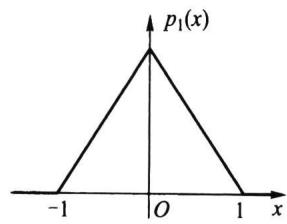
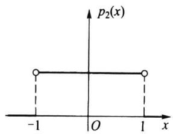
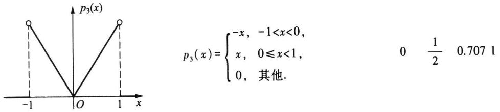

import Example from '@/components/Example.astro';
import Knowledge from '@/components/Knowledge.astro';
import Solution from '@/components/Solution.astro';
import Note from '@/components/Note.astro';
import Block from '@/components/Block.astro';

随机变量 X 的数学期望 $E(X)$ 是分布的一种位置特征数, 它刻画了 X 的取值总在 $E(X)$ 周围波动. 但这个位置特征数无法反映出随机变量取值的“波动大小”, 譬如 X 与 Y 的分布列分别为

<table><tr><td>X</td><td>-1</td><td>0</td><td>1</td></tr><tr><td>P</td><td>1/3</td><td>1/3</td><td>1/3</td></tr></table>

尽管它们的数学期望都是0,但显然Y取值的波动要比X取值的波动大.如何用数值来反映随机变量取值的“波动”大小,是本节要研究的问题.而以下定义的方差与标准差正是度量此种波动大小的最重要的两个特征数.

## 2.3.1 方差与标准差的定义

设随机变量 X 的均值为 $a=E(X)$ ，X 的取值当然不一定恰好是 a，会有偏离。偏离的量 X-a 有正有负，为了不使正负偏离彼此抵消，我们一般考虑 $(X-a)^{2}$ ，而不去考虑数学上难以处理的绝对值 $|X-a|$ 。因为 $(X-a)^{2}$ 仍是一个随机变量，所以取其均值 $E(X-a)^{2}$ 就可以刻画 X 的“波动”程度，这个量被称作 X 的方差，其定义如下：

<Knowledge title="定义 2.3.1">

若随机变量 $X^{2}$ 的数学期望 $E(X^{2})$ 存在，则称偏差平方 $(X - E(X))^{2}$ 的数学期望 $E(X - E(X))^{2}$ 为随机变量 X（或相应分布）的方差，记为

$\operatorname{Var}(X) = E(X - E(X))^2$

$$

= \left\{ \begin{array}{l l} { \sum_ {i} \left(x _ {i} - E (X)\right) ^ {2} p (x _ {i}),} & {\text {在离散场合},} \\ { \int_ {- \infty} ^ {\infty} \left(x - E (X)\right) ^ {2} p (x) \mathrm{d} x,} & {\text {在连续场合}.} \end{array} \right.\tag{2.3.1}

$$

称方差的正平方根 $\sqrt{\operatorname{Var}(X)}$ 为随机变量X（或相应分布）的标准差，记为 $\sigma(X)$ ，或 $\sigma_{X}$ .

</Knowledge>

方差与标准差的功能相似,它们都是用来描述随机变量取值的集中与分散程度(即散布大小)的两个特征数.方差与标准差愈小,随机变量的取值愈集中;方差与标准差愈大,随机变量的取值愈分散.

方差与标准差之间的差别主要在量纲上,由于标准差与所讨论的随机变量、数学期望有相同的量纲,其加减 $E(X) \pm k\sigma(X)$ 是有意义的(k 为正实数),所以在实际中,人们比较乐意选用标准差,但标准差的计算必须通过方差才能算得.

另外要指出的是:如果随机变量 X 的数学期望存在,其方差不一定存在;而当 X 的方差存在时,则 $E(X)$ 必定存在,其原因在于 $|x| \leqslant x^{2} + 1$ 总是成立的.

<Example title="例 2.3.1">
图 2.3.1 上有三个分布: 三角分布、均匀分布和倒三角分布的密度函数及它们的图形. 从图上可以看出, 这三个分布都位于区间 $(-1, 1)$ 上, 并且关于纵轴对称, 从而得知这三个分布的期望均为 0. 但它们的方差不等 (因此标准差也不等), 这可分别由各自的分布 (见图 2.3.1) 算得

$$

\begin{array}{r l} & {\mathrm{Var} (X _ {1}) = E (X _ {1} ^ {2}) = \int_ {- 1} ^ {0} x ^ {2} (1 + x) \mathrm{d} x + \int_ {0} ^ {1} x ^ {2} (1 - x) \mathrm{d} x = \frac {1}{6}.} \\ & {\mathrm{Var} (X _ {2}) = E (X _ {2} ^ {2}) = \int_ {- 1} ^ {1} \frac {x ^ {2}}{2} \mathrm{d} x = \frac {1}{3}.} \\ & {\mathrm{Var} (X _ {3}) = E (X _ {3} ^ {2}) = \int_ {- 1} ^ {0} x ^ {2} (- x) \mathrm{d} x + \int_ {0} ^ {1} x ^ {2} \cdot x \mathrm{d} x = \frac {1}{2}.} \end{array}

$$

这些计算结果与我们对分布的直观认识是一致的.在这三个分布中,三角分布的概率在中间较为集中,故方差最小;而倒三角分布的概率大多分散在两侧,故方差最大;均匀分布介于其中,故方差也介于其中.我们将三个分布的数学期望、方差和标准差都列于图2.3.1的相应分布的右侧,以供比较.

1. 三角分布

期望 方差 标准差

$$

p _ {1} (x) = \left\{ \begin{array}{l l} 1 + x, & - 1 <   x <   0, \\ 1 - x, & 0 \leqslant x <   1, \\ 0, & \text {其他}. \end{array} \right.

$$

0 $\frac{1}{6}$ 0.4082

2. 均匀分布

$$

p _ {2} (x) = \left\{ \begin{array}{l l} \frac {1}{2}, & - 1 <   x <   1, \\ 0, & \text {其他}. \end{array} \right.

$$

$$

0 \quad \frac {1}{3} \quad 0. 5 7 7 4

$$

</Example>

## 3. 倒三角分布

0 $\frac{1}{2}$ 0.707 1

图2.3.1 比较三个分布的方差与标准差  

<Example title="例 2.3.2">
某人有一笔资金, 可投入两个项目: 房地产和商业, 其收益都与市场状态有关. 若把未来市场划分为好、中、差三个等级, 其发生的概率分别为 0.2、0.7、0.1. 通过调查, 该投资者认为投资于房地产的收益 X (万元) 和投资于商业的收益 Y (万元) 的分布分别为

<table><tr><td>X</td><td>11</td><td>3</td><td>-3</td></tr><tr><td>P</td><td>0.2</td><td>0.7</td><td>0.1</td></tr></table>

请问:该投资者如何投资为好?

<Solution title="解">
我们先考察数学期望(平均收益)

$$

\begin{array}{r l} & {E (X) = 1 1 \times 0. 2 + 3 \times 0. 7 + (- 3) \times 0. 1 = 4. 0 (\text {万元})  ,} \\ & {E (Y) = 6 \times 0. 2 + 4 \times 0. 7 + (- 1) \times 0. 1 = 3. 9 (\text {万元})  .} \end{array}

$$

从平均收益看,投资房地产收益大,可比投资商业多收益0.1万元.下面我们再来计算它们各自的方差

$$

\begin{array}{r l} \operatorname{Var} (X) & = (1 1 - 4) ^ {2} \times 0. 2 + (3 - 4) ^ {2} \times 0. 7 + (- 3 - 4) ^ {2} \times 0. 1 = 1 5. 4, \\ \operatorname{Var} (Y) & = (6 - 3. 9) ^ {2} \times 0. 2 + (4 - 3. 9) ^ {2} \times 0. 7 + (- 1 - 3. 9) ^ {2} \times 0. 1 = 3. 2 9, \end{array}

$$

及标准差

$$

\sigma (X) = \sqrt {1 5 . 4} = 3. 9 2, \sigma (Y) = \sqrt {3 . 2 9} = 1. 8 1.

$$

因为标准差(方差也一样)愈大,则收益的波动大,从而风险也大.资金投向何处不仅要看平均收益多少,还要看风险大小.在这里从标准差看,投资房地产的风险比投资商业的风险大一倍多.若综合权衡收益与风险,该投资者还是选择投资商业为宜,虽然平均收益少0.1万元,但风险要小一半以上.
</Solution>
</Example>

## 2.3.2 方差的性质

以下均假定随机变量的方差是存在的.

<Knowledge title="性质 2.3.1">
$\operatorname{Var}(X) = E(X^2) - [E(X)]^2.$

<Solution title="证明">
因为

$$

\operatorname{Var} (X) = E (X - E (X)) ^ {2} = E \left(X ^ {2} - 2 X \cdot E (X) + (E (X)) ^ {2}\right),

$$

由数学期望的性质 2.2.3 可得

$$

\operatorname{Var} (X) = E \left(X ^ {2}\right) - 2 E (X) \cdot E (X) + (E (X)) ^ {2} = E \left(X ^ {2}\right) - (E (X)) ^ {2}.

$$

在实际计算方差时,这个性质往往比定义 $\mathrm{Var}(X)=E(X-E(X))^{2}$ 更常用.
</Solution>
</Knowledge>

<Knowledge title="性质 2.3.2">
常数的方差为 0, 即 $\mathrm{Var}(c)=0$ , 其中 c 是常数.

<Solution title="证明">
若 $c$ 是常数, 则

$$

\operatorname{Var} (c) = E (c - E (c)) ^ {2} = E (c - c) ^ {2} = 0.

$$
</Solution>
</Knowledge>

<Knowledge title="性质 2.3.3">
若 a, b 是常数，则 $\mathrm{Var}(aX+b)=a^{2}\mathrm{Var}(X)$ .

<Solution title="证明">
因 $a, b$ 是常数, 则

$$

\operatorname{Var} (a X + b) = E (a X + b - E (a X + b)) ^ {2} = E (a (X - E (X))) ^ {2} = a ^ {2} \operatorname{Var} (X).

$$

另外从 $\operatorname{Var}(X) = E(X^2) - [E(X)]^2 \geqslant 0$ 很容易看出: 若 $E(X^2) = 0$ , 则 $E(X) = 0$ , 且 $\operatorname{Var}(X) = 0$ .
</Solution>
</Knowledge>

<Example title="例 2.3.3">
设 X 为掷一颗骰子出现的点数, 试求 Var(X).

<Solution title="解">
$$

E (X) = \frac {1}{6} (1 + 2 + 3 + 4 + 5 + 6) = \frac {7}{2},

$$

$$

E (X ^ {2}) = \frac {1}{6} (1 ^ {2} + 2 ^ {2} + 3 ^ {2} + 4 ^ {2} + 5 ^ {2} + 6 ^ {2}) = \frac {9 1}{6},

$$

$$

\operatorname{Var} (X) = \frac {9 1}{6} - \frac {4 9}{4} = \frac {3 5}{1 2} = 2. 9 1 7.

$$
</Solution>
</Example>

## 2.3.3 切比雪夫不等式

下面给出概率论中一个重要的基本不等式.

<Knowledge title="定理 2.3.1">
(切比雪夫(Chebyshev,1821—1894)不等式) 设随机变量 X 的数学期望和方差都存在,则对任意常数 $\varepsilon > 0$ ,有

$$

P (  |   X - E (X)   |   \geqslant   \varepsilon  )   \leqslant   \frac {\mathrm{Var} (  X  )}{\varepsilon^ {2}}  ,\tag{2.3.2}

$$

或

$$

P (\mid X - E (X) \mid <   \varepsilon) \geqslant 1 - \frac {\mathrm{Var} (X)}{\varepsilon^ {2}}.\tag{2.3.3}

$$

<Solution title="证明">
设 $X$ 是一个连续随机变量, 其密度函数为 $p(x)$ . 记 $E(X) = a$ , 我们有

$$

\begin{array}{r l} P (| X - a | \geqslant \varepsilon) & = \int_ {\{x: | x - a | \geqslant \varepsilon \}} p (x) \mathrm{d} x \leqslant \int_ {\{x: | x - a | \geqslant \varepsilon \}} \frac {(x - a) ^ {2}}{\varepsilon^ {2}} p (x) \mathrm{d} x \\ & \leqslant \frac {1}{\varepsilon^ {2}} \int_ {- \infty} ^ {\infty} (x - a) ^ {2} p (x) \mathrm{d} x = \frac {\operatorname{Var} (X)}{\varepsilon^ {2}}. \end{array}

$$

由此知(2.3.2)式对连续随机变量成立,对于离散随机变量亦可类似进行证明.

在概率论中,事件 $\{|X-E(X)|\geqslant\varepsilon\}$ 称为大偏差,其概率 $P(|X-E(X)|\geqslant\varepsilon)$ 称为大偏差发生概率.切比雪夫不等式给出大偏差发生概率的上界,这个上界与方差成正比,方差愈大上界也愈大.

以下定理进一步说明了方差为 0 就意味着随机变量的取值几乎集中在一点上.
</Solution>
</Knowledge>

<Knowledge title="定理 2.3.2">
若随机变量 X 的方差存在, 则 $\operatorname{Var}(X)=0$ 的充要条件是 X 几乎处处为某个常数 a, 即 $P(X=a)=1$ .

<Solution title="证明">
充分性是显然的,下面证必要性.设 $\operatorname{Var}(X)=0$ , 这时 $E(X)$ 存在.因为

$$

\{\mid X - E (X) \mid > 0 \} = \bigcup_ {n = 1} ^ {\infty} \left\{\mid X - E (X) \mid \geqslant \frac {1}{n} \right\},

$$

所以有

$$

\begin{array}{r l} P (| X - E (X) | > 0) & = P \left(\bigcup_ {n = 1} ^ {\infty} \left\{| X - E (X) | \geqslant \frac {1}{n} \right\}\right) \\ & \leqslant \sum_ {n = 1} ^ {\infty} P \left(| X - E (X) | \geqslant \frac {1}{n}\right) \\ & \leqslant \sum_ {n = 1} ^ {\infty} \frac {\mathrm{Var} (X)}{(1 / n) ^ {2}} = 0, \end{array}

$$

其中最后一个不等式用到了切比雪夫不等式.由此可知

$$

P (  |   X - E (X)   |   > 0) = 0,

$$

因而有

$$

P (\mid X - E (X) \mid = 0) = 1,

$$

即

$$

P (X = E (X)) = 1,

$$

这就证明了结论,且其中的常数 a 就是 $E(X)$ .
</Solution>
</Knowledge>

<Block title="习题2.3">
1. 设随机变量 $X$ 满足 $E(X) = \operatorname{Var}(X) = \lambda$ , 已知 $E[(X - 1)(X - 2)] = 1$ , 试求 $\lambda$ .

2. 假设有 10 只同种电器元件, 其中有两只不合格品. 装配仪器时, 从这批元件中任取一只, 如是不合格品, 则扔掉重新任取一只; 如仍是不合格品, 则扔掉再取一只, 试求在取到合格品之前, 已取出的不合格品数的方差.

3. 已知 $E(X) = -2, E(X^2) = 5$ ，求 $\operatorname{Var}(1 - 3X)$ .

4. 设 $P(X = 0) = 1 - P(X = 1)$ ，如果 $E(X) = 3\mathrm{Var}(X)$ ，求 $P(X = 0)$ .

5. 设随机变量 $X$ 的分布函数为

$$

F (x) = \left\{ \begin{array}{l l} \frac {\mathrm{e} ^ {x}}{2}, & x <   0, \\ \frac {1}{2}, & 0 \leqslant x <   1, \\ 1 - \frac {1}{2} \mathrm{e} ^ {- \frac {1}{2} (x - 1)}, & x \geqslant 1, \end{array} \right.

$$

试求 $\operatorname{Var}(X)$ .

6. 设随机变量 $X$ 的密度函数为

$$

p \left(  x  \right)   =   \left\{ \begin{array}{l l} {1   +   x  ,} & {-   1   <     x   \leqslant   0  ,} \\ {1   -   x  ,} & {0   <     x   \leqslant   1  ,} \\ {0  ,} & {\text {其他}  ,} \end{array} \right.

$$

试求 $\mathrm{Var}(3X+2)$ .

7. 设随机变量 $X$ 的密度函数为

$$

p \left(  x  \right) = \left\{ \begin{array}{l l} a x + b x ^ {2}  , & 0 <   x <   1  , \\ 0  , & \text {其他}  , \end{array} \right.

$$

如果已知 $E(X)=0.5$ ，试计算 $\mathrm{Var}(X)$ .

8. 设随机变量 $X$ 的分布函数为

$$

F (x) = 1 - \mathrm{e} ^ {- x ^ {2}}, \quad x > 0,

$$

试求 $E(X)$ 和 $\operatorname{Var}(X)$ .

9. 试证: 对任意的常数 $c \neq E(X)$ , 有

$$

\operatorname{Var} (X) = E (X - E (X)) ^ {2} <   E (X - c) ^ {2}.

$$

10. 设随机变量 $X$ 仅在区间 $[a, b]$ 上取值，试证

$$

a \leqslant E (X) \leqslant b, \operatorname{Var} (X) \leqslant \left(\frac {b - a}{2}\right) ^ {2}.

$$

11. 设随机变量 X 取值 $x_{1} \leqslant x_{2} \leqslant \cdots \leqslant x_{n}$ 的概率分别是 $p_{1}, p_{2}, \cdots, p_{n}, \sum_{k=1}^{n} p_{k} = 1$ . 证明

$$

\operatorname{Var} (X) \leqslant \left(\frac {x _ {n} - x _ {1}}{2}\right) ^ {2}.

$$

12. 设 $g(x)$ 为随机变量 $X$ 取值的集合上的非负不减函数, 且 $E(g(X))$ 存在, 证明: 对任意的 $\varepsilon > 0$ , 有

$$

P (X > \varepsilon) \leqslant \frac {E (g (X))}{g (\varepsilon)}.

$$

13. 设 $X$ 为非负随机变量, $a > 0$ . 若 $E(\mathrm{e}^{ax})$ 存在, 证明: 对任意的 $x > 0$ , 有

$$

P (X \geqslant x) \leqslant \frac {E (\mathrm{e} ^ {a X})}{\mathrm{e} ^ {a x}}.

$$

14. 已知正常成年男性每升血液中的白细胞数平均是 $7.3 \times 10^{9}$ , 标准差是 $0.7 \times 10^{9}$ . 试利用切比雪夫不等式估计每升血液中的白细胞数在 $5.2 \times 10^{9}$ 至 $9.4 \times 10^{9}$ 之间的概率的下界.
</Block>
