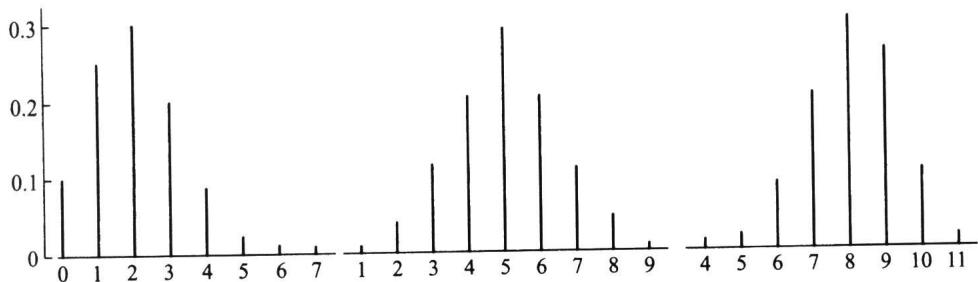
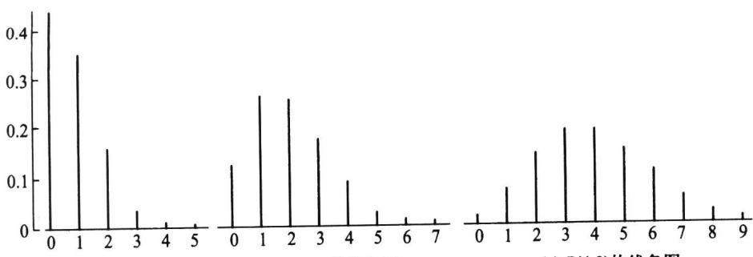

import Guide from '@/components/Guide.astro';
import Knowledge from '@/components/Knowledge.astro';
import Example from '@/components/Example.astro';
import Analysis from '@/components/Analysis.astro';
import Solution from '@/components/Solution.astro';
import Variant from '@/components/Variant.astro';
import Note from '@/components/Note.astro';
import Block from '@/components/Block.astro';
import Method from '@/components/Method.astro';
import Exercise from '@/components/Exercise.astro';

每个随机变量都有一个分布,不同的随机变量可以有不同的分布,也可以有相同的分布.随机变量有千千万万个,但常用分布并不是很多,熟悉这些常用分布对认识其他分布会很有启发.常用分布亦分为两类:离散分布和连续分布,本节讲常用离散分布,下节讲常用连续分布.

## 2.4.1 二项分布

## 一、二项分布

如果记 X 为 n 重伯努利试验中成功(记为事件 A)的次数, 则 X 的可能取值为 0, 1, …, n. 记 p 为每次试验中 A 发生的概率, 即 $P(A)=p$ , 则 $P(\overline{A})=1-p$ .
因为 $n$ 重伯努利试验的基本结果可以记作
$$
\omega = \left(\omega_ {1}, \omega_ {2}, \dots , \omega_ {n}\right),
$$
其中 $\omega_{i}$ 或者为 $A$ ，或者为 $\overline{A}$ .这样的 $\omega$ 共有 $2^{n}$ 个，这 $2^{n}$ 个样本点 $\omega$ 组成了样本空间 $\Omega$ 下面求 $X$ 的分布列，即求事件 $\{X = k\}$ 的概率.若某个样本点
$$
\omega = \left(\omega_ {1}, \omega_ {2}, \dots , \omega_ {n}\right) \in \{X = k \}
$$
意味着 $\omega_{1},\omega_{2},\cdots,\omega_{n}$ 中有 k 个 A, n-k 个 $\overline{A}$ ，所以由独立性知，
$$
P (\omega) = p ^ {k} (1 - p) ^ {n - k}.
$$
而事件 $\{X = k\}$ 中这样的 $\omega$ 共有 $\binom{n}{k}$ 个，所以 $X$ 的分布列为
$$
P (X = k) = \binom {n} {k} p ^ {k} (1 - p) ^ {n - k}, k = 0, 1, \dots , n.\tag{2.4.1}
$$
这个分布称为二项分布,记为 $X \sim b(n, p)$ .
容易验证其和恒为 1, 即
$$
\sum_ {k = 0} ^ {n} \binom {n} {k} p ^ {k} (1 - p) ^ {n - k} = [ p + (1 - p) ] ^ {n} = 1.
$$
由此可见，二项概率 $\binom{n}{k} p^k (1 - p)^{n - k}$ 恰好是 $n$ 次二项式 $(p + (1 - p))^n$ 的展开式中的第 $k + 1$ 项，这正是其名称的由来.
二项分布是一种常用的离散分布,譬如,
\- 检查 10 件产品, 10 件产品中不合格品的个数 $X$ 服从二项分布 $b(10, p)$ , 其中 $p$ 为不合格品率.
\- 调查 50 个人, 50 个人中患色盲的人数 $Y$ 服从二项分布 $b(50, p)$ , 其中 $p$ 为色盲率.
\- 射击 5 次, 5 次中命中次数 $Z$ 服从二项分布 $b(5, p)$ , 其中 $p$ 为射手的命中率.

<Example title="例 2.4.1">
某特效药的临床有效率为 0.95, 今有 10 人服用, 问至少有 8 人治愈的概率是多少?

<Solution title="解">
设 X 为 10 人中被治愈的人数, 则 $X \sim b(10, 0.95)$ , 而所求概率为
$$
\begin{array}{r l} P (X \geqslant 8) & = P (X = 8) + P (X = 9) + P (X = 1 0) \\ & = \binom {1 0} {8} 0. 9 5 ^ {8} 0. 0 5 ^ {2} + \binom {1 0} {9} 0. 9 5 ^ {9} 0. 0 5 + \binom {1 0} {1 0} 0. 9 5 ^ {1 0} \\ & = 0. 0 7 4 6 + 0. 3 1 5 1 + 0. 5 9 8 7 = 0. 9 8 8 4. \end{array}
$$
10人中至少有8人被治愈的概率为0.9884.
</Solution>
</Example>

<Example title="例 2.4.2">
设随机变量 $X \sim b(2, p)$ , $Y \sim b(3, p)$ . 若 $P(X \geqslant 1) = 5/9$ , 试求 $P(Y \geqslant 1)$ .

<Solution title="解">
由 $P(X \geqslant 1) = 5 / 9$ ，知 $P(X = 0) = 4 / 9$ ，所以 $(1 - p)^2 = 4 / 9$ ，由此得 $p = 1 / 3$ . 再由 $Y \sim b(3, p)$ 可得
$$
P (Y \geqslant 1) = 1 - P (Y = 0) = 1 - \left(1 - \frac {1}{3}\right) ^ {3} = \frac {1 9}{2 7}.
$$
</Solution>
</Example>

## 二、二点分布

$n = 1$ 时的二项分布 $b(1, p)$ 称为二点分布，或称0-1分布，或称伯努利分布，其分布列为
$$
P (X = x) = p ^ {x} (1 - p) ^ {1 - x}, \quad x = 0, 1.\tag{2.4.2}
$$
或记为
<table><tr><td>X</td><td>0</td><td>1</td></tr><tr><td>P</td><td>1-p</td><td>p</td></tr></table>
二点分布 $b(1, p)$ 主要用来描述一次伯努利试验中成功（记为 $A$ ）的次数（0 或 1）.
很多随机现象的样本空间 $\Omega$ 常可一分为二，记为 A 与 $\overline{A}$ ，由此形成伯努利试验。n 重伯努利试验是由 n 个相同的、独立进行的伯努利试验组成，若将第 i 个伯努利试验中 A 出现的次数记为 $X_{i} (i=1,2,\cdots,n)$ ，由于 n 重伯努利试验中，每个伯努利试验是相互独立的，故其产生的 n 个随机变量 $X_{1}, X_{2}, \cdots, X_{n}$ 也相互独立（随机变量的独立性定义见 §3.2），且服从相同的二点分布 $b(1,p)$ 。此时其和
$$
X = X _ {1} + X _ {2} + \dots + X _ {n}
$$
就是 $n$ 重伯努利试验中 $A$ 出现的总次数, 它服从二项分布 $b(n, p)$ . 这就是二项分布 $b(n, p)$ 与二点分布 $b(1, p)$ 之间的联系, 即服从二项分布的随机变量总可分解为 $n$ 个独立同为二点分布的随机变量之和.

## 三、二项分布的数学期望和方差

设随机变量 $X \sim b(n, p)$ , 则
$$
\begin{array}{r l} E (X) & = \sum_ {k = 0} ^ {n} k \binom {n} {k} p ^ {k} (1 - p) ^ {n - k} = n p \sum_ {k = 1} ^ {n} \binom {n - 1} {k - 1} p ^ {k - 1} (1 - p) ^ {(n - 1) - (k - 1)} \\ & = n p [ p + (1 - p) ] ^ {n - 1} = n p. \end{array}
$$
又因为
$$
\begin{array}{r l} E (X ^ {2}) & = \sum_ {k = 0} ^ {n} k ^ {2} \binom {n} {k} p ^ {k} (1 - p) ^ {n - k} = \sum_ {k = 1} ^ {n} (k - 1 + 1) k \binom {n} {k} p ^ {k} (1 - p) ^ {n - k} \\ & = \sum_ {k = 1} ^ {n} k (k - 1) \binom {n} {k} p ^ {k} (1 - p) ^ {n - k} + \sum_ {k = 1} ^ {n} k \binom {n} {k} p ^ {k} (1 - p) ^ {n - k} \\ & = \sum_ {k = 2} ^ {n} k (k - 1) \binom {n} {k} p ^ {k} (1 - p) ^ {n - k} + n p \\ & = n (n - 1) p ^ {2} \sum_ {k = 2} ^ {n} \binom {n - 2} {k - 2} p ^ {k - 2} (1 - p) ^ {(n - 2) - (k - 2)} + n p \\ & = n (n - 1) p ^ {2} + n p. \end{array}
$$
由此得 $X$ 的方差为
$$
\operatorname{Var} (X) = E \left(X ^ {2}\right) - (E (X)) ^ {2} = n (n - 1) p ^ {2} + n p - (n p) ^ {2} = n p (1 - p).
$$
因为二点分布是 $n = 1$ 时的二项分布 $b(1, p)$ , 所以二点分布的数学期望为 $p$ , 方差为 $p(1 - p)$ .
为了看出不同的 $p$ 的值, 其二项分布 $b(n, p)$ 的变化情况, 表2.4.1给出了 $n = 10$ 时, 不同 $p$ 值的二项分布的概率值, 其线条图见图2.4.1.
表 2.4.1 一些二项分布的概率值 (空白处为 0)
<table><tr><td>k</td><td>0</td><td>1</td><td>2</td><td>3</td><td>4</td><td>5</td><td>6</td><td>7</td><td>8</td><td>9</td><td>10</td></tr><tr><td>b(10,0.2)</td><td>0.107</td><td>0.268</td><td>0.302</td><td>0.201</td><td>0.088</td><td>0.027</td><td>0.006</td><td>0.001</td><td></td><td></td><td></td></tr><tr><td>b(10,0.5)</td><td>0.001</td><td>0.010</td><td>0.044</td><td>0.117</td><td>0.205</td><td>0.246</td><td>0.205</td><td>0.117</td><td>0.044</td><td>0.010</td><td>0.001</td></tr><tr><td>b(10,0.8)</td><td></td><td></td><td></td><td>0.001</td><td>0.006</td><td>0.027</td><td>0.088</td><td>0.201</td><td>0.302</td><td>0.268</td><td>0.107</td></tr></table>
  
(a) $b(10,0.2)$ 的线条图(右偏)  
(b) $b(10,0.5)$ 的线条图(对称)  
图2.4.1 二项分布 $b(n,p)$ 的线条图  
(c) $b(10,0.8)$ 的线条图(左偏)
从上图可以看出：
\- 位于均值 $np$ 附近概率较大.
\- 随着 $p$ 的增加, 分布的峰逐渐右移.

<Example title="例 2.4.3">
甲、乙两棋手约定进行 10 局比赛,以赢的局数多者为胜.设在每局中甲赢的概率为 0.6,乙赢的概率为 0.4.如果各局比赛是独立进行的,试问甲胜、乙胜、不分胜负的概率各为多少?

<Solution title="解">
以 X 表示 10 局比赛中甲赢的局数, 则 $X \sim b(10, 0.6)$ . 所以
$$
P (\text {甲胜}) = P (X \geqslant 6) = \sum_ {k = 6} ^ {1 0} {\binom {1 0} {k}}   0. 6 ^ {k} 0. 4 ^ {1 0 - k} = 0. 6 3 3    0,
$$
$$
P (\text {乙胜}) = P (X \leqslant 4) = \sum_ {k = 0} ^ {4} {\binom {1 0} {k}} 0. 6 ^ {k} 0. 4 ^ {1 0 - k} = 0. 1 6 6 3,
$$
$$
P (\text { 不分胜负 }) = P (X = 5) = \binom {1 0} {5} 0. 6 ^ {5} 0. 4 ^ {5} = 0. 2 0 0 7.
$$
可见甲胜的可能性达 $63.3\%$ ，而乙胜的可能性只有 $16.63\%$ ，它比不分胜负的可能性还要小。后两个概率之和0.3670表示乙不输的概率。
</Solution>
</Example>

## 2.4.2 泊松分布

## 一、泊松分布

泊松分布是 1837 年由法国数学家泊松 (Poisson, 1781—1840) 首次提出的. 泊松分布的概率分布列是
$$
P (X = k) = \frac {\lambda^ {k}}{k !} \mathrm{e} ^ {- \lambda}, k = 0, 1, 2, \dots ,\tag{2.4.3}
$$
其中参数 $\lambda>0$ , 记为 $X\sim P(\lambda)$ .
对泊松分布而言,很容易验证其和为 1
$$
\sum_ {k = 0} ^ {\infty} \frac {\lambda^ {k}}{k !} \mathrm{e} ^ {- \lambda} = \mathrm{e} ^ {- \lambda} \sum_ {k = 0} ^ {\infty} \frac {\lambda^ {k}}{k !} = \mathrm{e} ^ {- \lambda} \mathrm{e} ^ {\lambda} = 1.
$$
泊松分布是一种常用的离散分布,它常与单位时间(或单位面积、单位产品等)上的计数过程相联系,譬如,
\- 在一天内,来到某商场的顾客数.
\- 在单位时间内,一电路受到外界电磁波的冲击次数.
\- 1 平方米内, 玻璃上的气泡数.
\- 一铸件上的砂眼数.
\- 在一定时期内,某种放射性物质放射出来的 $\alpha$ -粒子数,等等.都服从泊松分布.因此泊松分布的应用面是十分广泛的.

## 二、泊松分布的数学期望和方差

设随机变量 $X \sim P(\lambda)$ , 则
$$
E (X) = \sum_ {k = 0} ^ {\infty} k \frac {\lambda^ {k}}{k !} \mathrm{e} ^ {- \lambda} = \lambda \mathrm{e} ^ {- \lambda} \sum_ {k = 1} ^ {\infty} \frac {\lambda^ {k - 1}}{(k - 1) !} = \lambda \mathrm{e} ^ {- \lambda} \mathrm{e} ^ {\lambda} = \lambda .
$$
这表明:泊松分布 $P(\lambda)$ 的数学期望就是参数 $\lambda$ .
又因为
$$
\begin{array}{r l} E (X ^ {2}) & = \sum_ {k = 0} ^ {\infty} k ^ {2} \frac {\lambda^ {k}}{k !} \mathrm{e} ^ {- \lambda} = \sum_ {k = 1} ^ {\infty} k \frac {\lambda^ {k}}{(k - 1) !} \mathrm{e} ^ {- \lambda} \\ & = \sum_ {k = 1} ^ {\infty} [ (k - 1) + 1 ] \frac {\lambda^ {k}}{(k - 1) !} \mathrm{e} ^ {- \lambda} \\ & = \lambda^ {2} \mathrm{e} ^ {- \lambda} \sum_ {k = 2} ^ {\infty} \frac {\lambda^ {k - 2}}{(k - 2) !} + \lambda \mathrm{e} ^ {- \lambda} \sum_ {k = 1} ^ {\infty} \frac {\lambda^ {k - 1}}{(k - 1) !} \\ & = \lambda^ {2} + \lambda . \end{array}
$$
由此得 $X$ 的方差为
$$
\operatorname{Var} (X) = E \left(X ^ {2}\right) - \left(E (X)\right) ^ {2} = \lambda^ {2} + \lambda - \lambda^ {2} = \lambda .
$$
也就是说, 泊松分布 $P(\lambda)$ 中的参数 $\lambda$ 既是数学期望又是方差.
为了看出不同的 $\lambda$ 的值, 其泊松分布 $P(\lambda)$ 的变化情况, 表 2.4.2 给出了 $\lambda = 0.8$ , 2.0, 4.0 时, 泊松分布的概率值, 其线条图见图 2.4.2.
表 2.4.2 一些泊松分布的概率值 (空白处为 0)
<table><tr><td>k</td><td>0</td><td>1</td><td>2</td><td>3</td><td>4</td><td>5</td><td>6</td><td>7</td><td>8</td><td>9</td><td>10</td></tr><tr><td>P(0.8)</td><td>0.449</td><td>0.360</td><td>0.144</td><td>0.038</td><td>0.008</td><td>0.001</td><td></td><td></td><td></td><td></td><td></td></tr><tr><td>P(2.0)</td><td>0.135</td><td>0.271</td><td>0.271</td><td>0.180</td><td>0.090</td><td>0.036</td><td>0.012</td><td>0.004</td><td>0.001</td><td></td><td></td></tr><tr><td>P(4.0)</td><td>0.018</td><td>0.073</td><td>0.147</td><td>0.195</td><td>0.195</td><td>0.156</td><td>0.104</td><td>0.060</td><td>0.030</td><td>0.013</td><td>0.005</td></tr></table>
从上图可以看出：
\- 位于均值 $\lambda$ 附近概率较大.
\- 随着 $\lambda$ 的增加, 分布逐渐趋于对称.

<Example title="例 2.4.4">
一铸件的砂眼(缺陷)数服从参数为 $\lambda = 0.5$ 的泊松分布,试求此铸件上至多有 1 个砂眼(合格品)的概率和至少有 2 个砂眼(不合格品)的概率.
  
(a) $P(0.8)$ 的线条图  
(b) $P(2.0)$ 的线条图  
(c) $P(4.0)$ 的线条图  
图2.4.2 泊松分布 $P(\lambda)$ 的线条图

<Solution title="解">
以 $X$ 表示这种铸件的砂眼数, 由题意知 $X \sim P(0.5)$ . 则此种铸件上至多有 1 个砂眼的概率为
$$
P (X \leqslant 1) = \frac {0 . 5 ^ {0}}{0 !} \mathrm{e} ^ {- 0. 5} + \frac {0 . 5 ^ {1}}{1 !} \mathrm{e} ^ {- 0. 5} = 0. 9 1.
$$
至少有2个砂眼的概率为
$$
P (X \geqslant 2) = 1 - P (X \leqslant 1) = 0. 0 9.
$$
</Solution>
</Example>

<Example title="例 2.4.5">
某商店出售某种商品,由历史销售记录分析表明,月销售量(件)服从参数为8的泊松分布.问在月初进货时,需要多少库存量,才能有90%以上的把握可以满足顾客的需求.

<Solution title="解">
以 $X$ 表示这种商品的月销售量, 则 $X \sim P(8)$ . 那么满足要求的是使下式成立的最小正整数 $n$ .
$$
P (X \leqslant n) \geqslant 0. 9 0.
$$
为了寻求此种 $n$ ，可以利用泊松分布表，附表1对各种 $\lambda$ 的值，给出了泊松分布函数 $P(X\leqslant k) = \sum_{i = 0}^{k}\frac{\lambda^i}{i!}\mathrm{e}^{-\lambda}$ 的数值表.在 $\lambda = 8$ 时，可从附表1中查得
$$
P (X \leqslant 1 1) = 0. 8 8 8, P (X \leqslant 1 2) = 0. 9 3 6.
$$
所以月初进货 12 件时,能有 90% 以上的把握可以满足顾客的需求.
</Solution>
</Example>

## 三、二项分布的泊松近似

泊松分布还有一个非常实用的特性, 即可以用泊松分布作为二项分布的一种近似. 在二项分布 $b(n,p)$ 中, 当 $n$ 较大时, 计算量是令人烦恼的. 而在 $n$ 较大且 $p$ 较小时使用以下的泊松定理, 可以减少二项分布中的计算量.

<Knowledge title="定理 2.4.1 泊松定理">
在 n 重伯努利试验中, 记事件 A 在一次试验中发生的概率为 $p_{n}$ (与试验次数 n 有关), 如果当 $n \to \infty$ 时, 有 $np_{n} \to \lambda$ , 则
$$
\lim _ {n \rightarrow \infty} \binom {n} {k} p _ {n} ^ {k} (1 - p _ {n}) ^ {n - k} = \frac {\lambda^ {k}}{k !} \mathrm{e} ^ {- \lambda}.\tag{2.4.4}
$$

<Solution title="证明">
记 $np_{n} = \lambda_{n}$ ，即 $p_n = \lambda_n / n$ ，我们可得
$$
\binom {n} {k} p _ {n} ^ {k} (1 - p _ {n}) ^ {n - k} = \frac {n (n - 1) \cdots (n - k + 1)}{k !} \left(\frac {\lambda_ {n}}{n}\right) ^ {k} \left(1 - \frac {\lambda_ {n}}{n}\right) ^ {n - k}
$$
$$
= \frac {\lambda_ {n} ^ {k}}{k !} \left(1 - \frac {1}{n}\right) \left(1 - \frac {2}{n}\right) \dots \left(1 - \frac {k - 1}{n}\right) \left(1 - \frac {\lambda_ {n}}{n}\right) ^ {n - k}.
$$
对固定的 $k$ 有
$$
\lim _ {n \to \infty} \lambda_ {n} = \lambda ,
$$
$$
\lim _ {n \to \infty} \left(1 - \frac {\lambda_ {n}}{n}\right) ^ {n - k} = \mathrm{e} ^ {- \lambda},
$$
$$
\lim _ {n \rightarrow \infty} \left(1 - \frac {1}{n}\right) \dots \left(1 - \frac {k - 1}{n}\right) = 1.
$$
从而
$$
\lim _ {n \to \infty} {\binom {n} {k}} p _ {n} ^ {k} (1 - p _ {n}) ^ {n - k} = \frac {\lambda^ {k}}{k !} \mathrm{e} ^ {- \lambda}
$$
对任意的 $k(k=0,1,2,\cdots)$ 成立. 定理得证.
由于泊松定理是在 $np_n \to \lambda$ 条件下获得的，故在计算二项分布 $b(n, p)$ 时，当 $n$ 很大， $p$ 很小，而乘积 $\lambda = np$ 大小适中时，可以用泊松分布作近似，即
$$
\binom {n} {k} p _ {_ n} ^ {^ k} (1 - p _ {_ n}) ^ {^ {n - k}} \approx \frac {(n p) ^ {^ k}}{k !} \mathrm{e} ^ {- n p}, k = 0, 1, 2, \dots .\tag{2.4.5}
$$
表 2.4.3 给出了按二项分布直接计算与利用泊松分布作近似的一些具体数据. 从表中可以看出, 两者的结果是很接近的, 而且当 n 越大和 p 越小时, 近似程度越好.
表 2.4.3 二项分布与泊松近似的比较
<table><tr><td rowspan="2">k</td><td colspan="4">二项分布按 $\binom{n}{k}p^{k}(1-p)^{n-k}$ 计算</td><td>泊松近似按 $\frac{(np)^{k}}{k!}e^{-np}$ 计算</td></tr><tr><td>n=10p=0.1</td><td>n=20p=0.05</td><td>n=40p=0.025</td><td>n=100p=0.01</td><td>λ=np=1</td></tr><tr><td>0</td><td>0.349</td><td>0.358</td><td>0.363</td><td>0.366</td><td>0.368</td></tr><tr><td>1</td><td>0.387</td><td>0.377</td><td>0.373</td><td>0.370</td><td>0.368</td></tr><tr><td>2</td><td>0.194</td><td>0.189</td><td>0.186</td><td>0.185</td><td>0.184</td></tr><tr><td>3</td><td>0.057</td><td>0.060</td><td>0.060</td><td>0.061</td><td>0.061</td></tr><tr><td>4</td><td>0.011</td><td>0.013</td><td>0.014</td><td>0.015</td><td>0.015</td></tr><tr><td>&gt;4</td><td>0.002</td><td>0.003</td><td>0.004</td><td>0.003</td><td>0.004</td></tr></table>
以下给出一些利用泊松分布作近似计算的例子.
</Solution>
</Knowledge>

<Example title="例 2.4.6">
已知某种疾病的发病率为 0.001, 某单位共有 5000 人. 问该单位患有这种疾病的人数不超过 5 人的概率为多少?

<Solution title="解">
设该单位患有这种疾病的人数为 $X$ ，则有 $X \sim b(5000, 0.001)$ ，而我们所求的为
$$
P (X \leqslant 5) = \sum_ {k = 0} ^ {5} {\binom {5 0 0 0} {k}} 0. 0 0 1 ^ {k} 0. 9 9 9 ^ {5 0 0 0 - k}.
$$
这个概率的计算量很大.由于 n 很大, p 很小, 且 $\lambda = np = 5$ . 所以用泊松近似得
$$
P (X \leqslant 5) \approx \sum_ {k = 0} ^ {5} \frac {5 ^ {k}}{k !} \mathrm{e} ^ {- 5} = 0. 6 1 6.
$$
</Solution>
</Example>

<Example title="例 2.4.7">
有 10 000 名同年龄段且同社会阶层的人参加了某保险公司的一项人寿保险。每个投保人在每年初需交纳 200 元保费，而在这一年中若投保人死亡，则受益人可从保险公司获得 100 000 元的赔偿费。据生命表知这类人的年死亡率为 0.001。试求保险公司在这项业务上
(1) 亏本的概率;
(2) 至少获利 500 000 元的概率.

<Solution title="解">
设 X 为 10 000 名投保人在一年中死亡的人数, 则 X 服从二项分布 b(10 000, 0.001). 保险公司在这项业务上一年的总收入为 $200 \times 10\ 000 = 2\ 000\ 000$ (元). 因为 n = 10 000 很大, p = 0.001 很小, 所以用 $\lambda = np = 10$ 的泊松分布进行近似计算.
(1) 保险公司在这项业务上“亏本”就相当于事件 $\{X > 20\}$ 发生. 因此所求概率为
$$
P (X > 2 0) = 1 - P (X \leqslant 2 0) \approx 1 - \sum_ {k = 0} ^ {2 0} \frac {1 0 ^ {k}}{k !} \mathrm{e} ^ {- 1 0} = 1 - 0. 9 9 8 = 0. 0 0 2.
$$
由此可看出,保险公司在这项业务上亏本的可能性是微小的.
（2）保险公司在这项业务上“至少获利500 000元”就相当于事件 $\{X\leqslant15\}$ 发生.因此所求概率为
$$
P (X \leqslant 1 5) \approx \sum_ {k = 0} ^ {1 5} {\frac {1 0 ^ {k}}{k !}} \mathrm{e} ^ {- 1 0} = 0. 9 5 1.
$$
由此可看出,保险公司在这项业务上至少获利 500 000 元的可能性很大.
</Solution>
</Example>

<Example title="例 2.4.8">
为保证设备正常工作,需要配备一些维修工.如果各台设备发生故障是相互独立的,且每台设备发生故障的概率都是 0.01.试在以下各种情况下,求设备发生故障而不能及时修理的概率.
(1) 1 名维修工负责 20 台设备；
(2) 3 名维修工负责 90 台设备；
(3) 10 名维修工负责 500 台设备.

<Solution title="解">
（1）以 $X_{1}$ 表示20台设备中同时发生故障的台数，则 $X_{1} \sim b(20, 0.01)$ . 用参数为 $\lambda = np = 20 \times 0.01 = 0.2$ 的泊松分布作近似计算，得所求概率为
$$
P (X _ {1} > 1) \approx 1 - \sum_ {k = 0} ^ {1} \frac {0 . 2 ^ {k}}{k !} \mathrm{e} ^ {- 0. 2} = 1 - 0. 9 8 2 = 0. 0 1 8.
$$
（2）以 $X_{2}$ 表示90台设备中同时发生故障的台数，则 $X_{2} \sim b(90, 0.01)$ . 用参数为 $\lambda = np = 90 \times 0.01 = 0.9$ 的泊松分布作近似计算，得所求概率为
$$
P (X _ {2} > 3) \approx 1 - \sum_ {k = 0} ^ {3} \frac {0 . 9 ^ {k}}{k !} \mathrm{e} ^ {- 0. 9} = 1 - 0. 9 8 7 = 0. 0 1 3.
$$
</Solution>
</Example>

<Note>
此种情况下,不但所求概率比(1)中有所降低,而且3名维修工负责90台设备相当于每个维修工负责30台设备,工作效率是(1)中的1.5倍.
（3）以 $X_{3}$ 表示500台设备中同时发生故障的台数，则 $X_{3} \sim b(500, 0.01)$ . 用参数为 $\lambda = np = 500 \times 0.01 = 5$ 的泊松分布作近似计算，得所求概率为
$$
P (X _ {3} > 1 0) \approx 1 - \sum_ {k = 0} ^ {1 0} \frac {5 ^ {k}}{k !} \mathrm{e} ^ {- 5} = 1 - 0. 9 8 6 = 0. 0 1 4.
$$
</Note>

<Note>
此种情况下所求概率与(2)中基本上一样,而10名维修工负责500台设备相当于每个维修工负责50台设备,工作效率是(2)中的1.67倍,是(1)中的2.5倍.
由此可知:若干维修工共同负责大量设备的维修,将提高工作的效率.
</Note>

## 2.4.3 超几何分布

## 一、超几何分布

从一个有限总体中进行不放回抽样常会遇到超几何分布.
设有 $N$ 件产品, 其中有 $M$ 件不合格品. 若从中不放回地随机抽取 $n$ 件, 则其中含有的不合格品的件数 $X$ 服从超几何分布, 记为 $X \sim h(n, N, M)$ . 超几何分布的概率分布列为 (见第一章中例1.2.3)
$$
P (X = k) = \frac {\binom {M} {k} \binom {N - M} {n - k}}{\binom {N} {n}}, k = 0, 1, \dots , r.\tag{2.4.6}
$$
其中 $r = \min \{M, n\}$ ，且 $M \leqslant N, n \leqslant N, n, N, M$ 均为正整数.
若要验证以上给出的确实为一个概率分布列, 只需注意到有组合等式(见习题1.2)
$$
\sum_ {k = 0} ^ {r} \binom {M} {k} \binom {N - M} {n - k} = \binom {N} {n}
$$
即可.
超几何分布是一种常用的离散分布,它在抽样理论中占有重要地位.

## 二、超几何分布的数学期望和方差

若 $X \sim h(n, N, M)$ , 则 $X$ 的数学期望为
$$
E (X) = \sum_ {k = 0} ^ {r} k \frac {\binom {M} {k} \binom {N - M} {n - k}}{\binom {N} {n}} = n \frac {M}{N} \sum_ {k = 1} ^ {r} \frac {\binom {M - 1} {k - 1} \binom {N - M} {n - k}}{\binom {N - 1} {n - 1}} = n \frac {M}{N}.
$$
又因为
$$
\begin{array}{r l} E (X ^ {2}) & = \sum_ {k = 1} ^ {r} k ^ {2} \frac {\binom {M} {k} \binom {N - M} {n - k}}{\binom {N} {n}} = \sum_ {k = 2} ^ {r} k (k - 1) \frac {\binom {M} {k} \binom {N - M} {n - k}}{\binom {N} {n}} + n \frac {M}{N} \\ & = \frac {M (M - 1)}{\binom {N} {n}} \sum_ {k = 2} ^ {r} \binom {M - 2} {k - 2} \binom {N - M} {n - k} + n \frac {M}{N} \end{array}
$$
$$
= \frac {M (M - 1)}{\binom {N} {n}} \binom {N - 2} {n - 2} + n \frac {M}{N} = \frac {M (M - 1) n (n - 1)}{N (N - 1)} + n \frac {M}{N},
$$
由此得 $X$ 的方差为
$$
\operatorname{Var} (X) = E \left(X ^ {2}\right) - [ E (X) ] ^ {2} = \frac {n M (N - M) (N - n)}{N ^ {2} (N - 1)}.
$$

## 三、超几何分布的二项近似

当 $n \ll N$ 时, 即抽取个数 $n$ 远小于产品总数 $N$ 时, 每次抽取后, 总体中的不合格品率 $p = M / N$ 改变甚微, 所以不放回抽样可近似地看成放回抽样, 这时超几何分布可用二项分布近似:
$$
\frac {\binom {M} {k} \binom {N - M} {n - k}}{\binom {N} {n}} \approx \binom {n} {k} p ^ {k} (1 - p) ^ {n - k}, \text {其中} p = \frac {M}{N}.\tag{2.4.7}
$$

## 2.4.4 几何分布与负二项分布

## 一、几何分布

在伯努利试验序列中,记每次试验中事件A发生的概率为p,如果X为事件A首次出现时的试验次数,则X的可能取值为1,2,…,称X服从几何分布,记为 $X\sim Ge(p)$ ,其分布列为
$$
P (X = k) = (1 - p) ^ {k - 1} p, k = 1, 2, \dots .\tag{2.4.8}
$$
实际问题中有不少随机变量服从几何分布,譬如,
\- 某产品的不合格率为 0.05, 则首次查到不合格品的检查次数 $X \sim Ge(0.05)$ .
\- 某射手的命中率为 0.8, 则首次击中目标的射击次数 $Y \sim Ge(0.8)$ .
\- 掷一颗骰子,首次出现6点的投掷次数 $Z \sim Ge(1/6)$ .
\- 同时掷两颗骰子,首次达到两个点数之和为8的投掷次数 $W \sim Ge(5/36)$ .

## 二、几何分布的数学期望和方差

设随机变量 $X$ 服从几何分布 $Ge(p)$ , 令 $q = 1 - p$ , 利用逐项微分可得 $X$ 的数学期望为
$$
\begin{array}{r l} E (X) & = \sum_ {k = 1} ^ {\infty} k p q ^ {k - 1} = p \sum_ {k = 1} ^ {\infty} k q ^ {k - 1} = p \sum_ {k = 1} ^ {\infty} \frac {\mathrm{d} q ^ {k}}{\mathrm{d} q} \\ & = p \frac {\mathrm{d}}{\mathrm{d} q} \left(\sum_ {k = 0} ^ {\infty} q ^ {k}\right) = p \frac {\mathrm{d}}{\mathrm{d} q} \left(\frac {1}{1 - q}\right) = \frac {p}{(1 - q) ^ {2}} = \frac {1}{p}. \end{array}
$$
又因为
$$
E \left(X ^ {2}\right) = \sum_ {k = 1} ^ {\infty} k ^ {2} p q ^ {k - 1} = p \left[ \sum_ {k = 1} ^ {\infty} k (k - 1) q ^ {k - 1} + \sum_ {k = 1} ^ {\infty} k q ^ {k - 1} \right]
$$
$$
\begin{array}{l} = p q \sum_ {k = 1} ^ {\infty} k (k - 1) q ^ {k - 2} + \frac {1}{p} = p q \sum_ {k = 1} ^ {\infty} \frac {\mathrm{d} ^ {2}}{\mathrm{d} q ^ {2}} q ^ {k} + \frac {1}{p} \\ = p q \frac {\mathrm{d} ^ {2}}{\mathrm{d} q ^ {2}} \left(\sum_ {k = 0} ^ {\infty} q ^ {k}\right) + \frac {1}{p} = p q \frac {\mathrm{d} ^ {2}}{\mathrm{d} q ^ {2}} \left(\frac {1}{1 - q}\right) + \frac {1}{p} \\ = p q \frac {2}{(1 - q) ^ {3}} + \frac {1}{p} = \frac {2 q}{p ^ {2}} + \frac {1}{p}, \end{array}
$$
由此得 $X$ 的方差为
$$
\operatorname{Var} (X) = E \left(X ^ {2}\right) - [ E (X) ] ^ {2} = \frac {2 q}{p ^ {2}} + \frac {1}{p} - \frac {1}{p ^ {2}} = \frac {1 - p}{p ^ {2}}.
$$
从几何分布的数学期望可以看出:掷一颗骰子,首次出现点数6的平均投掷次数为6次.

## 三、几何分布的无记忆性

<Knowledge title="定理 2.4.2 几何分布的无记忆性">
设 $X \sim Ge(p)$ , 则对任意正整数 $m$ 与 $n$ 有
$$
P (X > m + n \mid X > m) = P (X > n).\tag{2.4.9}
$$
在证明之前先解释上述概率等式的含义. 在一列伯努利试验序列中, 若首次成功 (A) 出现的试验次数 $X$ 服从几何分布, 则事件 $\{X > m\}$ 表示前 $m$ 次试验中 $A$ 没有出现. 假如在接下去的 $n$ 次试验中 $A$ 仍未出现, 这个事件记为 $\{X > m + n\}$ . 这个定理表明: 在前 $m$ 次试验中 $A$ 没有出现的条件下, 在接下去的 $n$ 次试验中 $A$ 仍未出现的概率只与 $n$ 有关, 而与以前的 $m$ 次试验无关, 似乎忘记了前 $m$ 次试验结果, 这就是无记忆性.

<Solution title="证明">
因为
$$
P (X > n) = \sum_ {k = n + 1} ^ {\infty} (1 - p) ^ {k - 1} p = \frac {p (1 - p) ^ {n}}{1 - (1 - p)} = (1 - p) ^ {n},
$$
所以对任意的正整数 $m$ 与 $n$ , 条件概率
$$
P (X > m + n \mid X > m) = \frac {P (X > m + n)}{P (X > m)} = \frac {(1 - p) ^ {m + n}}{(1 - p) ^ {m}} = (1 - p) ^ {n} = P (X > n).
$$
这就证得了(2.4.9)式.
</Solution>
</Knowledge>

## 四、负二项分布

作为几何分布的一种延伸,我们来讨论下面的负二项分布,亦称帕斯卡分布:
在伯努利试验序列中,记每次试验中事件 A 发生的概率为 p, 如果 X 为事件 A 第 r 次出现时的试验次数, 则 X 的可能取值为 $r, r+1, \cdots, r+m, \cdots$ . 称 X 服从负二项分布或帕斯卡分布, 其分布列为
$$
P (X = k) = \binom {k - 1} {r - 1} p ^ {r} (1 - p) ^ {k - r}, k = r, r + 1, \dots .\tag{2.4.10}
$$
记为 $X \sim Nb(r, p)$ . 当 $r = 1$ 时, 即为几何分布.
这是因为在 $k$ 次伯努利试验中，最后一次一定是 $A$ ，而前 $k - 1$ 次中 $A$ 应出现 $r - 1$ 次，由二项分布知其概率为 $\binom{k - 1}{r - 1} p^{r - 1}(1 - p)^{k - r}$ ，再乘以最后一次出现 $A$ 的概率 $p$ ，即得
(2.4.10).
可以算得负二项分布的数学期望为 $r / p$ ，方差为 $r(1 - p) / p^2$ .从直观上看这是合理的，因为首次出现 $A$ 的平均试验次数是 $1 / p$ ，那么第 $r$ 个 $A$ 出现所需的平均试验次数是 $r / p$
如果将第一个 A 出现的试验次数记为 $X_{1}$ ，第二个 A 出现的试验次数（从第一个 A 出现之后算起）记为 $X_{2}, \cdots,$ 第 r 个 A 出现的试验次数（从第 r-1 个 A 出现之后算起）记为 $X_{r}$ ，见图 2.4.3.
$$
\underbrace {\overline {{A}} \overline {{A}} \cdots \overline {{A}} A} _ {X _ {1}} \quad \underbrace {\overline {{A}} \overline {{A}} \cdots \overline {{A}} A} _ {X _ {2}} \quad \dots \quad \underbrace {\overline {{A}} \overline {{A}} \cdots \overline {{A}} A} _ {X _ {r}}
$$
图2.4.3 负二项变量与几何变量的关系
则诸 $X_{i}$ 独立同分布，且 $X_{i} \sim Ge(p)$ . 此时有 $X = X_{1} + X_{2} + \cdots + X_{r} \sim Nb(r, p)$ ，即负二项分布的随机变量可以分解成 r 个独立同分布的几何分布随机变量之和. 譬如，在连续检查一大批产品中，若该批产品的不合格率为 0.05，则在一个接一个的检查中，发现第 5 个不合格品时的检查次数 X 服从负二项分布 $Nb(5, 0.05)$ ，其平均检查次数为
$$
E (X) = \frac {r}{p} = \frac {5}{0 . 0 5} = 1 0 0.
$$
常用离散分布表见后面表2.5.1.

<Block title="习题2.4">
1. 一批产品中有 $10\%$ 的不合格品，现从中任取3件，求其中至多有一件不合格品的概率。
2. 一条自动化生产线上产品的一级品率为 0.8, 现检查 5 件, 求至少有 2 件一级品的概率.
3. 某优秀射手命中 10 环的概率为 0.7, 命中 9 环的概率为 0.3. 试求该射手三次射击所得的环数不少于 29 环的概率.
4. 经验表明: 预订餐厅座位而不来就餐的顾客比例为 20%. 如今餐厅有 50 个座位, 但预订给了 52 位顾客, 问到时顾客来到餐厅而没有座位的概率是多少?
5. 设随机变量 $X \sim b(n, p)$ , 已知 $E(X) = 2.4$ , $\operatorname{Var}(X) = 1.44$ , 求两个参数 $n$ 与 $p$ 各为多少?
6. 设随机变量 X 服从二项分布 $b(2, p)$ ，随机变量 Y 服从二项分布 $b(4, p)$ 。若 $P(X \geqslant 1) = 8/9$ ，试求 $P(Y \geqslant 1)$ 。
7. 一批产品的不合格品率为 0.02, 现从中任取 40 件进行检查, 若发现两件或两件以上不合格品就拒收这批产品. 分别用以下方法求拒收的概率:
(1) 用二项分布作精确计算；
(2) 用泊松分布作近似计算.
8. 设 X 服从泊松分布, 且已知 $P(X=1)=P(X=2)$ , 求 $P(X=4)$ .
9. 已知某商场一天来的顾客数 $X$ 服从参数为 $\lambda$ 的泊松分布, 而每个来到商场的顾客购物的概率为 $p$ , 证明: 此商场一天内购物的顾客数服从参数为 $\lambda p$ 的泊松分布.
10. 设一个人一年内患感冒的次数服从参数 $\lambda = 5$ 的泊松分布. 现有某种预防感冒的药物对 $75\%$ 的人有效 (能将泊松分布的参数减少为 $\lambda = 3$ ), 对另外的 $25\%$ 的人不起作用. 如果某人服用了此药, 一年内患了两次感冒, 那么该药对他 (她) 有效的可能性是多少?
11. 有三个朋友去喝咖啡,他们决定用掷硬币的方式确定谁付账:每人掷一次硬币,如果有人掷出的结果与其他两人不一样,那么由他付账;如果三个人掷出的结果是一样的,那么就重新掷,一直这样下去,直到确定了由谁来付账.求以下事件的概率:
(1) 进行到了第 2 轮确定了由谁来付账；
(2) 进行了 3 轮还没有确定付账人.
12. 从一个装有 $m$ 个白球、 $n$ 个黑球的袋中有返回地摸球，直到摸到白球时停止。试求取出黑球数的期望。
13. 某种产品上的缺陷数 $X$ 服从下列分布列：
$$
P (X = k) = \frac {1}{2 ^ {k + 1}}, \quad k = 0, 1, \dots ,
$$
求此种产品上的平均缺陷数.
14. 设随机变量 $X$ 的密度函数为
$$
p \left(  x  \right)   =   \left\{ \begin{array}{l l} {2 x  ,    0   <     x   <     1  ,} \\ {0  ,    \text {其他}.} \end{array} \right.
$$
以 $Y$ 表示对 $X$ 的三次独立重复观察中事件 $\{X \leqslant 1/2\}$ 出现的次数，试求 $P(Y = 2)$ .
15. 某产品的不合格品率为 0.1, 每次随机抽取 10 件进行检验, 若发现其中不合格品数多于 1, 就去调整设备. 若检验员每天检验 4 次, 试问每天平均要调整几次设备?
16. 一个系统由多个元件组成, 各个元件是否正常工作是相互独立的, 且各个元件正常工作的概率为 $p$ . 若在系统中至少有一半的元件正常工作, 那么整个系统就有效. 问 $p$ 取何值时, 5 个元件的系统比 3 个元件的系统更有可能有效?
17. 设随机变量 $X$ 服从参数为 $\lambda$ 的泊松分布, 试证明
$$
E \left(X ^ {n}\right) = \lambda E \left[ (X + 1) ^ {n - 1} \right],
$$
利用此结果计算 $E(X^{3})$ .
18. 令 $X(n, p)$ 表示服从二项分布 $b(n, p)$ 的随机变量，试证明：
$$
P (X (n, p) \leqslant i) = 1 - P (X (n, 1 - p) \leqslant n - i - 1).
$$
19. 设随机变量 $X$ 服从参数为 $p$ 的几何分布, 试证明:
$$
E \left(\frac {1}{X}\right) = \frac {- p \ln p}{1 - p}
$$
20. 设随机变量 $X \sim b(n, p)$ , 试证明:
$$
E \left(\frac {1}{X + 1}\right) = \frac {1 - (1 - p) ^ {n + 1}}{(n + 1) p}.
$$
</Block>
