import Guide from '@/components/Guide.astro';
import Knowledge from '@/components/Knowledge.astro';
import Example from '@/components/Example.astro';
import Analysis from '@/components/Analysis.astro';
import Solution from '@/components/Solution.astro';
import Variant from '@/components/Variant.astro';
import Note from '@/components/Note.astro';
import Block from '@/components/Block.astro';
import Method from '@/components/Method.astro';
import Exercise from '@/components/Exercise.astro';

在连续分布场合, 密度函数与分布函数是可以相互导出的, 含有相同信息, 各有各的用处, 但在图形上密度函数对各种连续分布的特性能得到直观显示. 如正态与偏态、单峰与平顶都是依密度函数图形命名的, 因而人们对密度函数更为注意.

## 2.5.1 正态分布

正态分布是概率论与数理统计中最重要的一个分布,高斯(Gauss,1777—1855)在研究误差理论时首先用正态分布来刻画误差的分布,所以正态分布又称为高斯分布.
本书第四章的中心极限定理表明:一个随机变量如果是由大量微小的、独立的随机因素的叠加结果,那么这个变量一般都可以认为服从正态分布.因此很多随机变量可以用正态分布描述或近似描述,譬如测量误差、产品重量、人的身高、年降雨量等都可用正态分布描述.

## 一、正态分布的密度函数和分布函数

若随机变量 $X$ 的密度函数为
$$
p (x) = \frac {1}{\sqrt {2 \pi} \sigma} \mathrm{e} ^ {- \frac {(x - \mu) ^ {2}}{2 \sigma^ {2}}}, \quad - \infty <   x <   \infty ,\tag{2.5.1}
$$
则称 $X$ 服从正态分布, 称 $X$ 为正态变量, 记作 $X \sim N(\mu, \sigma^2)$ . 其中参数 $-\infty < \mu < \infty, \sigma > 0$ . 其密度函数 $p(x)$ 的图形如图 2.5.1(a) 所示. $p(x)$ 是一条钟形曲线, 中间高、两边低、左右关于 $x = \mu$ 对称, $\mu$ 是正态分布的中心, 且在 $x = \mu$ 附近取值的可能性大, 在两侧取值的可能性小. $\mu \pm \sigma$ 是该曲线的拐点.
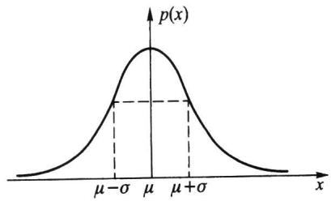  
(a) 密度函数 $p(x)$
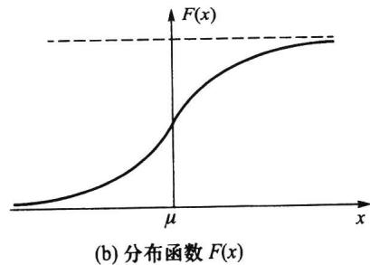  
图2.5.1 正态分布
正态分布 $N(\mu, \sigma^2)$ 的分布函数为
$$
F (x) = \frac {1}{\sqrt {2 \pi} \sigma} \int_ {- \infty} ^ {x} \mathrm{e} ^ {- \frac {(t - \mu) ^ {2}}{2 \sigma^ {2}}} \mathrm{d} t.\tag{2.5.2}
$$
它是一条光滑上升的 S 形曲线, 见图 2.5.1(b).
图 2.5.2 给出了在 $\mu$ 和 $\sigma$ 变化时, 相应正态密度曲线的变化情况.
\- 从图2.5.2(a)中可以看出:如果固定 $\sigma$ , 改变 $\mu$ 的值, 则图形沿 $x$ 轴平移, 而不改变其形状. 也就是说正态密度函数的位置由参数 $\mu$ 所确定, 因此亦称 $\mu$ 为位置参数.
\- 从图2.5.2(b)中可以看出:如果固定 $\mu$ , 改变 $\sigma$ 的值, 则分布的位置不变, 但 $\sigma$ 愈小, 曲线呈高而瘦, 分布较为集中; $\sigma$ 愈大, 曲线呈矮而胖, 分布较为分散. 也就是说正态密度函数的尺度由参数 $\sigma$ 所确定, 因此称 $\sigma$ 为尺度参数.

## 二、标准正态分布

称 $\mu=0,\sigma=1$ 时的正态分布 $N(0,1)$ 为标准正态分布.
通常记标准正态变量为 $U$ ，记标准正态分布的密度函数为 $\varphi(u)$ ，分布函数为 $\Phi(u)$ ，即
$$
\varphi (u) = \frac {1}{\sqrt {2 \pi}} e ^ {- \frac {u ^ {2}}{2}}, \quad - \infty <   u <   \infty ,
$$
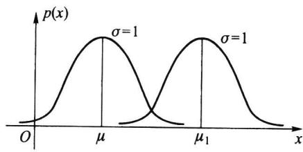  
(a) $\sigma$ 固定， $\mu$ 值改变
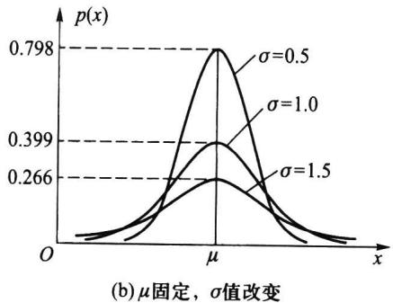  
图2.5.2 正态密度函数
$$
\Phi (u) = \frac {1}{\sqrt {2 \pi}} \int_ {- \infty} ^ {u} \mathrm{e} ^ {- \frac {t ^ {2}}{2}} \mathrm{d} t, \quad - \infty <   u <   \infty .
$$
由于标准正态分布的分布函数不含任何未知参数,故其值 $\Phi(u)=P(U\leqslant u)$ 完全可以算出,附表2对 $u\geqslant0$ 给出了 $\Phi(u)$ 的值.对于 $\Phi(u)$ 有
\- $\Phi(-u) = 1 - \Phi(u)$ .
\- $P(U > u) = 1 - \Phi(u)$ .
\- $P(a < U < b) = \Phi(b) - \Phi(a)$ .
\- $P(|U| < c) = 2\Phi(c) - 1 (c \geqslant 0)$ .
这些等式都不难推得.

<Example title="例 2.5.1">
设 $U \sim N(0,1)$ ，利用附表 2，求下列事件的概率：
(1) $P(U < 1.52) = \Phi(1.52) = 0.9357.$
(2) $P(U > 1.52) = 1 - \Phi (1.52) = 1 - 0.9357 = 0.0643.$
(3) $P(U < -1.52) = 1 - \Phi(1.52) = 0.0643.$
(4) $P(-0.75 \leqslant U \leqslant 1.52) = \Phi(1.52) - \Phi(-0.75)$ $= \Phi(1.52) - [1 - \Phi(0.75)]$ $= 0.9357 - 1 + 0.7734 = 0.7091.$
(5) $P(|U| \leqslant 1.52) = 2\Phi(1.52) - 1 = 2 \times 0.9357 - 1 = 0.8714.$
</Example>

## 三、正态变量的标准化

正态分布有一个家族
$$
\mathcal {P} = \left\{N (\mu , \sigma^ {2}): - \infty <   \mu <   \infty , \sigma > 0 \right\},
$$
标准正态分布 $N(0,1)$ 是其一个中心成员. 以下定理说明: 一般正态变量都可以通过一个线性变换 (标准化) 化成标准正态变量. 因此与正态变量有关的一切事件的概率都可通过查标准正态分布函数表获得. 可见标准正态分布 $N(0,1)$ 对一般正态分布 $N(\mu,$
$\sigma^{2}$ ) 的计算起着关键的作用.

<Knowledge title="定理 2.5.1">
若随机变量 $X \sim N(\mu, \sigma^{2})$ ，则 $U = (X - \mu) / \sigma \sim N(0, 1)$ .

<Solution title="证明">
记 $X$ 与 $U$ 的分布函数分别为 $F_{X}(x)$ 与 $F_{U}(u)$ ，则由分布函数的定义知
$$
F _ {_ U} (u) = P (U \leqslant u) = P \left(\frac {X - \mu}{\sigma} \leqslant u\right) = P (X \leqslant \mu + \sigma u) = F _ {_ X} (\mu + \sigma u).
$$
由于正态分布函数是严格单调增函数,且处处可导,因此若记 X 与 U 的密度函数分别为 $p_{X}(x)$ 与 $p_{U}(u)$ ,则有
$$
p _ {U} (u) = \frac {\mathrm{d}}{\mathrm{d} u} F _ {x} (\mu + \sigma u) = p _ {x} (\mu + \sigma u) \cdot \sigma = \frac {1}{\sqrt {2 \pi}} \mathrm{e} ^ {- u ^ {2} / 2},
$$
由此得
$$
U = \frac {X - \mu}{\sigma} \sim N (0, 1).
$$
由以上定理,我们马上可以得到一些在实际中有用的计算公式,若随机变量 $X \sim N(\mu, \sigma^{2})$ , 则
$$
P (X \leqslant c) = \Phi \left(\frac {c - \mu}{\sigma}\right).\tag{2.5.3}
$$
$$
P (a <   X \leqslant b) = \Phi \left(\frac {b - \mu}{\sigma}\right) - \Phi \left(\frac {a - \mu}{\sigma}\right).\tag{2.5.4}
$$
</Solution>
</Knowledge>

<Example title="例 2.5.2">
设随机变量 X 服从正态分布 $N(108,3^{2})$ ，试求：
(1) $P(102 < X < 117)$ ;
(2) 常数 a, 使得 $P(X < a) = 0.95$ .

<Solution title="解">
利用公式(2.5.4)及查附表2得
(1)
$$
\begin{array}{r l} P (1 0 2 <   X <   1 1 7) & = \Phi \left(\frac {1 1 7 - 1 0 8}{3}\right) - \Phi \left(\frac {1 0 2 - 1 0 8}{3}\right) \\ & = \Phi (3) - \Phi (- 2) = \Phi (3) + \Phi (2) - 1 \\ & = 0. 9 9 8 7 + 0. 9 7 7 2 - 1 = 0. 9 7 5 9. \end{array}
$$
(2) 由
$$
P (X <   a) = \Phi \bigg (\frac {a - 1 0 8}{3} \bigg) = 0. 9 5, \quad \text {或} \quad \Phi^ {- 1} (0. 9 5) = \frac {a - 1 0 8}{3},
$$
其中 $\Phi^{-1}$ 为 $\Phi$ 的反函数.从附表 2 由里向外反查得
$$
\Phi (1. 6 4) = 0. 9 4 9 5, \qquad \Phi (1. 6 5) = 0. 9 5 0 5,
$$
再用线性内插法可得 $\Phi(1.645)=0.95$ ，即 $\Phi^{-1}(0.95)=1.645$ ，故
$$
\frac {a - 1 0 8}{3} = 1. 6 4 5,
$$
从中解得 a=112.935.
从上例我们可以看出,有些场合下给定 $\Phi(x)$ 的值 p, 可以从附表 2 中由里向外反查表来得到 $x_{p}$ , 使 $\Phi(x_{p}) = p$ 或 $\Phi^{-1}(p) = x_{p}$ , 这时 $x_{p}$ 称为标准正态分布的 p 分位数. 在上例中 1.645 就是标准正态分布的 0.95 分位数, 更一般叙述见 2.7.3 节. 分位数在统计
中被大量使用.
</Solution>
</Example>

<Example title="例 2.5.3">
在考试中, 如果考生的成绩 X 近似地服从正态分布, 则通常认为这次考试(就合理地划分考生成绩的等级而言) 是正常的. 教师经常把分数超过 $\mu + \sigma$ 的评为 A 等, 分数在 $\mu$ 到 $\mu + \sigma$ 之间的评为 B 等, 分数在 $\mu - \sigma$ 到 $\mu$ 之间的评为 C 等, 分数在 $\mu - 2\sigma$ 到 $\mu - \sigma$ 之间的评为 D 等, 分数在 $\mu - 2\sigma$ 以下的评为 F 等. 由此可计算得:
$$
P (X \geqslant \mu + \sigma) = P \left(\frac {X - \mu}{\sigma} \geqslant 1\right) = 1 - \Phi (1) \approx 0. 1 5 8 7,
$$
$$
P (\mu \leqslant X <   \mu + \sigma) = P \left(0 \leqslant \frac {X - \mu}{\sigma} <   1\right) = \Phi (1) - \Phi (0) \approx 0. 3 4 1 3,
$$
$$
P (\mu - \sigma \leqslant X <   \mu) = P \left(- 1 \leqslant \frac {X - \mu}{\sigma} <   0\right) = \Phi (0) - \Phi (- 1) \approx 0. 3 4 1 3,
$$
$$
P (\mu - 2 \sigma \leqslant X <   \mu - \sigma) = P \left(- 2 \leqslant \frac {X - \mu}{\sigma} <   - 1\right) = \Phi (- 1) - \Phi (- 2) \approx 0. 1 3 5 9,
$$
$$
P (X <   \mu - 2 \sigma) = P \left(\frac {X - \mu}{\sigma} <   - 2\right) = \Phi (- 2) \approx 0. 0 2 2 8.
$$
这说明:用这种方法划分成绩的等级,获得 A 等的约占 16%, B 等的约占 34%, C 等的约占 34%, D 等的约占 14%, F 等的约占 2%.
</Example>

## 四、正态分布的数学期望与方差

设随机变量 $X \sim N(\mu, \sigma^2)$ ，由于 $U = (X - \mu) / \sigma \sim N(0, 1)$ ，所以 $U$ 的数学期望为
$$
E (U) = \frac {1}{\sqrt {2 \pi}} \int_ {- \infty} ^ {\infty} u \mathrm{e} ^ {- \frac {u ^ {2}}{2}} \mathrm{d} u,
$$

<Note>
意到上述积分的被积函数为一个奇函数,所以其积分值等于0,即 $E(U)=0$ .又因为 $X=\mu+\sigma U$ ,所以由数学期望的性质得
$$
E (X) = \mu + \sigma \times 0 = \mu .
$$
也就是说,正态分布 $N(\mu,\sigma^{2})$ 中的 $\mu$ 为数学期望.
又因为
$$
\begin{array}{r l} \mathrm{Var} (U) & = E (U ^ {2}) = \frac {1}{\sqrt {2 \pi}} \int_ {- \infty} ^ {\infty} u ^ {2} \mathrm{e} ^ {- \frac {u ^ {2}}{2}} \mathrm{d} u = \frac {1}{\sqrt {2 \pi}} \int_ {- \infty} ^ {\infty} u \mathrm{d} (- \mathrm{e} ^ {- \frac {u ^ {2}}{2}}) \\ & = \frac {1}{\sqrt {2 \pi}} \left(- u \mathrm{e} ^ {- \frac {u ^ {2}}{2}} \bigg | _ {- \infty} ^ {\infty} + \int_ {- \infty} ^ {\infty} \mathrm{e} ^ {- \frac {u ^ {2}}{2}} \mathrm{d} u\right) = \frac {1}{\sqrt {2 \pi}} \int_ {- \infty} ^ {\infty} \mathrm{e} ^ {- \frac {u ^ {2}}{2}} \mathrm{d} u = \frac {1}{\sqrt {2 \pi}} \sqrt {2 \pi} = 1, \end{array}
$$
且 $X = \mu +\sigma U$ ，所以由方差的性质得
$$
\operatorname{Var} (X) = \operatorname{Var} (\mu + \sigma U) = \sigma^ {2}.
$$
这说明, 正态分布 $N(\mu, \sigma^2)$ 中另一个参数 $\sigma^2$ 就是 $X$ 的方差.
在求正态分布的数学期望和方差过程中,用到了一种变换:令 $U=(X-\mu)/\sigma$ , 则
$E(U)=0, \operatorname{Var}(U)=1.$ 这个变换在很多场合也可使用，也就是对任意非正态随机变量 X，如果 X 的数学期望 $E(X)$ 和方差 $\operatorname{Var}(X)$ 存在，则称
$$
X ^ {*} = \frac {X - E (X)}{\sqrt {\operatorname{Var} (X)}}
$$
为 X 的标准化随机变量,且可得
$$
E (X ^ {*}) = 0, \quad \operatorname{Var} (X ^ {*}) = 1.
$$
</Note>

## 五、正态分布的 $3 \sigma$ 原则

设随机变量 $X \sim N(\mu, \sigma^2)$ , 则
$$
P (\mu - k \sigma <   X <   \mu + k \sigma) = P \left(\left| \frac {X - \mu}{\sigma} \right| <   k\right) = \Phi (k) - \Phi (- k) = 2 \Phi (k) - 1
$$
当 $k = 1,2,3$ 时，有
$$
\begin{array}{l} P (\mu - \sigma <   X <   \mu + \sigma) = 2 \Phi (1) - 1 = 0. 6 8 2 6, \\ P (\mu - 2 \sigma <   X <   \mu + 2 \sigma) = 2 \Phi (2) - 1 = 0. 9 5 4 5, \\ P (\mu - 3 \sigma <   X <   \mu + 3 \sigma) = 2 \Phi (3) - 1 = 0. 9 9 7 3. \end{array}\tag{2.5.5}
$$
这是正态分布的重要性质.假如某随机变量取值的概率近似满足(2.5.5),则可认为这个随机变量近似服从正态分布;假如(2.5.5)三式中有一个偏差较大,则可以认为这个随机变量不服从正态分布.这就是正态分布的 $3\sigma$ 原则,这个原则在X的观察值较多(成百上千个)时,常用于判断X的分布是否近似服从正态分布.
在生产中某产品的质量要求常规定其上、下控制限，若上、下控制限能覆盖区间 $(\mu-3\sigma,\mu+3\sigma)$ ，则称该生产过程受控制，并称其比值
$$
C _ {p} = \frac {\mathrm{上控制限} - \mathrm{下控制限}}{6 \sigma}
$$
为过程能力指数. 当 $C_p < 1$ 时, 认为生产过程不足; 当 $C_p \geqslant 1.33$ 时, 认为生产过程正常; 当 $C_p$ 为其他值时, 常认为生产过程不稳定, 需要改进.

## 2.5.2 均匀分布

## 一、均匀分布的密度函数和分布函数

前面曾以例子形式说明过均匀分布,这里给出一般的叙述:若随机变量 X 的密度函数(见图 2.5.3(a))为
$$
p (x) = \left\{ \begin{array}{l l} \frac {1}{b - a}, & a <   x <   b, \\ 0, & \text {其他}. \end{array} \right.\tag{2.5.6}
$$
则称 $X$ 服从区间 $(a, b)$ 上的均匀分布，记作 $X \sim U(a, b)$ ，其分布函数（见图2.5.3(b))为
$$
F (x) = \left\{ \begin{array}{l l} 0, & x <   a, \\ \frac {x - a}{b - a}, & a \leqslant x <   b, \\ 1, & x \geqslant b. \end{array} \right.\tag{2.5.7}
$$
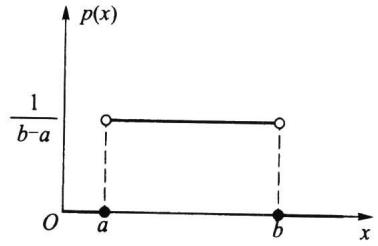  
(a) 密度函数 $p(x)$
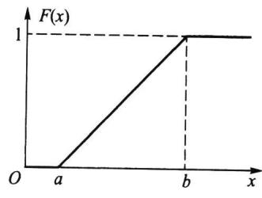  
(b) 分布函数 $F(x)$  
图2.5.3 $(a,b)$ 上的均匀分布
均匀分布又被称为平顶分布,它的背景可视作随机点 X 等可能地落在区间 $(a,b)$ 上.均匀分布在实际中经常使用,譬如一个半径为 r 的汽车轮胎,因为轮胎圆周上的任一点接触地面的可能性是相同的,所以轮胎圆周接触地面的位置 X 服从 $(0,2\pi r)$ 上的均匀分布,这只要看一看报废轮胎的四周磨损程度几乎是相同的就可明白均匀分布的含义了.

<Example title="例 2.5.4">
设随机变量 X 服从 $(0,10)$ 上的均匀分布, 现对 X 进行 4 次独立观测, 试求至少有 3 次观测值大于 5 的概率.

<Solution title="解">
设随机变量 $Y$ 是 4 次独立观测中观测值大于 5 的次数, 则 $Y \sim b(4, p)$ , 其中 $p = P(X > 5)$ . 由 $X \sim U(0, 10)$ , 知 $X$ 的密度函数为
$$
p (x) = \left\{ \begin{array}{l l} \frac {1}{1 0}, & 0 <   x <   1 0, \\ 0, & \text {其他}. \end{array} \right.
$$
所以
$$
p = P (X > 5) = \int_ {5} ^ {1 0} \frac {1}{1 0} \mathrm{d} x = \frac {1}{2},
$$
于是
$$
P (Y \geqslant 3) = \binom {4} {3} p ^ {3} (1 - p) + \binom {4} {4} p ^ {4} = 4 \left(\frac {1}{2}\right) ^ {4} + \left(\frac {1}{2}\right) ^ {4} = \frac {5}{1 6}.
$$
</Solution>
</Example>

## 二、均匀分布的数学期望和方差

设随机变量 $X \sim U(a, b)$ , 则
$$
E (X) = \int_ {a} ^ {b} \frac {x}{b - a} \mathrm{d} x = \frac {b ^ {2} - a ^ {2}}{2 (b - a)} = \frac {a + b}{2},
$$
这正是区间 $(a,b)$ 的中点.
又因为
$$
E (X ^ {2}) = \int_ {a} ^ {b} \frac {x ^ {2}}{b - a} \mathrm{d} x = \frac {b ^ {3} - a ^ {3}}{3 (b - a)} = \frac {a ^ {2} + a b + b ^ {2}}{3},
$$
由此得 $X$ 的方差为
$$
\operatorname{Var} (X) = E \left(X ^ {2}\right) - [ E (X) ] ^ {2} = \frac {a ^ {2} + a b + b ^ {2}}{3} - \frac {(a + b) ^ {2}}{4} = \frac {(b - a) ^ {2}}{1 2}.
$$
譬如,均匀分布 $U(1,5)$ 的均值 $E(X)=3$ , 方差 $\mathrm{Var}(X)=4/3$ .

## 2.5.3 指数分布

## 一、指数分布的密度函数和分布函数

若随机变量 X 的密度函数(见图2.5.4)为
$$
p (x) = \left\{ \begin{array}{l l} \lambda e ^ {- \lambda x}, & x \geqslant 0, \\ 0, & x <   0, \end{array} \right.\tag{2.5.8}
$$
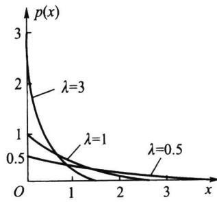
则称 X 服从指数分布, 记作 $X \sim Exp(\lambda)$ , 其中参数 $\lambda > 0$ .
指数分布的分布函数为
图2.5.4 参数为 $\lambda$ 的指数
$$
F (x) = \left\{ \begin{array}{l l} 1 - \mathrm{e} ^ {- \lambda x}, & x \geqslant 0, \\ 0, & x <   0. \end{array} \right.\tag{2.5.9}
$$
分布密度函数
指数分布是一种偏态分布,由于指数分布随机变量只可能取非负实数,所以指数分布常被用作各种“寿命”分布,譬如电子元器件的寿命、动物的寿命、电话的通话时间、随机服务系统中的等待时间等都可假定服从指数分布.指数分布在可靠性与排队论中有着广泛的应用.

## 二、指数分布的数学期望和方差

设随机变量 $X \sim Exp(\lambda)$ , 则
$$
E (X) = \int_ {0} ^ {\infty} x \lambda \mathrm{e} ^ {- \lambda x} \mathrm{d} x = \int_ {0} ^ {\infty} x \mathrm{d} (- \mathrm{e} ^ {- \lambda x}) = - x \mathrm{e} ^ {- \lambda x} \Big | _ {0} ^ {\infty} + \int_ {0} ^ {\infty} \mathrm{e} ^ {- \lambda x} \mathrm{d} x = - \frac {1}{\lambda} \mathrm{e} ^ {- \lambda x} \Big | _ {0} ^ {\infty} = \frac {1}{\lambda}.
$$
在指数分布中,有时记 $\theta=1/\lambda$ , 则 $\theta$ 为指数分布的数学期望.
又因为
$$
E (X ^ {2}) = \int_ {0} ^ {\infty} x ^ {2} \lambda \mathrm{e} ^ {- \lambda x} \mathrm{d} x = \int_ {0} ^ {\infty} x ^ {2} \mathrm{d} (- \mathrm{e} ^ {- \lambda x}) = - x ^ {2} \mathrm{e} ^ {- \lambda x} \Big | _ {0} ^ {\infty} + 2 \int_ {0} ^ {\infty} x \mathrm{e} ^ {- \lambda x} \mathrm{d} x = \frac {2}{\lambda^ {2}},
$$
由此得 $X$ 的方差为
$$
\operatorname{Var} (X) = E \left(X ^ {2}\right) - [ E (X) ] ^ {2} = \frac {2}{\lambda^ {2}} - \frac {1}{\lambda^ {2}} = \frac {1}{\lambda^ {2}}.
$$
譬如,某电子元件的寿命(单位:h)X服从指数分布 $Exp(\lambda)$ ,其中 $\lambda=0.001$ ,则平均寿命为1 000(h),方差为 $10^{6}(h^{2})$ .寿命数据的方差常是很大的.

## 三、指数分布的无记忆性

在离散分布场合下,定理 2.4.2 给出了几何分布的无记忆性,而在连续分布场合下,下面给出指数分布的无记忆性.

<Knowledge title="定理 2.5.2 指数分布的无记忆性">
如果随机变量 $X \sim Exp(\lambda)$ ，则对任意 s > 0, t >
0,有
$$
P (X > s + t \mid X > s) = P (X > t).\tag{2.5.10}
$$
上式可以理解为: 记 X 是某种产品的使用寿命(h), 若 X 服从指数分布, 那么已知此产品使用了 $s(\mathrm{h})$ 没发生故障, 则再能使用 $t(\mathrm{h})$ 而不发生故障的概率与已使用的 $s(\mathrm{h})$ 无关, 只相当于重新开始使用 $t(\mathrm{h})$ 的概率, 即对已使用过的 $s(\mathrm{h})$ 没有记忆.

<Solution title="证明">
因为 $X \sim Exp(\lambda)$ , 所以 $P(X > s) = \mathrm{e}^{-\lambda s}, s > 0$ . 又因为
$$
\{X > s + t \} \subset \{X > s \},
$$
于是条件概率
$$
P (X > s + t \mid X > s) = \frac {P (X > s + t)}{P (X > s)} = \frac {\mathrm{e} ^ {- \lambda (s + t)}}{\mathrm{e} ^ {- \lambda s}} = \mathrm{e} ^ {- \lambda t} = P (X > t).
$$
这就证明了(2.5.10)式.
以下例子说明了泊松分布与指数分布的关系.
</Solution>
</Knowledge>

<Example title="例 2.5.5">
如果某设备在长为 t 的时间 $[0, t]$ 内发生故障的次数 $N(t)$ （与时间长度 t 有关）服从参数为 $\lambda t$ 的泊松分布，则相继两次故障之间的时间间隔 T 服从参数为 $\lambda$ 的指数分布.

<Solution title="解">
设 $N(t) \sim P(\lambda t)$ , 即
$$
P (N (t) = k) = \frac {(\lambda t) ^ {k}}{k !} \mathrm{e} ^ {- \lambda t}, \qquad k = 0, 1, \dots .
$$
</Solution>
</Example>

<Note>
意到两次故障之间的时间间隔 $T$ 是非负随机变量，且事件 $\{T \geqslant t\}$ 说明此设备在 $[0, t]$ 内没有发生故障，即 $\{T \geqslant t\} = \{N(t) = 0\}$ ，由此我们得
当 t&lt;0 时,有 $F_{T}(t)=P(T\leqslant t)=0$ ;
当 $t \geqslant 0$ 时, 有
$$
F _ {T} (t) = P (T \leqslant t) = 1 - P (T > t) = 1 - P (N (t) = 0) = 1 - \mathrm{e} ^ {- \lambda t},
$$
所以 $T \sim Exp(\lambda)$ , 即相继两次故障之间的时间间隔 $T$ 服从参数为 $\lambda$ 的指数分布, 图2.5.5示意其间关系.
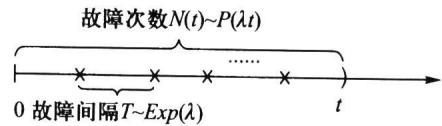  
图2.5.5 故障次数与故障间隔之间的关系
</Note>

## 2.5.4 伽马分布

## 一、伽马函数

称以下函数
$$
\Gamma (\alpha) = \int_ {0} ^ {\infty} x ^ {\alpha - 1} \mathrm{e} ^ {- x} \mathrm{d} x\tag{2.5.11}
$$
为伽马函数,其中参数 $\alpha>0$ .伽马函数具有如下性质:
1. $\Gamma(1) = 1, \Gamma\left(\frac{1}{2}\right) = \sqrt{\pi}$ .
2. $\Gamma (\alpha +1) = \alpha \Gamma (\alpha)$ （可用分部积分法证得）.当 $\alpha$ 为自然数 $n$ 时，有 $\Gamma (n + 1) = n\Gamma (n) = n!$

## 二、伽马分布

若随机变量 $X$ 的密度函数为
$$
p (x) = \left\{ \begin{array}{l l} \frac {\lambda^ {\alpha}}{\Gamma (\alpha)} x ^ {\alpha - 1} \mathrm{e} ^ {- \lambda x}, & x \geqslant 0, \\ 0, & x <   0, \end{array} \right.\tag{2.5.12}
$$
则称 $X$ 服从伽马分布, 记作 $X \sim G a(\alpha, \lambda)$ , 其中 $\alpha > 0$ 为形状参数, $\lambda > 0$ 为尺度参数. 图2.5.6给出若干条 $\lambda$ 固定、 $\alpha$ 不同的伽马分布密度函数曲线, 从图中可以看出:
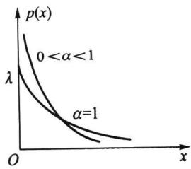
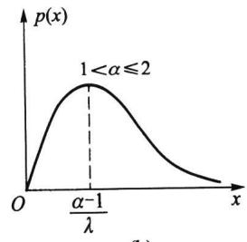
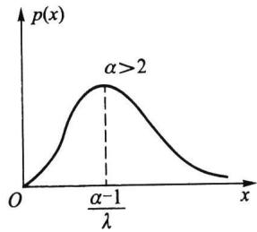  
图2.5.6 $\lambda$ 固定、不同 $\alpha$ 的伽马分布密度函数曲线
\- 当 $0 < \alpha < 1$ 时, $p(x)$ 是严格下降函数, 且在 $x = 0$ 处有奇异点.
\- 当 $\alpha = 1$ 时, $p(x)$ 是严格下降函数, 且在 $x = 0$ 处 $p(0) = \lambda$ .
\- 当 $1 < \alpha \leqslant 2$ 时, $p(x)$ 是单峰函数, 先上凸、后下凸.
\- 当 $2 < \alpha$ 时, $p(x)$ 是单峰函数, 先下凸、中间上凸、后下凸. 且 $\alpha$ 越大, $p(x)$ 越近似于正态密度函数, 但伽马分布总是偏态分布, $\alpha$ 越小其偏斜程度越严重.

## 三、伽马分布 $Ga(\alpha, \lambda)$ 的数学期望和方差

利用伽马函数的性质,不难算得伽马分布 $Ga(\alpha,\lambda)$ 的数学期望为
$$
E (X) = \frac {\lambda^ {\alpha}}{\Gamma (\alpha)} \int_ {0} ^ {\infty} x ^ {\alpha} \mathrm{e} ^ {- \lambda x} \mathrm{d} x = \frac {\Gamma (\alpha + 1)}{\Gamma (\alpha)} \frac {1}{\lambda} = \frac {\alpha}{\lambda},
$$
又因为
$$
E (X ^ {2}) = \frac {\lambda^ {\alpha}}{\Gamma (\alpha)} \int_ {0} ^ {\infty} x ^ {\alpha + 1} \mathrm{e} ^ {- \lambda x} \mathrm{d} x = \frac {\Gamma (\alpha + 2)}{\lambda^ {2} \Gamma (\alpha)} = \frac {\alpha (\alpha + 1)}{\lambda^ {2}},
$$
由此得 $X$ 的方差为
$$
\operatorname{Var} (X) = E \left(X ^ {2}\right) - [ E (X) ] ^ {2} = \frac {\alpha (\alpha + 1)}{\lambda^ {2}} - \left(\frac {\alpha}{\lambda}\right) ^ {2} = \frac {\alpha}{\lambda^ {2}}.
$$

## 四、伽马分布的两个特例

伽马分布有两个常用的特例：
(1) $\alpha=1$ 时的伽马分布就是指数分布, 即
$$
G a (1, \lambda) = E x p (\lambda).\tag{2.5.13}
$$
（2）称 $\alpha = n / 2, \lambda = 1 / 2$ 时的伽马分布是自由度为 $n$ 的 $\chi^2$ （卡方）分布，记为 $\chi^2(n)$ ，即
$$
G a \left(\frac {n}{2}, \frac {1}{2}\right) = \chi^ {2} (n),\tag{2.5.14}
$$
其密度函数为
$$
p (x) = \left\{ \begin{array}{l l} \frac {1}{2 ^ {\frac {n}{2}} \Gamma \left(\frac {n}{2}\right)} \mathrm{e} ^ {- \frac {x}{2}} x ^ {\frac {n}{2} - 1}, & x \geqslant 0, \\ 0, & x <   0. \end{array} \right.\tag{2.5.15}
$$
这里 $n$ 是 $\chi^2$ 分布的唯一参数, 称为自由度, 它可以是正实数, 但更多的是取正整数, $\chi^2$ 分布是统计应用中的一个重要分布.
因为 $\chi^2$ 分布是特殊的伽马分布, 故由伽马分布的期望和方差, 很容易得到 $\chi^2$ 分布的期望和方差为
$$
E (X) = n, \qquad \operatorname{Var} (X) = 2 n.
$$

<Example title="例 2.5.6">
电子产品的失效常常是由于外界的“冲击引起”. 若在 $(0, t)$ 内发生冲击的次数 $N(t)$ 服从参数为 $\lambda t$ 的泊松分布, 试证第 n 次冲击来到的时间 $S_{n}$ 服从伽马分布 $Ga(n, \lambda)$ .

<Solution title="证明">
因为事件“第 $n$ 次冲击来到的时间 $S_{n}$ 小于等于 $t$ ”等价于事件“(0, t)内发生冲击的次数 $N(t)$ 大于等于 $n$ ”，即
$$
\{S _ {n} \leqslant t \} = \{N (t) \geqslant n \}.
$$
于是, $S_{n}$ 的分布函数为
$$
F (t) = P (S _ {n} \leqslant t) = P (N (t) \geqslant n) = \sum_ {k = n} ^ {\infty} \frac {(\lambda t) ^ {k}}{k !} \mathrm{e} ^ {- \lambda t}.
$$
用分部积分法可以验证下列等式
$$
\sum_ {k = 0} ^ {n - 1} \frac {(\lambda t) ^ {k}}{k !} \mathrm{e} ^ {- \lambda t} = \frac {\lambda^ {n}}{\Gamma (n)} \int_ {t} ^ {\infty} x ^ {n - 1} \mathrm{e} ^ {- \lambda x} \mathrm{d} x.\tag{2.5.16}
$$
所以
$$
F (t) = \frac {\lambda^ {n}}{\Gamma (n)} \int_ {0} ^ {t} x ^ {n - 1} \mathrm{e} ^ {- \lambda x} \mathrm{d} x,
$$
这就表明 $S_{n} \sim Ga(n, \lambda)$ . 证毕.
</Solution>
</Example>

## 2.5.5 贝塔分布

## 一、贝塔函数

称以下函数
$$
\mathrm{B} (a, b) = \int_ {0} ^ {1} x ^ {a - 1} (1 - x) ^ {b - 1} \mathrm{d} x\tag{2.5.17}
$$
为贝塔函数,其中参数 a>0,b>0.
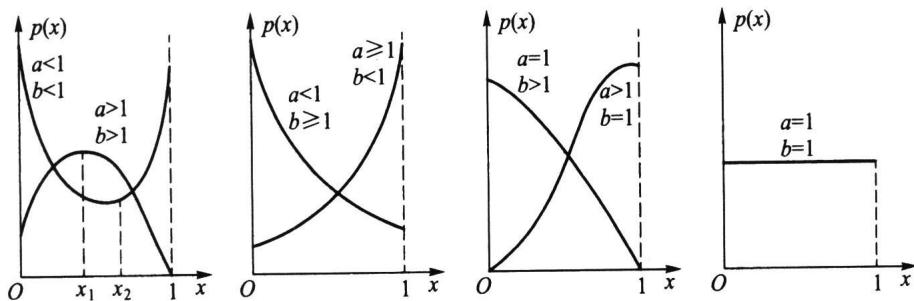  
图 2.5.7 贝塔分布密度函数曲线
贝塔函数具有如下性质：
(1) $\mathrm{B}(a, b) = \mathrm{B}(b, a)$ .

<Solution title="证明">
在(2.5.17)的积分中令 y=1-x，即得
$$
\mathrm{B} (a, b) = \int_ {1} ^ {0} (1 - y) ^ {a - 1} y ^ {b - 1} (- \mathrm{d} y) = \int_ {0} ^ {1} (1 - y) ^ {a - 1} y ^ {b - 1} \mathrm{d} y = \mathrm{B} (b, a).
$$
(2) 贝塔函数与伽马函数间有关系
$$
\mathrm{B} (a, b) = \frac {\Gamma (a) \Gamma (b)}{\Gamma (a + b)}.\tag{2.5.18}
$$
</Solution>

<Solution title="证明">
由伽马函数的定义知
$$
\Gamma (a) \Gamma (b) = \int_ {0} ^ {\infty} \int_ {0} ^ {\infty} x ^ {a - 1} y ^ {b - 1} \mathrm{e} ^ {- (x + y)} \mathrm{d} x \mathrm{d} y,
$$
作变量变换 $x = uv, y = u(1 - v)$ ，其雅可比行列式 $J = -u$ . 故
$$
\begin{array}{r l} \Gamma (a) \Gamma (b) & = \int_ {0} ^ {1} \int_ {0} ^ {\infty} (u v) ^ {a - 1} [ u (1 - v) ] ^ {b - 1} e ^ {- u} u d u d v \\ & = \int_ {0} ^ {\infty} u ^ {a + b - 1} e ^ {- u} d u \int_ {0} ^ {1} v ^ {a - 1} (1 - v) ^ {b - 1} d v \\ & = \Gamma (a + b) B (a, b), \end{array}
$$
由此证得(2.5.18)式.
</Solution>

## 二、贝塔分布

若随机变量 $X$ 的密度函数为
$$
p (x) = \left\{ \begin{array}{l l} \frac {\Gamma (a + b)}{\Gamma (a) \Gamma (b)} x ^ {a - 1} (1 - x) ^ {b - 1}, & 0 <   x <   1, \\ 0, & \text {其他}, \end{array} \right.\tag{2.5.19}
$$
则称 $X$ 服从贝塔分布, 记作 $X \sim Be(a, b)$ , 其中 $a > 0, b > 0$ 都是形状参数. 图2.5.7给出几种典型的贝塔分布密度函数曲线.
从上图可以看出：
\- 当 $a < 1, b < 1$ 时， $p(x)$ 是下凸的 U 形函数.
\- 当 $a > 1, b > 1$ 时， $p(x)$ 是上凸的单峰函数.
\- 当 $a < 1, b \geqslant 1$ 时， $p(x)$ 是下凸的单调减函数.
\- 当 $a \geqslant 1, b < 1$ 时， $p(x)$ 是下凸的单调增函数.
\- 当 $a = 1, b = 1$ 时， $Be(1,1) = U(0,1)$ .
因为服从贝塔分布 $Be(a, b)$ 的随机变量是仅在区间 $(0, 1)$ 取值的，所以不合格品率、机器的维修率、市场的占有率、射击的命中率等各种比率选用贝塔分布作为它们的概率分布是恰当的，只要选择合适的参数 $a$ 与 $b$ 即可.

## 三、贝塔分布 $Be(a, b)$ 的数学期望和方差

利用贝塔函数的性质,不难算得贝塔分布 $Be(a,b)$ 的数学期望为
$$
E (X) = \frac {\Gamma (a + b)}{\Gamma (a) \Gamma (b)} \int_ {0} ^ {1} x ^ {a} (1 - x) ^ {b - 1} \mathrm{d} x = \frac {\Gamma (a + b)}{\Gamma (a) \Gamma (b)} \cdot \frac {\Gamma (a + 1) \Gamma (b)}{\Gamma (a + b + 1)} = \frac {a}{a + b}.
$$
又因为
$$
\begin{array}{r l} E (X ^ {2}) & = \frac {\Gamma (a + b)}{\Gamma (a) \Gamma (b)} \int_ {0} ^ {1} x ^ {a + 1} (1 - x) ^ {b - 1} \mathrm{d} x = \frac {\Gamma (a + b)}{\Gamma (a) \Gamma (b)} \cdot \frac {\Gamma (a + 2) \Gamma (b)}{\Gamma (a + b + 2)} \\ & = \frac {a (a + 1)}{(a + b) (a + b + 1)}. \end{array}
$$
由此得 $X$ 的方差为
$$
\operatorname{Var} (X) = \frac {a (a + 1)}{(a + b) (a + b + 1)} - \left(\frac {a}{a + b}\right) ^ {2} = \frac {a b}{(a + b) ^ {2} (a + b + 1)}.
$$
以下我们将常用分布及其期望和方差以表格形式放在一起.
<table><tr><td>分布</td><td>分布列 $p_{k}$ 或分布密度 $p(x)$ </td><td>期望</td><td>方差</td></tr><tr><td>0-1分布</td><td> $p_{k}=p^{k}(1-p)^{1-k},\quad k=0,1$ </td><td> $p$ </td><td> $p(1-p)$ </td></tr><tr><td>二项分布 $b(n,p)$ </td><td> $p_{k}=\binom{n}{k}p^{k}(1-p)^{n-k},\quad k=0,1,\cdots,n$ </td><td> $np$ </td><td> $np(1-p)$ </td></tr><tr><td>泊松分布 $P(\lambda)$ </td><td> $p_{k}=\frac{\lambda^{k}}{k!}\mathrm{e}^{-\lambda},\quad k=0,1,\cdots$ </td><td> $\lambda$ </td><td> $\lambda$ </td></tr><tr><td>超几何分布 $h(n,N,M)$ </td><td> $p_{k}=\frac{\binom{M}{k}\binom{N-M}{n-k}}{\binom{N}{n}},\quad k=0,1,\cdots,r,\quad r=\min\{M,n\}$ </td><td> $n\frac{M}{N}$ </td><td> $\frac{nM(N-M)(N-n)}{N^{2}(N-1)}$ </td></tr><tr><td>几何分布 $Ge(p)$ </td><td> $p_{k}=(1-p)^{k-1}p,\quad k=1,2,\cdots$ </td><td> $\frac{1}{p}$ </td><td> $\frac{1-p}{p^{2}}$ </td></tr><tr><td>负二项分布 $Nb(r,p)$ </td><td> $p_{k}=\binom{k-1}{r-1}(1-p)^{k-r}p^{r},\quad k=r,r+1,\cdots$ </td><td> $\frac{r}{p}$ </td><td> $\frac{r(1-p)}{p^{2}}$ </td></tr><tr><td>正态分布 $N(\mu,\sigma^{2})$ </td><td> $p(x)=\frac{1}{\sqrt{2\pi}\sigma}\exp\left\{-\frac{(x-\mu)^{2}}{2\sigma^{2}}\right\},\quad -\infty< x< \infty$ </td><td> $\mu$ </td><td> $\sigma^{2}$ </td></tr><tr><td>均匀分布 $U(a,b)$ </td><td> $p(x)=\frac{1}{b-a},\quad a < x < b$ </td><td> $\frac{a+b}{2}$ </td><td> $\frac{(b-a)^{2}}{12}$ </td></tr><tr><td>分布</td><td>分布列 $p_k$ 或分布密度 $p(x)$ </td><td>期望</td><td>方差</td></tr><tr><td>指数分布 $Exp(\lambda)$ </td><td> $p(x)=\lambda e^{-\lambda x},\quad x\geqslant0$ </td><td> $\frac{1}{\lambda}$ </td><td> $\frac{1}{\lambda^2}$ </td></tr><tr><td>伽马分布 $Ga(\alpha,\lambda)$ </td><td> $p(x)=\frac{\lambda^\alpha}{\Gamma(\alpha)}x^{\alpha-1}e^{-\lambda x},\quad x\geqslant0$ </td><td> $\frac{\alpha}{\lambda}$ </td><td> $\frac{\alpha}{\lambda^2}$ </td></tr><tr><td> $\chi^2(n)$ 分布</td><td> $p(x)=\frac{x^{n/2-1}e^{-x/2}}{\Gamma(n/2)2^{n/2}},\quad x\geqslant0$ </td><td> $n$ </td><td> $2n$ </td></tr><tr><td>贝塔分布 $Be(a,b)$ </td><td> $p(x)=\frac{\Gamma(a+b)}{\Gamma(a)\Gamma(b)}x^{a-1}(1-x)^{b-1},\quad 0 < x < 1$ </td><td> $\frac{a}{a+b}$ </td><td> $\frac{ab}{(a+b)^2(a+b+1)}$ </td></tr><tr><td>对数正态分布 $LN(\mu,\sigma^2)$ </td><td> $p(x)=\frac{1}{\sqrt{2\pi}\sigma x}\exp\left\{-\frac{(\ln x-\mu)^2}{2\sigma^2}\right\},\quad x>0$ </td><td> $e^{\mu+\sigma^2/2}$ </td><td> $e^{2\mu+\sigma^2}(e^{\sigma^2}-1)$ </td></tr><tr><td>柯西分布 $\text{Cau}(\mu,\lambda)$ </td><td> $p(x)=\frac{1}{\pi}\frac{\lambda}{\lambda^2+(x-\mu)^2},-\infty<x<\infty$ </td><td>不存在</td><td>不存在</td></tr><tr><td>韦布尔分布</td><td> $p(x)=F'(x),F(x)=1-\exp\left\{-\left(\frac{x}{\eta}\right)^m\right\},x>0$ </td><td> $\eta\Gamma\left(1+\frac{1}{m}\right)$ </td><td> $\eta^2\left[\Gamma\left(1+\frac{2}{m}\right)-\Gamma^2\left(1+\frac{1}{m}\right)\right]$ </td></tr></table>

<Note>
表中仅列出各分布密度函数的非零区域.
</Note>

<Block title="习题2.5">
1. 设随机变量 X 服从区间 $(2,5)$ 上的均匀分布，求对 X 进行 3 次独立观测中，至少有 2 次的观测值大于 3 的概率.
2. 在 $(0,1)$ 上任取一点记为 $X$ ，试求 $P\left(X^2 - \frac{3}{4} X + \frac{1}{8} \geqslant 0\right)$ .
3. 设 K 服从 $(1,6)$ 上的均匀分布, 求方程 $x + Kx + 1 = 0$ 有实根的概率.
4. 若随机变量 $K \sim N(\mu, \sigma^2)$ , 而方程 $x^2 + 4x + K = 0$ 无实根的概率为 0.5, 试求 $\mu$ .
5. 设流经一个 $2\Omega$ 电阻上的电流强度 $I$ 是一个随机变量, 它均匀分布在 $9\mathrm{A}$ 至 $11\mathrm{A}$ 之间. 试求此电阻上消耗的平均功率, 其中功率 $W = 2I^2$ .
6. 某种圆盘的直径在区间 $(a, b)$ 上服从均匀分布, 试求此种圆盘的平均面积.
7. 设某种商品每周的需求量 X 服从区间 (10,30) 上均匀分布，而商店进货数为区间 (10,30) 中的某一整数，商店每销售 1 单位商品可获利 500 元；若供大于求则降价处理，每处理 1 单位商品亏损 100 元；若供不应求，则可从外部调剂供应，此时每 1 单位商品仅获利 300 元。为使商店所获利润期望值不少于 9280 元，试确定最少进货量。
8. 统计调查表明, 英格兰 1875 年至 1951 年期间在矿山发生 10 人或 10 人以上死亡的两次事故之间的时间 T (以日计) 服从均值为 241 的指数分布. 试求 $P(50 < T < 100)$ .
9. 若一次电话通话时间 X (以 min 计) 服从参数为 0.25 的指数分布, 试求一次通话的平均时间.
10. 某种设备的使用寿命 X（以年计）服从指数分布，其平均寿命为 4 年。制造此种设备的厂家规定，若设备在使用一年之内损坏，则可以予以调换。如果设备制造厂每售出一台设备可赢利 100 元，而调换一台设备制造厂需花费 300 元. 试求每台设备的平均利润.
11. 设顾客在某银行的窗口等待服务的时间 X (以 min 计) 服从指数分布, 其密度函数为
$$
p (x) = \left\{ \begin{array}{l l} \frac {1}{5} \mathrm{e} ^ {- \frac {x}{5}}, & x > 0, \\ 0, & \text {其他}. \end{array} \right.
$$
某顾客在窗口等待服务,若超过 10 min 他就离开.他一年要到银行 5 次,以 Y 表示一年内他未等到服务而离开窗口的次数,试求 $P(Y \geqslant 1)$ .
12. 某仪器装了 3 个独立工作的同型号电子元件, 其寿命 $X$ (以 h 计) 都服从同一指数分布, 密度函数为
$$
p (x) = \left\{ \begin{array}{l l} \frac {1}{6 0 0} \mathrm{e} ^ {- \frac {x}{6 0 0}}, & x > 0, \\ 0, & \text {其他}. \end{array} \right.
$$
试求: 此仪器在最初使用的 200 h 内, 至少有一个此种电子元件损坏的概率.
13. 设随机变量 $X$ 的密度函数为
$$
p (x) = \left\{ \begin{array}{l l} \lambda e ^ {- \lambda x}, & x > 0, \\ 0, & x \leqslant 0 \end{array} \right. \quad (\lambda > 0).
$$
试求 k, 使得 $P(X > k) = 0.5$ .
14. 设随机变量 $X$ 的密度函数为
$$
p \left(  x  \right)   =   \left\{ \begin{array}{l l} {1 / 3  ,} & {0 \leqslant x \leqslant 1  ,} \\ {2 / 9  ,} & {3 \leqslant x \leqslant 6  ,} \\ {0  ,} & {\text {其他}.} \end{array} \right.
$$
若 $P(X \geqslant k) = 2 / 3$ ，试求 $k$ 的取值范围.
15. 写出以下正态分布的均值和标准差：
$$
p _ {1} (x) = \frac {1}{\sqrt {\pi}} \mathrm{e} ^ {- (x ^ {2} + 4 x + 4)}, \quad p _ {2} (x) = \sqrt {\frac {2}{\pi}} \mathrm{e} ^ {- 2 x ^ {2}}, \quad p _ {3} (x) = \frac {1}{\sqrt {\pi}} \mathrm{e} ^ {- x ^ {2}}.
$$
16. 某地区 18 岁女青年的血压 X（收缩压，以 mmHg 计）服从 $N(110, 12^{2})$ . 试求该地区 18 岁女青年的血压在 100 至 120 的可能性有多大？
17. 某地区成年男子的体重 $X$ （以 $\mathrm{kg}$ 计）服从正态分布 $N(\mu, \sigma^2)$ . 若已知 $P(X \leqslant 70) = 0.5$ , $P(X \leqslant 60) = 0.25$ .
(1) 求 $\mu$ 与 $\sigma$ 各为多少？
(2) 若在这个地区随机地选出 5 名成年男子, 问其中至少有两人体重超过 $65 \mathrm{~kg}$ 的概率是多少?
18. 由某机器生产的螺栓的长度(以 cm 计)服从正态分布 $N(10.05, 0.06^{2})$ ，若规定长度在范围 $(10.05 \pm 0.12)$ cm 内为合格品，求螺栓不合格的概率.
19. 某地抽样调查结果表明,考生的外语成绩(以百分制计)近似地服从 $\mu=72$ 的正态分布,已知96分以上的人数占总数的2.3%,试求考生的成绩大于等于60分的概率.
20. 设随机变量 $X \sim N(3, 2^{2})$ .
(1) 求 $P(2<X \leqslant 5)$ ; (2) 求 $P(|X|>2)$ ; (3) 确定 c 使得 $P(X>c)=P(X<c)$ .
21. 若随机变量 $X \sim N(4,3^{2})$ .
(1) 求 $P(-2<X \leqslant 10)$ ; (2) 求 $P(X>3)$ ; (3) 设 d 满足 $P(X>d) \geqslant 0.9$ , 问 d 至多为多少?
22. 测量到某一目标的距离时, 发生的随机误差 X (以 m 计) 具有密度函数
$$
p (x) = \frac {1}{4 0 \sqrt {2 \pi}} \mathrm{e} ^ {- \frac {(x - 2 0) ^ {2}}{3 2 0 0}}, \quad - \infty <   x <   \infty .
$$
求在三次测量中,至少有一次误差的绝对值不超过 $30 \, m$ 的概率.
23. 从甲地飞往乙地的航班, 每天上午 10:10 起飞, 飞行时间 X 服从均值是 4h, 标准差是 20 min 的正态分布.
(1) 该机在下午 2:30 以后到达乙地的概率是多少?
(2) 该机在下午 2:20 以前到达乙地的概率是多少?
(3) 该机在下午 1:50 至 2:30 之间到达乙地的概率是多少?
24. 在某场招聘人员的考试中, 共有 10 000 人报考. 假设考试成绩服从正态分布, 且已知 90 分以上有 359 人, 60 分以下有 1 151 人. 现按考试成绩从高分到低分依次录用 2 500 人, 试问被录用者中最低分为多少?
25. 设随机变量 X 服从正态分布 $N(60,3^{2})$ ，试求实数 a, b, c, d 使得 X 落在如下五个区间中的概率之比为 7:24:38:24:7.
$$
(- \infty , a ], \quad (a, b ], \quad (b, c ], \quad (c, d ], \quad (d, \infty).
$$
26. 设随机变量 $X$ 与 $Y$ 均服从正态分布, $X$ 服从正态分布 $N(\mu, 4^2)$ , $Y$ 服从正态分布 $N(\mu, 5^2)$ , 试比较以下 $p_1$ 和 $p_2$ 的大小.
$$
p _ {1} = P \{X \leqslant \mu - 4 \}, \quad p _ {2} = P \{Y \geqslant \mu + 5 \}.
$$
27. 设随机变量 X 服从正态分布 $N(0, \sigma^{2})$ ，若 $P(|X| > k) = 0.1$ ，试求 $P(X < k)$ .
28. 设随机变量 $X$ 服从正态分布 $N(\mu, \sigma^2)$ , 试问: 随着 $\sigma$ 的增大, 概率 $P(|X - \mu| < \sigma)$ 是如何变化的?
29. 设随机变量 $X$ 服从参数为 $\mu = 160$ 和 $\sigma$ 的正态分布, 若要求 $P(120 < X \leqslant 200) \geqslant 0.90$ , 允许 $\sigma$ 最大为多少?
30. 设随机变量 $X \sim N(\mu, \sigma^{2})$ ，求 $E(|X - \mu|)$ .
31. 设随机变量 $X \sim N(0, \sigma^2)$ ，证明 $E(|X|) = \sigma \sqrt{\frac{2}{\pi}}$ .
32. 设随机变量 X 服从伽马分布 $Ga(2,0.5)$ ，试求 $P(X<4)$ .
33. 某地区漏缴税款的比例 X 服从参数 a=2, b=9 的贝塔分布, 试求此比例小于 10% 的概率及平均漏缴税款的比例.
34. 某班级学生中数学成绩不及格的比率 $X$ 服从 $a = 1, b = 4$ 的贝塔分布，试求 $P(X > E(X))$ .
</Block>
