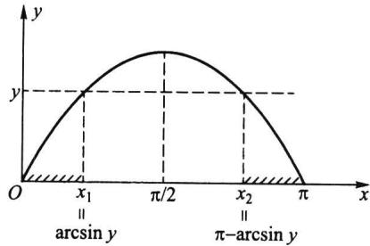

import Guide from '@/components/Guide.astro';
import Knowledge from '@/components/Knowledge.astro';
import Example from '@/components/Example.astro';
import Analysis from '@/components/Analysis.astro';
import Solution from '@/components/Solution.astro';
import Variant from '@/components/Variant.astro';
import Note from '@/components/Note.astro';
import Block from '@/components/Block.astro';
import Method from '@/components/Method.astro';
import Exercise from '@/components/Exercise.astro';

设 $y = g(x)$ 是定义在 $\mathbb{R}$ 上的一个函数, $X$ 是一个随机变量, 那么 $Y = g(X)$ 作为 $X$ 的函数, 同样也是一个随机变量. 在实际问题中, 我们经常感兴趣的问题是: 已知随机变量 $X$ 的分布, 如何求出另一个随机变量 $Y = g(X)$ 的分布.
寻求随机变量函数的分布,是概率论的基本技巧,在概率论与数理统计中经常要用到这些技巧.下面对离散和连续两种场合分别讨论随机变量函数的分布.

## 2.6.1 离散随机变量函数的分布

离散随机变量函数的分布是比较容易求得的. 设 $X$ 是离散随机变量, $X$ 的分布列为
<table><tr><td>X</td><td> $x_{1}$ </td><td> $x_{2}$ </td><td>...</td><td> $x_{n}$ </td><td>...</td></tr><tr><td>P</td><td> $p(x_{1})$ </td><td> $p(x_{2})$ </td><td>...</td><td> $p(x_{n})$ </td><td>...</td></tr></table>
显然 $Y = g(X)$ 也是一个离散随机变量，此时 $Y$ 的分布列就可以很简单地表示为
$$
\begin{array}{c c c c c c} Y & g (x _ {1}) & g (x _ {2}) & \dots & g (x _ {n}) & \dots \\ \hline P & p (x _ {1}) & p (x _ {2}) & \dots & p (x _ {n}) & \dots \end{array}
$$
当 $g(x_{1}), g(x_{2}), \cdots, g(x_{n}), \cdots$ 中有某些值相等时，则把那些相等的值分别合并，并把对应的概率相加即可.

<Example title="例 2.6.1">
已知随机变量 X 的分布列如下, 求 $Y = X^{2} + X$ 的分布列.
<table><tr><td>X</td><td>-2</td><td>-1</td><td>0</td><td>1</td><td>2</td></tr><tr><td>P</td><td>0.2</td><td>0.1</td><td>0.1</td><td>0.3</td><td>0.3</td></tr></table>

<Solution title="解">
$Y = X^{2} + X$ 的分布列为
<table><tr><td>Y</td><td>2</td><td>0</td><td>0</td><td>2</td><td>6</td></tr><tr><td>P</td><td>0.2</td><td>0.1</td><td>0.1</td><td>0.3</td><td>0.3</td></tr></table>
再对相等的值合并,得
<table><tr><td>Y</td><td>0</td><td>2</td><td>6</td></tr><tr><td>P</td><td>0.2</td><td>0.5</td><td>0.3</td></tr></table>
</Solution>
</Example>

## 2.6.2 连续随机变量函数的分布

离散随机变量的函数仍是一个离散随机变量.但连续随机变量 $X$ 的函数 $Y = g(X)$ 不一定为连续随机变量,以下我们分几种情况讨论 $Y = g(X)$ 的分布.

## 一、当 $Y = g(X)$ 为离散随机变量

在这种情况下, 只须将 $Y$ 的可能取值一一列出, 再将 $Y$ 取各种可能值的概率求出即可. 例如, 设 $X \sim N(\mu, \sigma^2)$ ,
$$
Y = \left\{ \begin{array}{l l} 0, & X <   \mu , \\ 1, & X \geqslant \mu . \end{array} \right.
$$
则很容易计算得: Y 服从 p=0.5 的 0-1 分布.

## 二、当 $g(x)$ 为严格单调函数时

在这种情况下有以下定理：

<Knowledge title="定理 2.6.1">
设 X 是连续随机变量, 其密度函数为 $p_{X}(x)$ . $Y = g(X)$ 是另一个连续随机变量. 若 $y = g(x)$ 严格单调, 其反函数 $h(y)$ 有连续导函数, 则 $Y = g(X)$ 的密度函数为
$$
p _ {_ Y} (y) = \left\{ \begin{array}{l l} p _ {_ X} [ h (y) ] | h ^ {\prime} (y) |, & a <   y <   b, \\ 0, & \text {其他}. \end{array} \right.\tag{2.6.1}
$$
其中 $a = \min \{g(-\infty), g(\infty)\}, b = \max \{g(-\infty), g(\infty)\}$ .

<Solution title="证明">
不妨设 $g(x)$ 是严格单调增函数, 这时它的反函数 $h(y)$ 也是严格单调增函数, 且 $h'(y) > 0$ . 记 $a = g(-\infty), b = g(\infty)$ , 这意味着 $y = g(x)$ 仅在区间 $(a, b)$ 取值, 于是
当 $y < a$ 时，
$$
F _ {_ Y} (y) = P (Y \leqslant y) = 0;
$$
当 $y > b$ 时，
$$
F _ {_ Y} (y) = P (Y \leqslant y) = 1;
$$
当 $a \leqslant y \leqslant b$ 时，
$$
F _ {_ Y} (y) = P (Y \leqslant y) = P (g (X) \leqslant y) = P (X \leqslant h (y)) = \int_ {- \infty} ^ {h (y)} p _ {_ X} (x) \mathrm{d} x.
$$
由此得 $Y$ 的密度函数为
$$
p _ {Y} (y) = \left\{ \begin{array}{l l} p _ {X} [ h (y) ] h ^ {\prime} (y), & a <   y <   b, \\ 0, & \text {其他}. \end{array} \right.
$$
同理可证当 $g(x)$ 是严格单调减函数时，结论也成立.但此时要注意 $h^{\prime}(y) < 0$ ，故要加绝对值符号，这时 $a = g(\infty), b = g(-\infty)$ .综上所述，定理得证.
利用以上定理,我们来证明几个很有用的结论,并用定理形式表示.
</Solution>
</Knowledge>

<Knowledge title="定理 2.6.2">
设随机变量 X 服从正态分布 $N(\mu, \sigma^{2})$ ，则当 $a \neq 0$ 时，有 $Y = aX + b \sim N(a\mu + b, a^{2}\sigma^{2})$ .

<Solution title="证明">
当 $a > 0$ 时, $Y = aX + b$ 是严格增函数, 仍在 $(- \infty, \infty)$ 上取值, 其反函数为 $X = (Y - b) / a$ , 由定理2.6.1可得
$$
\begin{array}{r l} p _ {Y} (y) & = p _ {X} \left(\frac {y - b}{a}\right) \frac {1}{a} = \frac {1}{\sqrt {2 \pi} \sigma} \exp \left\{- \frac {1}{2 \sigma^ {2}} \left(\frac {y - b}{a} - \mu\right) ^ {2} \right\} \frac {1}{a} \\ & = \frac {1}{\sqrt {2 \pi} (a \sigma)} \exp \left\{- \frac {(y - a \mu - b) ^ {2}}{2 a ^ {2} \sigma^ {2}} \right\}. \end{array}
$$
这就是正态分布 $N(a\mu+b,a^{2}\sigma^{2})$ 的密度函数.
当 $a < 0$ 时, $Y = aX + b$ 是严格减函数, 仍在 $(-\infty, \infty)$ 上取值, 其反函数为 $X = (Y - b) / a$ , 由定理2.6.1可得
$$
p _ {Y} (y) = \frac {1}{\sqrt {2 \pi} | a | \sigma} \exp \left\{- \frac {(y - a \mu - b) ^ {2}}{2 a ^ {2} \sigma^ {2}} \right\}.
$$
这是正态分布 $N(a\mu+b, a^{2}\sigma^{2})$ 的密度函数, 结论得证.
这个定理表明: 正态变量的线性变换仍为正态变量, 其数学期望和方差可直接从线性变换求得. 若取 $a = 1/\sigma, b = -\mu/\sigma$ , 则 $Y = aX + b \sim N(0, 1)$ , 此即上一节的定理 2.5.1.
</Solution>
</Knowledge>

<Example title="例 2.6.2 1">
设随机变量 $X \sim N(10, 2^{2})$ ，试求 $Y = 3X + 5$ 的分布；
(2) 设随机变量 $X \sim N(0, 2^{2})$ ，试求 Y = -X 的分布.

<Solution title="解">
（1）由定理2.6.2知 $Y$ 仍是正态变量，其数学期望和方差分别为
$$
E (Y) = E (3 X + 5) = 3 \times 1 0 + 5 = 3 5,
$$
$$
\operatorname{Var} (Y) = \operatorname{Var} (3 X + 5) = 9 \times 2 ^ {2} = 3 6.
$$
所以 $Y=3X+5$ 的分布为 $N(35,6^{2})$ .
(2) $Y$ 仍是正态变量, 其数学期望和方差分别为
$$
E (Y) = E (- X) = 0,
$$
$$
\operatorname{Var} (Y) = \operatorname{Var} (- X) = 2 ^ {2}.
$$
所以 $Y = -X$ 的分布仍为 $N(0,2^2)$ . 这表明 $X$ 与 $-X$ 有相同的分布, 但这两个随机变量是不相等的. 所以我们要明确, 分布相同与随机变量相等是两个完全不同的概念.
</Solution>
</Example>

<Knowledge title="定理 2.6.3 对数正态分布">
设随机变量 $X \sim N(\mu, \sigma^{2})$ ，则 $Y = e^{X}$ 的概率密度函数为
$$
p _ {Y} (y) = \left\{ \begin{array}{l l} \frac {1}{\sqrt {2 \pi} y \sigma} \exp \left\{- \frac {\left(\ln y - \mu\right) ^ {2}}{2 \sigma^ {2}} \right\}, & y > 0, \\ 0, & y \leqslant 0. \end{array} \right.\tag{2.6.2}
$$

<Solution title="证明">
$y = \mathrm{e}^{x}$ 是严格增函数, 它仅在 $(0, \infty)$ 上取值, 其反函数为 $x = \ln y$ , 由定理2.6.1可得
当 $y \leqslant 0$ 时， $F_{y}(y) = 0$ ，从而 $p_{y}(y) = 0$ .
当 y>0 时, Y 的密度函数为
$$
p _ {Y} (y) = \frac {1}{\sqrt {2 \pi} \sigma} \exp \left\{- \frac {\left(\ln y - \mu\right) ^ {2}}{2 \sigma^ {2}} \right\} \frac {1}{y} = \frac {1}{\sqrt {2 \pi} y \sigma} \exp \left\{- \frac {\left(\ln y - \mu\right) ^ {2}}{2 \sigma^ {2}} \right\}.
$$
定理得证.
这个分布被称为对数正态分布,记为 $LN(\mu, \sigma^2)$ ,其中 $\mu$ 称为对数均值, $\sigma^2$ 称为对数方差.对数正态分布 $LN(\mu, \sigma^2)$ 是一个偏态分布,也是一个常用分布,实际中有不少随机变量服从对数正态分布,譬如
\- 绝缘材料的寿命服从对数正态分布.
\- 设备故障的维修时间服从对数正态分布.
\- 家中仅有两个小孩的年龄差服从对数正态分布.
</Solution>
</Knowledge>

<Knowledge title="定理 2.6.4">
设随机变量 X 服从伽马分布 $Ga(\alpha, \lambda)$ ，则当 k > 0 时，有 $Y = kX \sim Ga(\alpha, \lambda/k)$ .

<Solution title="证明">
因为 $k > 0$ ，所以 $y = kx$ 是严格增函数，它仍在 $(0, \infty)$ 上取值，其反函数为 $x = y / k$ ，由定理2.6.1可得
当 y&lt;0 时， $p_{y}(y)=0$ .
当 $y \geqslant 0$ 时，
$$
p _ {Y} (y) = p _ {X} \left(\frac {y}{k}\right) \frac {1}{k} = \frac {\lambda^ {\alpha}}{k \Gamma (\alpha)} \left(\frac {y}{k}\right) ^ {\alpha - 1} \exp \left\{- \lambda \frac {y}{k} \right\} = \frac {(\lambda / k) ^ {\alpha}}{\Gamma (\alpha)} y ^ {\alpha - 1} \exp \left\{- \frac {\lambda}{k} y \right\}.
$$
此即 $Ga(\alpha,\lambda/k)$ 的密度函数, 结论得证.
这个结论是很有用的,譬如当 $X \sim Ga(\alpha, \lambda)$ , 则 $2\lambda X \sim Ga(\alpha, 1/2) = \chi^{2}(2\alpha)$ , 即任一伽玛分布可转化为 $\chi^{2}$ 分布.
</Solution>
</Knowledge>

<Knowledge title="定理 2.6.5">
若随机变量 X 的分布函数 $F_{X}(x)$ 为严格单调增的连续函数, 其反函数 $F_{X}^{-1}(y)$ 存在, 则 $Y = F_{X}(X)$ 服从 $(0,1)$ 上的均匀分布 $U(0,1)$ .

<Solution title="证明">
下求 $Y = F_{x}(X)$ 的分布函数. 由于分布函数 $F_{x}(x)$ 仅在 $[0,1]$ 区间上取值, 故当 $y < 0$ 时, 因为 $\{F_{x}(X) \leqslant y\}$ 是不可能事件, 所以
$$
F _ {_ Y} (y) = P (Y \leqslant y) = P (F _ {_ X} (X) \leqslant y) = 0.
$$
当 $0 \leqslant y < 1$ 时，有
$$
F _ {Y} (y) = P (Y \leqslant y) = P (F _ {X} (X) \leqslant y) = P (X \leqslant F _ {X} ^ {- 1} (y)) = F _ {X} (F _ {X} ^ {- 1} (y)) = y.
$$
当 $y \geqslant 1$ 时, 因为 $\{F_{x}(X) \leqslant y\}$ 是必然事件, 所以
$$
F _ {_ Y} (y) = P (Y \leqslant y) = P (F _ {_ X} (X) \leqslant y) = 1.
$$
</Solution>
</Knowledge>

综上所述, $Y=F_{x}(X)$ 的分布函数为
$$
F _ {y} (y) = \left\{ \begin{array}{l l} 0, & y <   0, \\ y, & 0 \leqslant y <   1, \\ 1, & y \geqslant 1. \end{array} \right.
$$
这正是(0,1)上均匀分布的分布函数,所以 $Y \sim U(0,1)$ .
这个定理表明:均匀分布在连续分布类中占有特殊地位.任一个连续随机变量 X 都可通过其分布函数 $F(x)$ 与均匀分布随机变量 U 发生关系.譬如 X 服从指数分布 $Exp(\lambda)$ ，其分布函数为 $F(x)=1-\mathrm{e}^{-\lambda x}$ ，当 x 换为 X 后，有
$$
U = 1 - \mathrm{e} ^ {- \lambda X} \qquad \text {或} \qquad X = \frac {1}{\lambda} \ln \frac {1}{1 - U}.
$$
后一式表明:由均匀分布 $U(0,1)$ 的随机数(伪观察值) $u_{i}$ 可得指数分布 $Exp(\lambda)$ 的随机数 $x_{i}=\frac{1}{\lambda}\ln\frac{1}{1-u_{i}}, i=1,2,\cdots,n,\cdots$ . 而均匀分布随机数在任一个统计软件中都可产生, 从而指数分布(继而其他分布)随机数也可获得. 而各种分布随机数的获得是进行随机模拟法(又称蒙特卡罗法)的基础.

## 三、当 $g(x)$ 为其他形式时

当使用定理2.6.1寻求连续随机变量 $Y = g(X)$ 的分布有困难时，可直接由 $Y$ 的分布函数 $F_{Y}(y) = P(g(X) \leqslant y)$ 出发，按函数 $g(x)$ 的特点作个案处理，具体见下面例子.

<Example title="例 2.6.3">
设随机变量 X 服从标准正态分布 $N(0,1)$ ，试求 $Y=X^{2}$ 的分布.

<Solution title="解">
先求 $Y$ 的分布函数 $F_{Y}(y)$ . 由于 $Y = X^{2} \geqslant 0$ , 故当 $y \leqslant 0$ 时, 有 $F_{Y}(y) = 0$ , 从而 $p_{Y}(y) = 0$ . 当 $y > 0$ 时, 有
$$
F _ {Y} (y) = P (Y \leqslant y) = P (X ^ {2} \leqslant y) = P (- \sqrt {y} \leqslant X \leqslant \sqrt {y}) = 2 \Phi (\sqrt {y}) - 1.
$$
因此 $Y$ 的分布函数为
$$
F _ {Y} (y) = \left\{ \begin{array}{l l} 2 \Phi (\sqrt {y}) - 1, & y > 0, \\ 0, & y \leqslant 0. \end{array} \right.
$$
再用求导的方法求出 $Y$ 的密度函数
$$
p _ {Y} (y) = \left\{ \begin{array}{l l} \varphi (\sqrt {y}) y ^ {- \frac {1}{2}}, & y > 0, \\ 0, & y \leqslant 0 \end{array} \right. = \left\{ \begin{array}{l l} \frac {1}{\sqrt {2 \pi}} y ^ {- \frac {1}{2}} e ^ {- \frac {y}{2}}, & y > 0, \\ 0, & y \leqslant 0. \end{array} \right.
$$
对照 $\chi^{2}$ 分布的密度函数,可以看出 $Y\sim\chi^{2}(1)$ .
</Solution>
</Example>

<Example title="例 2.6.4">
设随机变量 $X$ 的密度函数为
$$
p _ {X} (x) = \left\{ \begin{array}{l l} \frac {2 x}{\pi^ {2}}, & 0 <   x <   \pi , \\ 0, & \text {其他}. \end{array} \right.
$$
求 $Y = \sin X$ 的密度函数 $p_{y}(y)$

<Solution title="解">
由于随机变量 X 在 $(0, \pi)$ 内取值，所以 $Y = \sin X$ 的可能取值区间为 $(0, 1]$ . 在 Y 的可能取值区间外， $p_{Y}(y) = 0$ .
当 $0 < y \leqslant 1$ 时，使 $\{Y \leqslant y\}$ 的 $x$ 取值范围为两个互不相交的区间，见图2.6.1.
<figure class="vp-figure">
  
  <figcaption>图2.6.1 $y = \sin x$ 的图形</figcaption>
</figure>
$$
\Delta_ {1} (y) = [ 0, x _ {1} ] = [ 0, \arcsin y ],
$$
$$
\Delta_ {2} (y) = [ x _ {2}, \pi ] = [ \pi - \arcsin y, \pi ].
$$
于是
$$
\begin{array}{r l} \{Y \leqslant y \} & = \{X \in \Delta_ {1} (y) \} \cup \{X \in \Delta_ {2} (y) \} \\ & = \{0 \leqslant X \leqslant \arcsin y \} \cup \{\pi - \arcsin y \leqslant X \leqslant \pi \}, \end{array}
$$
故
$$
\begin{array}{r l} F _ {Y} (y) & = P (Y \leqslant y) = \int_ {0} ^ {\arcsin y} p _ {X} (x) \mathrm{d} x + \int_ {\pi - \arcsin y} ^ {\pi} p _ {X} (x) \mathrm{d} x \\ & = \int_ {0} ^ {\arcsin y} \frac {2 x}{\pi^ {2}} \mathrm{d} x + \int_ {\pi - \arcsin y} ^ {\pi} \frac {2 x}{\pi^ {2}} \mathrm{d} x, \end{array}
$$
在上式两端对 y 求导, 得
$$
p _ {Y} (y) = \frac {2 \arcsin y}{\pi^ {2} \sqrt {1 - y ^ {2}}} + \frac {2 (\pi - \arcsin y)}{\pi^ {2} \sqrt {1 - y ^ {2}}} = \frac {2}{\pi \sqrt {1 - y ^ {2}}}, \quad 0 <   y \leqslant 1.
$$
</Solution>
</Example>

<Block title="习题2.6">
1. 已知离散随机变量 $X$ 的分布列为
<table><tr><td>X</td><td>-2</td><td>-1</td><td>0</td><td>1</td><td>3</td></tr><tr><td>P</td><td> $\frac{1}{5}$ </td><td> $\frac{1}{6}$ </td><td> $\frac{1}{5}$ </td><td> $\frac{1}{15}$ </td><td> $\frac{11}{30}$ </td></tr></table>
试求 $Y = X^2$ 与 $Z = |X|$ 的分布列.
2. 已知随机变量 $X$ 的密度函数为
$$
p (x) = \frac {2}{\pi} \cdot \frac {1}{e ^ {x} + e ^ {- x}}, - \infty <   x <   \infty .
$$
试求随机变量 $Y=g(X)$ 的概率分布, 其中
$$
g (x) = \left\{ \begin{array}{l l} - 1, & \text {当} x <   0, \\ 1, & \text {当} x \geqslant 0. \end{array} \right.
$$
3. 设随机变量 $X$ 服从 $(-1,2)$ 上的均匀分布，记
$$
Y = \left\{ \begin{array}{l l} 1, & X \geqslant 0, \\ - 1, & X <   0. \end{array} \right.
$$
试求 $Y$ 的分布列.
4. 设随机变量 $X \sim U(0,1)$ , 试求 $1 - X$ 的分布.
5. 设随机变量 X 服从 $(-π/2, π/2)$ 上的均匀分布，求随机变量 $Y = \cos X$ 的密度函数 $p(y)$ .
6. 设圆的直径服从区间(0,1)上的均匀分布,求圆的面积的密度函数.
7. 设随机变量 X 服从区间 $(1,2)$ 上的均匀分布，试求 $Y=e^{2X}$ 的密度函数.
8. 设随机变量 X 服从区间 $(0,2)$ 上的均匀分布.
(1) 求 $Y = X^{2}$ 的密度函数；(2) 求 $P(Y < 2)$ .
9. 设随机变量 $X$ 服从区间 $(-1, 1)$ 上的均匀分布，求：
(1) $P\left(|X| > \frac{1}{2}\right)$ ;
(2) $Y = |X|$ 的密度函数.
10. 设随机变量 $X$ 服从 $(0,1)$ 上的均匀分布, 试求以下 $Y$ 的密度函数:
(1) $Y = -2\ln X;$ (2) $Y = 3X + 1;$
(3) $Y = \mathrm{e}^{X}$ ; (4) $Y = |\ln X|$ .
11. 设随机变量 $X$ 的密度函数为
$$
p _ {x} (x) = \left\{ \begin{array}{l l} \frac {3}{2} x ^ {2}, & - 1 <   x <   1, \\ 0, & \text {其他}. \end{array} \right.
$$
试求下列随机变量的分布：
(1) $Y_{1} = 3X$ ; (2) $Y_{2} = 3 - X$ ; (3) $Y_{3} = X^{2}$ .
12. 设随机变量 $X \sim N(0, \sigma^2)$ , 求 $Y = X^2$ 的分布.
13. 设随机变量 $X \sim N(\mu, \sigma^2)$ , 求 $Y = e^X$ 的数学期望与方差.
14. 设随机变量 $X$ 服从标准正态分布 $N(0,1)$ , 试求以下 $Y$ 的密度函数:
(1) $Y = |X|$ ; (2) $Y = 2X^{2} + 1$ .
15. 设随机变量 $X$ 的密度函数为
$$
p \left(  x  \right)   =   \left\{ \begin{array}{l l} {\mathrm{e} ^ {- x}  ,} & {\text {若}   x   >   0  ,} \\ {0  ,} & {\text {若}   x   \leqslant   0.} \end{array} \right.
$$
试求以下 $Y$ 的密度函数：
(1) $Y = 2X + 1$ ; (2) $Y = e^{X}$ ; (3) $Y = X^2$ .
16. 设随机变量 $X$ 服从参数为 2 的指数分布, 试证 $Y_{1} = \mathrm{e}^{-2X}$ 和 $Y_{2} = 1 - \mathrm{e}^{-2X}$ 都服从区间 $(0,1)$ 上的均匀分布.
17. 设随机变量 $X \sim LN(\mu, \sigma^2)$ , 试证: $Y = \ln X \sim N(\mu, \sigma^2)$ .
18. 设随机变量 $Y \sim LN(5, 0.12^2)$ , 试求 $P(Y < 188.7)$ .
</Block>
