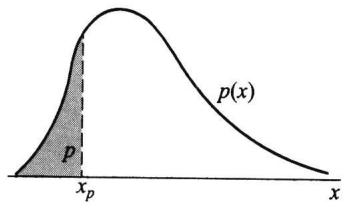
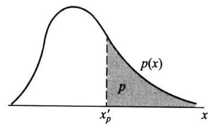
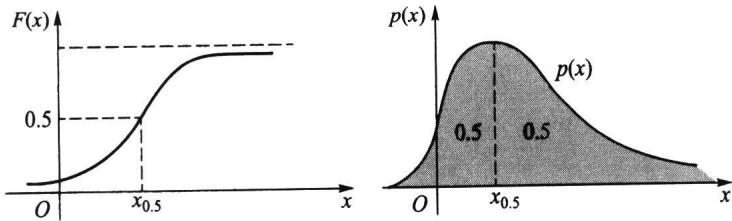
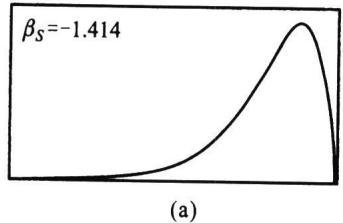
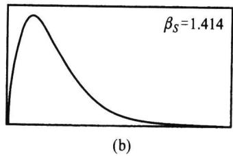
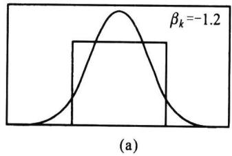
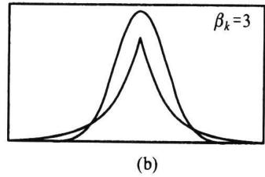

import Example from '@/components/Example.astro';
import Knowledge from '@/components/Knowledge.astro';
import Solution from '@/components/Solution.astro';
import Note from '@/components/Note.astro';
import Block from '@/components/Block.astro';

数学期望和方差是随机变量最重要的两个特征数.此外,随机变量还有一些其他的特征数,以下逐一给出它们的定义,且解释它们的含义.

## 2.7.1 $k$ 阶矩

<Knowledge title="定义 2.7.1">
设 X 为随机变量, k 为正整数. 如果以下的数学期望都存在, 则称

$$

\mu_ {k} = E (X ^ {k})\tag{2.7.1}

$$

为 $X$ 的 $k$ 阶原点矩.称

$$

\nu_ {k} = E (X - E (X)) ^ {k}\tag{2.7.2}

$$

为 X 的 k 阶中心矩.

显然,一阶原点矩就是数学期望,二阶中心矩就是方差.由于 $|X|^{k-1}\leqslant|X|^{k}+1$ ,故k阶矩存在时,k-1阶矩也存在,从而低于k的各阶矩都存在.

中心矩和原点矩之间有一个简单的关系,事实上

$$

\nu_ {_ {k}} = E \left(X - E (X)\right) ^ {k} = E \left(X - \mu_ {_ {1}}\right) ^ {k} = \sum_ {i = 0} ^ {k} \binom {k} {i} \mu_ {_ {i}} (- \mu_ {_ {1}}) ^ {k - i},

$$

故前四阶中心矩可分别用原点矩表示如下：

$$

\begin{array}{l} \nu_ {1} = 0, \\ \nu_ {2} = \mu_ {2} - \mu_ {1} ^ {2}, \\ \nu_ {3} = \mu_ {3} - 3 \mu_ {2} \mu_ {1} + 2 \mu_ {1} ^ {3}, \\ \nu_ {4} = \mu_ {4} - 4 \mu_ {3} \mu_ {1} + 6 \mu_ {2} \mu_ {1} ^ {2} - 3 \mu_ {1} ^ {4}. \end{array}

$$
</Knowledge>

<Example title="例 2.7.1">
设随机变量 $X \sim N(0, \sigma^{2})$ ，则

$$

\mu_ {k} = E (X ^ {k}) = \frac {1}{\sqrt {2 \pi} \sigma} \int_ {- \infty} ^ {\infty} x ^ {k} \exp \left\{- \frac {x ^ {2}}{2 \sigma^ {2}} \right\} d x = \frac {\sigma^ {k}}{\sqrt {2 \pi}} \int_ {- \infty} ^ {\infty} u ^ {k} \exp \left\{- \frac {u ^ {2}}{2} \right\} d u.

$$

在 $k$ 为奇数时，上述被积函数是奇函数，故

$$

\mu_ {k} = 0, \quad k = 1, 3, 5, \dots .

$$

在 $k$ 为偶数时，上述被积函数是偶函数，再利用变换 $z = u^2 / 2$ ，可得

$$

\begin{array}{r l} \mu_ {k} & = \sqrt {\frac {2}{\pi}} \sigma^ {k} 2 ^ {(k - 1) / 2} \int_ {0} ^ {\infty} z ^ {(k - 1) / 2} \mathrm{e} ^ {- z} \mathrm{d} z = \sqrt {\frac {2}{\pi}} \sigma^ {k} 2 ^ {(k - 1) / 2} \Gamma \left(\frac {k + 1}{2}\right) \\ & = \sigma^ {k} (k - 1) (k - 3) \dots 1. \qquad k = 2, 4, 6, \dots . \end{array}

$$

故 $N(0, \sigma^2)$ 分布的前四阶原点矩为

$$

\mu_ {1} = 0, \quad \mu_ {2} = \sigma^ {2}, \quad \mu_ {3} = 0, \quad \mu_ {4} = 3 \sigma^ {4}.

$$

又因为 $E(X)=0$ ，所以有原点矩等于中心矩，即 $\mu_{k}=\nu_{k}, k=1,2,\cdots$
</Example>

## 2.7.2 变异系数

方差(或标准差)反映了随机变量取值的波动程度,但在比较两个随机变量的波动大小时,如果仅看方差(或标准差)的大小有时会产生不合理的现象.这有两个原因:(1)随机变量的取值有量纲,不同量纲的随机变量用其方差(或标准差)去比较它们的波动大小不太合理.(2)在取值的量纲相同的情况下,取值的大小有一个相对性问题,取值较大的随机变量的方差(或标准差)也允许大一些.

所以要比较两个随机变量的波动大小时,在有些场合使用以下定义的变异系数来进行比较,更具可比性.

<Knowledge title="定义 2.7.2">
设随机变量 X 的二阶矩存在, 则称比值

$$

C _ {v} (X) = \frac {\sqrt {\operatorname{Var} (X)}}{E (X)} = \frac {\sigma (X)}{E (X)}\tag{2.7.3}

$$

为 $X$ 的变异系数.

因为标准差的量纲与数学期望的量纲是一致的,所以变异系数是一个无量纲的量,从而消除量纲对波动的影响.
</Knowledge>

<Example title="例 2.7.2">
用 X 表示某种同龄树的高度, 其量纲是米(m), 用 Y 表示某年龄段儿童的身高, 其量纲也是米(m). 设 $E(X)=10$ , $\mathrm{Var}(X)=1$ , $E(Y)=1$ , $\mathrm{Var}(Y)=0.04$ , 是否可以从 $\mathrm{Var}(X)=1$ 和 $\mathrm{Var}(Y)=0.04$ 就认为 Y 的波动小? 这就有一个取值相对大小的问题. 在此用变异系数进行比较是恰当的. 因为 X 的变异系数为

$$

C _ {v} (X) = \frac {\sigma (X)}{E (X)} = \frac {1}{1 0} = 0. 1,

$$

而 $Y$ 的变异系数为

$$

C _ {v} (Y) = \frac {\sigma (Y)}{E (Y)} = \frac {\sqrt {0 . 0 4}}{1} = 0. 2,

$$

这说明 $Y$ (儿童身高) 的波动比 $X$ (同龄树高) 的波动大.
</Example>

## 2.7.3 分位数

<Knowledge title="定义 2.7.3">
设连续随机变量 $X$ 的分布函数为 $F(x)$ , 密度函数为 $p(x)$ . 对任意 $p \in (0,1)$ , 称满足条件

$$

F (x _ {p}) = \int_ {- \infty} ^ {x _ {p}} p (x) \mathrm{d} x = p\tag{2.7.4}

$$

的 $x_{p}$ 为此分布的 p 分位数, 又称下侧 p 分位数.

很多概率统计问题最后都归结为求解满足概率不等式 $F(x) \leqslant p$ 的最大 $x$ , 其解可用分位数 $x_{p}$ 表示. 为此人们对常用分布 (如正态分布、 $t$ 分布、 $\chi^{2}$ 分布等) 编制了各种分位数表 (见本书附表) 供实际使用.

分位数 $x_{n}$ 是把密度函数下的面积分为两块, 左侧面积恰好为 p (见图 2.7.1(a)).

同理我们称满足条件

$$

1 - F (x _ {p} ^ {\prime}) = \int_ {x _ {p} ^ {\prime}} ^ {\infty} p (x) \mathrm{d} x = p\tag{2.7.5}

$$

的 $x_{p}^{\prime}$ 为此分布的上侧 p 分位数.

上侧分位数 $x_{p}^{\prime}$ 也是把密度函数下的面积分为两块，但右侧面积恰好为 $p$ （见图2.7.1(b)).

  

(a) 下侧分位数

  

(b) 上侧分位数  

图2.7.1 分位数与上侧分位数的区别

要善于区分分位数(即下侧分位数)与上侧分位数的差别,本书指定用分位数表(即下侧分位数表),而有一些书使用的是上侧分位数表,无论用什么表,书中都有说明.

分位数与上侧分位数是可以相互转换的,其转换公式如下.

$$

x _ {p} ^ {\prime} = x _ {1 - p}, \quad x _ {p} = x _ {1 - p} ^ {\prime}.

$$
</Knowledge>

<Example title="例 2.7.3">
标准正态分布 $N(0,1)$ 的 $p$ 分位数记为 $u_{p}$ , 它是方程

$$

\Phi (u _ {p}) = p\tag{2.7.6}

$$

的唯一解, 其解为 $u_{p} = \Phi^{-1}(p)$ , 其中 $\Phi^{-1}(\cdot)$ 是标准正态分布函数的反函数. 利用标准正态分布函数表 (见附表 2), 我们可由 $p$ 查得 $u_{p}$ . 譬如 $u_{0.975} = 1.96$ . 常用的标准正态分布的 $p$ 分位数并不多, 现列于表 2.7.1 上. 由于标准正态分布的密度函数是偶函数, 故其分位数有如下性质:

\- 当 $p < 0.5$ 时, $u_{p} < 0$ .

\- 当 $p > 0.5$ 时, $u_{p} > 0$ .

\- 当 $p = 0.5$ 时， $u_{0.5} = 0$ .

\- 当 $p_1 < p_2$ 时， $u_{p_1} < u_{p_2}$

\- 对任意的 $p$ ，有 $u_{p} = -u_{1 - p}$ ，如 $u_{0.001} = -u_{0.999} = -3.090$ .

表 2.7.1 标准正态分布 p 分位数表 (部分)

<table><tr><td> $p$ </td><td>0.999</td><td>0.995</td><td>0.990</td><td>0.975</td><td>0.950</td><td>0.900</td><td>0.850</td><td>0.800</td></tr><tr><td> $u_{p}$ </td><td>3.090</td><td>2.576</td><td>2.326</td><td>1.960</td><td>1.645</td><td>1.282</td><td>1.037</td><td>0.842</td></tr></table>

又由定理2.5.1可知：一般正态分布 $N(\mu ,\sigma^2)$ 的 $p$ 分位数 $x_{p}$ 是方程

$$

\Phi \left(\frac {x _ {p} - \mu}{\sigma}\right) = p

$$

的解,所以由

$$

\frac {x _ {_ p} - \mu}{\sigma} = u _ {_ p}

$$

可得 $x_{p}$ 与 $u_{p}$ 的关系式

$$

x _ {p} = \mu + \sigma u _ {p}.\tag{2.7.7}

$$

譬如正态分布 $N(10,2^{2})$ 的0.975分位数为

$$

x _ {0. 9 7 5} = 1 0 + 2 u _ {0. 9 7 5} = 1 0 + 2 \times 1. 9 6 = 1 3. 9 2.

$$
</Example>

<Example title="例 2.7.4">
记某种轴承的寿命为 T, $t_{p}$ 为此寿命分布的 p 分位数，则 $t_{0.1} = 1\,000\,h$ 表明此种轴承中约有 90% 寿命超过 1 000 h. 若记另一种轴承的寿命为 Z, p 分位数为 $z_{p}$ . 则当 $z_{0.1} = 1\,500\,h$ 时，从 0.1 的分位数上说明后者的质量比前者更高一些:
</Example>

## 2.7.4 中位数

<Knowledge title="定义 2.7.4">
设连续随机变量 $X$ 的分布函数为 $F(x)$ , 密度函数为 $p(x)$ . 称 $p = 0.5$ 时的 $p$ 分位数 $x_{0.5}$ 为此分布的中位数, 即 $x_{0.5}$ 满足

$$

F (x _ {0. 5}) = \int_ {- \infty} ^ {x _ {0. 5}} p (x) \mathrm{d} x = 0. 5.\tag{2.7.8}

$$

中位数的位置常在分布的中部, 见图 2.7.2.

  

图2.7.2 连续随机变量的中位数

对离散分布也可以同样引入分位数和中位数的概念,但遗憾的是:此时对给定的p,有可能 $x_{p}$ 不存在或不唯一.所以在离散分布场合很少使用分位数,在这里我们不再予以讨论.

中位数与均值一样都是随机变量位置的特征数,但在某些场合可能中位数比均值更能说明问题.譬如,某班级学生的考试成绩的中位数为80分,则表明班级中有一半同学的成绩低于80分,另一半同学的成绩高于80分.而如果考试成绩的均值是80分,则无法得出如此明确的结论.

又譬如, 记 $X$ 为 $\mathbf{A}$ 国人的年龄, $Y$ 为 $\mathbf{B}$ 国人的年龄, $x_{0.5}$ 和 $y_{0.5}$ 分别为 $X$ 和 $Y$ 的中位数, 则 $x_{0.5} = 40$ 岁说明 $\mathbf{A}$ 国约有一半的人年龄小于等于 40 岁、一半的人年龄大于等于 40 岁. 而 $y_{0.5} = 50$ 岁则说明 $\mathbf{B}$ 国更趋于老龄化.
</Knowledge>

<Example title="例 2.7.5">
指数分布 $Exp(\lambda)$ 的中位数 $x_{0,5}$ 是方程

$$

1 - \mathrm{e} ^ {- \lambda x _ {0. 5}} = 0. 5

$$

的解,解之得

$$

x _ {0. 5} = \frac {\ln 2}{\lambda}.

$$

假如,某城市电话的通话时间 X (以 min 计) 服从均值 $E(X)=2(\min)$ 的指数分布,此时由 $\lambda=0.5$ 可得中位数为

$$

x _ {0. 5} = \frac {\ln 2}{0 . 5} = 1. 3 9 (\mathrm{min}).

$$

它表明: 该城市中约有一半的电话在 1.39 min 内结束, 另一半的通话时间超过 1.39 min.
</Example>

<Example title="例 2.7.6">
设连续随机变量 $X$ 的密度函数为

$$

p (x) = \left\{ \begin{array}{l l} 4 x ^ {3}, & 0 <   x <   1, \\ 0, & \text {其他}. \end{array} \right.

$$

试求此分布的 0.95 分位数 $x_{0.95}$ 和中位数 $x_{0.5}$ .

<Solution title="解">
因为 $X$ 的分布函数为

$$

F (x) = \left\{ \begin{array}{l l} 0, & x <   0, \\ x ^ {4}, & 0 \leqslant x <   1, \\ 1, & 1 \leqslant x. \end{array} \right.

$$

所以由 $F(x_{0.95}) = 0.95$ 可得： $x_{0.95}^{4} = 0.95$ ，由此得 $x_{0.95} = \sqrt[4]{0.95} = 0.9873$ . 同理由 $F(x_{0.5}) = 0.5$ 得 $x_{0.5}^{4} = 0.5$ ，从中解得 $x_{0.5} = \sqrt[4]{0.5} = 0.8409$ .
</Solution>
</Example>

## 2.7.5 偏度系数

<Knowledge title="定义 2.7.5">
设随机变量 X 的前三阶矩存在, 则比值

$$

\beta_ {s} = \frac {\nu_ {3}}{\nu_ {2} ^ {3 / 2}} = \frac {E (X - E (X)) ^ {3}}{[ \operatorname{Var} (X) ] ^ {3 / 2}}

$$

称为 $X$ （或分布）的偏度系数，简称偏度.当 $\beta_{s} > 0$ 时，称该分布为正偏，又称右偏；当 $\beta_{s} < 0$ 时，称该分布为负偏，又称左偏.

偏度 $\beta_{s}$ 是描述分布偏离对称性程度的一个特征数，这可从以下几方面来认识.

（1）当密度函数 $p(x)$ 关于数学期望对称时，即有 $p(E(X) - x) = p(E(X) + x)$ ，则其三阶中心矩 $\nu_{3}$ 必为0，从而 $\beta_{s} = 0$ 。这表明关于 $E(X)$ 对称的分布其偏度为0。譬如，正态分布 $N(\mu, \sigma^{2})$ 关于 $E(X) = \mu$ 是对称的，故任意正态分布的偏度皆为0。

（2）当偏度 $\beta_{s} \neq 0$ 时，该分布为偏态分布，偏态分布常有不对称的两个尾部，重尾在右侧（变量在高值处比低值处有较大的偏离中心趋势）必导致 $\beta_{s} > 0$ ，故此分布又称为右偏分布；重尾在左侧（变量在低值处比高值处有较大的偏离中心趋势）必导致 $\beta_{s} < 0$ ，故又称为左偏分布，参见图2.7.3.

  

图 2.7.3 两个密度函数，(a) 为左偏，(b) 为右偏

（3）偏度 $\beta_{s}$ 是以各自的标准差的三次方 $[\sigma (X)]^3$ 为单位来度量三阶中心矩大小的，从而消去了量纲，使其更具有可比性.简单地说，分布的三阶中心矩 $\nu_{3}$ 决定偏度的符号，而分布的标准差 $\sigma (X)$ 决定偏度的大小.
</Knowledge>

<Example title="例 2.7.7">
讨论三个贝塔分布 $Be(2,8)$ , $Be(8,2)$ 和 $Be(5,5)$ 的偏度.

<Solution title="解">
设随机变量 $X$ 服从贝塔分布 $Be(a, b)$ , 则可算得其前三阶原点矩:

$$

E (X) = \frac {a}{a + b},

$$

$$

E (X ^ {2}) = \frac {a (a + 1)}{(a + b) (a + b + 1)},

$$

$$

E (X ^ {3}) = \frac {a (a + 1) (a + 2)}{(a + b) (a + b + 1) (a + b + 2)}.

$$

以下为简化 $\beta_{s}$ 的计算, 特用 $a+b=10, b=10-a$ 代入可算得前三阶中心矩.

$$

E (X) = \frac {a}{1 0}, \quad \operatorname{Var} (X) = \frac {a (1 0 - a)}{1 0 ^ {2} \times 1 1}, \quad E (X - E (X)) ^ {3} = \frac {a (1 0 - a) (5 - a)}{1 0 ^ {3} \times 1 1 \times 3}.

$$

可得贝塔分布的偏度为

$$

\beta_ {s} = \frac {E (X - E (X)) ^ {3}}{[ \operatorname{Var} (X) ] ^ {3 / 2}} = \frac {\sqrt {1 1} (5 - a)}{3 \sqrt {a (1 0 - a)}},

$$

把 a=2,5,8 分别代入可得

$Be(2,8)$ 的 $\beta_{s}=\sqrt{11}/4=0.8292$ ，右偏（正偏），

$Be(5,5)$ 的 $\beta_{s}=0$ ，对称，

$Be(8,2)$ 的 $\beta_{s}=-\sqrt{11}/4=-0.8292$ ，左偏（负偏）.
</Solution>
</Example>

## 2.7.6 峰度系数

<Knowledge title="定义 2.7.6">
设随机变量 X 的前四阶矩存在, 则

$$

\beta_ {k} = \frac {\nu_ {4}}{\nu_ {2} ^ {2}} - 3 = \frac {E (X - E (X)) ^ {4}}{[ \operatorname{Var} (X) ] ^ {2}} - 3

$$

称为 X（或分布）的峰度系数，简称峰度.

峰度是描述分布尖峭程度和(或)尾部粗细的一个特征数,这可从以下几方面来认识.

（1）正态分布 $N(\mu, \sigma^2)$ 的 $\nu_2 = \sigma^2, \nu_4 = 3\sigma^4$ ，故按上述定义，任一正态分布 $N(\mu, \sigma^2)$ 的峰度 $\beta_k = 0$ 。可见这里谈论的“峰度”不是指一般密度函数的峰值高低，因为正态分布 $N(\mu, \sigma^2)$ 的峰值为 $(\sqrt{2\pi}\sigma)^{-1}$ ，它与正态分布标准差 $\sigma$ 成反比， $\sigma$ 愈小，正态分布的峰值愈高，可这里的“峰度”与 $\sigma$ 无关。

（2）假如在上述定义中，分子与分母各除以 $[\sigma (X)]^4$ ，并记 $X$ 的标准化变量为 $X^{*} = \frac{X - E(X)}{\sigma(X)}$ ，则 $\beta_{k}$ 可改写成

$$

\beta_ {k} = \frac {E (X ^ {*}) ^ {4}}{[ E (X ^ {* 2}) ] ^ {2}} - 3 = E (X ^ {* 4}) - E (U ^ {4}),

$$

其中 $E(X^{*2})=\mathrm{Var}(X^{*})=1$ , U 为标准正态变量, $E(U^{4})=3$ .

上式表明:峰度 $\beta_{k}$ 是相对于正态分布而言的超出量,即峰度 $\beta_{k}$ 是 X 的标准化变量与标准正态变量的四阶原点矩之差,并以标准正态分布为基准确定其大小.

\- $\beta_{k} > 0$ 表示标准化后的分布比标准正态分布更尖峭和(或)尾部更粗(见图2.7.4(b),图中尖峭的曲线是拉普拉斯分布).

\- $\beta_{k} < 0$ 表示标准化后的分布比标准正态分布更平坦和(或)尾部更细(见图2.7.4)

(a), 图中方形的曲线是均匀分布).

\- $\beta_{k} = 0$ 表示标准化后的分布与标准正态分布的尖峭程度与尾部粗细相当.

  

图2.7.4 两个密度函数与标准正态分布密度函数的比较  

它们的均值相等、方差相等、偏度皆为0(对称分布)，而峰度有很大差别

（3）偏度与峰度都是描述分布形状的特征数，它们的设置都是以正态分布为基准，正态分布的偏度与峰度皆为0。在实际中一个分布的偏度与峰度皆为0或近似为0时，常认为该分布为正态分布或近似为正态分布。

（4）表2.7.2上列出了几种常见分布的偏度与峰度，其中伽马分布 $Ga(\alpha, \lambda)$ 的偏度与峰度只与 $\alpha$ 有关，而与 $\lambda$ 无关，故 $\alpha$ 常称为形状参数，而 $\lambda$ 不能称为形状参数。均匀分布 $U(a, b)$ 与指数分布 $Exp(\lambda)$ 的偏度与峰度都与其所含参数无关，故均匀分布 $U(a, b)$ 中的参数 $a$ 与 $b$ 、指数分布中的参数 $\lambda$ 均不能称为形状参数。进一步的研究会发现，贝塔分布 $Be(a, b)$ 的偏度与峰度与其参数 $a$ 与 $b$ 都有关，它们都可以称为形状参数。

表 2.7.2 几种常见分布的偏度与峰度

<table><tr><td>分布</td><td>均值</td><td>方差</td><td>偏度</td><td>峰度</td></tr><tr><td>均匀分布  $U(a,b)$ </td><td> $(a+b)/2$ </td><td> $(b-a)^{2}/12$ </td><td>0</td><td>-1.2</td></tr><tr><td>正态分布  $N(\mu,\sigma^{2})$ </td><td> $\mu$ </td><td> $\sigma^{2}$ </td><td>0</td><td>0</td></tr><tr><td>指数分布  $Exp(\lambda)$ </td><td> $1/\lambda$ </td><td> $1/\lambda^{2}$ </td><td>2</td><td>6</td></tr><tr><td>伽马分布  $Ga(\alpha,\lambda)$ </td><td> $\alpha/\lambda$ </td><td> $\alpha/\lambda^{2}$ </td><td> $2/\sqrt{\alpha}$ </td><td> $6/\alpha$ </td></tr></table>
</Knowledge>

<Example title="例 2.7.8">
计算伽马分布 $Ga(\alpha,\lambda)$ 的偏度与峰度.

<Solution title="解">
首先计算伽马分布 $Ga(\alpha, \lambda)$ 的 $k$ 阶原点矩：

$$

\mu_ {k} = E \left(X ^ {k}\right) = \alpha (\alpha + 1) \dots (\alpha + k - 1) / \lambda^ {k}.

$$

当 $k = 1,2,3,4$ 时可得前四阶原点矩

$$

\begin{array}{l} \mu_ {1} = \alpha / \lambda , \\ \mu_ {2} = \alpha (\alpha + 1) / \lambda^ {2}, \\ \mu_ {3} = \alpha (\alpha + 1) (\alpha + 2) / \lambda^ {3}, \\ \mu_ {4} = \alpha (\alpha + 1) (\alpha + 2) (\alpha + 3) / \lambda^ {4}. \end{array}

$$

由此可得 2、3、4 阶中心矩

$$

\begin{array}{l} \nu_ {2} = \mu_ {2} - \mu_ {1} ^ {2} = \alpha / \lambda^ {2}, \\ \nu_ {3} = \mu_ {3} - 3 \mu_ {2} \mu_ {1} + 2 \mu_ {1} ^ {2} = 2 \alpha / \lambda^ {3}, \end{array}

$$

$$

\nu_ {4} = \mu_ {4} - 4 \mu_ {3} \mu_ {1} + 6 \mu_ {2} \mu_ {1} ^ {2} - 3 \mu_ {1} ^ {4} = 3 \alpha (\alpha + 2) / \lambda^ {4}.

$$

最后可得伽马分布 $Ga(\alpha, \lambda)$ 的偏度与峰度

$$

\beta_ {s} = \frac {\nu_ {3}}{\nu_ {2} ^ {3 / 2}} = \frac {2}{\sqrt {\alpha}},

$$

$$

\beta_ {k} = \frac {\nu_ {4}}{\nu_ {2} ^ {2}} - 3 = \frac {6}{\alpha}.

$$

可见,伽马分布 $Ga(\alpha,\lambda)$ 的偏度与 $\sqrt{\alpha}$ 成反比.峰度与 $\alpha$ 成反比.只要 $\alpha$ 较大,可使 $\beta_{s}$ 与 $\beta_{k}$ 接近于 0,从而伽马分布也愈来愈近似正态分布.
</Solution>
</Example>

<Block title="习题2.7">
1. 设随机变量 $X \sim U(a, b)$ , 对 $k = 1, 2, 3, 4$ , 求 $\mu_k = E(X^k)$ 与 $\nu_k = E(X - E(X))^k$ . 进一步求此分布的偏度系数和峰度系数.

2. 设随机变量 $X \sim U(0, a)$ , 求此分布的变异系数.

3. 求以下分布的中位数：

(1) 区间 $(a,b)$ 上的均匀分布；

(2) 正态分布 $N(\mu, \sigma^{2})$ ;

(3) 对数正态分布 $LN(\mu, \sigma^{2})$ .

4. 设随机变量 $X \sim Ga(\alpha, \lambda)$ , 对 $k = 1, 2, 3$ , 求 $\mu_k = E(X^k)$ 与 $\nu_k = E(X - E(X))^k$ .

5. 设随机变量 $X \sim Exp(\lambda)$ , 对 $k = 1, 2, 3, 4$ , 求 $\mu_k = E(X^k)$ 与 $\nu_k = E(X - E(X))^k$ . 进一步求此分布的变异系数、偏度系数和峰度系数.

6. 设随机变量 X 服从正态分布 $N(10,9)$ ，试求 $x_{0.1}$ 和 $x_{0.9}$ .

7. 设随机变量 $X$ 服从双参数韦布尔分布, 其分布函数为

$$

F (x) = 1 - \exp \left\{- \left(\frac {x}{\eta}\right) ^ {m} \right\}, \qquad x > 0,

$$

其中 $\eta > 0, m > 0$ . 试写出该分布的 $p$ 分位数 $x_{p}$ 的表达式，且求出当 $m = 1.5, \eta = 1000$ 时的 $x_{0.1}, x_{0.5}, x_{0.8}$ 的值.

8. 自由度为 2 的 $\chi^2$ 分布的密度函数为

$$

p (x) = \frac {1}{2} \mathrm{e} ^ {- \frac {x}{2}}, \quad x > 0.

$$

试求出其分布函数及分位数 $x_{0.1}, x_{0.5}, x_{0.8}$ .

9. 设随机变量 $X$ 的分布密度函数 $p(x)$ 关于直线 $x = c$ 是对称的，且 $E(X)$ 存在，试证：

(1) 这个对称点 c 既是均值又是中位数, 即 $E(X)=x_{0.5}=c$ ;

(2) 如果 c=0，则 $x_{p}=-x_{1-p}$ .

10. 试证随机变量 $X$ 的偏度系数与峰度系数对位移和改变比例尺是不变的, 即对任意的实数 $a$ , $b (b \neq 0)$ , $Y = a + bX$ 与 $X$ 有相同的偏度系数与峰度系数.

11. 设某项维修时间 T (单位: 分) 服从对数正态分布 $LN(\mu, \sigma^{2})$ .

(1) 求 p 分位数 $t_{p}$ ;

(2) 若 $\mu=4.1271$ ，求该分布的中位数；

(3) 若 $\mu=4.127\ 1,\sigma=1.036\ 4$ ，求完成 95% 维修任务的时间.

12. 某种绝缘材料的使用寿命 T (单位: 小时) 服从对数正态分布 $LN(\mu, \sigma^{2})$ . 若已知分位数 $t_{0.2} =$

5 000 小时, $t_{0.8}=65\ 000$ 小时,求 $\mu$ 和 $\sigma$ .

13. 某厂决定按过去生产状况对月生产额最高的 $5\%$ 的工人发放高产奖. 已知过去每人每月生产额 $X$ (单位: 千克) 服从正态分布 $N(4000, 60^2)$ , 试问高产奖发放标准应把生产额定为多少?

</Block>
