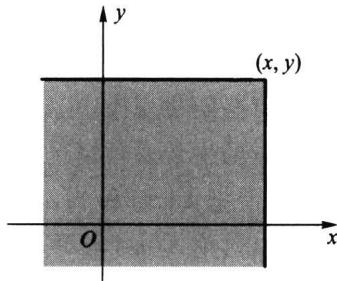
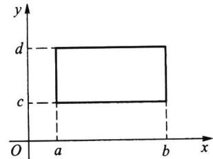
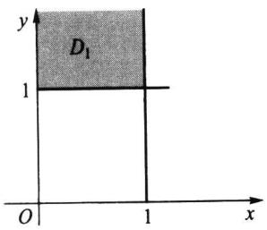
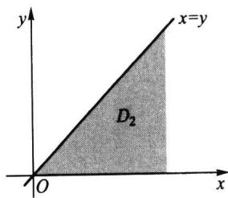
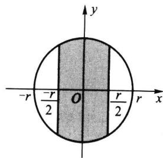
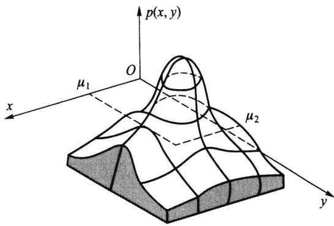

import Guide from '@/components/Guide.astro';
import Knowledge from '@/components/Knowledge.astro';
import Example from '@/components/Example.astro';
import Analysis from '@/components/Analysis.astro';
import Solution from '@/components/Solution.astro';
import Variant from '@/components/Variant.astro';
import Note from '@/components/Note.astro';
import Block from '@/components/Block.astro';
import Method from '@/components/Method.astro';
import Exercise from '@/components/Exercise.astro';

## 第3章 多维随机变量及其分布

在有些随机现象中, 对每个样本点 $\omega$ 只用一个随机变量去描述是不够的. 譬如要研究儿童的生长发育情况, 仅研究儿童的身高 $X(\omega)$ 或仅研究其体重 $Y(\omega)$ 都是局部的, 有必要把 $X(\omega)$ 和 $Y(\omega)$ 作为一个整体来考虑, 讨论它们同时变化的统计规律性, 进一步可以讨论 $X(\omega)$ 与 $Y(\omega)$ 之间的关系. 在有些随机现象中, 甚至要同时研究两个以上随机变量.
如何来研究多维随机变量的统计规律性呢？仿一维随机变量，我们先研究联合分布函数，然后研究离散随机变量的联合分布列、连续随机变量的联合密度函数等.

## 3.1.1 多维随机变量

下面我们先给出 n 维随机变量的定义.

<Knowledge title="定义 3.1.1">
如果 $X_{1}(\omega)$ , $X_{2}(\omega)$ , $\cdots$ , $X_{n}(\omega)$ 是定义在同一个样本空间 $\Omega=\{\omega\}$ 上的 n 个随机变量, 则称
$$
\boldsymbol {X} (\omega) = \left(X _ {1} (\omega), X _ {2} (\omega), \dots , X _ {n} (\omega)\right)
$$
为 n 维(或 n 元)随机变量或随机向量.
</Knowledge>

<Note>
多维随机变量的关键是定义在同一样本空间上,对于不同样本空间 $\Omega_{1}$ 和 $\Omega_{2}$ 上的两个随机变量,我们只能在乘积空间 $\Omega_{1}\times\Omega_{2}=\left\{\left(\omega_{1},\omega_{2}\right):\omega_{1}\in\Omega_{1},\omega_{2}\in\Omega_{2}\right\}$ 及其事件域上讨论它们,这一点在以下讨论中是默认的.
在实际问题中,多维随机变量的情况是经常会遇到的.譬如
\- 在研究四岁至六岁儿童的生长发育情况时,我们感兴趣于每个儿童(样本点 $\omega$ ) 的身高 $X_{1}(\omega)$ 和体重 $X_{2}(\omega)$ , 这里 $(X_{1}, X_{2})$ 是一个二维随机变量.
\- 在研究每个家庭的支出情况时,我们感兴趣于每个家庭(样本点 $\omega$ ) 的衣食住行四个方面,若用 $X_{1}(\omega), X_{2}(\omega), X_{3}(\omega), X_{4}(\omega)$ 分别表示衣食住行的花费占其家庭总收入的百分比,则 $(X_{1}, X_{2}, X_{3}, X_{4})$ 就是一个四维随机变量.
</Note>

## 3.1.2 联合分布函数

<Knowledge title="定义 3.1.2">
对任意的 n 个实数 $x_{1}, x_{2}, \cdots, x_{n}$ ，n 个事件 $\{X_{1} \leqslant x_{1}\}, \{X_{2} \leqslant x_{2}\}, \cdots, \{X_{n} \leqslant x_{n}\}$ 同时发生的概率
$$
F (x _ {1}, x _ {2}, \dots , x _ {n}) = P (X _ {1} \leqslant x _ {1}, X _ {2} \leqslant x _ {2}, \dots , X _ {n} \leqslant x _ {n})\tag{3.1.1}
$$
称为 n 维随机变量 $(X_{1}, X_{2}, \cdots, X_{n})$ 的联合分布函数.
本章主要研究二维随机变量, 二维以上的情况可类似讨论.
在二维随机变量 $(X, Y)$ 场合，联合分布函数 $F(x, y) = P(X \leqslant x, Y \leqslant y)$ 是事件 $\{X \leqslant x\}$ 与 $\{Y \leqslant y\}$ 同时发生（交）的概率。如果将二维随机变量 $(X, Y)$ 看成是平面上随机点的坐标，那么联合分布函数 $F(x, y)$ 在 $(x, y)$ 处的函数值就是随机点 $(X, Y)$ 落在以 $(x, y)$
为顶点的左下无穷直角区域(见图3.1.1)上的概率.
</Knowledge>

<Knowledge title="定理 3.1.1">
任一二维联合分布函数 $F(x,y)$ 必具有如下四条基本性质：
（1）单调性 $F(x,y)$ 分别对 $x$ 或 $y$ 是单调非减的，即

当 $x_{1} < x_{2}$ 时，有 $F(x_{1},y)\leqslant F(x_{2},y)$
当 $y_{1} < y_{2}$ 时，有 $F(x,y_1)\leqslant F(x,y_2)$
（2）有界性 对任意的 $x$ 和 $y$ ，有 $0 \leqslant F(x, y) \leqslant 1$ ，且
图3.1.1 以 $(x,y)$ 为顶点的左下无穷直角区域
$$
\begin{array}{l} {F (- \infty , y) = \lim _ {x \to - \infty} F (x, y) = 0  ,} \\ {F (x, - \infty) = \lim _ {y \to - \infty} F (x, y) = 0  ,} \\ {F (\infty , \infty) = \lim _ {x, y \to \infty} F (x, y) = 1.} \end{array}
$$
(3) 右连续性 对每个变量都是右连续的, 即
$$
\begin{array}{l} {F (x + 0, y) = F (x, y),} \\ {F (x, y + 0) = F (x, y).} \end{array}
$$
(4) 非负性 对任意的 a&lt;b,c&lt;d 有
$$
P (a <   X \leqslant b, c <   Y \leqslant d) = F (b, d) - F (a, d) - F (b, c) + F (a, c) \geqslant 0.
$$

<Solution title="证明">
（1）因为当 $x_{1}<x_{2}$ 时，有 $\{X\leqslant x_{1}\}\subset\{X\leqslant x_{2}\}$ ，所以对任意给定的 y 有
$$
\{X \leqslant x _ {1}, Y \leqslant y \} \subset \{X \leqslant x _ {2}, Y \leqslant y \},
$$
由此可得
$$
F (x _ {1}, y) = P (X \leqslant x _ {1}, Y \leqslant y) \leqslant P (X \leqslant x _ {2}, Y \leqslant y) = F (x _ {2}, y),
$$
即 $F(x,y)$ 关于 $x$ 是单调非减的. 同理可证 $F(x,y)$ 关于 $y$ 是单调非减的.
(2) 由概率的性质可知 $0 \leqslant F(x, y) \leqslant 1$ . 又因为对任意的正整数 $n$ 有
$$
\begin{array}{r l} & {\underset {x \to - \infty} {\lim} \left\{X \leqslant x \right\} = \underset {n \to \infty} {\lim} \bigcap_ {m = 1} ^ {n} \left\{X \leqslant - m \right\} = \varnothing ,} \\ & {\underset {x \to \infty} {\lim} \left\{X \leqslant x \right\} = \underset {n \to \infty} {\lim} \bigcup_ {m = 1} ^ {n} \left\{X \leqslant m \right\} = \varOmega ,} \end{array}
$$
对 $\{Y\leqslant y\}$ 也类似可得.再由概率的连续性，就可得
$$
F (- \infty , y) = F (x, - \infty) = 0, \quad F (\infty , \infty) = 1.
$$
（3）固定 $y$ ，仿一维分布函数右连续的证明，就可得知 $F(x,y)$ 关于 $x$ 是右连续的.同样固定 $x$ ，可证得 $F(x,y)$ 关于 $y$ 是右连续的.
(4) 只需证: 对 a &lt; b, c &lt; d 有
$$
P (a <   X \leqslant b, c <   Y \leqslant d) = F (b, d) - F (a, d) - F (b, c) + F (a, c).
$$
为此记(见图 3.1.2)
$$
\begin{array}{l l} {A = \{X \leqslant a \},} & {B = \{X \leqslant b \},} \\ {C = \{Y \leqslant c \},} & {D = \{Y \leqslant d \},} \end{array}
$$
这里 $A$ 是 $\{X \leqslant a, Y < \infty\}$ 的简写， $C$ 是 $\{X < \infty, Y \leqslant c\}$ 的简写，其他类同. 考虑到

$$
\begin{array}{l} \left\{a <   X \leqslant b \right\} = B - A = B \cap \overline {{A}}, \\ \left\{c <   Y \leqslant d \right\} = D - C = D \cap \overline {{C}}, \end{array}
$$
图 3.1.2 二维随机变量
$(X,Y)$ 落在矩形中的情况
且 $A \subset B, C \subset D$ ，由此可得
$$
\begin{array}{r l} & 0 \leqslant P (a <   X \leqslant b, c <   Y \leqslant d) \\ & = P (B \cap \overline {{A}} \cap D \cap \overline {{C}}) \\ & = P (B D - (A \cup C)) \\ & = P (B D) - P (A B D \cup B C D) \\ & = P (B D) - P (A D \cup B C) \\ & = P (B D) - P (A D) - P (B C) + P (A B C D) \\ & = P (B D) - P (A D) - P (B C) + P (A C) \\ & = F (b, d) - F (a, d) - F (b, c) + F (a, c). \end{array}
$$
还可证明,具有上述四条性质的二元函数 $F(x,y)$ 一定是某个二维随机变量的分布函数.
任一二维分布函数 $F(x, y)$ 必具有上述四条性质, 其中性质(4)是二维场合特有的, 也是合理的. 但性质(4)不能由前三条性质推出, 必须单独列出, 因为存在这样的二元函数 $G(x, y)$ 满足以上性质(1)(2)(3), 但它不满足性质(4), 见下面例子.
</Solution>
</Knowledge>

<Example title="例 3.1.1">
二元函数
$$
G (x, y) = \left\{ \begin{array}{l l} 0, & x + y <   0, \\ 1, & x + y \geqslant 0 \end{array} \right.
$$
满足二维分布函数的性质(1)(2)(3)，但它不满足性质(4).
这从 $G(x,y)$ 的定义可看出：若用直线 $x + y = 0$ 将平面 $xOy$ 一分为二，则
$G(x,y)$ 在右上半平面 $(x + y\geqslant 0)$ 取值为 $1,G(x,y)$ 在左下半平面 $(x + y <   0)$ 取值为 $0,G(x,y)$ 具有非降性、有界性和右连续性，但在正方形区域 $\{(x,y):-1\leqslant x\leqslant 1, - 1\leqslant y$ $\leqslant 1\}$ 的四个顶点上，右上三个顶点位于右上半闭平面，只有左下顶点 $(-1, - 1)$ 位于左下半开平面，故有
$$
G (1, 1) - G (1, - 1) - G (- 1, 1) + G (- 1, - 1) = 1 - 1 - 1 + 0 = - 1 <   0,
$$
所以 $G(x,y)$ 不满足性质(4)，故 $G(x,y)$ 不能成为某二维随机变量的分布函数.
</Example>

## 3.1.3 联合分布列

<Knowledge title="定义 3.1.3">
如果二维随机变量 $(X,Y)$ 只取有限个或可列个数对 $(x_{i},y_{j})$ ，则称 $(X,Y)$ 为二维离散随机变量，称
$$
p _ {i j} = P (X = x _ {i}, Y = y _ {j}), \quad i, j = 1, 2, \dots\tag{3.1.2}
$$
为 $(X,Y)$ 的联合分布列,也可用如下表格形式记联合分布列.
<table><tr><td rowspan="2">X</td><td colspan="5">Y</td></tr><tr><td> $y_1$ </td><td> $y_2$ </td><td>...</td><td> $y_j$ </td><td>...</td></tr><tr><td> $x_1$ </td><td> $p_{11}$ </td><td> $p_{12}$ </td><td>...</td><td> $p_{1j}$ </td><td>...</td></tr><tr><td> $x_2$ </td><td> $p_{21}$ </td><td> $p_{22}$ </td><td>...</td><td> $p_{2j}$ </td><td>...</td></tr><tr><td>⋮</td><td>⋮</td><td>⋮</td><td></td><td>⋮</td><td></td></tr><tr><td> $x_i$ </td><td> $p_{i1}$ </td><td> $p_{i2}$ </td><td>...</td><td> $p_{ij}$ </td><td>...</td></tr><tr><td>⋮</td><td>⋮</td><td>⋮</td><td></td><td>⋮</td><td></td></tr></table>
</Knowledge>

<Knowledge title="性质 3.1.1">
联合分布列的基本性质：
(1) 非负性 $p_{ij} \geqslant 0.$
(2) 正则性 $\sum_{i=1}^{\infty}\sum_{j=1}^{\infty}p_{ij}=1.$
求二维离散随机变量的联合分布列,关键是写出二维随机变量可能取的数对及其发生的概率.
</Knowledge>

<Example title="例 3.1.2">
从 1,2,3,4 中任取一数记为 X，再从 1,2,…,X 中任取一数记为 Y. 求 $(X,Y)$ 的联合分布列及 $P(X=Y)$ .

<Solution title="解">
$(X,Y)$ 为二维离散随机变量, 其中 $X$ 的分布列为
$$
P (X = i) = 1 / 4, \quad i = 1, 2, 3, 4.
$$
Y 的可能取值也是 1,2,3,4, 若记 j 为 Y 的取值, 则
当 $j > i$ 时，有 $P(X = i, Y = j) = P(\varnothing) = 0$ .
当 $1 \leqslant j \leqslant i \leqslant 4$ 时，由乘法公式
$$
P (X = i, Y = j) = P (X = i) P (Y = j \mid X = i) = \frac {1}{4} \times \frac {1}{i}.
$$
由此可得 $(X,Y)$ 的联合分布列为
<table><tr><td rowspan="2">X</td><td colspan="4">Y</td></tr><tr><td>1</td><td>2</td><td>3</td><td>4</td></tr><tr><td>1</td><td>1/4</td><td>0</td><td>0</td><td>0</td></tr><tr><td>2</td><td>1/8</td><td>1/8</td><td>0</td><td>0</td></tr><tr><td>3</td><td>1/12</td><td>1/12</td><td>1/12</td><td>0</td></tr><tr><td>4</td><td>1/16</td><td>1/16</td><td>1/16</td><td>1/16</td></tr></table>
由此可算得事件 $\{X = Y\}$ 的概率为
$$
P (X = Y) = p _ {1 1} + p _ {2 2} + p _ {3 3} + p _ {4 4} = \frac {1}{4} + \frac {1}{8} + \frac {1}{1 2} + \frac {1}{1 6} = \frac {2 5}{4 8} = 0. 5 2 0 8.
$$
</Solution>
</Example>

## 3.1.4 联合密度函数

<Knowledge title="定义 3.1.4">
如果存在二元非负函数 $p(x,y)$ ，使得二维随机变量 $(X,Y)$ 的分布函数 $F(x,y)$ 可表示为
$$
F (x, y) = \int_ {- \infty} ^ {x} \int_ {- \infty} ^ {y} p (u, v) \mathrm{d} v \mathrm{d} u,\tag{3.1.3}
$$
则称 $(X,Y)$ 为二维连续随机变量，称 $p(u,v)$ 为 $(X,Y)$ 的联合密度函数
在 $F(x,y)$ 偏导数存在的点上有
$$
p (x, y) = \frac {\partial^ {2}}{\partial x \partial y} F (x, y).
$$
</Knowledge>

<Knowledge title="性质 3.1.2">
联合密度函数的基本性质：
(1) 非负性 $p(x,y) \geqslant 0.$
(2) 正则性 $\int_{-\infty}^{\infty}\int_{-\infty}^{\infty}p(x,y)\mathrm{d}y\mathrm{d}x=1.$
给出联合密度函数 $p(x, y)$ , 就可以求有关事件的概率了. 若 $G$ 为平面上的一个区域, 则事件 $\{(X, Y) \in G\}$ 的概率可表示为在 $G$ 上对 $p(x, y)$ 的二重积分
$$
P ((X, Y) \in G) = \iint_ {G} p (x, y) \mathrm{d} x \mathrm{d} y.\tag{3.1.4}
$$
在具体使用上式时,要注意积分范围是 $p(x,y)$ 的非零区域与G的交集部分,然后设法化成累次积分,最后计算出结果.计算中要注意如下事实,“直线的面积为零”,故积分区域的边界线是否在积分区域内不影响积分计算结果.
</Knowledge>

<Example title="例 3.1.3">
设 $(X,Y)$ 的联合密度函数为
$$
p (x, y) = \left\{ \begin{array}{l l} 6 \mathrm{e} ^ {- 2 x - 3 y}, & x > 0, y > 0, \\ 0, & \text {其他}. \end{array} \right.
$$
试求：(1) $P(X < 1, Y > 1)$ ; (2) $P(X > Y)$ .

<Solution title="解">
（1）积分区域见图 3.1.3(a) 中的阴影部分 $D_{1}$ ,
$$
\begin{array}{r l} P (X <   1, Y > 1) & = P ((X, Y) \in D _ {1}) = \int_ {1} ^ {\infty} \int_ {0} ^ {1} 6 e ^ {- 2 x - 3 y} d x d y \\ & = 6 \int_ {0} ^ {1} e ^ {- 2 x} d x \int_ {1} ^ {\infty} e ^ {- 3 y} d y \\ & = (1 - e ^ {- 2}) e ^ {- 3} = 0. 0 4 3 0. \end{array}
$$
  
(a) $\{x < 1, y > 1\}$ 区域 $D_{1}$
  
(b) $\{x > y\}$ 区域 $D_{2}$  
图 3.1.3 $p(x,y)$ 的非零区域与有关事件的交集部分
(2) 积分区域见图 3.1.3(b) 中的阴影部分 $D_{2}$ ，从而容易写出累次积分.
$$
P (X > Y) = P ((X, Y) \in D _ {2}) = \int_ {0} ^ {\infty} \int_ {0} ^ {x} 6 e ^ {- 2 x} e ^ {- 3 y} d y d x = \int_ {0} ^ {\infty} 2 e ^ {- 2 x} (1 - e ^ {- 3 x}) d x
$$
$$
= \left(- e ^ {- 2 x} + \frac {2}{5} e ^ {- 5 x}\right) \Bigg | _ {0} ^ {\infty} = 1 - \frac {2}{5} = \frac {3}{5}.
$$
</Solution>
</Example>

## 3.1.5 常用多维分布

下面介绍一些多维随机变量的常用分布.

## 一、多项分布

多项分布是重要的多维离散分布,它是二项分布的推广.
进行 n 次独立重复试验, 如果每次试验有 r 个互不相容的结果: $A_{1}, A_{2}, \cdots, A_{r}$ 之一发生, 且每次试验中 $A_{i}$ 发生的概率为 $p_{i} = P(A_{i}), i = 1, 2, \cdots, r$ , 且 $p_{1} + p_{2} + \cdots + p_{r} = 1$ . 记 $X_{i}$ 为 n 次独立重复试验中 $A_{i}$ 出现的次数, $i = 1, 2, \cdots, r$ , 则 $(X_{1}, X_{2}, \cdots, X_{r})$ 取值 $(n_{1}, n_{2}, \cdots, n_{r})$ 的概率, 即 $A_{1}$ 出现 $n_{1}$ 次, $A_{2}$ 出现 $n_{2}$ 次…… $A_{r}$ 出现 $n_{r}$ 次的概率为
$$
P (X _ {1} = n _ {1}, X _ {2} = n _ {2}, \dots , X _ {r} = n _ {r}) = \frac {n !}{n _ {1} ! n _ {2} ! \cdots n _ {r} !} p _ {1} ^ {n _ {1}} p _ {2} ^ {n _ {2}} \dots p _ {r} ^ {n _ {r}},\tag{3.1.5}
$$
其中 $n=n_{1}+n_{2}+\cdots+n_{r}$
这个联合分布列称为 r 项分布, 又称多项分布, 记为 $M(n, p_{1}, p_{2}, \cdots, p_{r})$ . 这个概率是多项式 $(p_{1} + p_{2} + \cdots + p_{r})^{n}$ 展开式中的一项, 故其和为 1. 当 r = 2 时, 即为二项分布.

<Note>
二项分布是一维随机变量的分布,而在 r 项分布中,因为 $p_{1}+p_{2}+\cdots+p_{r}=1$ ,且 $n_{1}+n_{2}+\cdots+n_{r}=n$ ,所以 r 项分布是 r-1 维随机变量的分布.
</Note>

<Example title="例 3.1.4">
一批产品共有 100 件, 其中一等品 60 件、二等品 30 件、三等品 10 件. 从这批产品中有放回地任取 3 件, 以 X 和 Y 分别表示取出的 3 件产品中一等品、二等品的件数, 求二维随机变量 $(X, Y)$ 的联合分布列.

<Solution title="解">
因为 $X$ 和 $Y$ 的可能取值都是 0, 1, 2, 3, 所以记 $(X, Y)$ 的联合分布列为
<table><tr><td rowspan="2">X</td><td colspan="4">Y</td></tr><tr><td>0</td><td>1</td><td>2</td><td>3</td></tr><tr><td>0</td><td> $p_{00}$ </td><td> $p_{01}$ </td><td> $p_{02}$ </td><td> $p_{03}$ </td></tr><tr><td>1</td><td> $p_{10}$ </td><td> $p_{11}$ </td><td> $p_{12}$ </td><td> $p_{13}$ </td></tr><tr><td>2</td><td> $p_{20}$ </td><td> $p_{21}$ </td><td> $p_{22}$ </td><td> $p_{23}$ </td></tr><tr><td>3</td><td> $p_{30}$ </td><td> $p_{31}$ </td><td> $p_{32}$ </td><td> $p_{33}$ </td></tr></table>
当 $i + j > 3$ 时，有 $p_{ij} = 0$ ，即
$$
p _ {1 3} = p _ {2 2} = p _ {2 3} = p _ {3 1} = p _ {3 2} = p _ {3 3} = 0.
$$
而当 $i + j \leqslant 3$ 时，事件 $\{X = i, Y = j\}$ 表示：取出的3件产品中有 $i$ 件一等品、 $j$ 件二等品、 $3 - i - j$ 件三等品，所以有放回地抽取时，对 $i + j \leqslant 3$ ，有
$$
p _ {i j} = \frac {3 !}{i ! j ! (3 - i - j) !} \left(\frac {6}{1 0}\right) ^ {i} \left(\frac {3}{1 0}\right) ^ {j} \left(\frac {1}{1 0}\right) ^ {3 - i - j}.
$$
由以上公式,就可具体算出 $(X,Y)$ 的联合分布列为
<table><tr><td rowspan="2">X</td><td colspan="4">Y</td></tr><tr><td>0</td><td>1</td><td>2</td><td>3</td></tr><tr><td>0</td><td>0.001</td><td>0.009</td><td>0.027</td><td>0.027</td></tr><tr><td>1</td><td>0.018</td><td>0.108</td><td>0.162</td><td>0</td></tr><tr><td>2</td><td>0.108</td><td>0.324</td><td>0</td><td>0</td></tr><tr><td>3</td><td>0.216</td><td>0</td><td>0</td><td>0</td></tr></table>
有此联合分布列,就可计算有关事件的概率,譬如
$$
P (X \leqslant 1, Y \leqslant 1) = 0. 0 0 1 + 0. 0 0 9 + 0. 0 1 8 + 0. 1 0 8 = 0. 1 3 6,
$$
$$
P (X = 0) = \sum_ {j = 0} ^ {3} P (X = 0, Y = j) = 0. 0 0 1 + 0. 0 0 9 + 0. 0 2 7 + 0. 0 2 7 = 0. 0 6 4.
$$
此例是第二章 §2.4 中的二项分布的推广,差别在于: §2.4 中讨论的是从“合格品”“不合格品”两种情况中抽取,而在此是从一等品、二等品和三等品三种情况中抽取.这里我们称它为三项分布,它是一个二维随机变量的分布.
</Solution>
</Example>

## 二、多维超几何分布

以下给出多维超几何分布的描述:袋中有 N 个球,其中有 $N_{i}$ 个 i 号球, $i=1,2,\cdots,r$ ,且 $N=N_{1}+N_{2}+\cdots+N_{r}$ .从中任意取出 $n(\leqslant N)$ 个,若记 $X_{i}$ 为取出的 n 个球中 i 号球的个数, $i=1,2,\cdots,r$ ,则
$$
P (X _ {1} = n _ {1}, X _ {2} = n _ {2}, \dots , X _ {r} = n _ {r}) = \frac {\binom {N _ {1}} {n _ {1}} \binom {N _ {2}} {n _ {2}} \cdots \binom {N _ {r}} {n _ {r}}}{\binom {N} {n}},\tag{3.1.6}
$$
其中 $n_{1}+n_{2}+\cdots+n_{r}=n, n_{i}\leqslant N_{i}, i=1,2,\cdots,r.$

<Example title="例 3.1.5">
将例 3.1.4 改成不放回抽样, 即从这批产品中不放回地任取 3 件, 记 X 和 Y 分别表示 3 件产品中一等品和二等品的件数, 求二维随机变量 $(X, Y)$ 的联合分布列.

<Solution title="解">
记 $i$ 与 $j$ 分别为 $X$ 与 $Y$ 的取值, 此时对 $i + j > 3$ , 有 $p_{ij} = 0$ , 即
$$
p _ {1 3} = p _ {2 2} = p _ {2 3} = p _ {3 1} = p _ {3 2} = p _ {3 3} = 0.
$$
对 $i + j \leqslant 3$ ，有
$$
p _ {i j} = \frac {\binom {6 0} {i} \binom {3 0} {j} \binom {1 0} {3 - i - j}}{\binom {1 0 0} {3}}.
$$
由此可得 $(X,Y)$ 的联合分布列,譬如
$$
P (X = 1, Y = 2) = \frac {\binom {6 0} {1} \binom {3 0} {2}}{\binom {1 0 0} {3}} = \frac {6 0 \times 3 0 \times 2 9 / 2}{1 0 0 \times 9 9 \times 9 8 / 6} = \frac {8 7}{5 3 9} = 0. 1 6 1 4.
$$
其他各概率都类似求出,最后得如下联合分布列:
<table><tr><td rowspan="2">X</td><td colspan="4">Y</td></tr><tr><td>0</td><td>1</td><td>2</td><td>3</td></tr><tr><td>0</td><td>0.000 7</td><td>0.008 3</td><td>0.026 9</td><td>0.025 1</td></tr><tr><td>1</td><td>0.016 7</td><td>0.111 3</td><td>0.161 4</td><td>0</td></tr><tr><td>2</td><td>0.109 5</td><td>0.328 4</td><td>0</td><td>0</td></tr><tr><td>3</td><td>0.211 6</td><td>0</td><td>0</td><td>0</td></tr></table>
有此联合分布列,就可计算有关事件的概率,譬如,
$$
P (X \leqslant 1, Y \leqslant 1) = 0. 0 0 0 7 + 0. 0 1 6 7 + 0. 0 0 8 3 + 0. 1 1 1 3 = 0. 1 3 7 0.
$$
$$
P (X = 0) = \sum_ {j = 0} ^ {3} P (X = 0, Y = j) = 0. 0 6 1 0.
$$
此例是超几何分布的推广,差别在于:§2.4.3中讨论的是从“合格品”“不合格品”两种情况中作不放回地抽取,而在此是从一等品、二等品和三等品三种情况中作不放回地抽取.这里我们称它为三维超几何分布,它是一种特定的多维超几何分布.
</Solution>
</Example>

## 三、多维均匀分布

设 D 为 $R^{n}$ 中的一个有界区域, 其度量(平面的为面积, 空间的为体积等)为 $S_{D}$ , 如果多维随机变量 $(X_{1}, X_{2}, \cdots, X_{n})$ 的联合密度函数为
$$
p \left(x _ {1}, x _ {2}, \dots , x _ {n}\right) = \left\{ \begin{array}{l l} \frac {1}{S _ {D}}, & \left(x _ {1}, x _ {2}, \dots , x _ {n}\right) \in D, \\ 0, & \text {其他}, \end{array} \right.\tag{3.1.7}
$$
则称 $(X_{1},X_{2},\cdots,X_{n})$ 服从D上的多维均匀分布，记为 $(X_{1},X_{2},\cdots,X_{n})\sim U(D)$ .
二维均匀分布所描述的随机现象就是向平面区域 $D$ 中随机投点, 如果该点坐标 $(X, Y)$ 落在 $D$ 的子区域 $G$ 中的概率只与 $G$ 的面积有关, 而与 $G$ 的位置无关, 则由第一章知这是几何概率. 现在由二维均匀分布来描述, 则
$$
P ((X, Y) \in G) = \iint_ {G} p (x, y)   \mathrm{d} x \mathrm{d} y = \iint_ {G} {\frac {1}{S _ {D}}} \mathrm{d} x \mathrm{d} y = {\frac {G \text {的面积}}{D \text {的面积}}}.
$$
这正是几何概率的计算公式.

<Example title="例 3.1.6">
设 D 为平面上以原点为圆心、以 r 为半径的圆内区域, 如今向该圆内随机投点, 其坐标 $(X, Y)$ 服从 D 上的二维均匀分布, 其密度函数为
$$
p (x, y) = \left\{ \begin{array}{l l} \frac {1}{\pi r ^ {2}}, & x ^ {2} + y ^ {2} \leqslant r ^ {2}, \\ 0, & x ^ {2} + y ^ {2} > r ^ {2}. \end{array} \right.
$$

试求概率 $P(|X| \leqslant r/2)$ .

<Solution title="解">
$p(x,y)$ 的非零区域与 $\{|X|\leqslant r / 2\}$ 的交集部分见图3.1.4，因此所求概率为
图3.1.4 $p(x,y)$ 的非零区域与有关事件的交集部分
$$
\begin{array}{r l} P \left(\mid X \mid \leqslant \frac {r}{2}\right) & = \int_ {- r / 2} ^ {r / 2} \int_ {- \sqrt {r ^ {2} - x ^ {2}}} ^ {\sqrt {r ^ {2} - x ^ {2}}} \frac {1}{\pi r ^ {2}} \mathrm{d} y \mathrm{d} x = \frac {1}{\pi r ^ {2}} \int_ {- r / 2} ^ {r / 2} 2 \sqrt {r ^ {2} - x ^ {2}} \mathrm{d} x \\ & = \frac {1}{\pi r ^ {2}} \left[ x \sqrt {r ^ {2} - x ^ {2}} + r ^ {2} \arcsin \frac {x}{r} \right] \Bigg | _ {- r / 2} ^ {r / 2} \\ & = \frac {1}{\pi r ^ {2}} \left(r \sqrt {r ^ {2} - \frac {r ^ {2}}{4}} + 2 r ^ {2} \arcsin \frac {1}{2}\right) \\ & = \frac {1}{\pi} \left(\frac {\sqrt {3}}{2} + \frac {\pi}{3}\right) = 0. 6 0 9. \end{array}
$$
</Solution>
</Example>

## 四、二元正态分布

如果二维随机变量 $(X,Y)$ 的联合密度函数（见图3.1.5）为
$$
\begin{array}{r l} p (x, y) & = \frac {1}{2 \pi \sigma_ {1} \sigma_ {2} \sqrt {1 - \rho^ {2}}} \exp \left\{- \frac {1}{2 (1 - \rho^ {2})} \left[ \frac {(x - \mu_ {1}) ^ {2}}{\sigma_ {1} ^ {2}} - 2 \rho \frac {(x - \mu_ {1}) (y - \mu_ {2})}{\sigma_ {1} \sigma_ {2}} + \frac {(y - \mu_ {2}) ^ {2}}{\sigma_ {2} ^ {2}} \right] \right\}, \\ & \quad - \infty <   x, y <   \infty , \end{array}\tag{3.1.8}
$$
则称 $(X,Y)$ 服从二元正态分布,记为 $(X,Y)\sim N(\mu_{1},\mu_{2},\sigma_{1}^{2},\sigma_{2}^{2},\rho)$ .其中五个参数的取值范围分别是
$$
- \infty <   \mu_ {1}, \mu_ {2} <   \infty , \sigma_ {1}, \sigma_ {2} > 0, - 1 \leqslant \rho \leqslant 1.
$$
以后将指出: $\mu_{1},\mu_{2}$ 分别是X与Y的均值, $\sigma_{1}^{2},\sigma_{2}^{2}$ 分别是X与Y的方差, $\rho$ 是X与Y的相关系数.
  
图 3.1.5 二元正态密度函数
二元正态密度函数的图形很像一顶四周无限延伸的草帽,其中心点在 $(\mu_{1},\mu_{2})$ 处,其等高线是椭圆.平行xOp平面(或平行yOp平面)的截面显示正态曲线(见图3.1.5).

<Example title="例 3.1.7">
设二维随机变量 $(X,Y)\sim N(\mu_{1},\mu_{2},\sigma_{1}^{2},\sigma_{2}^{2},\rho)$ ，求 $(X,Y)$ 落在区域
$$
D = \left\{(x, y): \frac {(x - \mu_ {1}) ^ {2}}{\sigma_ {1} ^ {2}} - 2 \rho \frac {(x - \mu_ {1}) (y - \mu_ {2})}{\sigma_ {1} \sigma_ {2}} + \frac {(y - \mu_ {2}) ^ {2}}{\sigma_ {2} ^ {2}} \leqslant \lambda^ {2} \right\}
$$
内的概率.

<Solution title="解">
所求概率为
$$
\begin{array}{r l} p & = \frac {1}{2 \pi \sigma_ {1} \sigma_ {2} \sqrt {1 - \rho^ {2}}} \iint_ {D} \exp \left\{- \frac {1}{2 (1 - \rho^ {2})} \left[ \left(\frac {x - \mu_ {1}}{\sigma_ {1}}\right) ^ {2} - 2 \rho \frac {(x - \mu_ {1}) (y - \mu_ {2})}{\sigma_ {1} \sigma_ {2}} + \left(\frac {y - \mu_ {2}}{\sigma_ {2}}\right) ^ {2} \right] \right\} d x d y. \end{array}
$$
作变换
$$
\left\{ \begin{array}{l} u = \frac {x - \mu_ {1}}{\sigma_ {1}} - \rho \frac {y - \mu_ {2}}{\sigma_ {2}}, \\ v = \frac {y - \mu_ {2}}{\sigma_ {2}} \sqrt {1 - \rho^ {2}}. \end{array} \right.
$$
则可得
$$
J ^ {- 1} = \frac {\partial (u , v)}{\partial (x , y)} = \left| \begin{array}{c c} \frac {1}{\sigma_ {1}} & - \frac {\rho}{\sigma_ {2}} \\ 0 & \frac {\sqrt {1 - \rho^ {2}}}{\sigma_ {2}} \end{array} \right| = \frac {\sqrt {1 - \rho^ {2}}}{\sigma_ {1} \sigma_ {2}},
$$
由此得
$$
p = \frac {1}{2 \pi (1 - \rho^ {2})} \iint_ {u ^ {2} + v ^ {2} \leqslant \lambda^ {2}} \exp \left\{- \frac {u ^ {2} + v ^ {2}}{2 (1 - \rho^ {2})} \right\} d u d v.
$$
再作极坐标变换
$$
\left\{ \begin{array}{l} u = r \sin \alpha , \\ v = r \cos \alpha , \end{array} \right.
$$
则可得
$$
J ^ {- 1} = \frac {\partial (u , v)}{\partial (r , \alpha)} = \left| \begin{array}{c c} \sin \alpha & r \cos \alpha \\ \cos \alpha & - r \sin \alpha \end{array} \right| = - r (\sin^ {2} \alpha + \cos^ {2} \alpha) = - r,
$$
最后得
$$
\begin{array}{r l} p & = \frac {1}{2 \pi (1 - \rho^ {2})} \int_ {0} ^ {2 \pi} \mathrm{d} \alpha \int_ {0} ^ {\lambda} r \exp \left\{- \frac {r ^ {2}}{2 (1 - \rho^ {2})} \right\} \mathrm{d} r \\ & = \int_ {0} ^ {\lambda} \exp \left\{- \frac {r ^ {2}}{2 (1 - \rho^ {2})} \right\} \mathrm{d} \left(\frac {r ^ {2}}{2 (1 - \rho^ {2})}\right) \\ & = - \exp \left\{- \frac {r ^ {2}}{2 (1 - \rho^ {2})} \right\} \Bigg | _ {0} ^ {\lambda} = 1 - \exp \left\{- \frac {\lambda^ {2}}{2 (1 - \rho^ {2})} \right\}. \end{array}
$$
</Solution>
</Example>

<Block title="习题3.1">
1. 100件产品中有50件一等品、30件二等品、20件三等品。从中任取5件，以 $X, Y$ 分别表示取出的5件中一等品、二等品的件数，在以下情况下求 $(X, Y)$ 的联合分布列：
(1) 不放回抽取；(2) 有放回抽取.
2. 盒子里装有 3 个黑球、2 个红球、2 个白球，从中任取 4 个，以 $X$ 表示取到黑球的个数，以 $Y$ 表示取到红球的个数，试求 $P(X = Y)$ .
3. 口袋中有 5 个白球、8 个黑球，从中不放回地一个接一个取出 3 个。如果第 $i$ 次取出的是白球，则令 $X_{i} = 1$ ，否则令 $X_{i} = 0, i = 1,2,3$ 。求：
(1) $(X_{1},X_{2},X_{3})$ 的联合分布列；
(2) $(X_{1}, X_{2})$ 的联合分布列.
4. 设随机变量 $X_{i}, i = 1,2$ ，的分布列如下，且满足 $P(X_{1}X_{2} = 0) = 1$ ，试求 $P(X_{1} = X_{2})$ 。
<table><tr><td> ${X}_{i}$ </td><td>-1</td><td>0</td><td>1</td></tr><tr><td>P</td><td>0.25</td><td>0.5</td><td>0.25</td></tr></table>
5. 设随机变量 $(X, Y)$ 的联合密度函数为
$$
p (x, y) = \left\{ \begin{array}{l l} k (6 - x - y), & 0 <   x <   2, \quad 2 <   y <   4, \\ 0, & \text {其他}. \end{array} \right.
$$
试求：
(1) 常数 k;
(2) $P(X <   1,Y <   3)$
(3) $P(X < 1.5)$ ;
(4) $P(X + Y \leqslant 4)$ .
6. 设随机变量 $(X, Y)$ 的联合密度函数为
$$
p \left(  x  , y  \right)   =   \left\{ \begin{array}{l l} {k \mathrm{e} ^ {- \left(3 x + 4 y  \right)}  ,} & {x   >   0  , \quad y   >   0  ,} \\ {0  ,} & {\text {其他}.} \end{array} \right.
$$
试求：
(1) 常数 k;
(2) $(X,Y)$ 的联合分布函数 $F(x,y)$ ;
(3) $P(0 < X \leqslant 1, 0 < Y \leqslant 2)$ .
7. 设二维随机变量 $(X, Y)$ 的联合密度函数为
$$
p (x, y) = \left\{ \begin{array}{l l} 4 x y, & 0 <   x <   1, \quad 0 <   y <   1, \\ 0, & \text {其他}. \end{array} \right.
$$
试求：
(1) $P(0<X<0.5,0.25<Y<1)$ ;
(2) $P(X = Y)$ ;
(3) $P(X <   Y)$
(4) $(X,Y)$ 的联合分布函数.
8. 设二维随机变量 $(X, Y)$ 在边长为 2，中心为 $(0, 0)$ 的正方形区域内服从均匀分布，试求 $P(X^2 + Y^2 \leqslant 1)$ .
9. 设二维随机变量 $(X, Y)$ 的联合密度函数为
$$
p \left(x, y\right) = \left\{ \begin{array}{l l} k, & 0 <   x ^ {2} <   y <   x <   1, \\ 0, & \text {其他}. \end{array} \right.
$$
(1) 试求常数 k;
(2) 求 $P(X>0.5)$ 和 $P(Y<0.5)$ .
10. 设二维随机变量 $(X, Y)$ 的联合密度函数为
$$
p (x, y) = \left\{ \begin{array}{l l} 6 (1 - y), & 0 <   x <   y <   1, \\ 0, & \text {其他}. \end{array} \right.
$$
(1) 求 $P(X>0.5, Y>0.5)$ ;
(2) 求 $P(X<0.5)$ 和 $P(Y<0.5)$ ;
(3) 求 $P(X+Y<1)$ .
11. 设随机变量 $Y$ 服从参数为 $\lambda = 1$ 的指数分布, 定义随机变量 $X_{k}$ 如下:
$$
X _ {k} = \left\{ \begin{array}{l l} 0, & Y \leqslant k, \\ 1, & Y > k, \end{array} \right. k = 1, 2.
$$
求 $X_{1}$ 和 $X_{2}$ 的联合分布列.
12. 设二维随机变量 $(X, Y)$ 的联合密度函数为
$$
p (x, y) = \left\{ \begin{array}{l l} x ^ {2} + \frac {x y}{3}, & 0 <   x <   1, \quad 0 <   y <   2, \\ 0, & \text {其他}. \end{array} \right.
$$
求 $P(X + Y \geqslant 1)$ .
13. 设二维随机变量 $(X, Y)$ 的联合密度函数为
$$
p \left(  x  , y  \right)   =   \left\{ \begin{array}{l l} {\mathrm{e} ^ {- y}  ,} & {0   <     x   <     y  ,} \\ {0  ,} & {\text {其他}.} \end{array} \right.
$$
试求 $P(X + Y \leqslant 1)$ .
14. 设二维随机变量 $(X, Y)$ 的联合密度函数为
$$
p \left(x, y\right) = \left\{ \begin{array}{l l} 1 / 2, & 0 <   x <   1, \quad 0 <   y <   2, \\ 0, & \text {其他}. \end{array} \right.
$$
求 $X$ 与 $Y$ 中至少有一个小于0.5的概率.
15. 从 $(0,1)$ 中随机地取两个数，求其积不小于 $3 / 16$ ，且其和不大于1的概率.
</Block>
