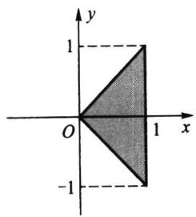
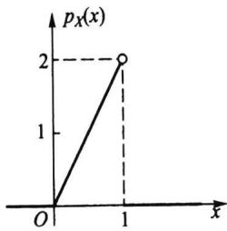
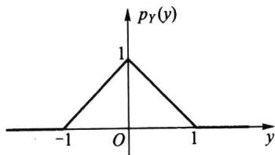
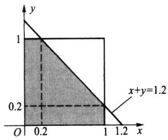
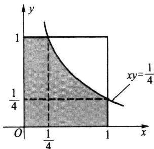

import Example from '@/components/Example.astro';
import Knowledge from '@/components/Knowledge.astro';
import Solution from '@/components/Solution.astro';
import Note from '@/components/Note.astro';
import Block from '@/components/Block.astro';

二维联合分布函数(二维联合分布列、二维联合密度函数也一样)含有丰富的信息,主要有以下三方面信息:

\- 每个分量的分布(每个分量的所有信息),即边际分布.

\- 两个分量之间的关联程度,在 §3.4 中用协方差和相关系数来描述.

\- 给定一个分量时,另一个分量的分布,即条件分布.

我们的目的是将这些信息从联合分布中挖掘出来,本节先讨论边际分布.

## 3.2.1 边际分布函数

如果在二维随机变量 $(X,Y)$ 的联合分布函数 $F(x,y)$ 中令 $y\to \infty$ ，由于 $\{Y <   \infty \}$ 为必然事件，故可得

$$

\lim _ {y \to \infty} F (x, y) = P (X \leqslant x, Y <   \infty) = P (X \leqslant x),

$$

这是由 $(X,Y)$ 的联合分布函数 $F(x,y)$ 求得的 $X$ 的分布函数，被称为 $X$ 的边际分布，记为

$$

F _ {x} (x) = F (x, \infty).\tag{3.2.1}

$$

类似地，在 $F(x,y)$ 中令 $x\to \infty$ ，可得 $Y$ 的边际分布

$$

F _ {Y} (y) = F (\infty , y).\tag{3.2.2}

$$

在三维随机变量 $(X,Y,Z)$ 的联合分布函数 $F(x,y,z)$ 中，用类似的方法可得到更多的边际分布函数：

$$

\begin{array}{l} {F _ {X} (x) = F (x, \infty , \infty),} \\ {F _ {Y} (y) = F (\infty , y, \infty),} \\ {F _ {Z} (z) = F (\infty , \infty , z),} \\ {F _ {X, Y} (x, y) = F (x, y, \infty),} \\ {F _ {X, Z} (x, z) = F (x, \infty , z),} \\ {F _ {Y, Z} (y, z) = F (\infty , y, z).} \end{array}

$$

在更高维的场合,也可类似地从联合分布函数获得其低维的边际分布函数.譬如,五维联合分布有5个一维边际分布、10个二维边际分布,10个三维边际分布和5个四维边际分布.

<Example title="例 3.2.1">
设二维随机变量 $(X,Y)$ 的联合分布函数为

$$

F (x, y) = \left\{ \begin{array}{l l} 1 - \mathrm{e} ^ {- x} - \mathrm{e} ^ {- y} + \mathrm{e} ^ {- x - y - \lambda x y}, & x > 0, y > 0. \\ 0, & \text {其他}. \end{array} \right.

$$

这个分布被称为二维指数分布,其中参数 $\lambda>0$ .

由此联合分布函数 $F(x,y)$ ，容易获得 $X$ 与 $Y$ 的边际分布函数为

$$

\begin{array}{l} {F _ {X} (x) = F (x, \infty) = \left\{ \begin{array}{l l} {1 - \mathrm{e} ^ {- x},} & {x > 0,} \\ {0,} & {x \leqslant 0.} \end{array} \right.} \\ {F _ {Y} (y) = F (\infty , y) = \left\{ \begin{array}{l l} {1 - \mathrm{e} ^ {- y},} & {y > 0,} \\ {0,} & {y \leqslant 0.} \end{array} \right.} \end{array}

$$

它们都是一维指数分布. 不同的 $\lambda > 0$ 对应不同的二维指数分布, 但它们的两个边际分布与参数 $\lambda > 0$ 无关. 这说明: 二维联合分布不仅含有每个分量的概率分布, 而且还含有两个变量 $X$ 与 $Y$ 间关系的信息, 这正是人们要研究多维随机变量的原因.
</Example>

## 3.2.2 边际分布列

在二维离散随机变量 $(X,Y)$ 的联合分布列 $\{P(X = x_i,Y = y_j)\}$ 中，对 $j$ 求和所得的分布列

$$

\sum_ {j = 1} ^ {\infty} P (X = x _ {i}, Y = y _ {j}) = P (X = x _ {i}), \quad i = 1, 2, \dots\tag{3.2.3}

$$

被称为 $X$ 的边际分布列. 类似地, 对 $i$ 求和所得的分布列

$$

\sum_ {i = 1} ^ {\infty} P (X = x _ {i}, Y = y _ {j}) = P (Y = y _ {j}), \quad j = 1, 2, \dots\tag{3.2.4}

$$

被称为 Y 的边际分布列.

<Example title="例 3.2.2">
设二维随机变量 $(X,Y)$ 有如下的联合分布列

<table><tr><td rowspan="2">X</td><td colspan="3">Y</td></tr><tr><td>1</td><td>2</td><td>3</td></tr><tr><td>0</td><td>0.09</td><td>0.21</td><td>0.24</td></tr><tr><td>1</td><td>0.07</td><td>0.12</td><td>0.27</td></tr></table>

求 X 与 Y 的边际分布列.

<Solution title="解">
在上述联合分布列中, 对每一行求和得 0.54 与 0.46, 并把它们写在对应行的右侧, 这就是 X 的边际分布列. 再对每一列求和, 得 0.16, 0.33 和 0.51, 并把它们写在对应列的下侧, 这就是 Y 的边际分布列.

<table><tr><td rowspan="2">X</td><td colspan="3">Y</td><td rowspan="2">P(X=i)</td></tr><tr><td>1</td><td>2</td><td>3</td></tr><tr><td>0</td><td>0.09</td><td>0.21</td><td>0.24</td><td>0.54</td></tr><tr><td>1</td><td>0.07</td><td>0.12</td><td>0.27</td><td>0.46</td></tr><tr><td>P(Y=j)</td><td>0.16</td><td>0.33</td><td>0.51</td><td>1</td></tr></table>
</Solution>
</Example>

## 3.2.3 边际密度函数

如果二维连续随机变量 $(X,Y)$ 的联合密度函数为 $p(x,y)$ ，因为

$$

F _ {\chi} (x) = F (x, \infty) = \int_ {- \infty} ^ {x} \left(\int_ {- \infty} ^ {\infty} p (u, v) \mathrm{d} v\right) \mathrm{d} u = \int_ {- \infty} ^ {x} p _ {\chi} (u) \mathrm{d} u,

$$

$$

F _ {Y} (y) = F (\infty , y) = \int_ {- \infty} ^ {y} \left(\int_ {- \infty} ^ {\infty} p (u, v) \mathrm{d} u\right) \mathrm{d} v = \int_ {- \infty} ^ {y} p _ {Y} (v) \mathrm{d} v,

$$

其中 $p_{X}(x)$ 和 $p_{Y}(y)$ 分别为

$$

p _ {x} (x) = \int_ {- \infty} ^ {\infty} p (x, y) \mathrm{d} y,\tag{3.2.5}

$$

$$

p _ {Y} (y) = \int_ {- \infty} ^ {\infty} p (x, y) \mathrm{d} x.\tag{3.2.6}

$$

它们恰好处于密度函数位置,故称上式给出的 $p_{X}(x)$ 为 X 的边际密度函数, $p_{Y}(y)$ 为 Y 的边际密度函数.

由联合密度函数求边际密度函数时,要注意积分区域的确定.

<Example title="例 3.2.3">
设二维随机变量 $(X,Y)$ 的联合密度函数为

$$

p (x, y) = \left\{ \begin{array}{l l} 1, & 0 <   x <   1, | y | <   x, \\ 0, & \text {其他}. \end{array} \right.

$$

试求：（1）边际密度函数 $p_X(x)$ 和 $p_Y(y)$ ；(2) $P(X < 1/2)$ 及 $P(Y > 1/2)$ .

<Solution title="解">
首先识别 $p(x,y)$ 的非零区域, 它如图3.2.1所示.

(1) 求 $p_{x}(x)$ .

当 $x \leqslant 0$ ，或 $x \geqslant 1$ 时，有 $p_{x}(x) = 0.$ 而当 $0 < x < 1$ 时，有

$$

p _ {X} (x) = \int_ {- \infty} ^ {\infty} p (x, y) \mathrm{d} y = \int_ {- x} ^ {x} \mathrm{d} y = 2 x.

$$

所以 $X$ 的边际密度函数为（见图3.2.2）

$$

p _ {X} (x) = \left\{ \begin{array}{l l} 2 x, & 0 <   x <   1, \\ 0, & \text {其他}. \end{array} \right.

$$

再求 $p_{Y}(y)$

当 $y \leqslant -1$ ，或 $y \geqslant 1$ 时，有 $p_{Y}(y) = 0$ . 而当 $-1 < y < 0$ 时，有

$$

p _ {Y} (y) = \int_ {- \infty} ^ {\infty} p (x, y) \mathrm{d} x = \int_ {- y} ^ {1} \mathrm{d} x = 1 + y,

$$

  

图3.2.1 $p(x,y)$ 的非零区域

  

图 3.2.2 X 的边际密度函数( $Be(2,1)$ )

当 $0 < y < 1$ 时，有

$$

p _ {Y} (y) = \int_ {- \infty} ^ {\infty} p (x, y) \mathrm{d} x = \int_ {y} ^ {1} \mathrm{d} x = 1 - y.

$$

所以 $Y$ 的边际密度函数为（见图3.2.3）

$$

p _ {Y} (y) = \left\{ \begin{array}{l l} 1 + y, & - 1 <   y <   0, \\ 1 - y, & 0 <   y <   1, \\ 0, & \text {其他}. \end{array} \right.

$$

  

图 3.2.3 Y 的边际密度函数(三角形分布)

(2) 要求的概率分别为

$$

P \left(X <   \frac {1}{2}\right) = \int_ {- \infty} ^ {1 / 2} p _ {X} (x) \mathrm{d} x = \int_ {0} ^ {1 / 2} 2 x \mathrm{d} x = \frac {1}{4}.

$$

$$

P \left(Y > \frac {1}{2}\right) = \int_ {1 / 2} ^ {\infty} p _ {Y} (y) \mathrm{d} y = \int_ {1 / 2} ^ {1} (1 - y) \mathrm{d} y = \frac {1}{8}.

$$
</Solution>
</Example>

<Example title="例 3.2.4">
三项分布的一维边际分布为二项分布

三项分布 $M(n,p_1,p_2,p_3)$ 实质上是二维随机变量 $(X,Y)$ 的分布，其联合分布列为

$$

P (X = i, Y = j) = \frac {n !}{i ! j ! (n - i - j) !} p _ {1} ^ {i} p _ {2} ^ {j} \left(1 - p _ {1} - p _ {2}\right) ^ {n - i - j}, i, j = 0, 1, 2, \dots , n, i + j \leqslant n.

$$

对上式分别乘和除以 $(1 - p_{1})^{n - i} / (n - i)!$ ，再对 $j$ 从0到 $n - i$ 求和，并记 $p_2' = p_2 / (1 - p_1)$ ，则可得

$$

\begin{array}{r l} \sum_ {j = 0} ^ {n - i} P (X = i, Y = j) & = \frac {n !}{i ! (n - i) !} p _ {1} ^ {i} (1 - p _ {1}) ^ {n - i} \cdot \\ & \quad \sum_ {j = 0} ^ {n - i} \binom {n - i} {j} \left(\frac {p _ {2}}{1 - p _ {1}}\right) ^ {j} \left(1 - \frac {p _ {2}}{1 - p _ {1}}\right) ^ {n - i - j} \\ & = \frac {n !}{i ! (n - i) !} p _ {1} ^ {i} (1 - p _ {1}) ^ {n - i} [ p _ {2} ^ {\prime} + (1 - p _ {2} ^ {\prime}) ] ^ {n - i} \end{array}

$$

$$

= \frac {n !}{i ! (n - i) !} p _ {1} ^ {i} (1 - p _ {1}) ^ {n - i}.

$$

所以 $X \sim b(n, p_{1})$ . 同理可证 $Y \sim b(n, p_{2})$ .

用类似的方法可以证明: r 项分布 $M(n, p_{1}, p_{2}, \cdots, p_{r})$ 的最低阶边际分布是 r 个二项分布 $b(n, p_{i}), i = 1, 2, \cdots, r$ .
</Example>

<Example title="例 3.2.5">
二维正态分布的边际分布为一维正态分布

设二维随机变量 $(X,Y)\sim N(\mu_1,\mu_2,\sigma_1^2,\sigma_2^2,\rho)$ . 先把(3.1.8)式二维正态密度函数 $p(x,y)$ 的指数部分

$$

- \frac {1}{2 (1 - \rho^ {2})} \left[ \frac {(x - \mu_ {1}) ^ {2}}{\sigma_ {1} ^ {2}} - 2 \rho \frac {(x - \mu_ {1}) (y - \mu_ {2})}{\sigma_ {1} \sigma_ {2}} + \frac {(y - \mu_ {2}) ^ {2}}{\sigma_ {2} ^ {2}} \right]

$$

改写成

$$

- \frac {1}{2} \left(\rho \frac {x - \mu_ {1}}{\sigma_ {1} \sqrt {1 - \rho^ {2}}} - \frac {y - \mu_ {2}}{\sigma_ {2} \sqrt {1 - \rho^ {2}}}\right) ^ {2} - \frac {(x - \mu_ {1}) ^ {2}}{2 \sigma_ {1} ^ {2}}.

$$

再对积分

$$

\int_ {- \infty} ^ {\infty} \exp \left\{- \frac {1}{2} \left(\rho \frac {x - \mu_ {1}}{\sigma_ {1} \sqrt {1 - \rho^ {2}}} - \frac {y - \mu_ {2}}{\sigma_ {2} \sqrt {1 - \rho^ {2}}}\right) ^ {2} \right\} d y

$$

作变换(注意把 x 看作常量)

$$

t = \rho \frac {x - \mu_ {1}}{\sigma_ {1} \sqrt {1 - \rho^ {2}}} - \frac {y - \mu_ {2}}{\sigma_ {2} \sqrt {1 - \rho^ {2}}},

$$

则

$$

\begin{array}{r l} p _ {X} (x) & = \int_ {- \infty} ^ {\infty} p (x, y) \mathrm{d} y \\ & = \frac {1}{2 \pi \sigma_ {1} \sigma_ {2} \sqrt {1 - \rho^ {2}}} \exp \left\{- \frac {(x - \mu_ {1}) ^ {2}}{2 \sigma_ {1} ^ {2}} \right\} \sigma_ {2} \sqrt {1 - \rho^ {2}} \int_ {- \infty} ^ {\infty} \exp \left\{- \frac {t ^ {2}}{2} \right\} \mathrm{d} t. \end{array}

$$
</Example>

<Note>
到上式中的积分恰好等于 $\sqrt{2\pi}$ ，所以有

$$

p _ {X} (x) = \frac {1}{\sqrt {2 \pi} \sigma_ {1}} \exp \left\{- \frac {(x - \mu_ {1}) ^ {2}}{2 \sigma_ {1} ^ {2}} \right\}.

$$

这正是一维正态分布 $N(\mu_1, \sigma_1^2)$ 的密度函数，即 $X \sim N(\mu_1, \sigma_1^2)$ . 同理可证 $Y \sim N(\mu_2, \sigma_2^2)$ . 由此可见

\- 二维正态分布的边际分布中不含参数 $\rho$ .

\- 这说明二维正态分布 $N(\mu_1, \mu_2, \sigma_1^2, \sigma_2^2, 0.1)$ 与 $N(\mu_1, \mu_2, \sigma_1^2, \sigma_2^2, 0.2)$ 的边际分布是相同的.

\- 具有相同边际分布的多维联合分布可以是不同的.
</Note>

## 3.2.4 随机变量间的独立性

在多维随机变量中,各分量的取值有时会相互影响,但有时会毫无影响.譬如一个人的身高 $X$ 和体重 $Y$ 就会相互影响,但与收入 $Z$ 一般无影响.当两个随机变量的取值互不影响时,就称它们是相互独立的.

<Knowledge title="定义 3.2.1">
设 n 维随机变量 $(X_{1}, X_{2}, \cdots, X_{n})$ 的联合分布函数为 $F(x_{1}, x_{2}, \cdots, x_{n})$ ， $F_{i}(x_{i})$ 为 $X_{i}$ 的边际分布函数。如果对任意 n 个实数 $x_{1}, x_{2}, \cdots, x_{n}$ ，有

$$

F (x _ {1}, x _ {2}, \dots , x _ {n}) = \prod_ {i = 1} ^ {n} F _ {i} (x _ {i}),\tag{3.2.7}

$$

则称 $X_{1}, X_{2}, \cdots, X_{n}$ 相互独立.

在离散随机变量场合,如果对其任意 n 个取值 $x_{1}, x_{2}, \cdots, x_{n}$ ,有

$$

P (X _ {1} = x _ {1}, X _ {2} = x _ {2}, \dots , X _ {n} = x _ {n}) = \prod_ {i = 1} ^ {n} P (X _ {i} = x _ {i}),\tag{3.2.8}

$$

则称 $X_{1}, X_{2}, \cdots, X_{n}$ 相互独立.

在连续随机变量场合,如果对任意 n 个实数 $x_{1}, x_{2}, \cdots, x_{n}$ , 有

$$

p (x _ {1}, x _ {2}, \dots , x _ {n}) = \prod_ {i = 1} ^ {n} p _ {i} (x _ {i}),\tag{3.2.9}

$$

则称 $X_{1}, X_{2}, \cdots, X_{n}$ 相互独立.

在前面的讨论中我们知道:由联合分布可以求出边际分布,但由边际分布不一定能求出联合分布.现在如果知道了随机变量间是相互独立的,则由边际分布的乘积就可求出联合分布.
</Knowledge>

<Example title="例 3.2.6">
从 $(0,1)$ 中任取两个数,求下列事件的概率:

(1) 两数之和小于 1.2;

(2) 两数之积小于 $1 / 4$ .

<Solution title="解">
分别记这两个数为 $X$ 和 $Y$ , 则 $X$ 和 $Y$ 都服从 $(0,1)$ 上的均匀分布, 由于 $X$ 与 $Y$ 的取值相互没有任何影响, 故 $X$ 与 $Y$ 相互独立, 故其联合密度函数为

$$

p (x, y) = p _ {X} (x) p _ {Y} (y) = \left\{ \begin{array}{l l} 1, & 0 <   x <   1, \quad 0 <   y <   1, \\ 0, & \text {其他}. \end{array} \right.

$$

利用此联合密度函数可以计算(1)与(2)的概率,具体如下:

(1) 事件 $\{X+Y<1.2\}$ 的非零区域如图 3.2.4(a) 所示, 其概率为

$$

P (X + Y <   1. 2) = \int_ {0} ^ {0. 2} \int_ {0} ^ {1} \mathrm{d} y \mathrm{d} x + \int_ {0. 2} ^ {1} \int_ {0} ^ {1. 2 - x} \mathrm{d} y \mathrm{d} x = 0. 2 + \int_ {0. 2} ^ {1} (1. 2 - x) \mathrm{d} x = 0. 2 + 0. 4 8 = 0. 6 8.

$$

(2) 事件 $\{XY<1/4\}$ 的非零区域如图 3.2.4(b) 所示, 其概率为

$$

P (X Y <   1 / 4) = \int_ {0} ^ {1 / 4} \int_ {0} ^ {1} \mathrm{d} y \mathrm{d} x + \int_ {1 / 4} ^ {1} \int_ {0} ^ {1 / 4 x} \mathrm{d} y \mathrm{d} x = \frac {1}{4} + \int_ {1 / 4} ^ {1} \frac {1}{4 x} \mathrm{d} x = \frac {1}{4} + \frac {1}{4} \ln 4 = 0. 5 9 6 6.

$$

(b) $\left\{xy<\frac{1}{4},0<x,y<1\right\}$  

  

(a) $\{x+y<1.2,0<x,y<1\}$

  

图3.2.4 $p(x,y)$ 的非零区域与有关事件的交集部分

这个例子告诉我们,由独立性立即用乘法获得联合密度函数,然后就可求涉及两个随机变量的一些事件的概率.
</Solution>
</Example>

<Example title="例 3.2.7">
若二维随机变量 $(X,Y)$ 的联合密度函数为

$$

p (x, y) = \left\{ \begin{array}{l l} 8 x y, & 0 \leqslant x \leqslant y \leqslant 1, \\ 0, & \text {其他}. \end{array} \right.

$$

问 $X$ 与 $Y$ 是否相互独立？

<Solution title="解">
为判断 X 与 Y 是否独立, 只需看边际密度函数的乘积是否等于联合密度函数. 为此先求边际密度函数.

当 $x < 0$ 或 $x > 1$ 时， $p_X(x) = 0$ . 而当 $0 \leqslant x \leqslant 1$ 时，有

$$

p _ {x} (x) = \int_ {x} ^ {1} 8 x y \mathrm{d} y = 8 x \left(\frac {1}{2} - \frac {x ^ {2}}{2}\right) = 4 x (1 - x ^ {2}).

$$

因此

$$

p _ {X} (x) = \left\{ \begin{array}{l l} 4 x (1 - x ^ {2}), & 0 \leqslant x \leqslant 1, \\ 0, & \text {其他}. \end{array} \right.

$$

同样，当 $y < 0$ 或 $y > 1$ 时， $p_{Y}(y) = 0$ 。而当 $0 \leqslant y \leqslant 1$ 时，有

$$

p _ {Y} (y) = \int_ {0} ^ {y} 8 x y \mathrm{d} x = 4 y ^ {3}.

$$

因此

$$

p _ {Y} (y) = \left\{ \begin{array}{l l} 4 y ^ {3}, & 0 \leqslant y \leqslant 1, \\ 0, & \text {其他}. \end{array} \right.

$$

由此可见： $p(x,y)\neq p_{X}(x)p_{Y}(y)$ ，故 X 与 Y 不独立，即相依.

直观上看, 联合密度函数 $p(x, y)$ 似乎可分离变量, 但由于其非零区域相互交织, $X$ 的取值受 $Y$ 的取值影响 $(0 \leqslant x \leqslant y)$ , $Y$ 的取值也受 $X$ 的取值的影响 $(x \leqslant y \leqslant 1)$ , 最后导致 $p(x, y)$ 的变量不能分离, 从而 $X$ 与 $Y$ 不可能相互独立.
</Solution>
</Example>

<Example title="例 3.2.8">
设二维随机变量 $(X,Y)$ 的联合密度函数 $p(x,y)$ 如下所示, 判定 X 与 Y 的独立性.

$$

(1) p (x, y) = \left\{ \begin{array}{l l} 6 x y ^ {2}, & 0 <   x <   1, \quad 0 <   y <   1, \\ 0, & \text {其他}; \end{array} \right.

$$

$$

(2) p (x, y) = \left\{ \begin{array}{l l} 1 2 y ^ {2}, & 0 \leqslant y \leqslant x \leqslant 1, \\ 0, & \text {其他}; \end{array} \right.

$$

$$

(3) p (x, y) = \left\{ \begin{array}{l l} 6 \exp \{- 2 x - 3 y \}, & x > 0, \quad y > 0, \\ 0, & \text {其他}; \end{array} \right.

$$

$$

(4) p (x, y) = \left\{ \begin{array}{l l} x ^ {2} + x y / 3, & 0 <   x <   1, \quad 0 <   y <   2, \\ 0, & \text {其他}. \end{array} \right.

$$

<Solution title="解">
（1）边际分布为

$$

\begin{array}{l} p _ {X} (x) = 2 x, x \in D _ {X} = (0, 1), \\ p _ {Y} (y) = 3 y ^ {2}, y \in D _ {Y} = (0, 1), \end{array}

$$

故有 $p(x,y) = p_X(x)p_Y(y),(x,y)\in \{(x,y):x\in D_X,y\in D_Y\}$ ，所以 $X$ 与 $Y$ 相互独立.这种状态称为变量 X 与 Y 可分离, 它有两方面含义, 一是指 $p(x, y) = p_{X}(x) \cdot p_{Y}(y)$ , 二是指 $p(x, y)$ 的非零区域亦可分解为两个一维区域的乘积空间.

(2) 因 X 的取值与 Y 的取值相互影响, 故 $p(x, y)$ 不可分离, 所以 X 与 Y 不相互独立.

(3) 边际分布为

$$

\begin{array}{l} p _ {X} (x) = 2 \mathrm{e} ^ {- 2 x}, x \in D _ {X} = \{x > 0 \}, \\ p _ {Y} (y) = 3 \mathrm{e} ^ {- 3 y}, y \in D _ {Y} = \{y > 0 \}, \end{array}

$$

且有 $p(x,y) = p_X(x)p_Y(y),(x,y)\in \{(x,y):x\in D_X,y\in D_Y\}$ ，故 $X$ 与 $Y$ 可分离，即 $X$ 与 $Y$ 相互独立.

(4) 边际分布为

$$

p _ {x} (x) = 2 x ^ {2} + \frac {2}{3} x, x \in D _ {x} = (0, 1),

$$

$$

p _ {Y} (y) = \frac {1}{3} + \frac {1}{6} y, y \in D _ {Y} = (0, 2),

$$

由于 $p(x,y)\neq p_X(x)p_Y(y)$ ，即 $X$ 与 $Y$ 不可分离，所以 $X$ 与 $Y$ 不相互独立.
</Solution>
</Example>

<Block title="习题3.2">
1. 设二维离散随机变量 $(X, Y)$ 的可能取值为

$$

(0, 0), \quad (- 1, 1), \quad (- 1, 2), \quad (1, 0),

$$

且取这些值的概率依次为 $1 / 6,1 / 3,1 / 12,5 / 12$ ，试求 $X$ 与 $Y$ 各自的边际分布列.

2. 设二维随机变量 $(X, Y)$ 的联合分布函数为

$$

F (x, y) = \left\{ \begin{array}{l l} 1 - \mathrm{e} ^ {- \lambda_ {1} x} - \mathrm{e} ^ {- \lambda_ {2} y} + \mathrm{e} ^ {- \lambda_ {1} x - \lambda_ {2} y - \lambda_ {1 2} \max \{x, y \}}, & x > 0, \quad y > 0, \\ 0, & \text {其他}. \end{array} \right.

$$

试求 $X$ 和 $Y$ 各自的边际分布函数.

3. 试求以下二维均匀分布的边际分布：

$$

p \left(  x  , y  \right)   =   \left\{ \begin{array}{l l} { \frac {1}{\pi}  ,} & {x ^ {2}   +   y ^ {2}   \leqslant   1  ,} \\ {0  ,} & {\text {其他}.} \end{array} \right.

$$

4. 设平面区域 $D$ 由曲线 $y = 1 / x$ 及直线 $y = 0, x = 1, x = \mathrm{e}^2$ 所围成，二维随机变量 $(X, Y)$ 在区域 $D$ 上服从均匀分布，试求 $X$ 的边际密度函数.

5. 求以下给出的 $(X, Y)$ 的联合密度函数的边际密度函数 $p_X(x)$ 和 $p_Y(y)$ :

(1) $p(x,y) = \begin{cases} e^{-y}, & 0 < x < y, \\ 0, & \text{其他;} \end{cases}$

$$

(2) p (x, y) = \left\{ \begin{array}{l l} \frac {5}{4} (x ^ {2} + y), & 0 <   y <   1 - x ^ {2}, \\ 0, & \text {其他}; \end{array} \right.

$$

(3) $p(x,y) = \left\{ \begin{array}{ll}\frac{1}{x}, & 0 <   y <   x <   1,\\ 0, & \text{其他}. \end{array} \right.$

6. 设二维随机变量 $(X, Y)$ 的联合密度函数为

$$

p \left(  x  , y  \right)   =   \left\{ \begin{array}{l l} {6,} & {0   <     x ^ {2}   <     y   <     x   <     1  ,} \\ {0,} & {\text {其他}.} \end{array} \right.

$$

试求边际密度函数 $p_{x}(x)$ 和 $p_{y}(y)$ .

7. 试验证: 以下给出的两个不同的联合密度函数, 它们有相同的边际密度函数.

$$

p \left(  x  , y  \right)   =   \left\{ \begin{array}{l l} {x   +   y  ,} & {0   \leqslant   x   \leqslant   1  , \quad 0   \leqslant   y   \leqslant   1  ,} \\ {0  ,} & {\text {其他}  ;} \end{array} \right.

$$

$$

g (x, y) = \left\{ \begin{array}{l l} (0. 5 + x) (0. 5 + y), & 0 \leqslant x \leqslant 1, \quad 0 \leqslant y \leqslant 1, \\ 0, & \text {其他}. \end{array} \right.

$$

8. 设随机变量 X 和 Y 独立同分布, 且

$$

P (X = - 1) = P (Y = - 1) = P (X = 1) = P (Y = 1) = \frac {1}{2}.

$$

试求 $P(X=Y)$ .

9. 甲、乙两人独立地各进行两次射击，假设甲的命中率为0.2，乙的命中率为0.5，以 $X$ 和 $Y$ 分别表示甲和乙的命中次数，试求 $P(X \leqslant Y)$ .

10. 设随机变量 X 与 Y 相互独立, 其联合分布列为

<table><tr><td rowspan="2">X</td><td colspan="3">Y</td></tr><tr><td> $y_1$ </td><td> $y_2$ </td><td> $y_3$ </td></tr><tr><td> $x_1$ </td><td>a</td><td>1/9</td><td>c</td></tr><tr><td> $x_2$ </td><td>1/9</td><td>b</td><td>1/3</td></tr></table>

试求联合分布列中的 a, b, c.

11. 设 $X$ 与 $Y$ 是两个相互独立的随机变量, $X \sim U(0,1)$ , $Y \sim Exp(1)$ . 试求:

(1) X 与 Y 的联合密度函数； (2) $P(Y \leqslant X)$ ; (3) $P(X + Y \leqslant 1)$ .

12. 设随机变量 $(X, Y)$ 的联合密度函数为

$$

p (x, y) = \left\{ \begin{array}{l l} 3 x, & 0 <   y <   x <   1, \\ 0, & \text {其他}. \end{array} \right.

$$

试求：

(1) 边际密度函数 $p_{X}(x)$ 和 $p_{Y}(y)$ ; (2) X 与 Y 是否独立?

13. 设随机变量 $(X, Y)$ 的联合密度函数为

$$

p \left(  x, y  \right)   =   \left\{ \begin{array}{l l} {1  ,} & {\mid   x \mid <   y  , \quad 0 <   y <   1  ,} \\ {0  ,} & {\text {其他}.} \end{array} \right.

$$

试求：

(1) 边际密度函数 $p_{X}(x)$ 和 $p_{Y}(y)$ ; (2) X 与 Y 是否独立?

14. 设二维随机变量 $(X, Y)$ 的联合密度函数如下, 试问 $X$ 与 $Y$ 是否相互独立?

(1) $p(x,y) = \begin{cases} x\mathrm{e}^{-(x + y)}, & x > 0, \\ 0, & \text{其他;} \end{cases}$

(2) $p(x, y) = \frac{1}{\pi^2(1 + x^2)(1 + y^2)}, -\infty < x, y < \infty$

(3) $p(x,y) = \begin{cases} 2, & 0 < x < y < 1, \\ 0, & \text{其他;} \end{cases}$

(4) $p(x,y) = \begin{cases} 24xy, & 0 < x < 1, \quad 0 < y < 1, \quad 0 < x + y < 1, \\ 0, & \text{其他;} \end{cases}$

$$

(5) p (x, y) = \left\{ \begin{array}{l l} 1 2 x y (1 - x), & 0 <   x <   1, \quad 0 <   y <   1, \\ 0, & \text {其他}; \end{array} \right.

$$

$$

p (x, y) = \left\{ \begin{array}{l l} \frac {2 1}{4} x ^ {2} y, & x ^ {2} <   y <   1, \\ 0, & \text {其他}. \end{array} \right.

$$

15. 在长为 a 的线段的中点的两边随机地各选取一点, 求两点间的距离小于 a/3 的概率.

16. 设二维随机变量 $(X, Y)$ 服从区域

$$

D = \{(x, y): a \leqslant x \leqslant b, c \leqslant y \leqslant d \}

$$

上的均匀分布,试证 X 与 Y 相互独立.
</Block>
