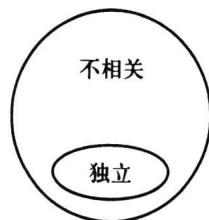
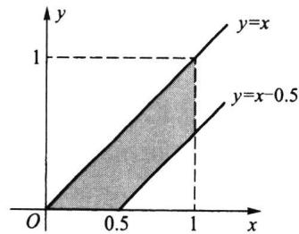

import Example from '@/components/Example.astro';
import Knowledge from '@/components/Knowledge.astro';
import Solution from '@/components/Solution.astro';
import Note from '@/components/Note.astro';
import Block from '@/components/Block.astro';

类似于一维随机变量的特征数,多维随机变量也有特征数,除了各个分量的期望、方差、标准差以外，还有两个随机变量间的关联程度，即协方差与相关系数，这是一种反映两个随机变量相依关系的特征数，要特别注意.

## 3.4.1 多维随机变量函数的数学期望

在第二章中, 在求一维随机变量函数 $Y = g(X)$ 的数学期望中, 定理 2.2.1 发挥了重要的作用. 现在要求多维随机变量函数 $Z = g(X_{1}, X_{2}, \cdots, X_{n})$ 的数学期望 $E(Z)$ , 下面的定理 3.4.1 也起着很重要的作用. 利用此定理, 可以省略求随机变量函数 $Z = g(X_{1}, X_{2}, \cdots, X_{n})$ 的分布. 此定理的证明涉及更多的工具, 在此省略了. 为简单起见, 我们用二维随机变量叙述此定理, 而对 $n$ 维随机变量结论是类似的.

<Knowledge title="定理 3.4.1">
若二维随机变量 $(X,Y)$ 的分布用联合分布列 $P(X=x_{i},Y=y_{j})$ 或用联合密度函数 $p(x,y)$ 表示，则 $Z=g(X,Y)$ 的数学期望为

$$

E (Z) = \left\{ \begin{array}{l l} { \sum_ {i}    \sum_ {j} g (  x _ {i}, y _ {j})   P (  X = x _ {i}, Y = y _ {j})  ,} & {\text {在离散场合}  ,} \\ { \int_ {- \infty} ^ {\infty}    \int_ {- \infty} ^ {\infty} g (  x, y) p (  x, y)   \mathrm{d} x \mathrm{d} y  ,} & {\text {在连续场合}.} \end{array} \right.\tag{3.4.1}

$$

这里所涉及的数学期望都假设存在.

还要指出,在连续场合(离散场合也类似)有:

\- 当 $g(X,Y) = X$ 时，可得 $X$ 的数学期望为

$$

E (X) = \int_ {- \infty} ^ {\infty} \int_ {- \infty} ^ {\infty} x p (x, y) \mathrm{d} x \mathrm{d} y = \int_ {- \infty} ^ {\infty} x p _ {X} (x) \mathrm{d} x.

$$

\- 当 $g(X,Y) = (X - E(X))^2$ 时，可得 $X$ 的方差为

$$

\begin{array}{r l} \mathrm{Var} (X) & = E (X - E (X)) ^ {2} = \int_ {- \infty} ^ {\infty} \int_ {- \infty} ^ {\infty} (x - E (X)) ^ {2} p (x, y) \mathrm{d} x \mathrm{d} y \\ & = \int_ {- \infty} ^ {\infty} (x - E (X)) ^ {2} p _ {X} (x) \mathrm{d} x. \end{array}

$$

类似地可给出 Y 的数学期望与方差的公式.
</Knowledge>

<Example title="例 3.4.1">
在长为 a 的线段上任取两个点 X 与 Y, 求此两点间的平均长度.

<Solution title="解">
因为 $X$ 与 $Y$ 都服从 $(0, a)$ 上的均匀分布，且 $X$ 与 $Y$ 相互独立，所以 $(X, Y)$ 的联合密度函数为

$$

p (x, y) = \left\{ \begin{array}{l l} \frac {1}{a ^ {2}}, & 0 <   x <   a, \quad 0 <   y <   a, \\ 0, & \text {其他}. \end{array} \right.

$$

利用定理 3.4.1, 得两点间的平均长度为

$$

\begin{array}{r l} E (| X - Y |) & = \int_ {0} ^ {a} \int_ {0} ^ {a} | x - y | \frac {1}{a ^ {2}} \mathrm{d} x \mathrm{d} y \\ & = \frac {1}{a ^ {2}} \Bigl \{\int_ {0} ^ {a} \int_ {0} ^ {x} (x - y) \mathrm{d} y \mathrm{d} x + \int_ {0} ^ {a} \int_ {x} ^ {a} (y - x) \mathrm{d} y \mathrm{d} x \Bigr \} \\ & = \frac {1}{a ^ {2}} \Bigl \{\int_ {0} ^ {a} \left(x ^ {2} - a x + \frac {a ^ {2}}{2}\right) \mathrm{d} x \Bigr \} = \frac {a}{3}. \end{array}

$$
</Solution>
</Example>

<Note>
,利用定理 3.4.1,虽然可以省略求随机变量函数的分布,但在某些场合所涉及的求和或求积难以计算,此时只能分两步进行:先求随机变量函数 $Z=g(X_{1},X_{2},\cdots,X_{n})$ 的分布,然后再由 Z 的分布去求 $E(Z)$ ,见下例.
</Note>

<Example title="例 3.4.2">
设 $X_{1}$ 和 $X_{2}$ 是独立同分布的随机变量, 其共同分布为指数分布 $Exp(\lambda)$ . 试求 $Y = \max\{X_{1}, X_{2}\}$ 的数学期望.

<Solution title="解">
在前面例3.3.4中已求得 $Y = \max \{X_1, X_2\}$ 的密度函数为

$$

p _ {Y} (y) = 2 \left(1 - e ^ {- \lambda y}\right) \lambda e ^ {- \lambda y}, \quad y > 0.

$$

这时 $Y = \max \{X_{1}, X_{2}\}$ 的数学期望为

$$

\begin{array}{r l} E [ \max \{X _ {1}, X _ {2} \} ] & = \int_ {0} ^ {\infty} 2 \lambda y (1 - e ^ {- \lambda y}) e ^ {- \lambda y} d y \\ & = 2 \int_ {0} ^ {\infty} y e ^ {- \lambda y} d (\lambda y) - \int_ {0} ^ {\infty} y e ^ {- 2 \lambda y} d (2 \lambda y) \\ & = \frac {2}{\lambda} \int_ {0} ^ {\infty} u e ^ {- u} d u - \frac {1}{2 \lambda} \int_ {0} ^ {\infty} v e ^ {- v} d v \\ & = \frac {2}{\lambda} \Gamma (2) - \frac {1}{2 \lambda} \Gamma (2) = \frac {3}{2 \lambda}. \end{array}

$$
</Solution>
</Example>

## 3.4.2 数学期望与方差的运算性质

在第二章中曾给出了数学期望与方差的一些简单性质,在此利用以上定理3.4.1,我们就可以给出数学期望和方差的一些运算性质,以下均假定有关的期望和方差存在.

<Knowledge title="性质 3.4.1">
设 $(X,Y)$ 是二维随机变量,则有

$$

E (X + Y) = E (X) + E (Y).\tag{3.4.2}

$$

<Solution title="证明">
不妨设 $(X,Y)$ 为连续随机变量（对离散随机变量可类似证明），其联合密度函数为 $p(x,y)$ ，若令 $g(X,Y) = X + Y$ ，则由定理3.4.1可得

$$

\begin{array}{r l} E (X + Y) & = \int_ {- \infty} ^ {\infty} \int_ {- \infty} ^ {\infty} (x + y) p (x, y) \mathrm{d} x \mathrm{d} y \\ & = \int_ {- \infty} ^ {\infty} x \left[ \int_ {- \infty} ^ {\infty} p (x, y) \mathrm{d} y \right] \mathrm{d} x + \int_ {- \infty} ^ {\infty} y \left[ \int_ {- \infty} ^ {\infty} p (x, y) \mathrm{d} x \right] \mathrm{d} y \\ & = \int_ {- \infty} ^ {\infty} x p _ {X} (x) \mathrm{d} x + \int_ {- \infty} ^ {\infty} y p _ {Y} (y) \mathrm{d} y \\ & = E (X) + E (Y). \end{array}

$$

这个性质可简单叙述为:和的期望等于期望的和.这个性质还可推广到 n 维随机变量场合,即

$$

E \left(X _ {1} + X _ {2} + \dots + X _ {n}\right) = E \left(X _ {1}\right) + E \left(X _ {2}\right) + \dots + E \left(X _ {n}\right).\tag{3.4.3}

$$
</Solution>
</Knowledge>

<Knowledge title="性质 3.4.2">
若随机变量 X 与 Y 相互独立, 则有

$$

E (X Y) = E (X) E (Y).\tag{3.4.4}

$$

<Solution title="证明">
不妨设 $(X,Y)$ 为连续随机变量（对离散随机变量可类似证明），其联合密度函数为 $p(x,y)$ ，由 $X$ 与 $Y$ 独立可知 $p(x,y) = p_X(x)p_Y(y)$ . 若令 $g(X,Y) = XY$ ，则由定理3.4.1可得

$$

E (X Y) = \int_ {- \infty} ^ {\infty} \int_ {- \infty} ^ {\infty} x y p _ {X} (x) p _ {Y} (y) \mathrm{d} x \mathrm{d} y = \int_ {- \infty} ^ {\infty} x p _ {X} (x) \mathrm{d} x \int_ {- \infty} ^ {\infty} y p _ {Y} (y) \mathrm{d} y = E (X) E (Y).

$$

这个性质可简单叙述为:在独立场合,随机变量乘积的数学期望等于数学期望的

乘积,这个性质还可推广到 n 维随机变量场合,即若 $X_{1}, X_{2}, \cdots, X_{n}$ 相互独立,则有

$$

E (X _ {1} X _ {2} \dots X _ {n}) = E (X _ {1}) E (X _ {2}) \dots E (X _ {n}).\tag{3.4.5}

$$
</Solution>
</Knowledge>

<Knowledge title="性质 3.4.3">
若随机变量 X 与 Y 相互独立, 则有

$$

\operatorname{Var} (X \pm Y) = \operatorname{Var} (X) + \operatorname{Var} (Y).

$$

<Solution title="证明">
由性质3.4.1和3.4.2可得

$$

\begin{array}{r l} \operatorname{Var} (X \pm Y) & = E (X \pm Y - E (X \pm Y)) ^ {2} = E ((X - E (X)) \pm (Y - E (Y))) ^ {2} \\ & = \operatorname{Var} (X) + \operatorname{Var} (Y) \pm 2 E (X - E (X)) (Y - E (Y)), \end{array}

$$

最后一项因独立性而为零,故证得性质 3.4.3.

这个性质表明:独立变量代数和的方差等于各方差之和.但要注意此性质对标准差不成立,即 $\sigma(X\pm Y)\neq\sigma(X)+\sigma(Y)$ .独立变量代数和的标准差只能通过“先方差,后标准差”求得,即

$$

\sigma (X \pm Y) = \sqrt {\operatorname{Var} (X) + \operatorname{Var} (Y)}

$$

这个性质可推广到 n 维随机变量场合, 即若 $X_{1}, X_{2}, \cdots, X_{n}$ 相互独立, 则有

$$

\operatorname{Var} \left(X _ {1} \pm X _ {2} \pm \dots \pm X _ {n}\right) = \operatorname{Var} \left(X _ {1}\right) + \operatorname{Var} \left(X _ {2}\right) + \dots + \operatorname{Var} \left(X _ {n}\right).\tag{3.4.6}

$$

这表明:对独立随机变量来说,它们之间无论是相加或相减,其方差总是逐个累积起来,只会增加,不会减少.

特别, n 个相互独立同分布(方差为 $\sigma^{2}$ ) 的随机变量 $X_{1}, X_{2}, \cdots, X_{n}$ 的算术平均的方差为

$$

\operatorname{Var} \left(\frac {1}{n} \sum_ {i = 1} ^ {n} X _ {i}\right) = \frac {\sigma^ {2}}{n}.

$$

这说明,若对某物理量 $\mu$ 进行测量(如称重)时,可用 n 次独立重复测量的平均数来提高测量的精度.
</Solution>
</Knowledge>

<Example title="例 3.4.3">
已知随机变量 $X_{1}, X_{2}, X_{3}$ 相互独立，且 $X_{1} \sim U(0, 6), X_{2} \sim N(1, 3), X_{3} \sim Exp(3)$ . 求 $Y = X_{1} - 2X_{2} + 3X_{3}$ 的数学期望、方差和标准差.

<Solution title="解">
由数学期望和方差的运算性质得

$$

E (X _ {1} - 2 X _ {2} + 3 X _ {3}) = 3 - 2 \times 1 + 3 \times \frac {1}{3} = 2.

$$

$$

\operatorname{Var} (X _ {1} - 2 X _ {2} + 3 X _ {3}) = \frac {6 ^ {2}}{1 2} + 4 \times 3 + 9 \times \frac {1}{9} = 1 6.

$$

$$

\sigma \left(X _ {1} - 2 X _ {2} + 3 X _ {3}\right) = \sqrt {\operatorname{Var} \left(X _ {1} - 2 X _ {2} + 3 X _ {3}\right)} = \sqrt {1 6} = 4.

$$

将一个随机变量写成几个随机变量的和,然后再利用数学期望的性质去进行计算,可以使复杂的计算变得简单,下例说明了这一点.
</Solution>
</Example>

<Example title="例 3.4.4">
设一袋中装有 m 个颜色各不相同的球, 每次从中任取一个, 有放回地摸取 n 次, 以 X 表示在 n 次摸球中摸到球的不同颜色的数目, 求 $E(X)$ .

<Solution title="解">
直接写出 X 的分布列较为困难, 其原因在于: 若第 i 种颜色的球被取到过, 则此种颜色的球又可被取到过一次、二次……n 次, 情况较多, 而其对立事件“第 i 种颜色的球没被取到过”的概率容易写出为

$P(\text{第 } i \text{ 种颜色的球在 } n \text{ 次摸球中一次也没被摸到}) = \left(1 - \frac{1}{m}\right)^n.$

为此令

$X_{i}=\left\{\begin{aligned}&1,& 第 i 种颜色的球在 n 次摸球中至少被摸到一次,\\ &0,& 第 i 种颜色的球在 n 次摸球中一次也没被摸到,\end{aligned}\right.$ $i=1,2,\cdots,m.$

这些 $X_{i}$ 相当于是计数器，分别记录下第 $i$ 种颜色的球是否被取到过，而 $X$ 是取到过的不同颜色总数，所以 $X = \sum_{i=1}^{m} X_{i}$ . 由

$$

P (X _ {i} = 0) = \left(1 - \frac {1}{m}\right) ^ {n},

$$

可得

$$

E (X _ {i}) = P (X _ {i} = 1) = 1 - P (X _ {i} = 0) = 1 - \left(1 - \frac {1}{m}\right) ^ {n},

$$

所以

$$

E (X) = m E (X _ {i}) = m \left[ 1 - \left(1 - \frac {1}{m}\right) ^ {n} \right].

$$

譬如，在 $m = n = 6$ 时，

$$

E (X) = 6 \left[ 1 - \left(\frac {5}{6}\right) ^ {6} \right] = 3. 9 9 \approx 4,

$$

这表明袋中有6个不同颜色的球,从中有放回地摸取6次,平均只能摸到4种颜色的球.
</Solution>
</Example>

<Example title="例 3.4.5">
设随机变量 $X \sim b(n, p)$ ，试求 X 的数学期望和方差.

<Solution title="解">
二项分布的数学期望和方差在第二章中已经求得,但其计算过程较为复杂.在此用另一种简便的方法求之.令 $X_{1}, X_{2}, \cdots, X_{n}$ 相互独立,诸 $X_{i}$ 都服从二点分布 $b(1, p)$ ,则

$$

E (X _ {i}) = p, \quad \operatorname{Var} (X _ {i}) = p (1 - p),

$$

且 $X=X_{1}+X_{2}+\cdots+X_{n}\sim b(n,p)$ ，由此得

$$

E (X) = E \left(\sum_ {i = 1} ^ {n} X _ {i}\right) = \sum_ {i = 1} ^ {n} E (X _ {i}) = n p.

$$

$$

\operatorname{Var} (X) = \operatorname{Var} \left(\sum_ {i = 1} ^ {n} X _ {i}\right) = \sum_ {i = 1} ^ {n} \operatorname{Var} (X _ {i}) = \sum_ {i = 1} ^ {n} p (1 - p) = n p (1 - p).

$$

譬如,72次掷骰子中6点出现次数 $X \sim b(72,1/6)$ ，平均次数 $E(X) = 72/6 = 12$ ，方差 $\operatorname{Var}(X) = (72/6) \times (5/6) = 10$ ，标准差 $\sigma(X) = \sqrt{10} = 3.16$ .
</Solution>
</Example>

## 3.4.3 协方差

二维联合分布中除含有各分量的边际分布外,还含有两个分量间相互关系的信息.描述这种相互关联程度的一个特征数就是协方差,它的定义如下:

<Knowledge title="定义 3.4.1">
设 $(X, Y)$ 是一个二维随机变量，若 $E[(X - E(X))(Y - E(Y))]$ 存在，则称此数学期望为 $X$ 与 $Y$ 的协方差，或称为 $X$ 与 $Y$ 的相关（中心）矩，并记为

$$

\operatorname{Cov} (X, Y) = E \left[ (X - E (X)) (Y - E (Y)) \right].\tag{3.4.7}

$$

特别有 $\mathrm{Cov}(X,X)=\mathrm{Var}(X)$ .

从协方差的定义可以看出,它是 X 的偏差“ $X-E(X)$ ”与 Y 的偏差“ $Y-E(Y)$ ”乘积

的数学期望.由于偏差可正可负,故协方差也可正可负,也可为零,其具体表现如下:

\- 当 $\operatorname{Cov}(X, Y) > 0$ 时, 称 $X$ 与 $Y$ 正相关, 这时两个偏差 $(X - E(X))$ 与 $(Y - E(Y))$ 有同时增加或同时减少的倾向. 由于 $E(X)$ 与 $E(Y)$ 都是常数, 故等价于 $X$ 与 $Y$ 有同时增加或同时减少的倾向, 这就是正相关的含义.

\- 当 $\operatorname{Cov}(X, Y) < 0$ 时, 称 $X$ 与 $Y$ 负相关, 这时有 $X$ 增加而 $Y$ 减少的倾向, 或有 $Y$ 增加而 $X$ 减少的倾向, 这就是负相关的含义.

\- 当 $\operatorname{Cov}(X, Y) = 0$ 时, 称 $X$ 与 $Y$ 不相关. 这时可能由两类情况导致: 一类是 $X$ 与 $Y$ 的取值毫无关联 (见性质3.4.5), 另一类是 $X$ 与 $Y$ 间存有某种非线性关系 (见例3.4.6).

下面的性质在协方差的计算中是很有用的.
</Knowledge>

<Knowledge title="性质 3.4.4">
$\operatorname{Cov}(X,Y) = E(XY) - E(X)E(Y)$ .

<Solution title="证明">
由协方差的定义和数学期望的性质可知

$$

\begin{array}{r l} \operatorname{Cov} (X, Y) & = E [ X Y - X E (Y) - Y E (X) + E (X) E (Y) ] \\ & = E (X Y) - E (X) E (Y). \end{array}

$$

现在我们用下面的性质来说明：“不相关”是比“独立”更弱的一个概念.
</Solution>
</Knowledge>

<Knowledge title="性质 3.4.5">
若随机变量 X 与 Y 相互独立, 则 $\mathrm{Cov}(X,Y)=0$ , 反之不然.

<Solution title="证明">
这是因为在独立场合有 $E(XY) = E(X)E(Y)$ , 再由以上性质3.4.4即可得协方差为零. 反之不然, 可见下面的反例.
</Solution>
</Knowledge>

<Example title="例 3.4.6">
设随机变量 $X \sim N(0, \sigma^{2})$ ，且令 $Y = X^{2}$ ，则 X 与 Y 不独立。此时 X 与 Y 的协方差为

$$

\operatorname{Cov} (X, Y) = \operatorname{Cov} (X, X ^ {2}) = E (X \cdot X ^ {2}) - E (X) E (X ^ {2}) = 0.

$$

最后的等式是因为正态分布 $N(0, \sigma^{2})$ 的奇数阶原点矩均为零，即 $E(X) = E(X^{3}) = 0$ .

这个例子表明，“独立”必导致“不相关”，而“不相关”不一定导致“独立”（见图3.4.1). 独立要求严，不相关要求宽. 因为独立性是用分布定义的，而不相关只是用矩定义的. 二者之间的差别一定要认识到.

  

图3.4.1 不相关与独立的逻辑关系

另外可以看出,前面有关数学期望的性质3.4.2:若X与Y相互独立,则 $E(XY)=E(X)E(Y)$ ,现可以将条件“独立”降弱为“不相关”.

协方差概念的引入可以完善随机变量和的方差计算,请看下面性质.
</Example>

<Knowledge title="性质 3.4.6">
对任意二维随机变量 $(X,Y)$ ，有

$$

\operatorname{Var} (X \pm Y) = \operatorname{Var} (X) + \operatorname{Var} (Y) \pm 2 \operatorname{Cov} (X, Y).\tag{3.4.8}

$$

<Solution title="证明">
由方差的定义知

$$

\begin{array}{r l} \operatorname{Var} (X \pm Y) & = E [ (X \pm Y) - E (X \pm Y) ] ^ {2} \\ & = E \left\{\left[ X - E (X) \right] \pm [ Y - E (Y) ] \right\} ^ {2} \\ & = E \left\{\left[ X - E (X) \right] ^ {2} + [ Y - E (Y) ] \right\} ^ {2} \pm 2 [ X - E (X) ] [ Y - E (Y) ] \\ & = \operatorname{Var} (X) + \operatorname{Var} (Y) \pm 2 \operatorname{Cov} (X, Y). \end{array}

$$

这个性质表明: 在 X 与 Y 相关的场合, 和的方差不等于方差的和. X 与 Y 的正相关会增加和的方差, 负相关会减少和的方差, 而在 X 与 Y 不相关的场合, 和的方差等于方差的和.这又可将前面有关方差的性质3.4.3修改如下：

若 $X$ 与 $Y$ 不相关，则 $\operatorname{Var}(X \pm Y) = \operatorname{Var}(X) + \operatorname{Var}(Y)$

以上性质 3.4.6 还可以推广到更多个随机变量场合, 即对任意 n 个随机变量 $X_{1}, X_{2}, \cdots, X_{n}$ , 有

$$

\operatorname{Var} \left(\sum_ {i = 1} ^ {n} X _ {i}\right) = \sum_ {i = 1} ^ {n} \operatorname{Var} \left(X _ {i}\right) + 2 \sum_ {i = 1} ^ {n} \sum_ {j = 1} ^ {i - 1} \operatorname{Cov} \left(X _ {i}, X _ {j}\right).\tag{3.4.9}

$$

关于协方差的计算,还有下面四条有用的性质.
</Solution>
</Knowledge>

<Knowledge title="性质 3.4.7">
协方差 $\mathrm{Cov}(X,Y)$ 的计算与 X,Y 的次序无关, 即

$$

\operatorname{Cov} (X, Y) = \operatorname{Cov} (Y, X).

$$

<Solution title="证明">
这由协方差的定义就可看出.
</Solution>
</Knowledge>

<Knowledge title="性质 3.4.8">
任意随机变量 X 与常数 a 的协方差为零, 即

$$

\operatorname{Cov} (X, a) = 0.

$$

<Solution title="证明">
这只要用协方差的定义计算一下即可得知.
</Solution>
</Knowledge>

<Knowledge title="性质 3.4.9">
对任意常数 a, b, 有

$$

\operatorname{Cov} (a X, b Y) = a b \operatorname{Cov} (X, Y).

$$

<Solution title="证明">
由协方差的定义知

$$

\operatorname{Cov} (a X, b Y) = E \left[ (a X - E (a X)) (b Y - E (b Y)) \right].

$$

把公因子 a 与 b 提出, 即得 $ab\mathrm{Cov}(X,Y)$ .
</Solution>
</Knowledge>

<Knowledge title="性质 3.4.10">
设 X, Y, Z 是任意三个随机变量, 则

$$

\operatorname{Cov} (X + Y, Z) = \operatorname{Cov} (X, Z) + \operatorname{Cov} (Y, Z).

$$

<Solution title="证明">
由协方差的性质3.4.4得

$$

\begin{array}{r l} \operatorname{Cov} (X + Y, Z) & = E [ (X + Y) Z ] - E (X + Y) E (Z) \\ & = E (X Z) + E (Y Z) - E (X) E (Z) - E (Y) E (Z) \\ & = [ E (X Z) - E (X) E (Z) ] + [ E (Y Z) - E (Y) E (Z) ] \\ & = \operatorname{Cov} (X, Z) + \operatorname{Cov} (Y, Z). \end{array}

$$
</Solution>
</Knowledge>

<Example title="例 3.4.7">
设二维随机变量 $(X,Y)$ 的联合密度函数为

$$

p (x, y) = \left\{ \begin{array}{l l} 3 x, & 0 <   y <   x <   1, \\ 0, & \text {其他}. \end{array} \right.

$$

试求 $\mathrm{Cov}(X,Y)$ .

<Solution title="解">
利用协方差的计算公式,我们需要先计算 $E(X)$ , $E(Y)$ , $E(XY)$ 的值,它们可直接用 $p(x,y)$ 导出,但要注意积分限的确定,具体如下:

$$

E (X) = \int_ {0} ^ {1} \int_ {0} ^ {x} x \cdot 3 x \mathrm{d} y \mathrm{d} x = \int_ {0} ^ {1} 3 x ^ {3} \mathrm{d} x = \frac {3}{4}.

$$

$$

E (Y) = \int_ {0} ^ {1} \int_ {0} ^ {x} y \cdot 3 x \mathrm{d} y \mathrm{d} x = \int_ {0} ^ {1} \frac {3 x ^ {3}}{2} \mathrm{d} x = \frac {3}{8}.

$$

$$

E (X Y) = \int_ {0} ^ {1} \int_ {0} ^ {x} x y \cdot 3 x \mathrm{d} y \mathrm{d} x = \int_ {0} ^ {1} \frac {3 x ^ {4}}{2} \mathrm{d} x = \frac {3}{1 0}.

$$

因此我们得

$$

\operatorname{Cov} (X, Y) = \frac {3}{1 0} - \frac {3}{4} \times \frac {3}{8} = \frac {3}{1 6 0} > 0.

$$

由此我们还可以得结论:X 与 Y 不相互独立.
</Solution>
</Example>

<Example title="例 3.4.8">
设二维随机变量 $(X,Y)$ 的联合密度函数为

$$

p (x, y) = \left\{ \begin{array}{l l} \frac {1}{3} (x + y), & 0 <   x <   1, \quad 0 <   y <   2, \\ 0, & \text {其他}. \end{array} \right.

$$

试求 $\mathrm{Var}(2X-3Y+8)$ .

<Solution title="解">
因为

$$

\begin{array}{r l} \operatorname{Var} (2 X - 3 Y + 8) & = \operatorname{Var} (2 X) + \operatorname{Var} (3 Y) - 2 \operatorname{Cov} (2 X, 3 Y) \\ & = 4 \operatorname{Var} (X) + 9 \operatorname{Var} (Y) - 1 2 \operatorname{Cov} (X, Y), \end{array}

$$

所以我们先要分别计算 $E(X), E(X^2), E(Y), E(Y^2), E(XY)$ . 为此先计算两个边际密度函数.

$$

p _ {x} (x) = \int_ {0} ^ {2} \frac {1}{3} (x + y) \mathrm{d} y = \frac {2}{3} (x + 1), \quad 0 <   x <   1,

$$

$$

p _ {Y} (y) = \int_ {0} ^ {1} \frac {1}{3} (x + y) \mathrm{d} x = \frac {1}{3} \left(\frac {1}{2} + y\right), \quad 0 <   y <   2.

$$

然后再计算一、二阶矩，

$$

E (X) = \int_ {0} ^ {1} \frac {2}{3} x (x + 1) \mathrm{d} x = \frac {5}{9},

$$

$$

E (X ^ {2}) = \int_ {0} ^ {1} \frac {2}{3} x ^ {2} (x + 1) \mathrm{d} x = \frac {7}{1 8},

$$

$$

E (Y) = \int_ {0} ^ {2} \frac {1}{3} y \left(\frac {1}{2} + y\right) \mathrm{d} y = \frac {1 1}{9},

$$

$$

E (Y ^ {2}) = \int_ {0} ^ {2} \frac {1}{3} y ^ {2} \left(\frac {1}{2} + y\right) \mathrm{d} y = \frac {1 6}{9}.

$$

由此得

$$

\operatorname{Var} (X) = \frac {7}{1 8} - \left(\frac {5}{9}\right) ^ {2} = \frac {1 3}{1 6 2}, \quad \operatorname{Var} (Y) = \frac {1 6}{9} - \left(\frac {1 1}{9}\right) ^ {2} = \frac {2 3}{8 1}.

$$

最后还需要计算 $E(XY)$ ，它只能从联合密度函数导出.

$$

E (X Y) = \frac {1}{3} \int_ {0} ^ {1} \int_ {0} ^ {2} x y (x + y) \mathrm{d} y \mathrm{d} x = \frac {1}{3} \int_ {0} ^ {1} \left(2 x ^ {2} + \frac {8}{3} x\right) \mathrm{d} x = \frac {2}{3}.

$$

于是得协方差为

$$

\operatorname{Cov} (X, Y) = \frac {2}{3} - \frac {5}{9} \times \frac {1 1}{9} = - \frac {1}{8 1}.

$$

代回原式得

$$

\operatorname{Var} (2 X - 3 Y + 8) = 4 \times \frac {1 3}{1 6 2} + 9 \times \frac {2 3}{8 1} - 1 2 \times \left(- \frac {1}{8 1}\right) = \frac {2 4 5}{8 1}.

$$
</Solution>
</Example>

## 3.4.4 相关系数

协方差 $\mathrm{Cov}(X,Y)$ 是有量纲的量，譬如 X 表示人的身高，单位是米(m)，Y 表示人的体重，单位是千克(kg)，则 $\mathrm{Cov}(X,Y)$ 带有量纲(m·kg).为了消除量纲的影响，现对协方差除以相同量纲的量,就得到一个新的概念——相关系数,它的定义如下.

<Knowledge title="定义 3.4.2">
设 $(X,Y)$ 是一个二维随机变量, 且 $\operatorname{Var}(X)=\sigma_{X}^{2}>0$ , $\operatorname{Var}(Y)=\sigma_{Y}^{2}>0$ . 则称

$$

\operatorname{Corr} (X, Y) = \frac {\operatorname{Cov} (X , Y)}{\sqrt {\operatorname{Var} (X)} \sqrt {\operatorname{Var} (Y)}} = \frac {\operatorname{Cov} (X , Y)}{\sigma_ {X} \sigma_ {Y}}\tag{3.4.10}

$$

为 X 与 Y 的(线性)相关系数.

从以上定义中可看出: 相关系数 $\operatorname{Corr}(X,Y)$ 与协方差 $\operatorname{Cov}(X,Y)$ 是同符号的, 即同为正, 或同为负, 或同为零. 这说明, 从相关系数的取值也可反映出 X 与 Y 的正相关、负相关和不相关.

相关系数的另一个解释是:它是相应标准化变量的协方差.若记 X 与 Y 的数学期望分别为 $\mu_{X}, \mu_{Y}$ ，其标准化变量为

$$

X ^ {*} = \frac {X - \mu_ {X}}{\sigma_ {X}}, Y ^ {*} = \frac {Y - \mu_ {Y}}{\sigma_ {Y}},

$$

则有

$$

\operatorname{Cov} (X ^ {*}, Y ^ {*}) = \operatorname{Cov} \left(\frac {X - \mu_ {X}}{\sigma_ {X}}, \frac {Y - \mu_ {Y}}{\sigma_ {Y}}\right) = \frac {\operatorname{Cov} (X , Y)}{\sigma_ {X} \sigma_ {Y}} = \operatorname{Corr} (X, Y).

$$
</Knowledge>

<Example title="例 3.4.9">
二维正态分布 $N(\mu_{1},\mu_{2},\sigma_{1}^{2},\sigma_{2}^{2},\rho)$ 的相关系数就是 $\rho$ .

<Solution title="解">
下面先求 $\mathrm{Cov}(X,Y)$ .

$$

\begin{array}{r l} \operatorname{Cov} (X, Y) & = E [ (X - E (X)) (Y - E (Y)) ] \\ & = \frac {1}{2 \pi \sigma_ {1} \sigma_ {2} \sqrt {1 - \rho^ {2}}} \int_ {- \infty} ^ {\infty} \int_ {- \infty} ^ {\infty} (x - \mu_ {1}) (y - \mu_ {2}) \cdot \\ & \exp \left\{- \frac {1}{2 (1 - \rho^ {2})} \left[ \frac {(x - \mu_ {1}) ^ {2}}{\sigma_ {1} ^ {2}} - 2 \rho \frac {(x - \mu_ {1}) (y - \mu_ {2})}{\sigma_ {1} \sigma_ {2}} + \right. \right. \\ & \left. \left. \frac {(y - \mu_ {2}) ^ {2}}{\sigma_ {2} ^ {2}} \right] \right\} d x d y. \end{array}

$$

先将上式中方括号内化成

$$

\left(\frac {x - \mu_ {1}}{\sigma_ {1}} - \rho \frac {y - \mu_ {2}}{\sigma_ {2}}\right) ^ {2} + \left(\sqrt {1 - \rho^ {2}} \frac {y - \mu_ {2}}{\sigma_ {2}}\right) ^ {2},

$$

再作变量变换

$$

\left\{ \begin{array}{l} u = \frac {1}{\sqrt {1 - \rho^ {2}}} \left(\frac {x - \mu_ {1}}{\sigma_ {1}} - \rho \frac {y - \mu_ {2}}{\sigma_ {2}}\right), \\ v = \frac {y - \mu_ {2}}{\sigma_ {2}}, \end{array} \right.

$$

则

$$

\left\{ \begin{array}{l} x - \mu_ {1} = \sigma_ {1} (u \sqrt {1 - \rho^ {2}} + \rho v), \\ y - \mu_ {2} = \sigma_ {2} v, \end{array} \right.

$$

$$

\mathrm{d} x \mathrm{d} y = | J | \mathrm{d} u \mathrm{d} v = \sigma_ {1} \sigma_ {2} \sqrt {1 - \rho^ {2}} \mathrm{d} u \mathrm{d} v.

$$

由此得

$$

\operatorname{Cov} (X, Y) = \frac {\sigma_ {1} \sigma_ {2}}{2 \pi} \int_ {- \infty} ^ {\infty} \int_ {- \infty} ^ {\infty} \left(u v \sqrt {1 - \rho^ {2}} + \rho v ^ {2}\right) \exp \left\{- \frac {1}{2} (u ^ {2} + v ^ {2}) \right\} \mathrm{d} u \mathrm{d} v.

$$

上式右端积分可以分为两个积分之和,其中

$$

\int_ {- \infty} ^ {\infty} \int_ {- \infty} ^ {\infty} u v \exp \left\{- \frac {1}{2} (u ^ {2} + v ^ {2}) \right\} d u d v = 0,

$$

$$

\int_ {- \infty} ^ {\infty} \int_ {- \infty} ^ {\infty} v ^ {2} \exp \left\{- \frac {1}{2} (u ^ {2} + v ^ {2}) \right\} \mathrm{d} u \mathrm{d} v = 2 \pi .

$$

从而

$$

\operatorname{Cov} (X, Y) = \frac {\sigma_ {1} \sigma_ {2}}{2 \pi} \cdot \rho \cdot 2 \pi = \rho \sigma_ {1} \sigma_ {2},

$$

$$

\mathrm{Corr} (X, Y) = \frac {\mathrm{Cov} (X , Y)}{\sigma_ {1} \sigma_ {2}} = \rho .

$$

为了研究相关系数的性质,需要如下引理.
</Solution>
</Example>

<Knowledge title="引理 3.4.1">
(施瓦茨(Schwarz)不等式) 对任意二维随机变量 $(X,Y)$ ，若 X 与 Y 的方差都存在，且记 $\sigma_{X}^{2}=\mathrm{Var}(X)$ ， $\sigma_{Y}^{2}=\mathrm{Var}(Y)$ ，则有

$$

\left[ \mathrm{Cov} (X, Y) \right] ^ {2} \leqslant \sigma_ {X} ^ {2} \sigma_ {Y} ^ {2}.\tag{3.4.11}

$$

<Solution title="证明">
不妨设 $\sigma_X^2 > 0$ ，因为当 $\sigma_X^2 = 0$ 时，则 $X$ 几乎处处为常数，因而其与 $Y$ 的协方差亦为零，从而(3.4.11)式两端皆为零，结论成立。若 $\sigma_X^2 > 0$ 成立，考虑 $t$ 的如下二次函数：

$$

g (t) = E [ t (X - E (X)) + (Y - E (Y)) ] ^ {2} = t ^ {2} \sigma_ {X} ^ {2} + 2 t \cdot \operatorname{Cov} (X, Y) + \sigma_ {Y} ^ {2}.

$$

由于上述的二次三项式非负,平方项系数 $\sigma_{x}^{2}$ 为正,所以其判别式小于或等于零,即

$$

[ 2 \mathrm{Cov} (X, Y) ] ^ {2} - 4 \sigma_ {X} ^ {2} \sigma_ {Y} ^ {2} \leqslant 0.

$$

移项后即得施瓦茨不等式.

利用施瓦茨不等式立即可得相关系数的一个重要性质.
</Solution>
</Knowledge>

<Knowledge title="性质 3.4.11">
$-1\leqslant \mathrm{Corr}(X,Y)\leqslant 1$ ，或 $|\operatorname {Corr}(X,Y)|\leqslant 1.$

这个性质表明: 相关系数介于 -1 与 1 之间. 当相关系数为 $\pm1$ 时, 有另一重要性质.
</Knowledge>

<Knowledge title="性质 3.4.12">
$\operatorname{Corr}(X,Y)=\pm1$ 的充要条件是 X 与 Y 间几乎处处有线性关系, 即存在 $a(\neq0)$ 与 b, 使得

$$

P (Y = a X + b) = 1.

$$

其中当 $\mathrm{Corr}(X,Y)=1$ 时,有 a>0; 当 $\mathrm{Corr}(X,Y)=-1$ 时,有 a&lt;0.

<Solution title="证明">
充分性. 若 $Y = aX + b$ ( $X = cY + d$ 也一样), 则将

$$

\operatorname{Var} (Y) = a ^ {2} \operatorname{Var} (X), \quad \operatorname{Cov} (X, Y) = a \operatorname{Cov} (X, X) = a \operatorname{Var} (X)

$$

代入相关系数的定义中得

$$

\operatorname{Corr} (X, Y) = \frac {\operatorname{Cov} (X , Y)}{\sigma_ {X} \sigma_ {Y}} = \frac {a \operatorname{Var} (X)}{| a | \operatorname{Var} (X)} = \left\{ \begin{array}{l l} 1, & a > 0, \\ - 1, & a <   0. \end{array} \right.

$$

必要性.因为

$$

\mathrm{Var} \left(\frac {X}{\sigma_ {X}} \pm \frac {Y}{\sigma_ {Y}}\right) = 2 [ 1 \pm \mathrm{Corr} (X, Y) ],\tag{3.4.12}

$$

所以当 $\operatorname{Corr}(X,Y) = 1$ 时，有

$$

\mathrm{Var} \left(\frac {X}{\sigma_ {_ X}} - \frac {Y}{\sigma_ {_ Y}}\right) = 0,

$$

由此得

$$

P \left(\frac {X}{\sigma_ {x}} - \frac {Y}{\sigma_ {y}} = c\right) = 1,

$$

或

$$

P \left(Y = \frac {\sigma_ {Y}}{\sigma_ {X}} X - c \sigma_ {Y}\right) = 1.

$$

这就证明了: 当 $\mathrm{Corr}(X,Y)=1$ 时, Y 与 X 几乎处处为线性正相关.

当 $\operatorname{Corr}(X,Y) = -1$ 时，由(3.4.12)式得

$$

\mathrm{Var} \left(\frac {X}{\sigma_ {X}} + \frac {Y}{\sigma_ {Y}}\right) = 0,

$$

由此得

$$

P \left(\frac {X}{\sigma_ {x}} + \frac {Y}{\sigma_ {y}} = c\right) = 1,

$$

或

$$

P \left(Y = - \frac {\sigma_ {Y}}{\sigma_ {X}} X + c \sigma_ {Y}\right) = 1.

$$

这也证明了: 当 $\mathrm{Corr}(X,Y)=-1$ 时, Y 与 X 几乎处处为线性负相关.

对于这个性质可作以下几点说明：

\- 相关系数 $\operatorname{Corr}(X, Y)$ 刻画了 $X$ 与 $Y$ 之间的线性关系强弱, 因此也常称其为“线性相关系数”.

\- 若 $\operatorname{Corr}(X, Y) = 0$ ，则称 $X$ 与 $Y$ 不相关。不相关是指 $X$ 与 $Y$ 之间没有线性关系，但 $X$ 与 $Y$ 之间可能有其他的函数关系，譬如平方关系、对数关系等。

\- 若 $\operatorname{Corr}(X, Y) = 1$ ，则称 $X$ 与 $Y$ 完全正相关；若 $\operatorname{Corr}(X, Y) = -1$ ，则称 $X$ 与 $Y$ 完全负相关。

\- 若 $0 < |\operatorname{Corr}(X, Y)| < 1$ ，则称 $X$ 与 $Y$ 有“一定程度”的线性关系。 $|\operatorname{Corr}(X, Y)|$ 越接近于 1，则线性相关程度越高； $|\operatorname{Corr}(X, Y)|$ 越接近于 0，则线性相关程度越低。而协方差看不出这一点。若协方差很小，而其两个标准差 $\sigma_X$ 和 $\sigma_Y$ 也很小，则其比值就不一定很小，这可从下面例 3.4.10 看出。
</Solution>
</Knowledge>

<Example title="例 3.4.10">
已知随机向量 $(X,Y)$ 的联合密度函数为

$$

p (x, y) = \left\{ \begin{array}{l l} \frac {8}{3}, & 0 <   x - y <   0. 5, \quad 0 <   x, y <   1, \\ 0, & \text {其他}. \end{array} \right.

$$

求 X, Y 的相关系数 $\mathrm{Corr}(X, Y)$ .

<Solution title="解">
先计算两个边际密度函数.

当 $0 < x < 0.5$ 时，

$$

p _ {x} (x) = \int_ {- \infty} ^ {\infty} p (x, y) \mathrm{d} y = \int_ {0} ^ {x} \frac {8}{3} \mathrm{d} y = \frac {8}{3} x,

$$

当 $0.5 < x < 1$ 时，

$$

p _ {x} (x) = \int_ {- \infty} ^ {\infty} p (x, y) \mathrm{d} y = \int_ {x - 0. 5} ^ {x} \frac {8}{3} \mathrm{d} y = \frac {4}{3},

$$

所以得 $X$ 的边际密度函数为

$$

p _ {X} (x) = \left\{ \begin{array}{l l} \frac {8}{3} x, & 0 <   x <   0. 5, \\ \frac {4}{3}, & 0. 5 <   x <   1, \\ 0, & \text {其他}. \end{array} \right.

$$

  

图3.4.2 例3.4.10中 $p(x,y)$ 的非零区域

当 $0 < y < 0.5$ 时，

$$

p _ {Y} (y) = \int_ {- \infty} ^ {\infty} p (x, y) \mathrm{d} x = \int_ {y} ^ {y + 0. 5} \frac {8}{3} \mathrm{d} x = \frac {4}{3},

$$

当 $0.5 < y < 1$ 时，

$$

p _ {Y} (y) = \int_ {- \infty} ^ {\infty} p (x, y) \mathrm{d} x = \int_ {y} ^ {1} \frac {8}{3} \mathrm{d} x = \frac {8}{3} (1 - y),

$$

所以得 $Y$ 的边际密度函数为

$$

p _ {Y} (y) = \left\{ \begin{array}{l l} \frac {4}{3}, & 0 <   y <   0. 5, \\ \frac {8}{3} (1 - y), & 0. 5 <   y <   1, \\ 0, & \text {其他}. \end{array} \right.

$$

然后分别计算 $X$ 与 $Y$ 的一、二阶矩

$$

\begin{array}{l} {E (X) = \int_ {0} ^ {0. 5} \frac {8}{3} x ^ {2} \mathrm{d} x + \int_ {0. 5} ^ {1} \frac {4}{3} x \mathrm{d} x = \frac {1 1}{1 8},} \\ {E (Y) = \int_ {0} ^ {0. 5} \frac {4}{3} y \mathrm{d} y + \int_ {0. 5} ^ {1} \frac {8}{3} y (1 - y) \mathrm{d} y = \frac {7}{1 8},} \\ {E (X ^ {2}) = \int_ {0} ^ {0. 5} \frac {8}{3} x ^ {3} \mathrm{d} x + \int_ {0. 5} ^ {1} \frac {4}{3} x ^ {2} \mathrm{d} x = \frac {3 1}{7 2},} \\ {E (Y ^ {2}) = \int_ {0} ^ {0. 5} \frac {4}{3} y ^ {2} \mathrm{d} y + \int_ {0. 5} ^ {1} \frac {8}{3} y ^ {2} (1 - y) \mathrm{d} y = \frac {5}{2 4}.} \end{array}

$$

由此可得 $X$ 与 $Y$ 各自的方差

$$

\begin{array}{r l} \operatorname{Var} (X) & = \frac {3 1}{7 2} - \left(\frac {1 1}{1 8}\right) ^ {2} = \frac {3 7}{6 4 8}, \\ \operatorname{Var} (Y) & = \frac {5}{2 4} - \left(\frac {7}{1 8}\right) ^ {2} = \frac {3 7}{6 4 8}. \end{array}

$$

最后还需要计算 $E(XY)$ ，它只能从联合密度函数导出.

$$

\begin{array}{r l} E (X Y) & = \int_ {0} ^ {0. 5} \int_ {0} ^ {x} \frac {8}{3} x y \mathrm{d} y \mathrm{d} x + \int_ {0. 5} ^ {1} \int_ {x - 0. 5} ^ {x} \frac {8}{3} x y \mathrm{d} y \mathrm{d} x = \int_ {0} ^ {0. 5} \frac {4}{3} x ^ {3} \mathrm{d} x + \int_ {0. 5} ^ {1} \frac {4}{3} x \left(x - \frac {1}{4}\right) \mathrm{d} x \\ & = \frac {1}{4 8} + \frac {7}{1 8} - \frac {1}{8} = \frac {4 1}{1 4 4}. \end{array}

$$

最后得协方差和相关系数为

$$

\operatorname{Cov} (X, Y) = \frac {4 1}{1 4 4} - \frac {1 1}{1 8} \times \frac {7}{1 8} = \frac {6 1}{1 2 9 6} = 0. 0 4 7 1.

$$

$$

\mathrm{Corr} (X, Y) = \frac {\mathrm{Cov} (X , Y)}{\sigma_ {x} \sigma_ {y}} = \frac {6 1}{1 2 9 6} \times \frac {6 4 8}{3 7} = \frac {6 1}{7 4} = 0. 8 2 4 3.

$$

这里协方差很小,但其相关系数并不小.

上例中,从相关系数 $\mathrm{Corr}(X,Y)=0.8243$ 看,X 与 Y 有较高程度的正相关;但从相应的协方差 $\mathrm{Cov}(X,Y)=0.0471$ 看,X 与 Y 的相关性很微弱,几乎可以忽略不计.造成这种错觉的原因在于没有考虑标准差,若两个标准差都很小,即使协方差小一些,相关系数也能显示一定程度的相关性.由此可见,在协方差的基础上加工形成的相关系数是更为重要的相关性的特征数.

在一般场合, 独立必导致不相关, 但不相关推不出独立. 但也有例外, 下面的性质指出了这个例外.
</Solution>
</Example>

<Knowledge title="性质 3.4.13">
在二维正态分布 $N(\mu_{1},\mu_{2},\sigma_{1}^{2},\sigma_{2}^{2},\rho)$ 场合, 不相关与独立是等价的.

<Solution title="证明">
由上面例3.4.9知,二维正态分布 $N(\mu_1,\mu_2,\sigma_1^2,\sigma_2^2,\rho)$ 的相关系数是 $\rho$ , 因此我们只需证 $\rho = 0$ 与独立是等价的. 因为二维正态分布 $N(\mu_1,\mu_2,\sigma_1^2,\sigma_2^2,\rho)$ 的两个边际分布为 $N(\mu_1,\sigma_1^2)$ 和 $N(\mu_2,\sigma_2^2)$ , 所以记其联合密度函数为 $p(x,y)$ , 边际密度函数为 $p_X(x)$ 与 $p_Y(y)$ .

当 $\rho = 0$ 时，可从正态密度函数的表达式中看出

$$

p (x, y) = p _ {x} (x) p _ {y} (y),

$$

即 $X$ 与 $Y$ 相互独立.

反之, 若 X 与 Y 相互独立, 则 X 与 Y 不相关, 从而有 $\rho = 0$ . 结论得证.
</Solution>
</Knowledge>

<Example title="例 3.4.11">
(投资组合的风险) 设有一笔资金,总量记为 1(可以是 1 万元,也可以是 100 万元等),如今要投资甲、乙两种证券.若将资金 $x_{1}$ 投资于甲证券,将余下的资金 $1 - x_{1} = x_{2}$ 投资于乙证券,于是 $(x_{1}, x_{2})$ 就形成了一个投资组合.记 X 为投资甲证券的收益率,Y 为投资乙证券的收益率,它们都是随机变量.如果已知 X 和 Y 的均值(代表平均收益)分别为 $\mu_{1}$ 和 $\mu_{2}$ ,方差(代表风险)分别为 $\sigma_{1}^{2}$ 和 $\sigma_{2}^{2}$ ,X 和 Y 间的相关系数为 $\rho$ .试求该投资组合的平均收益与风险(方差),并求使投资组合风险最小的 $x_{1}$ 是多少?

<Solution title="解">
因为组合收益为

$$

Z = x _ {1} X + x _ {2} Y = x _ {1} X + (1 - x _ {1}) Y,

$$

所以该组合的平均收益为

$$

E (Z) = x _ {1} E (X) + (1 - x _ {1}) E (Y) = x _ {1} \mu_ {1} + (1 - x _ {1}) \mu_ {2}.

$$

而该组合的风险(方差)为

$$

\begin{array}{r l} \mathrm{Var} (Z) & = \mathrm{Var} [ x _ {1} X + (1 - x _ {1}) Y ] \\ & = x _ {1} ^ {2} \mathrm{Var} (X) + (1 - x _ {1}) ^ {2} \mathrm{Var} (Y) + 2 x _ {1} (1 - x _ {1}) \mathrm{Cov} (X, Y) \\ & = x _ {1} ^ {2} \sigma_ {1} ^ {2} + (1 - x _ {1}) ^ {2} \sigma_ {2} ^ {2} + 2 x _ {1} (1 - x _ {1}) \rho \sigma_ {1} \sigma_ {2}. \end{array}

$$

求最小的组合风险, 即求 $\operatorname{Var}(Z)$ 关于 $x_{1}$ 的极小点, 为此令

$$

\frac {\mathrm{d} (\operatorname{Var} (Z))}{\mathrm{d} x _ {1}} = 2 x _ {1} \sigma_ {1} ^ {2} - 2 (1 - x _ {1}) \sigma_ {2} ^ {2} + 2 \rho \sigma_ {1} \sigma_ {2} - 4 x _ {1} \rho \sigma_ {1} \sigma_ {2} = 0,

$$

从中解得

$$

x _ {1} ^ {*} = \frac {\sigma_ {2} ^ {2} - \rho \sigma_ {1} \sigma_ {2}}{\sigma_ {1} ^ {2} + \sigma_ {2} ^ {2} - 2 \rho \sigma_ {1} \sigma_ {2}}.

$$

它与 $\mu_{1},\mu_{2}$ 无关.又因为 $\operatorname{Var}(Z)$ 中 $x_{1}^{2}$ 的系数为正，所以以上的 $x_{1}^{*}$ 可使组合风险达到最小.

譬如， $\sigma_{1}^{2}=0.3, \sigma_{2}^{2}=0.5, \rho=0.4$ ，则

$$

x _ {1} ^ {*} = \frac {0 . 5 - 0 . 4 \sqrt {0 . 3 \times 0 . 5}}{0 . 3 + 0 . 5 - 2 \times 0 . 4 \sqrt {0 . 3 \times 0 . 5}} = 0. 7 0 4.

$$

这说明应把全部资金的 $70\%$ 投资于甲证券，而把余下的 $30\%$ 资金投向乙证券，这样的投资组合风险最小.
</Solution>
</Example>

## 3.4.5 随机向量的数学期望向量与协方差矩阵

以下我们用矩阵形式给出 $n$ 维随机变量的数学期望与方差.

<Knowledge title="定义 3.4.3">
记 n 维随机向量为 $X=(X_{1},X_{2},\cdots,X_{n})'$ ，若其每个分量的数学期望都存在，则称

$$

E (\textbf {X}) = (E (X _ {_ 1}), E (X _ {_ 2}), \dots , E (X _ {_ n})) ^ {\prime}

$$

为 $n$ 维随机向量 $\pmb{X}$ 的数学期望向量，简称为 $\pmb{X}$ 的数学期望，而称

$$

\begin{array}{r l} & E [ (\boldsymbol {X} - E (\boldsymbol {X})) (\boldsymbol {X} - E (\boldsymbol {X})) ^ {\prime} ] \\ & = \left( \begin{array}{c c c c} \operatorname{Var} (X _ {1}) & \operatorname{Cov} (X _ {1}, X _ {2}) & \dots & \operatorname{Cov} (X _ {1}, X _ {n}) \\ \operatorname{Cov} (X _ {2}, X _ {1}) & \operatorname{Var} (X _ {2}) & \dots & \operatorname{Cov} (X _ {2}, X _ {n}) \\ \vdots & \vdots & & \vdots \\ \operatorname{Cov} (X _ {n}, X _ {1}) & \operatorname{Cov} (X _ {n}, X _ {2}) & \dots & \operatorname{Var} (X _ {n}) \end{array} \right) \end{array}

$$

为该随机向量的方差-协方差矩阵,简称协方差阵,记为 $\mathrm{Cov}(X)$ .

至此我们可以看出, $n$ 维随机向量的数学期望是各分量的数学期望组成的向量.而其方差就是由各分量的方差与协方差组成的矩阵,其对角线上的元素就是方差,非对角线元素为协方差.

以下给出协方差矩阵的一个重要性质.
</Knowledge>

<Knowledge title="定理 3.4.2">
n 维随机向量的协方差矩阵 $\mathrm{Cov}(X)=(\mathrm{Cov}(X_{i},X_{j}))_{n\times n}$ 是一个对称的非负定矩阵.

<Solution title="证明">
因为 $\mathrm{Cov}(X_{i},X_{j})=\mathrm{Cov}(X_{j},X_{i})$ ，所以对称性是显然的。下证非负定性。因为对任意的 n 维实向量 $\boldsymbol{c}=(c_{1},c_{2},\cdots,c_{n})'$ ，有

$$

\boldsymbol {c} ^ {\prime} \mathrm{Cov} (\boldsymbol {X}) \boldsymbol {c} = (c _ {1}, c _ {2}, \dots , c _ {n}) \left( \begin{array}{c c c} \mathrm{Var} (X _ {1}) & \dots & \mathrm{Cov} (X _ {1}, X _ {n}) \\ \mathrm{Cov} (X _ {2}, X _ {1}) & \dots & \mathrm{Cov} (X _ {2}, X _ {n}) \\ \vdots & & \vdots \\ \mathrm{Cov} (X _ {n}, X _ {1}) & \dots & \mathrm{Var} (X _ {n}) \end{array} \right) \left( \begin{array}{c} c _ {1} \\ c _ {2} \\ \vdots \\ c _ {n} \end{array} \right)

$$

$$

\begin{array}{r l} & = \sum_ {i = 1} ^ {n} \sum_ {j = 1} ^ {n} c _ {i} c _ {j} \mathrm{Cov} (X _ {i}, X _ {j}) \\ & = \sum_ {i = 1} ^ {n} \sum_ {j = 1} ^ {n} E \left\{\left[ c _ {i} (X _ {i} - E (X _ {i})) \right] \left[ c _ {j} (X _ {j} - E (X _ {j})) \right] \right\} \\ & = E \left\{\sum_ {i = 1} ^ {n} \sum_ {j = 1} ^ {n} \left[ c _ {i} (X _ {i} - E (X _ {i})) \right] \left[ c _ {j} (X _ {j} - E (X _ {j})) \right] \right\} \\ & = E \left\{\left[ \sum_ {i = 1} ^ {n} c _ {i} (X _ {i} - E (X _ {i})) \right] \left[ \sum_ {j = 1} ^ {n} c _ {j} (X _ {j} - E (X _ {j})) \right] \right\} \\ & = E \left[ \sum_ {i = 1} ^ {n} c _ {i} (X _ {i} - E (X _ {i})) \right] ^ {2} \geqslant 0. \end{array}

$$

所以矩阵 $\mathrm{Cov}(X)$ 是非负定的, 定理得证.
</Solution>
</Knowledge>

<Example title="例 3.4.12">
(n 元正态分布) 设 n 维随机变量 $X=(X_{1},X_{2},\cdots,X_{n})'$ 的协方差矩阵 $B=\mathrm{Cov}(X)$ 是正定的, 数学期望向量为 $\boldsymbol{a}=(a_{1},a_{2},\cdots,a_{n})'$ . 又记 $\boldsymbol{x}=(x_{1},x_{2},\cdots,x_{n})'$ , 则由密度函数

$$

p \left(x _ {1}, x _ {2}, \dots , x _ {n}\right) = p (\boldsymbol {x}) = \frac {1}{(2 \pi) ^ {\frac {n}{2}} | \boldsymbol {B} | ^ {\frac {1}{2}}} \exp \left\{- \frac {1}{2} (\boldsymbol {x} - \boldsymbol {a}) ^ {\prime} \boldsymbol {B} ^ {- 1} (\boldsymbol {x} - \boldsymbol {a}) \right\}\tag{3.4.13}

$$

定义的分布称为 $n$ 元正态分布, 记为 $X \sim N(a, B)$ . 其中 $|B|$ 表示 $B$ 的行列式, $B^{-1}$ 表示 $B$ 的逆阵, $(x - a)'$ 表示向量 $(x - a)$ 的转置.

若记 $\pmb{B}^{-1} = (r_{ij})$ ，则(3.4.13)式可写成

$$

p (x _ {1}, x _ {2}, \dots , x _ {n}) = \frac {1}{(2 \pi) ^ {\frac {n}{2}} | \boldsymbol {B} | ^ {\frac {1}{2}}} \exp \left\{- \frac {1}{2} \sum_ {i, j = 1} ^ {n} r _ {i j} (x _ {i} - a _ {i}) (x _ {j} - a _ {j}) \right\}.\tag{3.4.14}

$$

在 $n = 2$ 的场合，若取数学期望向量和协方差矩阵分别为

$$

\boldsymbol {a} = \binom {\mu_ {1}} {\mu_ {2}}, \quad \boldsymbol {B} = \left( \begin{array}{c c} \sigma_ {1} ^ {2} & \sigma_ {1} \sigma_ {2} \rho \\ \sigma_ {1} \sigma_ {2} \rho & \sigma_ {2} ^ {2} \end{array} \right),

$$

代入(3.4.13)式,则可得到(3.1.8)式给出的二元正态密度函数.

n 元正态分布是一种最重要的多维分布, 它在概率论、数理统计和随机过程中都占有重要地位.
</Example>

<Block title="习题3.4">
1. 掷一颗均匀的骰子2次，其最小点数记为 $X$ ，求 $E(X)$

2. 求掷 $n$ 颗骰子出现点数之和的数学期望与方差.

3. 从数字 $0,1,\dots ,n$ 中任取两个不同的数字，求这两个数字之差的绝对值的数学期望.

4. 设在区间 $(0,1)$ 上随机地取 $n$ 个点，求相距最远的两点间的距离的数学期望.

5. 盒中有 n 个不同的球, 其上分别写有数字 1, 2, …, n. 每次随机抽出一个, 记下其号码, 放回去再抽. 直到抽到有两个不同的数字为止. 求平均抽球次数.

6. 设随机变量 $(X, Y)$ 的联合分布列为

<table><tr><td rowspan="2">X</td><td colspan="2">Y</td></tr><tr><td>0</td><td>1</td></tr><tr><td>0</td><td>0.1</td><td>0.15</td></tr><tr><td>1</td><td>0.25</td><td>0.2</td></tr><tr><td>2</td><td>0.15</td><td>0.15</td></tr></table>

试求 $Z = \sin \left[\frac{\pi}{2} (X + Y)\right]$ 的数学期望.

7. 随机变量 $(X, Y)$ 服从以点 $(0,1), (1,0), (1,1)$ 为顶点的三角形区域上的均匀分布，试求 $E(X + Y)$ 和 $\operatorname{Var}(X + Y)$ .

8. 设 X, Y 为 $(0,1)$ 上独立的均匀随机变量, 试证:

$$

E (| X - Y | ^ {\alpha}) = \frac {2}{(\alpha + 1) (\alpha + 2)}, \alpha > 0.

$$

9. 设 $X$ 与 $Y$ 是独立同分布的随机变量, 且

$$

P (X = i) = \frac {1}{m}, \qquad i = 1, 2, \dots , m.

$$

试证：

$$

E (| X - Y |) = \frac {(m - 1) (m + 1)}{3 m}.

$$

10. 设随机变量 $X$ 与 $Y$ 独立同分布，且 $E(X) = \mu, \operatorname{Var}(X) = \sigma^2$ . 试求 $E(X - Y)^2$ .

11. 设随机变量 $(X, Y)$ 的联合密度函数为

$$

p (x, y) = \left\{ \begin{array}{l l} x (1 + 3 y ^ {2}) / 4, & 0 <   x <   2, \quad 0 <   y <   1, \\ 0, & \text {其他}. \end{array} \right.

$$

试求 $E(Y / X)$

12. 设 $X_{1}, X_{2}, \cdots, X_{5}$ 是独立同分布的随机变量，其共同的密度函数

$$

p \left(  x  \right)   =   \left\{ \begin{array}{l l} {2 x  ,} & {0   <     x   <     1  ,} \\ {0  ,} & {\text {其他}.} \end{array} \right.

$$

试求 $Y=\max\left\{X_{1},X_{2},\cdots,X_{5}\right\}$ 的密度函数、数学期望和方差.

13. 系统由 n 个部件组成. 记 $X_{i}$ 为第 i 个部件能持续工作的时间, 如果 $X_{1}, X_{2}, \cdots, X_{n}$ 独立同分布, 且 $X_{i} \sim Exp(\lambda)$ , 试在以下情况下求系统持续工作的平均时间:

(1) 如果有一个部件停止工作,系统就不工作了;

(2) 如果至少有一个部件在工作, 系统就工作.

14. 设 $X, Y$ 独立同分布，都服从标准正态分布 $N(0, 1)$ ，求 $E(\max \{X, Y\})$ 。

15. 设随机变量 $X_{1}, X_{2}, \cdots, X_{n}$ 相互独立，且都服从 $(0, \theta)$ 上的均匀分布，记

$$

Y = \max \left\{X _ {1}, X _ {2}, \dots , X _ {n} \right\}, \quad Z = \min \left\{X _ {1}, X _ {2}, \dots , X _ {n} \right\}.

$$

试求 $E(Y)$ 和 $E(Z)$ .

16. 设随机变量 $U$ 服从 $(-2, 2)$ 上的均匀分布, 定义 $X$ 和 $Y$ 如下:

$$

X = \left\{ \begin{array}{l l} - 1, & \text {若} U <   - 1, \\ 1, & \text {若} U \geqslant - 1, \end{array} \right. \quad Y = \left\{ \begin{array}{l l} - 1, & \text {若} U <   1, \\ 1, & \text {若} U \geqslant 1. \end{array} \right.

$$

试求 $\mathrm{Var}(X+Y)$ .

17. 一商店经销某种商品, 每周进货量 $X$ 与顾客对该种商品的需求量 $Y$ 是相互独立的随机变量, 且都服从区间(10,20)上的均匀分布. 商店每售出一单位商品可得利润 1000 元; 若需求量超过了进货量, 则可从其他商店调剂供应, 这时每单位商品获利润为 500 元. 试求此商店经销该种商品每周的平均利润.

18. 设随机变量 $X$ 与 $Y$ 独立, 都服从正态分布 $N(a, \sigma^2)$ , 试证:

$$

E (\max \{X, Y \}) = a + \frac {\sigma}{\sqrt {\pi}}.

$$

19. 设二维随机变量 $(X, Y)$ 的联合分布列为

<table><tr><td rowspan="2">X</td><td colspan="3">Y</td></tr><tr><td>-1</td><td>0</td><td>1</td></tr><tr><td>0</td><td>0.07</td><td>0.18</td><td>0.15</td></tr><tr><td>1</td><td>0.08</td><td>0.32</td><td>0.20</td></tr></table>

试求 $X^2$ 与 $Y^2$ 的协方差.

20. 把一颗骰子独立地掷 $n$ 次, 求 1 点出现的次数与 6 点出现次数的协方差及相关系数.

21. 掷一颗骰子两次, 求其点数之和与点数之差的协方差.

22. 某箱装 100 件产品, 其中一、二和三等品分别为 80, 10 和 10 件. 现从中随机取一件, 定义两个随机变量 $X_{1}, X_{2}$ 如下

$$

X _ {i} = \left\{ \begin{array}{l l} 1, & \text {若抽到} i \text {等品}, \\ 0, & \text {其他}, \end{array} \right. \quad i = 1, 2.

$$

试求随机变量 $X_{1}$ 和 $X_{2}$ 的相关系数 $\mathrm{Corr}(X_{1}, X_{2})$ .

23. 将一枚硬币重复掷 $n$ 次, 以 $X$ 和 $Y$ 分别表示正面向上和反面向上的次数, 试求 $X$ 和 $Y$ 的协方差及相关系数.

24. 设随机变量 $X$ 和 $Y$ 独立同服从参数为 $\lambda$ 的泊松分布, 令

$$

U = 2 X + Y, \qquad V = 2 X - Y.

$$

求 U 和 V 的相关系数 $\mathrm{Corr}(U,V)$ .

25. 在一个有 $n$ 个人参加的晚会上, 每个人带了一件礼物, 且假定各人带的礼物都不相同. 晚会期间各人从放在一起的 $n$ 件礼物中随机抽取一件, 试求抽中自己礼品的人数 $X$ 的均值和方差.

26. 设随机变量 $X$ 和 $Y$ 的数学期望分别为-2和2, 方差分别为1和4, 而它们的相关系数为-0.5. 试根据切比雪夫不等式, 估计 $P(|X + Y| \geqslant 6)$ 的上限.

27. 设二维随机变量 $(X, Y)$ 的联合密度函数为

$$

p (x, y) = \left\{ \begin{array}{l l} 1, & | y | <   x, \quad 0 <   x <   1, \\ 0, & \text {其他}. \end{array} \right.

$$

求 $E(X), E(Y), \operatorname{Cov}(X, Y)$ .

28. 设二维随机变量 $(X, Y)$ 的联合密度函数为

$$

p \left(  x  , y  \right)   =   \left\{ \begin{array}{l l} {3 x  ,} & {0   <     y   <     x   <     1  ,} \\ {0  ,} & {\text {其他}.} \end{array} \right.

$$

求 X 与 Y 的相关系数.

29. 已知随机变量 $X$ 与 $Y$ 的相关系数为 $\rho$ , 求 $X_{1} = aX + b$ 与 $Y_{1} = cY + d$ 的相关系数, 其中 $a, b, c, d$ 均为非零正常数.

30. 设随机变量 $X_{1}$ 与 $X_{2}$ 独立同分布, 其共同分布为 $\operatorname{Exp}(\lambda)$ . 试求 $Y_{1} = 4X_{1} - 3X_{2}$ 与 $Y_{2} = 3X_{1} + X_{2}$ 的相关系数.

31. 设随机变量 $X_{1}$ 与 $X_{2}$ 独立同分布, 其共同分布为 $N(\mu, \sigma^{2})$ . 试求 $Y = aX_{1} + bX_{2}$ 与 $Z = aX_{1} - bX_{2}$ 的相关系数, 其中 $a$ 与 $b$ 为非零常数.

32. 设二维随机变量 $(X,Y)$ 服从二维正态分布 $N(0,0,1,1,\rho)$ .

(1) 求 $E(\max\{X,Y\})$ ;

(2) 求 X-Y 与 XY 的协方差及相关系数.

33. 设二维随机变量 $(X, Y)$ 服从区域 $D = \{(x, y) \mid 0 < x < 1, 0 < x < y < 1\}$ 上的均匀分布，求 $X$ 与 $Y$ 的协方差及相关系数.

34. 设二维随机变量 $(X, Y)$ 的联合密度函数为

$$

p \left(x, y\right) = \left\{ \begin{array}{l l} { \frac {6}{7} \bigg (x ^ {2} + \frac {x y}{2} \bigg) ,} & {0 <   x <   1 , \quad 0 <   y <   2 ,} \\ {0 ,} & {\text {其他}.} \end{array} \right.

$$

求 $X$ 与 $Y$ 的协方差及相关系数.

35. 设二维随机变量 $(X, Y)$ 在矩形

$$

G = \{(x, y) \mid 0 \leqslant x \leqslant 2, \quad 0 \leqslant y \leqslant 1 \}

$$

上服从均匀分布,记

$$

U = \left\{ \begin{array}{l l} 1, & X > Y, \\ 0, & X \leqslant Y, \end{array} \right. \quad V = \left\{ \begin{array}{l l} 1, & X > 2 Y, \\ 0, & X \leqslant 2 Y. \end{array} \right.

$$

求 U 和 V 的相关系数.

36. 设二维随机变量 $(X, Y)$ 的联合密度函数如下，试求 $(X, Y)$ 的协方差矩阵：

(1) $p_1(x,y) = \begin{cases} 6xy^2, & 0 < x < 1, \\ 0, & \text{其他;} \end{cases}$

$$

(2) p _ {2} (x, y) = \left\{ \begin{array}{l l} \frac {x + y}{8}, & 0 <   x <   2, \quad 0 <   y <   2, \\ 0, & \text {其他}. \end{array} \right.

$$

37. 设 $a$ 为区间 $(0,1)$ 上的一个定点, 随机变量 $X$ 服从区间 $(0,1)$ 上的均匀分布, 以 $Y$ 表示点 $X$ 到 $a$ 的距离. 问 $a$ 为何值时 $X$ 与 $Y$ 不相关.

38. 设随机向量 $(X_{1}, X_{2}, X_{3})$ 满足条件

$$

\begin{array}{r l} & a X _ {1} + b X _ {2} + c X _ {3} = 0, \\ & E (X _ {1}) = E (X _ {2}) = E (X _ {3}) = d, \\ & \mathrm{Var} (X _ {1}) = \mathrm{Var} (X _ {2}) = \mathrm{Var} (X _ {3}) = \sigma^ {2}. \end{array}

$$

其中 $a, b, c, d, \sigma^2$ 均为常数，求相关系数 $\rho_{12}, \rho_{23}, \rho_{13}$ .

39. 设随机变量 $X$ 与 $Y$ 都只能取两个值, 试证: $X$ 与 $Y$ 独立与不相关是等价的.

40. 设随机变量 $X$ 服从区间 $(-0.5, 0.5)$ 上的均匀分布, $Y = \cos X$ , 则 $X$ 与 $Y$ 有函数关系. 试求 $\operatorname{Cov}(X, Y)$ .

41. 设二维随机变量 $(X, Y)$ 服从单位圆内的均匀分布, 其联合密度函数为

$$

p (x, y) = \left\{ \begin{array}{l l} \frac {1}{\pi}, & x ^ {2} + y ^ {2} <   1, \\ 0, & x ^ {2} + y ^ {2} \geqslant 1. \end{array} \right.

$$

试证 X 与 Y 不独立且 X 与 Y 不相关.

42. 设随机向量 $(X_{1}, X_{2}, X_{3})$ 的相关系数分别为 $\rho_{12}, \rho_{23}, \rho_{31}$ , 证明

$$

\rho_ {1 2} ^ {2} + \rho_ {2 3} ^ {2} + \rho_ {3 1} ^ {2} \leqslant 1 + 2 \rho_ {1 2} \rho_ {2 3} \rho_ {3 1}.

$$

43. 设随机向量 $(X_{1}, X_{2}, X_{3})$ 的相关系数分别为 $\rho_{12}, \rho_{23}, \rho_{31}$ , 且

$$

E \left(X _ {1}\right) = E \left(X _ {2}\right) = E \left(X _ {3}\right) = 0, \quad \operatorname{Var} \left(X _ {1}\right) = \operatorname{Var} \left(X _ {2}\right) = \operatorname{Var} \left(X _ {3}\right) = \sigma^ {2},

$$

令

$$

Y _ {1} = X _ {1} + X _ {2}, \quad Y _ {2} = X _ {2} + X _ {3}, \quad Y _ {3} = X _ {3} + X _ {1}.

$$

证明： $Y_{1}, Y_{2}, Y_{3}$ 两两不相关的充要条件为 $\rho_{12} + \rho_{23} + \rho_{31} = -1$ .

44. 设随机变量 $X \sim N(0,1)$ , $Y$ 各以 0.5 的概率取值 $\pm 1$ , 且假定 $X$ 与 $Y$ 相互独立. 令 $Z = X \cdot Y$ ,

证明：

(1) $Z \sim N(0, 1)$ ;

(2) $X$ 与 $Z$ 不相关,但不独立.

45. 设随机变量 $X$ 有密度函数 $p(x)$ , 且密度函数 $p(x)$ 是偶函数, 假定 $E(|X|^3) < +\infty$ . 证明 $X$ 与 $Y = X^2$ 不相关, 但不独立.

46. 设二维随机向量 $(X, Y)$ 服从二维正态分布，且

$$

E (X) = E (Y) = 0, \quad E (X Y) <   0.

$$

证明: 对任意正常数 a, b 有

$$

P (X \geqslant a, Y \geqslant b) \leqslant P (X \geqslant a) P (Y \geqslant b).

$$

47. 设随机向量 $(X, Y)$ 满足

$$

E (X) = E (Y) = 0, \quad \operatorname{Var} (X) = \operatorname{Var} (Y) = 1, \quad \operatorname{Cov} (X, Y) = \rho .

$$

证明： $E(\max \{X^2,Y^2\})\leqslant 1 + \sqrt{1 - \rho^2}.$

48. 设随机变量 $X_{1}, X_{2}, \cdots, X_{n}$ 中任意两个的相关系数都是 $\rho$ ，试证： $\rho \geqslant -1/(n-1)$ .

49. 设 $X_{1}, X_{2}, \cdots, X_{n}$ 是独立同分布的正值随机变量. 证明

$$

E \left(\frac {X _ {1} + X _ {2} + \cdots + X _ {k}}{X _ {1} + X _ {2} + \cdots + X _ {n}}\right) = \frac {k}{n}, \quad k \leqslant n.

$$
</Block>
