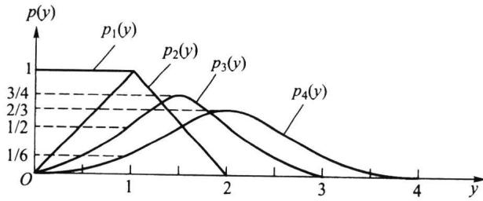
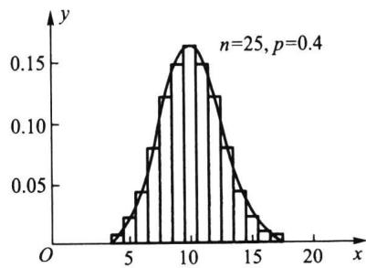

import Guide from '@/components/Guide.astro';
import Knowledge from '@/components/Knowledge.astro';
import Example from '@/components/Example.astro';
import Analysis from '@/components/Analysis.astro';
import Solution from '@/components/Solution.astro';
import Variant from '@/components/Variant.astro';
import Note from '@/components/Note.astro';
import Block from '@/components/Block.astro';
import Method from '@/components/Method.astro';
import Exercise from '@/components/Exercise.astro';

## 4.4.1 独立随机变量和

大数定律讨论的是在什么条件下,随机变量序列的算术平均依概率收敛到其均值的算术平均.现在我们来讨论在什么条件下,独立随机变量和
$$
Y _ {n} = \sum_ {i = 1} ^ {n} X _ {i}
$$
的分布函数会收敛于正态分布.以下我们先给出一个独立随机变量和的例子.

<Example title="例 4.4.1">
误差是人们经常遇到且感兴趣的随机变量,大量的研究表明,误差的产生是由大量微小的相互独立的随机因素叠加而成的.譬如一位操作者在机床上加工机械轴,使其直径符合规定要求,但加工后的机械轴与规定要求总有一定的误差,这是因为在加工时受到一些随机因素的影响,它们是
\- 在机床方面有机床振动与转速的影响.
\- 在刀具方面有装配与磨损的影响.
\- 在材料方面有钢材的成分、产地的影响.
\- 在操作者方面有注意力集中程度、当天的情绪的影响.
\- 在测量方面有量具误差、测量技术的影响.
\- 在环境方面有车间的温度、湿度、照明、工作电压的影响.
\- 在具体场合还可列出许多其他影响因素.
由于这些因素很多,每个因素对加工精度的影响都是很微小的,每个因素的出现都是随机的、是人们无法控制的、时有时无、时大时小、时正时负.这些因素的综合影响最后使每个机械轴的直径产生误差,若将这个误差记为 $Y_{n}$ ,那么 $Y_{n}$ 是随机变量,且可以将 $Y_{n}$ 看作很多微小的随机波动 $X_{1}, X_{2}, \cdots, X_{n}$ 之和,即
$$
Y _ {n} = X _ {1} + X _ {2} + \dots + X _ {n},
$$
这里 n 是很大的,人们关心的是当 $n \to \infty$ 时,“ $Y_{n}$ 的分布是什么?”
当然,我们可以用卷积公式去计算 $Y_{n}$ 的分布.但是这样的计算是相当复杂的、不易实现的.从下面例子可以看出这一点.
</Example>

<Example title="例 4.4.2">
设 $\{X_{n}\}$ 为独立同分布的随机变量序列, 其共同分布为区间 $(0,1)$ 上的均匀分布. 记 $Y_{n} = \sum_{i=1}^{n} X_{i}, p_{n}(y)$ 为 $Y_{n}$ 的密度函数, 用卷积公式可以求出
$$
p _ {1} (y) = \left\{ \begin{array}{l l} 1, & 0 <   y <   1, \\ 0, & \text {其他}. \end{array} \right.
$$
$$
p _ {2} (y) = \left\{ \begin{array}{l l} y, & 0 <   y <   1, \\ 2 - y, & 1 \leqslant y <   2, \\ 0, & \text {其他}. \end{array} \right.
$$
$$
p _ {3} (y) = \left\{ \begin{array}{l l} y ^ {2} / 2, & 0 <   y <   1, \\ - (y - 3 / 2) ^ {2} + 3 / 4, & 1 \leqslant y <   2, \\ (3 - y) ^ {2} / 2, & 2 \leqslant y <   3, \\ 0, & \text {其他}. \end{array} \right.
$$
$$
p _ {4} (y) = \left\{ \begin{array}{l l} y ^ {3} / 6, & 0 <   y <   1, \\ [   y ^ {3} - 4 (y - 1) ^ {3} ] / 6, & 1 \leqslant y <   2, \\ [   (4 - y) ^ {3} - 4 (3 - y) ^ {3} ] / 6, & 2 \leqslant y <   3, \\ (4 - y) ^ {3} / 6, & 3 \leqslant y <   4, \\ 0, & \text {其他}. \end{array} \right.
$$
将 $p_1(y), p_2(y), p_3(y), p_4(y)$ 表示在图4.4.1中. 从图上我们可以看出: 随着 $n$ 的增加, $p_n(y)$ 的图形愈来愈光滑, 且愈来愈接近正态曲线.
<figure class="vp-figure">
  
  <figcaption>图4.4.1 均匀分布的卷积</figcaption>
</figure>
可以设想, 当 $n = 100$ 时, $p_{100}(x)$ 的非零区域为 $(0,100)$ , 若用卷积公式可以分 100 段求出 $p_{100}(x)$ 的表达式, 它们分别是 99 次多项式. 如此复杂的形式即使求出 (当然没有人去求), 也无法使用. 这就迫使人们去寻求近似分布. 若记 $Y_{n}$ 的分布函数为 $F_{n}(x)$ , 在弱收敛的含义下, 求出其极限分布 $F(x)$ , 那么当 $n$ 很大时, 就可用 $F(x)$ 作为 $F_{n}(x)$ 的近似分布.
为了使寻求 $Y_{n}$ 的极限分布有意义, 有必要先研究一下问题的提法. 在图4.4.1上可以看出: 当 $n$ 增大时, $p_{n}(y)$ 的中心右移, 且 $p_{n}(y)$ 的方差增大. 这意味着当 $n \to \infty$ 时, $Y_{n}$ 的分布中心会趋向 $\infty$ , 其方差也趋向 $\infty$ , 分布极不稳定. 为了克服这个缺点, 在中心极限定理的研究中均对 $Y_{n}$ 进行标准化
$$
Y _ {n} ^ {*} = \frac {Y _ {n} - E (Y _ {n})}{\sqrt {\operatorname{Var} (Y _ {n})}},
$$
由于 $E(Y_{n}^{*}) = 0, \operatorname{Var}(Y_{n}^{*}) = 1$ ，这就有可能看出 $Y_{n}^{*}$ 的极限分布是否为标准正态分布 $N(0,1)$ .
中心极限定理就是研究随机变量和的极限分布在什么条件下为正态分布的问题.
</Example>

## 4.4.2 独立同分布下的中心极限定理

<Knowledge title="定理 4.4.1 林德伯格-莱维(Lindeberg-Lévy">
中心极限定理) 设 $\{X_{n}\}$ 是独立同分布的随机变量序列，且 $E(X_{i})=\mu, \operatorname{Var}(X_{i})=\sigma^{2}>0$ 存在，若记
$$
Y _ {n} ^ {*} = \frac {X _ {1} + X _ {2} + \cdots + X _ {n} - n \mu}{\sigma \sqrt {n}},
$$
则对任意实数 $y$ ，有
$$
\lim _ {n \to \infty} P (Y _ {n} ^ {*} \leqslant y) = \Phi (y) = \frac {1}{\sqrt {2 \pi}} \int_ {- \infty} ^ {y} \mathrm{e} ^ {- \frac {t ^ {2}}{2}} \mathrm{d} t.\tag{4.4.1}
$$

<Solution title="证明">
为证(4.4.1)式, 只需证 $\{Y_{n}^{*}\}$ 的分布函数列弱收敛于标准正态分布. 又由定理 4.2.6, 只需证 $\{Y_{n}^{*}\}$ 的特征函数列收敛于标准正态分布的特征函数. 为此设 $X_{n}-\mu$ 的特征函数为 $\varphi(t)$ , 则 $Y_{n}^{*}$ 的特征函数为
$$
\varphi_ {Y _ {n} ^ {*}} (t) = \left[ \varphi \left(\frac {t}{\sigma \sqrt {n}}\right) \right] ^ {n}.
$$
又因为 $E(X_{n} - \mu) = 0, \mathrm{Var}(X_{n} - \mu) = \sigma^{2}$ , 所以有
$$
\varphi^ {\prime} (0) = 0, \quad \varphi^ {\prime \prime} (0) = - \sigma^ {2}.
$$
于是特征函数 $\varphi(t)$ 有展开式
$$
\varphi (t) = \varphi (0) + \varphi^ {\prime} (0) t + \varphi^ {\prime \prime} (0) \frac {t ^ {2}}{2} + o (t ^ {2}) = 1 - \frac {1}{2} \sigma^ {2} t ^ {2} + o (t ^ {2}).
$$
从而有
$$
\lim _ {n \to \infty} \varphi_ {Y _ {n} ^ {*}} (t) = \lim _ {n \to \infty} \left[ 1 - \frac {t ^ {2}}{2 n} + o \left(\frac {t ^ {2}}{n}\right) \right] ^ {n} = e ^ {- t ^ {2 / 2}},
$$
而 $e^{-t^{2/2}}$ 正是 $N(0,1)$ 分布的特征函数, 定理得证.
</Solution>
</Knowledge>

<Knowledge title="定理 4.4.1">
只假设 $\{X_{n}\}$ 独立同分布、方差存在，不管原来的分布是什么，只要 n 充分大，就可以用正态分布去逼近随机变量和的分布，所以这个定理有着广泛的应用。它同时揭示了这样的事实：测量误差近似地服从正态分布。以下给出一些林德伯格-莱维中心极限定理的应用例子。
</Knowledge>

<Example title="例 4.4.3 正态随机数的产生">
在随机模拟(蒙特卡罗方法)中经常需要产生正态分布 $N(\mu, \sigma^{2})$ 的随机数, 一般统计软件都有产生正态随机数的功能. 它是如何产生的呢? 下面介绍用中心极限定理通过 (0,1) 上均匀分布的随机数来产生正态分布 $N(\mu, \sigma^{2})$ 的随机数的一种方法.
设随机变量 X 服从 $(0,1)$ 上的均匀分布，则其数学期望与方差分别为 1/2 和 1/12。由此得 12 个相互独立的 $(0,1)$ 上均匀分布随机变量和的数学期望与方差分别为 6 和 1。因此我们可以如下产生正态分布 $N(\mu,\sigma^{2})$ 的随机数。
(1) 从计算机中产生 12 个 $(0,1)$ 上均匀分布的随机数，记为 $x_{1}, x_{2}, \cdots, x_{12}$ .
（2）计算 $y=x_{1}+x_{2}+\cdots+x_{12}-6$ ，则由林德伯格-莱维中心极限定理知，可将 y 近似看成来自标准正态分布 $N(0,1)$ 的一个随机数.
（3）计算 $z = \mu +\sigma y$ ，则可将 $z$ 看成来自正态分布 $N(\mu ,\sigma^2)$ 的一个随机数.
(4) 重复(1)—(3)n次, 就可得到 $N(\mu, \sigma^{2})$ 分布的 n 个随机数.
从这个例子可以看出,由12个均匀分布的随机数得到1个正态分布的随机数是利用了林德伯格-莱维中心极限定理.
</Example>

<Example title="例 4.4.4 数值计算中的误差分析">
在数值计算中,任何实数 x 都只能用一定位数的小数 $x'$ 来近似.譬如在计算中取 5 位小数,第 6 位以后的小数都用四舍五入的方法舍去,如 $\pi=3.141\ 592\ 654\cdots$ 和 e=2.718 281 828 $\cdots$ 的近似数为 $\pi'=3.141\ 59$ 和 $e'=2.718\ 28$ .
现在如果要求 n 个实数 $x_{i}(i=1,2,\cdots,n)$ 的和 S，在数值计算中，只能用 $x_{i}$ 的近似数 $x_{i}^{\prime}$ 来得到 S 的近似数 $S^{\prime}$ ，记个别误差为 $\varepsilon_{i}=x_{i}-x_{i}^{\prime}$ ，则总误差为
$$
S - S ^ {\prime} = \sum_ {i = 1} ^ {n} x _ {i} - \sum_ {i = 1} ^ {n} x _ {i} ^ {\prime} = \sum_ {i = 1} ^ {n} \varepsilon_ {i}.
$$
若在数值计算中, 取 k 位小数, 则可认为 $\varepsilon_{i}$ 服从区间 $(-0.5 \times 10^{-k}, 0.5 \times 10^{-k})$ 上的均匀分布, 且相互独立. 下面我们来估计总误差. 一种粗略的估计方法是: 由于 $\left|\varepsilon_{i}\right| \leqslant 0.5 \times 10^{-k}$ , 所以
$$
\Big | \sum_ {i = 1} ^ {n} \varepsilon_ {i} \Big | \leqslant n \times 0. 5 \times 1 0 ^ {- k}.\tag{4.4.2}
$$
现在用中心极限定理来估计: 因为 $\{\varepsilon_{i}\}$ 独立同分布, 且
$$
E (\varepsilon_ {i}) = 0, \qquad \operatorname{Var} (\varepsilon_ {i}) = \frac {1 0 ^ {- 2 k}}{1 2}.
$$
因此对总误差有
$$
E \Big (\sum_ {i = 1} ^ {n} \varepsilon_ {i} \Big) = 0, \qquad \mathrm{Var} \Big (\sum_ {i = 1} ^ {n} \varepsilon_ {i} \Big) = \frac {n 1 0 ^ {- 2 k}}{1 2}.
$$
由林德伯格-莱维中心极限定理知,对任意的 z>0,有
$$
P \Big (\Big | \sum_ {i = 1} ^ {n} \varepsilon_ {i} \Big | \leqslant z \Big) \approx \Phi \left(\frac {z \sqrt {1 2}}{\sqrt {n 1 0 ^ {- 2 k}}}\right) - \Phi \left(- \frac {z \sqrt {1 2}}{\sqrt {n 1 0 ^ {- 2 k}}}\right) = 2 \Phi \left(\frac {z \sqrt {1 2}}{\sqrt {n 1 0 ^ {- 2 k}}}\right) - 1.
$$
要从上式中求出总误差的上限 $z$ ，可令上式右边的概率为0.99，由此得
$$
\Phi \left(\frac {z \sqrt {1 2}}{\sqrt {n 1 0 ^ {- 2 k}}}\right) = 0. 9 9 5,
$$
再查标准正态分布函数的 0.995 分位数得
$$
\frac {z \sqrt {1 2}}{\sqrt {n 1 0 ^ {- 2 k}}} = 2. 5 7 6,
$$
由此解得
$$
z = \frac {2 . 5 7 6 \sqrt {n \times 1 0 ^ {- 2 k}}}{\sqrt {1 2}} = 0. 7 4 3 6 \times \sqrt {n \times 1 0 ^ {- 2 k}} = 0. 7 4 3 6 \times \sqrt {n} \times 1 0 ^ {- k}.
$$
也就是我们有 99% 的把握,可以说
$$
\Big | \sum_ {i = 1} ^ {n} \varepsilon_ {i} \Big | \leqslant 0. 7 4 3 6 \times \sqrt {n} \times 1 0 ^ {- k}.\tag{4.4.3}
$$
譬如在数值计算中保留 5 位小数, 求 10 000 个近似数之和的总误差, 用 (4.4.2) 式估计为 0.05, 而用 (4.4.3) 式估计, 可以概率 0.99 保证为 0.000 743 6, 即万分之七左右.
从上例可以看出,利用中心极限定理不但可以求总误差的上限,还可以给出一定的可信程度.
</Example>

## 4.4.3 二项分布的正态近似

由林德伯格-莱维中心极限定理,马上就可以得到下面的棣莫弗-拉普拉斯中心极限定理.

<Knowledge title="定理 4.4.2 棣莫弗-拉普拉斯(de Moivre-Laplace">
中心极限定理) 设 n 重伯努利试验中, 事件 A 在每次试验中出现的概率为 $p (0 < p < 1)$ , 记 $S_{n}$ 为 n 次试验中事件 A 出现的次数, 且记
$$
Y _ {n} ^ {*} = \frac {S _ {n} - n p}{\sqrt {n p q}}.
$$
则对任意实数 $y$ ，有
$$
\lim _ {n \to \infty} P (Y _ {n} ^ {*} \leqslant y) = \Phi (y) = \frac {1}{\sqrt {2 \pi}} \int_ {- \infty} ^ {y} \mathrm{e} ^ {- \frac {t ^ {2}}{2}} \mathrm{d} t.
$$
棣莫弗-拉普拉斯中心极限定理是概率论历史上的第一个中心极限定理，它是专门针对二项分布的，因此称为“二项分布的正态近似”。前面第二章中定理2.4.1（泊松定理）给出了“二项分布的泊松近似”。两者相比，一般在 $p$ 较小时，用泊松分布近似较好；而在 $np > 5$ 和 $n(1 - p) > 5$ 时，用正态分布近似较好。
下面在给出棣莫弗-拉普拉斯中心极限定理的应用之前,先说明两点:
（1）因为二项分布是离散分布，而正态分布是连续分布，所以用正态分布作为二项分布的近似计算中，作些修正可以提高精度.若 $k_{1}<k_{2}$ 均为整数，一般先作如下修正后再用正态近似 $P(k_{1}\leqslant S_{n}\leqslant k_{2})=P(k_{1}-0.5<S_{n}<k_{2}+0.5)$ .
譬如 $S_{n} \sim b(25,0.4)$ , $P(5 \leqslant S_{n} \leqslant 15)$ 的值为图 4.4.2 中 5 至 15 上长条矩形的面积之和, 其精确值为 0.978 0.
<figure class="vp-figure">
  
  <figcaption>图 4.4.2 二项分布正态近似时的修正</figcaption>
</figure>
使用修正的正态近似
$$
\begin{array}{r l} P (5 \leqslant S _ {n} \leqslant 1 5) & = P (5 - 0. 5 <   S _ {n} <   1 5 + 0. 5) \\ & \approx \Phi \left(\frac {1 5 + 0 . 5 - 1 0}{\sqrt {6}}\right) - \Phi \left(\frac {5 - 0 . 5 - 1 0}{\sqrt {6}}\right) \\ & = 2 \Phi (2. 2 4 5) - 1 = 0. 9 7 5 4. \end{array}
$$
不用修正的正态近似
$$
P (5 \leqslant S _ {n} \leqslant 1 5) \approx \Phi \left(\frac {1 5 - 1 0}{\sqrt {6}}\right) - \Phi \left(\frac {5 - 1 0}{\sqrt {6}}\right) = 2 \Phi (2. 0 4 1) - 1 = 0. 9 5 8 8.
$$
可见不用修正的正态近似误差较大.
(2) 对于二项分布的计算,用修正的正态近似还可得
$$
\begin{array}{r l} P (S _ {n} = k) & = P (k - 0. 5 <   S _ {n} <   k + 0. 5) = P \left(\frac {k - 0 . 5 - n p}{\sqrt {n p q}} <   \frac {S _ {n} - n p}{\sqrt {n p q}} <   \frac {k + 0 . 5 - n p}{\sqrt {n p q}}\right) \\ & \approx \int_ {\frac {k - 0 . 5 - n p}{\sqrt {n p q}}} ^ {\frac {k + 0 . 5 - n p}{\sqrt {n p q}}} \frac {1}{\sqrt {2 \pi}} \mathrm{e} ^ {- \frac {x ^ {2}}{2}} \mathrm{d} x \approx \frac {1}{\sqrt {2 \pi}} \mathrm{e} ^ {- \frac {1}{2} \left(\frac {k - n p}{\sqrt {n p q}}\right) ^ {2}} \cdot \frac {1}{\sqrt {n p q}}. \end{array}\tag{4.4.4}
$$
譬如, $S_{n}\sim b(25,0.4)$ ，则 $P(S_{n}=10)$ 的精确值为0.1612，而用(4.4.4)式计算出的近似值为0.1629.
在中心极限定理的应用中, 若记 $\beta = \Phi(y)$ , 则由棣莫弗-拉普拉斯中心极限定理给出的近似式
$$
P (Y _ {n} ^ {*} \leqslant y) \approx \Phi (y) = \beta ,
$$
可用来解决三类计算问题：① 已知 $n, y$ 求 $\beta$ ；② 已知 $n, \beta$ 求 $y$ ；③ 已知 $y, \beta$ 求 $n$ .
以下我们就分这三类情况给出一些具体的例子.
</Knowledge>

## 一、给定 $n, y$ 求 $\beta$ (求概率)

<Example title="例 4.4.5">
一复杂系统由 100 个相互独立工作的部件组成, 每个部件正常工作的概率为 0.9. 已知整个系统中至少有 85 个部件正常工作, 系统才能正常工作. 试求系统正常工作的概率.

<Solution title="解">
记 $n = 100, Y_{n}$ 为 100 个部件中正常工作的部件数, 则
$$
Y _ {n} \sim b (1 0 0, 0. 9), \qquad E (Y _ {n}) = 9 0, \qquad \operatorname{Var} (Y _ {n}) = 9.
$$
所求概率为
$$
P (Y _ {n} \geqslant 8 5) \approx 1 - \Phi \left(\frac {8 5 - 0 . 5 - 9 0}{3}\right) = 1 - \Phi \left(- \frac {5 . 5}{3}\right) = \Phi (1. 8 3) = 0. 9 6 6 4.
$$
</Solution>
</Example>

<Example title="例 4.4.6">
某药厂生产的某种药品,声称对某疾病的治愈率为 80%.现为了检验此治愈率,任意抽取 100 个此种疾病患者进行临床试验,如果至少有 75 人治愈,则此药通过检验.试在以下两种情况下,分别计算此药通过检验的可能性.
(1) 此药的实际治愈率为 80%;
(2) 此药的实际治愈率为 70%.

<Solution title="解">
记 $n = 100, Y_{n}$ 为 100 个临床受试者中的治愈者人数.
（1）因为 $Y_{n}\sim b(100,0.8),E(Y_{n}) = 80,\mathrm{Var}(Y_{n}) = 16.$ 所以通过检验的可能性为
$$
P (Y _ {n} \geqslant 7 5) \approx 1 - \Phi \left(\frac {7 5 - 0 . 5 - 8 0}{4}\right) = 1 - \Phi \left(- \frac {5 . 5}{4}\right) = \Phi (1. 3 7 5) = 0. 9 1 5 5.
$$
即此药通过检验的可能性是较大的.
(2) 因为 $Y_{n} \sim b(100, 0.7)$ , $E(Y_{n}) = 70$ , $\mathrm{Var}(Y_{n}) = 21$ . 所以通过检验的可能性为
$$
P (Y _ {n} \geqslant 7 5) \approx 1 - \Phi \left(\frac {7 5 - 0 . 5 - 7 0}{\sqrt {2 1}}\right) = 1 - \Phi (0. 9 8 2) = 1 - 0. 8 3 7 0 = 0. 1 6 3 0.
$$
即此药通过检验的可能性是很小的.
</Solution>
</Example>

## 二、给定 $n, \beta$ 求 $y$ (求分位数)

<Example title="例 4.4.7">
某车间有同型号的机床 200 台, 在一小时内每台机床约有 70% 的时间是工作的. 假定各机床工作是相互独立的, 工作时每台机床要消耗电能 15 kW. 问至少要多少电能, 才可以有 95% 的可能性保证此车间正常生产.

<Solution title="解">
记 $n = 200, Y_{n}$ 为 200 台机床中同时工作的机床数，则 $Y_{n} \sim b(200, 0.7)$ ， $E(Y_{n}) = 140, \operatorname{Var}(Y_{n}) = 42$ .
因为 $Y_{n}$ 台机床同时工作需消耗 $15Y_{n}(\mathrm{kW})$ 电能，设供电量为 $y(\mathrm{kW})$ ，则保证正常生产可用事件 $\{15Y_{n}\leqslant y\}$ 表示，由题设 $P(15Y_{n}\leqslant y)\geqslant0.95$ ，其中
$$
P (1 5 Y _ {n} \leqslant y) \approx \Phi \left(\frac {y / 1 5 + 0 . 5 - 1 4 0}{\sqrt {4 2}}\right) \geqslant 0. 9 5.
$$
查标准正态分布表可得标准正态分布的 0.95 分位数为 1.645, 故有
$$
\frac {y / 1 5 + 0 . 5 - 1 4 0}{\sqrt {4 2}} \geqslant 1. 6 4 5,
$$
从中解得 $y \geqslant 2253 \, (\text{kW})$ ，即此车间每小时至少需要 $2253 \, (\text{kW})$ 电量，才有 95% 的可能性保证此车间正常生产.
</Solution>
</Example>

## 三、给定 $y, \beta$ 求 $n$ (求样本量)

<Example title="例 4.4.8">
某调查公司受委托, 调查某电视节目在 S 市的收视率 p, 调查公司将所有调查对象中收看此节目的频率作为 p 的估计 $\hat{p}$ . 现在要保证有 90% 的把握, 使得调查所得收视率 $\hat{p}$ 与真实收视率 p 之间的差异不大于 5%. 问至少要调查多少对象 (样本量)?

<Solution title="解">
设共调查 n 个对象, 记
$$
X _ {i} = \left\{ \begin{array}{l l} 1, & \text { 第 } i \text { 个调查对象收看此电视节目 }, \\ 0, & \text { 第 } i \text { 个调查对象不看此电视节目 }, \end{array} \right.
$$
则 $X_{i}$ 独立同分布，且 $P(X_{i}=1)=p, P(X_{i}=0)=1-p, i=1,2,\cdots,n.$
又记 n 个被调查对象中, 收看此电视节目的人数为 $Y_{n}$ , 则有
$$
Y _ {n} = \sum_ {i = 1} ^ {n} X _ {i} \sim b (n, p).
$$
由大数定律知, 当 n 很大时, 频率 $Y_{n}/n$ 与概率 p 很接近, 即用频率作为 p 的估计是合适的. 但 $Y_{n}/n$ 与 p 的接近程度可用中心极限定理算出, 根据题意有
$$
P \left(\left| \frac {1}{n} \sum_ {i = 1} ^ {n} X _ {i} - p \right| <   0. 0 5\right) \approx 2 \Phi \left(0. 0 5 \sqrt {\frac {n}{p (1 - p)}}\right) - 1 \geqslant 0. 9 0,
$$
所以
$$
\Phi \left(0. 0 5 \sqrt {\frac {n}{p (1 - p)}}\right) \geqslant 0. 9 5,
$$
查标准正态分布表可得标准正态分布的 0.95 分位数为 1.645, 故有
$$
0. 0 5 \sqrt {\frac {n}{p (1 - p)}} \geqslant 1. 6 4 5,
$$
从中解得
$$
n \geqslant p (1 - p) \frac {1 . 6 4 5 ^ {2}}{0 . 0 5 ^ {2}} = p (1 - p) \times 1 0 8 2. 4 1.
$$
又因为 $p(1-p) \leqslant 0.25$ ，所以 $n \geqslant 270.6$ ，即至少调查 271 个对象。
</Solution>
</Example>

## 4.4.4 独立不同分布下的中心极限定理

前面我们已经在独立同分布的条件下,解决了随机变量和的极限分布问题.在实际问题中说诸 $X_{i}$ 具有独立性是常见的,但是很难说诸 $X_{i}$ 是“同分布”的随机变量.正如前面所提到的测量误差 $Y_{n}$ 的产生是由大量“微小的”相互独立的随机因素叠加而成的,即 $Y_{n}=\sum_{i=1}^{n}X_{i}$ ,则诸 $X_{i}$ 间具有独立性,但不一定同分布.本节研究独立不同分布随机变量和的极限分布问题,目的是给出极限分布为正态分布的条件.
为使极限分布是正态分布, 必须对 $Y_{n} = \sum_{i=1}^{n} X_{i}$ 的各项有一定的要求. 譬如若允许从第二项起都等于 0 , 则极限分布显然由 $X_{1}$ 的分布完全确定, 这时就很难得到什么有意思的结果. 这就告诉我们, 要使中心极限定理成立, 在和的各项中不应有起突出作用的项, 或者说, 要求各项在概率意义下“均匀地小”. 下面我们来分析如何用数学式子来明确表达这个要求.
设 $\{X_{n}\}$ 是一个相互独立的随机变量序列，它们具有有限的数学期望和方差：
$$
E (X _ {i}) = \mu_ {i}, \quad \mathrm{Var} (X _ {i}) = \sigma_ {i} ^ {2}, \qquad i = 1, 2, \dots .
$$
要讨论随机变量的和 $Y_{n} = \sum_{i = 1}^{n}X_{i}$ ，我们先将其标准化，即将它减去均值、除以标准差，由于
$$
E (Y _ {n}) = \mu_ {1} + \mu_ {2} + \dots + \mu_ {n},
$$
$$
\sigma (Y _ {n}) = \sqrt {\operatorname{Var} (Y _ {n})} = \sqrt {\sigma_ {1} ^ {2} + \sigma_ {2} ^ {2} + \cdots + \sigma_ {n} ^ {2}},
$$
且记 $\sigma(Y_n) = B_n$ ，则 $Y_{n}$ 的标准化为
$$
Y _ {n} ^ {*} = \frac {Y _ {n} - (\mu_ {1} + \mu_ {2} + \cdots + \mu_ {n})}{B _ {n}} = \sum_ {i = 1} ^ {n} \frac {X _ {i} - \mu_ {i}}{B _ {n}}.
$$
如果要求 $Y_{n}^{*}$ 中各项 $\frac{X_i - \mu_i}{B_n}$ “均匀地小”，即对任意的 $\tau > 0$ ，要求事件
$$
A _ {n i} = \left\{\frac {\mid X _ {i} - \mu_ {i} \mid}{B _ {n}} > \tau \right\} = \{\mid X _ {i} - \mu_ {i} \mid > \tau B _ {n} \}
$$
发生的可能性小,或直接要求其概率趋于0.为达到这个目的,我们要求
$$
\lim _ {n \to \infty} P (\max _ {1 \leqslant i \leqslant n} | X _ {i} - \mu_ {i} | > \tau B _ {n}) = 0.
$$
因为
$$
P (\max _ {1 \leqslant i \leqslant n} | X _ {i} - \mu_ {i} | > \tau B _ {n}) = P (\bigcup_ {i = 1} ^ {n} (| X _ {i} - \mu_ {i} | > \tau B _ {n})) \leqslant \sum_ {i = 1} ^ {n} P (| X _ {i} - \mu_ {i} | > \tau B _ {n}),
$$
若设诸 $X_{i}$ 为连续随机变量，其密度函数为 $p_i(x)$ ，则
$$
\text {上式右边} = \sum_ {i = 1} ^ {n} \int_ {| x - \mu_ {i} | > \tau B _ {n}} p _ {i} (x)   \mathrm{d} x \leqslant \frac {1}{\tau^ {2} B _ {n} ^ {2}} \sum_ {i = 1} ^ {n} \int_ {| x - \mu_ {i} | > \tau B _ {n}} (x - \mu_ {i}) ^ {2} p _ {i} (x)   \mathrm{d} x.
$$
因此, 只要对任意的 $\tau > 0$ , 有
$$
\lim _ {n \to \infty} \frac {1}{\tau^ {2} B _ {n} ^ {2}} \sum_ {i = 1} ^ {n} \int_ {| x - \mu_ {i} | > \tau B _ {n}} (x - \mu_ {i}) ^ {2} p _ {i} (x)   d x = 0,\tag{4.4.5}
$$
就可保证 $Y_{n}^{*}$ 中各加项“均匀地小”.
上述条件(4.4.5)称为林德伯格条件.林德伯格证明了满足(4.4.5)条件的 $Y_{n}^{*}$ 的极限分布是正态分布,这就是下面给出的林德伯格中心极限定理,由于这个定理的证明需要更多的数学工具,所以以下仅叙述定理,略去其证明.

<Knowledge title="定理 4.4.3 林德伯格中心极限定理">
设独立随机变量序列 $\{X_{n}\}$ 满足林德伯格条件, 则对任意的 x, 有
$$
\lim _ {n \to \infty} P \left(\frac {1}{B _ {n}} \sum_ {i = 1} ^ {n} (X _ {i} - \mu_ {i}) \leqslant x\right) = \frac {1}{\sqrt {2 \pi}} \int_ {- \infty} ^ {x} \mathrm{e} ^ {- t ^ {2} / 2} \mathrm{d} t.
$$
假如独立随机变量序列 $\{X_{n}\}$ 具有同分布和方差有限的条件, 则必定满足以上 (4.4.5) 林德伯格条件, 也就是说定理 4.4.1 是定理 4.4.3 的特例. 这一点是很容易证明的:
设 $\{X_{n}\}$ 是独立同分布的随机变量序列，为确定起见，设诸 $X_{i}$ 是连续随机变量，其共同的密度函数为 $p(x),\mu_i = \mu ,\sigma_i = \sigma .$ 这时 $B_{n} = \sigma \sqrt{n}$ ，由此得
$$
\frac {1}{B _ {n} ^ {2}} \sum_ {i = 1} ^ {n} \int_ {| x - \mu_ {i} | > \tau B _ {n}} (x - \mu_ {i}) ^ {2} p (x) \mathrm{d} x = \frac {n}{n \sigma^ {2}} \int_ {| x - \mu | > \tau \sigma \sqrt {n}} (x - \mu) ^ {2} p (x) \mathrm{d} x.
$$
因为方差存在,即
$$
\mathrm{Var} (X _ {i}) = \int_ {- \infty} ^ {\infty} (x - \mu) ^ {2} p (x) \mathrm{d} x <   \infty ,
$$
所以其尾部积分一定有
$$
\lim _ {n \to \infty} \int_ {| x - \mu | > \tau \sigma \sqrt {n}} (x - \mu) ^ {2} p (x)   d x = 0,
$$
故林德伯格条件满足.
林德伯格条件虽然比较一般,但该条件较难验证,下面的李雅普诺夫(Lyapunov)条件则比较容易验证,因为它只对矩提出要求,因而便于应用.下面我们仅叙述其结论,证明从略.
</Knowledge>

<Knowledge title="定理 4.4.4 李雅普诺夫中心极限定理">
设 $\{X_{n}\}$ 为独立随机变量序列, 若存在 $\delta > 0$ , 满足
$$
\lim _ {n \to \infty} \frac {1}{B _ {n} ^ {2 + \delta}} \sum_ {i = 1} ^ {n} E (\mid X _ {i} - \mu_ {i} \mid^ {2 + \delta}) = 0,\tag{4.4.6}
$$
则对任意的 $x$ ，有
$$
\lim _ {n \to \infty} P \left(\frac {1}{B _ {n}} \sum_ {i = 1} ^ {n} (X _ {i} - \mu_ {i}) \leqslant x\right) = \frac {1}{\sqrt {2 \pi}} \int_ {- \infty} ^ {x} \mathrm{e} ^ {- t ^ {2 / 2}} \mathrm{d} t,
$$
其中 $\mu_{i}$ 与 $B_{n}$ 如前所述.
</Knowledge>

<Example title="例 4.4.9">
一份考卷由 99 个题目组成, 并按由易到难顺序排列. 某学生答对第 1 题的概率为 0.99, 答对第 2 题的概率为 0.98. 一般地, 他答对第 i 题的概率为 $1 - i/100, i = 1, 2, \cdots$ . 假如该学生回答各题目是相互独立的, 并且要正确回答其中 60 个以上 (包括 60 个) 题目才算通过考试. 试计算该学生通过考试的可能性多大.
解设
$$
X _ {i} = \left\{ \begin{array}{l l} 1, & \text { 若学生答对第 } i \text { 题 }, \\ 0, & \text { 若学生答错第 } i \text { 题 }. \end{array} \right.
$$
于是诸 $X_{i}$ 相互独立，且服从不同的二点分布：
$$
P (X _ {i} = 1) = p _ {i} = 1 - \frac {i}{1 0 0}, \qquad P (X _ {i} = 0) = 1 - p _ {i} = \frac {i}{1 0 0}, \quad i = 1, 2, \dots , 9 9.
$$
而我们要求的是
$$
P \big (\sum_ {i = 1} ^ {9 9} X _ {i} \geqslant 6 0 \big).
$$
为使用中心极限定理,我们可以设想从 $X_{100}$ 开始的随机变量都与 $X_{99}$ 同分布,且相互独立.下面我们用 $\delta=1$ 来验证随机变量序列 $\{X_{n}\}$ 满足李雅普诺夫条件(4.4.6),因为
$$
B _ {n} = \sqrt {\sum_ {i = 1} ^ {n} \operatorname{Var} (X _ {i})} = \sqrt {\sum_ {i = 1} ^ {n} p _ {i} (1 - p _ {i})} \rightarrow \infty (n \rightarrow \infty),
$$
$$
E \left(\left| X _ {i} - p _ {i} \right| ^ {3}\right) = \left(1 - p _ {i}\right) ^ {3} p _ {i} + p _ {i} ^ {3} \left(1 - p _ {i}\right) \leqslant p _ {i} \left(1 - p _ {i}\right),
$$
于是
$$
\frac {1}{B _ {n} ^ {3}} \sum_ {i = 1} ^ {n} E (\mid X _ {i} - p _ {i} \mid^ {3}) \leqslant \frac {1}{\left[ \sum_ {i = 1} ^ {n} p _ {i} (1 - p _ {i}) \right] ^ {1 / 2}} \to 0 (n \to \infty),
$$
即 $\{X_{n}\}$ 满足李雅普诺夫条件(4.4.6)，所以可以使用中心极限定理.
又因为在 $n = 99$ 时，
$$
E \Big (\sum_ {i = 1} ^ {9 9} X _ {i} \Big) = \sum_ {i = 1} ^ {9 9} p _ {i} = \sum_ {i = 1} ^ {9 9} \left(1 - \frac {i}{1 0 0}\right) = 4 9. 5,
$$
$$
B _ {9 9} ^ {2} = \sum_ {i = 1} ^ {9 9} \mathrm{Var} (X _ {i}) = \sum_ {i = 1} ^ {9 9} \left(1 - \frac {i}{1 0 0}\right) \left(\frac {i}{1 0 0}\right) = 1 6. 6 6 5,
$$
所以该学生通过考试的可能性为
$$
P \Big (\sum_ {i = 1} ^ {9 9} X _ {i} \geqslant 6 0 \Big) = P \left(\frac {\sum_ {i = 1} ^ {9 9} X _ {i} - 4 9 . 5}{\sqrt {1 6 . 6 6 5}} \geqslant \frac {6 0 - 4 9 . 5}{\sqrt {1 6 . 6 6 5}}\right) \approx 1 - \Phi (2. 5 7) = 0. 0 0 5.
$$
由此看出:此学生通过考试的可能性很小,大约只有千分之五.
</Example>

<Block title="习题4.4">
1. 某保险公司多年的统计资料表明，在索赔户中被盗索赔户占 $20\%$ ，以 $X$ 表示在随机抽查的100个索赔户中因被盗向保险公司索赔的户数.
(1) 写出 X 的分布列；
(2) 求被盗索赔户不少于 14 户且不多于 30 户的概率的近似值.
2. 某电子计算机主机有 100 个终端, 每个终端有 $80\%$ 的时间被使用. 若各个终端是否被使用是相互独立的, 试求至少有 15 个终端空闲的概率.
3. 有一批建筑房屋用的木柱, 其中 $80\%$ 的长度不小于 $3 \mathrm{~m}$ , 现从这批木柱中随机地取出 100 根, 问其中至少有 30 根短于 $3 \mathrm{~m}$ 的概率是多少?
4. 掷一颗骰子 100 次, 记第 $i$ 次掷出的点数为 $X_{i}, i = 1, 2, \cdots, 100$ , 点数之平均为 $\overline{X} = \frac{1}{100} \sum_{i=1}^{100} X_{i}$ , 试求概率 $P(3 \leqslant \overline{X} \leqslant 4)$ .
5. 连续地掷一颗骰子 80 次, 求点数之和超过 300 的概率.
6. 有 10 个灯泡, 设每个灯泡的寿命服从指数分布, 其平均寿命为 60 天. 每次用一个灯泡, 当使用的灯泡坏了以后立即换上一个新的, 求这些灯泡总共可使用 450 天以上的概率.
7. 设 $X_{1}, X_{2}, \cdots, X_{48}$ 为独立同分布的随机变量，共同分布为 $U(0,5)$ ，其算术平均为 $\overline{X} = \frac{1}{48} \sum_{i=1}^{48} X_{i}$ ，试求概率 $P(2 \leqslant \overline{X} \leqslant 3)$ .
8. 某汽车销售点每天出售的汽车数服从参数为 $\lambda = 2$ 的泊松分布. 若一年365天都经营汽车销售, 且每天出售的汽车数是相互独立的, 求一年中售出700辆以上汽车的概率.
9. 某餐厅每天接待 400 名顾客, 设每位顾客的消费额 (单位: 元) 服从 (20, 100) 上的均匀分布, 且顾客的消费额是相互独立的. 试求:
(1) 该餐厅每天的平均营业额；
(2) 该餐厅每天的营业额在平均营业额±760元内的概率.
10. 一仪器同时收到 50 个信号, 其中第 i 个信号的长度为 $U_{i}, i=1,2,\cdots,50$ . 设 $U_{i}$ 是相互独立的, 且都服从 (0,10) 内的均匀分布, 试求 $P\left(\sum_{i=1}^{50} U_{i} > 300\right)$ .
11. 计算机在进行加法运算时对每个加数取整数(取最为接近于它的整数). 设所有的取整误差是相互独立的, 且它们都服从 $(-0.5, 0.5)$ 上的均匀分布.
(1) 若将 1500 个数相加, 求误差总和的绝对值超过 15 的概率;
(2) 最多几个数加在一起可使得误差总和的绝对值小于 10 的概率不小于 90%?
12. 设各零件的重量都是随机变量, 它们相互独立, 且服从相同的分布, 其数学期望为 $0.5 \mathrm{~kg}$ , 标准差为 $0.1 \mathrm{~kg}$ , 问 5000 只零件的总重量超过 $2510 \mathrm{~kg}$ 的概率是多少?
13. 某种产品由 20 个相同部件连接而成, 每个部件的长度是均值为 2 mm、标准差为 0.02 mm 的随机变量. 假如这 20 个部件的长度相互独立同分布, 且规定产品总长为 $(40 \pm 0.2)$ mm 时为合格品, 求该产品的不合格品率.
14. 一个保险公司有 10 000 个汽车投保人, 每个投保人平均索赔 280 元, 标准差为 800 元. 求总索赔额超过 2 700 000 元的概率.
15. 有两个班级同时上一门课, 甲班有 25 人, 乙班有 64 人. 该门课程期末考试平均成绩为 78 分, 标准差为 14 分. 试问: 甲班的平均成绩超过 80 分的概率大, 还是乙班的平均成绩超过 80 分的概率大?
16. 进行独立重复试验,每次试验中事件 A 发生的概率为 0.25. 试问能以 95% 的把握保证 1000 次试验中事件 A 发生的频率与概率相差多少? 此时 A 发生的次数在什么范围内?
17. 设某生产线上组装每件产品的时间服从指数分布, 平均需要 10 min, 且各件产品的组装时间是相互独立的.
(1) 试求组装 100 件产品需要 15 h 至 20 h 的概率；
(2) 保证有 $95\%$ 的可能性, 问 16 个小时内最多可以组装多少件产品?
18. 某种福利彩票的奖金额 $X$ 由摇奖决定, 其分布列为
<table><tr><td>X(万元)</td><td>5</td><td>10</td><td>20</td><td>30</td><td>40</td><td>50</td><td>100</td></tr><tr><td>P</td><td>0.2</td><td>0.2</td><td>0.2</td><td>0.1</td><td>0.1</td><td>0.1</td><td>0.1</td></tr></table>
若一年中要开出 300 个奖,问需要多少奖金总额,才有 95% 的把握能够发放奖金.
19. 一家有 500 间客房的大旅馆的每间客房装有一台 2 kW（千瓦）的空调机。若开房率为 80%，需要多少千瓦的电力才能有 99% 的可能性保证有足够的电力使用空调机？
20. 设某元件是某电气设备的一个关键部件, 当该元件失效后立即换上一个新的元件. 假定该元件的平均寿命为 100 小时, 标准差为 30 小时, 试问: 应该有多少备件, 才能有 0.95 以上的概率, 保证这个系统能连续运行 2000 小时以上?
21. 独立重复地对某物体的长度 $a$ 进行 $n$ 次测量, 设各次测量结果 $X_{i}$ 服从正态分布 $N(a,0.2^{2})$ . 记 $\overline{X}$ 为 $n$ 次测量结果的算术平均值, 为保证有 $95\%$ 的把握使平均值与实际值 $a$ 的差异小于 0.1 ,问至少需要测量多少次?
22. 某工厂每月生产 10 000 台液晶投影机,但它的液晶片车间生产液晶片合格品率为 90%,为了以 99.7% 的可能性保证出厂的液晶投影机都能装上合格的液晶片,试问该液晶片车间每月至少应该生产多少片液晶片?
23. 某产品的合格品率为 $99\%$ ，问包装箱中应该装多少个此种产品，才能有 $95\%$ 的可能性使每箱中至少有 100 个合格产品。
24. 为确定某城市成年男子中吸烟者的比例 $p$ ，任意调查 $n$ 个成年男子，记其中的吸烟人数为 $m$ ，
问 n 至少为多大才能保证 m/n 与 p 的差异小于 0.01 的概率大于 95%.
25. 设 $X \sim Ga(n, 1)$ , 试问 $n$ 应该多大, 才能满足
$$
P \left(\left| \frac {X}{n} - 1 \right| > 0. 1\right) <   0. 0 1.
$$
26. 设 $\{X_{n}\}$ 为一独立同分布的随机变量序列, 已知 $E(X_{i}^{k}) = \alpha_{k}, k = 1, 2, 3, 4$ . 试证明: 当 $n$ 充分大时, $Y_{n} = \frac{1}{n} \sum_{i=1}^{n} X_{i}^{2}$ 近似服从正态分布, 并指出此正态分布的参数.
27. 用概率论的方法证明：
$$
\lim _ {n \rightarrow \infty} \left(1 + n + \frac {n ^ {2}}{2 !} + \dots + \frac {n ^ {n}}{n !}\right) e ^ {- n} = \frac {1}{2}.
$$

</Block>
