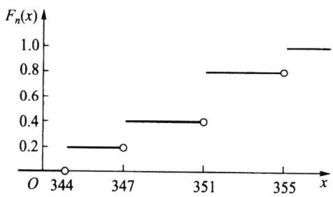
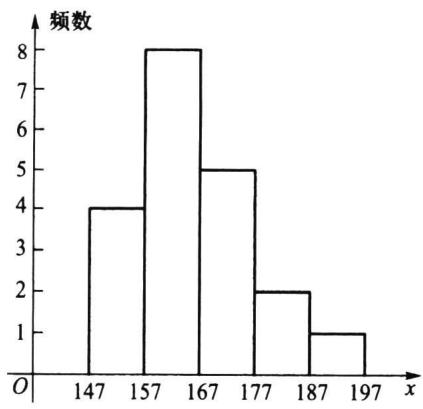
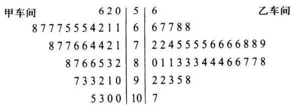

import Guide from '@/components/Guide.astro';
import Knowledge from '@/components/Knowledge.astro';
import Example from '@/components/Example.astro';
import Analysis from '@/components/Analysis.astro';
import Solution from '@/components/Solution.astro';
import Variant from '@/components/Variant.astro';
import Note from '@/components/Note.astro';
import Block from '@/components/Block.astro';
import Method from '@/components/Method.astro';
import Exercise from '@/components/Exercise.astro';

## 5.2.1 经验分布函数

设 $x_{1}, x_{2}, \cdots, x_{n}$ 是取自总体分布函数为 $F(x)$ 的样本，若将样本观测值由小到大进行排列，记为 $x_{(1)}, x_{(2)}, \cdots, x_{(n)}$ ，则 $x_{(1)}, x_{(2)}, \cdots, x_{(n)}$ 称为有序样本，用有序样本定义如下函数
$$
F _ {n} (x) = \left\{ \begin{array}{l l} 0, & \text {当} x <   x _ {(1)}, \\ k / n, & \text {当} x _ {(k)} \leqslant x <   x _ {(k + 1)}, k = 1, 2, \dots , n - 1, \\ 1, & \text {当} x \geqslant x _ {(n)}, \end{array} \right.
$$
则 $F_{n}(x)$ 是一非减右连续函数，且满足
$$
F _ {n} (- \infty) = 0   \text { 和 }   F _ {n} (\infty) = 1.
$$
由此可见， $F_{n}(x)$ 是一个分布函数，称 $F_{n}(x)$ 为该样本的经验分布函数.

<Example title="例 5.2.1">
某食品厂生产听装饮料, 现从生产线上随机抽取 5 听饮料, 称得其净重 (单位: g) 为
$$
\begin{array}{c c c c c} 3 5 1 & 3 4 7 & 3 5 5 & 3 4 4 & 3 5 1 \end{array}
$$
这是一个容量为 5 的样本, 经排序可得有序样本:
$$
x _ {(1)} = 3 4 4, \quad x _ {(2)} = 3 4 7, \quad x _ {(3)} = 3 5 1, \quad x _ {(4)} = 3 5 1, \quad x _ {(5)} = 3 5 5,
$$
其经验分布函数(其图形如图 5.2.1 所示)为
$$
F _ {n} (x) = \left\{ \begin{array}{l l} 0, & x <   3 4 4, \\ 0. 2, & 3 4 4 \leqslant x <   3 4 7, \\ 0. 4, & 3 4 7 \leqslant x <   3 5 1, \\ 0. 8, & 3 5 1 \leqslant x <   3 5 5, \\ 1, & x \geqslant 3 5 5. \end{array} \right.
$$
  
图5.2.1 经验分布函数  
对每一固定的 $x, F_n(x)$ 是样本中事件 $\{x_i \leqslant x\}$ 发生的频率. 当 $n$ 固定时, $F_n(x)$ 是样本的函数, 它是一个随机变量. 若对任意给定的实数 $x$ , 定义
$$
I _ {i} (x) = \left\{ \begin{array}{l l} 1, & x _ {i} \leqslant x, \\ 0, & x _ {i} > x, \end{array} \right.
$$
则由经验分布函数的定义可以看出,对任意给定的实数 x
$$
F _ {n} (x) = \frac {1}{n} \sum_ {i = 1} ^ {n} I _ {i} (x).
$$
</Example>

<Note>
意到诸 $I_{i}(x)$ 是独立同分布的随机变量，其共同分布为 $b(1, F(x))$ ，由伯努利大数定律：只要 $n$ 相当大， $F_{n}(x)$ 依概率收敛于 $F(x)$ . 更深刻的结果也是存在的，这就是格利文科定理，下面我们不加证明地加以介绍.
</Note>

<Knowledge title="定理 5.2.1 格利文科(Glivenko">
定理) 设 $x_{1}, x_{2}, \cdots, x_{n}$ 是取自总体分布函数为 $F(x)$ 的样本， $F_{n}(x)$ 是其经验分布函数，当 $n \to \infty$ 时，有
$$
P \left(\sup _ {- \infty <   x <   \infty} | F _ {n} (x) - F (x) | \rightarrow 0\right) = 1.
$$
定理 5.2.1 表明, 当 n 相当大时, 经验分布函数是总体分布函数 $F(x)$ 的一个良好的近似. 经典统计学中一切统计推断都以样本为依据, 其理由就在于此.
</Knowledge>

## 5.2.2 频数频率表

样本数据的整理是统计研究的基础,整理数据的最常用方法之一是给出其频数表或频率表.我们从一个例子开始介绍.

<Example title="例 5.2.2">
为研究某厂工人生产某种产品的能力,我们随机调查了 20 位工人某天生产的该种产品的数量,数据如下
<table><tr><td>160</td><td>196</td><td>164</td><td>148</td><td>170</td></tr><tr><td>175</td><td>178</td><td>166</td><td>181</td><td>162</td></tr><tr><td>161</td><td>168</td><td>166</td><td>162</td><td>172</td></tr><tr><td>156</td><td>170</td><td>157</td><td>162</td><td>154</td></tr></table>
对这 20 个数据(样本)进行整理,具体步骤如下:
（1）对样本进行分组.首先确定组数 $k$ ，作为一般性的原则，组数通常在5\~20个，对容量较小的样本，通常将其分为5组或6组，容量为100左右的样本可分7到10组，容量为200左右的样本可分9到13组，容量为300左右及以上的样本可分12到20组,目的是使用足够的组来表示数据的变异.本例中只有20个数据,我们将之分为5组,即k=5.
(2) 确定每组组距. 每组区间长度可以相同也可以不同, 实用中常选用长度相同的区间以便于进行比较, 此时各组区间的长度称为组距, 其近似公式为
组距 $d = (\text{样本最大观测值} - \text{样本最小观测值}) / \text{组数}.$
本例中,数据最大观测值为 196,最小观测值为 148,故组距近似为
$$
d = \frac {1 9 6 - 1 4 8}{5} = 9. 6,
$$
方便起见,取组距为 10.
（3）确定每组组限.各组区间端点为 $a_{0}, a_{0} + d = a_{1}, a_{0} + 2d = a_{2}, \cdots, a_{0} + kd = a_{k}$ ，形成如下的分组区间
$$
\left(a _ {0}, a _ {1} \right], \left(a _ {1}, a _ {2} \right], \dots , \left(a _ {k - 1}, a _ {k} \right],
$$
其中 $a_0$ 略小于最小观测值， $a_k$ 略大于最大观测值，本例中可取 $a_0 = 147, a_5 = 197$ ，于是本例的分组区间为：
$$
(1 4 7, 1 5 7 ], (1 5 7, 1 6 7 ], (1 6 7, 1 7 7 ], (1 7 7, 1 8 7 ], (1 8 7, 1 9 7 ],
$$
通常可用每组的组中值来代表该组的变量取值, 组中值 = (组上限 + 组下限) / 2.
（4）统计样本数据落入每个区间的个数——频数，并列出其频数频率表.本例的频数频率表见表5.2.1.从表中可以读出很多信息，如： $40\%$ 的工人产量在157到167之间；产量少于167个的有12人，占 $60\%$ ；产量高于177的有3人，占 $15\%$
表 5.2.1 例 5.2.2 的频数频率表
<table><tr><td>组序</td><td>分组区间</td><td>组中值</td><td>频数</td><td>频率</td><td>累计频率/%</td></tr><tr><td>1</td><td>(147,157]</td><td>152</td><td>4</td><td>0.20</td><td>20</td></tr><tr><td>2</td><td>(157,167]</td><td>162</td><td>8</td><td>0.40</td><td>60</td></tr><tr><td>3</td><td>(167,177]</td><td>172</td><td>5</td><td>0.25</td><td>85</td></tr><tr><td>4</td><td>(177,187]</td><td>182</td><td>2</td><td>0.10</td><td>95</td></tr><tr><td>5</td><td>(187,197]</td><td>192</td><td>1</td><td>0.05</td><td>100</td></tr><tr><td>合计</td><td></td><td></td><td>20</td><td>1</td><td></td></tr></table>
</Example>

## 5.2.3 样本数据的图形显示

前面我们介绍了频数频率分布的表格形式,它也可以用图形表示,这在许多场合更直观.

## 一、直方图

频数分布最常用的图形表示是直方图,它在组距相等场合常用宽度相等的长条矩形表示,矩形的高低表示频数的大小.在图形上,横坐标表示所关心变量的取值区间,纵坐标表示频数,这样就得到频数直方图,图5.2.2画出了例5.2.2的频数直方图.若把
纵轴改成频率就得到频率直方图.
为使诸长条矩形面积和为1,可将纵轴取为频率/组距,如此得到的直方图称为单位频率直方图,或简称频率直方图.凡此三种直方图的差别仅在于纵轴刻度的选择,直方图本身并无变化.

## 二、茎叶图

除直方图外,另一种常用的方法是茎叶图,下面我们从一个例子谈起.
  
图5.2.2 例5.2.2的频数直方图

<Example title="例 5.2.3">
某公司对应聘人员进行能力测
试,测试成绩总分为150分.下面是50位应聘人员的测试成绩(已经过排序):
<table><tr><td>64</td><td>67</td><td>70</td><td>72</td><td>74</td><td>76</td><td>76</td><td>79</td><td>80</td><td>81</td></tr><tr><td>82</td><td>82</td><td>83</td><td>85</td><td>86</td><td>88</td><td>91</td><td>91</td><td>92</td><td>93</td></tr><tr><td>93</td><td>93</td><td>95</td><td>96</td><td>96</td><td>97</td><td>97</td><td>99</td><td>100</td><td>100</td></tr><tr><td>102</td><td>104</td><td>106</td><td>106</td><td>107</td><td>108</td><td>108</td><td>112</td><td>112</td><td>114</td></tr><tr><td>116</td><td>118</td><td>119</td><td>119</td><td>122</td><td>123</td><td>125</td><td>126</td><td>128</td><td>133</td></tr></table>
我们用这批数据给出一个茎叶图.把每一个数值分为两部分,前面一部分(百位和十位)称为茎,后面部分(个位)称为叶,如
<table><tr><td>数值</td><td></td><td>分开</td><td></td><td>茎</td><td>和</td><td>叶</td></tr><tr><td>112</td><td> $\rightarrow$ </td><td>1112</td><td> $\rightarrow$ </td><td>11</td><td>和</td><td>2</td></tr></table>
然后画一条竖线，在竖线的左侧写上茎，右侧写上叶，就形成了茎叶图.应聘人员测试成绩的茎叶图见图5.2.3.
茎叶图的外观很像横放的直方图,但茎叶图中叶增加了具体的数值,使我们对数据的具体取值一目了然,从而保留了数据中全部的信息.
在要比较两组样本时,可画出它们的背靠背的茎叶图,这是一个简单直观而有效的对比方法.
6 | 47
7 | 024669
8 | 01223568
9 | 112333566779
10 | 002466788
11 | 2246899
12 | 23568
13 | 3
例 5.2.4 下面的数据是某厂两个车间某天各 40 名员工生产的产品数量(表 5.2.2).为对其进行比较,我们将这些数据放到一个背靠背茎叶图上(图 5.2.4).
图5.2.3 测试成绩的茎叶图  
表 5.2.2 某厂两个车间 40 名员工的产量
<table><tr><td></td><td colspan="5">甲车间</td><td colspan="6">乙车间</td></tr><tr><td>50</td><td>52</td><td>56</td><td>61</td><td>61</td><td>62</td><td>56</td><td>66</td><td>67</td><td>67</td><td>68</td><td>68</td></tr><tr><td>64</td><td>65</td><td>65</td><td>65</td><td>67</td><td>67</td><td>72</td><td>72</td><td>74</td><td>75</td><td>75</td><td>75</td></tr><tr><td>67</td><td>68</td><td>71</td><td>72</td><td>74</td><td>74</td><td>75</td><td>76</td><td>76</td><td>76</td><td>76</td><td>78</td></tr><tr><td>76</td><td>76</td><td>77</td><td>77</td><td>78</td><td>82</td><td>78</td><td>79</td><td>80</td><td>81</td><td>81</td><td>83</td></tr><tr><td>83</td><td>85</td><td>86</td><td>86</td><td>87</td><td>88</td><td>83</td><td>83</td><td>84</td><td>84</td><td>84</td><td>86</td></tr><tr><td>90</td><td>91</td><td>92</td><td>93</td><td>93</td><td>97</td><td>86</td><td>87</td><td>87</td><td>88</td><td>92</td><td>92</td></tr><tr><td>100</td><td>100</td><td>103</td><td>105</td><td></td><td></td><td>93</td><td>95</td><td>98</td><td>107</td><td></td><td></td></tr></table>
  
图 5.2.4 两车间产量的背靠背茎叶图
在图 5.2.4 中, 茎在中间, 左边表示甲车间的数据, 右边表示乙车间的数据. 从茎叶图可以看出, 甲车间员工的产量偏于上方, 而乙车间员工的产量大多位于中间, 乙车间的平均产量要高于甲车间, 乙车间各员工的产量比较集中, 而甲车间员工的产量则比较分散.
</Example>

<Block title="习题5.2">
1. 以下是某工厂通过抽样调查得到的 10 名工人一周内生产的产品数
$$
\begin{array}{l l l l l l l l l l} 1 4 9 & 1 5 6 & 1 6 0 & 1 3 8 & 1 4 9 & 1 5 3 & 1 5 3 & 1 6 9 & 1 5 6 & 1 5 6 \end{array}
$$
试由这批数据构造经验分布函数并作图.
2. 下表是经过整理后得到的分组样本：
<table><tr><td>组序</td><td>1</td><td>2</td><td>3</td><td>4</td><td>5</td></tr><tr><td>分组区间</td><td>(38,48]</td><td>(48,58]</td><td>(58,68]</td><td>(68,78]</td><td>(78,88]</td></tr><tr><td>频数</td><td>3</td><td>4</td><td>8</td><td>3</td><td>2</td></tr></table>
试写出此分组样本的经验分布函数.
3. 假若某地区 30 名 2018 年某专业毕业生实习期满后的月薪数据如下：
<table><tr><td>9 090</td><td>10 860</td><td>11 200</td><td>9 990</td><td>13 200</td><td>10 910</td></tr><tr><td>10 710</td><td>10 810</td><td>11 300</td><td>13 360</td><td>9 670</td><td>15 720</td></tr><tr><td>8 250</td><td>9 140</td><td>9 920</td><td>12 320</td><td>9 500</td><td>7 750</td></tr><tr><td>12 030</td><td>10 250</td><td>10 960</td><td>8 080</td><td>12 240</td><td>10 440</td></tr><tr><td>8 710</td><td>11 640</td><td>9 710</td><td>9 500</td><td>8 660</td><td>7 380</td></tr></table>
(1) 构造该批数据的频率分布表(分6组);
(2) 画出直方图.
4. 某公司对其 250 名职工上班所需时间 (单位: min) 进行了调查, 下面是其不完整的频率分布表:
<table><tr><td>所需时间</td><td>频率</td></tr><tr><td>0～10</td><td>0.10</td></tr><tr><td>10～20</td><td>0.24</td></tr><tr><td>20～30</td><td></td></tr><tr><td>30～40</td><td>0.18</td></tr><tr><td>40～50</td><td>0.14</td></tr></table>
(1) 试将频率分布表补充完整；
(2) 该公司上班所需时间在半小时以内的有多少人？
5. 40 种刊物的月发行量(单位: 百册)如下:
<table><tr><td>5 954</td><td>5 022</td><td>14 667</td><td>6 582</td><td>6 870</td><td>1 840</td><td>2 662</td><td>4 508</td></tr><tr><td>1 208</td><td>3 852</td><td>618</td><td>3 008</td><td>1 268</td><td>1 978</td><td>7 963</td><td>2 048</td></tr><tr><td>3 077</td><td>993</td><td>353</td><td>14 263</td><td>1 714</td><td>11 127</td><td>6 926</td><td>2 047</td></tr><tr><td>714</td><td>5 923</td><td>6 006</td><td>14 267</td><td>1 697</td><td>13 876</td><td>4 001</td><td>2 280</td></tr><tr><td>1 223</td><td>12 579</td><td>13 588</td><td>7 315</td><td>4 538</td><td>13 304</td><td>1 615</td><td>8 612</td></tr></table>
(1) 建立该批数据的频数分布表, 取组距为 1700(百册);
(2) 画出直方图.
6. 对下列数据构造茎叶图：
<table><tr><td>472</td><td>425</td><td>447</td><td>377</td><td>341</td><td>369</td><td>412</td><td>399</td></tr><tr><td>400</td><td>382</td><td>366</td><td>425</td><td>399</td><td>398</td><td>423</td><td>384</td></tr><tr><td>418</td><td>392</td><td>372</td><td>418</td><td>374</td><td>385</td><td>439</td><td>408</td></tr><tr><td>429</td><td>428</td><td>430</td><td>413</td><td>405</td><td>381</td><td>403</td><td>479</td></tr><tr><td>381</td><td>443</td><td>441</td><td>433</td><td>399</td><td>379</td><td>386</td><td>387</td></tr></table>
7. 根据调查,某集团公司的中层管理人员的年薪(单位:万元)数据如下:
<table><tr><td>40.6</td><td>39.6</td><td>37.8</td><td>36.2</td><td>38.8</td></tr><tr><td>38.6</td><td>39.6</td><td>40.0</td><td>34.7</td><td>41.7</td></tr><tr><td>38.9</td><td>37.9</td><td>37.0</td><td>35.1</td><td>36.7</td></tr><tr><td>37.1</td><td>37.7</td><td>39.2</td><td>36.9</td><td>38.3</td></tr></table>
试画出茎叶图.
</Block>
