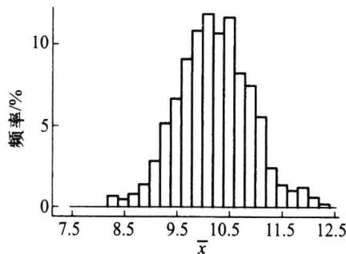
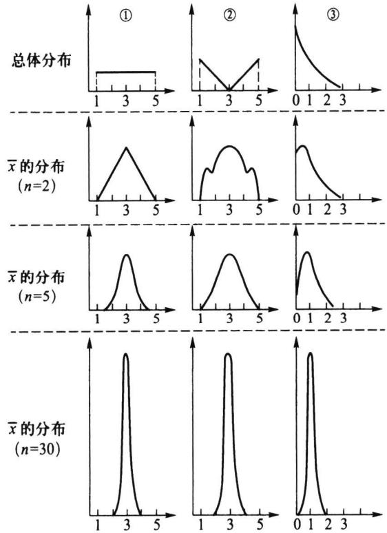
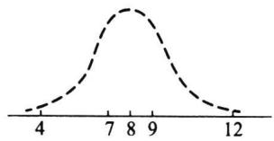
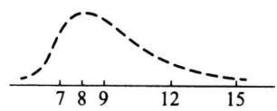
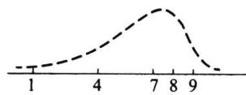
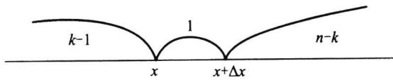
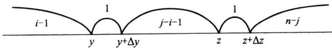
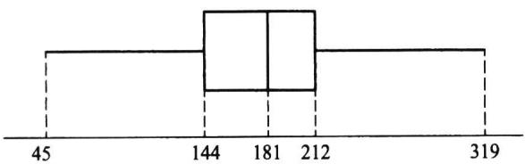
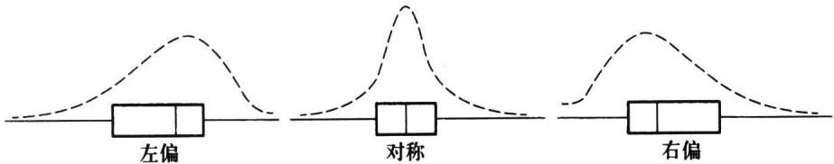

import Example from '@/components/Example.astro';
import Knowledge from '@/components/Knowledge.astro';
import Solution from '@/components/Solution.astro';
import Note from '@/components/Note.astro';
import Block from '@/components/Block.astro';

## 5.3.1 统计量与抽样分布

样本来自总体,因此样本中含有总体各方面的信息,但这些信息较为分散,有时显得杂乱无章.为将这些分散在样本中的有关总体的信息集中起来以反映总体的各种特征,需要对样本进行加工,表和图是一类加工形式,它使人们从中获得对总体的初步认识.当人们需要从样本获得对总体各种参数的认识时,更有效的加工方法是构造样本的函数,不同的样本函数反映总体的不同特征.

<Knowledge title="定义 5.3.1">
设 $x_{1}, x_{2}, \cdots, x_{n}$ 为取自某总体的样本，若样本函数 $T = T(x_{1}, x_{2}, \cdots, x_{n})$ 中不含有任何未知参数，则称 T 为统计量。统计量的分布称为抽样分布。

按照这一定义, 若 $x_{1}, x_{2}, \cdots, x_{n}$ 为样本, 则 $\sum_{i=1}^{n} x_{i}, \sum_{i=1}^{n} x_{i}^{2}$ 以及 5.2.1 节中的 $F_{n}(x)$ 都是统计量. 而当 $\mu, \sigma^{2}$ 未知时, $x_{1} - \mu, x_{1} / \sigma$ 等均不是统计量. 必须指出的是: 尽管统计量不依赖于未知参数, 但是它的分布是依赖于未知参数的.

下面几小节及 5.4 节我们介绍一些常见的统计量及其抽样分布.
</Knowledge>

## 5.3.2 样本均值及其抽样分布

<Knowledge title="定义 5.3.2">
设 $x_{1}, x_{2}, \cdots, x_{n}$ 为取自某总体的样本，其算术平均值称为样本均值，一般用 $\bar{x}$ 表示，即

$$

\overline {{{x}}} = \frac {x _ {1} + x _ {2} + \cdots + x _ {n}}{n} = \frac {1}{n} \sum_ {i = 1} ^ {n} x _ {i}.\tag{5.3.1}

$$

在分组样本场合,样本均值的近似公式为

$$

\overline {{{x}}} = \frac {x _ {1} f _ {1} + x _ {2} f _ {2} + \cdots + x _ {k} f _ {k}}{n} \quad \left(n = \sum_ {i = 1} ^ {k} f _ {i}\right).\tag{5.3.2}

$$

其中 k 为组数, $x_{i}$ 为第 i 组的组中值, $f_{i}$ 为第 i 组的频数.
</Knowledge>

<Example title="例 5.3.1">
某单位收集到20名青年人某月的娱乐支出费用数据：

$$

\begin{array}{c c c c c c c c c c} 7 9 0 & 8 4 0 & 8 4 0 & 8 8 0 & 9 2 0 & 9 3 0 & 9 4 0 & 9 7 0 & 9 8 0 & 9 9 0 \\ 1 0 0 0 & 1 0 1 0 & 1 0 1 0 & 1 0 2 0 & 1 0 2 0 & 1 0 8 0 & 1 1 0 0 & 1 1 3 0 & 1 1 8 0 & 1 2 5 0 \end{array}

$$

则该月这20名青年的平均娱乐支出为

$$

\overline {{{x}}} = \frac {1}{2 0} (7 9 0 + 8 4 0 + \dots + 1 2 5 0) = 9 9 4.

$$

将这 20 个数据分组可得到如下频数频率表：

表 5.3.1 例 5.3.1 的频数频率分布表

<table><tr><td>组序</td><td>分组区间</td><td>组中值</td><td>频数</td><td>频率(%)</td></tr><tr><td>1</td><td>(770,870]</td><td>820</td><td>3</td><td>15</td></tr><tr><td>2</td><td>(870,970]</td><td>920</td><td>5</td><td>25</td></tr><tr><td>3</td><td>(970,1070]</td><td>1020</td><td>7</td><td>35</td></tr><tr><td>4</td><td>(1070,1170]</td><td>1120</td><td>3</td><td>15</td></tr><tr><td>5</td><td>(1170,1270]</td><td>1220</td><td>2</td><td>10</td></tr><tr><td>合计</td><td></td><td></td><td>20</td><td>100</td></tr></table>

对表 5.3.1 的分组样本, 使用公式(5.3.2)进行计算可得

$$

\overline {{{x}}} = \frac {1}{2 0} (8 2 0 \times 3 + 9 2 0 \times 5 + \dots + 1 2 2 0 \times 2) = 1 0 0 0.

$$

我们看到两种计算结果不同.事实上,由于(5.3.2)式未用到真实的样本观测数据,因而给出的是近似结果.

关于样本均值,有如下几个性质.
</Example>

<Knowledge title="性质 5.3.1">
若把样本中的数据与样本均值之差称为偏差, 则样本所有偏差之和为 0 , 即 $\sum_{i=1}^{n}(x_{i}-\bar{x})=0$ .

从均值的计算公式看,它使用了所有的数据,而且每一个数据在计算公式中处于平等的地位.所有数据与样本中心 $\bar{x}$ 的偏差可正可负,且被互相抵消,从而样本的所有偏差之和必为零.
</Knowledge>

<Knowledge title="性质 5.3.2">
数据观测值与样本均值的偏差平方和最小，即在形如 $\sum (x_{i} - c)^{2}$ 的函

数中， $\sum (x_{i} - \overline{x})^{2}$ 最小，其中 $c$ 为任意给定常数

<Solution title="证明">
对任意给定的常数 $c$

$$

\begin{array}{r l} \sum (x _ {i} - c) ^ {2} & = \sum (x _ {i} - \overline {{{x}}} + \overline {{{x}}} - c) ^ {2} \\ & = \sum (x _ {i} - \overline {{{x}}}) ^ {2} + n (\overline {{{x}}} - c) ^ {2} + 2 \sum (x _ {i} - \overline {{{x}}}) (\overline {{{x}}} - c) \\ & = \sum (x _ {i} - \overline {{{x}}}) ^ {2} + n (\overline {{{x}}} - c) ^ {2} \geqslant \sum (x _ {i} - \overline {{{x}}}) ^ {2}. \end{array}

$$

下面考察样本均值的分布.

<table><tr><td>11</td><td>8</td><td></td><td>样本1</td><td>样本2</td><td>样本3</td><td>样本4</td></tr><tr><td>12</td><td>13</td><td rowspan="2">→</td><td rowspan="2">11</td><td rowspan="2">8</td><td rowspan="2">13</td><td rowspan="2">12</td></tr><tr><td>8</td><td>9</td></tr><tr><td>11</td><td>10</td><td rowspan="2">→</td><td rowspan="2">11</td><td rowspan="2">13</td><td rowspan="2">11</td><td rowspan="2">9</td></tr><tr><td>9</td><td>11</td></tr><tr><td>10</td><td>8</td><td>→</td><td>9</td><td>10</td><td>11</td><td>10</td></tr><tr><td>10</td><td>12</td><td rowspan="2">→</td><td rowspan="2">10</td><td rowspan="2">11</td><td rowspan="2">10</td><td rowspan="2">10</td></tr><tr><td>11</td><td>9</td></tr><tr><td>8</td><td>11</td><td>→</td><td>8</td><td>9</td><td>9</td><td>11</td></tr><tr><td>10</td><td>13</td><td>样本均值</td><td>9.8</td><td>10.2</td><td>10.8</td><td>10.4</td></tr></table>

图5.3.1 4个样本的样本均值
</Solution>
</Knowledge>

<Example title="例 5.3.2">
设有一个由 20 个数组成的总体, 现从该总体同时取出容量为 5 的样本. 图 5.3.1 画出第一个样本的抽样过程, 左侧是该总体, 右侧是从总体中随机地抽出的样本, 记录后, 放回, 再抽第二个样本. 这里一共抽出 4 个样本, 每个样本有 5 个观测值, 我们计算了各个样本的样本均值. 由抽样的随机性, 每一个样本的样本均值都有差别.

设想类似抽取样本 5、样本 6……每次都计算样本均值 $\bar{x}$ ，它们之间的差异是由于抽样的随机性引起的。假如无限制地抽下去，这样我们可以得到大量的 $\bar{x}$ 的值，图 5.3.2 就是用这样得到的 500 个 $\bar{x}$ 的值所形成的直方图，它反映了 $\bar{x}$ 的抽样分布。

它的外形很像正态分布,这不是偶然的,有下面定理保证.

图5.3.2 500个样本均值形成的直方图
</Example>

<Knowledge title="定理 5.3.1">
设 $x_{1}, x_{2}, \cdots, x_{n}$ 是来自某个总体的样本， $\bar{x}$ 为样本均值.

(1) 若总体分布为 $N(\mu, \sigma^{2})$ ，则 $\bar{x}$ 的精确分布为 $N(\mu, \sigma^{2}/n)$ ;

（2）若总体分布未知或不是正态分布， $E(x)=\mu,\operatorname{Var}(x)=\sigma^{2}$ 存在，则 n 较大时 $\bar{x}$ 的渐近分布为 $N(\mu,\sigma^{2}/n)$ ，常记为 $\bar{x}\sim N(\mu,\sigma^{2}/n)$ 。这里渐近分布是指 n 较大时的近似分布。

<Solution title="证明">
（1）利用卷积公式, 可得知 $\sum_{i=1}^{n}x_{i}\sim N(n\mu,n\sigma^{2})$ , 由此可知 $\bar{x}\sim N(\mu,\sigma^{2}/n)$ .

（2）由中心极限定理， $\sqrt{n} (\bar{x} - \mu) / \sigma \xrightarrow{L} N(0,1)$ ，这表明 $n$ 较大时 $\bar{x}$ 的渐近分布为 $N(\mu, \sigma^2 / n)$ ，证明完成.
</Solution>
</Knowledge>

<Example title="例 5.3.3">
图 5.3.3 给出三个不同总体样本均值的分布密度函数. 三个总体分别是:

① 均匀分布 ② 倒三角分布 ③ 指数分布, 随着样本量的增加, 样本均值 $\bar{x}$ 的抽样分布逐渐向正态分布逼近, 它们的均值保持不变, 而方差则缩小为原来的 $1/n$ . 当样本量为 30 时, 我们看到三个抽样分布都近似于正态分布. 下面对之进行具体说明.

  

图5.3.3 不同总体样本均值的分布

① 的总体分布为均匀分布 $U(1,5)$ ，该总体的均值和方差分别为3和4/3，若从该总体抽取样本容量为30的样本，则其样本均值的渐近分布为

$$

\overline {{{x}}} _ {1} \dot {\sim} N \left(3, \frac {4}{3 \times 3 0}\right) = N (3, 0. 2 1 ^ {2}).

$$

② 的总体分布的概率密度函数为

$$

p (x) = \left\{ \begin{array}{l l} (3 - x) / 4, & 1 \leqslant x <   3, \\ (x - 3) / 4, & 3 \leqslant x \leqslant 5, \\ 0, & \text {其他}. \end{array} \right.

$$

这是一个倒三角分布,可以算得其均值与方差分别为3和2,若从该总体抽取样本容量为30的样本,则其样本均值的渐近分布为

$$

\overline {{{x}}} _ {2} \sim N \left(3, \frac {2}{3 0}\right) = N (3, 0. 2 6 ^ {2}).

$$

③ 的总体分布为指数分布 $Exp(1)$ , 其均值与方差都等于 1, 若从该总体抽取样本容量为 30 的样本, 则其样本均值 $\overline{x}_3$ 的分布近似为

$$

\overline {{{x}}} _ {3} \dot {\sim} N \left(1, \frac {1}{3 0}\right) = N (1, 0. 1 8 ^ {2}).

$$

这三个总体都不是正态分布,但其样本均值的分布都近似于正态分布,差别表现

在均值与标准差上. 图 5.3.3 所示曲线既展示它们的共同之处, 又显示它们之间的差别.
</Example>

## 5.3.3 样本方差与样本标准差

<Knowledge title="定义 5.3.3">
设 $x_{1}, x_{2}, \cdots, x_{n}$ 为取自某总体的样本，则它关于样本均值 $\bar{x}$ 的平均偏差平方和

$$

s _ {n} ^ {2} = \frac {1}{n} \sum_ {i = 1} ^ {n} (x _ {i} - \bar {x}) ^ {2}\tag{5.3.3}

$$

称为样本方差.其算术根 $s_{n}=\sqrt{s_{n}^{2}}$ 称为样本标准差.相对样本方差而言,样本标准差通常更有实际意义,因为它与样本均值具有相同的度量单位.在n不大时,常用

$$

s ^ {2} = \frac {1}{n - 1} \sum_ {i = 1} ^ {n} (x _ {i} - \overline {{{x}}}) ^ {2}\tag{5.3.4}

$$

作为样本方差(也称无偏方差,其含义在第六章讲述),其算术根 $s=\sqrt{s^{2}}$ 也称为样本标准差.在实际中, $s^{2}$ 比 $s_{n}^{2}$ 更常用,在以后讲样本方差通常指的是 $s^{2}$ .

样本方差 $(s^{2}$ 或 $s_{n}^{2})$ 是度量样本散布大小的统计量, 使用广泛, 在它的这个定义中, n 为样本量, $\sum_{i=1}^{n}(x_{i}-\bar{x})^{2}$ 称为偏差平方和, n-1 称为偏差平方和的自由度. 其含义是: 在 $\bar{x}$ 确定后, n 个偏差 $x_{1}-\bar{x}, x_{2}-\bar{x}, \cdots, x_{n}-\bar{x}$ 中只有 n-1 个偏差可以自由变动, 而第 n 个则不能自由取值, 因为 $\sum(x_{i}-\bar{x})=0$ .

样本偏差平方和有三个常用的表达式：

$$

\sum \left(x _ {i} - \overline {{{x}}}\right) ^ {2} = \sum x _ {i} ^ {2} - \frac {\left(\sum x _ {i}\right) ^ {2}}{n} = \sum x _ {i} ^ {2} - n \overline {{{x}}} ^ {2}.\tag{5.3.5}

$$

它们都可用来计算样本方差.

在分组样本场合,样本方差的近似计算公式为

$$

s ^ {2} = \frac {1}{n - 1} \sum_ {i = 1} ^ {k} f _ {i} (x _ {i} - \overline {{{x}}}) ^ {2} = \frac {1}{n - 1} \left(\sum_ {i = 1} ^ {k} f _ {i} x _ {i} ^ {2} - n \overline {{{x}}} ^ {2}\right),\tag{5.3.6}

$$

其中 $x_{i}, f_{i}$ 分别为第 $i$ 个区间的组中值和频数， $\overline{x}$ 为(5.3.2)式给出的样本均值近似值.
</Knowledge>

<Example title="例 5.3.4">
考察例 5.3.1 的样本, 我们已经算得 $\bar{x}=994$ , 其样本方差与样本标准差分别为

$$

\begin{array}{r l} & s ^ {2} = \frac {1}{2 0 - 1} \big [ (7 9 0 - 9 9 4) ^ {2} + (8 4 0 - 9 9 4) ^ {2} + \dots + (1 2 5 0 - 9 9 4) ^ {2} \big ] = 1 3 3 9 3. 6 8, \\ & s = \sqrt {1 3 3 9 3 . 6 8} = 1 1 5. 7 3 1, \end{array}

$$

对表 5.3.1 的分组样本, 我们可以如表 5.3.2 计算(样本均值也由分组样本计算):

表 5.3.2 分组样本方差的计算表

<table><tr><td>组中值x</td><td>频数f</td><td>xf</td><td> $x-\overline{x}$ </td><td> $(x-\overline{x})^{2}f$ </td></tr><tr><td>820</td><td>3</td><td>2 460</td><td>-180</td><td>97 200</td></tr><tr><td>920</td><td>5</td><td>4 600</td><td>-80</td><td>32 000</td></tr><tr><td>1 020</td><td>7</td><td>7 140</td><td>20</td><td>2 800</td></tr><tr><td>组中值x</td><td>频数f</td><td>xf</td><td> $x-\overline{x}$ </td><td> $(x-\overline{x})^2f$ </td></tr><tr><td>1 120</td><td>3</td><td>3 360</td><td>120</td><td>43 200</td></tr><tr><td>1 220</td><td>2</td><td>2 440</td><td>220</td><td>96 800</td></tr><tr><td>和</td><td>20</td><td>20 000</td><td></td><td>272 000</td></tr></table>

于是 $\overline{x} = \frac{20000}{20} = 1000, s^2 = \frac{272000}{20 - 1} = 14316, s = \sqrt{14316} = 119.6.$

下面的定理给出样本均值的数学期望和方差以及样本方差的数学期望,它不依赖于总体的分布形式.
</Example>

<Knowledge title="定理 5.3.2">
设总体 X 具有二阶矩, 即 $E(X)=\mu$ , $\mathrm{Var}(X)=\sigma^{2}<\infty$ , $x_{1}, x_{2}, \cdots, x_{n}$ 为从该总体得到的样本, $\bar{x}$ 和 $s^{2}$ 分别是样本均值和样本方差, 则

$$

E (\overline {{{x}}}) = \mu , \qquad \operatorname{Var} (\overline {{{x}}}) = \sigma^ {2} / n,\tag{5.3.7}

$$

$$

E (s ^ {2}) = \sigma^ {2}.\tag{5.3.8}

$$

此定理表明,样本均值的期望与总体均值相同,而样本均值的方差是总体方差的 1/n.

<Solution title="证明">
由于

$$

E (\overline {{{x}}}) = \frac {1}{n} E \left(\sum_ {i = 1} ^ {n} x _ {i}\right) = \frac {n \mu}{n} = \mu ,

$$

$$

\operatorname{Var} (\bar {x}) = \frac {1}{n ^ {2}} \operatorname{Var} \left(\sum_ {i = 1} ^ {n} x _ {i}\right) = \frac {n \sigma^ {2}}{n ^ {2}} = \frac {\sigma^ {2}}{n},

$$

故(5.3.7)式成立.下证(5.3.8)式,注意到

$$

\sum_ {i = 1} ^ {n} \left(x _ {i} - \overline {{{x}}}\right) ^ {2} = \sum_ {i = 1} ^ {n} x _ {i} ^ {2} - n \overline {{{x}}} ^ {2},

$$

而 $E(x_{i}^{2}) = (E(x_{i}))^{2} + \mathrm{Var}(x_{i}) = \mu^{2} + \sigma^{2}, E(\overline{x}^{2}) = (E(\overline{x}))^{2} + \mathrm{Var}(\overline{x}) = \mu^{2} + \sigma^{2} / n$ ，于是

$$

E \left(\sum_ {i = 1} ^ {n} \left(x _ {i} - \bar {x}\right) ^ {2}\right) = n \left(\mu^ {2} + \sigma^ {2}\right) - n \left(\mu^ {2} + \sigma^ {2} / n\right) = (n - 1) \sigma^ {2},

$$

两边各除以 n-1，即得(5.3.8)式.
</Solution>
</Knowledge>

## 5.3.4 样本矩及其函数

样本均值和样本方差的更一般的推广是样本矩,这是一类常见的统计量.

<Knowledge title="定义 5.3.4">
设 $x_{1}, x_{2}, \cdots, x_{n}$ 是样本, k 为正整数, 则统计量

$$

a _ {k} = \frac {1}{n} \sum_ {i = 1} ^ {n} x _ {i} ^ {k}\tag{5.3.9}

$$

称为样本 k 阶原点矩, 特别, 样本一阶原点矩就是样本均值. 统计量

$$

b _ {k} = \frac {1}{n} \sum_ {i = 1} ^ {n} (x _ {i} - \overline {{{x}}}) ^ {k}\tag{5.3.10}

$$

称为样本 k 阶中心矩. 特别, 样本二阶中心矩就是样本方差.

当总体关于分布中心对称时,我们用 $\bar{x}$ 和 $s$ 刻画样本特征很有代表性,而当其不对称时,只用 $\bar{x}, s$ 就显得很不够.为此,需要一些刻画分布形状的统计量(参见 §2.7.5 和 §2.7.6).这里我们介绍样本偏度和样本峰度,它们都是样本中心矩的函数.
</Knowledge>

<Knowledge title="定义 5.3.5">
设 $x_{1}, x_{2}, \cdots, x_{n}$ 是样本，则称统计量

$$

\hat {\beta} _ {s} = b _ {3} / b _ {2} ^ {3 / 2}\tag{5.3.11}

$$

为样本偏度.

样本偏度 $\hat{\beta}_{s}$ 反映了样本数据与对称性的偏离程度和偏离方向. 如果数据完全对称, 则不难看出 $b_{3} = 0$ . 对不对称的数据则 $b_{3} \neq 0$ . 这里用 $b_{3}$ 除以 $b_{2}^{3/2}$ 是为了消除量纲的影响, $\hat{\beta}_{s}$ 是个相对数, 它很好地刻画了数据分布的偏斜方向和程度. 如果 $\hat{\beta}_{s} = 0$ , 表示样本对称 (见图5.3.4(a)); 如果 $\hat{\beta}_{s}$ 明显大于0, 表示样本的右尾长, 即样本中有几个较大的数, 这反映总体分布是正偏的或右偏的 (见图5.3.4(b)); 如果 $\hat{\beta}_{s}$ 明显小于0, 表示分布的左尾长, 即样本中有几个特小的数, 这反映总体分布是负偏的或左偏的 (见图5.3.4(c)).

  

(a) 样本 (4, 7, 8, 9, 12) 的偏度 $\hat{\beta}_{S}=0$

  

(c) 样本 (1, 4, 7, 8, 9) 的偏度 $\hat{\beta}_{S}=-0.5692$  

图 5.3.4 样本偏度 $\hat{\beta}_{s}$ 的例子(样本量 n=5)
</Knowledge>

<Knowledge title="定义 5.3.6">
设 $x_{1}, x_{2}, \cdots, x_{n}$ 是样本，则称统计量

$$

\hat {\beta} _ {k} = \frac {b _ {4}}{b _ {2} ^ {2}} - 3\tag{5.3.12}

$$

为样本峰度.

样本峰度 $\hat{\beta}_{k}$ 是反映总体分布密度曲线在其峰值附近的陡峭程度和尾部粗细的统计量. 当 $\hat{\beta}_{k}$ 明显大于 0 时, 分布密度曲线在其峰值附近比正态分布来得陡, 尾部更细, 称为尖顶型; 当 $\hat{\beta}_{k}$ 明显小于 0 时, 分布密度曲线在其峰值附近比正态分布来得平坦, 尾部更粗, 称为平顶型.
</Knowledge>

<Example title="例 5.3.5">
表 5.3.3 是两个班(每班 50 名同学)的英语课程的考试成绩.

表 5.3.3 两个班级的英语成绩

<table><tr><td>成绩</td><td>组中值</td><td>甲班人数 $f_{\text{甲}}$ </td><td>乙班人数 $f_{\text{乙}}$ </td></tr><tr><td>90～100</td><td>95</td><td>5</td><td>4</td></tr><tr><td>80～89</td><td>85</td><td>10</td><td>14</td></tr><tr><td>70～79</td><td>75</td><td>22</td><td>16</td></tr><tr><td>60～69</td><td>65</td><td>11</td><td>14</td></tr><tr><td>50～59</td><td>55</td><td>1</td><td>2</td></tr><tr><td>40～49</td><td>45</td><td>1</td><td>0</td></tr></table>

下面我们分别计算两个班级的平均成绩、标准差、样本偏度及样本峰度.表5.3.4和表5.3.5分别给出甲班和乙班的计算过程.

表 5.3.4 甲班成绩的计算过程

<table><tr><td>x</td><td> $f_{\text{甲}}$ </td><td> $x \cdot f_{\text{甲}}$ </td><td> $(x-\overline{x}_{\text{甲}})^{2}f_{\text{甲}}$ </td><td> $(x-\overline{x}_{\text{甲}})^{3}f_{\text{甲}}$ </td><td> $(x-\overline{x}_{\text{甲}})^{4}f_{\text{甲}}$ </td></tr><tr><td>95</td><td>5</td><td>475</td><td>1 843.20</td><td>35 389.440</td><td>679 477.248 0</td></tr><tr><td>85</td><td>10</td><td>850</td><td>846.40</td><td>7 786.880</td><td>71 639.296 0</td></tr><tr><td>75</td><td>22</td><td>1 650</td><td>14.08</td><td>-11.264</td><td>9.011 2</td></tr><tr><td>65</td><td>11</td><td>715</td><td>1 283.04</td><td>-13 856.832</td><td>149 653.785 6</td></tr><tr><td>55</td><td>1</td><td>55</td><td>432.64</td><td>-8 998.912</td><td>187 177.369 6</td></tr><tr><td>45</td><td>1</td><td>45</td><td>948.64</td><td>-29 218.112</td><td>899 917.849 6</td></tr><tr><td>和</td><td>50</td><td>3 790</td><td>5 368</td><td>-8 908.8</td><td>1 987 874.56</td></tr></table>

表 5.3.5 乙班成绩的计算过程

<table><tr><td>x</td><td> $f_{乙}$ </td><td> $x \cdot f_{乙}$ </td><td> $(x-\overline{x}_{乙})^{2}f_{乙}$ </td><td> $(x-\overline{x}_{乙})^{3}f_{乙}$ </td><td> $(x-\overline{x}_{乙})^{4}f_{乙}$ </td></tr><tr><td>95</td><td>4</td><td>380</td><td>1 474.56</td><td>28 311.552</td><td>543 581.798 4</td></tr><tr><td>85</td><td>14</td><td>1 190</td><td>1 184.96</td><td>10 901.632</td><td>100 295.014 4</td></tr><tr><td>75</td><td>16</td><td>1 200</td><td>10.24</td><td>-8.192</td><td>6.553 6</td></tr><tr><td>65</td><td>14</td><td>910</td><td>1 632.96</td><td>-17 635.968</td><td>190 468.454 4</td></tr><tr><td>55</td><td>2</td><td>110</td><td>865.28</td><td>-17 997.824</td><td>374 354.739 2</td></tr><tr><td>和</td><td>50</td><td>3 790</td><td>5 168</td><td>3 571.2</td><td>1 208 706.56</td></tr></table>

可算得两个班的平均成绩、标准差、偏度、峰度分别为：

$$

\overline {{{x}}} _ {\mathrm{甲}} = \frac {3 7 9 0}{5 0} = 7 5. 8,

$$

$$

\overline {{{x}}} _ {\mathrm{乙}} = \frac {3 7 9 0}{5 0} = 7 5. 8,

$$

$$

s _ {\text {甲}} = \sqrt {\frac {5 3 6 8}{4 9}} = 1 0. 4 7, s _ {\text {乙}} = \sqrt {\frac {5 1 6 8}{4 9}} = 1 0. 2 7,

$$

$$

\hat {\beta} _ {s _ {\text {甲}}} = \frac {- 8 9 0 8 . 8 / 5 0}{(5 3 6 8 / 5 0) ^ {3 / 2}} = - 0. 1 6, \qquad \hat {\beta} _ {s _ {\text {乙}}} = \frac {3 5 7 1 . 2 / 5 0}{(5 1 6 8 / 5 0) ^ {3 / 2}} = 0. 0 6 8,

$$

$$

\hat {\beta} _ {k _ {\mathrm{甲}}} = \frac {1 9 8 7 8 7 4 . 5 6 / 5 0}{(5 3 6 8 / 5 0) ^ {2}} - 3 = 0. 4 5, \quad \hat {\beta} _ {k _ {\mathrm{乙}}} = \frac {1 2 0 8 7 0 6 . 5 6 / 5 0}{(5 1 6 8 / 5 0) ^ {2}} - 3 = - 0. 7 4.

$$

由此可见,两个班级的平均成绩相同,标准差也几乎相同,样本偏度分别为-0.16和0.068,显示两个班的成绩都是基本对称的.但两个班的样本峰度明显不同.乙班的成绩分布比较平坦,而甲班则稍显尖顶.
</Example>

## 5.3.5 次序统计量及其分布

除了样本矩以外,另一类常见的统计量是次序统计量,它在实际和理论中都有广泛的应用.

## 一、定义

<Knowledge title="定义 5.3.7">
设 $x_{1}, x_{2}, \cdots, x_{n}$ 是取自总体 X 的样本， $x_{(i)}$ 称为该样本的第 i 个次序统计量，它的取值是将样本观测值由小到大排列后得到的第 i 个观测值。其中 $x_{(1)} = \min\{x_{1}, x_{2}, \cdots, x_{n}\}$ 称为该样本的最小次序统计量， $x_{(n)} = \max\{x_{1}, x_{2}, \cdots, x_{n}\}$ 称为该样本的最大次序统计量. $(x_{(1)},x_{(2)},\cdots,x_{(n)})$ 称为该样本的次序统计量.

我们知道,在一个(简单随机)样本中, $x_{1},x_{2},\cdots,x_{n}$ 是独立同分布的,而次序统计量 $x_{(1)},x_{(2)},\cdots,x_{(n)}$ 则既不独立,分布也不相同,看下例.
</Knowledge>

<Example title="例 5.3.6">
设总体 X 的分布为仅取 0,1,2 的离散均匀分布, 分布列为

<table><tr><td>x</td><td>0</td><td>1</td><td>2</td></tr><tr><td>p</td><td>1/3</td><td>1/3</td><td>1/3</td></tr></table>

现从中抽取容量为 3 的样本, 其一切可能取值有 $3^{3} = 27$ 种, 现将它们列在表 5.3.6 左侧, 其右侧是相应的次序统计量观测值.

表 5.3.6 例 5.3.6 中样本取值及其次序统计量取值

<table><tr><td> $x_{1}$ </td><td> $x_{2}$ </td><td> $x_{3}$ </td><td> $x_{(1)}$ </td><td> $x_{(2)}$ </td><td> $x_{(3)}$ </td><td> $x_{1}$ </td><td> $x_{2}$ </td><td> $x_{3}$ </td><td> $x_{(1)}$ </td><td> $x_{(2)}$ </td><td> $x_{(3)}$ </td></tr><tr><td>0</td><td>0</td><td>0</td><td>0</td><td>0</td><td>0</td><td>1</td><td>2</td><td>0</td><td>0</td><td>1</td><td>2</td></tr><tr><td>0</td><td>0</td><td>1</td><td>0</td><td>0</td><td>1</td><td>2</td><td>1</td><td>0</td><td>0</td><td>1</td><td>2</td></tr><tr><td>0</td><td>1</td><td>0</td><td>0</td><td>0</td><td>1</td><td>0</td><td>2</td><td>2</td><td>0</td><td>2</td><td>2</td></tr><tr><td>1</td><td>0</td><td>0</td><td>0</td><td>0</td><td>1</td><td>2</td><td>0</td><td>2</td><td>0</td><td>2</td><td>2</td></tr><tr><td>0</td><td>0</td><td>2</td><td>0</td><td>0</td><td>2</td><td>2</td><td>2</td><td>0</td><td>0</td><td>2</td><td>2</td></tr><tr><td>0</td><td>2</td><td>0</td><td>0</td><td>0</td><td>2</td><td>1</td><td>1</td><td>2</td><td>1</td><td>1</td><td>2</td></tr><tr><td>2</td><td>0</td><td>0</td><td>0</td><td>0</td><td>2</td><td>1</td><td>2</td><td>1</td><td>1</td><td>1</td><td>2</td></tr><tr><td>0</td><td>1</td><td>1</td><td>0</td><td>1</td><td>1</td><td>2</td><td>1</td><td>1</td><td>1</td><td>1</td><td>2</td></tr><tr><td>1</td><td>0</td><td>1</td><td>0</td><td>1</td><td>1</td><td>1</td><td>2</td><td>2</td><td>1</td><td>2</td><td>2</td></tr><tr><td>1</td><td>1</td><td>0</td><td>0</td><td>1</td><td>1</td><td>2</td><td>1</td><td>2</td><td>1</td><td>2</td><td>2</td></tr><tr><td>0</td><td>1</td><td>2</td><td>0</td><td>1</td><td>2</td><td>2</td><td>2</td><td>1</td><td>1</td><td>2</td><td>2</td></tr><tr><td>0</td><td>2</td><td>1</td><td>0</td><td>1</td><td>2</td><td>1</td><td>1</td><td>1</td><td>1</td><td>1</td><td>1</td></tr><tr><td>1</td><td>0</td><td>2</td><td>0</td><td>1</td><td>2</td><td>2</td><td>2</td><td>2</td><td>2</td><td>2</td><td>2</td></tr><tr><td>2</td><td>0</td><td>1</td><td>0</td><td>1</td><td>2</td><td></td><td></td><td></td><td></td><td></td><td></td></tr></table>

由于样本取上述每一组观测值的概率相同,都为 1/27,由此可给出 $x_{(1)}, x_{(2)}, x_{(3)}$ 的分布列如下:

<table><tr><td> $x_{(1)}$ </td><td>0</td><td>1</td><td>2</td></tr><tr><td>p</td><td> $\frac{19}{27}$ </td><td> $\frac{7}{27}$ </td><td> $\frac{1}{27}$ </td></tr></table>

我们可以清楚地看到这三个次序统计量的分布是不相同的.

进一步,我们可以给出两个次序统计量的联合分布,如, $x_{(1)}$ 和 $x_{(2)}$ 的联合分布列为因为 $P(x_{(1)} = 0)P(x_{(2)} = 0) = \frac{19}{27}\times \frac{7}{27}$ 而 $P(x_{(1)} = 0,x_{(2)} = 0) = \frac{7}{27}$ ，两者不等，由此可看出 $x_{(1)}$ 和 $x_{(2)}$ 是不独立的.

<table><tr><td rowspan="2"> $x_{(1)}$ </td><td colspan="3"> $x_{(2)}$ </td></tr><tr><td>0</td><td>1</td><td>2</td></tr><tr><td>0</td><td>7/27</td><td>9/27</td><td>3/27</td></tr><tr><td>1</td><td>0</td><td>4/27</td><td>3/27</td></tr><tr><td>2</td><td>0</td><td>0</td><td>1/27</td></tr></table>

接下来我们讨论次序统计量的抽样分布,它们常用在连续总体上,故我们仅就总体 X 的分布为连续的情况进行叙述.
</Example>

## 二、单个次序统计量的分布

<Knowledge title="定理 5.3.3">
设总体 X 的密度函数为 $p(x)$ ，分布函数为 $F(x)$ ， $x_{1}$ ， $x_{2}$ ， $\cdots$ ， $x_{n}$ 为样本，则第 k 个次序统计量 $x_{(k)}$ 的密度函数为

$$

p _ {k} (x) = \frac {n !}{(k - 1) ! (n - k) !} (F (x)) ^ {k - 1} (1 - F (x)) ^ {n - k} p (x).\tag{5.3.13}

$$

<Solution title="证明">
对任意的实数 $x$ ，考虑次序统计量 $x_{(k)}$ 取值落在小区间 $(x, x + \Delta x]$ 内这一事件，它等价于“样本容量为 $n$ 的样本中有 1 个观测值落在 $(x, x + \Delta x]$ 之间（多于一个观测值落在区间 $(x, x + \Delta x]$ 的概率是 $\Delta x$ 的高阶无穷小量，后同），而有 $k - 1$ 个观测值小于等于 $x$ ，有 $n - k$ 个观测值大于 $x + \Delta x$ ”，其直观示意见图 5.3.5.

  

图5.3.5 $x_{(k)}$ 取值的示意图

样本的每一个分量小于等于 $x$ 的概率为 $F(x)$ , 落入区间 $(x, x + \Delta x]$ 的概率为 $F(x + \Delta x) - F(x)$ , 大于 $x + \Delta x$ 的概率为 $1 - F(x + \Delta x)$ , 而将 $n$ 个分量分成这样的三组, 总的分法有 $\frac{n!}{(k-1)!1!(n-k)!}$ 种. 于是, 若以 $F_k(x)$ 记 $x_{(k)}$ 的分布函数, 则由多项分布可得

$$

\begin{array}{r l} F _ {k} (x + \Delta x) - F _ {k} (x) & \approx \frac {n !}{(k - 1) ! (n - k) !} (F (x)) ^ {k - 1} (F (x + \Delta x) - \\ & \quad F (x)) (1 - F (x + \Delta x)) ^ {n - k}, \end{array}

$$

两边除以 $\Delta x$ ，并令 $\Delta x\to 0$ ，即有

$$

\begin{array}{r l} p _ {k} (x) & = \lim _ {\Delta x \to 0} \frac {F _ {k} (x + \Delta x) - F _ {k} (x)}{\Delta x} \\ & = \frac {n !}{(k - 1) ! (n - k) !} (F (x)) ^ {k - 1} p (x) (1 - F (x)) ^ {n - k}, \end{array}

$$

其中 $p_k(x)$ 的非零区间与总体的非零区间相同. 特别, 令 $k = 1$ 和 $k = n$ 即得到最小次序统计量 $x_{(1)}$ 和最大次序统计量 $x_{(n)}$ 的密度函数分别为

$$

p _ {1} (x) = n \cdot (1 - F (x)) ^ {n - 1} p (x),\tag{5.3.14}

$$

$$

p _ {n} (x) = n \cdot (F (x)) ^ {n - 1} p (x).\tag{5.3.15}

$$
</Solution>
</Knowledge>

<Example title="例 5.3.7">
设总体密度函数为

$$

p (x) = 3 x ^ {2}, \quad 0 <   x <   1,

$$

现从该总体抽得一个容量为 5 的样本,试计算 $P(x_{(2)}<1/2)$ .

<Solution title="解">
我们首先应求出 $x_{(2)}$ 的分布. 由总体密度函数不难求出总体分布函数为

$$

F (x) = \left\{ \begin{array}{l l} 0, & x \leqslant 0, \\ x ^ {3}, & 0 <   x <   1, \\ 1, & x \geqslant 1. \end{array} \right.

$$

由公式(5.3.13)可以得到 $x_{(2)}$ 的密度函数为

$$

\begin{array}{r l} p _ {2} (x) & = \frac {5 !}{(2 - 1) ! (5 - 2) !} (F (x)) ^ {2 - 1} p (x) (1 - F (x)) ^ {5 - 2} \\ & = 2 0 \cdot x ^ {3} \cdot 3 x ^ {2} \cdot (1 - x ^ {3}) ^ {3} \\ & = 6 0 x ^ {5} (1 - x ^ {3}) ^ {3}, \quad 0 <   x <   1, \end{array}

$$

于是

$$

\begin{array}{r l} P (x _ {(2)} <   1 / 2) & = \int_ {0} ^ {1 / 2} 6 0 x ^ {5} (1 - x ^ {3}) ^ {3} \mathrm{d} x \\ & = \int_ {0} ^ {1 / 8} 2 0 y (1 - y) ^ {3} \mathrm{d} y = \int_ {7 / 8} ^ {1} 2 0 (z ^ {3} - z ^ {4}) \mathrm{d} z \\ & = 5 \left(1 - \left(\frac {7}{8}\right) ^ {4}\right) - 4 \left(1 - \left(\frac {7}{8}\right) ^ {5}\right) = 0. 1 2 0 7. \end{array}

$$
</Solution>
</Example>

<Example title="例 5.3.8">
设总体分布为 $U(0,1)$ , $x_{1}$ , $x_{2}$ , $\cdots$ , $x_{n}$ 为样本，则其第 k 个次序统计量的密度函数为

$$

p _ {k} (x) = \frac {n !}{(k - 1) ! (n - k) !} x ^ {k - 1} (1 - x) ^ {n - k}, \qquad 0 <   x <   1,

$$

这就是 §2.5 中介绍的贝塔分布 $Be(k, n-k+1)$ ，从而有 $E(x_{(k)}) = \frac{k}{n+1}$ .
</Example>

## 三、多个次序统计量及其函数的分布

下面我们讨论任意两个次序统计量的联合分布.对三个或三个以上次序统计量的分布可参照进行.

<Knowledge title="定理 5.3.4">
在定理 5.3.3 的记号下, 次序统计量 $(x_{(i)}, x_{(j)})$ (i&lt;j) 的联合分布密度函数为

$$

\begin{array}{r l} p _ {i j} (y, z) & = \frac {n !}{(i - 1) ! (j - i - 1) ! (n - j) !} [ F (y) ] ^ {i - 1} [ F (z) - F (y) ] ^ {j - i - 1}. \\ & [ 1 - F (z) ] ^ {n - j} p (y) p (z), \quad y \leqslant z, \end{array} \tag {5.3}\tag{5.3.16}

$$

<Solution title="证明">
对增量 $\Delta y, \Delta z$ 以及 y &lt; z，事件 $\left\{x_{(i)} \in (y, y + \Delta y], x_{(j)} \in (z, z + \Delta z]\right\}$ 可以表述为“容量为 n 的样本 $x_{1}, x_{2}, \cdots, x_{n}$ 中有 i - 1 个观测值小于等于 y，一个落入区间 $(y, y + \Delta y], j - i - 1$ 个落入区间 $(y + \Delta y, z]$ ，一个落入区间 $(z, z + \Delta z]$ ，而余下 n - j 个大于 $z + \Delta z$ ”（见图 5.3.6）.

于是由多项分布可得

$$

\begin{array}{r l} & {P (x _ {(i)} \in (y, y + \Delta y), x _ {(j)} \in (z, z + \Delta z))} \\ & {\approx \frac {n !}{(i - 1) ! 1 ! (j - i - 1) ! 1 ! (n - j) !} [ F (y) ] ^ {i - 1} p (y) \Delta y [ F (z) -} \\ & {\qquad F (y + \Delta y) ] ^ {j - i - 1} p (z) \Delta z [ 1 - F (z + \Delta z) ] ^ {n - j},} \end{array}

$$

  

图5.3.6 $x_{(i)}$ 与 $x_{(j)}$ 取值的示意图

考虑到 $F(x)$ 的连续性，当 $\Delta y\to 0,\Delta z\to 0$ 时有 $F(y + \Delta y)\rightarrow F(y),F(z + \Delta z)\rightarrow F(z)$ ，于是

$$

\begin{array}{r l} p _ {i j} (y, z) & = \lim _ {\Delta y \to 0, \Delta z \to 0} \frac {P (x _ {(i)} \in (y , y + \Delta y) , x _ {(j)} \in (z , z + \Delta z))}{\Delta y \cdot \Delta z} \\ & = \frac {n !}{(i - 1) ! (j - i - 1) ! (n - j) !} [ F (y) ] ^ {i - 1} [ F (z) - \\ & F (y) ] ^ {j - i - 1} [ 1 - F (z) ] ^ {n - j} p (y) p (z). \end{array}

$$

定理得证.

在实际问题中会用到一些次序统计量的函数, 如: $R_{n} = x_{(n)} - x_{(1)}$ 称为样本极差, 是一个很常用的统计量, 要推导这个统计量的分布原则上并不难, 我们只要使用定理 5.3.4 以及第三章讲过的随机变量函数的分布求法即可解决. 但它们的分布常用积分表示, 只在很少几种场合可用初等函数表示, 下面是一个样本极差的分布可用初等函数表示的例子.
</Solution>
</Knowledge>

<Example title="例 5.3.9">
设总体分布为 $U(0,1)$ , $x_{1}$ , $x_{2}$ , $\cdots$ , $x_{n}$ 为其样本，则 $(Y,Z)=(x_{(1)},x_{(n)})$ 的联合密度函数为

$$

p (y, z) = n (n - 1) (z - y) ^ {n - 2}, \quad 0 <   y <   z <   1.

$$

令 R=Z-Y，由 R>0,0&lt;Y&lt;Z&lt;1，可以推出 $0<Y=Z-R\leqslant1-R$ ，则 $(Y,R)$ 的联合分布密度为 $p(y,r)=n(n-1)r^{n-2},\quad y>0,r>0,y+r<1,$

于是 $R$ 的边际密度函数为

$$

p _ {R} (r) = \int_ {0} ^ {1 - r} n (n - 1) r ^ {n - 2} \mathrm{d} y = n (n - 1) r ^ {n - 2} (1 - r), \quad 0 <   r <   1,

$$

这正是参数为 $(n - 1,2)$ 的贝塔分布.
</Example>

## 5.3.6 样本分位数与样本中位数

样本中位数 $m_{0.5}$ 也是一个很常见的统计量，它也是次序统计量的函数，通常如下定义：

$$

m _ {0. 5} = \left\{ \begin{array}{l l} x \left(\frac {n + 1}{2}\right) & , \quad n \text {为奇数}, \\ \frac {1}{2} \left(x \left(\frac {n}{2}\right) + x \left(\frac {n}{2} + 1\right)\right), & n \text {为偶数}. \end{array} \right.

$$

譬如，若 $n = 5$ ，则 $m_{0.5} = x_{(3)}$ ，若 $n = 6$ ，则 $m_{0.5} = \frac{1}{2} (x_{(3)} + x_{(4)})$

更一般地,样本 p 分位数 $m_{p}$ 可如下定义:

$$

m _ {p} = \left\{ \begin{array}{l l} x _ {([ n p + 1 ])}, & \text {若} n p \text {不是整数,} \\ \frac {1}{2} (x _ {(n p)} + x _ {(n p + 1)}), & \text {若} n p \text {是整数.} \end{array} \right.

$$

譬如，若 $n = 10, p = 0.35$ ，则 $m_{0.35} = x_{(4)}$ ，若 $n = 20, p = 0.45$ ，则 $m_{0.45} = \frac{1}{2}(x_{(9)} + x_{(10)})$

对多数总体而言,要给出样本 $p$ 分位数的精确分布通常不是一件容易的事.幸运的是当 $n \to \infty$ 时样本 $p$ 分位数的渐近分布有比较简单的表达式,我们这里不加证明地给出如下定理.

<Knowledge title="定理 5.3.5">
设总体密度函数为 $p(x)$ , $x_{p}$ 为其 p 分位数, $p(x)$ 在 $x_{p}$ 处连续且 $p(x_{p}) > 0$ , 则当 $n \to \infty$ 时样本 p 分位数 $m_{p}$ 的渐近分布为

$$

m _ {p} \dot {\sim} N \left(x _ {p}, \frac {p (1 - p)}{n \cdot p ^ {2} (x _ {p})}\right).\tag{5.3.17}

$$

特别,对样本中位数,当 $n \to \infty$ 时近似地有

$$

m _ {0. 5} \dot {\sim} N \left(x _ {0. 5}, \frac {1}{4 n \cdot p ^ {2} (x _ {0 . 5})}\right).\tag{5.3.18}

$$
</Knowledge>

<Example title="例 5.3.10">
设总体为柯西分布, 密度函数为

$$

p (x; \theta) = \frac {1}{\pi (1 + (x - \theta)) ^ {2}}, \quad - \infty <   x <   \infty ,

$$

其分布函数为

$$

F (x; \theta) = \frac {1}{2} + \frac {1}{\pi} \arctan (x - \theta).

$$

不难看出 $\theta$ 是该总体的中位数，即 $x_{0.5}=\theta$ . 设 $x_{1}, x_{2}, \cdots, x_{n}$ 是来自该总体的样本，当样本量 n 较大时，样本中位数 $m_{0.5}$ 的渐近分布为

$$

m _ {0. 5} \sim N \left(\theta , \frac {\pi^ {2}}{4 n}\right).

$$

通常,样本均值在概括数据方面具有一定的优势.但样本均值也有其不足之处.设我们有5个数3,5,9,10,13,则其均值为 $(3+5+9+10+13)/5=8$ .如果我们不小心将13错输入为133(比如在计算机输入时将3连按2下),则均值即变为 $(3+5+9+10+133)/5=32$ .这说明均值受极端数值影响较大,与之相对应,中位数则不受极端值的影响,因此,当数据中含有极端值时,使用中位数比使用均值更好,中位数的这种抗干扰性在统计中称为具有稳健性.
</Example>

## 5.3.7 五数概括与箱线图

次序统计量的应用之一是五数概括与箱线图.在得到有序样本后,容易计算如下五个值:最小观测值 $x_{\min}=x_{(1)}$ ,最大观测值 $x_{\max}=x_{(n)}$ ,中位数 $m_{0.5}$ ,第一4分位数 $Q_{1}=m_{0.25}$ 和第三4分位数 $Q_{3}=m_{0.75}$ .所谓五数概括就是指用这五个数

$$

x _ {\mathrm{min}}, \qquad Q _ {1}, \qquad m _ {0. 5}, \qquad Q _ {3}, \qquad x _ {\mathrm{max}}

$$

来大致描述一批数据的轮廓.

<Example title="例 5.3.11">
表 5.3.7 是某厂 160 名销售人员某月的销售量数据的有序样本, 由该批数据可计算得到: $x_{\min}=45, x_{\max}=319, m_{0.5}=181, Q_{1}=144, Q_{3}=212$ .

表 5.3.7 某厂 160 名销售员的月销售量的有序样本

<table><tr><td>45</td><td>74</td><td>76</td><td>80</td><td>87</td><td>91</td><td>92</td><td>93</td><td>95</td><td>96</td></tr><tr><td>98</td><td>99</td><td>104</td><td>106</td><td>111</td><td>113</td><td>117</td><td>120</td><td>122</td><td>122</td></tr><tr><td>124</td><td>126</td><td>127</td><td>127</td><td>129</td><td>129</td><td>130</td><td>131</td><td>131</td><td>133</td></tr><tr><td>134</td><td>134</td><td>135</td><td>136</td><td>137</td><td>137</td><td>139</td><td>141</td><td>141</td><td>143</td></tr><tr><td>145</td><td>148</td><td>149</td><td>149</td><td>149</td><td>150</td><td>150</td><td>153</td><td>153</td><td>153</td></tr><tr><td>153</td><td>154</td><td>157</td><td>160</td><td>160</td><td>162</td><td>163</td><td>163</td><td>165</td><td>165</td></tr><tr><td>167</td><td>167</td><td>168</td><td>170</td><td>171</td><td>172</td><td>173</td><td>174</td><td>175</td><td>175</td></tr><tr><td>176</td><td>178</td><td>178</td><td>178</td><td>179</td><td>179</td><td>179</td><td>180</td><td>181</td><td>181</td></tr><tr><td>181</td><td>182</td><td>182</td><td>185</td><td>185</td><td>186</td><td>186</td><td>187</td><td>188</td><td>188</td></tr><tr><td>188</td><td>189</td><td>189</td><td>191</td><td>191</td><td>191</td><td>192</td><td>192</td><td>194</td><td>194</td></tr><tr><td>194</td><td>194</td><td>195</td><td>196</td><td>197</td><td>197</td><td>198</td><td>198</td><td>198</td><td>199</td></tr><tr><td>200</td><td>201</td><td>202</td><td>204</td><td>204</td><td>205</td><td>205</td><td>206</td><td>207</td><td>210</td></tr><tr><td>214</td><td>214</td><td>215</td><td>215</td><td>216</td><td>217</td><td>218</td><td>219</td><td>219</td><td>221</td></tr><tr><td>221</td><td>221</td><td>221</td><td>221</td><td>222</td><td>223</td><td>223</td><td>224</td><td>227</td><td>227</td></tr><tr><td>228</td><td>229</td><td>232</td><td>234</td><td>234</td><td>238</td><td>240</td><td>242</td><td>242</td><td>242</td></tr><tr><td>244</td><td>246</td><td>253</td><td>253</td><td>255</td><td>258</td><td>282</td><td>290</td><td>314</td><td>319</td></tr></table>

五数概括的图形表示称为箱线图,由箱子和线段组成.图 5.3.7 是例 5.3.11 中样本数据的箱线图,其作法如下:

（1）画一个箱子,其两侧恰为第一4分位数和第三4分位数,在中位数位置上画一条竖线,它在箱子内.这个箱子包含了样本中50%的数据;

（2）在箱子左右两侧各引出一条水平线，分别至最小值和最大值为止.每条线段包含了样本中 $25\%$ 的数据.

  

图 5.3.7 月销售量数据的箱线图

箱线图可用来对样本数据分布的形状进行大致的判断. 图 5.3.8 给出三种常见的箱线图, 分别对应左偏分布、对称分布和右偏分布.

  

图 5.3.8 三种常见的箱线图及其对应的分布轮廓

如果我们要对几批数据进行比较,则可以在一张纸上同时画出这几批数据的箱线图.图5.3.9是根据某厂20天生产的某种产品的直径数据画成的箱线图,从图中可以清楚地看出,第18天的产品出现了异常.

  

图5.3.9 20天生产的某产品的直径的箱线图
</Example>

<Block title="习题5.3">
1. 在一本书上我们随机地检查了 10 页, 发现每页上的错误数为:

## 4 5 6 0 3 1 4 2 1 4

试计算其样本均值、样本方差和样本标准差.

2. 证明: 对任意常数 c, d, 有

$$

\sum_ {i = 1} ^ {n} \left(x _ {i} - c\right) \left(y _ {i} - d\right) = \sum_ {i = 1} ^ {n} \left(x _ {i} - \bar {x}\right) \left(y _ {i} - \bar {y}\right) + n (\bar {x} - c) (\bar {y} - d).

$$

3. 设 $x_{1}, x_{2}, \cdots, x_{n}$ 和 $y_{1}, y_{2}, \cdots, y_{n}$ 是两组样本观测值，且有如下关系：

$$

y _ {i} = 3 x _ {i} - 4, i = 1, 2, \dots , n,

$$

试求样本均值 $\bar{x}$ 和 $\bar{y}$ 间的关系以及样本方差 $s_{x}^{2}$ 和 $s_{y}^{2}$ 间的关系.

4. 记 $\bar{x}_{n}=\frac{1}{n}\sum_{i=1}^{n}x_{i},s_{n}^{2}=\frac{1}{n-1}\sum_{i=1}^{n}(x_{i}-\bar{x}_{n})^{2},n=1,2,\cdots,$ 证明：

$$

\overline {{{x}}} _ {n + 1} = \overline {{{x}}} _ {n} + \frac {1}{n + 1} (x _ {n + 1} - \overline {{{x}}} _ {n}),

$$

$$

s _ {n + 1} ^ {2} = \frac {n - 1}{n} s _ {n} ^ {2} + \frac {1}{n + 1} (x _ {n + 1} - \overline {{x}} _ {n}) ^ {2}.

$$

5. 从同一总体中抽取两个容量分别为 $n, m$ 的样本，样本均值分别为 $\overline{x}_1, \overline{x}_2$ ，样本方差分别为 $s_1^2, s_2^2$ ，将两组样本合并，其均值、方差分别为 $\overline{x}, s^2$ ，证明：

$$

\begin{array}{l} \overline {{x}} = \frac {n \overline {{x}} _ {1} + m \overline {{x}} _ {2}}{n + m}, \\ s ^ {2} = \frac {(n - 1) s _ {1} ^ {2} + (m - 1) s _ {2} ^ {2}}{n + m - 1} + \frac {n m (\overline {{x}} _ {1} - \overline {{x}} _ {2}) ^ {2}}{(n + m) (n + m + 1)}. \end{array}

$$

6. 设有容量为 $n$ 的样本 $A$ , 它的样本均值为 $\bar{x}_A$ , 样本标准差为 $s_A$ , 样本极差为 $R_A$ , 样本中位数为 $m_A$ . 现对样本中每一个观测值施行变换

$$

y = a x + b,

$$

如此得到样本 B，试写出样本 B 的均值、标准差、极差和中位数。

7. 证明: 容量为 2 的样本 $x_{1}, x_{2}$ 的方差为

$$

s ^ {2} = \frac {1}{2} (x _ {1} - x _ {2}) ^ {2}.

$$

8. 设 $x_{1}, x_{2}, \cdots, x_{n}$ 是来自 $U(-1, 1)$ 的样本，试求 $E(\bar{x})$ 和 $\operatorname{Var}(\bar{x})$ .

9. 设总体二阶矩存在, $x_{1}, x_{2}, \cdots, x_{n}$ 是样本, 证明 $x_{i} - \bar{x}$ 与 $x_{j} - \bar{x} (i \neq j)$ 的相关系数为 $-(n - 1)^{-1}$ .

10. 设 $x_{1}, x_{2}, \cdots, x_{n}$ 为一个样本， $s^{2} = \frac{1}{n - 1} \sum_{i=1}^{n} (x_{i} - \bar{x})^{2}$ 是样本方差，试证：

$$

\frac {1}{n (n - 1)} \sum_ {i <   j} \left(x _ {i} - x _ {j}\right) ^ {2} = s ^ {2}.

$$

11. 设总体 4 阶中心矩 $\nu_{4} = E[x - E(x)]^{4}$ 存在, 试证: 对样本方差 $s^{2} = \frac{1}{n - 1} \sum_{i=1}^{n} (x_{i} - \bar{x})^{2}$ , 有

$$

\operatorname{Var} \left(s ^ {2}\right) = \frac {n \left(\nu_ {4} - \sigma^ {4}\right)}{(n - 1) ^ {2}} - \frac {2 \left(\nu_ {4} - 2 \sigma^ {4}\right)}{(n - 1) ^ {2}} + \frac {\nu_ {4} - 3 \sigma^ {4}}{n (n - 1) ^ {2}},

$$

其中 $\sigma^{2}$ 为总体 X 的方差.

12. 设总体 X 的 3 阶矩存在, 若 $x_{1}, x_{2}, \cdots, x_{n}$ 是取自该总体的简单随机样本, $\bar{x}$ 为样本均值, $s^{2}$ 为样本方差, 试证: $\mathrm{Cov}(\bar{x}, s^{2}) = \frac{\nu_{3}}{n}$ , 其中 $\nu_{3} = E[x - E(x)]^{3}$ .

13. 设 $\overline{x}_1$ 与 $\overline{x}_2$ 是从同一正态总体 $N(\mu, \sigma^2)$ 独立抽取的容量相同的两个样本均值. 试确定样本容量 $n$ , 使得两样本均值的差超过 $\sigma$ 的概率不超过 0.01.

14. 利用切比雪夫不等式求抛均匀硬币多少次才能使正面朝上的频率落在(0.4,0.6)间的概率至少为0.9.如何才能更精确地计算这个次数？是多少？

15. 从指数总体 $Exp(1 / \theta)$ 抽取了40个样品, 试求 $\overline{x}$ 的渐近分布.

16. 设 $x_{1}, x_{2}, \cdots, x_{25}$ 是从均匀分布 $U(0,5)$ 抽取的样本，试求样本均值 $\bar{x}$ 的渐近分布.

17. 设 $x_{1}, x_{2}, \cdots, x_{20}$ 是从二点分布 $b(1, p)$ 抽取的样本，试求样本均值 $\bar{x}$ 的渐近分布.

18. 设 $x_{1}, x_{2}, \cdots, x_{8}$ 是从正态总体 N(10,9) 中抽取的样本，试求样本均值 $\bar{x}$ 的标准差.

19. 切尾均值也是一个常用的反映样本数据的特征量, 其想法是将数据的两端的值舍去, 而用剩下的当中的值来计算样本均值, 其计算公式是

$$

\overline {{{x}}} _ {\alpha} = \frac {x _ {([ n \alpha ] + 1)} + x _ {([ n \alpha ] + 2)} + \cdots + x _ {(n - [ n \alpha ])}}{n - 2 [ n \alpha ]},

$$

其中 $0<\alpha<1/2$ 是切尾系数， $x_{(1)}\leqslant x_{(2)}\leqslant\cdots\leqslant x_{(n)}$ 是有序样本。现我们在某高校采访了 16 名大学生，了解他们平时的学习情况，以下数据是大学生每周用于看电视的时间（单位：h）：

$$

\begin{array}{l l l l l l l l l l l l l l l} 1 5 & 1 4 & 1 2 & 9 & 2 0 & 4 & 1 7 & 2 6 & 1 5 & 1 8 & 6 & 1 0 & 1 6 & 1 5 & 5 & 8 \end{array}

$$

取 $\alpha=1/16$ ，试计算其切尾均值.

20. 有一个分组样本如下：

<table><tr><td>区间</td><td>组中值</td><td>频数</td></tr><tr><td>(145,155]</td><td>150</td><td>4</td></tr><tr><td>(155,165]</td><td>160</td><td>8</td></tr><tr><td>(165,175]</td><td>170</td><td>6</td></tr><tr><td>(175,185]</td><td>180</td><td>2</td></tr></table>

试求该分组样本的样本均值、样本标准差、样本偏度和样本峰度.

21. 检查四批产品, 其批量与不合格品率如下:

<table><tr><td>批号</td><td>批量</td><td>不合格品率</td></tr><tr><td>1</td><td>100</td><td>0.05</td></tr><tr><td>2</td><td>300</td><td>0.06</td></tr><tr><td>3</td><td>250</td><td>0.04</td></tr><tr><td>4</td><td>150</td><td>0.03</td></tr></table>

试求这四批产品的总不合格品率.

22. 设总体以等概率取 1, 2, 3, 4, 5, 现从中抽取一个容量为 4 的样本, 试分别求 $x_{(1)}$ 和 $x_{(4)}$ 的分布.

23. 设总体 X 服从几何分布, 即 $P(X=k)=pq^{k-1}, k=1,2,\cdots$ , 其中 0&lt;p&lt;1, $q=1-p, x_{1}, x_{2}, \cdots, x_{n}$ 为该总体的样本. 求 $x_{(n)}, x_{(1)}$ 的概率分布.

24. 设 $x_{1}, x_{2}, \cdots, x_{16}$ 是来自 $N(8, 4)$ 的样本，试求下列概率：

(1) $P(x_{(16)} > 10)$ ;

(2) $P(x_{(1)} > 5)$ .

25. 设总体为韦布尔分布, 其密度函数为

$$

p (x; m, \eta) = \frac {m x ^ {m - 1}}{\eta^ {m}} \exp \left\{- \left(\frac {x}{\eta}\right) ^ {m} \right\}, \quad x > 0, m > 0, \eta > 0.

$$

现从中得到样本 $x_{1}, x_{2}, \cdots, x_{n}$ ，证明 $x_{(1)}$ 仍服从韦布尔分布，并指出其参数.

26. 设总体密度函数为 $p(x)=6x(1-x)$ , $0<x<1, x_{1}, x_{2}, \cdots, x_{9}$ 是来自该总体的样本，试求样本中位数的分布.

27. 证明公式

$\sum_{k=0}^{r}\binom{n}{k}p^{k}(1-p)^{n-k}=\frac{n!}{r!(n-r-1)!}\int_{p}^{1}x^{r}(1-x)^{n-r-1}\mathrm{d}x,$ 其中 $0\leqslant p\leqslant 1.$

28. 设总体 X 的分布函数 $F(x)$ 是连续的， $x_{(1)}, x_{(2)}, \cdots, x_{(n)}$ 为取自此总体的次序统计量，设 $\eta_{i} = F(x_{(i)})$ ，试证：

(1) $\eta_{1} \leqslant \eta_{2} \leqslant \cdots \leqslant \eta_{n}$ ，且 $\eta_{i}$ 是来自均匀分布 $U(0,1)$ 总体的次序统计量；

(2) $E(\eta_i) = \frac{i}{n + 1},\mathrm{Var}(\eta_i) = \frac{i(n + 1 - i)}{(n + 1)^2(n + 2)},1\leqslant i\leqslant n;$

(3) $\eta_{i}$ 和 $\eta_{j}$ 的协方差矩阵为

$$

\left( \begin{array}{l l} \frac {a _ {1} (1 - a _ {1})}{n + 2} & \frac {a _ {1} (1 - a _ {2})}{n + 2} \\ \frac {a _ {1} (1 - a _ {2})}{n + 2} & \frac {a _ {2} (1 - a _ {2})}{n + 2} \end{array} \right),

$$

其中 $a_1 = \frac{i}{n + 1}, a_2 = \frac{j}{n + 1}$ .

29. 设总体 $X$ 服从 $N(0,1)$ ，从此总体获得一组样本观测值 $x_{1} = 0, x_{2} = 0.2, x_{3} = 0.25, x_{4} = -0.3, x_{5} = -0.1, x_{6} = 2, x_{7} = 0.15, x_{8} = 1, x_{9} = -0.7, x_{10} = -1$ .

(1) 计算 $x = 0.15$ （即 $x_{(6)}$ ）处的 $E\{F(x_{(6)})\}$ ， $\operatorname{Var}\{F(x_{(6)})\}$ ；

(2) 计算 $F(x_{(6)})$ 在 x=0.15 的分布函数值.

30. 在下列密度函数下分别寻求容量为 $n$ 的样本中位数 $m_{0.5}$ 的渐近分布：

(1) $p(x) = 6x(1 - x),0 <   x <   1;$

(2) $p(x) = \frac{1}{\sqrt{2\pi}\sigma}\exp \left\{-\frac{(x - \mu)^2}{2\sigma^2}\right\};$

(3) $p(x) = \left\{ \begin{array}{ll}2x, & 0 < x < 1,\\ 0, & \text{其他}; \end{array} \right.$

(4) $p(x) = \frac{\lambda}{2}\mathrm{e}^{-\lambda |x|}$ .

## 31. 设总体 X 服从双参数指数分布, 其分布函数为

$$

F (x) = \left\{ \begin{array}{l l} 1 - \exp \left\{- \frac {x - \mu}{\sigma} \right\}, & x > \mu , \\ 0, & x \leqslant \mu , \end{array} \right.

$$

其中， $-\infty<\mu<\infty,\sigma>0,x_{(1)}\leqslant x_{(2)}\leqslant\cdots\leqslant x_{(n)}$ 为样本的次序统计量.试证明： $(n-i-1)\frac{2}{\sigma}(x_{(i)}-x_{(i-1)})$ 服从自由度为2的 $\chi^{2}$ 分布 $(i=2,3,\cdots,n)$ .

32. 设总体 $X$ 的密度函数为

$$

p \left(  x  \right) = \left\{ \begin{array}{l l} {3 x ^ {2}  ,} & {0 <   x <   1  ,} \\ {0  ,} & {\text {其他}  ,} \end{array} \right.

$$

$x_{(1)} \leqslant x_{(2)} \leqslant \cdots \leqslant x_{(5)}$ 为容量为5的取自此总体的次序统计量，试证 $\frac{x_{(2)}}{x_{(4)}}$ 与 $x_{(4)}$ 相互独立.

33.（1）设 $x_{(1)}$ 和 $x_{(n)}$ 分别为容量 $n$ 的样本的最小和最大次序统计量，证明极差 $R_{n} = x_{(n)} - x_{(1)}$ 的分布函数

$$

F _ {R _ {n}} (x) = n \int_ {- \infty} ^ {\infty} [ F (y + x) - F (y) ] ^ {n - 1} p (y) d y,

$$

其中 $F(y)$ 与 $p(y)$ 分别为总体的分布函数与密度函数；

(2) 利用(1)的结论, 求总体为指数分布 $Exp(\lambda)$ 时, 样本极差 $R_{n}$ 的分布.

34. 设 $x_{1}, x_{2}, \cdots, x_{n}$ 是来自 $U(0, \theta)$ 的样本， $x_{(1)} \leqslant x_{(2)} \leqslant \cdots \leqslant x_{(n)}$ 为次序统计量，令

$$

y _ {i} = \frac {x _ {(i)}}{x _ {(i + 1)}}, i = 1, 2, \dots , n - 1, \qquad y _ {n} = x _ {(n)},

$$

证明 $y_{1}, y_{2}, \cdots, y_{n}$ 相互独立.

35. 对下列数据构造箱线图：

<table><tr><td>472</td><td>425</td><td>447</td><td>377</td><td>341</td><td>369</td><td>412</td><td>419</td></tr><tr><td>400</td><td>382</td><td>366</td><td>425</td><td>399</td><td>398</td><td>423</td><td>384</td></tr><tr><td>418</td><td>392</td><td>372</td><td>418</td><td>374</td><td>385</td><td>439</td><td>428</td></tr><tr><td>429</td><td>428</td><td>430</td><td>413</td><td>405</td><td>381</td><td>403</td><td>479</td></tr><tr><td>381</td><td>443</td><td>441</td><td>433</td><td>419</td><td>379</td><td>386</td><td>387</td></tr></table>

36. 根据调查,某集团公司的中层管理人员的年薪数据如下(单位:万元):

<table><tr><td>40.6</td><td>39.6</td><td>43.8</td><td>36.2</td><td>40.8</td><td>37.3</td><td>39.2</td><td>42.9</td></tr><tr><td>38.6</td><td>39.6</td><td>40.0</td><td>34.7</td><td>41.7</td><td>45.4</td><td>36.9</td><td>37.8</td></tr><tr><td>44.9</td><td>45.4</td><td>37.0</td><td>35.1</td><td>36.7</td><td>41.3</td><td>38.1</td><td>37.9</td></tr><tr><td>37.1</td><td>37.7</td><td>39.2</td><td>36.9</td><td>44.5</td><td>40.4</td><td>38.4</td><td>38.9</td></tr><tr><td>39.9</td><td>42.2</td><td>43.5</td><td>44.8</td><td>37.7</td><td>34.7</td><td>36.3</td><td>39.7</td></tr><tr><td>42.1</td><td>41.5</td><td>40.6</td><td>38.9</td><td>42.2</td><td>40.3</td><td>35.8</td><td>39.2</td></tr></table>

试画出箱线图.
</Block>
