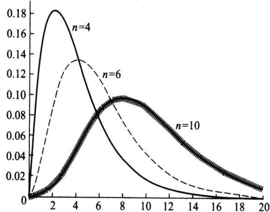
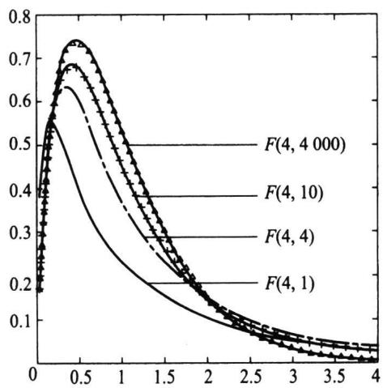
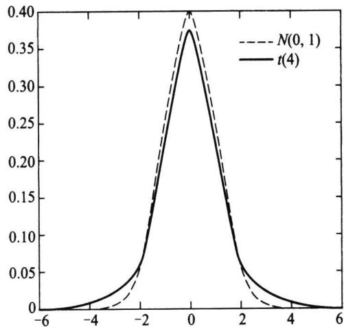

import Guide from '@/components/Guide.astro';
import Knowledge from '@/components/Knowledge.astro';
import Example from '@/components/Example.astro';
import Analysis from '@/components/Analysis.astro';
import Solution from '@/components/Solution.astro';
import Variant from '@/components/Variant.astro';
import Note from '@/components/Note.astro';
import Block from '@/components/Block.astro';
import Method from '@/components/Method.astro';
import Exercise from '@/components/Exercise.astro';

大家很快会看到,有很多统计推断是基于正态分布的假设,以标准正态变量为基石而构造的三个著名统计量在实际中有广泛的应用,这是因为这三个统计量不仅有明确背景,而且其抽样分布的密度函数有显式表达式,它们被称为统计中的“三大抽样分布”.
若设 $x_{1}, x_{2}, \cdots, x_{n}$ 和 $y_{1}, y_{2}, \cdots, y_{m}$ 是来自标准正态分布的两个相互独立的样本，则此三个统计量的构造及其抽样分布如表 5.4.1 所示.
表 5.4.1 三个著名统计量的构造及其抽样分布
<table><tr><td>统计量的构造</td><td>抽样分布密度函数</td><td>期望</td><td>方差</td></tr><tr><td> $\chi^{2} = x_{1}^{2} + x_{2}^{2} + \cdots + x_{n}^{2}$ </td><td> $p(y) = \frac{1}{\Gamma\left(\frac{n}{2}\right) 2^{n/2}} y^{\frac{n}{2}-1} e^{-\frac{y}{2}} (y > 0)$ </td><td> $n$ </td><td> $2n$ </td></tr><tr><td> $F = \frac{(y_{1}^{2} + y_{2}^{2} + \cdots + y_{m}^{2}) / m}{(x_{1}^{2} + x_{2}^{2} + \cdots + x_{n}^{2}) / n}$ </td><td> $p(y) = \frac{\Gamma\left(\frac{m+n}{2}\right)\left(\frac{m}{n}\right)^{m/2}}{\Gamma\left(\frac{m}{2}\right) \Gamma\left(\frac{n}{2}\right)} y^{\frac{m}{2}-1} \cdot \left(1 + \frac{m}{n} y\right)^{-\frac{m+n}{2}} (y > 0)$ </td><td> $\frac{n}{n-2}$ ( $n > 2$ )</td><td> $\frac{2n^{2}(m+n-2)}{m(n-2)^{2}(n-4)}$ ( $n > 4$ )</td></tr><tr><td> $t = \frac{y_{1}}{\sqrt{(x_{1}^{2} + x_{2}^{2} + \cdots + x_{n}^{2}) / n}}$ </td><td> $p(y) = \frac{\Gamma\left(\frac{n+1}{2}\right)}{\sqrt{n\pi} \Gamma\left(\frac{n}{2}\right)} \left(1 + \frac{y^{2}}{n}\right)^{-\frac{n+1}{2}} (-\infty < y < \infty)$ </td><td> $0$ ( $n > 1$ )</td><td> $\frac{n}{n-2}$ ( $n > 2$ )</td></tr></table>
下面我们将对它们逐个进行推导与说明.

## 5.4.1 $\chi^2$ 分布(卡方分布)

<Knowledge title="定义 5.4.1">
设 $X_{1}, X_{2}, \cdots, X_{n}$ 独立同分布于标准正态分布 $N(0,1)$ ，则 $\chi^{2} = X_{1}^{2} + X_{2}^{2} + \cdots + X_{n}^{2}$ 的分布称为自由度为 n 的 $\chi^{2}$ 分布，记为 $\chi^{2} \sim \chi^{2}(n)$ .
在第三章我们已经指出, 若随机变量 $X \sim N(0,1)$ , 则 $X^2 \sim Ga(1/2,1/2)$ , 根据伽马分布的可加性立有 $\chi^2 \sim Ga(n/2,1/2) = \chi^2(n)$ , 由此可见, $\chi^2(n)$ 分布是伽马分布的特例, 故 $\chi^2(n)$ 分布的密度函数为
$$
p (y) = \frac {(1 / 2) ^ {\frac {n}{2}}}{\Gamma (n / 2)} y ^ {\frac {n}{2} - 1} e ^ {- \frac {y}{2}}, \quad y > 0.\tag{5.4.1}
$$
该密度函数的图像是一个只取非负值的偏态分布, 见图 5.4.1, 其期望等于自由度, 方差等于 2 倍自由度, 即 $E(\chi^{2}) = n$ , $\mathrm{Var}(\chi^{2}) = 2n$ .
<figure class="vp-figure">
  
  <figcaption>图5.4.1 $\chi^2 (n)$ 分布的密度函数</figcaption>
</figure>
</Knowledge>

<Example title="例 5.4.1">
设 $x_{1}, x_{2}, \cdots, x_{n}$ 是来自正态分布 $N(\mu, \sigma^{2})$ 的一个样本，其中 $\mu$ 是已知常数，求统计量
$$
T = \sum_ {i = 1} ^ {n} (x _ {i} - \mu) ^ {2}\tag{5.4.2}
$$
的分布.

<Solution title="解">
令 $y_{i}=(x_{i}-\mu)/\sigma,i=1,2,\cdots,n$ ，则 $y_{1},y_{2},\cdots,y_{n}$ 是独立同分布随机变量，其共同分布为 $N(0,1)$ ，于是由定义 5.4.1 知
$$
\frac {T}{\sigma^ {2}} = \sum_ {i = 1} ^ {n} \left(\frac {x _ {i} - \mu}{\sigma}\right) ^ {2} = \sum_ {i = 1} ^ {n} y _ {i} ^ {2} \sim \chi^ {2} (n),
$$
而 $T$ 的密度函数为
$$
p (t) = \frac {1}{(2 \sigma^ {2}) ^ {n / 2} \Gamma (n / 2)} \mathrm{e} ^ {- \frac {t}{2 \sigma^ {2}} t ^ {\frac {n}{2} - 1}}, \quad t > 0,\tag{5.4.3}
$$
这就是伽马分布 $Ga\left(\frac{n}{2}, \frac{1}{2\sigma^2}\right)$ . (5.4.3) 式与 (5.4.1) 式在变量上只相差一个因子 $\sigma^2$ .
$\chi^{2}$ 分布有用的一个重要原因即是下面的定理.
</Solution>
</Example>

<Knowledge title="定理 5.4.1">
设 $x_{1}, x_{2}, \cdots, x_{n}$ 是来自正态总体 $N(\mu, \sigma^{2})$ 的样本，其样本均值和样本方差分别为
$$
\overline {{{x}}} = \frac {1}{n} \sum_ {i = 1} ^ {n} x _ {_ i} \text {和} s ^ {2} = \frac {1}{n - 1} \sum_ {i = 1} ^ {n} \left(x _ {_ i} - \overline {{{x}}}\right) ^ {2},
$$
则有
(1) $\bar{x}$ 与 $s^{2}$ 相互独立；
(2) $\overline{x} \sim N(\mu, \sigma^2 / n)$ ;
(3) $\frac{(n - 1)s^2}{\sigma^2}\sim \chi^2 (n - 1).$

<Solution title="证明">
$x_{1}, x_{2}, \cdots, x_{n}$ 的联合密度函数为
$$
p \left(x _ {1}, x _ {2}, \dots , x _ {n}\right) = \left(2 \pi \sigma^ {2}\right) ^ {- n / 2} \mathrm{e} ^ {- \sum_ {i = 1} ^ {n} \frac {\left(x _ {i} - \mu\right) ^ {2}}{2 \sigma^ {2}}} = \left(2 \pi \sigma^ {2}\right) ^ {- n / 2} \exp \left\{- \frac {\sum_ {i = 1} ^ {n} x _ {i} ^ {2} - 2 n \bar {x} \mu + n \mu^ {2}}{2 \sigma^ {2}} \right\}
$$
记 $X=(x_{1},x_{2},\cdots,x_{n})^{\mathrm{T}}$ ，取一个 n 维正交矩阵 A，其第一行的每一个元素均为 $1/\sqrt{n}$ ，如
$$
\boldsymbol {A} = \left( \begin{array}{c c c c c} \frac {1}{\sqrt {n}} & \frac {1}{\sqrt {n}} & \frac {1}{\sqrt {n}} & \dots & \frac {1}{\sqrt {n}} \\ \frac {1}{\sqrt {2 \cdot 1}} & - \frac {1}{\sqrt {2 \cdot 1}} & 0 & \dots & 0 \\ \frac {1}{\sqrt {3 \cdot 2}} & \frac {1}{\sqrt {3 \cdot 2}} & - \frac {2}{\sqrt {3 \cdot 2}} & \dots & 0 \\ \vdots & \vdots & \vdots & & \vdots \\ \frac {1}{\sqrt {n (n - 1)}} & \frac {1}{\sqrt {n (n - 1)}} & \frac {1}{\sqrt {n (n - 1)}} & \dots & - \frac {n - 1}{\sqrt {n (n - 1)}} \end{array} \right),
$$
令 $Y=(y_{1},y_{2},\cdots,y_{n})^{\mathrm{T}}=AX$ ，则该变换的雅可比(Jacobi)行列式为1，且注意到
$$
\overline {{{x}}} = \frac {1}{\sqrt {n}} y _ {1},
$$
$$
\sum_ {i = 1} ^ {n} y _ {i} ^ {2} = \mathbf {Y} ^ {\mathrm{T}} \mathbf {Y} = \mathbf {X} ^ {\mathrm{T}} \mathbf {A} ^ {\mathrm{T}} \mathbf {A} \mathbf {X} = \sum_ {i = 1} ^ {n} x _ {i} ^ {2},
$$
于是 $y_{1}, y_{2}, \cdots, y_{n}$ 的联合密度函数为
$$
\begin{array}{r l} p (y _ {1}, y _ {2}, \dots , y _ {n}) & = (2 \pi \sigma^ {2}) ^ {- n / 2} \exp \left\{- \frac {\sum_ {i = 1} ^ {n} y _ {i} ^ {2} - 2 \sqrt {n} y _ {1} \mu + n \mu^ {2}}{2 \sigma^ {2}} \right\} \\ & = (2 \pi \sigma^ {2}) ^ {- n / 2} \exp \left\{- \frac {\sum_ {i = 2} ^ {n} y _ {i} ^ {2} + (y _ {1} - \sqrt {n} \mu) ^ {2}}{2 \sigma^ {2}} \right\} \end{array}
$$
由此， $Y=(y_{1},y_{2},\cdots,y_{n})^{\mathrm{T}}$ 的各个分量相互独立，且都服从正态分布，其方差均为 $\sigma^{2}$ ，而均值并不完全相同， $y_{2},\cdots,y_{n}$ 的均值为 0， $y_{1}$ 的均值为 $\sqrt{n}\mu$ ，这就证明了结论 (2).由于
$$
(n - 1) s ^ {2} = \sum_ {i = 1} ^ {n} (x _ {i} - \bar {x}) ^ {2} = \sum_ {i = 1} ^ {n} x _ {i} ^ {2} - (\sqrt {n} \bar {x}) ^ {2} = \sum_ {i = 1} ^ {n} y _ {i} ^ {2} - y _ {1} ^ {2} = \sum_ {i = 2} ^ {n} y _ {i} ^ {2},
$$
这证明了结论(1)，由于 $y_{2},\cdots,y_{n}$ 独立同分布于 $N(0,\sigma^{2})$ ，于是
$$
\frac {(n - 1) s ^ {2}}{\sigma^ {2}} = \sum_ {i = 2} ^ {n} \left(\frac {y _ {i}}{\sigma}\right) ^ {2} \sim \chi^ {2} (n - 1).
$$
定理证明完成.
当随机变量 $\chi^2\sim \chi^2 (n)$ 时，对给定 $\alpha (0 <   \alpha <  1)$ ，称满足概率等式 $P(\chi^2\leqslant \chi_{1 - \alpha}^2 (n)) =$ $1 - \alpha$ 的 $\chi_{1 - \alpha}^2 (n)$ 是自由度为 $n$ 的 $\chi^2$ 分布的 $1 - \alpha$ 分位数.分位数 $\chi_{1 - \alpha}^2 (n)$ 可以从附表3中查到.譬如 $n = 10,\alpha = 0.05$ ，那么从附表3上查得
$$
\chi_ {1 - 0. 0 5} ^ {2} (1 0) = \chi_ {0. 9 5} ^ {2} (1 0) = 1 8. 3 1.
$$
</Solution>
</Knowledge>

## 5.4.2 $F$ 分布

<Knowledge title="定义 5.4.2">
设随机变量 $X_{1} \sim \chi^{2}(m)$ , $X_{2} \sim \chi^{2}(n)$ , $X_{1}$ 与 $X_{2}$ 独立, 则称 $F = \frac{X_{1}/m}{X_{2}/n}$ 的分布是自由度为 m 与 n 的 F 分布, 记为 $F \sim F(m, n)$ , 其中 m 称为分子自由度, n 称为分母自由度.
下面分两步来导出 F 分布的密度函数.
第一步,我们导出 $Z=\frac{X_{1}}{X_{2}}$ 的密度函数,若记 $p_{1}(x)$ 和 $p_{2}(x)$ 分别为 $\chi^{2}(m)$ 和 $\chi^{2}(n)$ 的密度函数,根据独立随机变量商的分布的密度函数的公式(3.3.22),Z 的密度函数为
$$
p _ {z} (z) = \int_ {0} ^ {\infty} x _ {2} p _ {1} (z x _ {2}) p _ {2} (x _ {2}) \mathrm{d} x _ {2}
$$
$$
= \frac {z ^ {\frac {m}{2} - 1}}{\Gamma \left(\frac {m}{2}\right) \Gamma \left(\frac {n}{2}\right) 2 ^ {\frac {m + n}{2}}} \int_ {0} ^ {\infty} x _ {2} ^ {\frac {m + n}{2} - 1} \mathrm{e} ^ {- \frac {x _ {2}}{2} (1 + z)} \mathrm{d} x _ {2},
$$
运用变换 $u = \frac{x_2}{2} (1 + z)$ ，可得
$$
p _ {z} (z) = \frac {z ^ {\frac {m}{2} - 1} (1 + z) ^ {- \frac {m + n}{2}}}{\Gamma \left(\frac {m}{2}\right) \Gamma \left(\frac {n}{2}\right)} \int_ {0} ^ {\infty} u ^ {\frac {m + n}{2} - 1} \mathrm{e} ^ {- u} \mathrm{d} u,
$$
最后的定积分为伽马函数 $\Gamma \left(\frac{m + n}{2}\right)$ ，从而
$$
p _ {Z} (z) = \frac {\Gamma \left(\frac {m + n}{2}\right)}{\Gamma \left(\frac {m}{2}\right) \Gamma \left(\frac {n}{2}\right)} z ^ {\frac {m}{2} - 1} (1 + z) ^ {- \frac {m + n}{2}}, \quad z \geqslant 0.
$$
第二步,我们导出 $F=\frac{n}{m}Z$ 的密度函数,设 F 的取值为 y,对 $y\geqslant0$ ,有
$$
\begin{array}{r l} p _ {F} (y) & = p _ {z} \left(\frac {m}{n} y\right) \cdot \frac {m}{n} = \frac {\Gamma \left(\frac {m + n}{2}\right)}{\Gamma \left(\frac {m}{2}\right) \Gamma \left(\frac {n}{2}\right)} \left(\frac {m}{n} y\right) ^ {- \frac {m}{2} - 1} \left(1 + \frac {m}{n} y\right) ^ {- \frac {m + n}{2}} \cdot \frac {m}{n} \\ & = \frac {\Gamma \left(\frac {m + n}{2}\right) \left(\frac {m}{n}\right) ^ {\frac {m}{2}}}{\Gamma \left(\frac {m}{2}\right) \Gamma \left(\frac {n}{2}\right)} y ^ {\frac {m}{2} - 1} \left(1 + \frac {m}{n} y\right) ^ {- \frac {m + n}{2}}. \end{array}
$$
这就是自由度为 $m$ 与 $n$ 的 $F$ 分布的密度函数.该密度函数的图像是一个只取非负值的偏态分布(见图5.4.2).
<figure class="vp-figure">
  
  <figcaption>图5.4.2 $F$ 分布的密度函数</figcaption>
</figure>
当随机变量 $F \sim F(m, n)$ 时，对给定 $\alpha$ （ $0 < \alpha < 1$ ），称满足概率等式 $P(F \leqslant F_{1 - \alpha}(m, n)) = 1 - \alpha$ 的 $F_{1 - \alpha}(m, n)$ 是自由度为 $m$ 与 $n$ 的 $F$ 分布的 $1 - \alpha$ 分位数.
由 F 分布的构造知, 若 $F \sim F(m, n)$ , 则有 $1/F \sim F(n, m)$ , 故对给定 $\alpha(0 < \alpha < 1)$ ,
$$
\alpha = P \left(\frac {1}{F} \leqslant F _ {\alpha} (n, m)\right) = P \left(F \geqslant \frac {1}{F _ {\alpha} (n , m)}\right).
$$
从而
$$
P \left(F \leqslant \frac {1}{F _ {\alpha} (n , m)}\right) = 1 - \alpha ,
$$
这说明
$$
F _ {\alpha} (n, m) = \frac {1}{F _ {1 - \alpha} (m , n)}.\tag{5.4.4}
$$
对小的 $\alpha$ ，分位数 $F_{1 - \alpha}(m,n)$ 可以从附表5中查到，而分位数 $F_{\alpha}(m,n)$ 则可通过(5.4.4)式得到.
</Knowledge>

<Example title="例 5.4.2">
若取 m=10, n=5, $\alpha=0.05$ , 那么从附表 5 上查得
$$
F _ {1 - 0. 0 5} (1 0, 5) = F _ {0. 9 5} (1 0, 5) = 4. 7 4,
$$
利用(5.4.4)式可得到
$$
F _ {0. 0 5} (1 0, 5) = \frac {1}{F _ {0 . 9 5} (5 , 1 0)} = \frac {1}{3 . 3 3} = 0. 3.
$$
</Example>

<Knowledge title="推论 5.4.1">
设 $x_{1}, x_{2}, \cdots, x_{m}$ 是来自 $N(\mu_{1}, \sigma_{1}^{2})$ 的样本， $y_{1}, y_{2}, \cdots, y_{n}$ 是来自 $N(\mu_{2}, \sigma_{2}^{2})$ 的样本，且此两样本相互独立，记
$$
s _ {x} ^ {2} = \frac {1}{m - 1} \sum_ {i = 1} ^ {m} (x _ {i} - \bar {x}) ^ {2}, \quad s _ {y} ^ {2} = \frac {1}{n - 1} \sum_ {i = 1} ^ {n} (y _ {i} - \bar {y}) ^ {2},
$$
其中
$$
\overline {{{x}}} = \frac {1}{m} \sum_ {i = 1} ^ {m} x _ {i}, \quad \overline {{{y}}} = \frac {1}{n} \sum_ {i = 1} ^ {n} y _ {i},
$$
则有
$$
F = \frac {s _ {x} ^ {2} / \sigma_ {1} ^ {2}}{s _ {y} ^ {2} / \sigma_ {2} ^ {2}} \sim F (m - 1, n - 1).\tag{5.4.5}
$$
特别，若 $\sigma_1^2 = \sigma_2^2$ ，则 $F = s_x^2 /s_y^2\sim F(m - 1,n - 1).$

<Solution title="证明">
由两样本独立可知, $s_{x}^{2}$ 与 $s_{y}^{2}$ 相互独立,由定理5.4.1知,
$$
\frac {(m - 1) s _ {x} ^ {2}}{\sigma_ {1} ^ {2}} \sim \chi^ {2} (m - 1), \quad \frac {(n - 1) s _ {y} ^ {2}}{\sigma_ {2} ^ {2}} \sim \chi^ {2} (n - 1).
$$
由 F 分布定义可知 $F \sim F(m-1, n-1)$ .
</Solution>
</Knowledge>

## 5.4.3 $t$ 分布

<Knowledge title="定义 5.4.3">
设随机变量 $X_{1}$ 与 $X_{2}$ 独立且 $X_{1} \sim N(0,1), X_{2} \sim \chi^{2}(n)$ , 则称 $t = \frac{X_{1}}{\sqrt{X_{2} / n}}$ 的分布为自由度为 $n$ 的 $t$ 分布, 记为 $t \sim t(n)$ .
下面导出 t 分布的密度函数. 由标准正态密度函数的对称性知, $X_{1}$ 与 $-X_{1}$ 有相同分布, 从而 t 与 -t 有相同分布. 这意味着: 对任意正实数 y 有
$$
P (0 <   t <   y) = P (0 <   - t <   y) = P (- y <   t <   0),
$$
于是
$$
P (0 <   t <   y) = \frac {1}{2} P (t ^ {2} <   y ^ {2}).
$$
由 $F$ 变量构造可知, $t^2 = \frac{X_1^2}{X_2 / n} \sim F(1, n)$ , 将上式两边关于 $y$ 求导可得 $t$ 分布的密度函数为
$$
\begin{array}{r l} p _ {i} (y) & = y p _ {F} (y ^ {2}) = \frac {\Gamma \left(\frac {1 + n}{2}\right) \left(\frac {1}{n}\right) ^ {\frac {1}{2}}}{\Gamma \left(\frac {1}{2}\right) \Gamma \left(\frac {n}{2}\right)} (y ^ {2}) ^ {\frac {1}{2} - 1} \left(1 + \frac {1}{n} y ^ {2}\right) ^ {- \frac {1 + n}{2}} y \\ & = \frac {\Gamma \left(\frac {n + 1}{2}\right)}{\sqrt {n \pi} \Gamma \left(\frac {n}{2}\right)} \left(1 + \frac {y ^ {2}}{n}\right) ^ {- \frac {n + 1}{2}}, \quad - \infty <   y <   \infty . \end{array}
$$
这就是自由度为 n 的 t 分布的密度函数.
t 分布的密度函数的图像是一个关于纵轴对称的分布(见图 5.4.3)，与标准正态分布的密度函数形状类似，只是峰比标准正态分布低一些，尾部的概率比标准正态分布的大一些.
<figure class="vp-figure">
  
  <figcaption>图 5.4.3 t 分布与 $N(0,1)$ 的密度函数</figcaption>
</figure>
\- 自由度为 1 的 $t$ 分布就是标准柯西分布, 它的均值不存在.
\- $n > 1$ 时， $t$ 分布的数学期望存在且为0.
\- $n > 2$ 时, $t$ 分布的方差存在, 且为 $n / (n - 2)$ .
\- 当自由度较大(如 $n \geqslant 30$ )时, $t$ 分布可以用 $N(0,1)$ 分布近似.
t 分布是统计学中的一类重要分布, 它与标准正态分布的微小差别是由英国统计学家戈塞特(Gosset)发现的.在1908年以前,统计学的主要用武之地先是社会统计,尤其是人口统计,后来加入生物统计问题.这些问题的特点是,数据一般都是大量的、自然采集的,所用的方法多以中心极限定理为依据,总是归结到正态,K.皮尔逊就是此时统计界的权威,他认为正态分布是上帝赐给人们唯一正确的分布.但到了20世纪,受人工控制的试验条件下所得数据的统计分析问题日渐引人注意.此时的数据量一般不大,故那种仅依赖于中心极限定理的传统方法开始受到质疑.这个方向的先驱就是戈塞特和费希尔.
戈塞特年轻时在牛津大学学习数学和化学,1899年开始在一家酿酒厂担任酿酒化学技师,从事试验和数据分析工作.由于戈塞特接触的样本容量都较小,只有四五个,通过大量试验数据的积累,戈塞特发现 $t=\sqrt{n}(\bar{x}-\mu)/s$ 的分布与传统认为的 $N(0,1)$ 分布并不同,特别是尾部概率相差较大,表5.4.2列出了标准正态分布 $N(0,1)$ 和自由度为4的t分布的一些尾部概率.
表 5.4.2 $N(0,1)$ 和 $t(4)$ 的尾部概率 $P(|X| \geqslant c)$
<table><tr><td></td><td> $c = 2$ </td><td> $c = {2.5}$ </td><td> $c = 3$ </td><td> $c = {3.5}$ </td></tr><tr><td> $X \sim N(0,1)$ </td><td>0.045 5</td><td>0.012 4</td><td>0.002 7</td><td>0.000 465</td></tr><tr><td> $X \sim t(4)$ </td><td>0.116 1</td><td>0.066 8</td><td>0.039 9</td><td>0.024 9</td></tr></table>
由此, 戈塞特怀疑是否有另一个分布族存在, 但他的统计学功底不足以解决他发现的问题, 于是, 戈塞特于 1906 年到 1907 年到 K. 皮尔逊那里学习统计学, 并着重研究少量数据的统计分析问题, 1908 年他在 Biometrics 杂志上以笔名 Student (工厂不允许其发表论文) 发表了使他名垂统计史册的论文: 均值的或然误差. 在这篇文章中, 他提出了如下结果: 设 $x_{1}, x_{2}, \cdots, x_{n}$ 是来自 $N(\mu, \sigma^{2})$ 的独立同分布样本, $\mu, \sigma^{2}$ 均未知, 则 $\frac{\sqrt{n}(\bar{x} - \mu)}{s}$ 服从自由度为 $n - 1$ 的 $t$ 分布. 可以说, $t$ 分布的发现在统计学史上具有划时代的意义, 打破了正态分布一统天下的局面, 开创了小样本统计推断的新纪元, 小样本统计分析由此引起了广大统计科研工作者的重视. 事实上, 戈塞特的证明存在着漏洞, 费希尔注意到这个问题并于 1922 年给出了此问题的完整证明, 并编制了 $t$ 分布的分位数表.
</Knowledge>

<Knowledge title="推论 5.4.2">
设 $x_{1}, x_{2}, \cdots, x_{n}$ 是来自正态分布 $N(\mu, \sigma^{2})$ 的一个样本， $\bar{x}$ 与 $s^{2}$ 分别是该样本的样本均值与样本方差，则有
$$
t = \frac {\sqrt {n} (\bar {x} - \mu)}{s} \sim t (n - 1).\tag{5.4.6}
$$

<Solution title="证明">
由定理5.4.1(2)可以推出
$$
\frac {\bar {x} - \mu}{\sigma / \sqrt {n}} \sim N (0, 1),
$$
将(5.4.6)左端改写为
$$
\frac {\sqrt {n} (\bar {x} - \mu)}{s} = \frac {\frac {\bar {x} - \mu}{\sigma / \sqrt {n}}}{\sqrt {\frac {(n - 1) s ^ {2} / \sigma^ {2}}{n - 1}}}.
$$
由于分子是标准正态变量,分母的根号里是自由度为 n-1 的 $\chi^{2}$ 变量除以它的自由度,且分子与分母相互独立,由 t 分布定义可知 $t \sim t(n-1)$ ,推论证完.
</Solution>
</Knowledge>

<Knowledge title="推论 5.4.3">
在推论 5.4.1 的记号下, 设 $\sigma_{1}^{2} = \sigma_{2}^{2} = \sigma^{2}$ , 并记
$$
s _ {w} ^ {2} = \frac {(m - 1) s _ {x} ^ {2} + (n - 1) s _ {y} ^ {2}}{m + n - 2} = \frac {\sum_ {i = 1} ^ {m} (x _ {i} - \bar {x}) ^ {2} + \sum_ {i = 1} ^ {n} (y _ {i} - \bar {y}) ^ {2}}{m + n - 2},
$$
则
$$
\frac {(\bar {x} - \bar {y}) - (\mu_ {1} - \mu_ {2})}{s _ {w} \sqrt {\frac {1}{m} + \frac {1}{n}}} \sim t (m + n - 2).\tag{5.4.7}
$$

<Solution title="证明">
由 $\overline{x} \sim N(\mu_1, \sigma^2 / m), \overline{y} \sim N(\mu_2, \sigma^2 / n), \overline{x}$ 与 $\overline{y}$ 独立，故有
$$
\overline {{{x}}} - \overline {{{y}}} \sim N \left(\mu_ {1} - \mu_ {2}, \left(\frac {1}{m} + \frac {1}{n}\right) \sigma^ {2}\right),
$$
所以
$$
\frac {(\bar {x} - \bar {y}) - (\mu_ {1} - \mu_ {2})}{\sigma \sqrt {\frac {1}{m} + \frac {1}{n}}} \sim N (0, 1).
$$
</Solution>
</Knowledge>

由定理5.4.1知， $\frac{(m - 1)s_x^2}{\sigma^2}\sim \chi^2 (m - 1),\frac{(n - 1)s_y^2}{\sigma^2}\sim \chi^2 (n - 1)$ ，且它们相互独立，则由可加性知
$$
\frac {(m + n - 2) s _ {w} ^ {2}}{\sigma^ {2}} = \frac {(m - 1) s _ {x} ^ {2} + (n - 1) s _ {y} ^ {2}}{\sigma^ {2}} \sim \chi^ {2} (m + n - 2).
$$
由于 $\bar{x}-\bar{y}$ 与 $s_{w}^{2}$ 相互独立, 根据 t 分布的定义即可得到 (5.4.7) 式.
当随机变量 $t \sim t(n)$ 时，对给定的 $\alpha (0 < \alpha < 1)$ ，称满足概率公式 $P(t \leqslant t_{1 - \alpha}(n)) = 1 - \alpha$ 的 $t_{1 - \alpha}(n)$ 是自由度为 $n$ 的 $t$ 分布的 $1 - \alpha$ 分位数。分位数 $t_{1 - \alpha}(n)$ 可以从附表4中查到。譬如 $n = 10, \alpha = 0.05$ ，那么从附表4上查得 $t_{1 - 0.05}(10) = t_{0.95}(10) = 1.8125$ 。
由于 t 分布的密度函数关于 0 对称, 故其分位数间有如下关系
$$
t _ {\alpha} (n) = - t _ {1 - \alpha} (n).\tag{5.4.8}
$$
譬如， $t_{0.05}(10) = -t_{0.95}(10) = -1.8125.$
当 $n$ 较大时（如 $n \geqslant 30$ ）， $t$ 分布的分位数常可用标准正态分布分位数代替，如 $t_{0.95}(40) = u_{0.95} = 1.645$ .

<Block title="习题5.4">
1. 在总体 $N(7.6,4)$ 中抽取容量为 $n$ 的样本, 如果要求样本均值落在 (5.6,9.6) 内的概率不小于 0.95, 则 $n$ 至少为多少?
2. 设 $x_{1}, x_{2}, \cdots, x_{n}$ 是来自 $N(\mu, 16)$ 的样本，问 n 多大时才能使得 $P(|\bar{x}-\mu|<1) \geqslant 0.95$ 成立？
3. 由正态总体 $N(100,4)$ 抽取两个独立样本，样本均值分别为 $\overline{x},\overline{y}$ ，样本容量分别为 15,20，试求 $P(|\overline{x} -\overline{y}| > 0.2)$ .
4. 由正态总体 $N(\mu, \sigma^2)$ 抽取容量为 20 的样本，试求 $P\left(10\sigma^2 \leqslant \sum_{i=1}^{20}(x_i - \mu)^2 \leqslant 30\sigma^2\right)$ .
5. 设 $x_{1}, x_{2}, \cdots, x_{16}$ 是来自 $N(\mu, \sigma^{2})$ 的样本，经计算 $\bar{x} = 9, s^{2} = 5.32$ ，试求 $P(|\bar{x} - \mu| < 0.6)$ .
6. 设 $x_{1}, x_{2}, \cdots, x_{n}$ 是来自 $N(\mu, 1)$ 的样本，试确定最小的常数 $c$ ，使得对任意的 $\mu \geqslant 0$ ，有 $P(|\overline{x}| < c) \leqslant \alpha$ .
7. 设随机变量 $X \sim F(n, n)$ ，证明 $P(X < 1) = 0.5$ .
8. 设随机变量 $X \sim F(n, m)$ , 证明: $Z = \frac{n}{m} X / \left(1 + \frac{n}{m} X\right)$ 服从贝塔分布, 并指出其参数.
9. 设 $x_{1}, x_{2}$ 是来自 $N(0, \sigma^{2})$ 的样本，试求 $Y = \left(\frac{x_{1} + x_{2}}{x_{1} - x_{2}}\right)^{2}$ 的分布.
10. 设总体为 $N(0,1), x_1, x_2$ 为样本，试求常数 $k$ ，使得
$$
P \left(\frac {\left(x _ {1} + x _ {2}\right) ^ {2}}{\left(x _ {1} - x _ {2}\right) ^ {2} + \left(x _ {1} + x _ {2}\right) ^ {2}} > k\right) = 0. 0 5.
$$
11. 设 $x_{1}, x_{2}, \cdots, x_{n}$ 是来自 $N(\mu_{1}, \sigma^{2})$ 的样本， $y_{1}, y_{2}, \cdots, y_{m}$ 是来自 $N(\mu_{2}, \sigma^{2})$ 的样本，c, d 是任意两个不为 0 的常数，证明：
$$
t = \frac {c (\bar {x} - \mu_ {1}) + d (\bar {y} - \mu_ {2})}{s _ {w} \sqrt {\frac {c ^ {2}}{n} + \frac {d ^ {2}}{m}}} \sim t (n + m - 2),
$$
其中 $s_w^2 = \frac{(n - 1)s_x^2 + (m - 1)s_y^2}{n + m - 2}.$
12. 设 $x_{1}, x_{2}, \cdots, x_{n}, x_{n+1}$ 是来自 $N(\mu, \sigma^{2})$ 的样本， $\overline{x}_{n} = \frac{1}{n} \sum_{i=1}^{n} x_{i}, s_{n}^{2} = \frac{1}{n-1} \sum_{i=1}^{n} (x_{i} - \overline{x}_{n})^{2}$ ，试求常数 c 使得 $t_{c} = c \frac{x_{n+1} - \overline{x}_{n}}{s_{n}}$ 服从 t 分布，并指出分布的自由度.
13. 设从方差相等的两个独立正态总体中分别抽取容量为 15,20 的样本, 其样本方差分别为 $s_1^2$ , $s_2^2$ , 试求 $P(s_1^2 / s_2^2 > 2)$ .
14. 设 $x_{1}, x_{2}, \cdots, x_{15}$ 是总体 $N(0, \sigma^{2})$ 的一个样本，求
$$
y = \frac {x _ {1} ^ {2} + x _ {2} ^ {2} + \cdots + x _ {1 0} ^ {2}}{2 (x _ {1 1} ^ {2} + x _ {1 2} ^ {2} + \cdots + x _ {1 5} ^ {2})}
$$
的分布.
15. 设 $(x_{1}, x_{2}, \cdots, x_{17})$ 是来自正态分布 $N(\mu, \sigma^{2})$ 的一个样本， $\bar{x}$ 与 $s^{2}$ 分别是样本均值与样本方差。求 k，使得 $P(\bar{x} > \mu + ks) = 0.95$ 。
16. 设总体 X 服从 $N(\mu, \sigma^{2})$ , $\sigma^{2} > 0$ , 从该总体中抽取样本 $x_{1}, x_{2}, \cdots, x_{2n} (n \geqslant 1)$ , 其样本均值为 $\overline{x} = \frac{1}{2n} \sum_{i=1}^{2n} x_{i}$ , 求统计量 $y = \sum_{i=1}^{n} (x_{i} + x_{n+i} - 2\overline{x})^{2}$ 的数学期望.
17. 证明: 若随机变量 $t \sim t(k)$ , 则对 $r < k$ 有
$$
E \left(t ^ {r}\right) = \left\{ \begin{array}{l l} 0, & r \text {为奇数}, \\ \frac {k ^ {\frac {r}{2}} \Gamma \left(\frac {r + 1}{2}\right) \Gamma \left(\frac {k - r}{2}\right)}{\sqrt {\pi} \Gamma \left(\frac {k}{2}\right)}, & r \text {为偶数}. \end{array} \right.
$$
并由此写出 $E(t)$ 与 $\mathrm{Var}(t)$ .
18. 证明: 若随机变量 $F \sim F(k, m)$ , 则当 $-\frac{k}{2} < r < \frac{m}{2}$ 时有
$$
E \left(F ^ {r}\right) = \frac {m ^ {r} \Gamma \left(\frac {k}{2} + r\right) \Gamma \left(\frac {m}{2} - r\right)}{k ^ {r} \Gamma \left(\frac {k}{2}\right) \Gamma \left(\frac {m}{2}\right)}.
$$
由此写出 $E(F)$ 与 $\mathrm{Var}(F)$ .
19. 设 $x_{1}, x_{2}, \cdots, x_{n}$ 是来自某连续总体的一个样本. 该总体的分布函数 $F(x)$ 是连续严增函数, 证明: 统计量 $T = -2 \sum_{i=1}^{n} \ln F(x_{i})$ 服从 $\chi^{2}(2n)$ .
20. 设 $x_{1}, x_{2}, \cdots, x_{n}$ 是来自正态总体 $N(\mu, \sigma^{2})$ 的一个样本. $s_{n}^{2} = \frac{1}{n - 1} \sum_{i=1}^{n} (x_{i} - \bar{x})^{2}$ 是样本方差，试求满足 $P\left(\frac{s_{n}^{2}}{\sigma^{2}} \leqslant 1.5\right) \geqslant 0.95$ 的最小 n 值.
21. 设 $x_{1}, x_{2}, \cdots, x_{n}$ 独立同分布服从 $N(\mu, \sigma^{2})$ , $\bar{x} = \frac{1}{n} \sum_{i=1}^{n} x_{i}, s^{2} = \frac{1}{n-1} \sum_{i=1}^{n} (x_{i} - \bar{x})^{2}$ , 记 $\xi = (x_{1} - \bar{x}) / s$ . 试找出 $\xi$ 与 t 分布的联系, 因而定出 $\xi$ 的密度函数 (提示: 作正交变换 $y_{1} = \sqrt{n} \bar{x}, y_{2} = \sqrt{\frac{n}{n-1}} (x_{1} - \bar{x})$ , $y_{i} = \sum_{j=1}^{n} c_{ij} x_{j}, i = 3, \cdots, n$ ).
22. 设 $x_{1}, x_{2}, \cdots, x_{n}$ 相互独立， $x_{i}$ 服从 $\chi^{2}(n_{i}), i=1,2,\cdots,m.$ 令 $U_{1}=\frac{x_{1}}{x_{1}+x_{2}}, U_{2}=\frac{x_{1}+x_{2}}{x_{1}+x_{2}+x_{3}}, \cdots, U_{m-1}=\frac{x_{1}+x_{2}+\cdots+x_{m-1}}{x_{1}+x_{2}+\cdots+x_{m}}.$ 证明： $U_{1}, U_{2}, \cdots, U_{m-1}$ 相互独立，且 $U_{i}$ 服从 $Be\left(\frac{n_{1}+n_{2}+\cdots+n_{i}}{2}, \frac{n_{i+1}}{2}\right), i=1,2,\cdots,m-1$ （提示：令 $U_{m}=x_{1}+x_{2}+\cdots+x_{m}$ ，作变换 $x_{1}=U_{1}U_{2}\cdots U_{m}, x_{2}=U_{2}U_{3}\cdots U_{m}-U_{1}U_{2}\cdots U_{m}, \cdots, x_{m}=U_{m}-U_{m-1}U_{m}$ ）.
</Block>
