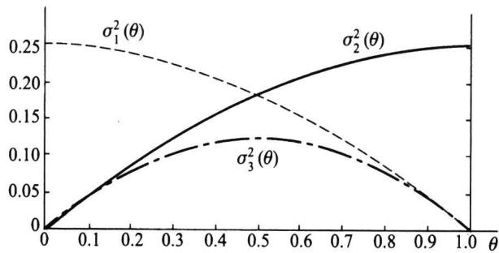

import Example from '@/components/Example.astro';
import Knowledge from '@/components/Knowledge.astro';
import Solution from '@/components/Solution.astro';
import Note from '@/components/Note.astro';
import Block from '@/components/Block.astro';

最大似然估计(MLE)最早是由德国数学家高斯(Gauss)在1821年针对正态分布提出的,但一般将之归功于费希尔,因为费希尔在1922年再次提出了这种想法并证明了它的一些性质而使得最大似然法得到了广泛的应用.本节将给出最大似然估计的定义与计算及求取某些复杂情况下MLE的一种有效算法——EM算法,并介绍最大似然估计的渐近正态性.

## 6.3.1 最大似然估计

为了叙述最大似然原理的直观想法,先看两个例子.

<Example title="例 6.3.1">
设有外形完全相同的两个箱子,甲箱中有 99 个白球和 1 个黑球,乙箱中有 99 个黑球和 1 个白球,今随机地抽取一箱,并从中随机抽取一球,结果取得白球,问这球是从哪一个箱子中取出?

<Solution title="解">
不管是哪一个箱子,从箱子中任取一球都有两个可能的结果: $A$ 表示“取出白球”, $B$ 表示“取出黑球”. 如果我们取出的是甲箱,则 $A$ 发生的概率为0.99,而如果取出的是乙箱,则 $A$ 发生的概率为0.01. 现在一次试验中结果 $A$ 发生了,人们的第一印象就是:“此白球 $(A)$ 最像从甲箱取出的”,或者说,应该认为试验条件对结果 $A$ 出现有利,从而可以推断这球是从甲箱中取出的. 这个推断很符合人们的经验事实,这里“最像”就是“最大似然”之意. 这种想法常称为“最大似然原理”.

本例中假设的数据很极端.一般地,我们可以这样设想:有两个箱子中各有100只球,甲箱中白球的比例是 $p_{1}$ ,乙箱中白球的比例是 $p_{2}$ ,已知 $p_{1}>p_{2}$ ,现随机地抽取一个箱子并从中抽取一球,假定取到的是白球,如果我们要在两个箱子中进行选择,由于甲箱中白球的比例高于乙箱,根据最大似然原理,我们应该推断该球来自甲箱.
</Solution>
</Example>

<Example title="例 6.3.2">
设产品分为合格品与不合格品两类, 我们用一个随机变量 X 来表示某个产品经检查后的不合格品数, 则 X=0 表示合格品, X=1 表示不合格品, 则 X 服从二点分布 $b(1,p)$ , 其中 p 是未知的不合格品率. 现抽取 n 个产品看其是否合格, 得到样本 $x_{1}, x_{2}, \cdots, x_{n}$ , 这批观测值发生的概率为

$$

P (X _ {1} = x _ {1}, X _ {2} = x _ {2}, \dots , X _ {n} = x _ {n}; p) = \prod_ {i = 1} ^ {n} p ^ {x _ {i}} (1 - p) ^ {1 - x _ {i}} = p ^ {\sum_ {i = 1} ^ {n} x _ {i}} (1 - p) ^ {n - \sum_ {i = 1} ^ {n} x _ {i}},\tag{6.3.1}

$$

由于 $p$ 是未知的, 根据最大似然原理, 我们应选择 $p$ 使得 (6.3.1) 表示的概率尽可能大. 将 (6.3.1) 看作未知参数 $p$ 的函数, 用 $L(p)$ 表示, 称作似然函数, 亦即

$$

L (p) = p ^ {\sum_ {i = 1} ^ {n} x _ {i}} (1 - p) ^ {n - \sum_ {i = 1} ^ {n} x _ {i}},\tag{6.3.2}

$$

要求(6.3.2)的最大值点不是难事,将(6.3.2)两端取对数并关于p求导令其为0,即得如下方程,又称似然方程:

$$

\frac {\partial \ln L (p)}{\partial p} = \frac {\sum_ {i = 1} ^ {n} x _ {i}}{p} - \frac {n - \sum_ {i = 1} ^ {n} x _ {i}}{1 - p} = 0.\tag{6.3.3}

$$

<Solution title="解">
之即得 $p$ 的最大似然估计，为

$$

\hat {p} = \hat {p} (x _ {1}, x _ {2}, \dots , x _ {n}) = \sum_ {i = 1} ^ {n} x _ {i} / n = \overline {{{{x}}}}.

$$

由例 6.3.2 我们可以看到求最大似然估计的基本思路. 对离散总体, 设有样本观测值 $x_{1}, x_{2}, \cdots, x_{n}$ , 我们写出该观测值出现的概率, 它一般依赖于某个或某些参数, 用 $\theta$ 表示, 将该概率看成 $\theta$ 的函数, 用 $L(\theta)$ 表示, 又称似然函数, 即

$$

L (\theta) = P (X _ {1} = x _ {1}, X _ {2} = x _ {2}, \dots , X _ {n} = x _ {n}; \theta),

$$

求最大似然估计就是找 $\theta$ 的估计值 $\hat{\theta} = \hat{\theta}(x_{1}, x_{2}, \cdots, x_{n})$ 使得上式的 $L(\theta)$ 达到最大.

对连续总体,样本观测值 $x_{1}, x_{2}, \cdots, x_{n}$ 出现的概率总是为 0 的,但我们可用联合概率密度函数来表示随机变量在观测值附近出现的可能性大小,也将其称为似然函数,由此,我们给出如下定义.
</Solution>
</Example>

<Knowledge title="定义 6.3.1">
设总体的概率函数为 $p(x;\theta)$ , $\theta\in\Theta$ , 其中 $\theta$ 是一个未知参数或几个未知参数组成的参数向量, $\Theta$ 是参数空间, $x_{1}, x_{2}, \cdots, x_{n}$ 是来自该总体的样本, 将样本的联合概率函数看成 $\theta$ 的函数, 用 $L(\theta; x_{1}, x_{2}, \cdots, x_{n})$ 表示, 简记为 $L(\theta)$ ,

$$

L (\theta) = L \left(\theta ; x _ {1}, x _ {2}, \dots , x _ {n}\right) = p \left(x _ {1}; \theta\right) p \left(x _ {2}; \theta\right) \dots p \left(x _ {n}; \theta\right),\tag{6.3.4}

$$

$L(\theta)$ 称为样本的似然函数. 如果某统计量 $\hat{\theta} = \hat{\theta}(x_{1}, x_{2}, \cdots, x_{n})$ 满足

$$

L (\hat {\theta}) = \max _ {\theta \in \Theta} L (\theta),\tag{6.3.5}

$$

则称 $\hat{\theta}$ 是 $\theta$ 的最大似然估计, 简记为 MLE(maximum likelihood estimate).

由于 $\ln x$ 是 $x$ 的单调增函数, 因此, 使对数似然函数 $\ln L(\theta)$ 达到最大与使 $L(\theta)$ 达到最大是等价的. 人们通常更习惯于由 $\ln L(\theta)$ 出发寻找 $\theta$ 的最大似然估计. 当 $L(\theta)$ 是可微函数时, 求导是求最大似然估计最常用的方法, 此时对对数似然函数求导更加简单些.
</Knowledge>

<Note>
,从最大似然估计的定义可以看出,若 $L(\theta)$ 与联合概率函数相差一个与 $\theta$ 无关的比例因子,不会影响最大似然估计,因此,可以在 $L(\theta)$ 中剔去与 $\theta$ 无关的因子.
</Note>

<Example title="例 6.3.3">
(续例 6.2.6) 在例 6.2.6 中我们给出了 $\theta$ 的三个矩估计, 这里考虑 $\theta$ 的最大似然估计. 似然函数为

$$

L (\theta) = \left(\theta^ {2}\right) ^ {n _ {1}} \left[ 2 \theta (1 - \theta) \right] ^ {n _ {2}} \left[ (1 - \theta) ^ {2} \right] ^ {n _ {3}} = 2 ^ {n _ {2}} \theta^ {2 n _ {1} + n _ {2}} (1 - \theta) ^ {2 n _ {3} + n _ {2}},

$$

其对数似然函数为

$$

\ln L (\theta) = (2 n _ {1} + n _ {2}) \ln \theta + (2 n _ {3} + n _ {2}) \ln (1 - \theta) + n _ {2} \ln 2.

$$

将之关于 $\theta$ 求导并令其为0得到似然方程

$$

\frac {2 n _ {1} + n _ {2}}{\theta} - \frac {2 n _ {3} + n _ {2}}{1 - \theta} = 0.

$$

<Solution title="解">
之, 得

$$

\hat {\theta} = \frac {2 n _ {1} + n _ {2}}{2 (n _ {1} + n _ {2} + n _ {3})} = \frac {2 n _ {1} + n _ {2}}{2 n}.

$$

由于

$$

\frac {\partial^ {2} \ln L (\theta)}{\partial \theta^ {2}} = - \frac {2 n _ {1} + n _ {2}}{\theta^ {2}} - \frac {2 n _ {3} + n _ {2}}{(1 - \theta) ^ {2}} <   0,

$$

所以 $\hat{\theta}$ 是极大值点.
</Solution>
</Example>

<Example title="例 6.3.4">
对正态总体 $N(\mu, \sigma^{2}), \theta = (\mu, \sigma^{2})$ 是二维参数，设有样本 $x_{1}, x_{2}, \cdots, x_{n}$ ，则似然函数及其对数分别为

$$

L (\mu , \sigma^ {2}) = \prod_ {i = 1} ^ {n} \left(\frac {1}{\sqrt {2 \pi} \sigma} \exp \left\{- \frac {(x _ {i} - \mu) ^ {2}}{2 \sigma^ {2}} \right\}\right) = (2 \pi \sigma^ {2}) ^ {- n / 2} \exp \left\{- \frac {1}{2 \sigma^ {2}} \sum_ {i = 1} ^ {n} (x _ {i} - \mu) ^ {2} \right\},

$$

$$

\ln L (\mu , \sigma^ {2}) = - \frac {1}{2 \sigma^ {2}} \sum_ {i = 1} ^ {n} (x _ {i} - \mu) ^ {2} - \frac {n}{2} \ln \sigma^ {2} - \frac {n}{2} \ln (2 \pi),

$$

将 $\ln L(\mu, \sigma^2)$ 分别关于两个分量求偏导并令其为0即得到似然方程组

$$

\frac {\partial \ln L (\mu , \sigma^ {2})}{\partial \mu} = \frac {1}{\sigma^ {2}} \sum_ {i = 1} ^ {n} (x _ {i} - \mu) = 0,\tag{6.3.6}

$$

$$

\frac {\partial \ln L (\mu , \sigma^ {2})}{\partial \sigma^ {2}} = \frac {1}{2 \sigma^ {4}} \sum_ {i = 1} ^ {n} (x _ {i} - \mu) ^ {2} - \frac {n}{2 \sigma^ {2}} = 0.

$$

(6.3.7)

<Solution title="解">
此方程组,由(6.3.6)式可得 $\mu$ 的最大似然估计为

$$

\hat {\mu} = \frac {1}{n} \sum_ {i = 1} ^ {n} x _ {i} = \overline {{{x}}},

$$

将之代入(6.3.7)式给出 $\sigma^2$ 的最大似然估计

$$

\hat {\sigma} ^ {2} = \frac {1}{n} \sum_ {i = 1} ^ {n} \left(x _ {i} - \overline {{{x}}}\right) ^ {2} = s _ {n} ^ {2},

$$

利用二阶导函数矩阵的非正定性可以说明上述估计使得似然函数取极大值.

虽然求导函数是求最大似然估计最常用的方法,但并不是在所有场合求导都是有效的,下面的例子说明了这个问题.
</Solution>
</Example>

<Example title="例 6.3.5">
设 $x_{1}, x_{2}, \cdots, x_{n}$ 是来自均匀总体 $U(0, \theta)$ 的样本，试求 $\theta$ 的最大似然估计.

<Solution title="解">
似然函数

$$

L (\theta) = \frac {1}{\theta^ {n}} \prod_ {i = 1} ^ {n} I _ {\{0 <   x _ {i} \leqslant \theta \}} = \frac {1}{\theta^ {n}} I _ {\{x _ {(n)} \leqslant \theta \}},

$$

要使 $L(\theta)$ 达到最大, 首先一点是示性函数取值应该为 1 , 其次是 $1 / \theta^n$ 尽可能大. 由于 $1 / \theta^n$ 是 $\theta$ 的单调减函数, 所以 $\theta$ 的取值应尽可能小, 但示性函数为 1 决定了 $\theta$ 不能小于 $x_{(n)}$ , 由此给出 $\theta$ 的最大似然估计 $\hat{\theta} = x_{(n)}$ .

最大似然估计有一个简单而有用的性质: 如果 $\hat{\theta}$ 是 $\theta$ 的最大似然估计, 则对任一函数 $g(\theta)$ , $g(\hat{\theta})$ 是其最大似然估计. 该性质称为最大似然估计的不变性, 从而使一些复杂结构的参数的最大似然估计的获得变得容易了.
</Solution>
</Example>

<Example title="例 6.3.6">
设 $x_{1}, x_{2}, \cdots, x_{n}$ 是来自正态总体 $N(\mu, \sigma^{2})$ 的样本，在例 6.3.4 中已求得 $\mu$ 和 $\sigma^{2}$ 的最大似然估计为

$$

\hat {\mu} = \bar {x}, \quad \hat {\sigma} ^ {2} = s _ {n} ^ {2}.

$$

于是由最大似然估计的不变性可得如下参数的最大似然估计,它们是

\- 标准差 $\sigma$ 的 MLE 是 $\hat{\sigma} = s_n$ .

\- 概率 $P(X < 3) = \Phi\left(\frac{3 - \mu}{\sigma}\right)$ 的MLE是 $\Phi\left(\frac{3 - \bar{x}}{s_n}\right)$ .

\- 总体 0.90 分位数 $x_{0.90} = \mu + \sigma u_{0.90}$ 的 MLE 是 $\overline{x} + s_n u_{0.90}$ , 其中 $u_{0.90}$ 为标准正态分布的 0.90 分位数.
</Example>

## 6.3.2 EM算法

MLE 是一种非常有效的参数估计方法,但当分布中有多余参数或数据为截尾或缺失时,其 MLE 的求取是比较困难的. Dempster 等人于 1977 年提出了 EM 算法,其出发点是把求 MLE 的过程分两步走,第一步求期望,以便把多余的部分去掉,第二步求极大值.本小节将简单介绍这种非常有用的方法.

<Example title="例 6.3.7">
设一次试验可能有四个结果, 其发生的概率分别为 $\frac{1}{2}-\frac{\theta}{4}, \frac{1-\theta}{4}, \frac{1+\theta}{4}, \frac{\theta}{4}$ , 其中 $\theta \in (0,1)$ , 现进行了 197 次试验, 四种结果的发生次数分别为 75, 18, 70, 34. 试求 $\theta$ 的 MLE.

<Solution title="解">
以 $y_{1}, y_{2}, y_{3}, y_{4}$ 表示四种结果发生的次数, 此时总体分布为多项分布, 故其似然函数

$$

L (\theta ; y) \propto \left(\frac {1}{2} - \frac {\theta}{4}\right) ^ {y _ {1}} \left(\frac {1 - \theta}{4}\right) ^ {y _ {2}} \left(\frac {1 + \theta}{4}\right) ^ {y _ {3}} \left(\frac {\theta}{4}\right) ^ {y _ {4}} \propto (2 - \theta) ^ {y _ {1}} (1 - \theta) ^ {y _ {2}} (1 + \theta) ^ {y _ {3}} \theta^ {y _ {4}}.

$$

要由此式求解 $\theta$ 的 MLE 是比较麻烦的,由于其对数似然方程是一个三次多项式.

我们可以通过引入2个变量 $z_{1}, z_{2}$ 后，使得求解变得比较容易。现假设第一种结果可以分成两部分，其发生概率分别为 $\frac{1 - \theta}{4}$ 和 $\frac{1}{4}$ ，令 $z_{1}$ 和 $y_{1} - z_{1}$ 分别表示落入这两部分的次数;再假设第三种结果分成两部分,其发生概率分别为 $\frac{\theta}{4}$ 和 $\frac{1}{4}$ ,令 $z_{2}$ 和 $y_{3}-z_{2}$ 分别表示落入这两部分的次数.显然, $z_{1},z_{2}$ 是我们人为引入的,它是不可观测的(在文献中称之为latent variable,即潜变量).也称数据(y,z)为完全数据(complete data),而观测到的数据y称为不完全数据.此时,完全数据的似然函数

$$

L (\theta ; y, z) \propto \left(\frac {1}{4}\right) ^ {y _ {1} - z _ {1}} \left(\frac {1 - \theta}{4}\right) ^ {z _ {1} + y _ {2}} \left(\frac {1}{4}\right) ^ {y _ {3} - z _ {2}} \left(\frac {\theta}{4}\right) ^ {z _ {2} + y _ {4}} \propto \theta^ {z _ {2} + y _ {4}} (1 - \theta) ^ {z _ {1} + y _ {2}},

$$

其对数似然为

$$

l (\theta ; y, z) = (z _ {2} + y _ {4}) \ln \theta + (z _ {1} + y _ {2}) \ln (1 - \theta).

$$

如果 $(y, z)$ 均已知，则由上式很容易求得 $\theta$ 的 MLE，但遗憾的是，我们仅知道 $y$ ，而不知道 $z$ 的值。但是我们注意到，当 $y$ 及 $\theta$ 已知时， $z_1 \sim b\left(y_1, \frac{1 - \theta}{2 - \theta}\right), z_2 \sim b\left(y_3, \frac{\theta}{1 + \theta}\right)$ ，于是，Dempster 等人建议分如下两步进行迭代求解：

E 步: 在已有观测数据 y 及第 i 步估计值 $\theta = \theta^{(i)}$ 的条件下, 求基于完全数据的对数似然函数的期望 (即把其中与 z 有关的部分积分掉):

$$

Q (\theta | y, \theta^ {(i)}) = E _ {z} l (\theta ; y, z).\tag{6.3.8}

$$

M 步: 求 $Q(\theta \mid y, \theta^{(i)})$ 关于 $\theta$ 的最大值 $\theta^{(i+1)}$ ，即找 $\theta^{(i+1)}$ 使得

$$

Q \left(\theta^ {(i + 1)} \mid y, \theta^ {(i)}\right) = \max _ {\theta} Q \left(\theta \mid y, \theta^ {(i)}\right).\tag{6.3.9}

$$

这样就完成了由 $\theta^{(i)}$ 到 $\theta^{(i + 1)}$ 的一次迭代.重复(6.3.8)和(6.3.9)式，直至收敛即可得到 $\theta$ 的MLE.

对于本例,其 E 步为:

$$

\begin{array}{r l} Q (\theta | y, \theta^ {(i)}) & = (E (z _ {2} | y, \theta^ {(i)}) + y _ {4}) \ln \theta + (E (z _ {1} | y, \theta^ {(i)}) + y _ {2}) \ln (1 - \theta) \\ & = \left(\frac {\theta^ {(i)}}{1 + \theta^ {(i)}} y _ {3} + y _ {4}\right) \ln \theta + \left(\frac {1 - \theta^ {(i)}}{2 - \theta^ {(i)}} y _ {1} + y _ {2}\right) \ln (1 - \theta). \end{array}

$$

其 M 步即为上式关于 $\theta$ 求导, 并令其等于 0, 即

$$

\frac {\frac {\theta^ {(i)}}{1 + \theta^ {(i)}} y _ {3} + y _ {4}}{\theta^ {(i + 1)}} - \frac {\frac {1 - \theta^ {(i)}}{2 - \theta^ {(i)}} y _ {1} + y _ {2}}{1 - \theta^ {(i + 1)}} = 0,

$$

之,得如下迭代公式:

$$

\theta^ {(i + 1)} = \frac {\frac {\theta^ {(i)}}{1 + \theta^ {(i)}} y _ {3} + y _ {4}}{\frac {\theta^ {(i)}}{1 + \theta^ {(i)}} y _ {3} + y _ {4} + \frac {1 - \theta^ {(i)}}{2 - \theta^ {(i)}} y _ {1} + y _ {2}},

$$

开始时可取任意一个初值进行迭代.如取 $\theta^{(0)} = 0.5$ ，则13次迭代后可求得 $\theta$ 的MLE为0.606747，迭代过程如下表：

<table><tr><td>序号i</td><td> $\theta^{(i)}$ </td><td> $\frac{\theta^{(i)}}{1+\theta^{(i)}}y_3+y_4$ </td><td> $\frac{1-\theta^{(i)}}{2-\theta^{(i)}}y_1+y_2$ </td><td> $\theta^{(i+1)}$ </td></tr><tr><td>0</td><td>0.5</td><td>57.333 333</td><td>43.000 000</td><td>0.571 429</td></tr><tr><td>1</td><td>0.571 429</td><td>59.454 545</td><td>40.500 000</td><td>0.594 816</td></tr><tr><td>2</td><td>0.594 816</td><td>60.107 784</td><td>39.626 214</td><td>0.602 681</td></tr><tr><td>3</td><td>0.602 681</td><td>60.323 186</td><td>39.325 786</td><td>0.605 357</td></tr><tr><td>4</td><td>0.605 357</td><td>60.395 987</td><td>39.222 803</td><td>0.606 271</td></tr><tr><td>5</td><td>0.606 271</td><td>60.420 804</td><td>39.187 529</td><td>0.606 584</td></tr><tr><td>6</td><td>0.606 584</td><td>60.429 289</td><td>39.175 449</td><td>0.606 691</td></tr><tr><td>7</td><td>0.606 691</td><td>60.432 193</td><td>39.171 312</td><td>0.606 728</td></tr><tr><td>8</td><td>0.606 728</td><td>60.433 187</td><td>39.169 896</td><td>0.606 740</td></tr><tr><td>9</td><td>0.606 740</td><td>60.433 527</td><td>39.169 411</td><td>0.606 744</td></tr><tr><td>10</td><td>0.606 744</td><td>60.433 644</td><td>39.169 245</td><td>0.606 746</td></tr><tr><td>11</td><td>0.606 746</td><td>60.433 684</td><td>39.169 188</td><td>0.606 746</td></tr><tr><td>12</td><td>0.606 746</td><td>60.433 697</td><td>39.169 168</td><td>0.606 747</td></tr><tr><td>13</td><td>0.606 747</td><td>60.433 702</td><td>39.169 162</td><td>0.606 747</td></tr></table>

说明:(1) 我们以 $z_{1}$ 为例说明它的分布. 以 $A_{1}$ 表示第一种结果出现, $B_{1}, B_{2}$ 分别表示我们所定义的两个事件, $A_{1} = B_{1} \cup B_{2}$ . 由定义知它们是独立的, 且 $P(A_{1}) = \frac{1}{2} - \frac{\theta}{4}$ , $P(B_{1}) = \frac{1 - \theta}{4}$ , $P(B_{2}) = \frac{1}{4}$ , 故 $P(B_{1} \mid A_{1}) = \frac{P(B_{1})}{P(A_{1})} = \frac{1 - \theta}{2 - \theta}$ , 从而在 $Y_{1} = y_{1}$ 的条件下, $z_{1} \sim b(y_{1}, \frac{1 - \theta}{2 - \theta})$ .

(2) (6.3.8)式右边的期望是关于 $Z$ 在 $\theta = \theta^{(i)}$ 的条件下求取的, 而其余的参数不变, 故左边与 $\theta^{(i)}$ 有关.

(3) 在很一般的条件下, EM 算法是收敛的, 参见文献 [22].
</Solution>
</Example>

## 6.3.3 渐近正态性

最大似然估计有一个良好的性质:它通常具有渐近正态性.

<Knowledge title="定义 6.3.2">
参数 $\theta$ 的相合估计 $\hat{\theta}_{n}$ 称为渐近正态的, 若存在趋于 0 的非负常数序列 $\sigma_{n}(\theta)$ , 使得 $\frac{\hat{\theta}_{n}-\theta}{\sigma_{n}(\theta)}$ 依分布收敛于标准正态分布. 这时也称 $\hat{\theta}_{n}$ 服从渐近正态分布 $N(\theta,\sigma_{n}^{2}(\theta))$ , 记为 $\hat{\theta}_{n}\sim AN(\theta,\sigma_{n}^{2}(\theta)).\sigma_{n}^{2}(\theta)$ 称为 $\hat{\theta}_{n}$ 的渐近方差.

上述定义中趋于0的数列 $\sigma_{n}(\theta)$ 表示着估计量 $\hat{\theta}_{n}$ 依概率收敛于 $\theta$ 的速度.因为只有当“ $\sigma_{n}(\theta)$ 趋于 0 的速度”与“ $\hat{\theta}_{n}$ 依概率收敛于 $\theta$ 的速度”相当（即同阶），其比值 $(\hat{\theta}_{n}-\theta)/\sigma_{n}(\theta)$ 的分布才可能稳定地收敛于标准正态分布 $N(0,1)$ . 倘若 $\sigma_{n}(\theta)$ 趋于 0 的速度过快，则其比值会趋于 $\infty$ ；倘若 $\sigma_{n}(\theta)$ 趋于 0 的速度过慢，则其比值会趋于 0；只有当 $\sigma_{n}(\theta)$ 趋于 0 的速度不快不慢时，其比值才可能按分布收敛于 $N(0,1)$ . 所以 $\sigma_{n}(\theta)$ 趋于 0 的速度就是 $\hat{\theta}_{n}$ 依概率收敛于 $\theta$ 的速度. 故把 $\sigma_{n}^{2}(\theta)$ 称为渐近方差是适当的.
</Knowledge>

<Example title="例 6.3.8">
设总体为泊松分布 $P(\lambda)$ ，无论是矩估计还是最大似然估计，我们都得到一样的 $\lambda$ 的估计：样本均值，即

$$

\hat {\lambda} _ {n} = \overline {{{x}}} _ {n} = \frac {1}{n} \sum_ {i = 1} ^ {n} x _ {i}.

$$

由中心极限定理， $(\hat{\lambda}_n - \lambda) / \sqrt{\lambda / n}$ 依分布收敛于 $N(0,1)$ ，因此， $\hat{\lambda}_n$ 是渐近正态的，且

$$

\hat {\lambda} _ {n} \sim A N (\lambda , \lambda / n),

$$

这里常数序列 $\sigma_{n}(\lambda)=\sqrt{\lambda/n}\rightarrow0.$ 它表示 $\hat{\lambda}_{n}$ 依概率收敛于 $\lambda$ 的速度为 $1/\sqrt{n}$ ，以后会看到，大多数渐近正态估计都是以 $1/\sqrt{n}$ 速度依概率收敛于被估参数.

关于渐近正态性的详细的讨论超出本课程范围,我们主要指出两点:其一是不加证明地给出关于最大似然估计的渐近正态性的结论,其二说明渐近正态性常被用来对不同的相合估计进行比较,主要比较其渐近方差大小.
</Example>

<Knowledge title="定理 6.3.1">
设总体 X 有密度函数 $p(x;\theta)$ , $\theta \in \Theta$ , $\Theta$ 为非退化区间, 假定

（1）对任意的 $x$ ，偏导数 $\frac{\partial\ln p}{\partial\theta},\frac{\partial^2\ln p}{\partial\theta^2}$ 和 $\frac{\partial^3\ln p}{\partial\theta^3}$ 对所有 $\theta \in \Theta$ 都存在；

(2) $\forall \theta \in \Theta$ ，有

$$

\left| \frac {\partial p}{\partial \theta} \right| <   F _ {1} (x), \quad \left| \frac {\partial^ {2} p}{\partial \theta^ {2}} \right| <   F _ {2} (x), \quad \left| \frac {\partial^ {3} \ln p}{\partial \theta^ {3}} \right| <   F _ {3} (x),

$$

其中函数 $F_{1}(x), F_{2}(x), F_{3}(x)$ 满足

$$

\int_ {- \infty} ^ {\infty} F _ {1} (x) \mathrm{d} x <   \infty , \quad \int_ {- \infty} ^ {\infty} F _ {2} (x) \mathrm{d} x <   \infty ,

$$

$$

\sup _ {\theta \in \Theta} \int_ {- \infty} ^ {\infty} F _ {3} (x) p (x; \theta) \mathrm{d} x <   \infty ;

$$

$$

(3) \forall \theta \in \Theta , 0 <   I (\theta) \equiv \int_ {- \infty} ^ {\infty} \left(\frac {\partial \ln p}{\partial \theta}\right) ^ {2} p (x; \theta) \mathrm{d} x <   \infty .

$$

若 $x_{1}, x_{2}, \cdots, x_{n}$ 是来自该总体的样本，则存在未知参数 $\theta$ 的最大似然估计 $\hat{\theta}_{n} = \hat{\theta}_{n}(x_{1}, x_{2}, \cdots, x_{n})$ ，且 $\hat{\theta}_{n}$ 具有相合性和渐近正态性， $\hat{\theta}_{n} \sim AN\left(\theta, \frac{1}{nI(\theta)}\right)$ .
</Knowledge>

<Knowledge title="定理 6.3.1">
表明, 最大似然估计通常是渐近正态的, 且其渐近方差 $\sigma_{n}^{2}(\theta)=(nI(\theta))^{-1}$ 有一个统一的形式, 其中 $I(\theta)$ 称为费希尔信息量. 它的具体定义在下节给出. 这里只要求按总体分布 $p(x;\theta)$ 去计算费希尔信息量和渐近方差即可.
</Knowledge>

<Example title="例 6.3.9">
设 $x_{1}, x_{2}, \cdots, x_{n}$ 是来自 $N(\mu, \sigma^{2})$ 的样本，可以验证该总体分布在 $\sigma^{2}$ 已知或 $\mu$ 已知时均满足定理 6.3.1 的三个条件.

（1）在 $\sigma^2$ 已知时， $\mu$ 的MLE为 $\hat{\mu} = \bar{x}$ ，由定理6.3.1知， $\hat{\mu}$ 服从渐近正态分布，下面求 $I(\mu)$ ，

$$

\ln p (x) = - \ln \sqrt {2 \pi} - \frac {1}{2} \ln \sigma^ {2} - \frac {(x - \mu) ^ {2}}{2 \sigma^ {2}},

$$

$$

\frac {\partial \ln p}{\partial \mu} = \frac {x - \mu}{\sigma^ {2}},

$$

$$

I (\mu) = E \left(\frac {x - \mu}{\sigma^ {2}}\right) ^ {2} = \frac {1}{\sigma^ {2}}.

$$

从而有 $\hat{\mu}\sim AN(\mu,\sigma^{2}/n)$ ，这与 $\mu$ 的精确分布相同.

(2) 在 $\mu$ 已知时, $\sigma^{2}$ 的 MLE 为 $\hat{\sigma}^{2}=\frac{1}{n}\sum_{i=1}^{n}(x_{i}-\mu)^{2}$ , 下求 $I(\sigma^{2})$ ,

$$

\frac {\partial \ln p}{\partial \sigma^ {2}} = - \frac {1}{2 \sigma^ {2}} + \frac {1}{2 \sigma^ {4}} (x - \mu) ^ {2} = \frac {(x - \mu) ^ {2} - \sigma^ {2}}{2 \sigma^ {4}},

$$

$$

I (\sigma^ {2}) = \frac {E [ (x - \mu) ^ {2} - \sigma^ {2} ] ^ {2}}{4 \sigma^ {8}} = \frac {\mathrm{Var} ((x - \mu) ^ {2})}{4 \sigma^ {8}} = \frac {1}{2 \sigma^ {4}},

$$

从而有 $\hat{\sigma}^{2}\sim AN(\sigma^{2},2\sigma^{4}/n)$ .

在有多个相合估计时,常用其渐近正态分布的方差比较好坏.
</Example>

<Example title="例 6.3.10">
(续例 6.2.6) 在那里我们给出 $\theta$ 的三种不同的相合估计, 它们分别是:

$$

\hat {\theta} _ {1} = \sqrt {n _ {1} / n}, \quad \hat {\theta} _ {2} = 1 - \sqrt {n _ {3} / n}, \quad \hat {\theta} _ {3} = (n _ {1} + n _ {2} / 2) / n,

$$

可以证明它们都是渐近正态估计,即

$$

\frac {\sqrt {n} (\hat {\theta} _ {i} - \theta)}{\sigma_ {i} (\theta)} \sim A N (0, 1), \quad i = 1, 2, 3.

$$

诸 $\sigma_{i}^{2}(\theta)$ 分别为（见[15]）

$$

\sigma_ {1} ^ {2} (\theta) = \frac {1 - \theta^ {2}}{4}, \quad \sigma_ {2} ^ {2} (\theta) = \frac {1 - (1 - \theta) ^ {2}}{4}, \quad \sigma_ {3} ^ {2} (\theta) = \frac {\theta (1 - \theta)}{2},

$$

比较三个渐近方差可以知道(见图6.3.1)，前两个估计各有优劣，而第三个估计一致好于前两个估计，而第三个估计正是最大似然估计.

  

图6.3.1 三个相合估计的渐近方差的比较
</Example>

<Block title="习题6.3">
1. 设总体概率函数如下, $x_{1}, x_{2}, \cdots, x_{n}$ 是样本, 试求未知参数的最大似然估计.

(1) $p(x;\theta) = \sqrt{\theta} x^{\sqrt{\theta} - 1},0 <   x <   1,\theta >0;$

(2) $p(x;\theta) = \theta c^{\theta}x^{-(\theta +1)}, x > c, c > 0$ 已知， $\theta > 1$ .

2. 设总体概率函数如下, $x_{1}, x_{2}, \cdots, x_{n}$ 是样本, 试求未知参数的最大似然估计.

(1) $p(x;\theta) = c\theta^{c}x^{-(c + 1)},x > \theta ,\theta >0,c > 0$ 已知；

(2) $p(x;\theta ,\mu) = \frac{1}{\theta}\mathrm{e}^{-\frac{x - \mu}{\theta}},x > \mu ,\theta >0;$

(3) $p(x;\theta) = (k\theta)^{-1},\theta < x < (k + 1)\theta ,\theta >0,k > 0$ 已知.

3. 设总体概率函数如下, $x_{1}, x_{2}, \cdots, x_{n}$ 是样本, 试求未知参数的最大似然估计.

(1) $p(x;\theta) = \frac{1}{2\theta}\mathrm{e}^{-|x| / \theta},\theta >0;$

(2) $p(x;\theta) = 1, \theta - 1 / 2 < x < \theta + 1 / 2$ ;

(3) $p(x; \theta_1, \theta_2) = \frac{1}{\theta_2 - \theta_1}, \theta_1 < x < \theta_2.$

4. 一地质学家为研究密歇根湖的湖滩地区的岩石成分, 随机地自该地区取 100 个样品, 每个样品有 10 块石子, 记录了每个样品中属石灰石的石子数. 假设这 100 次观察相互独立, 求这地区石子中石灰石的比例 $p$ 的最大似然估计. 该地质学家所得的数据如下:

<table><tr><td>样本中的石子数</td><td>0</td><td>1</td><td>2</td><td>3</td><td>4</td><td>5</td><td>6</td><td>7</td><td>8</td><td>9</td><td>10</td></tr><tr><td>样品个数</td><td>0</td><td>1</td><td>6</td><td>7</td><td>23</td><td>26</td><td>21</td><td>12</td><td>3</td><td>1</td><td>0</td></tr></table>

5. 在遗传学研究中经常要从截尾二项分布中抽样, 其总体概率函数为

$$

P (X = k; p) = \frac {\binom {m} {k} p ^ {k} (1 - p) ^ {m - k}}{1 - (1 - p) ^ {m}}, \quad k = 1, 2, \dots , m.

$$

若已知 $m=2, x_{1}, x_{2}, \cdots, x_{n}$ 是样本，试求 p 的最大似然估计.

6. 已知在文学家萧伯纳的“The Intelligent Woman’s Guide to Socialism and Capitalism”一书中，一个句子的单词数 $X$ 近似地服从对数正态分布，即 $Z = \ln X \sim N(\mu, \sigma^2)$ . 今从该书中随机地取 20 个句子，这些句子中的单词数分别为

<table><tr><td>52</td><td>24</td><td>15</td><td>67</td><td>15</td><td>22</td><td>63</td><td>26</td><td>16</td><td>32</td></tr><tr><td>7</td><td>33</td><td>28</td><td>14</td><td>7</td><td>29</td><td>10</td><td>6</td><td>59</td><td>30</td></tr></table>

求该书中一个句子单词数均值 $E(X) = \mathrm{e}^{\mu +\sigma^2 /2}$ 的最大似然估计.

7. 设总体 $X \sim U(\theta, 2\theta)$ ，其中 $\theta > 0$ 是未知参数， $x_{1}, x_{2}, \cdots, x_{n}$ 为取自该总体的样本， $\bar{x}$ 为样本均值.

(1) 证明 $\hat{\theta}=\frac{2}{3}\bar{x}$ 是参数 $\theta$ 的无偏估计和相合估计；

(2) 求 $\theta$ 的最大似然估计, 它是无偏估计吗? 是相合估计吗?

8. 设 $x_{1}, x_{2}, \cdots, x_{n}$ 是来自密度函数为 $p(x; \theta) = e^{-(x - \theta)}$ , $x > \theta$ 的总体的样本.

(1) 求 $\theta$ 的最大似然估计 $\hat{\theta}_{1}$ ，它是否是相合估计？是否是无偏估计？

(2) 求 $\theta$ 的矩估计 $\hat{\theta}_{2}$ ，它是否是相合估计？是否是无偏估计？

9. 为了估计湖中有多少条鱼,从中捞出 1000 条,标上记号后放回湖中,然后再捞出 150 条鱼发现其中有 10 条鱼有记号.问湖中有多少条鱼,才能使 150 条鱼中出现 10 条带记号的鱼的概率最大?

10. 证明: 对正态分布 $N(\mu, \sigma^2)$ , 若只有一个观测值, 则 $\mu, \sigma^2$ 的最大似然估计不存在.
</Block>
