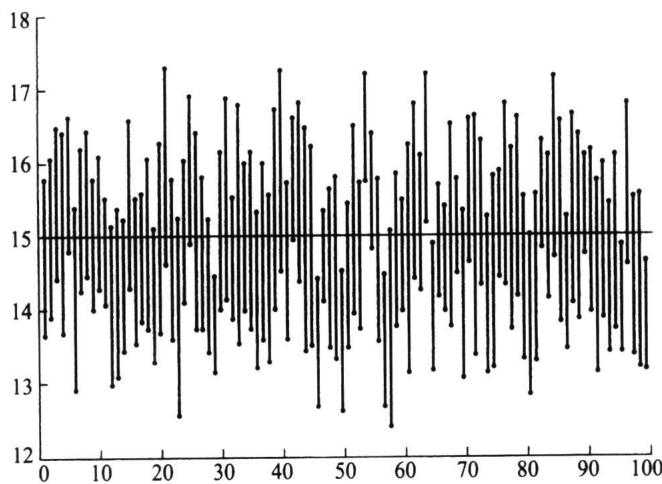
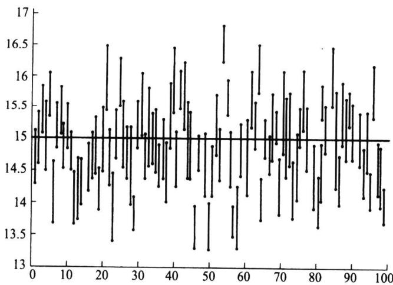
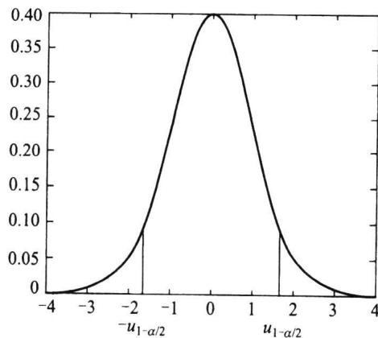
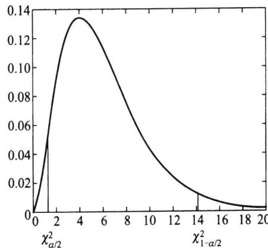
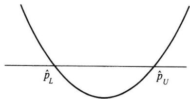

import Example from '@/components/Example.astro';
import Knowledge from '@/components/Knowledge.astro';
import Solution from '@/components/Solution.astro';
import Note from '@/components/Note.astro';
import Block from '@/components/Block.astro';

参数的点估计给出了一个具体的数值,便于计算和使用,但其精度如何,点估计本身不能回答,需要由其分布来反映.实际中,度量一个点估计的精度的最直观的方法就是给出未知参数的一个区间,这便产生区间估计的概念.

## 6.6.1 区间估计的概念

设 $\theta$ 是总体的一个参数, $x_{1}, x_{2}, \cdots, x_{n}$ 是样本, 所谓区间估计就是要找两个统计量 $\hat{\theta}_{L} = \hat{\theta}_{L}(x_{1}, x_{2}, \cdots, x_{n})$ 和 $\hat{\theta}_{U} = \hat{\theta}_{U}(x_{1}, x_{2}, \cdots, x_{n})$ , 使得 $\hat{\theta}_{L} < \hat{\theta}_{U}$ , 在得到样本观测值之后, 就把 $\theta$ 估计在区间 $[\hat{\theta}_{L}, \hat{\theta}_{U}]$ 内. 由于样本的随机性, 区间 $[\hat{\theta}_{L}, \hat{\theta}_{U}]$ 盖住未知参数 $\theta$ 的可能性并不确定, 人们通常要求区间 $[\hat{\theta}_{L}, \hat{\theta}_{U}]$ 盖住 $\theta$ 的概率 $P(\hat{\theta}_{L} \leqslant \theta \leqslant \hat{\theta}_{U})$ 尽可能大, 但这必然导致区间长度增大, 为解决此矛盾, 把区间 $[\hat{\theta}_{L}, \hat{\theta}_{U}]$ 盖住 $\theta$ 的概率 (以后称为置信水平) 事先给定, 这就引入如下置信区间的概念.

<Knowledge title="定义 6.6.1">
设 $\theta$ 是总体的一个参数, 其参数空间为 $\Theta, x_{1}, x_{2}, \cdots, x_{n}$ 是来自该总体的样本, 对给定的一个 $\alpha (0 < \alpha < 1)$ , 假设有两个统计量 $\hat{\theta}_{L} = \hat{\theta}_{L}(x_{1}, x_{2}, \cdots, x_{n})$ 和 $\hat{\theta}_{U} = \hat{\theta}_{U}(x_{1}, x_{2}, \cdots, x_{n})$ , 若对任意的 $\theta \in \Theta$ , 有

$$

P _ {\theta} (\hat {\theta} _ {L} \leqslant \theta \leqslant \hat {\theta} _ {U}) \geqslant 1 - \alpha ,\tag{6.6.1}

$$

则称随机区间 $[\hat{\theta}_L, \hat{\theta}_U]$ 为 $\theta$ 的置信水平为 $1 - \alpha$ 的置信区间，或简称 $[\hat{\theta}_L, \hat{\theta}_U]$ 是 $\theta$ 的 $1 - \alpha$ 置信区间， $\hat{\theta}_L$ 和 $\hat{\theta}_U$ 分别称为 $\theta$ 的（双侧）置信下限和置信上限.

置信水平 $1 - \alpha$ 有一个频率解释: 在大量重复使用 $\theta$ 的置信区间 $[\hat{\theta}_L, \hat{\theta}_U]$ 时, 每次得到的样本观测值是不同的, 从而每次得到的区间也是不一样的. 对一次具体的观测值而言, $\theta$ 可能在 $[\hat{\theta}_L, \hat{\theta}_U]$ 内, 也可能不在. 平均而言, 在这大量的区间估计观测值中, 至少有 $100(1 - \alpha)\%$ 包含 $\theta$ . 下例中的图6.6.1和图6.6.2直观地显示了该种频率意义.
</Knowledge>

<Example title="例 6.6.1">
设 $x_{1}, x_{2}, \cdots, x_{10}$ 是来自 $N(\mu, \sigma^{2})$ 的样本，则 $\mu$ 的置信水平为 $1 - \alpha$ 的置信区间为

$$

\left[ \bar {x} - t _ {1 - \alpha / 2} (9) s / \sqrt {1 0}, \quad \bar {x} + t _ {1 - \alpha / 2} (9) s / \sqrt {1 0} \right],

$$

其中 $\bar{x}, s$ 分别为样本均值和样本标准差. 这个置信区间的由来将在 6.6.3 节中说明, 这里用它来说明置信区间与置信水平的含义.

若取 $\alpha = 0.10$ ，则 $t_{0.95}(9) = 1.8331$ ，上式化为

$$

[ \overline {{{x}}} - 0. 5 7 9 7 s, \quad \overline {{{x}}} + 0. 5 7 9 7 s ].

$$

现假定 $\mu = 15, \sigma^2 = 4$ ，则我们可以用随机模拟方法由 $N(15,4)$ 产生一个容量为 10 的样本，如下即是这样一个样本：

$$

\begin{array}{l l l l l} 1 4. 8 5 & 1 3. 0 1 & 1 3. 5 0 & 1 4. 9 3 & 1 6. 9 7 \end{array}

$$

$$

\begin{array}{l l l l l} 1 3. 8 0 & 1 7. 9 5 & 1 3. 3 7 & 1 6. 2 9 & 1 2. 3 8 \end{array}

$$

由该样本可以算得

$$

\overline {{{x}}} = 1 4. 7 0 5, \quad s = 1. 8 4 3.

$$

从而得到 $\mu$ 的一个区间估计为

$$

[ 1 4. 7 0 5 \mp 0. 5 7 9 7 \times 1. 8 4 3 ] = [ 1 3. 6 3 7, 1 5. 7 7 3 ],

$$

该区间包含 $\mu$ 的真值——15. 现重复这样的方法 100 次, 可以得到 100 个样本, 也就得到 100 个区间, 我们将这 100 个区间画在图 6.6.1 上. 由图 6.6.1 可以看出, 这 100 个区间中有 91 个包含参数真值 15, 另外 9 个不包含参数真值. 这是置信水平 $1 - \alpha = 0.90$ 的一个合理解释.

若取 $\alpha=0.50$ ，则 $t_{0.75}(9)=0.7027$ ，于是 $\mu$ 的置信水平为 0.50 的置信区间为

$$

[ \overline {{{x}}} - 0. 2 2 2 2 s, \quad \overline {{{x}}} + 0. 2 2 2 2 s ].

$$

  

图6.6.1 $\mu$ 的置信水平为0.90的置信区间

对上述样本, $\mu$ 的区间估计为

$$

[ 1 4. 7 0 5 \mp 0. 2 2 2 2 \times 1. 8 4 3 ] = [ 1 4. 2 9 5, 1 5. 1 1 5 ],

$$

该区间也包含了参数真值,类似地,我们也可以给出100个这样的区间,见图6.6.2.由图6.6.2可以看出,这100个区间中有50个包含参数真值15,另外50个不包含参数真值.这是置信水平 $1-\alpha=0.50$ 的一个合理解释.当然,若换100个样本,也不一定正好50%包含真值,但应差不多,譬如,49个或51个都是合理的.

在定义 6.6.1 中使用不等式给出了区间估计的定义, 主要是照顾到总体为离散分布场合. 而当总体为连续分布场合, 为了用足置信水平, 实际中常用的都是等式, 这便

  

图 6.6.2 $\mu$ 的置信水平为 0.50 的置信区间

给出如下一个定义.
</Example>

<Knowledge title="定义 6.6.2">
沿用定义 6.6.1 的记号, 如对给定的 $\alpha(0<\alpha<1)$ , 对任意的 $\theta\in\Theta$ , 有

$$

P _ {\theta} (\hat {\theta} _ {L} \leqslant \theta \leqslant \hat {\theta} _ {U}) = 1 - \alpha ,\tag{6.6.2}

$$

则称 $[\hat{\theta}_L, \hat{\theta}_U]$ 为 $\theta$ 的 $1 - \alpha$ 同等置信区间.

在一些实际问题中,人们感兴趣的有时仅仅是未知参数的一个下限或一个上限.譬如,对某种产品的平均寿命来说,我们希望它越大越好,因此人们关心的是它的0.90置信下限是多少,此下限标志了该产品的质量,它的一般定义如下.
</Knowledge>

<Knowledge title="定义 6.6.3">
设 $\hat{\theta}_{L} = \hat{\theta}_{L}(x_{1}, x_{2}, \cdots, x_{n})$ 是统计量，对给定的 $\alpha \in (0, 1)$ 和任意的 $\theta \in \Theta$ ，有

$$

P _ {\theta} (\hat {\theta} _ {L} \leqslant \theta) \geqslant 1 - \alpha , \quad \forall \theta \in \Theta ,\tag{6.6.3}

$$

则称 $\hat{\theta}_L$ 为 $\theta$ 的置信水平为 $1 - \alpha$ 的（单侧）置信下限.假如等号对一切 $\theta \in \Theta$ 成立，则称 $\hat{\theta}_L$ 为 $\theta$ 的 $1 - \alpha$ 同等置信下限.

类似地,对某些指标人们希望它越小越好.比如,某种药品的毒性.这引出了置信上限的概念.
</Knowledge>

<Knowledge title="定义 6.6.4">
设 $\hat{\theta}_{U} = \hat{\theta}_{U}(x_{1}, x_{2}, \cdots, x_{n})$ 是统计量，对给定的 $\alpha \in (0, 1)$ 和任意的 $\theta \in \Theta$ ，有

$$

P _ {\theta} (\hat {\theta} _ {U} \geqslant \theta) \geqslant 1 - \alpha ,\tag{6.6.4}

$$

则称 $\hat{\theta}_U$ 为 $\theta$ 的置信水平为 $1 - \alpha$ 的(单侧)置信上限. 若等号对一切 $\theta \in \Theta$ 成立, 则称 $\hat{\theta}_U$ 为 $\theta$ 的 $1 - \alpha$ 同等置信上限.

不难看出,单侧置信下限和单侧置信上限都是置信区间的特殊情形.因此,寻求置信区间的方法可以用来寻找置信限.接下来我们主要介绍寻找置信区间的方法.
</Knowledge>

## 6.6.2 枢轴量法

构造未知参数 $\theta$ 的置信区间的最常用的方法是枢轴量法, 其步骤可以概括为如下

三步：

（1）设法构造一个样本和 $\theta$ 的函数 $G = G(x_{1}, x_{2}, \cdots, x_{n}, \theta)$ 使得 G 的分布不依赖于未知参数。一般称具有这种性质的 G 为枢轴量。

(2) 适当地选择两个常数 c, d, 使对给定的 $\alpha (0 < \alpha < 1)$ , 有

$$

P (c \leqslant G \leqslant d) = 1 - \alpha .\tag{6.6.5}

$$

在离散场合,上式等号改为大于等于(≥).

(3) 假如能将 $c \leqslant G \leqslant d$ 进行不等式等价变形化为 $\hat{\theta}_{L} \leqslant \theta \leqslant \hat{\theta}_{U}$ ，则有

$$

P _ {\theta} (\hat {\theta} _ {L} \leqslant \theta \leqslant \hat {\theta} _ {U}) = 1 - \alpha ,\tag{6.6.6}

$$

这表明 $[\hat{\theta}_L, \hat{\theta}_U]$ 是 $\theta$ 的 $1 - \alpha$ 同等置信区间.

上述构造置信区间的关键在于构造枢轴量 $G$ ，故把这种方法称为枢轴量法。枢轴量的寻找一般从 $\theta$ 的点估计出发。而满足(6.6.5)的 $c, d$ 可以有很多，选择的目的是希望(6.6.6)中的平均长度 $E_{\theta}(\hat{\theta}_{U}-\hat{\theta}_{L})$ 尽可能短。

假如可以找到这样的 $c, d$ 使 $E_{\theta}(\hat{\theta}_U - \hat{\theta}_L)$ 达到最短当然是最好的，不过在不少场合很难做到这一点。故常这样选择 $c$ 和 $d$ ，使得两个尾部概率各为 $\alpha / 2$ ，即

$$

P _ {\theta} (G <   c) = P _ {\theta} (G > d) = \alpha / 2,\tag{6.6.7}

$$

这样得到的置信区间称为等尾置信区间.实用的置信区间大都是等尾置信区间.

<Example title="例 6.6.2">
设 $x_{1}, x_{2}, \cdots, x_{n}$ 是来自均匀总体 $U(0, \theta)$ 的一个样本，试对设定的 $\alpha (0 < \alpha < 1)$ 给出 $\theta$ 的 $1 - \alpha$ 同等置信区间.

<Solution title="解">
我们采用枢轴量法分三步进行.

（1）我们已知 $\theta$ 的最大似然估计为样本的最大次序统计量 $x_{(n)}$ ，而 $x_{(n)} / \theta$ 的密度函数为

$$

p (y; \theta) = n y ^ {n - 1}, \quad 0 <   y <   1,

$$

它与参数 $\theta$ 无关, 故可取 $x_{(n)}/\theta$ 作为枢轴量 G.

（2）由于 $x_{(n)} / \theta$ 的分布函数为 $F(y) = y^n, 0 < y < 1$ ，故 $P(c \leqslant x_{(n)} / \theta \leqslant d) = d^n - c^n$ ，因此我们可以选择适当的 $c$ 和 $d$ 满足

$$

d ^ {n} - c ^ {n} = 1 - \alpha .

$$

（3）利用不等式变形可容易地给出 $\theta$ 的 $1 - \alpha$ 同等置信区间为 $[x_{(n)} / d, x_{(n)} / c]$ ，该区间的平均长度为 $\left(\frac{1}{c} - \frac{1}{d}\right) E(x_{(n)})$ 。不难看出，在 $0 \leqslant c < d \leqslant 1$ 及 $d^n - c^n = 1 - \alpha$ 的条件下，当 $d = 1, c = \sqrt[n]{\alpha}$ 时， $\frac{1}{c} - \frac{1}{d}$ 取最小值，这说明 $[x_{(n)}, x_{(n)} / \sqrt[n]{\alpha}]$ 是 $\theta$ 的此类区间估计中置信水平为 $1 - \alpha$ 最短置信区间。
</Solution>
</Example>

## 6.6.3 单个正态总体参数的置信区间

正态总体 $N(\mu, \sigma^2)$ 是最常见的分布, 本小节中我们讨论它的两个参数的置信区间.

## 一、 $\sigma$ 已知时 $\mu$ 的置信区间

在这种情况下,由于 $\mu$ 的点估计为 $\bar{x}$ , 其分布为 $N(\mu, \sigma^{2}/n)$ , 因此枢轴量可选为

$G = \frac{\bar{x} - \mu}{\sigma / \sqrt{n}} \sim N(0,1), c$ 和 $d$ 应满足 $P(c \leqslant G \leqslant d) = \Phi(d) - \Phi(c) = 1 - \alpha$ ，经过不等式变形可得 $P_{\mu}(\bar{x} - d\sigma / \sqrt{n} \leqslant \mu \leqslant \bar{x} - c\sigma / \sqrt{n}) = 1 - \alpha$ ，该区间长度为 $(d - c)\sigma / \sqrt{n}$ . 由于标准正态分布为单峰对称的，从图6.6.3上不难看出在 $\Phi(d) - \Phi(c) = 1 - \alpha$ 的条件下，当 $d = -c = u_{1 - \alpha / 2}$ 时， $d - c$ 达到最小，由此给出了 $\mu$ 的 $1 - \alpha$ 同等置信区间为

  

图 6.6.3 标准正态分布示意图

$$

\left[ \bar {x} - u _ {1 - \alpha / 2} \sigma / \sqrt {n}, \quad \bar {x} + u _ {1 - \alpha / 2} \sigma / \sqrt {n} \right].\tag{6.6.8}

$$

这是一个以 $\overline{x}$ 为中心，半径为 $u_{1 - \alpha /2}\sigma /\sqrt{n}$ 的对称区间，常将之表示为 $\overline{x}\pm u_{1 - \alpha /2}\sigma /\sqrt{n}$

<Example title="例 6.6.3">
用天平称量某物体的质量 9 次, 得平均值为 $\bar{x} = 15.4(g)$ , 已知天平称量结果为正态分布, 其标准差为 0.1(g). 试求该物体质量的 0.95 置信区间.

<Solution title="解">
此处 $1 - \alpha = 0.95, \alpha = 0.05$ ，查表知 $u_{0.975} = 1.96$ ，于是该物体质量 $\mu$ 的0.95置信区间为

$$

\bar {x} \pm u _ {1 - \alpha / 2} \sigma / \sqrt {n} = 1 5. 4 \pm 1. 9 6 \times 0. 1 / \sqrt {9} = 1 5. 4 \pm 0. 0 6 5 3,

$$

从而该物体质量的 0.95 置信区间为 [15.334 7, 15.465 3].
</Solution>
</Example>

<Example title="例 6.6.4">
设总体为正态分布 $N(\mu,1)$ ，为得到 $\mu$ 的置信水平为 0.95 的置信区间且长度不超过 1.2，样本容量应为多大？

<Solution title="解">
由题设条件知 $\mu$ 的0.95置信区间为

$$

\left[ \bar {x} - u _ {1 - \alpha / 2} / \sqrt {n}, \quad \bar {x} + u _ {1 - \alpha / 2} / \sqrt {n} \right],

$$

其区间长度为 $2u_{1 - \alpha /2} / \sqrt{n}$ ，它仅依赖于样本容量 $n$ 而与样本具体取值无关.现要求 $2u_{1 - \alpha /2} / \sqrt{n}\leqslant 1.2$ ，立即有 $n\geqslant (2 / 1.2)^{2}u_{1 - \alpha /2}^{2}$ .现 $1 - \alpha = 0.95$ ，故 $u_{1 - \alpha /2} = 1.96$ ，从而 $n\geqslant$ $(5 / 3)^{2}\times 1.96^{2} = 10.67\approx 11.$ 即样本容量至少为11时才能使得 $\mu$ 的置信水平为0.95的置信区间长度不超过1.2.
</Solution>
</Example>

## 二、 $\sigma$ 未知时 $\mu$ 的置信区间

这时可用 $t$ 统计量, 因为 $t = \frac{\sqrt{n}(\bar{x} - \mu)}{s} \sim t(n - 1)$ , 因此 $t$ 可以用来作为枢轴量. 完全类似于上一小节, 可得到 $\mu$ 的 $1 - \alpha$ 置信区间为

$$

\bar {x} \pm t _ {1 - \alpha / 2} (n - 1) s / \sqrt {n}\tag{6.6.9}

$$

此处 $s^2 = \frac{1}{n - 1}\sum_{i = 1}^{n}(x_i - \overline{x})^2$ 是 $\sigma^2$ 的无偏估计.

<Example title="例 6.6.5">
假设轮胎的寿命服从正态分布.为估计某种轮胎的平均寿命,现随机地抽12只轮胎试用,测得它们的寿命(单位:万千米)如下:

试求平均寿命的 0.95 置信区间.

<Solution title="解">
此处正态总体标准差未知, 可使用 t 分布求均值的置信区间. 本例中经计算有 $\bar{x}=4.7092, s^{2}=0.0615$ . 取 $\alpha=0.05$ , 查表知 $t_{0.975}(11)=2.2010$ , 于是平均寿命的 0.95 置信区间为

$$

4. 7 0 9 2 \pm 2. 2 0 1 0 \cdot \sqrt {0 . 0 6 1 5} / \sqrt {1 2} = [ 4. 5 5 1 6, 4. 8 6 6 8 ].

$$

在实际问题中,由于轮胎的寿命越长越好,因此可以只求平均寿命的置信下限,也即构造单侧的置信下限.由于

$$

P \left(\frac {\sqrt {n} (\bar {x} - \mu)}{s} <   t _ {1 - \alpha} (n - 1)\right) = 1 - \alpha .

$$

由不等式变形可知 $\mu$ 的 $1 - \alpha$ 置信下限为 $\overline{x} - t_{1 - \alpha}(n - 1)s / \sqrt{n}$ . 将 $t_{0.95}(11) = 1.7959$ 代入计算可得平均寿命 $\mu$ 的 0.95 置信下限为 4.5806 (万千米).
</Solution>
</Example>

## 三、 $\sigma^{2}$ 的置信区间

此时虽然也可以就 $\mu$ 是否已知分两种情况讨论 $\sigma^{2}$ 的置信区间, 在实际中 $\sigma^{2}$ 未知

时 $\mu$ 已知的情形是极为罕见的,所以我们只在 $\mu$ 未知的条件下讨论 $\sigma^{2}$ 的置信区间.

枢轴量不难给出.大家知道, $\sigma^{2}$ 可用样本方差 $s^{2}$ 估计.在§5.4中我们已经证明 $\frac{(n-1)s^{2}}{\sigma^{2}}\sim\chi^{2}(n-1)$ ,由于 $\chi^{2}$ 分布是偏态分布,寻找平均长度最短区间很难实现,一般都改为寻找等尾置信区间:把 $\alpha$ 平分为两部分,在 $\chi^{2}$ 分布两侧各截面积为 $\alpha/2$ 的部分,即采用 $\chi^{2}$ 的两个分位数 $\chi_{\alpha/2}^{2}(n-1)$ 和 $\chi_{1-\alpha/2}^{2}(n-1)$ (见图6.6.4),它们满足

  

图6.6.4 $\chi^2$ 分布置信区间示意图

$$

P \left(\chi_ {\alpha / 2} ^ {2} \leqslant \frac {(n - 1) s ^ {2}}{\sigma^ {2}} \leqslant \chi_ {1 - \alpha / 2} ^ {2}\right) = 1 - \alpha .

$$

由此给出 $\sigma^2$ 的 $1 - \alpha$ 置信区间为

$$

[ (n - 1) s ^ {2} / \chi_ {1 - \alpha / 2} ^ {2} (n - 1), (n - 1) s ^ {2} / \chi_ {\alpha / 2} ^ {2} (n - 1) ].\tag{6.6.10}

$$

将(6.6.10)的两端开方即得到标准差 $\sigma$ 的 $1-\alpha$ 置信区间.

<Example title="例 6.6.6">
某厂生产的零件重量服从正态分布 $N(\mu, \sigma^{2})$ ，现从该厂生产的零件中抽取 9 个，测得其质量（单位：g）为

$$

4 5. 3 \quad 4 5. 4 \quad 4 5. 1 \quad 4 5. 3 \quad 4 5. 5 \quad 4 5. 7 \quad 4 5. 4 \quad 4 5. 3 \quad 4 5. 6

$$

试求总体标准差 $\sigma$ 的 0.95 置信区间.

<Solution title="解">
由数据可算得 $s^2 = 0.0325, (n - 1)s^2 = 8 \times 0.0325 = 0.26$ ，这里 $\alpha = 0.05$ ，查表知 $\chi^{2}_{0.025}(8) = 2.1797, \chi^{2}_{0.975}(8) = 17.5345$ ，代入(6.6.10)式可得 $\sigma^2$ 的0.95置信区间为

$$

\left[ \frac {0 . 2 6}{1 7 . 5 3 4 5}, \quad \frac {0 . 2 6}{2 . 1 7 9 7} \right] = [ 0. 0 1 4 8, 0. 1 1 9 3 ].

$$

从而 $\sigma$ 的 0.95 置信区间为 [0.1218, 0.3454].
</Solution>
</Example>

## 6.6.4 大样本置信区间

在有些场合, 寻找枢轴量及其分布比较困难. 在样本量充分大时, 可用渐近分布来构造近似的置信区间, 一个典型的例子是关于比例 $p$ 的置信区间.

设 $x_{1}, x_{2}, \cdots, x_{n}$ 是来自二点分布 $b(1, p)$ 的样本，现要求 p 的 $1 - \alpha$ 置信区间。由中心极限定理知，样本均值 $\bar{x}$ 的渐近分布为 $N\left(p, \frac{p(1 - p)}{n}\right)$ ，因此有

$$

u = \frac {\overline {{{x}}} - p}{\sqrt {p (1 - p) / n}} \div N (0, 1).

$$

这个 u 可作为近似枢轴量, 对给定 $\alpha$ , 利用标准正态分布的 $1-\alpha/2$ 分位数 $u_{1-\alpha/2}$ 可得

$$

P \Bigg (\left| \frac {\overline {{{x}}} - p}{\sqrt {p (1 - p) / n}} \right| \leqslant u _ {1 - \alpha / 2} \Bigg) \approx 1 - \alpha ,

$$

括号里的事件等价于

$$

(\overline {{{x}}} - p) ^ {2} \leqslant u _ {1 - \alpha / 2} ^ {2} p (1 - p) / n,

$$

记 $\lambda = u_{1 - \alpha /2}^{2}$ ，上述不等式可化为

$$

\left(1 + \frac {\lambda}{n}\right) p ^ {2} - \left(2 \bar {x} + \frac {\lambda}{n}\right) p + \bar {x} ^ {2} \leqslant 0,

$$

左侧 $p$ 的二次三项式的判别式

$$

\left(2 \bar {x} + \frac {\lambda}{n}\right) ^ {2} - 4 \left(1 + \frac {\lambda}{n}\right) \bar {x} ^ {2} = \frac {4 \bar {x} (1 - \bar {x})}{n} \lambda + \frac {\lambda^ {2}}{n ^ {2}} > 0,

$$

故此二次三项式的图形是开口向上并与 $x$ 轴有两个交点的曲线（见图6.6.5).记此两个交点的横坐标为 $\hat{p}_L$ 和 $\hat{p}_U$ ，则有

$$

P (\hat {p} _ {L} \leqslant p \leqslant \hat {p} _ {U}) = 1 - \alpha .

$$

这里 $\hat{p}_L$ 和 $\hat{p}_U$ 是该二次三项式的两个根，它们可表示为

$$

\frac {1}{1 + \frac {\lambda}{n}} \left(\bar {x} + \frac {\lambda}{2 n} \pm \sqrt {\frac {\bar {x} (1 - \bar {x})}{n} \lambda + \frac {\lambda^ {2}}{4 n ^ {2}}}\right).

$$

  

图6.6.5 二次三项式及其根示意图

由于 $n$ 比较大，在实用中通常略去 $\lambda / n$ 项，于是可将置信区间近似为

$$

\left[ \bar {x} - u _ {1 - \alpha / 2} \sqrt {\frac {\bar {x} (1 - \bar {x})}{n}}, \quad \bar {x} + u _ {1 - \alpha / 2} \sqrt {\frac {\bar {x} (1 - \bar {x})}{n}} \right].\tag{6.6.11}

$$

<Example title="例 6.6.7">
对某事件 A 作 120 次观察, A 发生 36 次. 试给出事件 A 发生概率 p 的 0.95 置信区间.

<Solution title="解">
此处 $n = 120, \bar{x} = 36 / 120 = 0.3$ ，而 $u_{0.975} = 1.96$ ，于是 $p$ 的 0.95（双侧）置信下限和上限分别为

$$

\hat {p} _ {L} = 0. 3 - 1. 9 6 \times \sqrt {\frac {0 . 3 \times 0 . 7}{1 2 0}} = 0. 2 1 8,

$$

$$

\hat {p} _ {U} = 0. 3 + 1. 9 6 \times \sqrt {\frac {0 . 3 \times 0 . 7}{1 2 0}} = 0. 3 8 2,

$$

故所求的近似置信区间为[0.218,0.382].

关于泊松分布中参数 $\lambda$ 的置信区间亦可用类似方法确定, 见习题 6.6 第 7 题.
</Solution>
</Example>

## 6.6.5 样本量的确定

在统计中,样本量越大,估计的精度越高,但大样本量需要的经费高,实施的时间也长,投入人力也多,所以实用中人们往往关心如下问题:在一定要求下,至少需要多大的样本量?这就是样本量的确定问题.

样本量的确定有多种方法,不同场合使用不同方法.这里介绍估计比率 p 所需样本量.很多实际问题都需要估计比率,如不合格品率、吸烟率、新生儿中男婴出生率、某项政策支持率等.在这些场合至少需要多大样本量才能保证所得估计得到一定精度呢?下面通过一个具体例子讨论该问题.

<Example title="例 6.6.8">
某传媒公司欲调查电视台某综艺节目收视率 p，为使得 p 的 $1-\alpha$ 置信区间长度不超过 $2d_{0}$ ，问应至少调查多少用户？

这是典型的抽样调查问题,在抽样调查中,置信水平 $1-\alpha$ 也称为保证概率,置信区间的半径(长度的一半) $d_{0}$ 也称为绝对误差.

<Solution title="解">
这是关于二点分布比例 $p$ 的置信区间问题, 由(6.6.11)式知, $p$ 的 $1 - \alpha$ 近似置信区间半径为 $u_{1 - \alpha /2}\sqrt{\bar{x}(1 - \bar{x}) / n}$ , 这是一个随机变量, 但由于 $\bar{x} \in (0,1)$ , 所以对任意的观测值有 $\bar{x}(1 - \bar{x}) \leqslant 0.5^2 = 0.25$ . 这也就是说 $p$ 的 $1 - \alpha$ 的置信区间半径不会超过 $u_{1 - \alpha /2} / (2\sqrt{n})$ . 现要求 $p$ 的 $1 - \alpha$ 的置信区间半径不超过 $d_0$ , 只需要 $u_{1 - \alpha /2} / (2\sqrt{n}) \leqslant d_0$ 即可, 从而

$$

n \geqslant \left(\frac {u _ {1 - \alpha / 2}}{2 d _ {0}}\right) ^ {2}.\tag{6.6.12}

$$

这是在估计比例 $p$ 场合确定样本量的公式.比如，若取 $d_0 = 0.02, \alpha = 0.05$ ，则

$$

n \geqslant \left(\frac {u _ {0 . 9 7 5}}{0 . 0 4}\right) ^ {2} = \left(\frac {1 . 9 6}{0 . 0 4}\right) ^ {2} = 2 4 0 1.

$$

这表明,要使综艺节目收视率 p 的 0.95 置信区间的半径不超过 0.02,则至少需要对 2401 个用户作调查.或者说,至少需调查 2401 个用户,才能以概率 0.95 保证调查所得比例估计值 $\hat{p}$ 与真值 p 的差异不大于 0.02.

表 6.6.1 给出了部分常见的要求下样本量的结果, 可以看到, 若要置信区间长度小而置信水平高, 则可能需要很大的样本量.

表 6.6.1 部分 $\left( {1 - \alpha ,{d}_{0}}\right)$ 组合下的样本量

<table><tr><td rowspan="2"> $1-\alpha$ </td><td colspan="8"> $2d_0$ </td></tr><tr><td>0.005</td><td>0.01</td><td>0.02</td><td>0.03</td><td>0.04</td><td>0.05</td><td>0.1</td><td>0.2</td></tr><tr><td>0.8</td><td>65 695</td><td>16 424</td><td>4 106</td><td>1 825</td><td>1 027</td><td>657</td><td>165</td><td>42</td></tr><tr><td>0.85</td><td>82 891</td><td>20 723</td><td>5 181</td><td>2 303</td><td>1 296</td><td>829</td><td>208</td><td>52</td></tr><tr><td>0.9</td><td>108 222</td><td>27 056</td><td>6 764</td><td>3 007</td><td>1 691</td><td>1 083</td><td>271</td><td>68</td></tr><tr><td>0.95</td><td>153 659</td><td>38 415</td><td>9 604</td><td>4 269</td><td>2 401</td><td>1 537</td><td>385</td><td>97</td></tr><tr><td>0.99</td><td>265 396</td><td>66 349</td><td>16 588</td><td>7 373</td><td>4 147</td><td>2 654</td><td>664</td><td>166</td></tr></table>

说明: 表 6.6.1 中的结果是使用软件直接计算得到的, 其计算使用的正态分布分位数是精确值, 故结果与使用正态分布分位数近似值得到的结果略有差别.

譬如,若要求置信水平为 0.99, 置信区间长度不超过 0.01, 则要求样本量为 66349, 这是一个很大的样本量. 有时, 若对比率 $p$ 有所了解, 则可以适当减少对样本量的要求. 比如, 我们知道任意电视节目的收视率都不会很大, 若已知 $p$ 不会达到 0.2, 则由大数定律, 我们可近似认为 $\bar{x} \leqslant 0.2$ , 于是 $\bar{x}(1 - \bar{x}) \leqslant 0.16$ , 从而 $p$ 的 $1 - \alpha$ 的置信区间半径 $u_{1 - \alpha / 2}\sqrt{\bar{x}(1 - \bar{x}) / n}$ 的上界由 $u_{1 - \alpha / 2} / (2\sqrt{n})$ 变为 $0.4u_{1 - \alpha / 2} / \sqrt{n}$ . 现要求 $p$ 的 $1 - \alpha$ 的置信区间半径不超过 $d_0$ , 只需要 $0.4u_{1 - \alpha / 2} / \sqrt{n} \leqslant d_0$ , 从而 $n \geqslant \left(\frac{0.4u_{1 - \alpha / 2}}{d_0}\right)^2$ 即可, 这可大大降低样本量, 譬如, 若要求置信水平为 0.99, 置信区间长度不超过 0.01, 则样本量从 66349 降为 42463.
</Solution>
</Example>

## 6.6.6 两个正态总体下的置信区间

设 $x_{1}, x_{2}, \cdots, x_{m}$ 是来自 $N(\mu_{1}, \sigma_{1}^{2})$ 的样本， $y_{1}, y_{2}, \cdots, y_{n}$ 是来自 $N(\mu_{2}, \sigma_{2}^{2})$ 的样本，且两个样本相互独立。 $\bar{x}$ 与 $\bar{y}$ 分别是它们的样本均值， $s_{x}^{2} = \frac{1}{m - 1} \sum_{i=1}^{m} (x_{i} - \bar{x})^{2}$ 和 $s_{y}^{2} = \frac{1}{n - 1} \sum_{i=1}^{n} (y_{i} - \bar{y})^{2}$ 分别是它们的样本方差。下面讨论两个均值差和两个方差比的置信区间。

## 一、 $\mu_{1}-\mu_{2}$ 的置信区间

它的几种特殊情况已获得圆满的解决.下面我们对此问题分几种情况分别叙述，读者应留意它们之间的差别及其处理方法.

1. $\sigma_{1}^{2}$ 和 $\sigma_{2}^{2}$ 已知时

此时有 $\overline{x} -\overline{y}\sim N\left(\mu_{1} - \mu_{2},\frac{\sigma_{1}^{2}}{m} +\frac{\sigma_{2}^{2}}{n}\right)$ ，取枢轴量为

$$

u = \frac {\overline {{{x}}} - \overline {{{y}}} - (\mu_ {1} - \mu_ {2})}{\sqrt {\frac {\sigma_ {1} ^ {2}}{m} + \frac {\sigma_ {2} ^ {2}}{n}}} \sim N (0, 1),

$$

沿用前面多次用过的方法可以得到 $\mu_{1}-\mu_{2}$ 的 $1-\alpha$ 置信区间为

$$

\overline {{{x}}} - \overline {{{y}}} \pm u _ {1 - \alpha / 2} \sqrt {\frac {\sigma_ {1} ^ {2}}{m} + \frac {\sigma_ {2} ^ {2}}{n}}

$$

2. $\sigma_{1}^{2} = \sigma_{2}^{2} = \sigma^{2}$ 未知时

此时有

$$

\begin{array}{r l} & {\overline {{{x}}} - \overline {{{y}}} \sim N \bigg (\mu_ {1} - \mu_ {2}, \bigg (\frac {1}{m} + \frac {1}{n} \bigg) \sigma^ {2} \bigg),} \\ & {\frac {(m - 1) s _ {x} ^ {2} + (n - 1) s _ {y} ^ {2}}{\sigma^ {2}} \sim \chi^ {2} (m + n - 2),} \end{array}

$$

由于 $\bar{x},\bar{y},s_{x}^{2},s_{y}^{2}$ 相互独立，故可构造如下服从t分布 $t(m+n-2)$ 的枢轴量

$$

t = \sqrt {\frac {m n (m + n - 2)}{m + n}} \frac {\bar {x} - \bar {y} - (\mu_ {1} - \mu_ {2})}{\sqrt {(m - 1) s _ {x} ^ {2} + (n - 1) s _ {y} ^ {2}}} \sim t (m + n - 2).

$$

记 $s_w^2 = \frac{(m - 1)s_x^2 + (n - 1)s_y^2}{m + n - 2}$ ，则 $\mu_1 - \mu_2$ 的 $1 - \alpha$ 置信区间为

$$

\overline {{{x}}} - \overline {{{y}}} \pm \sqrt {\frac {m + n}{m n}} s _ {w} t _ {1 - \alpha / 2} (m + n - 2)

$$

3. $\sigma_{2}^{2} / \sigma_{1}^{2} = c$ 已知时

此时的处理方法与2中完全类似,只需注意到

$$

\overline {{{x}}} - \overline {{{y}}} \sim N \left(\mu_ {1} - \mu_ {2}, \frac {\sigma_ {1} ^ {2}}{m} + \frac {\sigma_ {2} ^ {2}}{n}\right) = N \left(\mu_ {1} - \mu_ {2}, \sigma_ {1} ^ {2} \left(\frac {1}{m} + \frac {c}{n}\right)\right),

$$

$$

\frac {(m - 1) s _ {x} ^ {2} + (n - 1) s _ {y} ^ {2} / c}{\sigma_ {1} ^ {2}} = \frac {(m - 1) s _ {x} ^ {2}}{\sigma_ {1} ^ {2}} + \frac {(n - 1) s _ {y} ^ {2}}{\sigma_ {2} ^ {2}} \sim \chi^ {2} (m + n - 2),

$$

由于 $\overline{x},\overline{y},s_x^2,s_y^2$ 相互独立，仍可构成为如下服从 $t$ 分布 $t(m + n - 2)$ 的枢轴量

$$

t = \frac {\bar {x} - \bar {y} - (\mu_ {1} - \mu_ {2})}{\sqrt {(m - 1) s _ {x} ^ {2} + (n - 1) s _ {y} ^ {2} / c}} \sqrt {\frac {m n (m + n - 2)}{m c + n}} \sim t (m + n - 2),

$$

记 $s_w^2 = \frac{(m - 1)s_x^2 + (n - 1)s_y^2 / c}{m + n - 2}$ ，则 $\mu_1 - \mu_2$ 的 $1 - \alpha$ 置信区间为

$$

\overline {{{x}}} - \overline {{{y}}} \pm \sqrt {\frac {m c + n}{m n}} s _ {w} t _ {1 - \alpha / 2} (m + n - 2),

$$

4. 当 $m$ 和 $n$ 都很大时的近似置信区间

若对 $\sigma_{1}^{2},\sigma_{2}^{2}$ 没有什么信息, 当 m,n 都很大时, 由中心极限定理知

$$

\frac {\overline {{x}} - \overline {{y}} - (\mu_ {1} - \mu_ {2})}{\sqrt {\frac {s _ {x} ^ {2}}{m} + \frac {s _ {y} ^ {2}}{n}}} \div N (0, 1).

$$

由此可给出 $\mu_{1} - \mu_{2}$ 的 $1 - \alpha$ 近似置信区间为

$$

\overline {{{x}}} - \overline {{{y}}} \pm u _ {1 - \alpha / 2} \sqrt {\frac {s _ {x} ^ {2}}{m} + \frac {s _ {y} ^ {2}}{n}}.

$$

## 5. 一般情况下的近似置信区间

若对 $\sigma_1^2, \sigma_2^2$ 没有什么信息， $m, n$ 也不很大，求 $\mu_1 - \mu_2$ 的精确置信区间是历史上著名的贝伦斯-费希尔（Behrens-Fisher）问题，它是贝伦斯在1929年从实际中提出的问题，至今还有学者在做研究。这里介绍一种近似方法：令 $s_0^2 = s_x^2 / m + s_y^2 / n$ ，取近似枢轴量

$$

T = \left[ \bar {x} - \bar {y} - \left(\mu_ {1} - \mu_ {2}\right) \right] / s _ {0},

$$

此时 T 不服从 $N(0,1)$ ，但近似服从自由度为 l 的 t 分布，其中 l 由公式

$$

l = \frac {s _ {0} ^ {4}}{\frac {s _ {x} ^ {4}}{m ^ {2} (m - 1)} + \frac {s _ {y} ^ {4}}{n ^ {2} (n - 1)}}

$$

决定， $l$ 一般不为整数，可以取与 $l$ 最接近的整数代替之.于是，近似地有 $T\sim t(l)$ ，从而可得 $\mu_{1} - \mu_{2}$ 的 $1 - \alpha$ 近似置信区间为

$$

\overline {{{x}}} - \overline {{{y}}} \pm s _ {0} t _ {1 - \alpha / 2} (l).

$$

<Example title="例 6.6.9">
为比较两个小麦品种的产量,选择 18 块条件相似的试验田,采用相同的耕作方法做试验,结果播种甲品种的 8 块试验田的单位面积产量和播种乙品种的 10 块试验田的单位面积产量(单位:kg)分别为

$$

\begin{array}{l l l l l l l l l l l} \text {甲品种:} & 6 2 8 & 5 8 3 & 5 1 0 & 5 5 4 & 6 1 2 & 5 2 3 & 5 3 0 & 6 1 5 \\ \text {乙品种:} & 5 3 5 & 4 3 3 & 3 9 8 & 4 7 0 & 5 6 7 & 4 8 0 & 4 9 8 & 5 6 0 & 5 0 3 & 4 2 6 \end{array}

$$

假定每个品种的单位面积产量均服从正态分布,试求这两个品种平均单位面积产量差的 $1-\alpha$ 置信区间(取 $\alpha=0.05$ ).

<Solution title="解">
以 $x_{1}, x_{2}, \cdots, x_{8}$ 记甲品种的单位面积产量, $y_{1}, y_{2}, \cdots, y_{10}$ 记乙品种的单位面积产量, 由样本数据可计算得到

$$

\begin{array}{l l} \overline {{x}} = 5 6 9. 3 8, & s _ {x} ^ {2} = 2 1 4 0. 5 5, \quad m = 8, \\ \overline {{y}} = 4 8 7. 0 0, & s _ {y} ^ {2} = 3 2 5 6. 2 2, \quad n = 1 0, \end{array}

$$

下面分两种情况讨论.

(1) 若已知两个品种单位面积产量的标准差相等, 则可采用二样本 t 区间. 此处

$$

\begin{array}{r l} & s _ {w} = \sqrt {\frac {(m - 1) s _ {x} ^ {2} + (n - 1) s _ {y} ^ {2}}{m + n - 2}} = \sqrt {\frac {7 \times 2 1 4 0 . 5 5 + 9 \times 3 2 5 6 . 2 2}{1 6}} = 5 2. 6 1 2 9, \\ & t _ {1 - \alpha / 2} (m + n - 2) = t _ {0. 9 7 5} (1 6) = 2. 1 1 9 9, \end{array}

$$

$$

t _ {1 - \alpha / 2} (m + n - 2) s _ {w} \sqrt {\frac {1}{m} + \frac {1}{n}} = 2. 1 1 9 9 \times 5 2. 6 1 2 9 \times \sqrt {\frac {1}{8} + \frac {1}{1 0}} = 5 2. 9 1,

$$

故 $\mu_{1} - \mu_{2}$ 的0.95置信区间为

$$

[ 5 6 9. 3 8 - 4 8 7 \pm 5 2. 9 1 ] = [ 2 9. 4 7, 1 3 5. 2 9 ].

$$

(2) 若两个品种单位面积产量的方差不等, 则可采用近似 $t$ 区间. 此处

$$

s _ {0} ^ {2} = 2 1 4 0. 5 5 / 8 + 3 2 5 6. 2 2 / 1 0 = 5 9 3. 1 9, \quad s _ {0} = 2 4. 3 6,

$$

$$

l = \frac {5 9 3 . 1 9 ^ {2}}{\frac {2 1 4 0 . 5 5 ^ {2}}{8 ^ {2} \times 7} + \frac {3 2 5 6 . 2 2 ^ {2}}{1 0 ^ {2} \times 9}} = 1 5. 9 9 \approx 1 6,

$$

$$

s _ {0} t _ {0. 9 7 5} (l) = 2 4. 3 6 \times 2. 1 1 9 9 = 5 1. 6 4,

$$

于是 $\mu_{1}-\mu_{2}$ 的 0.95 近似置信区间为

$$

[ 5 6 9. 3 8 - 4 8 7 \pm 5 1. 6 4 ] = [ 3 0. 7 4, 1 3 4. 0 2 ].

$$
</Solution>
</Example>

## 二、 $\sigma_{1}^{2}/\sigma_{2}^{2}$ 的置信区间

由于 $(m - 1)s_x^2 /\sigma_1^2\sim \chi^2 (m - 1),(n - 1)s_y^2 /\sigma_2^2\sim \chi^2 (n - 1)$ ，且 $s_x^2$ 与 $s_y^2$ 相互独立，故可仿照 $F$ 变量构造如下枢轴量：

$$

F = \frac {s _ {x} ^ {2} / \sigma_ {1} ^ {2}}{s _ {y} ^ {2} / \sigma_ {2} ^ {2}} \sim F (m - 1, n - 1),

$$

对给定的置信水平 $1 - \alpha$ ，由

$$

P \left(F _ {\alpha / 2} (m - 1, n - 1) \leqslant \frac {s _ {x} ^ {2}}{s _ {y} ^ {2}} \cdot \frac {\sigma_ {2} ^ {2}}{\sigma_ {1} ^ {2}} \leqslant F _ {1 - \alpha / 2} (m - 1, n - 1)\right) = 1 - \alpha ,

$$

经不等式变形即给出 $\sigma_{1}^{2}/\sigma_{2}^{2}$ 的如下的 $1-\alpha$ 置信区间：

$$

\left[ \frac {s _ {x} ^ {2}}{s _ {y} ^ {2}} \cdot \frac {1}{F _ {1 - \alpha / 2} (m - 1 , n - 1)}, \quad \frac {s _ {x} ^ {2}}{s _ {y} ^ {2}} \cdot \frac {1}{F _ {\alpha / 2} (m - 1 , n - 1)} \right].

$$

<Example title="例 6.6.10">
某车间有两台自动机床加工一类套筒, 假设套筒直径服从正态分布. 现在从两个班次的产品中分别检查了 5 个和 6 个套筒, 得其直径 (单位: cm) 数据如下:

$$

\text {   甲班:   } 5. 0 6 \quad 5. 0 8 \quad 5. 0 3 \quad 5. 0 0 \quad 5. 0 7

$$

$$

\text { 乙班: } 4. 9 8 \quad 5. 0 3 \quad 4. 9 7 \quad 4. 9 9 \quad 5. 0 2 \quad 4. 9 5

$$

试求两班加工套筒直径的方差比 $\sigma_{甲}^{2}/\sigma_{乙}^{2}$ 的 0.95 置信区间.

<Solution title="解">
此处, m=5, n=6, 若取 $1-\alpha=0.95$ , 则查表知

$$

\begin{array}{l} {F _ {0. 0 2 5} (4, 5) = \frac {1}{F _ {0 . 9 7 5} (5 , 4)} = \frac {1}{9 . 3 6},} \\ {F _ {0. 9 7 5} (4, 5) = 7. 3 9,} \end{array}

$$

由数据算得 $s_{甲}^{2}=0.001\ 07, s_{乙}^{2}=0.000\ 92$ ，故置信区间的两端分别为

$$

\frac {s _ {\text {甲}} ^ {2}}{s _ {\text {乙}} ^ {2}} \cdot \frac {1}{F _ {0 . 9 7 5} (4 , 5)} = \frac {0 . 0 0 1 0 7}{0 . 0 0 0 9 2} \times \frac {1}{7 . 3 9} = 0. 1 5 7 4,

$$

$$

\frac {s _ {\text {甲}} ^ {2}}{s _ {\text {乙}} ^ {2}} \cdot \frac {1}{F _ {0 . 0 2 5} (4 , 5)} = \frac {0 . 0 0 1 0 7}{0 . 0 0 0 9 2} \times 9. 3 6 = 1 0. 8 8 6 1,

$$

由此可知 $\sigma_{甲}^{2}/\sigma_{乙}^{2}$ 的 0.95 置信区间为 [0.157 4, 10.886 1].
</Solution>
</Example>

<Block title="习题6.6">
1. 某厂生产的化纤强度服从正态分布,长期以来其标准差稳定在 $\sigma=0.85$ , 现抽取了一个容量为 n=25 的样本, 测定其强度, 算得样本均值为 $\bar{x}=2.25$ , 试求这批化纤平均强度的置信水平为 0.95 的置信区间.

2. 总体 $X \sim N(\mu, \sigma^2), \sigma^2$ 已知，问样本容量 $n$ 取多大时才能保证 $\mu$ 的置信水平为 $95\%$ 的置信区间的长度不大于 $k$ .

3. 0.50, 1.25, 0.80, 2.00 是取自总体 $X$ 的样本, 已知 $Y = \ln X$ 服从正态分布 $N(\mu, 1)$ .

(1) 求 $\mu$ 的置信水平为 95% 的置信区间；

(2) 求 X 的数学期望的置信水平为 95% 的置信区间.

4. 用一个仪表测量某一物理量9次，得样本均值 $\bar{x} = 56.32$ ，样本标准差 $s = 0.22$ .

(1) 测量标准差 $\sigma$ 的大小反映了测量仪表的精度, 试求 $\sigma$ 的置信水平为 0.95 置信区间;

(2) 求该物理量真值的置信水平为 0.99 的置信区间.

5. 已知某种材料的抗压强度 $X \sim N(\mu, \sigma^2)$ ，现随机地抽取 10 个试件进行抗压试验，测得数据如下：

$$

\begin{array}{l l l l l l l l l l} 4 8 2 & 4 9 3 & 4 5 7 & 4 7 1 & 5 1 0 & 4 4 6 & 4 3 5 & 4 1 8 & 3 9 4 & 4 6 9. \end{array}

$$

(1) 求平均抗压强度 $\mu$ 的置信水平为 95% 的置信区间；

(2) 若已知 $\sigma=30$ ，求平均抗压强度 $\mu$ 的置信水平为 95% 的置信区间；

(3) 求 $\sigma$ 的置信水平为 95% 的置信区间.

6. 在一批货物中随机抽取 80 件, 发现有 11 件不合格品, 试求这批货物的不合格品率的置信水平为 0.90 的置信区间.

7. 设 $x_{1}, x_{2}, \cdots, x_{n}$ 是来自泊松分布 $P(\lambda)$ 的样本，证明： $\lambda$ 的近似 $1 - \alpha$ 置信区间为

$$

\left[ \frac {2 \bar {x} + \frac {1}{n} u _ {1 - \alpha / 2} ^ {2} - \sqrt {\left(2 \bar {x} + \frac {1}{n} u _ {1 - \alpha / 2} ^ {2}\right) ^ {2} - 4 \bar {x} ^ {2}}}{2}, \frac {2 \bar {x} + \frac {1}{n} u _ {1 - \alpha / 2} ^ {2} + \sqrt {\left(2 \bar {x} + \frac {1}{n} u _ {1 - \alpha / 2} ^ {2}\right) ^ {2} - 4 \bar {x} ^ {2}}}{2} \right].

$$

8. 某商店某种商品的月销售量服从泊松分布,为合理进货,必须了解销售情况.现记录了该商店过去的一些销售量,数据如下:

<table><tr><td>月销售量</td><td>9</td><td>10</td><td>11</td><td>12</td><td>13</td><td>14</td><td>15</td><td>16</td></tr><tr><td>月份数</td><td>1</td><td>6</td><td>13</td><td>12</td><td>9</td><td>4</td><td>2</td><td>1</td></tr></table>

试求平均月销售量的置信水平为 0.95 的置信区间.

9. 设从总体 $X \sim N(\mu_1, \sigma_1^2)$ 和总体 $Y \sim N(\mu_2, \sigma_2^2)$ 中分别抽取容量为 $n_1 = 10, n_2 = 15$ 的独立样本，可计算得 $\overline{x} = 82, s_x^2 = 56.5, \overline{y} = 76, s_y^2 = 52.4$ .

（1）若已知 $\sigma_{1}^{2}=64,\sigma_{2}^{2}=49$ ，求 $\mu_{1}-\mu_{2}$ 的置信水平为 95% 的置信区间；

(2) 若已知 $\sigma_{1}^{2}=\sigma_{2}^{2}$ ，求 $\mu_{1}-\mu_{2}$ 的置信水平为 95% 的置信区间；

(3) 若对 $\sigma_{1}^{2}, \sigma_{2}^{2}$ 一无所知，求 $\mu_{1}-\mu_{2}$ 的置信水平为 95% 的近似置信区间；

(4) 求 $\sigma_{1}^{2}/\sigma_{2}^{2}$ 的置信水平为 95% 的置信区间.

10. 假设人体身高服从正态分布, 今抽测甲、乙两地区 18 岁\~25 岁女青年身高得数据如下: 甲地区抽取 10 名, 样本均值 1.64 m, 样本标准差 0.2 m; 乙地区抽取 10 名, 样本均值 1.62 m, 样本标准差 0.4 m. 求:

(1) 两正态总体方差比的置信水平为 $95\%$ 的置信区间；

(2) 两正态总体均值差的置信水平为 $95\%$ 的置信区间.

11. 设总体 X 的密度函数为 $\lambda e^{-\lambda x} I_{\{x>0\}}$ ，其中 $\lambda > 0$ 为未知参数， $x_{1}, x_{2}, \cdots, x_{n}$ 为抽自此总体的简单随机样本，求 $\lambda$ 的置信水平为 $1 - \alpha$ 的置信区间.

12. 设某电子产品的寿命服从指数分布, 其密度函数为 $\lambda e^{-\lambda x} I_{\{x>0\}}$ , 现从此批产品中抽取容量为 9 的样本, 测得寿命为 (单位: 千小时)

$$

\begin{array}{l l l l l l l l l} 1 5 & 4 5 & 5 0 & 5 3 & 6 0 & 6 5 & 7 0 & 8 3 & 9 0 \end{array}

$$

求平均寿命 $1 / \lambda$ 的置信水平为0.9的置信区间和置信上、下限.

13. 设总体 $X$ 的密度函数为

$$

p (x; \theta) = \frac {1}{\pi [ 1 + (x - \theta) ^ {2} ]}, \quad - \infty <   x <   \infty , \quad - \infty <   \theta <   \infty ,

$$

$x_{1},x_{2},\cdots,x_{n}$ 为抽自此总体的简单随机样本，求位置参数 $\theta$ 的置信水平近似为 $1-\alpha$ 的置信区间.

14. 设 $x_{1}, x_{2}, \cdots, x_{n}$ 为抽自正态总体 $N(\mu, 16)$ 的简单随机样本，为使得 $\mu$ 的置信水平为 $1 - \alpha$ 的置信区间的长度不大于给定的 L，试问样本容量 n 至少要多少？

15. 设 $x_{1}, x_{2}, \cdots, x_{n}$ 为抽自正态总体 $N(\mu, \sigma^{2})$ 的简单随机样本. 试证：

$$

\left[ \bar {x} - (\mu + k \sigma) \right] / \left[ \sum_ {i = 1} ^ {n} \left(x _ {i} - \bar {x}\right) ^ {2} \right] ^ {1 / 2}

$$

为枢轴量,其中 k 为已知常数.

16. 设 $x_{1}, x_{2}, \cdots, x_{n}$ 是来自 $U(\theta - 1/2, \theta + 1/2)$ 的样本，求 $\theta$ 的置信水平为 $1 - \alpha$ 的置信区间（提示：证明 $\frac{x_{(n)} + x_{(1)}}{2} - \theta$ 为枢轴量，并求出对应的密度函数）.

17. 设 $x_{1}, x_{2}, \cdots, x_{n}$ 为抽自均匀分布 $U(\theta_{1}, \theta_{2})$ 的简单随机样本，记 $x_{(1)} \leqslant x_{(2)} \leqslant \cdots \leqslant x_{(n)}$ 为其次序统计量。求：

(1) $\theta_{2}-\theta_{1}$ 的置信水平为 $1-\alpha$ 的置信区间；

(2) $\frac{\theta_2 + \theta_1}{2}$ 的置信水平为 $1 - \alpha$ 的置信区间.

18. 设 $x_{1}, x_{2}, \cdots, x_{m}$ i.i.d. \~ $U(0, \theta_{1}), y_{1}, y_{2}, \cdots, y_{n}$ i.i.d \~ $U(0, \theta_{2}), \theta_{1} > 0, \theta_{2} > 0$ 皆未知，且两样本独立。求 $\frac{\theta_{1}}{\theta_{2}}$ 的一个置信水平为 $1 - \alpha$ 的置信区间（提示：令 $T_{1} = x_{(m)}, T_{2} = y_{(n)}$ ，证明 $\frac{T_{2}}{T_{1}} \frac{\theta_{1}}{\theta_{2}}$ 的分布与 $\theta_{1}, \theta_{2}$ 无关，并求出对应的密度函数）。

19. 设总体 $X$ 的密度函数为

$$

p (x, \theta) = \mathrm{e} ^ {- (x - \theta)} I _ {\{x > \theta \}}, \quad - \infty <   \theta <   \infty ,

$$

$x_{1},x_{2},\cdots,x_{n}$ 为抽自此总体的简单随机样本.

(1) 证明: $x_{(1)} - \theta$ 的分布与 $\theta$ 无关, 并求出此分布;

(2) 求 $\theta$ 的置信水平为 $1-\alpha$ 的置信区间.

统计推断的另一个主要内容是(统计)假设检验(hypothesis test).在这一章里我们将讨论(统计)假设的建立及其各种检验.

假设检验是由 K. 皮尔逊 (K. Pearson) 于 20 世纪初提出的, 之后由费希尔进行了细化, 并最终由奈曼 (Neyman) 和 E. 皮尔逊 (E. Pearson) 提出了较完整的假设检验理论.
</Block>
