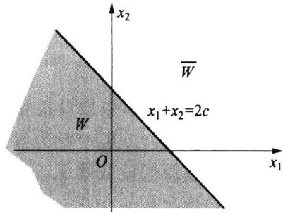
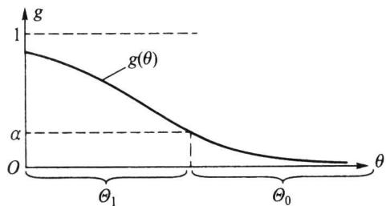

import Guide from '@/components/Guide.astro';
import Knowledge from '@/components/Knowledge.astro';
import Example from '@/components/Example.astro';
import Analysis from '@/components/Analysis.astro';
import Solution from '@/components/Solution.astro';
import Variant from '@/components/Variant.astro';
import Note from '@/components/Note.astro';
import Block from '@/components/Block.astro';
import Method from '@/components/Method.astro';
import Exercise from '@/components/Exercise.astro';

## 第7章 假设检验

## 7.1.1 假设检验问题

先从一个实例来考察假设检验的基本思想.

<Example title="例 7.1.1 女士品茶试验">
一种奶茶由牛奶与茶按一定比例混合而成,可以先倒茶后倒奶(记为 TM),也可以反过来(记为 MT).某女士声称她可以鉴别是 TM 还是 MT,周围品茶的人对此产生了议论,“这怎么可能呢?”“她在胡言乱语.”“不可想象.”在场的费希尔也在思索这个问题,他提议做一项试验来检验如下假设(命题)是否可以接受:
$$
\text { 假设 } H \text {: 该女士无此种鉴别能力. }
$$
他准备了 10 杯调制好的奶茶, TM 与 MT 都有. 服务员一杯一杯地奉上, 让该女士品尝, 说出是 TM 还是 MT, 结果那位女士竟然正确地分辨出 10 杯奶茶中的每一杯. 这时该如何对此作出判断呢?
费希尔的想法是:假如假设 H 是正确的,即该女士无此种鉴别能力,她只能猜,每次猜对的概率为 1/2,10 次都猜对的概率为 $2^{-10}<0.001$ ,这是一个很小的概率,在一次试验中几乎不会发生,如今该事件竟然发生了,这只能说明原假设 H 不当,应予以拒绝,而认为该女士确有辨别奶茶中 TM 与 MT 的能力.费希尔用试验结果对假设 H 的对错进行判断的思维方式可归纳如下:
</Example>

## 假如试验结果与假设 H 发生矛盾就拒绝原假设 H, 否则就接受原假设.

当然,实际操作远非这么简单,假如该女士说对了9杯(或8杯等),又该如何对H作出判断呢?判断会发生错误吗?发生错误的概率是多少?能被控制吗?这里还有很多细节需要研究,费希尔对这些细节作了周密的研究,提出一些新的概念,建立一套可行的方法,形成假设检验理论,为进一步发展假设检验理论与方法打下了牢固基础.
本章将详细讨论其中基础和实用部分,进一步结果可参阅文献[15].
下面再用一个实例引出假设检验中的一些基本概念和操作步骤.

<Example title="例 7.1.2">
某厂生产的合金强度服从正态分布 $N(\theta,16)$ ，其中 $\theta$ 的设计值为不低于 110 Pa。为保证质量，该厂每天都要对生产情况做例行检查，以判断生产是否正常进行，即该合金的平均强度是否不低于 110 Pa。某天从生产的产品中随机抽取 25 块合金，测得其强度值为 $x_{1}, x_{2}, \cdots, x_{25}$ ，均值为 $\bar{x} = 108.2$ Pa，问当日生产是否正常？
对这个实际问题可作如下分析：
(1) 这不是一个参数估计问题.
（2）这是在给定总体与样本下，要求对命题“合金平均强度不低于110 Pa”作出回答：“是”还是“否”？这类问题称为统计假设检验问题，简称假设检验问题。
（3）命题：“合金平均强度不低于 $110 \, Pa$ ”仅涉及参数 $\theta$ 范围，因此该命题是否正确将涉及如下两个参数集合：
$$
\Theta_ {0} = \{\theta : \theta \geqslant 1 1 0 \}, \quad \Theta_ {1} = \{\theta : \theta <   1 1 0 \}.
$$
命题成立对应于“ $\theta \in \Theta_0$ ”，命题不成立则对应“ $\theta \in \Theta_1$ ”。在统计学中这两个非空不相交参数集合都称作统计假设，简称假设。
（4）我们的任务是利用所给总体 $N(\theta, 16)$ 和样本均值 $\bar{x} = 108.2\mathrm{Pa}$ 判断假设（命题）“ $\theta \in \Theta_0$ ”是否成立。通过样本对一个假设作出“对”或“不对”的具体判断规则就称为该假设的一个检验或检验法则。检验的结果若是否定该命题，则称拒绝这个假设，否则就称接受该假设。
（5）若假设可用一个参数的集合表示，该假设检验问题称为参数假设检验问题，否则称为非参数假设检验问题。例7.1.2就是一个参数假设检验问题，而对假设“总体为正态分布”作出检验的问题就是一个非参数假设检验问题。
</Example>

## 7.1.2 假设检验的基本步骤

接下来我们来叙述假设检验的基本步骤.

## 一、建立假设

这里主要叙述参数假设检验问题.设有来自某一个参数分布族 $\{F(x,\theta)\mid\theta\in\Theta\}$ 的样本 $x_{1},x_{2},\cdots,x_{n}$ ，其中 $\Theta$ 为参数空间，设 $\Theta_{0}\subset\Theta$ ，且 $\Theta_{0}\neq\varnothing$ ，则命题 $H_{0}:\theta\in\Theta_{0}$ 称为一个假设或原假设或零假设（null hypothesis），若有另一个 $\Theta_{1}(\Theta_{1}\subset\Theta,\Theta_{1}\Theta_{0}=\varnothing$ ，常见的一种情况是 $\Theta_{1}=\Theta-\Theta_{0}$ ），则命题 $H_{1}:\theta\in\Theta_{1}$ 称为 $H_{0}$ 的对立假设或备择假设（alternative hypothesis）.于是，我们感兴趣的一对假设就是
$$
H _ {0}: \theta \in \Theta_ {0} \quad \mathrm{vs} \quad H _ {1}: \theta \in \Theta_ {1}\tag{7.1.1}
$$
其中“vs”是 versus 的缩写, 是“对”的意思, 即表示 $H_{0}$ 对 $H_{1}$ 的假设检验问题.
对于假设(7.1.1)，如果 $\Theta_0$ 只含一个点，则我们称之为简单（simple）原假设，否则就称为复杂(composite)或复合原假设.同样，对于备择假设也有简单与复杂之别.当 $H_0$ 为简单假设时，其形式可写成 $H_0: \theta = \theta_0$ .此时的备择假设通常有如下三种可能：
$$
H _ {1} ^ {\prime}: \theta \neq \theta_ {0}, \quad H _ {1} ^ {\prime \prime}: \theta <   \theta_ {0}, \quad H _ {1} ^ {\prime \prime \prime}: \theta > \theta_ {0}.
$$
我们称 $H_0$ vs $H_1'$ 为双侧假设或双边假设（因备择假设分散在原假设两侧而得名）， $H_0$ vs $H_1''$ 以及 $H_0$ vs $H_1'''$ 为单侧假设或单边假设（因备择假设位于原假设的一侧而得名）.
在假设检验中,通常将不宜轻易加以否定的假设作为原假设.在例7.1.2中,我们可建立如下一对假设:
$$
H _ {0}: \theta \in \Theta_ {0} = \{\theta : \theta \geqslant 1 1 0 \} \quad \mathrm{vs} \quad H _ {1}: \theta \in \Theta_ {1} = \{\theta : \theta <   1 1 0 \}
$$
或简写为
$$
H _ {0}: \theta \geqslant 1 1 0 \quad \mathrm{vs} \quad H _ {1}: \theta <   1 1 0.
$$

## 二、选择检验统计量,给出拒绝域形式

对于假设(7.1.1)的检验就是指这样的一个法则:当有了具体的样本后,按该法则就可决定是接受 $H_{0}$ 还是拒绝 $H_{0}$ ,即检验就等价于把样本空间划分成两个互不相交的部分W和 $\overline{W}$ ,当样本属于W时,拒绝 $H_{0}$ ;否则接受 $H_{0}$ .于是,我们称W为该检验的拒绝域,而 $\overline{W}$ 称为接受域.
由样本对原假设进行检验总是通过一个统计量完成的,该统计量称为检验统计量.比如,在例7.1.2中,样本均值 $\bar{x}$ 就是一个很好的检验统计量,因为要检验的假设是正态总体均值,在方差已知场合,样本均值 $\bar{x}$ 是总体均值的充分统计量.在例7.1.2中,总体均值 $\theta$ 越大, $\bar{x}$ 取大值的概率越大.亦即, $\bar{x}$ 越大越支持原假设, $\bar{x}$ 越小越支持备择假设,所以拒绝域形如
$$
W = \left\{\left(x _ {1}, x _ {2}, \dots , x _ {n}\right): \overline {{x}} \leqslant c \right\} = \left\{\overline {{x}} \leqslant c \right\}
$$
是合理的,其中临界值 c 待定.
当拒绝域确定了,检验的判断准则跟着也确定了:
\- 如果 $(x_{1}, x_{2}, \cdots, x_{n}) \in W$ ，则拒绝 $H_{0}$ .
\- 如果 $(x_{1}, x_{2}, \dots, x_{n}) \in \overline{W}$ , 接受 $H_{0}$ .
由此可见,一个拒绝域 W 唯一确定一个检验法则,反之,一个检验法则也唯一确定
一个拒绝域.在两个观测值 $(n = 2)$ 场合，图7.1.1给出拒绝域的示意图.
通常我们将注意力放在拒绝域上.正如在数学上不能用一个例子去证明一个结论一样,用一个样本(例子)不能证明一个命题(假设)是成立的,但可以用一个例子(样本)推翻一个命题.因此,从逻辑上看,注重拒绝域是适当的.事实上,在“拒绝原假设”和“拒绝备择假设(从而接受原假设)”之间还有一个模糊域,如今我们把它并入接受域(参
  
图7.1.1 拒绝域示意图
见图 7.1.1), 所以接受域是复杂的, 将之称为保留域也许更恰当, 但习惯上已把它称为接受域, 没有必要再进行改变, 只是应注意它的含义.

## 三、选择显著性水平

由于样本是随机的,故当我们应用某种检验作判断时,可能做出正确的判断,也可能做出错误的判断,因此,可能犯如下两种错误:当 $\theta \in \Theta_{0}$ 时,样本由于随机性却落入了拒绝域 W,于是我们采取了拒绝 $H_{0}$ 的错误决策,称这样的错误为第一类错误(type
I error); 当 $\theta \in \Theta_{1}$ 时, 样本却落入了接受域 $W$ , 于是我们采取了接受 $H_{0}$ 的错误决策, 称这样的错误为第二类错误 (type II error). 具体的可见表 7.1.1.
表 7.1.1 检验的两类错误
<table><tr><td rowspan="2">观测数据情况</td><td colspan="2">总体情况</td></tr><tr><td> $H_0$ 为真</td><td> $H_1$ 为真</td></tr><tr><td> $(x_1, x_2, \cdots, x_n) \in W$ </td><td>犯第一类错误</td><td>正确</td></tr><tr><td> $(x_1, x_2, \cdots, x_n) \in \overline{W}$ </td><td>正确</td><td>犯第二类错误</td></tr></table>
在实际中,分别称第一类、第二类错误为拒真错误与取伪错误.
由于检验结果受样本的影响,具有随机性,于是,可用总体分布定义犯第一类、第二类错误概率如下:
犯第一类错误概率: $\alpha(\theta)=P_{\theta}\{X\in W\},\theta\in\Theta_{0}.$
犯第二类错误概率: $\beta(\theta)=P_{\theta}\{X\in W\},\theta\in\Theta_{1}.$
事实上,每一个检验都无法避免犯错误的可能,那能否找到一个检验,使其犯两类错误的概率都尽可能地小呢?实际上,我们也做不到这一点.为了说明其原因,先引进如下的势函数或功效函数(power function)的概念.

<Knowledge title="定义 7.1.1">
设检验问题
$$
H _ {0}: \theta \in \Theta_ {0} \quad \mathrm{vs} \quad H _ {1}: \theta \in \Theta_ {1}
$$
的拒绝域为 W，则样本观测值 X 落在拒绝域 W 内的概率称为该检验的势函数，记为
$$
g (\theta) = P _ {\theta} (X \in W), \quad \theta \in \Theta = \Theta_ {0} \cup \Theta_ {1}.\tag{7.1.2}
$$
显然,势函数 $g(\theta)$ 是定义在参数空间 $\Theta$ 上的一个函数. 当 $\theta \in \Theta_{0}$ 时, $g(\theta) = \alpha(\theta)$ , 当 $\theta \in \Theta_{1}$ 时 $g(\theta) = 1 - \beta(\theta)$ . 由此可见, 犯两类错误的概率都是参数 $\theta$ 的函数, 并可由势函数得到, 即
$$
g (\theta) = \left\{ \begin{array}{l l} {\alpha (\theta),} & {\theta \in \Theta_ {0},} \\ {1 - \beta (\theta),} & {\theta \in \Theta_ {1},} \end{array} \right. \quad \text {或} \quad \left\{ \begin{array}{l l} {\alpha (\theta) = g (\theta),} & {\theta \in \Theta_ {0},} \\ {\beta (\theta) = 1 - g (\theta),} & {\theta \in \Theta_ {1}.} \end{array} \right.
$$
下面通过例 7.1.2 说明无法使一个检验犯第一类、第二类错误概率同时变小。对例 7.1.2，其拒绝域为 $W=\left\{\bar{x}\leqslant c\right\}$ ，由（7.1.2）可以算出该检验的势函数
$$
g (\theta) = P _ {\theta} (\bar {x} \leqslant c) = P _ {\theta} \left(\frac {\bar {x} - \theta}{4 / 5} \leqslant \frac {c - \theta}{4 / 5}\right) = \Phi \left(\frac {c - \theta}{4 / 5}\right),
$$
</Knowledge>

<Note>
意到 $\bar{x} \sim N(\theta, 16/25)$ ，这个势函数是 $\theta$ 的减函数（见图 7.1.2）.
  
图7.1.2 例7.1.2的势函数 $g(\theta)$
利用这个势函数容易写出其犯两类错误的概率分别为
$$
\alpha (\theta) = \Phi \left(\frac {c - \theta}{4 / 5}\right), \quad \theta \in \Theta_ {0},\tag{7.1.3}
$$
$$
\beta (\theta) = 1 - \Phi \left(\frac {c - \theta}{4 / 5}\right), \quad \theta \in \Theta_ {1}.\tag{7.1.4}
$$
由上述两个式子可以看出犯两类错误的概率 $\alpha(\theta)$ , $\beta(\theta)$ 间的关系：
\- 当 $\alpha(\theta)$ 减小时, 由(7.1.3)知, $c$ 也随之减小, 再由(7.1.4)知, $c$ 的减小必导致 $\beta(\theta)$ 的增大.
\- 当 $\beta (\theta)$ 减小时，由(7.1.4)知， $c$ 会增大，再由(7.1.3)知， $c$ 的增大必导致 $\alpha (\theta)$ 的增大.
这一现象说明:在样本量给定的条件下, $\alpha(\theta)$ 与 $\beta(\theta)$ 中一个减小必导致另一个增大,这不是偶然的,而具有一般性.这进一步说明:在样本量一定的条件下不可能找到一个使 $\alpha(\theta),\beta(\theta)$ 都小的检验.还应注意,犯第二类错误的概率在不少场合不易求出.
既然我们不可能同时控制一个检验的犯第一类、第二类错误的概率,在此背景下,只能采取折中方案.通常的做法是仅限制犯第一类错误的概率,这就是费希尔的显著性检验,下面给出正式定义.
</Note>

<Knowledge title="定义 7.1.2">
对检验问题 $H_0: \theta \in \Theta_0$ vs $H_1: \theta \in \Theta_1$ , 如果一个检验满足对任意的 $\theta \in \Theta_0$ , 都有
$$
g (\theta) \leqslant \alpha ,
$$
则称该检验是显著性水平为 $\alpha$ 的显著性检验, 简称水平为 $\alpha$ 的检验.
提出显著性检验的概念就是要控制犯第一类错误的概率 $\alpha$ ，但也不能使得 $\alpha$ 过小（ $\alpha$ 过小会导致 $\beta$ 过大），在适当控制 $\alpha$ 中制约 $\beta$ 。最常用的选择是 $\alpha = 0.05$ ，有时也选择 $\alpha = 0.10$ 或 $\alpha = 0.01$ 。
</Knowledge>

## 四、给出拒绝域

在确定显著性水平后,我们可以定出检验的拒绝域 W. 在例 7.1.2 中,对给定的显著性水平 $\alpha$ , 则要求对任意的 $\theta \geqslant 110$ 有 $g(\theta) = \Phi\left(\frac{5(c-\theta)}{4}\right) \leqslant \alpha$ , 由于 $g(\theta)$ 是关于 $\theta$ 的单调减函数(见图 7.1.2), 只需要
$$
g (1 1 0) = \Phi \left(\frac {5 (c - 1 1 0)}{4}\right) = \alpha
$$
成立即可.用标准正态分布分位数可把上式改写为 $\frac{5(c - 110)}{4} = u_{\alpha}$ ，从而 $c$ 的值为 $c = 110+$ $0.8u_{\alpha}$ ，检验的拒绝域为
$$
W = \{\bar {x} \leqslant 1 1 0 + 0. 8 u _ {\alpha} \}.
$$
若取 $\alpha = 0.05$ ，则 $u_{0.05} = -u_{0.95}$ ，具体 $c$ 值为
$$
c = 1 1 0 + 0. 8 u _ {0. 0 5} = 1 1 0 - 0. 8 \times 1. 6 4 5 = 1 0 8. 6 8 4.
$$
所以,检验的拒绝域为
$$
W = \{\overline {{{x}}} \leqslant 1 0 8. 6 8 4 \}.
$$
若令 $u = \frac{\overline{x} - 110}{4 / 5}$ ，则拒绝域有另一种表示，即
$$
W = \{u \leqslant u _ {0. 0 5} \} = \{u \leqslant - 1. 6 4 5 \}.
$$
今后主要用检验统计量 u 表示拒绝域.

## 五、做出判断

在有了明确的拒绝域 W 后,根据样本观测值我们可以作出判断:
\- 当 $u \leqslant -1.645$ 时, 则拒绝 $H_{0}$ , 即接受 $H_{1}$ .
\- 当 $u > -1.645$ 时, 则接受 $H_{0}$ .
在例 7.1.2 中,由于
$$
u _ {0} = \frac {1 0 8 . 2 - 1 1 0}{4 / 5} = - 2. 2 5 <   - 1. 6 4 5
$$
因此拒绝原假设,即认为该日生产不正常.
综上,一般情况下,寻找某对假设的显著性检验的步骤如下:
\- 根据实际问题,建立统计假设 $H_{0}$ vs $H_{1}$ .
\- 选取一个合适的检验统计量 $T(X)$ , 使当 $H_0$ 成立时 (或 $H_0$ 中某个具体参数下), $T$ 的分布完全已知, 并根据 $H_0$ 及 $H_1$ 的特点, 确定拒绝域 $\pmb{W}$ 的形式.
\- 选择合适的显著性水平 $\alpha$ , 确定具体的拒绝域 $W$ .
\- 由样本观测值 $x_{1}, x_{2}, \cdots, x_{n}$ , 计算检验统计量的 $T(x_{1}, x_{2}, \cdots, x_{n})$ , 由 $T(x_{1}, x_{2}, \cdots, x_{n})$ 是否属于 $W$ , 作出最终判断.

## 7.1.3 检验的 $p$ 值

假设检验的结论通常是简单的. 在给定的显著性水平下, 不是拒绝原假设就是接受原假设. 然而有时也会出现这样的情况: 在一个较大的显著性水平 (比如 $\alpha = 0.05$ ) 下得到拒绝原假设的结论, 而在一个较小的显著性水平 (比如 $\alpha = 0.01$ ) 下却会得到相反的结论. 这种情况在理论上很容易解释: 因为显著性水平变小后会导致检验的拒绝域变小, 于是原来落在拒绝域中的观测值就可能落入接受域, 但这种情况在应用中会带来一些麻烦: 假如这时一个人主张选择显著性水平 $\alpha = 0.05$ , 而另一个人主张选 $\alpha = 0.01$ , 则第一个人的结论是拒绝 $H_0$ , 而后一个人的结论是接受 $H_0$ , 我们该如何处理这一问题呢? 下面用例 7.1.2 来讨论这个问题.
在上一小节中,我们给出了例7.1.2的检验统计量及拒绝域 $W = \{\bar{x} \leqslant 110 + 0.8u_{\alpha}\}$ ,或表示为 $W = \{u \leqslant u_{\alpha}\}$ ,其中 $u_{0} = 1.25(\bar{x} - 110) = -2.25$ .对一些显著性水平,表7.1.2列出了相应的拒绝域和检验结论.
表 7.1.2 例 7.1.2 中的拒绝域
<table><tr><td>显著性水平</td><td>拒绝域</td><td>对应的结论( $u_0=-2.25$ )</td></tr><tr><td> $\alpha=0.1$ </td><td> $u\leqslant-1.282$ </td><td>拒绝  $H_0$ </td></tr><tr><td> $\alpha=0.05$ </td><td> $u\leqslant-1.645$ </td><td>拒绝  $H_0$ </td></tr><tr><td> $\alpha=0.025$ </td><td> $u\leqslant-1.96$ </td><td>拒绝  $H_0$ </td></tr><tr><td> $\alpha=0.01$ </td><td> $u\leqslant-2.326$ </td><td>接受 $H_0$ </td></tr><tr><td> $\alpha=0.005$ </td><td> $u\leqslant-2.576$ </td><td>接受 $H_0$ </td></tr></table>
我们看到,不同的 $\alpha$ 有不同的结论.
现在换一个角度来看, 在 $\mu=110$ 时, 检验统计量 u 的分布是 N(0,1). 此时由样本可算得 u 的值 $u_{0}=-2.25$ , 据此可算得一个概率 $p=P(u\leqslant u_{0})=P(u\leqslant-2.25)=\Phi(-2.25)=0.0122$ , 若以此为基准来看上述检验问题, 亦可作出判断, 具体如下:
\- 当 $\alpha < 0.0122$ 时， $u_{\alpha} < -2.25$ ，由于拒绝域为 $W = \{u \leqslant u_{\alpha}\}$ ，于是观测值 $u_{0} = -2.25$ 不在拒绝域里，应接受原假设。
\- 当 $\alpha \geqslant 0.0122$ 时， $u_{\alpha} \geqslant -2.25$ ，由于拒绝域为 $W = \{u \leqslant u_{\alpha}\}$ ，于是观测值 $u_0 = -2.25$ 落在拒绝域里，应拒绝原假设。
由此可以看出,0.0122 是能用观测值 $u_{0} = -2.25$ 作出“拒绝 $H_{0}$ ”的最小的显著性水平,这就是 p 值.

<Knowledge title="定义 7.1.3">
在一个假设检验问题中, 利用样本观测值能够作出拒绝原假设的最小显著性水平称为检验的 p 值.
由检验的 $p$ 值与人们心目中的显著性水平 $\alpha$ 进行比较可以很容易作出检验的结论：
\- 如果 $p \leqslant \alpha$ ，则在显著性水平 $\alpha$ 下拒绝 $H_0$ .
\- 如果 $p > \alpha$ ，则在显著性水平 $\alpha$ 下接受 $H_0$
p 值在实际中很有用, 如今的统计软件中对检验问题一般都会给出检验的 p 值.
我们后面的检验可从两方面进行,其一是建立拒绝域,考察样本观测值是否落入拒绝域而加以判断;其二是根据样本观测值计算检验的 p 值,通过将 p 值与事先设定的显著性水平 $\alpha$ 比较大小而作出判断.两者是等价的,哪个方便用哪个.
实际中， $p$ 很小时（如 $p \leqslant 0.001$ ）即可拒绝原假设， $p$ 很大时（如 $p > 0.5$ ）即可接受原假设。只有当 $p$ 与 $\alpha$ 接近时才需比较。这样至少可减少部分争论。
</Knowledge>

<Block title="习题7.1">
1. 设 $x_{1}, x_{2}, \cdots, x_{n}$ 是来自 $N(\mu, 1)$ 的样本，考虑如下假设检验问题
$$
H _ {0}: \mu = 2 \quad \mathrm{vs} \quad H _ {1}: \mu = 3,
$$
若检验由拒绝域为 $W = \{\bar{x}\geqslant 2.6\}$ 确定.
(1) 当 n=20 时求检验犯两类错误的概率；
(2) 如果要使得检验犯第二类错误的概率 $\beta \leqslant 0.01, n$ 最小应取多少？
(3) 证明: 当 $n \to \infty$ 时, $\alpha \to 0, \beta \to 0$ .
2. 设 $x_{1}, x_{2}, \cdots, x_{10}$ 是来自 0-1 总体 $b(1, p)$ 的样本，考虑如下检验问题：
$$
H _ {0}: p = 0. 2 \quad \mathrm{vs} \quad H _ {1}: p = 0. 4,
$$
取拒绝域为 $W=\{\bar{x}\geqslant0.5\}$ ，求该检验犯两类错误的概率.
3. 设 $x_{1}, x_{2}, \cdots, x_{16}$ 是来自正态总体 $N(\mu, 4)$ 的样本，考虑检验问题
$$
H _ {0}: \mu = 6 \quad \mathrm{vs} \quad H _ {1}: \mu \neq 6,
$$
拒绝域取为 $W = \{|x - 6| \geqslant c\}$ ，试求 $c$ 使得检验的显著性水平为0.05，并求该检验在 $\mu = 6.5$ 处犯第二类错误的概率.
4. 设总体为均匀分布 $U(0, \theta)$ , $x_{1}$ , $x_{2}$ , $\cdots$ , $x_{n}$ 是样本, 考虑检验问题
$$
H _ {0}: \theta \geqslant 3 \quad \mathrm{vs} \quad H _ {1}: \theta <   3,
$$
拒绝域取为 $W = \{x_{(n)}\leqslant 2.5\}$ ，求检验犯第一类错误的最大值 $\alpha$ ，若要使得该最大值 $\alpha$ 不超过0.05， $n$ 至少应取多大？
5. 在假设检验问题中, 若检验结果是接受原假设, 则检验可能犯哪一类错误? 若检验结果是拒绝原假设, 则又有可能犯哪一类错误?
6. 设 $x_{1}, x_{2}, \cdots, x_{20}$ 是来自 0-1 总体 $b(1, p)$ 的样本，考虑如下检验问题：
$$
H _ {0}: p = 0. 2 \quad \mathrm{vs} \quad H _ {1}: p \neq 0. 2,
$$
取拒绝域为 $W = \left\{\sum_{i=1}^{20} x_i \geqslant 7 \text{ 或 } \sum_{i=1}^{20} x_i \leqslant 1 \right\}$ ,
(1) 求 $p=0,0.1,0.2,\cdots,0.9,1$ 时的势并由此画出势函数的图；
(2) 求在 p=0.05 时犯第二类错误的概率.
7. 设一个单一观测的样本 $x$ 取自密度函数为 $p(x)$ 的总体，对 $p(x)$ 考虑统计假设
$$
H _ {0}: p _ {0} (x) = I _ {\{0, 1 \}} (x) \quad \text { vs } \quad H _ {1}: p _ {1} (x) = 2 x I _ {\{0, 1 \}} (x).
$$
若其拒绝域的形式为 $W = \{x: x \geqslant c\}$ ，试确定一个 $c$ ，使得犯第一类、第二类错误的概率满足 $\alpha + 2\beta$ 为最小，并求其最小值.
8. 设 $x_{1}, x_{2}, \cdots, x_{30}$ 为取自泊松分布 $P(\lambda)$ 的随机样本.
(1) 试给出单侧假设检验问题 $H_{0}: \lambda \leqslant 0.1$ vs $H_{1}: \lambda > 0.1$ 的显著性水平 $\alpha = 0.05$ 的检验；
(2) 求此检验的势函数 $\beta(\lambda)$ 在 $\lambda=0.05,0,2,0.3,\cdots,0,9$ 时的值，并据此画出 $\beta(\lambda)$ 的图像.
</Block>
