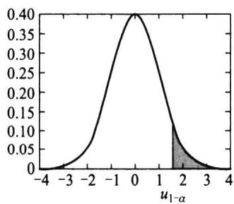
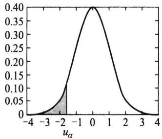
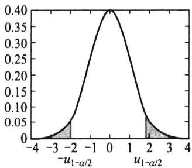
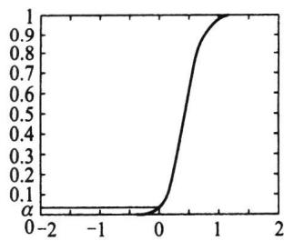
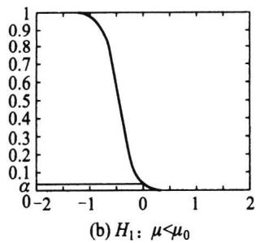
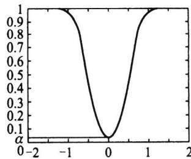
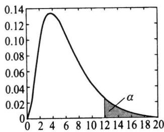
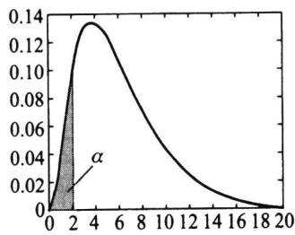
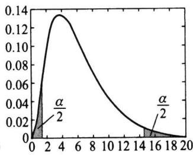

import Guide from '@/components/Guide.astro';
import Knowledge from '@/components/Knowledge.astro';
import Example from '@/components/Example.astro';
import Analysis from '@/components/Analysis.astro';
import Solution from '@/components/Solution.astro';
import Variant from '@/components/Variant.astro';
import Note from '@/components/Note.astro';
import Block from '@/components/Block.astro';
import Method from '@/components/Method.astro';
import Exercise from '@/components/Exercise.astro';

本节对正态总体参数 $\mu$ 和 $\sigma^{2}$ 的各种检验分别进行讨论.

## 7.2.1 单个正态总体均值的检验

设 $x_{1}, x_{2}, \cdots, x_{n}$ 是来自 $N(\mu, \sigma^{2})$ 的样本，考虑如下三种关于 $\mu$ 的检验问题：
$$
\mathrm{I} \quad H _ {0}: \mu \leqslant \mu_ {0} \quad \mathrm{vs} \quad H _ {1}: \mu > \mu_ {0},\tag{7.2.1}
$$
$$
\mathrm{II} \quad H _ {0}: \mu \geqslant \mu_ {0} \quad \text { vs } \quad H _ {1}: \mu <   \mu_ {0},\tag{7.2.2}
$$
$$
\mathrm{III} \quad H _ {0}: \mu = \mu_ {0} \quad \mathrm{vs} \quad H _ {1}: \mu \neq \mu_ {0},\tag{7.2.3}
$$
其中 $\mu_{0}$ 是已知常数.由于正态总体含两个参数,总体方差 $\sigma^{2}$ 已知与否对检验有影响.下面我们分 $\sigma$ 已知和未知两种情况叙述.

## 一、 $\sigma = \sigma_{0}$ 已知时的 $u$ 检验

对于(7.2.1)式所示的单侧检验问题Ⅰ，由于 $\mu$ 的点估计是 $\bar{x}$ ，且 $\bar{x}\sim N(\mu,\sigma_{0}^{2}/n)$ ，故选用检验统计量
$$
u = \frac {\overline {{{x}}} - \mu_ {0}}{\sigma_ {0} / \sqrt {n}}\tag{7.2.4}
$$
是恰当的. 直觉告诉我们: 当样本均值 $\bar{x}$ 不超过设定均值 $\mu_0$ 时, 应倾向于接受原假设; 当样本均值 $\bar{x}$ 超过 $\mu_0$ 时, 应倾向于拒绝原假设. 可是, 在有随机性存在的场合, 如果 $\bar{x}$ 比 $\mu_0$ 大一点就拒绝原假设似乎不当, 只有当 $\bar{x}$ 比 $\mu_0$ 大到一定程度时拒绝原假设才是恰当的. 这就存在一个临界值 $c$ , 拒绝域为
$$
W _ {1} = \left\{\left(x _ {1}, x _ {2}, \dots , x _ {n}\right): u \geqslant c \right\},\tag{7.2.5}
$$
常简记为 $\{u\geqslant c\}$ .若要求检验的显著性水平为 $\alpha$ ，则 $c$ 满足
$$
P _ {\mu_ {0}} (u \geqslant c) = \alpha .
$$
由于在 $\mu = \mu_0$ 时， $u \sim N(0,1)$ ，故 $c = u_{1 - \alpha}$ （见图7.2.1(a))，最后的拒绝域为
  
(a) $H_{1}$ : $\mu >\mu_{0}$
(7.2.6)
$$
W _ {1} = \left\{u \geqslant u _ {1 - \alpha} \right\}.
$$
  
(b) $H_{1}$ : $\mu < \mu_{0}$
  
(c) $H_{1}$ : $\mu \neq \mu_{0}$  
图7.2.1 $u$ 检验的拒绝域
该检验用的检验统计量是 u 统计量, 故一般称为 u 检验. 该检验的势函数是 $\mu$ 的函数, 它可用正态分布写出, 具体如下: 对 $\mu \in (-\infty, \infty)$ ,
$$
\begin{array}{r l} g (\mu) & = P _ {\mu} (X \in W _ {1}) = P _ {\mu} (u \geqslant u _ {1 - \alpha}) \\ & = P _ {\mu} \left(\frac {\bar {x} - \mu_ {0}}{\sigma_ {0} / \sqrt {n}} \geqslant u _ {1 - \alpha}\right) \\ & = P _ {\mu} \left(\frac {\bar {x} - \mu + \mu - \mu_ {0}}{\sigma_ {0} / \sqrt {n}} \geqslant u _ {1 - \alpha}\right) \\ & = P _ {\mu} \left(\frac {\bar {x} - \mu}{\sigma_ {0} / \sqrt {n}} \geqslant \frac {\mu_ {0} - \mu}{\sigma_ {0} / \sqrt {n}} + u _ {1 - \alpha}\right) \\ & = 1 - \Phi (\sqrt {n} (\mu_ {0} - \mu) / \sigma_ {0} + u _ {1 - \alpha}). \end{array}
$$
由此可见，势函数是 $\mu$ 的增函数，其图形见图7.2.2(a).由增函数性质知，只要 $g(\mu_0) = \alpha$ ，就可保证在 $\mu \leqslant \mu_0$ 时有 $g(\mu)\leqslant \alpha .$ 所以上述求出的检验是显著性水平为 $\alpha$ 的检验.
下面我们讲述用 p 值进行检验的方法.
类似于7.1.3节的讲述,对给定的样本观测值,可以计算出相应的检验统计量u的值,记为 $u_{0}=\frac{\sqrt{n}\left(\bar{x}-\mu_{0}\right)}{\sigma_{0}}$ ,这里的 $\bar{x}$ 是样本观测值.因在 $\mu=\mu_{0}$ 时,u是服从标准正态分布
  
(a) $H_{1}$ : $\mu >\mu_{0}$
  
图7.2.2 $g(\mu)$ 的图形
  
(c) $H_{1}$ : $\mu \neq \mu_{0}$
的随机变量,令
$$
p _ {\mathrm{I}} = P (u \geqslant u _ {0}) = 1 - \Phi (u _ {0}),\tag{7.2.7}
$$
此即说明 $u_0 = u_{1 - p}$ ，于是由正态分布函数的反函数的单调性有如下结论：
\- 当 $p_1 \leqslant \alpha$ 时, $u_{1 - \alpha} \leqslant u_0$ , 于是观测值落在拒绝域里, 应拒绝原假设.
\- 当 $p_{1} > \alpha$ 时， $u_{1 - \alpha} > u_{0}$ ，于是观测值不在拒绝域里，应接受原假设。
由此可以看出，(7.2.7)计算出的值就是该检验的 $p$ 值.
对检验问题(7.2.2)所示的单侧检验问题Ⅱ的讨论是完全类似的.仍选用 u 作为检验统计量,考虑到(7.2.2)的备择假设 $H_{1}$ 在左侧,其拒绝域(见图 7.2.1(b))为
$$
W _ {\mathrm{II}} = \left\{u \leqslant u _ {\alpha} \right\}.\tag{7.2.8}
$$
而检验的 $p$ 值为
$$
p _ {\mathrm{II}} = P (u \leqslant u _ {0}) = \Phi (u _ {0}),\tag{7.2.9}
$$
$u_{0}, u$ 的含义同上, 后面还会用到就不再一一指出了.
对检验问题(7.2.3)所示的双侧检验问题Ⅲ,也可类似进行讨论,只不过检验的p值稍有不同.仍选用u作为检验统计量,考虑到(7.2.3)的备择假设 $H_{1}$ 分散在两侧,故其拒绝域亦应在两侧,即拒绝域应有如下形式
$$
W _ {\text { III }} = \{\mid u \mid \geqslant c \}.
$$
对给定的显著性水平 $\alpha$ （ $0 < \alpha < 1$ ），由 $P_{\mu_0}(|u| \geqslant c) = \alpha$ 可定出 $c = u_{1 - \alpha / 2}$ （见图7.2.1(c)），最后的拒绝域为
$$
W _ {\text { III }} = \left\{\mid u \mid \geqslant u _ {1 - \alpha / 2} \right\}.\tag{7.2.10}
$$
下面介绍双侧检验的 $p$ 值的计算. 在检验统计量分布对称场合, 双侧检验的 $p$ 值的计算与单侧检验是类似的, 不对称场合我们在后面介绍.
仿上，令
$$
p _ {\mathrm{III}} = P (| u | \geqslant | u _ {0} |) = 2 (1 - \Phi (| u _ {0} |)) ,\tag{7.2.11}
$$
此即说明 $|u_0| = u_{1 - p_{\text{III}} / 2}$ ，这里要用到 $u_0$ 的绝对值是因为对双侧假设检验，观测值可能为正，也可能为负，二者机会相同，于是有类似的结论：
\- 当 $p_{\text{III}} \leqslant \alpha$ 时, $u_{1 - \alpha / 2} \leqslant |u_0|$ , 于是观测值落在拒绝域里, 应拒绝原假设.
\- 当 $p_{\text{III}} > \alpha$ 时, $u_{1 - \alpha / 2} > |u_0|$ , 于是观测值不在拒绝域里, 应接受原假设.
由此可以看出，(7.2.11)计算出的值就是该检验的 $p$ 值.

<Example title="例 7.2.1">
从甲地发送一个信号到乙地. 设乙地接收到的信号值是一个服从正态分布 $N(\mu, 0.2^{2})$ 的随机变量, 其中 $\mu$ 为甲地发送的真实信号值. 现甲地重复发送同一信号
5 次, 乙地接收到的信号值为
$$
\begin{array}{l l l l l} 8. 0 5 & 8. 1 5 & 8. 2 & 8. 1 & 8. 2 5, \end{array}
$$
设接收方有理由猜测甲地发送的信号值为8,问能否接受这猜测?

<Solution title="解">
这是一个假设检验的问题,总体 $X \sim N(\mu, 0.2^{2})$ , 待检验的原假设 $H_{0}$ 与备择假设 $H_{1}$ 分别为
$$
H _ {0}: \mu = 8 \quad \mathrm{vs} \quad H _ {1}: \mu \neq 8.
$$
这是一个双侧检验问题,检验的拒绝域为 $\{|u|\geqslant u_{1-\alpha/2}\}$ .取显著性水平 $\alpha=0.05$ ,则查表知 $u_{0.975}=1.96$ .由该例中观测值可计算得出
$$
\overline {{{x}}} = 8. 1 5, u _ {0} = \sqrt {5} (8. 1 5 - 8) / 0. 2 = 1. 6 8,
$$
$u_{0}$ 值未落入拒绝域 $\{|u|\geqslant 1.96\}$ 内，故不能拒绝原假设，即接受原假设，可认为猜测成立.
我们也可以采用 $p$ 值完成此次检验. 此处 $u_0 = 1.68$ , 根据(7.2.11)式,
$$
p = 2 (1 - \Phi (1. 6 8)) = 0. 0 9 3.
$$
由于 p 值大于事先给定的水平 0.05, 故不能拒绝原假设, 结论是相同的.
进一步,我们从 p 值还可以看到,只要事先给定的显著性水平不高于0.093,则都不能拒绝原假设;而若事先给定的显著性水平高于0.093,如事先给定的显著性水平为0.10,则检验就会作出拒绝原假设的结论.
说明:在实际中也经常会遇到如下两个检验问题:
$$
\begin{array}{l l l l} \mathrm{IV} & H _ {0}: \mu = \mu_ {0} & \text { vs } & H _ {1}: \mu > \mu_ {0}, \\ \mathrm{V} & H _ {0}: \mu = \mu_ {0} & \text { vs } & H _ {1}: \mu <   \mu_ {0}. \end{array}
$$
它仍可用检验统计量 u 施行检验. 检验问题Ⅳ的拒绝域与检验问题Ⅰ的拒绝域相同, 即 $W_{N} = \{u \geqslant u_{1-\alpha}\}$ . 这是因为检验问题Ⅳ与Ⅰ的备择假设相同, 而Ⅳ的原假设是Ⅰ的原假设的子集, 由于此时 u 检验的势函数是 $\mu$ 的单调增函数, 因此, 检验问题Ⅳ的显著性水平为 $\alpha$ 的检验与检验问题Ⅰ的显著性水平为 $\alpha$ 的检验是相同的, 从而拒绝域也相同, 它们的检验的 p 值也相同. 类似地, 检验问题 V 与检验问题Ⅱ的拒绝域以及 p 值也是相同的. 这个现象在以后其他检验中也会出现, 结论是相似的. 由此, 本文中不再考虑诸如 IV, V 的检验问题 (若出现此类检验问题, 可归结为检验问题 I, II 处理).
</Solution>
</Example>

## 二、 $\sigma$ 未知时的 $t$ 检验

对检验问题 I, 由于 $\sigma$ 未知, 无法使用 (7.2.4) 式作检验. 一个自然的想法是将 (7.2.4) 式中未知的 $\sigma$ 替换成样本标准差 $s$ , 这就形成 $t$ 检验统计量
$$
t = \frac {\sqrt {n} (\bar {x} - \mu_ {0})}{s}.\tag{7.2.12}
$$
由推论 5.4.2 知, 在 $\mu = \mu_{0}$ 时, $t \sim t(n-1)$ , 从而检验问题 I 的拒绝域为
$$
W _ {1} = \left\{t \geqslant t _ {1 - \alpha} (n - 1) \right\},\tag{7.2.13}
$$
检验的 $p$ 值是类似的, 对给定的样本观测值, 可以计算出相应的检验统计量 $t$ 的值, 记为 $t_0 = \frac{\sqrt{n}(\bar{x} - \mu_0)}{s}$ , 这里的 $\bar{x}, s$ 可由样本观测值算得. 因 $t$ 是服从自由度是 $n - 1$ 的 $t$ 分布的随机变量, 则
$$
p _ {\mathrm{I}} = P (t \geqslant t _ {0}).\tag{7.2.14}
$$
对另两组检验问题的讨论是完全类似于上一小节的,罗列结果如下:检验问题Ⅱ的拒绝域为
$$
W _ {\mathrm{II}} = \left\{t \leqslant t _ {\alpha} (n - 1) \right\},\tag{7.2.15}
$$
$p$ 值为
$$
p _ {\text { I   I }} = P (t \leqslant t _ {0}).\tag{7.2.16}
$$
检验问题Ⅲ的拒绝域为
$$
W _ {\mathrm{III}} = \left\{\mid t \mid \geqslant t _ {1 - \alpha / 2} (n - 1) \right\},\tag{7.2.17}
$$
$p$ 值为
$$
p _ {\text {III}} = P (| t | \geqslant | t _ {0} |),\tag{7.2.18}
$$
同样可证明这三个检验都是显著性水平为 $\alpha$ 的检验.

<Example title="例 7.2.2">
某厂生产的某种铝材的长度服从正态分布, 其均值设定为240 cm. 现从该厂抽取5件产品, 测得其长度(单位: cm)为
$$
\begin{array}{l l l l l} 2 3 9. 7 & 2 3 9. 6 & 2 3 9 & 2 4 0 & 2 3 9. 2, \end{array}
$$
试判断该厂此类铝材的长度是否满足设定要求？
这是一个关于正态均值的双侧假设检验问题. 原假设是 $H_0: \mu = 240$ , 备择假设是 $H_1: \mu \neq 240$ . 由于 $\sigma$ 未知, 故采用 $t$ 检验, 其拒绝域为 $\{|t| \geqslant t_{1 - \alpha / 2}(n - 1)\}$ , 若取 $\alpha = 0.05$ , 则查表得 $t_{0.975}(4) = 2.7764$ . 现由样本计算得到 $\bar{x} = 239.5, s = 0.4$ , 故
$$
t _ {0} = \sqrt {5} (2 3 9. 5 - 2 4 0) / 0. 4 = - 2. 7 9 5,
$$
由于 $|t_0| = 2.795 > 2.7764$ ，故拒绝原假设，认为该厂生产的铝材的长度不满足设定要求.
下面用 $p$ 值再作一次检验. 此处 $t_0 = -2.795$ , 记 $t$ 是服从自由度是 4 的 $t$ 分布的随机变量, 则根据 (7.2.18),
$$
p = P (| t | \geqslant 2. 7 9 5) = 2 P (t \geqslant 2. 7 9 5),
$$
利用统计软件(如 R 或 Excel)可计算出具体 p 值为 0.0491, 由于 p 值小于事先给定的显著性水平 0.05, 故拒绝原假设, 结论是相同的.
综上,关于单个正态总体的均值的检验问题可汇总成表7.2.1.
表 7.2.1 单个正态总体均值的假设检验
<table><tr><td>检验法</td><td> $H_0$ </td><td> $H_1$ </td><td>检验统计量</td><td>拒绝域</td><td>p值</td></tr><tr><td rowspan="3">u检验(σ=σ0已知)</td><td>μ≤μ0</td><td>μ&gt;μ0</td><td></td><td>\{u≥u1-α\}</td><td>1-Φ(u0)</td></tr><tr><td>μ≥μ0</td><td>μ&lt;μ0</td><td>u=x-μ0/σ0/√n</td><td>\{u≤uα\}</td><td>Φ(u0)</td></tr><tr><td>μ=μ0</td><td>μ≠μ0</td><td></td><td>\{|u|≥u1-α/2\}</td><td>2(1-Φ(|u0|))</td></tr><tr><td rowspan="3">t检验(σ未知)</td><td>μ≤μ0</td><td>μ&gt;μ0</td><td></td><td>\{t≥t1-α(n-1)\}</td><td>P(t≥t0)</td></tr><tr><td>μ≥μ0</td><td>μ&lt;μ0</td><td>t=x-μ0/s/√n</td><td>\{t≤tα(n-1)\}</td><td>P(t≤t0)</td></tr><tr><td>μ=μ0</td><td>μ≠μ0</td><td></td><td>\{|t|≥t1-α/2(n-1)\}</td><td>P(|t|≥|t0|)</td></tr></table>
</Example>

<Note>
$u_0 = \sqrt{n}(\overline{x} -\mu_0) / \sigma_0,t_0 = \sqrt{n}(\overline{x} -\mu_0) / s,u$ 是服从 $N(0,1)$ 的随机变量， $t$ 是服从 $t(n - 1)$ 的随机变量.
</Note>

## 7.2.2 假设检验与置信区间的关系

细心的读者可能会发现,这里用的检验统计量与6.6.3节中置信区间所用的枢轴量很相似,这不是偶然的,两者之间存在非常密切的关系,现以标准差未知场合为例叙述如下.
设 $x_{1}, x_{2}, \cdots, x_{n}$ 是来自正态总体 $N(\mu, \sigma^{2})$ 的样本，现讨论在 $\sigma$ 未知场合关于均值 $\mu$ 的检验问题。分三种情况：
首先考虑双侧检验问题Ⅲ,显著性水平为 $\alpha$ 的检验的接受域为
$$
\overline {{{W}}} _ {\mathrm{III}} = \{\mid \overline {{{x}}} - \mu_ {0} \mid \leqslant \frac {s}{\sqrt {n}} t _ {1 - \alpha / 2} (n - 1) \},
$$
它可以改写为
$$
\overline {{{W}}} _ {\mathrm{III}} = \left\{\overline {{{x}}} - \frac {s}{\sqrt {n}} t _ {1 - \alpha / 2} (n - 1) \leqslant \mu_ {0} \leqslant \overline {{{x}}} + \frac {s}{\sqrt {n}} t _ {1 - \alpha / 2} (n - 1) \right\},
$$
这里 $\mu_0$ 并无限制，若让 $\mu_0$ 在 $(- \infty, \infty)$ 内取值，就可得到 $\mu$ 的 $1 - \alpha$ 置信区间 $\left[\overline{x} \pm \frac{s}{\sqrt{n}} t_{1 - \alpha / 2}(n - 1)\right]$ . 反之，若有一个如上的 $1 - \alpha$ 置信区间，也可获得关于 $H_0: \mu = \mu_0$ 的显著性水平为 $\alpha$ 的显著性检验. 所以，“正态均值 $\mu$ 的 $1 - \alpha$ 置信区间”与“关于 $H_0: \mu = \mu_0$ vs $H_1: \mu \neq \mu_0$ 的双侧检验问题的显著性水平为 $\alpha$ 的检验”是一一对应的.
类似地考虑单侧检验问题Ⅰ，显著性水平为 $\alpha$ 的检验的接受域为
$$
\overline {{{W}}} _ {I} = \left\{\bar {x} - \mu_ {0} \leqslant \frac {s}{\sqrt {n}} t _ {1 - \alpha} (n - 1) \right\} = \left\{\mu_ {0} \geqslant \bar {x} - \frac {s}{\sqrt {n}} t _ {1 - \alpha} (n - 1) \right\},
$$
这就给出了参数 $\mu$ 的 $1 - \alpha$ 置信下限. 反之, 对上述给定的 $\mu$ 的 $1 - \alpha$ 置信下限, 我们也可以得到关于 $H_0: \mu \leqslant \mu_0$ 的单侧检验问题的显著性水平为 $\alpha$ 的检验, 它们之间也是一一对应的. 同样, 对单侧检验问题 II, 其显著性水平为 $\alpha$ 的检验与参数 $\mu$ 的 $1 - \alpha$ 置信上限也是一一对应的.

## 7.2.3 两个正态总体均值差的检验

设 $x_{1}, x_{2}, \cdots, x_{m}$ 是来自正态总体 $N(\mu_{1}, \sigma_{1}^{2})$ 的样本， $y_{1}, y_{2}, \cdots, y_{n}$ 是来自另一个正态总体 $N(\mu_{2}, \sigma_{2}^{2})$ 的样本，两个样本相互独立。考虑如下三类检验问题：
$$
\mathrm{I} \quad H _ {0}: \mu_ {1} - \mu_ {2} \leqslant 0 \quad \text { vs } \quad H _ {1}: \mu_ {1} - \mu_ {2} > 0.\tag{7.2.19}
$$
$$
\mathrm{II} \quad H _ {0}: \mu_ {1} - \mu_ {2} \geqslant 0 \quad \mathrm{vs} \quad H _ {1}: \mu_ {1} - \mu_ {2} <   0.\tag{7.2.20}
$$
$$
\mathrm{III} \quad H _ {0}: \mu_ {1} - \mu_ {2} = 0 \quad \mathrm{vs} \quad H _ {1}: \mu_ {1} - \mu_ {2} \neq 0.\tag{7.2.21}
$$
这里对常用的两种情形进行讨论.

## 一、 $\sigma_{1}, \sigma_{2}$ 已知时的两样本 $u$ 检验

此时 $\mu_{1}-\mu_{2}$ 的点估计 $\bar{x}-\bar{y}$ 的分布完全已知，
$$
\overline {{{x}}} - \overline {{{y}}} \sim N \left(\mu_ {1} - \mu_ {2}, \frac {\sigma_ {1} ^ {2}}{m} + \frac {\sigma_ {2} ^ {2}}{n}\right).
$$
由此可采用 u 检验方法, 检验统计量为
$$
u = \frac {\bar {x} - \bar {y}}{\sqrt {\frac {\sigma_ {1} ^ {2}}{m} + \frac {\sigma_ {2} ^ {2}}{n}}}.
$$
在 $\mu_{1} = \mu_{2}$ 时， $u \sim N(0,1)$ . 检验的拒绝域取决于备择假设的具体内容. 对 (7.2.19) 所示的检验问题 I，检验的拒绝域与 $p$ 值分别为
$$
W _ {\mathrm{I}} = \left\{u \geqslant u _ {1 - \alpha} \right\}, \quad p _ {\mathrm{I}} = 1 - \Phi \left(u _ {0}\right),
$$
其中 $u_{0} = \frac{\overline{x} - \overline{y}}{\sqrt{\frac{\sigma_{1}^{2}}{m} + \frac{\sigma_{2}^{2}}{n}}}$ 是由样本计算得到的检验统计量的值.对（7.2.20）所示的检验问题
Ⅱ,检验的拒绝域与 p 值分别为
$$
W _ {\mathrm{II}} = \left\{u \leqslant u _ {\alpha} \right\}, \quad p _ {\mathrm{II}} = \Phi (u _ {0}).
$$
对(7.2.21)所示的检验问题Ⅲ,检验的拒绝域与p值分别为
$$
W _ {\mathrm{III}} = \{\mid u \mid \geqslant u _ {1 - \alpha / 2} \}, \quad p _ {\mathrm{III}} = 2 (1 - \Phi (\mid u _ {0} \mid)).
$$
二、 $\sigma_{1}=\sigma_{2}=\sigma$ 但未知时的两样本 $t$ 检验
在 $\sigma_1^2 = \sigma_2^2 = \sigma^2$ 但未知时，首先
$$
\overline {{{x}}} - \overline {{{y}}} \sim N \left(\mu_ {1} - \mu_ {2}, \left(\frac {1}{m} + \frac {1}{n}\right) \sigma^ {2}\right),
$$
其次，由于
$$
\frac {1}{\sigma^ {2}} \sum_ {i = 1} ^ {m} (x _ {i} - \bar {x}) ^ {2} \sim \chi^ {2} (m - 1), \quad \frac {1}{\sigma^ {2}} \sum_ {i = 1} ^ {n} (y _ {i} - \bar {y}) ^ {2} \sim \chi^ {2} (n - 1),
$$
故 $\frac{1}{\sigma^2} (\sum (x_i - \bar{x})^2 +\sum (y_i - \bar{y})^2)\sim \chi^2 (m + n - 2)$ ，记
$$
s _ {w} ^ {2} = \frac {1}{m + n - 2} \Big [ \sum_ {i = 1} ^ {m} (x _ {i} - \bar {x}) ^ {2} + \sum_ {i = 1} ^ {n} (y _ {i} - \bar {y}) ^ {2} \Big ],
$$
于是有
$$
t = \frac {(\bar {x} - \bar {y}) - (\mu_ {1} - \mu_ {2})}{s _ {w} \sqrt {\frac {1}{m} + \frac {1}{n}}} \sim t (m + n - 2).
$$
当 $\mu_{1}=\mu_{2}$ 时, 检验统计量为
$$
t = \frac {\overline {{{x}}} - \overline {{{y}}}}{s _ {w} \sqrt {\frac {1}{m} + \frac {1}{n}}}.
$$
对检验问题Ⅰ,检验的拒绝域与p值分别为
$$
W _ {1} = \left\{t \geqslant t _ {1 - \alpha} (m + n - 2) \right\}, \quad p _ {1} = P (t \geqslant t _ {0}),
$$
其中 $t_0 = \frac{\overline{x} - \overline{y}}{s_w\sqrt{\frac{1}{m} + \frac{1}{n}}}$ 是由样本计算得到的检验统计量的值， $t$ 是服从自由度是 $n + m - 2$
的 t 分布的随机变量. 对检验问题Ⅱ, 检验的拒绝域与 p 值分别为
$$
W _ {\mathrm{II}} = \left\{t \leqslant t _ {\alpha} (m + n - 2) \right\}, \quad p _ {\mathrm{II}} = P (t \leqslant t _ {0}).
$$
对检验问题Ⅲ,检验的拒绝域与 p 值分别为
$$
W _ {\text {III}} = \{\mid t \mid \geqslant t _ {1 - \alpha / 2} (m + n - 2) \}, \quad p _ {\text {III}} = P (\mid t \mid \geqslant \mid t _ {0} \mid).
$$

<Example title="例 7.2.3">
某厂铸造车间为提高铸件的耐磨性而试制了一种镍合金铸件以取代铜合金铸件,为此,从两种铸件中各抽取一个容量分别为 8 和 9 的样本,测得其硬度(一种耐磨性指标)为
镍合金:76.43 76.21 73.58 69.69 65.29 70.83 82.75 72.34,
铜合金:73.66 64.27 69.34 71.37 69.77 68.12 67.27 68.07 62.61.
根据专业经验,硬度服从正态分布,且方差保持不变,试在显著性水平 $\alpha=0.05$ 下判断镍合金的硬度是否有明显提高.

<Solution title="解">
用 X 表示镍合金的硬度, Y 表示铜合金的硬度, 则由假定, $X \sim N(\mu_{1}, \sigma^{2})$ , $Y \sim N(\mu_{2}, \sigma^{2})$ , 要检验的假设是: $H_{0} : \mu_{1} = \mu_{2} \quad \text{vs} \quad H_{1} : \mu_{1} > \mu_{2}$ . 由于两者方差未知但相等, 故采用两样本 t 检验, 经计算,
$$
\overline {{x}} = 7 3. 3 9, \quad \overline {{y}} = 6 8. 2 7 5 6,
$$
$$
\sum_ {i = 1} ^ {8} \left(x _ {i} - \overline {{{x}}}\right) ^ {2} = 1 9 1. 7 9 5 8, \quad \sum_ {i = 1} ^ {9} \left(y _ {i} - \overline {{{y}}}\right) ^ {2} = 9 1. 1 5 4 8,
$$
从而 $s_w = \sqrt{\frac{1}{8 + 9 - 2} (191.7958 + 91.1548)} = 4.3432,$
$$
t _ {0} = \frac {7 3 . 3 9 - 6 8 . 2 7 5 6}{4 . 3 4 3 2 \times \sqrt {\frac {1}{8} + \frac {1}{9}}} = 2. 4 2 3 4,
$$
查表知 $t_{0.95}(15) = 1.7531$ ，由于 $t > t_{0.95}(15)$ ，故拒绝原假设，可判断镍合金硬度有显著提高.
下面用 $p$ 值再作一次检验. 此处 $t_0 = 2.4234$ , 因 $t$ 是服从自由度是 15 的 $t$ 分布的随机变量, 则
$$
p = P (t \geqslant 2. 4 2 3 4),
$$
利用任一款统计软件(如 Excel)可计算出具体 p 值为 0.0142, 由于 p 值小于事先给定的显著性水平 0.05, 故拒绝原假设, 结论是相同的.
利用假设检验与置信区间的关系对其他情况下的检验问题可仿 6.6.6 节中两正态总体均值差的置信区间类似进行,我们下面以表格形式列出(见表 7.2.2),而不作推导.
表 7.2.2 两个正态总体均值的假设检验
<table><tr><td>检验法</td><td> $H_0$ </td><td> $H_1$ </td><td>检验统计量</td><td>拒绝域</td><td>p值</td></tr><tr><td>u检验</td><td> $\mu_1 \leqslant \mu_2$ </td><td> $\mu_1 >\mu_2$ </td><td rowspan="2"> $u = \frac{\bar{x} - \bar{y}}{\sqrt{\frac{\sigma_1^2}{m} + \frac{\sigma_2^2}{n}}}$ </td><td> $\{u \geqslant u_{1-\alpha}\}$ </td><td> $1-\Phi(u_1)$ </td></tr><tr><td> $(\sigma_1, \sigma_2)$ </td><td> $\mu_1 \geqslant \mu_2$ </td><td> $\mu_1 < \mu_2$ </td><td> $\{u \leqslant u_\alpha\}$ </td><td> $\Phi(u_1)$ </td></tr><tr><td>已知)</td><td> $\mu_1 = \mu_2$ </td><td> $\mu_1 \neq \mu_2$ </td><td> $\sqrt{\frac{\sigma_1^2}{m} + \frac{\sigma_2^2}{n}}$ </td><td> $\{|u| \geqslant u_{1-\alpha/2}\}$ </td><td> $2(1-\Phi(|u_1|))$ </td></tr><tr><td>t检验</td><td> $\mu_1 \leqslant \mu_2$ </td><td> $\mu_1 >\mu_2$ </td><td rowspan="3"> $t = \frac{\bar{x} - \bar{y}}{s_w \sqrt{\frac{1}{m} + \frac{1}{n}}}$ </td><td> $\{t \geqslant t_{1-\alpha}(m+n-2)\}$ </td><td> $P(T_1 \geqslant t_1)$ </td></tr><tr><td> $(\sigma_1 = \sigma_2)$ </td><td> $\mu_1 \geqslant \mu_2$ </td><td> $\mu_1 < \mu_2$ </td><td> $\{t \leqslant t_\alpha(m+n-2)\}$ </td><td> $P(T_1 \leqslant t_1)$ </td></tr><tr><td>未知)</td><td> $\mu_1 = \mu_2$ </td><td> $\mu_1 \neq \mu_2$ </td><td> $\{|t| \geqslant t_{1-\alpha/2}(m+n-2)\}$ </td><td> $P(|T_1| \geqslant |t_1|)$ </td></tr><tr><td rowspan="3">大样本u检验(m,n充分大)</td><td> $\mu_1 \leqslant \mu_2$ </td><td> $\mu_1 > \mu_2$ </td><td rowspan="3"> $u = \frac{\bar{x} - \bar{y}}{\sqrt{\frac{s_x^2}{m} + \frac{s_y^2}{n}}}$ </td><td> $\{u \geqslant u_{1-\alpha}\}$ </td><td> $1-\Phi(u_2)$ </td></tr><tr><td> $\mu_1 \geqslant \mu_2$ </td><td> $\mu_1 < \mu_2$ </td><td> $\{u \leqslant u_\alpha\}$ </td><td> $\Phi(u_2)$ </td></tr><tr><td> $\mu_1 = \mu_2$ </td><td> $\mu_1 \neq \mu_2$ </td><td> $\{|u| \geqslant u_{1-\alpha/2}\}$ </td><td> $2(1-\Phi(|u_2|))$ </td></tr><tr><td rowspan="3">近似t检验(m,n不很大)</td><td> $\mu_1 \leqslant \mu_2$ </td><td> $\mu_1 > \mu_2$ </td><td rowspan="3"> $t = \frac{\bar{x} - \bar{y}}{\sqrt{\frac{s_x^2}{m} + \frac{s_y^2}{n}}}$ </td><td> $\{t \geqslant t_{1-\alpha}(l)\}$ </td><td> $P(T_2 \geqslant t_2)$ </td></tr><tr><td> $\mu_1 \geqslant \mu_2$ </td><td> $\mu_1 < \mu_2$ </td><td> $\{t \leqslant t_\alpha(l)\}$ </td><td> $P(T_2 \leqslant t_2)$ </td></tr><tr><td> $\mu_1 = \mu_2$ </td><td> $\mu_1 \neq \mu_2$ </td><td> $\{|t| \geqslant t_{1-\alpha/2}(l)\}$ </td><td> $P(|T_2| \geqslant |t_2|)$ </td></tr></table>
</Solution>
</Example>

<Note>
$u_{1} = \frac{\overline{x} - \overline{y}}{\sqrt{\frac{\sigma_{1}^{2}}{m} + \frac{\sigma_{2}^{2}}{n}}}, u_{2} = \frac{\overline{x} - \overline{y}}{\sqrt{\frac{s_{x}^{2}}{m} + \frac{s_{y}^{2}}{n}}}, t_{1} = \frac{\overline{x} - \overline{y}}{s_{w}\sqrt{\frac{1}{m} + \frac{1}{n}}}, t_{2} = \frac{\overline{x} - \overline{y}}{\sqrt{\frac{s_{x}^{2}}{m} + \frac{s_{y}^{2}}{n}}}, T_{1}$ 是服从自由度为 $n + m - 2$ 的 $t$ 分布
的随机变量, $T_{2}$ 是服从自由度为l的t分布的随机变量,l与 $s_{w}$ 的表达式见6.6.6节.
</Note>

## 7.2.4 成对数据检验

在对两个总体均值进行比较时,有时数据是成对出现的,此时若采用二样本 t 检验所得出的结论有可能是不对的,下面看一个例子.

<Example title="例 7.2.4">
为了比较两种谷物种子的优劣, 特选取 10 块土质不全相同的土地, 并将每块土地分为面积相同的两部分, 分别种植这两种种子, 施肥与田间管理在 20 小块土地上都是一样, 下面是各小块上的单位产量:
<table><tr><td>土地</td><td>1</td><td>2</td><td>3</td><td>4</td><td>5</td><td>6</td><td>7</td><td>8</td><td>9</td><td>10</td></tr><tr><td>种子一的单位产量x</td><td>23</td><td>35</td><td>29</td><td>42</td><td>39</td><td>29</td><td>37</td><td>34</td><td>35</td><td>28</td></tr><tr><td>种子二的单位产量y</td><td>30</td><td>39</td><td>35</td><td>40</td><td>38</td><td>34</td><td>36</td><td>33</td><td>41</td><td>31</td></tr><tr><td>差d=x-y</td><td>-7</td><td>-4</td><td>-6</td><td>2</td><td>1</td><td>-5</td><td>1</td><td>1</td><td>-6</td><td>-3</td></tr></table>
假定单位产量服从正态分布,试问:两种种子的平均单位产量在显著性水平 $\alpha=0.05$ 上有无显著差异?

<Solution title="解">
假定 $x \sim N(\mu_1, \sigma_1^2), y \sim N(\mu_2, \sigma_2^2)$ ，且 $x$ 与 $y$ 独立，这里假定两个总体的方差相等是合理的。我们先用二样本 $t$ 检验讨论此问题。为此，记两种种子的单位产量的样本均值分别为 $\overline{x}, \overline{y}$ ，样本方差分别为 $s_x^2, s_y^2$ 。如今要对如下检验问题：
$$
H _ {0}: \mu_ {1} = \mu_ {2} \quad \mathrm{vs} \quad H _ {1}: \mu_ {1} \neq \mu_ {2}
$$
作出判断.在假定 $\sigma_1^2 = \sigma_2^2 = \sigma^2$ 下，采用二样本 $t$ 检验，检验统计量 $t_1$ 与拒绝域 $W_{1}$ 分别是
$$
\begin{array}{r l} t _ {1} & = \frac {\overline {{x}} - \overline {{y}}}{s _ {w} / \sqrt {n / 2}}, \\ W _ {1} & = \{| t _ {1} | > t _ {1 - \alpha / 2} (2 n - 2) \}, \end{array}
$$
其中 $s_w^2 = (s_x^2 + s_y^2) / 2, \alpha$ 是给定的显著性水平. 由给出的数据可算得
$$
\bar {x} = 3 3. 1, \quad \bar {y} = 3 5. 7, \quad s _ {x} ^ {2} = 3 3. 2 1 1 1, \quad s _ {y} ^ {2} = 1 4. 2 3 3 3, \quad s _ {w} ^ {2} = 2 3. 7 2 2 2,
$$
从而可算得两样本的 $t$ 检验统计量的值 $(s_w = \sqrt{23.7222} = 4.8705)$
$$
t _ {1 0} = \frac {3 3 . 1 - 3 5 . 7}{4 . 8 7 0 5 / \sqrt {1 0 / 2}} = - 1. 1 9 3 7.\tag{7.2.22}
$$
若给定 $\alpha = 0.05$ ，查表得 $t_{0.975}(18) = 2.1009$ ，由于 $|t_{10}| < 2.1009$ ，故不应拒绝原假设，即认为两种种子的单位产量平均值没有显著差别.此处检验的 $p$ 值为0.2480.
</Solution>
</Example>

下面我们换一个角度来讨论此问题.在这个问题中出现了成对数据,同一块土地上用两种种子得两个产量,其差 $d_{i}=x_{i}-y_{i}(i=1,2,\cdots,10)$ 排除了土质差异这个不可控因素的影响,主要反映两种种子的优劣.对这种信息我们应加以利用.
在正态性假定下, $d=x-y\sim N(\mu,\sigma_{d}^{2})$ ,其中 $\mu=\mu_{1}-\mu_{2},\sigma_{d}^{2}=\sigma_{1}^{2}+\sigma_{2}^{2}$ .原先要比较 $\mu_{1}$ 与 $\mu_{2}$ 的大小,如今则转化为考察 $\mu$ 是否为零,即考察如下检验问题:
$$
H _ {0}: \mu = 0 \quad \mathrm{vs} \quad H _ {1}: \mu \neq 0,
$$
即把双样本的检验问题转化为单样本 t 检验问题.这时检验的 t 统计量为
$$
t _ {2} = \overline {{{d}}} / (s _ {d} / \sqrt {n}),
$$
其中
$$
\overline {{d}} = \frac {1}{n} \sum_ {i = 1} ^ {n} d _ {i}, \quad s _ {d} = \left(\frac {1}{n - 1} \sum_ {i = 1} ^ {n} (d _ {i} - \overline {{d}}) ^ {2}\right) ^ {1 / 2}.
$$
在给定显著性水平 $\alpha$ 下,该检验问题的拒绝域是
$$
W _ {2} = \left\{\mid t _ {2} \mid \geqslant t _ {1 - \alpha / 2} (n - 1) \right\},
$$
这就是成对数据的 t 检验.
在本例中可算得
$$
n = 1 0, \quad \overline {{d}} = - 2. 6, s _ {d} = 3. 5 0 2 4,
$$
于是
$$
t _ {2 0} = \frac {- 2 . 6}{3 . 5 0 2 4 / \sqrt {1 0}} = \frac {- 2 . 6}{1 . 1 0 7 6} = - 2. 3 4 7 5.\tag{7.2.23}
$$
对给定的显著性水平 $\alpha = 0.05$ ，可查表得 $t_{0.975}(9) = 2.2622.$ 由于 $|t_{20}| > 2.2622$ ，故应拒绝原假设 $H_0:\mu = 0$ ，即可认为两种种子的平均单位产量有显著差异，此处检验的 $p$ 值为0.0435.进一步，平均单位产量差的估计量为 $\hat{\mu} = \overline{x} -\overline{y} = -2.6$ ，可见种子 $y$ 要比种子 $x$ 的平均单位产量高.
本问题中两种处理方法得到完全不同的结论,我们指出成对数据 t 检验方法更加合理.这是因为成对数据的差 $d_{i}$ 已消除了试验单元(如土质)之间的差别,从而用于检验的标准差 $s_{d}=3.5024$ (见(7.2.23))已排除土质差异的影响,只保留种子间的差异.而二样本 t 检验中用于检验的标准差 $s_{w}=4.8705$ 还含有土质差异,从而使得标准差增大,导致因子不显著.所以成对数据场合化为单样本 t 检验所作的结论更可信些.假如上述问题中 10 块土地的土质完全一样,即参加比较的试验单元完全一样,则用二样本 t 检验会更好一些,因为它可提供更多的自由度去估计误差.
应注意,成对数据的获得事先要作周密的安排(即试验设计).在获得成对数据时不能发生“错位”,从而准确获得“成对数据”的信息.

## 7.2.5 正态总体方差的检验

## 一、单个正态总体方差的 $\chi^2$ 检验

设 $x_{1}, x_{2}, \cdots, x_{n}$ 是来自 $N(\mu, \sigma^{2})$ 的样本，对方差亦可考虑如下三个检验问题：
$$
\mathrm{I} \quad H _ {0}: \sigma^ {2} \leqslant \sigma_ {0} ^ {2} \quad \mathrm{vs} \quad H _ {1}: \sigma^ {2} > \sigma_ {0} ^ {2},\tag{7.2.24}
$$
$$
\mathrm{II} \quad H _ {0}: \sigma^ {2} \geqslant \sigma_ {0} ^ {2} \quad \text { vs } \quad H _ {1}: \sigma^ {2} <   \sigma_ {0} ^ {2},\tag{7.2.25}
$$
$$
\mathrm{III} \quad H _ {0}: \sigma^ {2} = \sigma_ {0} ^ {2} \quad \mathrm{vs} \quad H _ {1}: \sigma^ {2} \neq \sigma_ {0} ^ {2},\tag{7.2.26}
$$
其中 $\sigma_{0}^{2}$ 是已知常数. 此处通常假定 $\mu$ 未知, 它们采用的检验统计量是相同的, 均为
$$
\chi^ {2} = (n - 1) s ^ {2} / \sigma_ {0} ^ {2}.\tag{7.2.27}
$$
在 $\sigma^2 = \sigma_0^2$ 时， $\chi^2 \sim \chi^2(n - 1)$ ，于是，若取显著性水平为 $\alpha$ ，则对应三个检验问题的显著性水平为 $\alpha$ 的检验的拒绝域依次为
$$
\begin{array}{r l} & {W _ {\mathrm{I}} = \{\chi^ {2} \geqslant \chi_ {1 - \alpha} ^ {2} (n - 1) \},} \\ & {W _ {\mathrm{II}} = \{\chi^ {2} \leqslant \chi_ {\alpha} ^ {2} (n - 1) \},} \\ & {W _ {\mathrm{III}} = \{\chi^ {2} \leqslant \chi_ {\alpha / 2} ^ {2} (n - 1) \text {或} \chi^ {2} \geqslant \chi_ {1 - \alpha / 2} ^ {2} (n - 1) \}.} \end{array}
$$
$\chi^{2}$ 分布是偏态分布,三种拒绝域形式见图 7.2.3.
(b) $H_{1}$ : $\sigma^{2} < \sigma_{0}^{2}$  
  
(a) $H_{1}$ : $\sigma^{2} > \sigma_{0}^{2}$

  
(c) $H_{1}$ : $\sigma^{2} \neq \sigma_{0}^{2}$  
图 7.2.3 三种 $\chi^{2}$ 检验的拒绝域 $(n-1=6, \alpha=0.05)$
我们亦可给出检验的 $p$ 值. 对单侧检验, 想法是类似的, 记 $\chi_0^2 = (n - 1)s^2 / \sigma_0^2$ 是由样本计算得到的检验统计量的值, $\chi^2$ 表示服从自由度为 $n - 1$ 的 $\chi^2$ 分布的随机变量, 则检验问题 I, II 的 $p$ 值分别为 $p_{\mathrm{I}} = P(\chi^2 \geqslant \chi_0^2), p_{\mathrm{II}} = P(\chi^2 \leqslant \chi_0^2)$ . 对双侧检验则稍稍复杂一点, 事实上, 双侧检验的拒绝域在两侧, 用 $\chi_0^2$ 可算得两个尾部概率 $P(\chi^2 \leqslant \chi_0^2)$ 和 $P(\chi^2 \geqslant \chi_0^2)$ , 其和为 1, 其中必有一个 $\leqslant 0.5$ . 检验的注意力总放在拒绝域上, 故应从中选一个小的与 $\alpha / 2$ 比较, 从而检验问题 III 的 $p$ 值为
$$
p _ {\text {III}} = 2 \min \left\{P (\chi^ {2} \geqslant \chi_ {0} ^ {2}), P (\chi^ {2} \leqslant \chi_ {0} ^ {2}) \right\}.\tag{7.2.28}
$$
对这样定义的 p 值, 不难发现下述结论仍然是成立的:
\- 当 $p_{\mathbb{I}} \leqslant \alpha$ 时, 应拒绝原假设.
\- 当 $p_{\text{III}} > \alpha$ 时, 应接受原假设.
最后说明一点,由于方差与标准差是一一对应关系,不等式 $\sigma^{2} \leqslant \sigma_{0}^{2}$ 等价于 $\sigma \leqslant \sigma_{0}$ , 故上述讨论一样适用于对标准差的检验问题.

<Example title="例 7.2.5">
某类钢板每块的重量 X 服从正态分布, 其一项质量指标是钢板重量(单位: N)的方差不得超过 0.016. 现从某天生产的钢板中随机抽取 25 块, 得其样本方差$s^{2}=0.025$ ,问该天生产的钢板重量的方差是否满足要求?

<Solution title="解">
这是一个关于正态总体方差的单侧检验问题. 原假设为 $H_0: \sigma^2 \leqslant 0.016$ , 备择假设为 $H_1: \sigma^2 > 0.016$ , 此处 $n = 25$ , 若取 $\alpha = 0.05$ , 则查表知 $\chi_{0.95}^2(24) = 36.415$ , 现计算可得
$$
\chi_ {0} ^ {2} = \frac {(n - 1) s ^ {2}}{\sigma_ {0} ^ {2}} = \frac {2 4 \times 0 . 0 2 5}{0 . 0 1 6} = 3 7. 5 > 3 6. 4 1 5.
$$
由此,在显著性水平0.05下,我们拒绝原假设,认为该天生产的钢板重量不符合要求.
下面再用 $p$ 值作此次检验. 此处 $\chi_0^2 = 37.5$ , 记 $\chi^2$ 是自由度为 24 的 $\chi^2$ 分布的随机变量, 则
$$
p = P \left(\chi^ {2} \geqslant 3 7. 5\right).
$$
利用任一款统计软件(如 Excel)可计算出具体 p 值为 0.0390, 由于 p 值小于事先给定的显著性水平 0.05, 故拒绝原假设, 结论自然也是相同的.
</Solution>
</Example>

## 二、两个正态总体方差比的 $F$ 检验

设 $x_{1}, x_{2}, \cdots, x_{m}$ 是来自 $N(\mu_{1}, \sigma_{1}^{2})$ 的样本， $y_{1}, y_{2}, \cdots, y_{n}$ 是来自 $N(\mu_{2}, \sigma_{2}^{2})$ 的样本。考虑如下三个假设检验问题：
$$
\mathrm{I} \quad H _ {0}: \sigma_ {1} ^ {2} \leqslant \sigma_ {2} ^ {2} \quad \mathrm{vs} \quad H _ {1}: \sigma_ {1} ^ {2} > \sigma_ {2} ^ {2},\tag{7.2.29}
$$
$$
\mathrm{II} \quad H _ {0}: \sigma_ {1} ^ {2} \geqslant \sigma_ {2} ^ {2} \quad \text { vs } \quad H _ {1}: \sigma_ {1} ^ {2} <   \sigma_ {2} ^ {2},\tag{7.2.30}
$$
$$
\mathrm{III} \quad H _ {0}: \sigma_ {1} ^ {2} = \sigma_ {2} ^ {2} \quad \mathrm{vs} \quad H _ {1}: \sigma_ {1} ^ {2} \neq \sigma_ {2} ^ {2}.\tag{7.2.31}
$$
此处 $\mu_{1},\mu_{2}$ 均未知，记 $s_{x}^{2},s_{y}^{2}$ 分别是由 $x_{1},x_{2},\cdots,x_{m}$ 算得的 $\sigma_{1}^{2}$ 的无偏估计和由 $y_{1},y_{2},\cdots,y_{n}$ 算得的 $\sigma_{2}^{2}$ 的无偏估计（两个都是样本方差），则可建立如下的检验统计量：
$$
F = \frac {s _ {x} ^ {2}}{s _ {y} ^ {2}}.\tag{7.2.32}
$$
当 $\sigma_1^2 = \sigma_2^2$ 时， $F \sim F(m - 1, n - 1)$ ，由此给出三个检验问题对应的拒绝域依次为
$$
\begin{array}{r l} & {W _ {\mathrm{I}} = \{F \geqslant F _ {1 - \alpha} (m - 1, n - 1) \},} \\ & {W _ {\mathrm{II}} = \{F \leqslant F _ {\alpha} (m - 1, n - 1) \},} \\ & {W _ {\mathrm{III}} = \{F \leqslant F _ {\alpha / 2} (m - 1, n - 1) \text {或} F \geqslant F _ {1 - \alpha / 2} (m - 1, n - 1) \}.} \end{array}
$$
此时检验的 $p$ 值的讨论与前述 $\chi^2$ 是相似的，记 $F_0 = s_x^2 / s_y^2$ 是由样本计算得到的检验统计量的值， $F$ 表示服从 $F(m - 1, n - 1)$ 分布的随机变量，则检验问题 I，II，III 的 $p$ 值分别为
$$
\begin{array}{l} {p _ {\mathrm{I}} = P (  F \geqslant F _ {0}  )  ,} \\ {p _ {\mathrm{II}} = P (  F \leqslant F _ {0}  )  ,} \\ {p _ {\mathrm{III}} = 2   \min \left\{  P (  F \geqslant F _ {0}  )  , P (  F \leqslant F _ {0}  )   \right\}.} \end{array}
$$

<Example title="例 7.2.6">
甲、乙两台机床加工某种零件,零件的直径服从正态分布,总体方差反映了加工精度,为比较两台机床的加工精度有无差别,现从各自加工的零件中分别抽取 7 件产品和 8 件产品,测得其直径为
$$
X (\text { 机   床   甲 }): 1 6. 2 \quad 1 6. 8 \quad 1 5. 8 \quad 1 5. 5 \quad 1 6. 7 \quad 1 5. 6 \quad 1 5. 8,
$$
$$
Y (\text { 机   床   乙 }: 1 5. 9 \quad 1 6. 0 \quad 1 6. 4 \quad 1 6. 1 \quad 1 6. 5 \quad 1 5. 8 \quad 1 5. 7 \quad 1 5. 0.
$$
这就形成了一个双侧假设检验问题, 原假设是 $H_{0}:\sigma_{1}^{2}=\sigma_{2}^{2}$ , 备择假设为 $H_{1}:\sigma_{1}^{2}\neq\sigma_{2}^{2}$ . 此处 m=7, n=8, 经计算 $s_{x}^{2}=0.2729, s_{y}^{2}=0.2164$ , 于是 $F_{0}=\frac{0.2729}{0.2164}=1.261$ , 若取 $\alpha=0.05$ , 查表知 $F_{0.975}(6,7)=5.12, F_{0.025}(6,7)=\frac{1}{F_{0.975}(7,6)}=\frac{1}{5.70}=0.175$ . 其拒绝域为
$$
W = \{F \leqslant 0. 1 7 5 \text {或} F \geqslant 5. 1 2 \}.
$$
由此可见,样本未落入拒绝域,即在显著性水平0.05下可以认为两台机床的加工精度无显著差异.
下面再用 $p$ 值做此次检验. 此处 $F_{0} = 1.261$ , 记 $F$ 为服从 $F(6,7)$ 分布的随机变量, 由于是双侧检验问题, 故
$$
p = 2 \min \left\{P (F \geqslant 1. 2 6 1), P (F \leqslant 1. 2 6 1) \right\} = 2 \min \left\{0. 3 8 0 3, 0. 6 1 9 7 \right\} = 0. 7 6 0 6,
$$
由于 p 值大于事先给定的显著性水平 0.05, 故不能拒绝原假设.
关于正态总体方差的假设检验汇总列于表 7.2.3 中.
表 7.2.3 正态总体方差的假设检验
<table><tr><td>检验法</td><td> $H_0$ </td><td> $H_1$ </td><td>检验统计量</td><td>拒绝域</td><td>p值</td></tr><tr><td rowspan="3"> $\chi^2$ 检验</td><td> $\sigma^2 \leqslant \sigma_0^2$ </td><td> $\sigma^2 >\sigma_0^2$ </td><td></td><td> $\chi^2 \geqslant \chi_{1-\alpha}^2 (n-1)$ </td><td> $P(\chi^2 \geqslant \chi_0^2)$ </td></tr><tr><td> $\sigma^2 \geqslant \sigma_0^2$ </td><td> $\sigma^2 < \sigma_0^2$ </td><td> $\chi^2 = \frac{(n-1)s^2}{\sigma_0^2}$ </td><td> $\chi^2 \leqslant \chi_\alpha^2 (n-1)$ </td><td> $P(\chi^2 \leqslant \chi_0^2)$ </td></tr><tr><td> $\sigma^2 = \sigma_0^2$ </td><td> $\sigma^2 \neq \sigma_0^2$ </td><td></td><td> $\chi^2 \leqslant \chi_{\alpha/2}^2 (n-1)$ 或 $\chi^2 \geqslant \chi_{1-\alpha/2}^2 (n-1)$ </td><td> $2\min \{P(\chi^2 \leqslant \chi_0^2), P(\chi^2 \geqslant \chi_0^2)\}$ </td></tr><tr><td rowspan="3">F检验</td><td> $\sigma_1^2 \leqslant \sigma_2^2$ </td><td> $\sigma_1^2 >\sigma_2^2$ </td><td></td><td> $F \geqslant F_{1-\alpha} (m-1,n-1)$ </td><td> $P(F \geqslant F_0)$ </td></tr><tr><td> $\sigma_1^2 \geqslant \sigma_2^2$ </td><td> $\sigma_1^2 < \sigma_2^2$ </td><td> $F = \frac{s_x^2}{s_y^2}$ </td><td> $F \leqslant F_\alpha (m-1,n-1)$ </td><td> $P(F \leqslant F_0)$ </td></tr><tr><td> $\sigma_1^2 = \sigma_2^2$ </td><td> $\sigma_1^2 \neq \sigma_2^2$ </td><td></td><td> $F \leqslant F_{\alpha/2} (m-1,n-1)$ 或 $F \geqslant F_{1-\alpha/2} (m-1,n-1)$ </td><td> $2\min \{P(F \leqslant F_0), P(F \geqslant F_0)\}$ </td></tr></table>
</Example>

<Block title="习题7.2">
说明:本节习题均采用拒绝域的形式完成,在可以计算检验的 p 值时要求计算出 p 值.
1. 有一批枪弹, 出厂时, 其初速率 $v \sim N(950, 100)$ (单位: $\mathrm{m/s}$ ). 经过较长时间储存, 取 9 发进行测试, 得样本值 (单位: $\mathrm{m/s}$ ) 如下:
$$
\begin{array}{l l l l l l l l l} 9 1 4 & 9 2 0 & 9 1 0 & 9 3 4 & 9 5 3 & 9 4 5 & 9 1 2 & 9 2 4 & 9 4 0. \end{array}
$$
据经验,枪弹经储存后其初速率仍服从正态分布,且标准差保持不变,问是否可认为这批枪弹的初速率有显著降低 $(\alpha=0.05)$ ?
2. 已知某炼铁厂铁水含碳量服从正态分布 $N(4.55, 0.108^{2})$ . 现在测定了 9 炉铁水, 其平均含碳量为 4.484, 如果铁水含碳量的方差没有变化, 可否认为现在生产的铁水平均含碳量仍为 4.55 ( $\alpha =$
0.05)?
3. 由经验知某零件质量 $X \sim N(15, 0.05^2)$ (单位: g), 技术革新后, 抽出 6 个零件, 测得质量为 14.7 15.1 14.8 15.0 15.2 14.6.
已知方差不变,问平均质量是否仍为 $15 \, g$ (取 $\alpha = 0.05$ )?
4. 化肥厂用自动包装机包装化肥, 每包的质量服从正态分布, 其平均质量为 100 kg, 标准差为 1.2 kg. 某日开工后, 为了确定这天包装机工作是否正常, 随机抽取 9 袋化肥, 称得质量 (单元: kg) 如下:
$$
\begin{array}{l l l l l l l l l} 9 9. 3 & 9 8. 7 & 1 0 0. 5 & 1 0 1. 2 & 9 8. 3 & 9 9. 7 & 9 9. 5 & 1 0 2. 1 & 1 0 0. 5. \end{array}
$$
设方差稳定不变,问这一天包装机的工作是否正常(取 $\alpha=0.05$ )?
5. 设需要对某正态总体的均值进行假设检验
$$
H _ {0}: \mu = 1 5 \mathrm{vs} H _ {1}: \mu <   1 5.
$$
已知 $\sigma^{2}=2.5$ ，取 $\alpha=0.05$ ，若要求当 $H_{1}$ 中的 $\mu\leqslant13$ 时犯第二类错误的概率不超过 0.05，求所需的样本容量.
6. 从一批钢管中抽取 10 根, 测得其内径 (单位: mm) 为
$$
\begin{array}{l l l l l} 1 0 0. 3 6 & 1 0 0. 3 1 & 9 9. 9 9 & 1 0 0. 1 1 & 1 0 0. 6 4 \\ 1 0 0. 8 5 & 9 9. 4 2 & 9 9. 9 1 & 9 9. 3 5 & 1 0 0. 1 0. \end{array}
$$
设这批钢管内径服从正态分布 $N(\mu, \sigma^2)$ ，试分别在下列条件下：
(1) 已知 $\sigma = 0.5$ ;
(2) $\sigma$ 未知，
检验假设 $(\alpha = 0.05)$
$$
H _ {0}: \mu = 1 0 0 \quad \mathrm{vs} \quad H _ {1}: \mu > 1 0 0.
$$
7. 假定考生成绩服从正态分布, 在某地一次数学统考中, 随机抽取了 36 位考生的成绩, 算得平均成绩为 66.5 分, 标准差为 15 分, 问在显著性水平 0.05 下, 是否可以认为这次考试全体考生的平均成绩为 70 分?
8. 一位中学校长在报纸上看到这样的报道：“这一城市的初中学生平均每周看 $8 \mathrm{~h}$ 电视。”她认为她所在学校的学生看电视的时间明显小于该数字。为此她在该校随机调查了100个学生，得知平均每周看电视的时间 $\bar{x} = 6.5 \mathrm{~h}$ ，样本标准差为 $s = 2 \mathrm{~h}$ 。问是否可以认为这位校长的看法是对的（取 $\alpha = 0.05$ ）？
9. 设在木材中抽出 100 根, 测其小头直径, 得到样本平均数为 $\bar{x} = 11.2 \mathrm{~cm}$ , 样本标准差 $s = 2.6 \mathrm{~cm}$ , 问能否认为该批木材小头的平均直径不低于 $12 \mathrm{~cm}$ (取 $\alpha = 0.05$ )?
10. 考察一鱼塘中鱼的含汞量,随机地取 10 条鱼测得各条鱼的含汞量(单位:mg)为
0.8 1.6 0.9 0.8 1.2 0.4 0.7 1.0 1.2 1.1.
设鱼的含汞量服从正态分布 $N(\mu, \sigma^2)$ ，试检验假设 $H_0: \mu \leqslant 1.2$ vs $H_1: \mu > 1.2$ （取 $\alpha = 0.10$ ）.
11. 如果一个矩形的宽度 $w$ 与长度 $l$ 的比 $\frac{w}{l} = \frac{1}{2} (\sqrt{5} - 1) \approx 0.618$ ，这样的矩形称为黄金矩形。下面列出从某工艺品工厂随机抽取的20个矩形宽度与长度的比值：
0.693 0.749 0.654 0.670 0.662 0.672 0.615 0.606 0.690 0.628
0.668 0.611 0.606 0.609 0.553 0.570 0.844 0.576 0.933 0.630.
设这一工厂生产的矩形的宽度与长度的比值总体服从正态分布,其均值为 $\mu$ ,试检验假设(取 $\alpha=0.05$ )
$$
H _ {0}: \mu = 0. 6 1 8 \quad \mathrm{vs} \quad H _ {1}: \mu \neq 0. 6 1 8.
$$
12. 下面给出两种型号的计算器充电以后所能使用的时间(单位:h)的观测值:
型号A：5.5 5.6 6.3 4.6 5.3 5.0 6.2 5.8 5.1 5.2 5.9，
型号B：3.8 4.3 4.2 4.0 4.9 4.5 5.2 4.8 4.5 3.9 3.7 4.6.
设两样本独立且数据所属的两总体的密度函数至多差一个平移量.试问能否认为型号A的计算器平均使用时间比型号B来得长(取 $\alpha=0.01$ )?
13. 从某锌矿的东、西两支矿脉中，各抽取样本容量分别为9与8的样本进行测试，得样本含锌平均数及样本方差如下：
$$
\text { 东支: } \quad \overline {{x}} _ {1} = 0. 2 3 0, \quad s _ {1} ^ {2} = 0. 1 3 3 7,
$$
$$
\text {   西支:   } \quad \overline {{x}} _ {2} = 0. 2 6 9, \quad s _ {2} ^ {2} = 0. 1 7 3 6.
$$
若东、西两支矿脉的含锌量都服从正态分布且方差相同，问东、西两支矿脉含锌量的平均值是否可以看作一样（取 $\alpha=0.05$ ）？
14. 在针织品漂白工艺过程中, 要考察温度对针织品断裂强力(主要质量指标)的影响. 为了比较 $70^{\circ} \mathrm{C}$ 与 $80^{\circ} \mathrm{C}$ 的影响有无差别, 在这两个温度下, 分别重复做了 8 次试验, 得数据 (单位: N) 如下:
$70^{\circ} \mathrm{C}$ 时的强力：20.5 18.8 19.8 20.9 21.5 19.5 21.0 21.2,
$80^{\circ}\mathrm{C}$ 时的强力：17.7 20.3 20.0 18.8 19.0 20.1 20.0 19.1.
根据经验,温度对针织品断裂强度的波动没有影响.问在70℃时的平均断裂强力与80℃时的平均断裂强力间是否有显著差别(假定断裂强力服从正态分布,取 $\alpha=0.05$ )?
15. 一药厂生产一种新的止痛片，厂方希望验证服用新药片后至开始起作用的时间间隔较原有止痛片至少缩短一半，因此厂方提出需检验假设
$$
H _ {0}: \mu_ {1} = 2 \mu_ {2} \quad \mathrm{vs} \quad H _ {1}: \mu_ {1} > 2 \mu_ {2}.
$$
此处 $\mu_{1}, \mu_{2}$ 分别是服用原有止痛片和服用新止痛片后至开始起作用的时间间隔的总体的均值. 设两总体均为正态分布且方差分别为已知值 $\sigma_{1}^{2}, \sigma_{2}^{2}$ ，现分别在两总体中取一样本 $x_{1}, x_{2}, \cdots, x_{n}$ 和 $y_{1}, y_{2}, \cdots, y_{m}$ ，设两个样本独立. 试给出上述假设检验问题的检验统计量及拒绝域.
16. 对冷却到 $-0.72^{\circ} \mathrm{C}$ 的样品用 A, B 两种测量方法测量其融化到 $0^{\circ} \mathrm{C}$ 时的潜热, 数据如下:
方法 A: 79.98 80.04 80.02 80.04 80.03 80.03 80.04 79.97 80.05 80.03
80.02 80.00 80.02,
方法 B: 80.02 79.94 79.98 79.97 80.03 79.95 79.97 79.97.
假设它们服从正态分布,方差相等,试检验:两种测量方法的平均性能是否相等(取 $\alpha=0.05$ )?
17. 为了比较测定活水中氯气含量的两种方法, 特在各种场合收集到 8 个污水水样, 每个水样均用这两种方法测定氯气含量(单位: mg/l), 具体数据如下:
<table><tr><td>水样号</td><td>方法一(x)</td><td>方法二(y)</td><td>差(d=x-y)</td></tr><tr><td>1</td><td>0.36</td><td>0.39</td><td>-0.03</td></tr><tr><td>2</td><td>1.35</td><td>0.84</td><td>0.51</td></tr><tr><td>3</td><td>2.56</td><td>1.76</td><td>0.80</td></tr><tr><td>4</td><td>3.92</td><td>3.35</td><td>0.57</td></tr><tr><td>5</td><td>5.35</td><td>4.69</td><td>0.66</td></tr><tr><td>6</td><td>8.33</td><td>7.70</td><td>0.63</td></tr><tr><td>7</td><td>10.70</td><td>10.52</td><td>0.18</td></tr><tr><td>8</td><td>10.91</td><td>10.92</td><td>-0.01</td></tr></table>
设总体为正态分布,试比较两种测定方法是否有显著差异,请写出检验的 p 值和结论(取 $\alpha=0.05$ ).
18. 一工厂的两个化验室每天同时从工厂的冷却水取样, 测量水中的含气量 $(10^{-6})$ 一次, 下面是7天的记录:
室甲：1.15 1.86 0.75 1.82 1.14 1.65 1.90，
室乙：1.00 1.90 0.90 1.80 1.20 1.70 1.95.
设每对数据的差 $d_{i}=x_{i}-y_{i}\quad(i=1,2,\cdots,7)$ 来自正态总体，问两化验室测定结果之间有无显著差异（取 $\alpha=0.01$ ）？
19. 为比较正常成年男女所含红血球(单位: $10^{4} / \mathrm{mm}^{2}$ ) 的差异, 对某地区 156 名成年男性进行测量, 其红血球的样本均值为 465.13, 样本方差为 $54.80^{2}$ ; 对该地区 74 名成年女性进行测量, 其红血球的样本均值为 422.16, 样本方差为 $49.20^{2}$ . 试检验: 该地区正常成年男女所含红血球的平均值是否有差异 (取 $\alpha = 0.05$ )?
20. 为比较不同季节出生的女婴体重的方差,从某年12月和6月出生的女婴中分别随机地抽取6名及10名,测其体重(单位:g)如下:
12月：3520 2960 2560 2960 3260 3960,
6月：3220 3220 3760 3000 2920 3740 3060 3080 2940 3060.
假定新生女婴体重服从正态分布,问新生女婴体重的方差是否是冬季的比夏季的小(取 $\alpha=0.05$ )?
21. 已知维尼纶纤度在正常条件下服从正态分布,且标准差为 0.048.从某天产品中抽取 5 根纤维,测得其纤度为
1.32 1.55 1.36 1.40 1.44,
问这一天纤度的总体标准差是否正常(取 $\alpha=0.05$ )？
22. 某电工器材厂生产一种保险丝. 测量其熔化时间, 依通常情况方差为 400, 今从某天产品中抽取容量为 25 的样本, 测量其熔化时间并计算得 $\bar{x} = 62.24, s^2 = 404.77$ , 问这天保险丝熔化时间分散度与通常有无显著差异 (取 $\alpha = 0.05$ , 假定熔化时间服从正态分布)?
23. 某种导线的质量标准要求其电阻的标准差不得超过 $0.005 \Omega$ . 今在一批导线中随机抽取样品9根, 测得样本标准差为 $s = 0.007 \Omega$ , 设总体为正态分布. 问在显著性水平 $\alpha = 0.05$ 下能否认为这批导线的标准差显著地偏大?
24. 两台车床生产同一种滚珠, 滚珠直径服从正态分布. 从中分别抽取 8 个和 9 个产品, 测得其直径为
甲车床：15.0 14.5 15.2 15.5 14.8 15.1 15.2 14.8；
乙车床：15.2 15.0 14.8 15.2 15.0 15.0 14.8 15.1 14.8.
比较两台车床生产的滚珠直径的方差是否有显著差异(取 $\alpha=0.05$ ).
25. 有两台机器生产金属部件, 分别在两台机器所生产的部件中各取一容量为 m=14 和 n=12 的样本, 测得部件质量的样本方差分别为 $s_{1}^{2}=15.46$ , $s_{2}^{2}=9.66$ , 设两样本相互独立, 试在显著性水平 $\alpha=0.05$ 下检验假设
$$
H _ {0}: \sigma_ {1} ^ {2} = \sigma_ {2} ^ {2} \quad \mathrm{vs} \quad H _ {1}: \sigma_ {1} ^ {2} > \sigma_ {2} ^ {2}.
$$
26. 测得两批电子器件的样品的电阻(单位: $\Omega$ )为
A 批 $(x)$ : 0.140 0.138 0.143 0.142 0.144 0.137;
B 批(y): 0.135 0.140 0.142 0.136 0.138 0.140.
设这两批器材的电阻值分别服从分布 $N(\mu_{1}, \sigma_{1}^{2})$ , $N(\mu_{2}, \sigma_{2}^{2})$ ，且两样本独立.
(1) 试检验两个总体的方差是否相等 (取 $\alpha=0.05$ ).
(2) 试检验两个总体的均值是否相等 (取 $\alpha=0.05$ ).
27. 某厂使用两种不同的原料生产同一类型产品, 随机选取使用原料 A 生产的样品 22 件, 测得平均质量为 2.36 kg, 样本标准差为 0.57 kg. 取使用原料 B 生产的样品 24 件, 测得平均质量为 2.55 kg, 样本标准差为 0.48 kg. 设产品质量服从正态分布, 两个样本独立. 问能否认为使用原料 B 生产的产品平均质量较使用原料 A 显著大 (取 $\alpha = 0.05$ )?
</Block>
