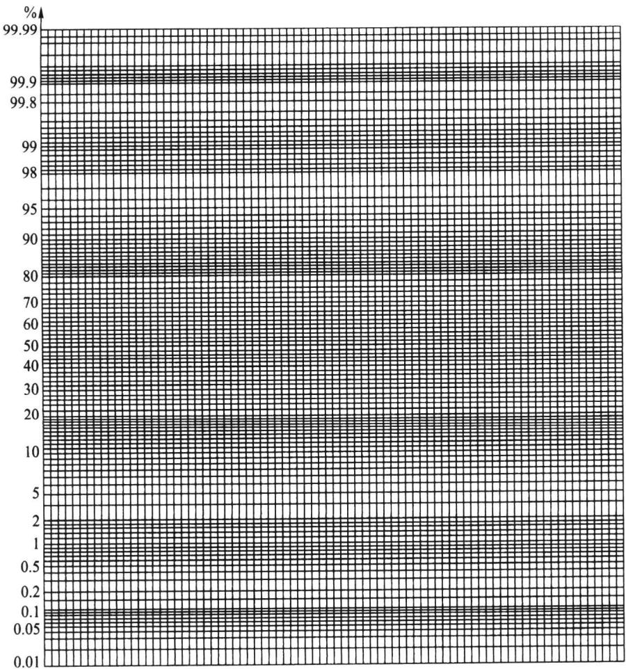
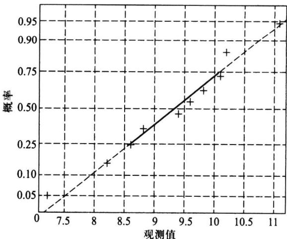
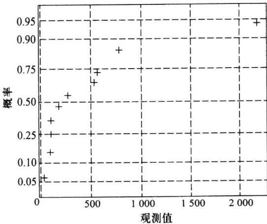
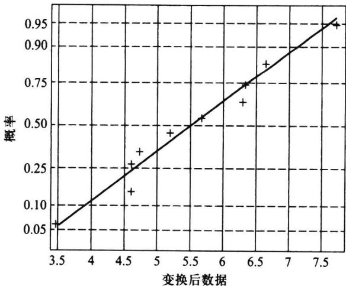

import Guide from '@/components/Guide.astro';
import Knowledge from '@/components/Knowledge.astro';
import Example from '@/components/Example.astro';
import Analysis from '@/components/Analysis.astro';
import Solution from '@/components/Solution.astro';
import Variant from '@/components/Variant.astro';
import Note from '@/components/Note.astro';
import Block from '@/components/Block.astro';
import Method from '@/components/Method.astro';
import Exercise from '@/components/Exercise.astro';

正态分布是最常用的分布,用来判断总体分布是否为正态分布的检验方法称为正态性检验,它在实际问题中大量使用.接下来我们先叙述简单而又直观的正态性检验——正态概率图,然后介绍国家标准 GB/T 4882-2001 中推荐的、并已被广泛应用的两种正态性检验方法——W 检验和 EP 检验.

## 7.5.1 正态概率纸

正态概率纸是一种特殊的坐标纸,其横坐标是等间隔的,纵坐标是按标准正态分布函数值给出的,见图 7.5.1.
正态概率纸可用来作正态性检验,方法如下:利用样本数据在概率纸上描点,用目测方法看这些点是否在一条直线附近,若是的话,可以认为该数据来自的总体为正态分布,若明显不在一条直线附近,则认为该数据来自非正态总体.具体操作步骤见下面的例子.

<Example title="例 7.5.1">
随机选取 10 个零件, 测得其直径与标准尺寸的偏差(单位: 丝, 1 丝 = 0.01 mm) 如下:
<figure class="vp-figure">
  
  <figcaption>图7.5.1 正态概率纸</figcaption>
</figure>
9.4 8.8 9.6 10.2 10.1 7.2 11.1 8.2 8.6 9.8
在正态概率纸上作图步骤如下：
（1）首先将数据按从小到大的次序排列： $x_{(1)} \leqslant x_{(2)} \leqslant \cdots \leqslant x_{(n)}$ ，具体数据为
7.2 8.2 8.6 8.8 9.4 9.6 9.8 10.1 10.2 11.1
(2) 对每一个 i, 计算修正频率 $\frac{i-0.375}{n+0.25}(i=1,2,\cdots,n)$ , 结果见表 7.5.1.
表 7.5.1 $x_{(i)}$ 取值及其修正频率
<table><tr><td>i</td><td> $x_{(i)}$ </td><td> $\frac{i-0.375}{n+0.25}$ </td><td>i</td><td> $x_{(i)}$ </td><td> $\frac{i-0.375}{n+0.25}$ </td></tr><tr><td>1</td><td>7.2</td><td>0.061</td><td>6</td><td>9.6</td><td>0.549</td></tr><tr><td>2</td><td>8.2</td><td>0.159</td><td>7</td><td>9.8</td><td>0.646</td></tr><tr><td>3</td><td>8.6</td><td>0.256</td><td>8</td><td>10.1</td><td>0.744</td></tr><tr><td>4</td><td>8.8</td><td>0.354</td><td>9</td><td>10.2</td><td>0.841</td></tr><tr><td>5</td><td>9.4</td><td>0.451</td><td>10</td><td>11.1</td><td>0.939</td></tr></table>
(3) 将点 $\left(x_{(i)},\frac{i-0.375}{n+0.25}\right)(i=1,2,\cdots,n)$ 逐一描在正态概率图上(图7.5.2),
<figure class="vp-figure">
  
  <figcaption>图7.5.2 例7.5.1的正态概率纸</figcaption>
</figure>
(4) 观察上述 n 个点的分布,作如下判断,
\- 若诸点在一条直线附近,则认为该批数据来自正态总体.
\- 若诸点明显不在一条直线附近,则认为该批数据的总体不是正态分布.
本例中,从图 7.5.2 上可以看到,10 个点基本在一条直线附近,故可认为直径与标准尺寸的偏差服从正态分布.
这里对“修正频率”作一点说明. 对应第 $i$ 个观测值 $x_{(i)}$ 的累计分布函数值 $F(x_{(i)}) = P(X \leqslant x_{(i)})$ 是一个概率, 可用频率作出估计, 即
$$
\hat {F} (x _ {(i)}) = \frac {\text {样本中小于等于} x _ {(i)} \text {的个数}}{\text {样本量}} = \frac {i}{n}.
$$
这个频率有合理的一面,但也有一些缺陷,即当 i=n 时该频率为 1,这意味着 x 的取值最大为 $x_{(n)}$ , 不可能再超过 $x_{(n)}$ , 这往往与实际不符,对此需要修正.常见的有如下两个修正频率:
$$
\hat {F} (x _ {(i)}) = \frac {i}{n + 1}, \quad \hat {F} (x _ {(i)}) = \frac {i - 3 / 8}{n + 1 / 4},
$$
国标 GB/T 4882-2001 推荐使用后者,但并不反对使用前者.本节中使用后者.
如果从正态概率纸上确认总体是非正态分布时,可对原始数据进行变换后再在正态概率纸上描点,若变换后的点在正态概率纸上近似在一条直线附近,则可以认为变换后的数据来自正态分布,这样的变换称为正态性变换.常用的正态性变换有如下三个:对数变换 $y=\ln x$ 、倒数变换 y=1/x 和根号变换 $y=\sqrt{x}$ ,它们都属于经典的博克斯-考克斯(Box-Cox)变换。
</Example>

<Example title="例 7.5.2">
随机抽取某种电子元件 10 个, 测得其寿命数据如下:
$$
\begin{array}{l l l l l} 1 1 0. 4 7 & 9 9. 1 6 & 9 7. 0 4 & 3 2. 6 2 & 2 2 6 9. 8 2 \end{array}
$$
图 7.5.3 给出这 10 个点在正态概率纸上的图形, 这 10 个点明显不在一条直线附近, 所以可认为该电子元件的寿命的分布不是正态分布. 对该 10 个寿命数据作对数变换, 结果见表 7.5.2.
<figure class="vp-figure">
  
  <figcaption>图 7.5.3 例 7.5.2 的正态概率纸</figcaption>
</figure>
表 7.5.2 对数变换后的数据
<table><tr><td>i</td><td> $x_{(i)}$ </td><td> $\ln x_{(i)}$ </td><td> $\frac{i-0.375}{n+0.25}$ </td><td>i</td><td> $x_{(i)}$ </td><td> $\ln x_{(i)}$ </td><td> $\frac{i-0.375}{n+0.25}$ </td></tr><tr><td>1</td><td>32.62</td><td>3.484 9</td><td>0.061</td><td>6</td><td>286.80</td><td>5.658 8</td><td>0.549</td></tr><tr><td>2</td><td>97.04</td><td>4.575 1</td><td>0.159</td><td>7</td><td>539.35</td><td>6.290 4</td><td>0.646</td></tr><tr><td>3</td><td>99.16</td><td>4.596 7</td><td>0.256</td><td>8</td><td>561.10</td><td>6.329 9</td><td>0.744</td></tr><tr><td>4</td><td>110.47</td><td>4.704 7</td><td>0.354</td><td>9</td><td>782.93</td><td>6.663 0</td><td>0.841</td></tr><tr><td>5</td><td>179.49</td><td>5.190 1</td><td>0.451</td><td>10</td><td>2 269.82</td><td>7.727 5</td><td>0.939</td></tr></table>
利用表 7.5.2 中最后两列上的数据在正态概率纸上描点, 结果见图 7.5.4, 从图上可以看到 10 个点近似在一条直线附近, 说明对数变换后的数据可以看成来自正态分布. 这也意味着, 可认为原始数据服从对数正态分布.
</Example>

## 7.5.2 W 检验

W 检验是夏皮罗(Shapiro)和威尔克(Wilk)在 1965 年提出来的, 这个检验当 $8 \leqslant n \leqslant 50$ 时可以利用. 过小样本 $(n < 8)$ 对偏离正态分布的检验不太有效, 过大样本 $(n > 50)$ 的一些辅助量计算麻烦.
设 $x_{1}, x_{2}, \cdots, x_{n}$ 是来自正态总体 $N(\mu, \sigma^{2})$ 的样本， $x_{(1)} \leqslant x_{(2)} \leqslant \cdots \leqslant x_{(n)}$ 为其次序统计量，W 统计量定义为
<figure class="vp-figure">
  
  <figcaption>图 7.5.4 变换后数据的正态概率纸</figcaption>
</figure>
$$
W = \frac {\left[ \sum_ {i = 1} ^ {n} (a _ {i} - \overline {{a}}) (x _ {(i)} - \overline {{x}}) \right] ^ {2}}{\sum_ {i = 1} ^ {n} (a _ {i} - \overline {{a}}) ^ {2} \sum_ {i = 1} ^ {n} (x _ {(i)} - \overline {{x}}) ^ {2}},\tag{7.5.1}
$$
其中系数 $a_{1}, a_{2}, \cdots, a_{n}$ 在样本容量为 n 时有特定的值，可查附表 6. 对于假设 $H_{0}$ : 总体分布为 $N(\mu, \sigma^{2})$ ，其检验的拒绝域具有形式 $\{W \leqslant W_{\alpha}\}$ ，其中 $\alpha$ 分位数 $W_{\alpha}$ 可查附表 7.
我们下面介绍检验统计量的来历并给出另外的简化计算表达式,介绍过程中用到有关回归分析(见第八章)的一些知识.
我们分如下 5 步进行说明.
(1) W 检验统计量是 n 个数对 $(x_{(1)}, a_{1}), (x_{(2)}, a_{2}), \cdots, (x_{(n)}, a_{n})$ 的相关系数的平方, 因此, 对 $x_{(i)}$ 或对 $a_{i}$ 作线性变换, 该统计量值不变. 例如, 令 $u_{(i)} = \frac{x_{(i)} - \mu}{\sigma} (i = 1, 2, \cdots, n)$ , 则有
$$
W = \frac {\left[ \sum_ {i = 1} ^ {n} \left(x _ {(i)} - \overline {{x}}\right) \left(a _ {i} - \overline {{a}}\right) \right] ^ {2}}{\sum_ {i = 1} ^ {n} \left(x _ {(i)} - \overline {{x}}\right) ^ {2} \sum_ {i = 1} ^ {n} \left(a _ {i} - \overline {{a}}\right) ^ {2}} = \frac {\left[ \sum_ {i = 1} ^ {n} \left(u _ {(i)} - \overline {{u}}\right) \left(a _ {i} - \overline {{a}}\right) \right] ^ {2}}{\sum_ {i = 1} ^ {n} \left(u _ {(i)} - \overline {{u}}\right) ^ {2} \sum_ {i = 1} ^ {n} \left(a _ {i} - \overline {{a}}\right) ^ {2}}.\tag{7.5.2}
$$
这说明我们在利用 W 检验统计量时, 可以对原始样本观测值作适当的线性变换, 简化计算.
（2）设 $x_{1}, x_{2}, \cdots, x_{n}$ 是来自正态总体 $N(\mu, \sigma^{2})$ 的样本， $x_{(1)} \leqslant x_{(2)} \leqslant \cdots \leqslant x_{(n)}$ 为其次序统计量，则由 $u_{(i)} = \frac{x_{(i)} - \mu}{\sigma}$ 得到的 $u_{(1)} \leqslant u_{(2)} \leqslant \cdots \leqslant u_{(n)}$ 是来自标准正态分布 $N(0, 1)$ 的次序样本，显然，有
$$
x _ {(i)} = \sigma u _ {(i)} + \mu , \quad i = 1, 2, \dots , n.\tag{7.5.3}
$$
由于 $N(0,1)$ 不含任何未知参数，故其次序统计量 $u_{(i)}$ 的前二阶矩可算出，并且记
$$
\begin{array}{l} {E (u _ {(i)}) = m _ {i}, \quad i = 1, 2, \dots , n} \\ {\mathrm{Cov} (u _ {(i)}, u _ {(j)}) = v _ {i j}, \quad i, j = 1, 2, \dots , n,} \end{array}
$$
$$
\begin{array}{r l} & {\pmb {m} = \left( \begin{array}{c} {m _ {1}} \\ {m _ {2}} \\ {\vdots} \\ {m _ {n}} \end{array} \right) = (  m _ {1}  , m _ {2}  , \dots  , m _ {n}  ) ^ {\mathrm{T}},} \\ & {\pmb {V} = (  v _ {i j}  ) _ {n \times n}.} \end{array}
$$
当在(7.5.3)中用 $m_{i}$ 代替 $u_{(i)}$ 时会引起误差，若记误差为 $\varepsilon_{i}$ ，则可把(7.5.3)转化为
$$
x _ {(i)} = \sigma m _ {i} + \mu + \varepsilon_ {i}, \quad i = 1, 2, \dots , n.\tag{7.5.4}
$$
其中 $\boldsymbol{\varepsilon}=(\boldsymbol{\varepsilon}_{1},\boldsymbol{\varepsilon}_{2},\cdots,\boldsymbol{\varepsilon}_{n})^{\mathrm{T}}$ 是均值为零、协方差矩阵为 $\sigma^{2}V$ 的 n 维随机向量.
作一个直角坐标系, 横轴表示 $x_{(i)}$ , 纵轴表示 $m_i$ , 根据 (7.5.4) 式, 在这个坐标系中, $n$ 个点 $(x_{(1)}, m_1), (x_{(2)}, m_2), \cdots, (x_{(n)}, m_n)$ 应该大致成一条直线, 微小的误差是由 $\varepsilon_i$ 引起的. 怎样定量地衡量这些点接近直线的程度呢? 这正是 $W$ 检验的出发点. 夏皮罗和威尔克首先研究了 $x = (x_{(1)}, x_{(2)}, \cdots, x_{(n)})^{\mathrm{T}}$ 与 $m = (m_1, m_2, \cdots, m_n)^{\mathrm{T}}$ 的相关系数
$$
r ^ {2} = \frac {\left[ \sum_ {i = 1} ^ {n} \left(x _ {(i)} - \bar {x}\right) \left(m _ {i} - \overline {{m}}\right) \right] ^ {2}}{\sum_ {i = 1} ^ {n} \left(x _ {(i)} - \bar {x}\right) ^ {2} \sum_ {i = 1} ^ {n} \left(m _ {i} - \overline {{m}}\right) ^ {2}}.\tag{7.5.5}
$$
显然， $r^{2}$ 越是接近 $1, x = (x_{(1)}, x_{(2)}, \cdots, x_{(n)})^{\mathrm{T}}$ 与 $m = (m_{1}, m_{2}, \cdots, m_{n})^{\mathrm{T}}$ 的线性关系越是明显。所以，若用 $r^{2}$ 检验假设 $H_{0}$ ：总体分布为 $N(\mu, \sigma^{2})$ ，那么该检验的拒绝域具有形式 $\{r^{2} \leqslant c\}$ ，其中c为某个常数。
（3）由于 $\boldsymbol{m}=(m_{1},m_{2},\cdots,m_{n})^{\mathrm{T}}$ 完全确定，由标准正态分布的对称性可以证明 $m_{i}=-m_{n+1-i}$ ，即
$$
m _ {1} = - m _ {n}, \quad m _ {2} = - m _ {n - 1}, \quad \dots , \quad m _ {[ n / 2 ]} = - m _ {n + 1 - [ n / 2 ]},
$$
且当 $n$ 为奇数时， $m_{(n + 1) / 2} = 0.$ 由这一性质得
$$
\sum_ {i = 1} ^ {n} m _ {i} = 0, \quad \overline {{m}} = \frac {1}{n} \sum_ {i = 1} ^ {n} m _ {i} = 0.
$$
(4) 根据 3 中结论, (7.5.5) 式的分子部分可简化, 注意到
$$
\sum_ {i = 1} ^ {n} \left(x _ {(i)} - \overline {{x}}\right) \left(m _ {i} - \overline {{m}}\right) = \sum_ {i = 1} ^ {n} m _ {i} x _ {(i)} = \sum_ {i = 1} ^ {[ n / 2 ]} m _ {i} \left(x _ {(i)} - x _ {(n + 1 - i)}\right),
$$
若记 $b_{i} = \frac{m_{i}}{\sum_{j = 1}^{n}m_{j}^{2}}$ ，则可验证： $\hat{\sigma}_1 = \sum_{i = 1}^n b_i x_{(i)}$ 是正态标准差 $\sigma$ 的线性无偏估计（LUE），若
把(7.5.5)式变为
$$
r ^ {2} = \frac {\left[ \sum_ {i = 1} ^ {[ n / 2 ]} b _ {i} (x _ {(i)} - x _ {(n + 1 - i)}) \right] ^ {2} \sum_ {i = 1} ^ {n} m _ {i} ^ {2}}{\sum_ {i = 1} ^ {n} (x _ {(i)} - \overline {{{{x}}}}) ^ {2}} = \frac {\sum_ {i = 1} ^ {n} m _ {i} ^ {2}}{n - 1} \cdot \frac {\hat {\sigma} _ {1} ^ {2}}{s ^ {2}}.\tag{7.5.6}
$$
若撇开与样本无关的常数,则在正态性假设 $H_{0}$ 为真时,上式中分子与分母分别都是正态方差 $\sigma^2$ 的无偏估计, 相差不会很大. 可当 $H_0$ 为假时, 其差别就大了. 因为分子是在 $H_0$ 为真下构造, 而分母 $s^2$ 是通用的.
（5）为了在正态性假设 $H_0$ 为假时能扩大分子与分母的差异，加强区别非正态分布的能力，夏皮罗与威尔克把(7.5.6)的分子换用 $\sigma$ 的最小方差线性无偏估计（BLUE），然后再正则化，使最后得到的如下检验统计量 $W$ 位于0与1之间：
$$
W = \frac {\left[ \sum_ {i = 1} ^ {[ n / 2 ]} a _ {i} (x _ {(i)} - x _ {(n + 1 - i)}) \right] ^ {2}}{\sum_ {i = 1} ^ {n} (x _ {(i)} - \bar {x}) ^ {2}},\tag{7.5.7}
$$
其中诸 $a_{i}$ 可如下得到：
$$
\begin{array}{r l} & {\pmb {C} = (c _ {1}, c _ {2}, \dots , c _ {n}) = \frac {\pmb {m} ^ {\mathrm{T}} \pmb {V} ^ {- 1}}{\pmb {m} ^ {\mathrm{T}} \pmb {V} ^ {- 1} \pmb {m}},} \\ & {\pmb {a} = (a _ {1}, a _ {2}, \dots , a _ {n}) = \frac {\pmb {C}}{\sqrt {\pmb {C C}}} = \frac {\pmb {m} ^ {\mathrm{T}} \pmb {V} ^ {- 1}}{\sqrt {\pmb {m} ^ {\mathrm{T}} \pmb {V} ^ {- 1} \pmb {V} ^ {- 1} \pmb {m}}}.} \end{array}
$$
(7.5.7)式就是最常用的 W 检验的计算公式,其中诸 $a_{i}$ 可查附表 6.

<Example title="例 7.5.3">
某气象站收集了 44 个独立的年降雨量数据,资料如下(已排序):
$$
\begin{array}{c c c c c c c c c c c} 5 2 0 & 5 5 6 & 5 6 1 & 6 1 6 & 6 3 5 & 6 6 9 & 6 8 6 & 6 9 2 & 7 0 4 & 7 0 7 & 7 1 1 \\ \hline 7 1 3 & 7 1 4 & 7 1 9 & 7 2 7 & 7 3 5 & 7 4 0 & 7 4 4 & 7 4 5 & 7 5 0 & 7 7 6 & 7 7 7 \\ \hline 7 8 6 & 7 8 6 & 7 9 1 & 7 9 4 & 8 2 1 & 8 2 2 & 8 2 6 & 8 3 4 & 8 3 7 & 8 5 1 & 8 6 2 \\ \hline \text {873} & \text {879} & \text {889} & \text {900} & \text {904} & \text {922} & \text {926} & \text {952} & \text {963} & \text {1056} & \text {1074} \end{array}
$$
我们要根据这批数据作正态性检验.
为此,利用(7.5.7)式计算 W 值.首先由这批数据可算得
$$
\overline {{{x}}} = 7 8 5. 1 1 4, \quad \sum_ {i = 1} ^ {4 4} (x _ {(i)} - \overline {{{x}}}) ^ {2} = 6 3 0 8 7 2. 4 3,
$$
我们将计算 W 的过程列于表 7.5.3 中. 为便于计算, 值 $x_{(k)}$ , $x_{(n+1-k)}$ 和 $d_{k}=x_{(n+1-k)}-x_{(k)}$ 安排在同一行.
表 7.5.3 某一气象站收集的年降雨量
<table><tr><td>k</td><td> $x_{(k)}$ </td><td> $x_{(n+1-k)}$ </td><td> $d_k$ </td><td> $a_k(44)$ </td><td>k</td><td> $x_{(k)}$ </td><td> $x_{(n+1-k)}$ </td><td> $d_k$ </td><td> $a_k(44)$ </td></tr><tr><td>1</td><td>520</td><td>1 074</td><td>554</td><td>0.387 2</td><td>12</td><td>713</td><td>862</td><td>149</td><td>0.094 3</td></tr><tr><td>2</td><td>556</td><td>1 056</td><td>500</td><td>0.266 7</td><td>13</td><td>714</td><td>851</td><td>137</td><td>0.084 2</td></tr><tr><td>3</td><td>561</td><td>963</td><td>402</td><td>0.232 3</td><td>14</td><td>719</td><td>837</td><td>118</td><td>0.074 5</td></tr><tr><td>4</td><td>616</td><td>952</td><td>336</td><td>0.207 2</td><td>15</td><td>727</td><td>834</td><td>107</td><td>0.065 1</td></tr><tr><td>5</td><td>635</td><td>926</td><td>291</td><td>0.186 8</td><td>16</td><td>735</td><td>826</td><td>91</td><td>0.056 0</td></tr><tr><td>6</td><td>669</td><td>922</td><td>253</td><td>0.169 5</td><td>17</td><td>740</td><td>822</td><td>82</td><td>0.047 1</td></tr><tr><td>7</td><td>686</td><td>904</td><td>218</td><td>0.154 2</td><td>18</td><td>744</td><td>821</td><td>77</td><td>0.038 3</td></tr><tr><td>8</td><td>692</td><td>900</td><td>208</td><td>0.140 5</td><td>19</td><td>745</td><td>794</td><td>49</td><td>0.029 6</td></tr><tr><td>9</td><td>704</td><td>889</td><td>185</td><td>0.127 8</td><td>20</td><td>750</td><td>791</td><td>41</td><td>0.021 1</td></tr><tr><td>10</td><td>707</td><td>879</td><td>172</td><td>0.116 0</td><td>21</td><td>776</td><td>786</td><td>10</td><td>0.012 6</td></tr><tr><td>11</td><td>711</td><td>873</td><td>162</td><td>0.104 9</td><td>22</td><td>777</td><td>786</td><td>9</td><td>0.004 2</td></tr></table>
从表 7.5.3 可以计算出 W 的值为
$$
W = \frac {(0 . 3 8 7 2 \times 5 5 4 + 0 . 2 6 6 7 \times 5 0 0 + \cdots + 0 . 0 0 4 2 \times 9) ^ {2}}{6 3 0 8 7 2 . 4 3} = 0. 9 8 2.
$$
若取 $\alpha = 0.05$ ，查附表7，在 $n = 44$ 时给出 $W_{0.05} = 0.944$ ，由于计算得到的 $W$ 值大于该值，所以在显著性水平 $\alpha = 0.05$ 上不拒绝原假设，即可以认为该批数据服从正态分布.
</Example>

## 7.5.3 EP 检验

EP 检验即爱泼斯-普利(Epps-Pulley)检验(n≥8).
爱泼斯-普利检验对多种备择假设有较高的效率,其出发点是利用样本的特征函数与正态分布的特征函数的差的模的平方产生的一个加权积分得到的,我们这里简单地介绍该检验方法.
设 $x_{1}, x_{2}, \cdots, x_{n}$ 是来自正态总体 $N(\mu, \sigma^{2})$ 的样本，EP 检验统计量定义为
$$
T _ {\mathrm{EP}} = 1 + \frac {n}{\sqrt {3}} + \frac {2}{n} \sum_ {i = 2} ^ {n} \sum_ {j = 1} ^ {i - 1} \exp \left\{\frac {- (x _ {j} - x _ {i}) ^ {2}}{2 s _ {n} ^ {2}} \right\} - \sqrt {2} \sum_ {i = 1} ^ {n} \exp \left\{\frac {- (x _ {i} - \bar {x}) ^ {2}}{4 s _ {n} ^ {2}} \right\},\tag{7.5.8}
$$
其中 $\bar{x}, s_{n}^{2}$ 就是前述的样本均值和（除以 n 的）样本方差.
(7.5.8) 通常需要编程计算, 其拒绝域为 $\{T_{\mathrm{EP}} \geqslant T_{1 - \alpha, \mathrm{EP}}(n)\}$ , $T_{1 - \alpha, \mathrm{EP}}(n)$ 是样本容量为 $n$ 时 EP 检验统计量 (在原假设下的分布) 的 $1 - \alpha$ 分位数. 附表 11 给出了部分 $n$ 和一些常用 $1 - \alpha$ 对应的 $T_{\mathrm{EP}}$ 的分位数. 由于 $n = 200$ 时统计量 $T_{\mathrm{EP}}$ 的分位数已经非常接近 $n = \infty$ 时 $T_{\mathrm{EP}}$ 的分位数, 当 $n > 200$ 时, 统计量 $T_{\mathrm{EP}}$ 的分位数可以用 $n = 200$ 时的分位数代替. 对小于 200 而不在表内的 $n$ , 可采用线性插值的方法得到近似的分位数.
下面以国标中的一个例子说明该方法的应用.

<Example title="例 7.5.4">
现要考察某种人造丝纱线的断裂强度的分布类型,为此进行了 25 次试验,得到一个容量为 25 的样本,具体如下:
$$
\begin{array}{c c c c c c c c c c c c c} 1 4 7 & 1 8 6 & 1 4 1 & 1 8 3 & 1 9 0 & 1 2 3 & 1 5 5 & 1 6 4 & 1 8 3 & 1 5 0 & 1 3 4 & 1 7 0 \\ 1 4 4 & 9 9 & 1 5 6 & 1 7 6 & 1 6 0 & 1 7 4 & 1 5 3 & 1 6 2 & 1 6 7 & 1 7 9 & 7 8 & 1 7 3 & 1 6 8 \end{array}
$$
它们是在标准环境下采用适当单位得到的测量值.为检验总体分布是否是正态,采用EP检验,经过编程计算,得到
$$
T _ {\mathrm{EP}} = 0. 6 1 2.
$$
若取显著性水平 $\alpha = 0.01$ ，在附表11中通过线性插值得 $n = 25$ 时的0.99分位数约为 $0.564 + \frac{0.569 - 0.564}{30 - 20}\times (25 - 20) = 0.5665.$ 计算得到的 $T_{\mathrm{EP}}$ 大于该临界值.因此在显著性水平0.01下拒绝关于诸 $x_{j}$ 服从正态分布的原假设
进一步,有专家根据经验指出,该人造丝纱线的断裂强度可能服从对数正态分布,为此先计算对数变换 $y=\lg(204-x)$ 得到的样本值如下:
$$
\begin{array}{l l l l l l l l l} 1. 7 5 6 & 1. 2 5 5 & 1. 7 9 9 & 1. 3 2 2 & 1. 1 4 6 & 1. 9 0 8 & 1. 6 9 0 & 1. 6 0 2 \\ 1. 3 2 2 & 1. 7 3 2 & 1. 8 4 5 & 1. 5 3 1 & 1. 7 7 8 & 2. 0 2 1 & 1. 6 8 1 & 1. 4 4 7 \\ 1. 6 4 3 & 1. 4 7 7 & 1. 7 0 8 & 1. 6 2 3 & 1. 5 6 8 & 1. 3 9 8 & 2. 1 0 0 & 1. 4 9 1 & 1. 5 5 6 \end{array}
$$
这些对数观测值在正态概率图上似乎散布在一条直线附近.再考虑采用EP检验,经编程计算,得基于对数变换观测值的检验统计量值为0.006,它远远小于0.5665的临界值,这说明人造丝纱线的断裂强度服从对数正态分布.
</Example>

<Block title="习题7.5">
1. 在检验了一个车间生产的 20 个轴承外座圈的内径 (单位: mm) 后得到下面数据:
15.04 15.36 14.57 14.53 15.57 14.69 15.37 14.66 14.52 15.41
15.34 14.28 15.01 14.76 14.38 15.87 13.66 14.97 15.29 14.95
(1) 作正态概率图, 并作初步判断;
(2) 请用 W 检验方法检验这组数据是否来自正态分布 ( $\alpha=0.05$ ).
2. 抽查克矽平治疗矽肺患者 10 名, 得到他们治疗前后的血红蛋白量之差如下:
$$
2. 7 \quad - 1. 2 \quad - 1. 0 \quad 0 \quad 0. 7 \quad 2. 0 \quad 3. 7 \quad - 0. 6 \quad 0. 8 \quad - 0. 3
$$
(1) 作正态概率图, 并作初步判断;
(2) 请用 W 检验方法检验治疗前后的血红蛋白量之差是否服从正态分布 ( $\alpha=0.05$ ).
3. 某种岩石中的一种元素的含量在 25 个样本中为
0.32 0.25 0.29 0.25 0.28 0.30 0.23 0.23 0.40 0.32 0.35 0.19 0.34
0.33 0.33 0.28 0.28 0.22 0.30 0.24 0.35 0.24 0.30 0.23 0.22
有人认为该样本来自对数正态分布总体,请设法用 W 检验方法作检验 ( $\alpha=0.05$ ).
4. 对第 3 题的数据, 试用 EP 检验方法检验这些数据是否来自正态总体 (取 $\alpha=0.05$ ).
</Block>
