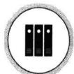
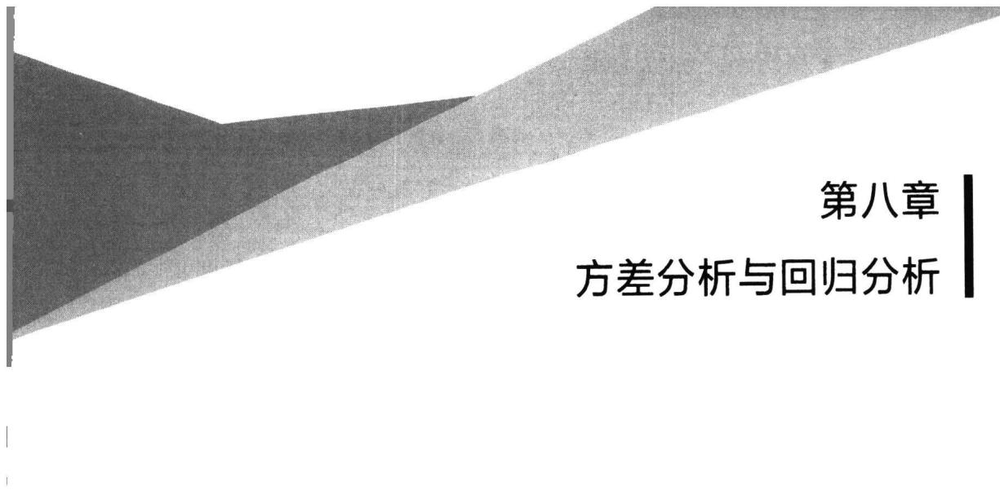

import Example from '@/components/Example.astro';
import Knowledge from '@/components/Knowledge.astro';
import Solution from '@/components/Solution.astro';
import Note from '@/components/Note.astro';
import Block from '@/components/Block.astro';

统计学的基本问题是利用观测到的样本推断总体.在统计推断中,我们对研究的总体常常要作一些假定,最常见的假定是假定总体分布为正态,这样的假定是比较强的.由于实际的总体与假定的总体往往会有差距,那么,这种做法将可能会引起推断结果的错误.这一问题促使人们去研究在总体分布假定比较弱的前提下,如何进行统计推断.非参数检验正是这样的一个领域.

本节,我们介绍几个常用的非参数检验方法.

## 7.6.1 游程检验

所有的统计推断方法常常要求数据随机取自同一个总体,有时由于种种原因,我们可能怀疑数据不符合随机选取的原则,此时需对数据进行随机性检验.

设 $x_{1}, x_{2}, \cdots, x_{n}$ 为依时间顺序连续得到的一组样本观测值序列. 记样本中位数为 $m_{e}$ ，把序列中小于 $m_{e}$ 的那些 $x_{i}$ 换成 0，大于或等于 $m_{e}$ 的那些 $x_{i}$ 换成 1. 这样我们就得到一个由 0 和 1 两个元素组成的序列. 我们把以 0 为界的一连串的 1 称为 1 游程，以 1 为界的一连串的 0 称为 0 游程，统称为游程. 例如序列

$$

\begin{array}{c c c c c c c c c c c c c} 0 & 1 & 0 & 1 & 1 & 1 & 0 & 1 & 1 & 0 & 1 & 0 & 0 \end{array}\tag{7.6.1}

$$

它有 5 个 0 游程和 4 个 1 游程.

设序列中 0 和 1 的个数分别为 $n_{1}$ 和 $n_{2}$ ，其和为样本量 n。一般来说， $n_{1}, n_{2}$ 都大于 0，设 R 表示序列的总游程数，则 R 的最小值是 2，最大值为 n，对于 (7.6.1) 式给出的序列, R=9. 若游程总数 R 的值过大(即 0 和 1 呈周期性变化的趋势), 或游程总数 R 的值过小(即序列的前一部分 0 占多数, 后一部分 1 占多数, 或者前一部分 1 占多数, 后一部分 0 占多数), 可以认为样本数据受到了某些非随机因素的干扰, 它不符合随机抽取的原则. 因此, 对于原假设

$H_{0}$ :样本序列符合随机抽取的原则,

该检验的拒绝域应具有形式 $\{R \leqslant c_1\} \cup \{R \geqslant c_2\}$ ，其中临界值 $c_1$ 和 $c_2$ 要根据 $H_0$ 为真时 $R$ 的分布确定。下面讨论 $H_0$ 为真时 $R$ 的分布，分 $R$ 为偶数与奇数两种情况进行。

由于0游程和1游程是交替出现的,所以,当R=2k时,必有0游程和1游程个数都是k;当 $R=2k+1$ 时,要么0游程个数是k且1游程个数是 $k+1$ ,要么1游程个数是k且0游程个数是 $k+1$ .

出现“k 个 0 游程”意味着 $n_{1}$ 个 0 被分成 k 组，这相当于将 $n_{1}$ 个不可分辨的球放入 k 个盒中且没有一个盒子是空的，依重复组合公式，共有

$$

\binom{n _ {1} - 1}{k - 1}

$$

种可能.所以,在 R=2k 时,k 个 0 游程共有 $\binom{n_{1}-1}{k-1}$ 种不同方式的安排,类似地,k 个 1 游程也共有 $\binom{n_{2}-1}{k-1}$ 种不同方式的安排.把 0 游程和 1 游程合在一起有两种可能,一种是 0 游程在前面而 1 游程在后面,另一种则反过来,1 游程在前面而 0 游程在后面.由此可知,出现 R=2k 的情况一共有

$$

2 \binom {n _ {1} - 1} {k - 1} \binom {n _ {2} - 1} {k - 1}

$$

种可能,而总的等可能结果一共有 $\begin{pmatrix}n_{1}+n_{2}\\n_{1}\end{pmatrix}$ 个,从而有

$$

P (R = 2 k) = \frac {2 \binom {n _ {1} - 1} {k - 1} \binom {n _ {2} - 1} {k - 1}}{\binom {n _ {1} + n _ {2}} {n _ {1}}}, \quad k = 1, 2, \dots , \left[ \frac {n}{2} \right].\tag{7.6.2}

$$

类似地, 在 $R=2k+1$ 时, 要么有 k 个 0 游程和 $k+1$ 个 1 游程, 要么有 $k+1$ 个 0 游程和 k 个 1 游程. 对前一种情况, 一定是以 1 游程开始也以 1 游程收尾, 共有 $\binom{n_{1}-1}{k-1}\binom{n_{2}-1}{k}$ 种可能, 对后一种情况, 共有 $\binom{n_{1}-1}{k}\binom{n_{2}-1}{k-1}$ 种可能, 于是有

$$

P (R = 2 k + 1) = \frac {\binom {n _ {1} - 1} {k - 1} \binom {n _ {2} - 1} {k} + \binom {n _ {1} - 1} {k} \binom {n _ {2} - 1} {k - 1}}{\binom {n _ {1} + n _ {2}} {n _ {1}}}, \quad k = 1, 2, \dots , \left[ \frac {n - 1}{2} \right].\tag{7.6.3}

$$

由(7.6.2)、(7.6.3)两式, 当 $n_{1}, n_{2}$ 都不太大时, 对于给定的 $\alpha (0 < \alpha < 1)$ , 可以计算出游程总数检验的临界值. 为方便使用, 人们编制了游程总数检验的临界值表(附表12). 应用中由(7.6.2)、(7.6.3)两式计算检验的 p 值则更加方便.

<Example title="例 7.6.1">
对某型号的 20 根电缆依次进行耐压试验, 测得数据如下:

$$

\begin{array}{l l l l l l l l l l} 1 5 6. 0 & 2 5 5. 5 & 1 3 2. 0 & 2 4 6. 7 & 8 6 7. 9 & 8 6. 4 & 6 1 0. 4 & 1 2 5. 7 & 1 5 0. 4 & 1 1 7. 6 \end{array}

$$

$$

\begin{array}{l l l l l l l l l l} 2 0 1. 9 & 2 0 7. 2 & 1 8 9. 8 & 5 8 5. 8 & 1 5 3. 1 & 5 6 5. 4 & 5 1 1. 0 & 5 6 7. 0 & 2 2 2. 3 & 1 4 1. 5 \end{array}

$$

这些数据能否认为受到非随机因素干扰？（例如测量仪器工作条件改变等的影响。）

<Solution title="解">
这些观测值的中位数是

$$

m _ {e} = \frac {1}{2} (2 0 1. 9 + 2 0 7. 2) = 2 0 4. 6.

$$

于是，将观测值小于204.6的数换成0，将大于204.6的数换成1，这样得到序列0 1 0 1 1 0 1 0 0 0 0 1 0 1 0 1 1 1 1 0

其中0与1的个数都是10, 游程总数 $R = 13$ . 若取 $\alpha = 0.05$ , 查附表12知, $P(R \leqslant 6) \leqslant 0.025 (c_1 = 6)$ , $P(R \geqslant 16) \leqslant 0.025 (c_2 = 16)$ , 故其拒绝域为 $W = \{R \leqslant 6 \text{ 或 } R \geqslant 16\}$ , 如今 $6 < 13 < 16$ , 故可认为该批数据是随机选取的 (若取 $\alpha = 0.10$ , 结果是相同的).

我们也可以计算该检验的 p 值从而加以判断.为此,利用(7.6.2)和(7.6.3)式,可计算出游程 R 的分布,具体结果如下表:

<table><tr><td>r</td><td>P(R=r)</td><td>P(R≤r)</td><td>r</td><td>P(R=r)</td><td>P(R≤r)</td></tr><tr><td>2</td><td>0.000 0</td><td>0.000 0</td><td>11</td><td>0.171 9</td><td>0.585 9</td></tr><tr><td>3</td><td>0.000 1</td><td>0.000 1</td><td>12</td><td>0.171 9</td><td>0.757 8</td></tr><tr><td>4</td><td>0.000 9</td><td>0.001 0</td><td>13</td><td>0.114 6</td><td>0.872 4</td></tr><tr><td>5</td><td>0.003 5</td><td>0.004 5</td><td>14</td><td>0.076 4</td><td>0.948 8</td></tr><tr><td>6</td><td>0.014 0</td><td>0.018 5</td><td>15</td><td>0.032 7</td><td>0.981 5</td></tr><tr><td>7</td><td>0.032 7</td><td>0.051 2</td><td>16</td><td>0.014 0</td><td>0.995 5</td></tr><tr><td>8</td><td>0.076 4</td><td>0.127 6</td><td>17</td><td>0.003 5</td><td>0.999 0</td></tr><tr><td>9</td><td>0.114 6</td><td>0.242 2</td><td>18</td><td>0.000 9</td><td>0.999 9</td></tr><tr><td>10</td><td>0.171 9</td><td>0.414 1</td><td>19</td><td>0.000 1</td><td>1.000 0</td></tr></table>

检验的 $p$ 值为

$$

p = 2 \min \left\{P (R \leqslant 1 3), P (R \geqslant 1 3) \right\} = 2 \min \left\{0. 8 7 2 4, 1 - 0. 7 5 7 8 \right\} = 0. 4 8 4 4,

$$

若取显著性水平 $\alpha=0.1$ ，可认为这批数据符合随机抽取的原则。

在计算程序越来越先进的今天, 对比较大的 $n_1, n_2$ , 完全可以计算出 $R$ 的分布, 从而给出检验的拒绝域. 在实际应用中, 当 $n_1, n_2$ 很大时, 也可以使用渐近分布, 我们不加证明地给出如下结论: 当样本随机地取自同一总体, $n_1, n_2$ 都趋于无穷且 $n_1 / n_2$ 趋于常数 $c$ 时, 有

$$

\frac {R - \frac {2 n _ {1}}{1 + c}}{\sqrt {\frac {4 c n _ {1}}{(1 + c) ^ {2}}}} \xrightarrow {L} N (0, 1).

$$

当 $n_1, n_2$ 都比较大时，上式中的 $c$ 可用 $n_1 / n_2$ 代替，从而对给定的显著性水平 $\alpha$ ，两个临界值可近似取为

$$

c _ {1} = \left[ \frac {2 n _ {1} n _ {2}}{n _ {1} + n _ {2}} \left(1 + \frac {u _ {\alpha / 2}}{\sqrt {n _ {1} + n _ {2}}}\right) \right],

$$

$$

c _ {2} = \left[ \frac {2 n _ {1} n _ {2}}{n _ {1} + n _ {2}} \left(1 + \frac {u _ {1 - \alpha / 2}}{\sqrt {n _ {1} + n _ {2}}}\right) \right] + 1.

$$

研究表明, 当 $n_{1}, n_{2}$ 都大于 20 时, 上式近似效果是足够好的.

游程检验还可以用于检验两个总体是否有相同分布. 设 $x_{1}, x_{2}, \cdots, x_{n}$ 是来自总体 X 的样本, $y_{1}, y_{2}, \cdots, y_{m}$ 是来自总体 Y 的样本, 将两组样本合并在一起, 按由小到大的顺序排列为 $z_{1} \leqslant z_{2} \leqslant \cdots \leqslant z_{m+n}$ . 引入 $w_{i}$ 如下: 若 $z_{i}$ 是来自总体 X 的观察, 则 $w_{i} = 0$ , 否则 (即 $z_{i}$ 是来自总体 Y 的观察) $w_{i} = 1$ . 这样, 我们就得到一个由 0 与 1 两个元素组成的序列

$$

w _ {1}, w _ {2}, \dots , w _ {m + n}.\tag{7.6.4}

$$

在 X 与 Y 有相同的分布时， $x_{1}, x_{2}, \cdots, x_{n}, y_{1}, y_{2}, \cdots, y_{m}$ 可以看作是从同一个总体中抽取的样本，因而，序列(7.6.4)的总游程数 R 将是较大的。而在 X 与 Y 的分布不相同时，序列(7.6.4)的总游程数 R 将是较小的。例如，若总体 X 与 Y 分得很开，以至于它们的样本观测值彼此不重叠时，R 的值接近于 2，这时就有把握认为“两个分布不相同”。在一般场合，对于原假设 $H_{0}$ ：两个总体分布相同，混合样本的游程数越小就越倾向于拒绝原假设，故检验的拒绝域应具有形式 $\{R \leqslant c\}$ ，其中 c 为临界值，它可以由(7.6.2)和(7.6.3)两式算出，当然也可以据此算出检验的 p 值。
</Solution>
</Example>

## 7.6.2 符号检验

符号检验是一类重要的非参数检验,它主要用来对总体 p 分位数 $x_{p}$ 进行检验.对任一连续总体 X, 其 p 分位数 $x_{p}$ (0 &lt; p &lt; 1) 是存在且唯一的, 对 $x_{p}$ 的检验可参看如下例子进行.

<Example title="例 7.6.2">
设总体 X 为连续随机变量, 分布函数为 $F(x)$ , $x_{1}$ , $x_{2}$ , $\cdots$ , $x_{n}$ 是来自该总体的样本, 试检验假设“F 的中位数为 0”, 即检验如下假设

$$

H _ {0}: F (0) = 0. 5 \quad \mathrm{vs} \quad H _ {1}: F (0) \neq 0. 5.

$$

<Solution title="解">
作符号函数

$$

y _ {i} = \left\{ \begin{array}{l l} 1, & x _ {i} > 0, \\ 0, & x _ {i} \leqslant 0, \end{array} \right. S ^ {+} = \sum_ {i = 1} ^ {n} y _ {i}.

$$

即 $S^{+}$ 为 $x_{1}, x_{2}, \cdots, x_{n}$ 中取正数的个数. 直观上看, 在原假设成立时, $S^{+}$ 的取值不应过大也不应过小. 在 $H_{0}$ 为真时, $S^{+}$ 服从二项分布 $b(n, 0.5)$ , 从而, 可确定常数 $c_{1}, c_{2}$ , 使

$$

P (S ^ {+} \leqslant c _ {1}) \leqslant \alpha / 2, \quad P (S ^ {+} \geqslant c _ {2}) \leqslant \alpha / 2,

$$

该检验的拒绝域为 $\{0,1,2,\cdots,c_{1}\}\cup\{c_{2},c_{2}+1,\cdots,n\}$ .当然,这时使用检验的p值进行检验将会比较简单.

上述检验问题的统计量 $S^{+}$ ，通常被称为符号统计量。一般场合， $S^{+}$ 还可用来检验总体分布 F 的 p 分位数，具体如下：设 $x_{1}, x_{2}, \cdots, x_{n}$ 是来自总体 X 的样本，欲检验

$$

H _ {0}: x _ {p} \leqslant x _ {0} \quad \mathrm{vs} \quad H _ {1}: x _ {p} > x _ {0},\tag{7.6.5}

$$

其中 $F(x_{p})=p,x_{0}$ 是某个给定常数.

与上面例子一样,记

$$

y _ {i} = \left\{ \begin{array}{l l} 1, & x _ {i} > x _ {0}, \\ 0, & x _ {i} \leqslant x _ {0}, \end{array} \right.

$$

记 $\theta=P(y_{i}=1)=P(x_{i}-x_{0}>0)$ ，则 $y_{1},y_{2},\cdots,y_{n}$ 可以看作是来自二点分布 $b(1,\theta)$ 的样本，从而 $S^{+}=\sum_{i=1}^{n}y_{i}\sim b(n,\theta)$ ，在 $H_{0}$ 为真时，有

$$

\theta = P \left(y _ {i} = 1\right) = P \left(x _ {i} - x _ {0} > 0\right) \leqslant P \left(x _ {i} - x _ {p} > 0\right) = 1 - P \left(x _ {i} - x _ {p} \leqslant 0\right) = 1 - F \left(x _ {p}\right) = 1 - p.

$$

反之，若 $\theta \leqslant 1 - p$ ，则 $\theta = P(x_{i} - x_{0} > 0)\leqslant P(x_{i} - x_{p} > 0) = 1 - p$ ，从而 $x_{p}\leqslant x_{0}$ ，亦即 $H_0$ 为真.所以，检验问题(7.6.5)等价于检验问题

$$

H _ {0}: \theta \leqslant 1 - p \quad \mathrm{vs} \quad H _ {1}: \theta > 1 - p.\tag{7.6.6}

$$

检验问题(7.6.6)是二项分布参数的检验问题,由7.3节,该检验问题的统计量是 $S^{+}=\sum_{i=1}^{n}y_{i}$ ，拒绝域形式为

$$

W = \{S ^ {+} \geqslant c \}, c = \inf _ {k} \left\{k: \sum_ {i = k} ^ {n} {\binom {n} {i}} p _ {0} ^ {i} (1 - p _ {0}) ^ {n - i} \leqslant \alpha \right\},

$$

不难看出， $S^{+} = \sum_{i = 1}^{n}y_{i}$ 就是差值

$$

x _ {1} - x _ {0}, \quad x _ {2} - x _ {0}, \quad \dots , \quad x _ {n} - x _ {0}

$$

中取正号的个数.

上述统计量 $S^{+} = \sum_{i=1}^{n} y_{i}$ 亦称符号统计量. 利用符号统计量所做的检验称作符号检验.

当然,对符号检验,使用检验的 p 值较为简便.记 $S_{0}^{+}$ 为符号统计量的观测值,则检验问题(7.6.5)的检验的 p 值为

$$

p = P (S ^ {+} \geqslant S _ {0} ^ {+}) = \sum_ {i = S _ {0} ^ {+}} ^ {n} b (i; n, 1 - p),

$$

其中 $b(i;n,1 - p) = \binom{n}{i}(1 - p)^{i}p^{n - i}$ 表示二项分布的概率函数.

类似地,关于分位数其他类型假设检验问题的解详见表7.6.1,方便起见,我们用检验的p值形式列出.

表 7.6.1 三种假设下的符号检验

<table><tr><td> $H_0$ </td><td> $H_1$ </td><td>拒绝域形式</td><td>检验的p值</td></tr><tr><td> $x_p \leqslant x_0$ </td><td> $x_p >x_0$ </td><td> $W_1 = \{S^+ \geqslant c\}$ </td><td> $\sum_{i=S_0^+}^{n} b(i;n,1-p)$ </td></tr><tr><td> $x_p \geqslant x_0$ </td><td> $x_p < x_0$ </td><td> $W_{\text{II}} = \{S^+ \leqslant c\}$ </td><td> $\sum_{i=0}^{S_0^+} b(i;n,1-p)$ </td></tr><tr><td> $x_p = x_0$ </td><td> $x_p \neq x_0$ </td><td> $W_{\text{III}} = \{S^+ \leqslant c_1 \text{或} S^+ \geqslant c_2\}$ </td><td> $2\min \left\{ \sum_{i=0}^{S_0^+} b(i;n,1-p), \sum_{i=S_0^+}^{n} b(i;n,1-p) \right\}$ </td></tr></table>
</Solution>
</Example>

<Example title="例 7.6.3">
以往的资料表明,某种圆钢的 90% 的产品的硬度(单位: $kg/mm^{2}$ ) 不小于 103.为了检验这个结论是否仍旧属实,现在随机挑选 20 根圆钢进行硬度试验,测得其硬度分别是

<table><tr><td>142</td><td>134</td><td>119</td><td>98</td><td>131</td><td>102</td><td>154</td><td>122</td><td>93</td><td>137</td></tr><tr><td>86</td><td>119</td><td>161</td><td>144</td><td>158</td><td>165</td><td>81</td><td>117</td><td>128</td><td>113</td></tr></table>

试检验 $H_0: x_{0.10} \geqslant 103$ vs $H_1: x_{0.10} < 103 (\alpha = 0.05)$ .

<Solution title="解">
作差值 $x_{i} - 103$ ，得

$$

\begin{array}{r r r r r r r r r r} {3 9} & {3 1} & {1 6} & {- 5} & {2 8} & {- 1} & {5 1} & {1 9} & {- 1 0} & {3 4} \\ {- 1 7} & {1 6} & {5 8} & {4 1} & {5 5} & {6 2} & {- 2 2} & {1 4} & {2 5} & {1 0} \end{array}

$$

其中正值个数 $S_{0}^{+}=15$ ，检验的 p 值为

$$

p = P (S ^ {+} \leqslant 1 5) = \sum_ {i = 0} ^ {1 5} \binom {2 0} {i} 0. 1 ^ {i} 0. 9 ^ {2 0 - i} = 0. 0 4 3 <   0. 0 5,

$$

故拒绝 $H_{0}$ ，不能认为该种圆钢的 10% 分位数 $x_{0.10}$ 不小于 $103 \, kg/mm^{2}$ .

符号检验除了用于分位数的假设检验问题之外,还可用于成对数据的比较.
</Solution>
</Example>

<Example title="例 7.6.4">
工厂有两个化验室, 每天同时从工厂的冷却水中取样, 测量水中的含氯量(单位: $10^{-6}$ )一次, 记录如下:

<table><tr><td>i</td><td> $x_i$ (化验室 A)</td><td> $y_i$ (化验室 B)</td><td>差  $x_i - y_i$ </td></tr><tr><td>1</td><td>1.03</td><td>1</td><td>0.03</td></tr><tr><td>2</td><td>1.85</td><td>1.89</td><td>-0.04</td></tr><tr><td>3</td><td>0.74</td><td>0.9</td><td>-0.16</td></tr><tr><td>4</td><td>1.82</td><td>1.81</td><td>0.01</td></tr><tr><td>5</td><td>1.14</td><td>1.2</td><td>-0.06</td></tr><tr><td>6</td><td>1.65</td><td>1.7</td><td>-0.05</td></tr><tr><td>7</td><td>1.92</td><td>1.94</td><td>-0.02</td></tr><tr><td>8</td><td>1.01</td><td>1.11</td><td>-0.1</td></tr><tr><td>9</td><td>1.12</td><td>1.23</td><td>-0.11</td></tr><tr><td>10</td><td>0.9</td><td>0.97</td><td>-0.07</td></tr><tr><td>11</td><td>1.4</td><td>1.52</td><td>-0.12</td></tr></table>

问两个化验室测定的结果之间有无显著性差异？

分别记化验室 A 和 B 的测量误差为 $\xi$ 和 $\eta$ . 并假设 $\xi$ 和 $\eta$ 为连续随机变量, 相应的分布函数分别为 F 和 G. 本问题需要检验

$$

H _ {0}: F (x) = G (x) \quad \mathrm{vs} \quad H _ {1}: F (x) \neq G (x).

$$

显然,含氯量的测定值除了与化验室的不同有关外,还与当天的含氯量的多少有关,所以,我们可以认为 $x_{i}$ 与 $y_{i}$ 具有下列结构

$$

x _ {i} = \mu_ {i} + \xi_ {i}, \quad y _ {i} = \mu_ {i} + \eta_ {i}, \quad i = 1, 2, \dots , 1 1,

$$

其中未知参数 $\mu_{i}$ 为第 i 天水中的含氯量, $\xi_{i}$ 与 $\eta_{i}$ 为第 i 天的测量误差, $\xi_{1}, \xi_{2}, \cdots, \xi_{11}$ 相

互独立,共同分布为 $F, \eta_{1}, \eta_{2}, \cdots, \eta_{11}$ 相互独立,共同分布为 G.

不同日的两个数据 $x_{i}$ 与 $x_{j}$ 以及 $y_{i}$ 与 $y_{j}$ 不一定是同分布的，它们之间的差异不仅与测量误差有关，而且和 $\mu_{i}$ 与 $\mu_{j}$ 的差异有关，因此，它们之间缺乏可比性，很自然地，我们希望把 $\mu_{i}$ 的影响去掉.由于 $x_{i}$ 与 $y_{i}$ 是对应的，所以，我们考虑差

$$

z _ {i} = x _ {i} - y _ {i} = \xi_ {i} - \eta_ {i}, \quad i = 1, 2, \dots , 1 1.

$$

显然，在 $H_{0}: F(x) = G(x)$ 为真时，Z 的分布关于原点对称。此时可使用符号检验法，以 $S^{+}$ 表示 $z_{1}, z_{2}, \cdots, z_{11}$ 中正数的个数，此处 $S_{0}^{+} = 2$ ，故检验的 p 值为

$$

p = 2 \min \left\{P (S ^ {+} \leqslant 2), P (S ^ {+} \geqslant 2) \right\} = 2 \sum_ {i = 0} ^ {2} \binom {1 1} {i} 0. 5 ^ {1 1} = 0. 0 6 5 4.

$$

若显著性水平为 $\alpha=0.05$ ，则不能拒绝原假设。
</Example>

## 7.6.3 秩和检验

类似于例 7.6.1 的中位数检验以及例 7.6.4 的成对数据比较都可以采用符号检验。但有人指出符号检验的一个不足：它只利用了观测值与中心位置之差的正负号，而没有考虑到这些差的绝对值大小。事实上，这些差的绝对值大小度量了观测值距离中心的远近，如果把两者结合起来，自然可以期望检验效果更好，对此，威尔科克森（Wilcoxon）在 1945 年建立了符号秩和检验，下面我们简单介绍有关秩检验内容。

秩检验方法是建立在秩及秩统计量基础上的非参数方法,下面我们先介绍秩的概念.

<Knowledge title="定义 7.6.1">
设 $x_{1}, x_{2}, \cdots, x_{n}$ 是来自连续分布 $F(x)$ 的简单随机样本， $x_{(1)} \leqslant x_{(2)} \leqslant \cdots \leqslant x_{(n)}$ 是其观测值的有序样本，则观测值 $x_{i}$ 在有序样本中的序号 r 称为 $x_{i}$ 的秩，记为 $R_{i} = r$ .
</Knowledge>

<Note>
由于 $F(x)$ 是连续函数，因此， $R_{i}$ 不能唯一确定的概率为 0.
</Note>

<Example title="例 7.6.5">
设 n=6，观测值（单位：cm） $x_{1}, x_{2}, \cdots, x_{6}$ 分别为

$$

\begin{array}{l l l l l l} 1 9 6 & 2 2 4 & 1 7 1 & 2 4 1 & 1 6 2 & 1 9 3 \end{array}

$$

则 $x_{1}, x_{2}, \cdots, x_{6}$ 的秩 $R_{1}, R_{2}, \cdots, R_{6}$ 分别是 4, 5, 2, 6, 1, 3.
</Example>

<Knowledge title="定义 7.6.2">
设 $x_{1}, x_{2}, \cdots, x_{n}$ 是来自连续总体的样本， $R_{i}$ 是 $x_{i}$ 的秩，则 $R = (R_{1}, R_{2}, \cdots, R_{n})$ 称为 $(x_{1}, x_{2}, \cdots, x_{n})$ 的秩统计量。由 R 导出的统计量，也称为秩统计量。基于秩统计量的检验方法称为秩检验。

秩统计量最早由威尔科克森在 1945 年建立, 其背景如下: 设有一个连续总体 (可以是单一的总体, 也可以是成对数据的差) 关于某个参数 $\theta$ 对称, 其总体分布函数记为 $F(x-\theta)$ , 这里 $\theta$ 就是总体的中位数, 要检验的假设为

$$

H _ {0}: \theta = 0 \quad \mathrm{vs} \quad H _ {1}: \theta \neq 0.\tag{7.6.7}

$$

设 $x_{1}, x_{2}, \cdots, x_{n}$ 是来自该总体的样本，前面已经指出，对此检验问题是可以采用符号检验的，只需要统计 $x_{1}, x_{2}, \cdots, x_{n}$ 中大于 0 的个数即可。但威尔科克森建议采用如下符号秩和统计量。
</Knowledge>

<Knowledge title="定义 7.6.3">
设 $x_{1}, x_{2}, \cdots, x_{n}$ 是样本，记 $R_{i}$ 为 $|x_{i}|$ 在 $(|x_{1}|, |x_{2}|, \cdots, |x_{n}|)$ 中的秩，记

$$

I (x _ {i} > 0) = \left\{ \begin{array}{l l} 1, & x _ {i} > 0, \\ 0, & x _ {i} \leqslant 0. \end{array} \right.

$$

则称

$$

W ^ {+} = \sum_ {i = 1} ^ {n} R _ {i} I (x _ {i} > 0)

$$

为符号秩和统计量.用这个统计量所作的检验称为符号秩和检验.

与符号检验类似,对(7.6.7)表示的双侧检验问题,检验拒绝域为

$$

\left\{W ^ {+} \leqslant W _ {\alpha / 2} ^ {+} (n) \right\} \cup \left\{W ^ {+} \geqslant W _ {1 - \alpha / 2} ^ {+} (n) \right\}.

$$

附表 13 给出了 $n \leqslant 50$ 时满足条件 $P(W^{+} \leqslant W_{\alpha}^{+}(n)) \leqslant \alpha$ 的 $W_{\alpha}^{+}(n)$ ，至于满足条件 $P(W^{+} \geqslant W_{1-\alpha}^{+}(n)) \leqslant \alpha$ 的 $W_{1-\alpha}^{+}(n)$ ，它等于 $\frac{1}{2} n (n+1) - W_{\alpha}^{+}(n)$ .
</Knowledge>

<Example title="例 7.6.6">
(例 7.6.4 续) 对例 7.6.4 的资料, 利用符号秩和检验法, 检验假设

$$

H _ {0}: F (x) = G (x) \quad \mathrm{vs} \quad H _ {1}: F (x) \neq G (x).

$$

<Solution title="解">
将数据列表如下

<table><tr><td>i</td><td> $x_{i}$ (化验室 A)</td><td> $y_{i}$ (化验室 B)</td><td>差  $z_{i}=x_{i}-y_{i}$ </td><td>绝对值</td><td>秩</td></tr><tr><td>1</td><td>1.03</td><td>1</td><td>0.03</td><td>0.03</td><td>3</td></tr><tr><td>2</td><td>1.85</td><td>1.89</td><td>-0.04</td><td>0.04</td><td>4</td></tr><tr><td>3</td><td>0.74</td><td>0.9</td><td>-0.16</td><td>0.16</td><td>11</td></tr><tr><td>4</td><td>1.82</td><td>1.81</td><td>0.01</td><td>0.01</td><td>1</td></tr><tr><td>5</td><td>1.14</td><td>1.2</td><td>-0.06</td><td>0.06</td><td>6</td></tr><tr><td>6</td><td>1.65</td><td>1.7</td><td>-0.05</td><td>0.05</td><td>5</td></tr><tr><td>7</td><td>1.92</td><td>1.94</td><td>-0.02</td><td>0.02</td><td>2</td></tr><tr><td>8</td><td>1.01</td><td>1.11</td><td>-0.1</td><td>0.1</td><td>8</td></tr><tr><td>9</td><td>1.12</td><td>1.23</td><td>-0.11</td><td>0.11</td><td>9</td></tr><tr><td>10</td><td>0.9</td><td>0.97</td><td>-0.07</td><td>0.07</td><td>7</td></tr><tr><td>11</td><td>1.4</td><td>1.52</td><td>-0.12</td><td>0.12</td><td>10</td></tr></table>

于是 $W^{+} = \sum_{i=1}^{11} R_{i} I(z_{i} > 0) = 3 + 1 = 4$ . 若取 $\alpha = 0.05$ , 查附表 13, 得 $P(W^{+} \leqslant 10) \leqslant 0.025$ , $\frac{1}{2} \times 11 \times (11 + 1) - 10 = 56$ , 所以, 拒绝域为 $\{W^{+} \leqslant 10\} \cup \{W^{+} \geqslant 56\}$ , 此处观测值为 $W^{+} = 4$ , 因此, 拒绝原假设. 这与符号检验结论不一致. 事实上, 此处即使取显著性水平为 0.01, 查附表 13, 得 $P(W^{+} \leqslant 5) \leqslant 0.005$ , 仍然拒绝原假设.

本例中符号秩和检验与符号检验结论不同,其原因在于符号检验只使用了样本观测值的正负号信息,在这11个观测值中,虽然正的个数很少,只有2个,但还没有少到我们能够据之作出拒绝原假设的程度.而符号秩和检验不仅注意到11个观测值中正的个数很少,而且还关注如下事实:2个正的其绝对值也很小,在11个观测值的绝对值中排在第1和第3小的位置,由此,符号秩和检验就可以作出拒绝原假设的结论.通常认为,符号秩和检验比符号检验在此类场合更加有效.

关于符号秩和检验有以下几点说明：

（1）当总体分布为连续型时，样本 $x_{1}, x_{2}, \cdots, x_{n}$ 中以概率 1 不会有相同的，但在处理实际数据时，仍会碰到有相同的情况，比如 11, 12, 12, 15 四个观测值，习惯上称相同的几个变量值为一个“结”，这里“12”就是一个结，结外的秩是唯一的，结内的秩通常取这些相继秩数的算术平均值作为各个变量的秩。这样规定后，11, 12, 12, 15 四个观测值的秩就确定了，它们依次是 1, 2.5, 2.5, 4。

（2）我们这里以双侧检验为例给出了秩和检验，对两对单侧检验问题，处理是完全类似的，只是拒绝域为单侧而已.

(3) 可以证明在 $H_{0}$ 成立时, 有

$$

E (W ^ {+}) = \frac {n (n + 1)}{4}, \quad \mathrm{Var} (W ^ {+}) = \frac {n (n + 1) (2 n + 1)}{2 4},

$$

因此, 当 n>50 时可采用正态近似 $\frac{W^{+}-\frac{n(n+1)}{4}}{\sqrt{\frac{n(n+1)(2n+1)}{24}}} \xrightarrow{L} N(0,1)$ 计算检验临界值.

秩和检验是最常用的非参数检验方法,它的另一重要情形是:可用来对两个总体的位置进行比较.如比较两种工艺有无差别,比较某种方法有无效果等.一般提法如下:设有两个总体,其分布类型假定是一致的,但分布的中心位置可能不同.设一个总体的分布函数为 $F(x-\theta_{1}), x_{1}, x_{2}, \cdots, x_{m}$ 为来自该总体的样本,另一个总体的分布函数为 $F(x-\theta_{2}), y_{1}, y_{2}, \cdots, y_{n}$ 为其样本,人们经常需要比较 $\theta_{1}, \theta_{2}$ 的大小,如检验如下假设:

$$

\mathrm{I} \quad H _ {0}: \theta_ {1} \leqslant \theta_ {2} \quad \mathrm{vs} \quad H _ {1}: \theta_ {1} > \theta_ {2}.\tag{7.6.8}

$$

$$

\mathrm{II} \quad H _ {0}: \theta_ {1} \geqslant \theta_ {2} \quad \mathrm{vs} \quad H _ {1}: \theta_ {1} <   \theta_ {2}.\tag{7.6.9}

$$

$$

\mathrm{III} \quad H _ {0}: \theta_ {1} = \theta_ {2} \quad \mathrm{vs} \quad H _ {1}: \theta_ {1} \neq \theta_ {2}.\tag{7.6.10}

$$

正如前面多次提及,对上述三个检验问题,检验统计量是相同的,只是拒绝域不同.对此类检验问题,威尔科克森建立如下的秩和检验:将 $x_{1},x_{2},\cdots,x_{m},y_{1},y_{2},\cdots,y_{n}$ 共 $m+n$ 个观测值一起排序,产生对应的秩

$$

R = \left(Q _ {1}, Q _ {2}, \dots , Q _ {m}, R _ {1}, R _ {2}, \dots , R _ {n}\right),

$$

检验统计量定义为

$$

W = \sum_ {i = 1} ^ {n} R _ {i},

$$

此即 $y_{1}, y_{2}, \cdots, y_{n}$ 在混合样本中的秩的和，通常称为威尔科克森秩和统计量.

对(7.6.8)表示的检验问题 I, 直观上看, 当备择假设 $H_{1}$ 为真时, W 的值应偏小, 所以, 拒绝域为

$$

W _ {1} = \left\{W \leqslant W _ {\alpha} (m, n) \right\},

$$

临界值 $W_{\alpha}$ 可查附表 14 得到. 类似地, 检验问题 II, III 的拒绝域分别为

$$

W _ {\mathrm{II}} = \left\{W \geqslant W _ {1 - \alpha} (m, n) \right\},

$$

$$

W _ {\text { Ⅲ }} = \{W \leqslant W _ {\alpha / 2} (m, n) \text { 或 } W \geqslant W _ {1 - \alpha / 2} (m, n) \}.

$$
</Solution>
</Example>

<Example title="例 7.6.7">
对某种羊绒可利用先进的工艺处理其含脂率,为比较处理效果,特收集了 6 组处理前的羊绒和 5 组处理后的羊绒,测得其含脂率数据如下:

<table><tr><td>处理前</td><td>0.20</td><td>0.24</td><td>0.66</td><td>0.42</td><td>0.12</td><td>0.25</td></tr><tr><td>处理后</td><td>0.13</td><td>0.07</td><td>0.21</td><td>0.08</td><td>0.19</td><td></td></tr></table>

试问处理后的含脂率是否明显下降了？ $(\alpha=0.05)$

<Solution title="解">
可以合理假定羊绒的含脂率在处理前后分布类型是一致的,设处理前后的含脂率分布的中心位置分别为 $\theta_{1}, \theta_{2}$ , 则要检验的假设为

$$

H _ {0}: \theta_ {1} \leqslant \theta_ {2} \quad \mathrm{vs} \quad H _ {1}: \theta_ {1} > \theta_ {2}.

$$

为完成检验,将两组样本混合后,从大到小排序,求出相应的秩如下表:

<table><tr><td>混合样本</td><td>秩</td><td>处理后√</td></tr><tr><td>0.07</td><td>1</td><td>√</td></tr><tr><td>0.08</td><td>2</td><td>√</td></tr><tr><td>0.12</td><td>3</td><td></td></tr><tr><td>0.13</td><td>4</td><td>√</td></tr><tr><td>0.19</td><td>5</td><td>√</td></tr><tr><td>0.20</td><td>6</td><td></td></tr><tr><td>0.21</td><td>7</td><td>√</td></tr><tr><td>0.24</td><td>8</td><td></td></tr><tr><td>0.25</td><td>9</td><td></td></tr><tr><td>0.42</td><td>10</td><td></td></tr><tr><td>0.66</td><td>11</td><td></td></tr><tr><td></td><td></td><td>W=1+2+4+5+7=19</td></tr></table>

此处 $m = 6, n = 5$ ，若取 $\alpha = 0.05$ ，查附表14知 $W_{0.05}(6,5) = 20$ ，从而拒绝域为 $\{W \leqslant 20\}$ . 此处检验统计量值为19，所以应拒绝原假设，即认为处理后的含脂率下降了.

关于秩和检验有如下几点说明：

(1) 与符号秩和检验的第 1 点说明一样, 若数据中有结, 则取平均秩.

(2) 若记 $W_{1}$ 和 $W_{2}$ 分别为两组样本 $(x_{1}, x_{2}, \cdots, x_{m})$ 和 $(y_{1}, y_{2}, \cdots, y_{n})$ 在混合样本中的秩和，则

$$

W _ {1} + W _ {2} = 1 + 2 + \dots + (m + n) = \frac {(m + n) (m + n + 1)}{2}

$$

是一个常数.因此,在使用秩和检验法时,用 $W_{1}$ 与用 $W_{2}$ 作为检验的统计量是等价的.为编表方便,不失一般性,假定 $m\geqslant n$ .此假定的含义是指使用观测值个数少的那组观测值对应的秩和作为检验统计量,在例7.6.7中,处理前的观测值是6个,处理后的观测值是5个,故采用处理后的羊绒含脂率对应的秩和作为检验统计量.反之,如果处理前的观测值是5个而处理后的观测值是6个的话,就应采用处理前的羊绒含脂率对应的秩和作为检验统计量.

（3）可以证明 $W$ 的分布关于 $\frac{1}{2} n(m + n + 1)$ 是对称的，因此附表14仅给出了满足条件 $P\{W \leqslant W_{\alpha}(m, n)\} \leqslant \alpha$ 的临界值 $W_{\alpha}(m, n)$ ，如果需要满足条件 $P\{W \geqslant W_{1 - \alpha}(m, n)\} \leqslant \alpha$ 的临界值 $W_{1 - \alpha}(m, n)$ ，它等于 $n(m + n + 1) - W_{\alpha}(m, n)$ .

(4) 还可以证明

$$

E (\textbf {W}) = \frac {n (m + n + 1)}{2}, \quad \mathrm{Var} (\textbf {W}) = \frac {m n (m + n + 1)}{1 2}.

$$

因此,在样本容量较大时,可以用大样本近似公式

$$

W ^ {*} = \frac {W - \frac {n (m + n + 1)}{2}}{\sqrt {\frac {m n (m + n + 1)}{1 2}}} \sim N (0, 1).

$$

研究表明,在 m,n 都大于等于 20 时,这个近似效果已经很好.
</Solution>
</Example>

<Block title="习题7.6">
说明:除非特别指出,以下检验的显著性水平均取为 $\alpha=0.05$ .

1. 在某保险种类中,一次关于 2008 年的索赔数额(单位:元)的随机抽样为(按升序排列):

4 632 4 728 5 052 5 064 5 484 6 972 7 596 9 480

14 760 15 012 18 720 21 240 22 836 52 788 67 200

已知2007年的索赔数额的中位数为5063元.2008年索赔的中位数比前一年是否有所变化？请用双侧符号检验方法检验，求检验的 $p$ 值，并写出结论.

2. 1984 年一些国家每平方千米可开发水资源数据(单位:万度/年)如下表所示:

<table><tr><td>国家</td><td>每平方千米可开发水资源</td><td>国家</td><td>每平方千米可开发水资源</td></tr><tr><td>苏联</td><td>4.9</td><td>印度</td><td>8.5</td></tr><tr><td>巴西</td><td>4.1</td><td>哥伦比亚</td><td>26.3</td></tr><tr><td>美国</td><td>7.5</td><td>日本</td><td>34.9</td></tr><tr><td>加拿大</td><td>5.4</td><td>阿根廷</td><td>6.9</td></tr><tr><td>扎伊尔</td><td>28.1</td><td>印度尼西亚</td><td>7.9</td></tr><tr><td>墨西哥</td><td>4.9</td><td>瑞士</td><td>78.0</td></tr><tr><td>瑞典</td><td>22.3</td><td>罗马尼亚</td><td>10.1</td></tr><tr><td>意大利</td><td>16.8</td><td>西德</td><td>8.8</td></tr><tr><td>奥地利</td><td>58.6</td><td>英国</td><td>1.7</td></tr><tr><td>南斯拉夫</td><td>24.8</td><td>法国</td><td>11.5</td></tr><tr><td>挪威</td><td>37.4</td><td>西班牙</td><td>13.4</td></tr></table>

而当年中国的该项指标为 20 万度/年,请用符号检验方法检验:这 22 个国家每平方千米可开发的水

资源的中位数不高于中国. 求检验的 p 值, 并写出结论.

3. 下面是亚洲十个国家 1996 年的每 1000 个新生儿中的死亡数(按从小到大的次序排列):

日本 以色列 韩国 斯里兰卡 中国 叙利亚 伊朗 印度 孟加拉国 巴基斯坦

4 6 9 15 23 31 36 65 77 88

以 M 表示 1996 年亚洲国家中 1000 个新生儿中的死亡数的中位数，试检验： $H_{0}:M \geqslant 34$ vs $H_{1}:M < 34$ . 求检验的 p 值，并写出结论.

4. 某烟厂称其生产的每支香烟的尼古丁含量在 12 mg 以下. 实验室测定的该烟厂的 12 支香烟的尼古丁含量 (单位: mg) 分别为

<table><tr><td>16.7</td><td>17.7</td><td>14.1</td><td>11.4</td><td>13.4</td><td>10.5</td></tr><tr><td>13.6</td><td>11.6</td><td>12.0</td><td>12.6</td><td>11.7</td><td>13.7</td></tr></table>

该烟厂所说的尼古丁含量是否比实际要少？求检验的 $p$ 值，并写出结论.

5.9 名学生到英语培训班学习,培训前后各进行了一次水平测验,成绩为

<table><tr><td>学生编号i</td><td>1</td><td>2</td><td>3</td><td>4</td><td>5</td><td>6</td><td>7</td><td>8</td><td>9</td></tr><tr><td>入学前成绩 $x_{i}$ </td><td>76</td><td>71</td><td>70</td><td>57</td><td>49</td><td>69</td><td>65</td><td>26</td><td>59</td></tr><tr><td>入学后成绩 $y_{i}$ </td><td>81</td><td>85</td><td>70</td><td>52</td><td>52</td><td>63</td><td>83</td><td>33</td><td>62</td></tr><tr><td> $z_{i}=x_{i}-y_{i}$ </td><td>-5</td><td>-14</td><td>0</td><td>5</td><td>-3</td><td>6</td><td>-18</td><td>-7</td><td>-3</td></tr></table>

(1) 假设测验成绩服从正态分布,问学生的培训效果是否显著?

(2) 不假定总体分布,采用符号检验方法检验学生的培训效果是否显著;

(3) 采用符号秩和检验方法检验学生的培训效果是否显著. 三种检验方法结论相同吗?

6. 为了比较用来做鞋子后跟的两种材料的质量,选取了15个男子(他们的生活条件各不相同),每人穿着一双新鞋,其中一只是以材料A做后跟,另一只以材料B做后跟,其厚度均为10 mm,过了一个月再测量厚度,得到数据如下:

<table><tr><td>序号</td><td>1</td><td>2</td><td>3</td><td>4</td><td>5</td><td>6</td><td>7</td><td>8</td><td>9</td><td>10</td><td>11</td><td>12</td><td>13</td><td>14</td><td>15</td></tr><tr><td>材料A</td><td>6.6</td><td>7.0</td><td>8.3</td><td>8.2</td><td>5.2</td><td>9.3</td><td>7.9</td><td>8.5</td><td>7.8</td><td>7.5</td><td>6.1</td><td>8.9</td><td>6.1</td><td>9.4</td><td>9.1</td></tr><tr><td>材料B</td><td>7.4</td><td>5.4</td><td>8.8</td><td>8.0</td><td>6.8</td><td>9.1</td><td>6.3</td><td>7.5</td><td>7.0</td><td>6.5</td><td>4.4</td><td>7.7</td><td>4.2</td><td>9.4</td><td>9.1</td></tr></table>

问是否可以认定以材料 A 制成的后跟比材料 B 的耐穿？

(1) 设 $d_{i}=x_{i}-y_{i}(i=1,2,\cdots,15)$ 来自正态总体，结论是什么？

(2) 采用符号秩和检验方法检验, 结论是什么?

7. 某饮料商用两种不同配方推出了两种新的饮料, 现抽取了 10 位消费者, 让他们分别品尝两种饮料并加以评分, 从不喜欢到喜欢, 评分为 1\~10, 评分结果如下:

<table><tr><td>品尝者</td><td>1</td><td>2</td><td>3</td><td>4</td><td>5</td><td>6</td><td>7</td><td>8</td><td>9</td><td>10</td></tr><tr><td>A饮料</td><td>10</td><td>8</td><td>6</td><td>8</td><td>7</td><td>5</td><td>1</td><td>3</td><td>9</td><td>7</td></tr><tr><td>B饮料</td><td>6</td><td>5</td><td>2</td><td>2</td><td>4</td><td>6</td><td>4</td><td>5</td><td>9</td><td>8</td></tr></table>

问两种饮料评分是否有显著差异？

(1) 采用符号检验方法作检验；

(2) 采用符号秩和检验方法作检验.

8. 测试在有精神压力和没有精神压力时血压的差别,10个志愿者进行了相应的试验.结果为(单位:mmHg):

<table><tr><td>无精神压力</td><td>107</td><td>108</td><td>122</td><td>119</td><td>116</td><td>118</td><td>121</td><td>111</td><td>114</td><td>108</td></tr><tr><td>有精神压力</td><td>127</td><td>119</td><td>123</td><td>113</td><td>125</td><td>132</td><td>121</td><td>131</td><td>116</td><td>124</td></tr></table>

该数据是否表明有精神压力下的血压有所增加？

</Block>
