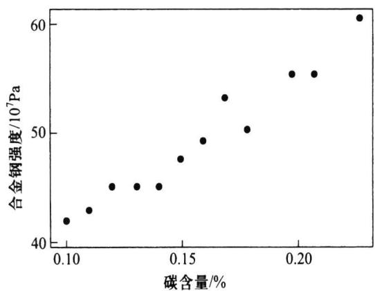
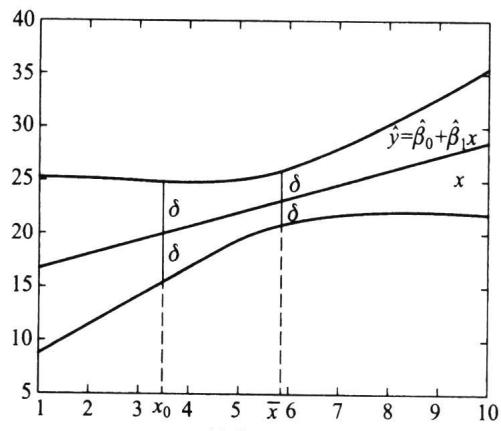
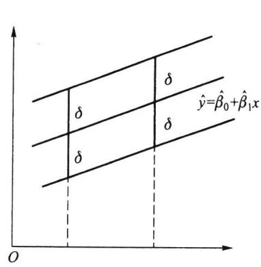
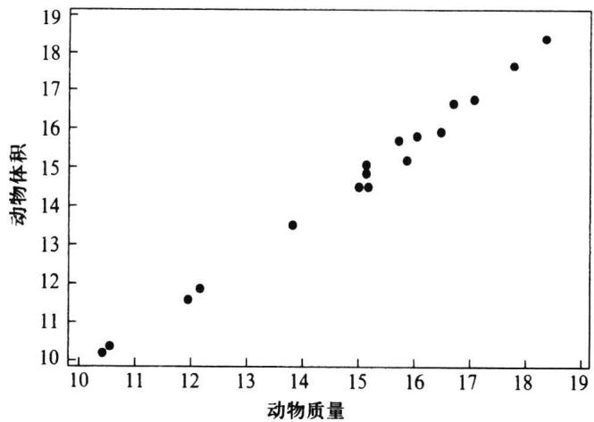

import Guide from '@/components/Guide.astro';
import Knowledge from '@/components/Knowledge.astro';
import Example from '@/components/Example.astro';
import Analysis from '@/components/Analysis.astro';
import Solution from '@/components/Solution.astro';
import Variant from '@/components/Variant.astro';
import Note from '@/components/Note.astro';
import Block from '@/components/Block.astro';
import Method from '@/components/Method.astro';
import Exercise from '@/components/Exercise.astro';

## 8.4.1 变量间的两类关系

早在 19 世纪, 英国生物学家兼统计学家高尔顿(Galton)在研究父与子身高的遗传问题时, 观察了 1078 对父与子, 用 $x$ 表示父亲身高, $y$ 表示成年儿子的身高, 发现将 $(x, y)$ 点在直角坐标系中, 这 1078 个点基本在一条直线附近, 并求出了该直线的方程 (单位: 英寸, 1 英寸 = 2.54 cm):
$$
\hat {y} = 3 3. 7 3 + 0. 5 1 6 x.
$$
这表明：
\- 父亲身高每增加 1 个单位, 其儿子的身高平均增加 0.516 个单位.
\- 高个子父辈生的儿子平均身高也高,但子辈的身高间的差距低于父辈间的身高差距(为0.516倍).
这便是子代的平均高度有向中心回归的趋势,使得一段时间内人的身高相对稳定.之后回归分析的思想渗透到了数理统计的其他分支中.随着计算机的发展,各种统计软件包的出现,回归分析的应用就越来越广泛.
回归分析处理的是变量与变量间的关系. 变量间常见的关系有两类: 一类称为确定性关系: 这些变量间的关系是完全确定的, 可以用函数 $y = f(x)$ 来表示, $x$ (可以是向量) 给定后, $y$ 的值就唯一确定了. 譬如正方形的面积 $S$ 与边长 $a$ 之间有关系 $S = a^2$ , 电路中有欧姆定律 $V = IR$ 等. 另一类称为相关关系: 变量间有关系, 但是不能用函数来表示. 譬如, 人的身高 $x$ 与体重 $y$ 两者间有相关关系, 一般来讲, 身高较高的人体重也较重, 但是同样身高的人的体重可以是不同的, 医学上就利用这两个变量间的相关关系, 给出了一些经验公式来确定一个人是否过于“肥胖”或“瘦小”; 人的脚掌的长度 $x$ 与身高 $y$ 两者间也有相关关系, 一般来讲, 脚掌较长的人身高也较高, 但是同样脚掌长度的人的身高可以是不同的, 早期公安机关在破案时, 常常根据罪犯留下的脚印来推测罪犯的身高.
变量间的相关关系不能用完全确定的函数形式表示,但在平均意义下有一定的定量关系表达式,寻找这种定量关系表达式就是回归分析的主要任务.
回归分析便是研究变量间相关关系的一门学科. 它通过对客观事物中变量的大量观察或试验获得的数据, 去寻找隐藏在数据背后的相关关系, 给出它们的表达形式——回归函数的估计.

## 8.4.2 一元线性回归模型

设 $y$ 与 $x$ 间有相关关系, 称 $x$ 为自变量 (预报变量), $y$ 为因变量 (响应变量), 在知道 $x$ 取值后, $y$ 的取值并不是确定的, 它是一个随机变量, 因此有一个分布, 这个分布是在知道 $x$ 的取值后 $Y$ 的条件密度函数 $p(y|x)$ , 我们关心的是 $y$ 的均值 $E(Y|x)$ , 它是 $x$
的函数,这个函数是确定性的:
$$
f (x) = E (Y \mid x) = \int_ {- \infty} ^ {\infty} y p (y \mid x) \mathrm{d} y.\tag{8.4.1}
$$
这便是 y 关于 x 的回归函数——条件期望, 也就是我们要寻找的相关关系的表达式.
以上的叙述是在 x 与 y 均为随机变量场合进行的, 这是一类回归问题. 实际中还有第二类回归问题, 其自变量 x 是可控变量 (一般变量), 只有 y 是随机变量, 它们之间的相关关系可用下式表示:
$$
y = f (x) + \varepsilon ,
$$
其中 $\varepsilon$ 是随机误差,一般假设 $\varepsilon \sim N(0, \sigma^{2})$ .由于 $\varepsilon$ 的随机性,导致 y 是随机变量.本节主要研究第二类回归问题.
进行回归分析首先是回归函数形式的选择,当只有一个自变量时,通常可采用画散点图的方法进行选择,具体见下例.

<Example title="例 8.4.1">
由专业知识知道,合金钢的强度 y (单位: $10^{7}$ Pa) 与合金钢中碳的含量 x (单位:%) 有关.为了生产强度满足用户需要的合金钢,在冶炼时如何控制碳的含量?如果在冶炼过程中通过化验得知了碳的含量,能否预测这炉合金钢的强度?
为解决这类问题就需要研究两个变量间的关系.首先是收集数据,我们把收集到的数据记为 $(x_{i},y_{i})(i=1,2,\cdots,n)$ .本例中,我们收集到12组数据,列于表8.4.1中.
表 8.4.1 合金钢强度 $y$ 与碳含量 $x$ 的数据
<table><tr><td>序号</td><td>x</td><td>y</td><td>序号</td><td>x</td><td>y</td></tr><tr><td>1</td><td>0.10</td><td>42.0</td><td>7</td><td>0.16</td><td>49.0</td></tr><tr><td>2</td><td>0.11</td><td>43.0</td><td>8</td><td>0.17</td><td>53.0</td></tr><tr><td>3</td><td>0.12</td><td>45.0</td><td>9</td><td>0.18</td><td>50.0</td></tr><tr><td>4</td><td>0.13</td><td>45.0</td><td>10</td><td>0.20</td><td>55.0</td></tr><tr><td>5</td><td>0.14</td><td>45.0</td><td>11</td><td>0.21</td><td>55.0</td></tr><tr><td>6</td><td>0.15</td><td>47.5</td><td>12</td><td>0.23</td><td>60.0</td></tr></table>
为找出两个变量间存在的回归函数的形式,可以画一张图:把每一数对 $(x_{i},y_{i})$ 看成直角坐标系中的一个点,在图上画出n个点,称这张图为散点图,见图8.4.1.
  
图 8.4.1 合金钢强度及碳含量的散点图
从散点图我们可以看出,12个点基本在一条直线附近,这说明两个变量之间有一个线性相关关系,若记y轴方向上的误差为 $\varepsilon$ ,这个相关关系可以表示为
$$
y = \beta_ {0} + \beta_ {1} x + \varepsilon .\tag{8.4.2}
$$
这便是 $y$ 关于 $x$ 的一元线性回归的数据结构式. 这里总假定 $x$ 为一般变量, 是非随机变量, 其值是可以精确测量或严格控制的, $\beta_0, \beta_1$ 为未知参数, $\beta_1$ 是直线的斜率, 它表示 $x$ 每增加一个单位 $E(y)$ 的增加量. $\varepsilon$ 是随机误差, 通常假定
$$
E (\varepsilon) = 0, \quad \mathrm{Var} (\varepsilon) = \sigma^ {2},\tag{8.4.3}
$$
在对未知参数作区间估计或假设检验时,还需要假定误差服从正态分布,即
$$
y \sim N (\beta_ {0} + \beta_ {1} x, \sigma^ {2}).\tag{8.4.4}
$$
显然,假定(8.4.4)比(8.4.3)要强.
由于 $\beta_{0}, \beta_{1}$ 均未知, 需要我们从收集到的数据 $(x_{i}, y_{i}) (i = 1, 2, \cdots, n)$ 出发进行估计. 在收集数据时, 我们一般要求观测独立地进行, 即假定 $y_{1}, y_{2}, \cdots, y_{n}$ 相互独立. 综合上述诸项假定, 我们可以给出最简单、常用的一元线性回归的统计模型
$$
\left\{ \begin{array}{l l} y _ {i} = \beta_ {0} + \beta_ {1} x _ {i} + \varepsilon_ {i}, & i = 1, 2, \dots , n, \\ \text {各} \varepsilon_ {i} \text {独立同分布,其分布为} N (0, \sigma^ {2}). \end{array} \right.\tag{8.4.5}
$$
由数据 $(x_{i},y_{i})(i=1,2,\cdots,n)$ 可以获得 $\beta_{0},\beta_{1}$ 的估计 $\hat{\beta}_{0},\hat{\beta}_{1}$ ，称
$$
\hat {y} = \hat {\beta} _ {0} + \hat {\beta} _ {1} x\tag{8.4.6}
$$
为 $y$ 关于 $x$ 的经验回归函数, 简称为回归方程, 其图形称为回归直线. 给定 $x = x_0$ 后, 称 $\hat{y}_0 = \hat{\beta}_0 + \hat{\beta}_1 x_0$ 为回归值 (在不同场合也称其为拟合值、预测值).
</Example>

## 8.4.3 回归系数的最小二乘估计

一般采用最小二乘方法估计模型(8.4.5)中的 $\beta_{0},\beta_{1}$ .令
$$
Q (\beta_ {0}, \beta_ {1}) = \sum_ {i = 1} ^ {n} (y _ {i} - \beta_ {0} - \beta_ {1} x _ {i}) ^ {2},
$$
$\hat{\beta}_0, \hat{\beta}_1$ 应该满足
$$
Q (\hat {\beta} _ {0}, \hat {\beta} _ {1}) = \min _ {\beta_ {0}, \beta_ {1}} Q (\beta_ {0}, \beta_ {1}),
$$
这样得到的 $\hat{\beta}_{0},\hat{\beta}_{1}$ 称为 $\beta_{0},\beta_{1}$ 的最小二乘估计,记为LSE.
由于 $Q \geqslant 0$ ，且对 $\beta_0, \beta_1$ 的导数存在，因此最小二乘估计可以通过求偏导数并命其为0而得到
$$
\left\{ \begin{array}{l} \frac {\partial Q}{\partial \beta_ {0}} = - 2 \sum_ {i = 1} ^ {n} (y _ {i} - \beta_ {0} - \beta_ {1} x _ {i}) = 0, \\ \frac {\partial Q}{\partial \beta_ {1}} = - 2 \sum_ {i = 1} ^ {n} (y _ {i} - \beta_ {0} - \beta_ {1} x _ {i}) x _ {i} = 0. \end{array} \right.\tag{8.4.7}
$$
这组方程称为正规方程组,经过整理,可得
$$
\left\{ \begin{array}{l} n \beta_ {0} + n \bar {x} \beta_ {1} = n \bar {y}, \\ n \bar {x} \beta_ {0} + \sum x _ {i} ^ {2} \beta_ {1} = \sum x _ {i} y _ {i}, \end{array} \right.\tag{8.4.8}
$$
（今后凡是不作说明“Σ”都表示“ $\sum_{i=1}^{n}$ ”）记
$$
\overline {{{x}}} = \frac {1}{n} \sum x _ {i}, \quad \overline {{{y}}} = \frac {1}{n} \sum y _ {i},
$$
$$
l _ {x y} = \sum (x _ {i} - \overline {{{x}}}) (y _ {i} - \overline {{{y}}}) = \sum x _ {i} y _ {i} - n \overline {{{x}}} \cdot \overline {{{y}}} = \sum x _ {i} y _ {i} - \frac {1}{n} \sum x _ {i} \sum y _ {i},
$$
$$
l _ {x x} = \sum (x _ {i} - \overline {{{x}}}) ^ {2} = \sum x _ {i} ^ {2} - n \overline {{{x}}} ^ {2} = \sum x _ {i} ^ {2} - \frac {1}{n} (\sum x _ {i}) ^ {2},
$$
$$
l _ {y y} = \sum (y _ {i} - \overline {{y}}) ^ {2} = \sum y _ {i} ^ {2} - n \overline {{y}} ^ {2} = \sum y _ {i} ^ {2} - \frac {1}{n} (\sum y _ {i}) ^ {2}.
$$
解(8.4.8)可得
$$
\left\{ \begin{array}{l} \hat {\beta} _ {1} = \frac {l _ {x y}}{l _ {x x}}, \\ \hat {\beta} _ {0} = \bar {y} - \hat {\beta} _ {1} \bar {x}. \end{array} \right.\tag{8.4.9}
$$
这就是参数的最小二乘估计,其计算通常可列表进行,见表8.4.2.

<Example title="例 8.4.2">
使用例 8.4.1 中合金钢强度和碳含量数据, 我们可求得回归方程, 见表 8.4.2.
表 8.4.2 合金钢强度和碳含量数据的计算表
<table><tr><td> $\sum x_{i} = 1.90$ </td><td> $n = 12$ </td><td> $\sum y_{i} = 589.5$ </td></tr><tr><td> $\overline{x} = 0.158\ 3$ </td><td></td><td> $\overline{y} = 49.125$ </td></tr><tr><td> $\sum x_{i}^{2} = 0.319\ 4$ </td><td> $\sum x_{i}y_{i} = 95.805$ </td><td> $\sum y_{i}^{2} = 29\ 304.25$ </td></tr><tr><td> $n\ \overline{x}^{2} = 0.300\ 8$ </td><td> $n\ \overline{x}\ \overline{y} = 93.337\ 5$ </td><td> $n\ \overline{y}^{2} = 28\ 959.19$ </td></tr><tr><td> $l_{xx} = 0.018\ 6$ </td><td> $l_{xy} = 2.467\ 5$ </td><td> $l_{yy} = 345.06$ </td></tr><tr><td></td><td> $\hat{\beta}_{1} = l_{xy}/l_{xx} = 132.66$ </td><td></td></tr><tr><td></td><td> $\hat{\beta}_{0} = \overline{y} - \hat{\beta}_{1}\ \overline{x} = 28.12$ </td><td></td></tr></table>
$(l_{yy}$ 在后面将会用到)由此给出回归方程为
$$
\hat {y} = 2 8. 1 2 + 1 3 2. 6 6 x.
$$
关于最小二乘估计的一些性质罗列在如下定理之中：
</Example>

<Knowledge title="定理 8.4.1">
在模型(8.4.5)下,有
(1) $\hat{\beta}_{0} \sim N\left(\beta_{0}, \left(\frac{1}{n} + \frac{\overline{x}^{2}}{l_{xx}}\right) \sigma^{2}\right)$ , $\hat{\beta}_{1} \sim N\left(\beta_{1}, \frac{\sigma^{2}}{l_{xx}}\right)$ ;
(2) $\operatorname{Cov}(\hat{\beta}_0, \hat{\beta}_1) = -\frac{\bar{x}}{l_{xx}} \sigma^2;$
（3）对给定的 $x_0, \hat{y}_0 = \hat{\beta}_0 + \hat{\beta}_1 x_0 \sim N\left(\beta_0 + \beta_1 x_0, \left(\frac{1}{n} + \frac{(x_0 - \bar{x})^2}{l_{xx}}\right) \sigma^2\right)$ .

<Solution title="证明">
利用 $\sum (x_{i} - \overline{x}) = 0$ ，可把 $\hat{\beta}_1$ 和 $\hat{\beta}_0$ 改写为
$$
\hat {\beta} _ {1} = \frac {l _ {x y}}{l _ {x x}} = \sum \frac {x _ {i} - \bar {x}}{l _ {x x}} y _ {i},
$$
$$
\hat {\beta} _ {0} = \overline {{y}} - \hat {\beta} _ {1} \overline {{x}} = \sum \left[ \frac {1}{n} - \frac {(x _ {i} - \overline {{x}}) \overline {{x}}}{l _ {x x}} \right] y _ {i}.
$$
它们是独立正态变量 $y_{1}, y_{2}, \cdots, y_{n}$ 的线性组合，故都服从正态分布，下面分别求其期望与方差.
$$
E (\hat {\beta} _ {1}) = \sum \frac {x _ {i} - \bar {x}}{l _ {x x}} E (y _ {i}) = \sum \frac {x _ {i} - \bar {x}}{l _ {x x}} (\beta_ {0} + \beta_ {1} x _ {i}) = \beta_ {1},
$$
$$
\operatorname{Var} (\hat {\boldsymbol {\beta}} _ {1}) = \sum \left(\frac {x _ {i} - \bar {x}}{l _ {x x}}\right) ^ {2} \operatorname{Var} (y _ {i}) = \sum \frac {(x _ {i} - \bar {x}) ^ {2}}{l _ {x x} ^ {2}} \sigma^ {2} = \frac {\sigma^ {2}}{l _ {x x}},
$$
$$
E (\hat {\beta} _ {0}) = E (\bar {y}) - E (\hat {\beta} _ {1}) \bar {x} = \beta_ {0} + \beta_ {1} \bar {x} - \beta_ {1} \bar {x} = \beta_ {0},
$$
$$
\operatorname{Var} (\hat {\beta} _ {0}) = \sum \left[ \frac {1}{n} - \frac {(x _ {i} - \bar {x}) \bar {x}}{l _ {x x}} \right] ^ {2} \operatorname{Var} (y _ {i}) = \left(\frac {1}{n} + \frac {\bar {x} ^ {2}}{l _ {x x}}\right) \sigma^ {2},
$$
这就证明了(1).进一步,考虑到诸 $y_{i}$ 之间的独立性,可得
$$
\operatorname{Cov} \left(\hat {\boldsymbol {\beta}} _ {0}, \hat {\boldsymbol {\beta}} _ {1}\right) = \operatorname{Cov} \left(\sum \left[ \frac {1}{n} - \frac {(x _ {i} - \bar {x}) \bar {x}}{l _ {x x}} \right] y _ {i}, \sum \frac {x _ {i} - \bar {x}}{l _ {x x}} y _ {i}\right) = \sum \left[ \frac {1}{n} - \frac {(x _ {i} - \bar {x}) \bar {x}}{l _ {x x}} \right] \frac {x _ {i} - \bar {x}}{l _ {x x}} \sigma^ {2} = - \frac {\bar {x}}{l _ {x x}} \sigma^ {2},
$$
这就证明了(2).为证明(3)，注意到 $\hat{y}_{0}=\hat{\beta}_{0}+\hat{\beta}_{1}x_{0}$ 也是 $y_{1},y_{2},\cdots,y_{n}$ 的线性组合，它也服从正态分布，只需求出其期望与方差即可.
$$
E (\hat {y} _ {0}) = E (\hat {\beta} _ {0}) + E (\hat {\beta} _ {1}) x _ {0} = \beta_ {0} + \beta_ {1} x _ {0} = E (y _ {0}),
$$
$$
\begin{array}{r l} \mathrm{Var} (\hat {y} _ {0}) & = \mathrm{Var} (\hat {\beta} _ {0}) + \mathrm{Var} (\hat {\beta} _ {1}) x _ {0} ^ {2} + 2 \mathrm{Cov} (\hat {\beta} _ {0}, \hat {\beta} _ {1}) x _ {0} \\ & = \left[ \left(\frac {1}{n} + \frac {\overline {{x}} ^ {2}}{l _ {x x}}\right) + \frac {x _ {0} ^ {2}}{l _ {x x}} - 2 \frac {x _ {0} \overline {{x}}}{l _ {x x}} \right] \sigma^ {2} = \left[ \frac {1}{n} + \frac {(x _ {0} - \overline {{x}}) ^ {2}}{l _ {x x}} \right] \sigma^ {2}, \end{array}
$$
证明完成.
</Solution>
</Knowledge>

定理8.4.1说明：
\- $\hat{\beta}_{0},\hat{\beta}_{1}$ 分别是 $\beta_0,\beta_1$ 的无偏估计；
\- $\hat{y}_0$ 是 $E(y_0) = \beta_0 + \beta_1x_0$ 的无偏估计.
\- 除 $\overline{x} = 0$ 外, $\hat{\beta}_0$ 与 $\hat{\beta}_1$ 是相关的.
\- 要提高 $\hat{\beta}_0, \hat{\beta}_1$ 的估计精度（即降低它们的方差）就要求 $n$ 大， $l_{xx}$ 大（即要求 $x_1, x_2, \dots, x_n$ 较分散）.

## 8.4.4 回归方程的显著性检验

从回归系数的 LSE 可以看出, 对任意给出的 n 对数据 $(x_{i}, y_{i})$ , 都可以求出 $\hat{\beta}_{0}, \hat{\beta}_{1}$
从而可写出回归方程 $\hat{y} = \hat{\beta}_0 + \hat{\beta}_1x$ ，但是这样给出的回归方程不一定有意义.
在使用回归方程以前,首先应对回归方程是否有意义进行判断.什么叫回归方程有意义呢?我们知道,建立回归方程的目的是寻找y的均值随x变化的规律,即找出回归方程 $E(y)=\beta_{0}+\beta_{1}x$ .如果 $\beta_{1}=0$ ,那么不管x如何变化,E(y)不随x的变化作线性变化,那么这时求得的一元线性回归方程就没有意义,或称回归方程不显著.如果 $\beta_{1}\neq0$ ,那么当x变化时,E(y)随x的变化作线性变化,那么这时求得的回归方程就有意义,或称回归方程是显著的.
综上,对回归方程是否有意义作判断就是要对如下的检验问题作出判断:
$$
H _ {0}: \beta_ {1} = 0 \qquad \mathrm{vs} \qquad H _ {1}: \beta_ {1} \neq 0,\tag{8.4.10}
$$
拒绝 $H_{0}$ 表示回归方程是显著的.
在一元线性回归中有三种等价的检验方法,使用中只要任选其中之一即可.下面分别加以介绍.

## 一、 $F$ 检验

采用方差分析的思想,我们从数据出发研究各 $y_{i}$ 不同的原因.首先引入记号并称 $\hat{y}_{i}=\hat{\beta}_{0}+\hat{\beta}_{1}x_{i}$ 为 $x_{i}$ 处的回归值,又称 $y_{i}-\hat{y}_{i}$ 为 $x_{i}$ 处的残差.
数据总的波动用总偏差平方和
$$
S _ {T} = \sum (y _ {i} - \bar {y}) ^ {2} = l _ {y y}
$$
表示.引起各 $y_{i}$ 不同的原因主要有两类因素：其一是 $H_0$ 可能不真，即 $\beta_{1} \neq 0$ ，从而 $E(y) = \beta_{0} + \beta_{1}x$ 随 $x$ 的变化而变化，即在每一个 $x$ 的观测值处的回归值不同，其波动用回归平方和
$$
S _ {R} = \sum (\hat {y} _ {i} - \overline {{y}}) ^ {2}\tag{8.4.11}
$$
表示;其二是其他一切因素,包括随机误差、x 对 $E(y)$ 的非线性影响等,这样在得到回归值以后,y 的观测值与回归值之间还有差距,这可用残差平方和
$$
S _ {e} = \sum \left(y _ {i} - \hat {y} _ {i}\right) ^ {2}\tag{8.4.12}
$$
表示.
为对上述诸平方和实施方差分析,下面我们要证明重要的平方和分解式,为此首先注意到 $\hat{\beta}_{0},\hat{\beta}_{1}$ 满足正规方程组(8.4.7),因此有
$$
\begin{array}{r l} & {\sum (y _ {i} - \hat {\beta} _ {0} - \hat {\beta} _ {1} x _ {i}) = 0 \Rightarrow \sum (y _ {i} - \hat {y} _ {i}) = 0,} \\ & {\sum (y _ {i} - \hat {\beta} _ {0} - \hat {\beta} _ {1} x _ {i}) x _ {i} = 0 \Rightarrow \sum (y _ {i} - \hat {y} _ {i}) x _ {i} = 0.} \end{array}
$$
利用 $\hat{y}_i = \hat{\beta}_0 + \hat{\beta}_1x_i = \overline{y} +\hat{\beta}_1(x_i - \overline{x})$ ，可得
$$
\sum \left(y _ {i} - \hat {y} _ {i}\right) (\hat {y} _ {i} - \bar {y}) = \sum \left(y _ {i} - \hat {y} _ {i}\right) [ \hat {\beta} _ {1} (x _ {i} - \bar {x}) ] = \hat {\beta} _ {1} [ \sum \left(y _ {i} - \hat {y} _ {i}\right) x _ {i} - \sum \left(y _ {i} - \hat {y} _ {i}\right) \bar {x} ] = 0,
$$
从而
$$
S _ {T} = \sum (y _ {i} - \bar {y}) ^ {2} = \sum (y _ {i} - \hat {y} _ {i} + \hat {y} _ {i} - \bar {y}) ^ {2} = \sum (y _ {i} - \hat {y} _ {i}) ^ {2} + \sum (\hat {y} _ {i} - \bar {y}) ^ {2},
$$
即
$$
S _ {T} = S _ {R} + S _ {e},\tag{8.4.13}
$$
上式就是一元线性回归场合下的平方和分解式.
关于 $S_{R}$ 和 $S_{e}$ 所含有的成分可由如下定理说明.

<Knowledge title="定理 8.4.2">
设 $y_{i}=\beta_{0}+\beta_{1}x_{i}+\varepsilon_{i}$ ，其中 $\varepsilon_{1},\varepsilon_{2},\cdots,\varepsilon_{n}$ 相互独立，且
$$
E (\varepsilon_ {i}) = 0, \quad \operatorname{Var} (\varepsilon_ {i}) = \sigma^ {2}, \quad i = 1, 2, \dots , n,
$$
沿用上面的记号,有
$$
\begin{array}{l} E (S _ {R}) = \sigma^ {2} + \beta_ {1} ^ {2} l _ {x x}, \\ E (S _ {e}) = (n - 2) \sigma^ {2}, \end{array}\tag{8.4.14}
$$
(8.4.15)
(8.4.15)式说明 $\hat{\sigma}^{2}=S_{e}/(n-2)$ 是 $\sigma^{2}$ 的无偏估计.

<Solution title="证明">
首先我们可以写出 $S_{R}$ 的简化公式：
$$
S _ {R} = \sum (\hat {y} _ {i} - \bar {y}) ^ {2} = \sum [ \bar {y} + \hat {\beta} _ {1} (x _ {i} - \bar {x}) - \bar {y} ] ^ {2} = \hat {\beta} _ {1} ^ {2} l _ {x x},\tag{8.4.16}
$$
从而
$$
E \left(S _ {R}\right) = E \left(\hat {\beta} _ {1} ^ {2}\right) l _ {x x} = \left[ \operatorname{Var} \left(\hat {\beta} _ {1}\right) + \left(E \left(\hat {\beta} _ {1}\right)\right) ^ {2} \right] l _ {x x} = \left(\frac {\sigma^ {2}}{l _ {x x}} + \beta_ {1} ^ {2}\right) l _ {x x} = \sigma^ {2} + \beta_ {1} ^ {2} l _ {x x},
$$
这就证明了(8.4.14).另外
$$
\begin{array}{r l} S _ {e} & = \sum (y _ {i} - \hat {y} _ {i}) ^ {2} = \sum (\beta_ {0} + \beta_ {1} x _ {i} + \varepsilon_ {i} - \hat {\beta} _ {0} - \hat {\beta} _ {1} x _ {i}) ^ {2} \\ & = \sum [ (\hat {\beta} _ {0} - \beta_ {0}) ^ {2} + x _ {i} ^ {2} (\hat {\beta} _ {1} - \beta_ {1}) ^ {2} + \varepsilon_ {i} ^ {2} + 2 (\hat {\beta} _ {0} - \beta_ {0}) (\hat {\beta} _ {1} - \beta_ {1}) x _ {i} - 2 (\hat {\beta} _ {0} - \beta_ {0}) \varepsilon_ {i} - 2 (\hat {\beta} _ {1} - \beta_ {1}) x _ {i} \varepsilon_ {i} ], \end{array}
$$
故
$$
\begin{array}{r l} E (S _ {e}) & = n \mathrm{Var} (\hat {\beta} _ {0}) + \sum x _ {i} ^ {2} \mathrm{Var} (\hat {\beta} _ {1}) + n \mathrm{Var} (\varepsilon_ {i}) + 2 n \overline {{{x}}} \mathrm{Cov} (\hat {\beta} _ {0}, \hat {\beta} _ {1}) - \\ & \quad 2 \sum E (\hat {\beta} _ {0} \varepsilon_ {i}) - 2 \sum x _ {i} E (\hat {\beta} _ {1} \varepsilon_ {i}). \end{array}
$$
将 $\hat{\beta}_{0},\hat{\beta}_{1}$ 写成 $y_{1},y_{2},\cdots,y_{n}$ 的线性组合，利用 $y_{j}$ 与 $\varepsilon_{i}(i\neq j)$ 的独立性，有
$$
E \left(\hat {\beta} _ {0} \varepsilon_ {i}\right) = E \left[ \varepsilon_ {i} \sum_ {j} \left(\frac {1}{n} - \frac {\left(x _ {j} - \bar {x}\right) \bar {x}}{l _ {x x}}\right) y _ {j} \right] = \left(\frac {1}{n} - \frac {\left(x _ {i} - \bar {x}\right) \bar {x}}{l _ {x x}}\right) \sigma^ {2},
$$
$$
E (\hat {\beta} _ {1} \varepsilon_ {i}) = E \left[ \varepsilon_ {i} \sum_ {j} \frac {x _ {j} - \bar {x}}{l _ {x x}} y _ {j} \right] = \frac {x _ {i} - \bar {x}}{l _ {x x}} \sigma^ {2},
$$
由此即有
$$
\sum E (\hat {\beta} _ {0} \varepsilon_ {i}) = \sigma^ {2}, \quad \sum x _ {i} E (\hat {\beta} _ {1} \varepsilon_ {i}) = \sigma^ {2}.
$$
从而
$$
E (S _ {e}) = n \left(\frac {1}{n} + \frac {\overline {{{x}}} ^ {2}}{l _ {x x}}\right) \sigma^ {2} + \sum \frac {x _ {i} ^ {2}}{l _ {x x}} \sigma^ {2} + n \sigma^ {2} - \frac {2 n \overline {{{x}}} ^ {2}}{l _ {x x}} \sigma^ {2} - 2 \sigma^ {2} - 2 \sigma^ {2}
$$
$$
= (1 + n - 4) \sigma^ {2} + \frac {1}{l _ {x x}} \sum (x _ {i} - \bar {x}) ^ {2} \sigma^ {2} = (n - 2) \sigma^ {2},
$$
这就完成了证明.
进一步,有关 $S_{R}$ 和 $S_{e}$ 的分布,有如下定理.
</Solution>
</Knowledge>

<Knowledge title="定理 8.4.3">
设 $y_{1}, y_{2}, \cdots, y_{n}$ 相互独立，且 $y_{i} \sim N(\beta_{0} + \beta_{1} x_{i}, \sigma^{2})$ , $i = 1, 2, \cdots, n$ ，则在上述记号下，有
(1) $S_{e} / \sigma^{2}\sim \chi^{2}(n - 2)$
(2) 若 $H_{0}$ 成立, 则有 $S_{R}/\sigma^{2}\sim\chi^{2}(1)$ ;
(3) $S_{R}$ 与 $S_{e}, \bar{y}$ 独立（或 $\hat{\beta}_{1}$ 与 $S_{e}, \bar{y}$ 独立）.

<Solution title="证明">
取 $n \times n$ 正交矩阵 $\mathbf{A}$ 具有如下形式：
$$
\boldsymbol {A} = \left( \begin{array}{c c c c} a _ {1 1} & a _ {1 2} & \dots & a _ {1 n} \\ \vdots & \vdots & & \vdots \\ a _ {n - 2, 1} & a _ {n - 2, 2} & \dots & a _ {n - 2, n} \\ \frac {x _ {1} - \bar {x}}{\sqrt {l _ {x x}}} & \frac {x _ {2} - \bar {x}}{\sqrt {l _ {x x}}} & \dots & \frac {x _ {n} - \bar {x}}{\sqrt {l _ {x x}}} \\ \frac {1}{\sqrt {n}} & \frac {1}{\sqrt {n}} & \dots & \frac {1}{\sqrt {n}} \end{array} \right),
$$
由正交性,可得如下一些约束条件:
$$
\begin{array}{r l} { \sum_ {j} a _ {i j} = 0, \quad  \sum_ {j} a _ {i j} x _ {j} = 0, \quad  \sum_ {j} a _ {i j} ^ {2} = 1, \quad i = 1, 2, \dots , n - 2,} \\ { \sum_ {k} a _ {i k} a _ {j k} = 0, \quad 1 \leqslant i <   j \leqslant n - 2,} \end{array}
$$
这里矩阵 A 共有 $n(n-2)$ 个未知参数, 约束条件有 $3(n-2)+\binom{n-2}{2}=(n-2)(n+3)/2$ 个, 只要 $n \geqslant 3$ , 未知参数个数就不少于约束条件数, 因此正交矩阵 A 必存在. 令
$$
\mathbf {Z} = \left( \begin{array}{c} z _ {1} \\ z _ {2} \\ \vdots \\ z _ {n} \end{array} \right) = \mathbf {A} \mathbf {Y} = \mathbf {A} \left( \begin{array}{c} y _ {1} \\ y _ {2} \\ \vdots \\ y _ {n} \end{array} \right) = \left( \begin{array}{c} \sum_ {j} a _ {1 j} y _ {j} \\ \vdots \\ \sum_ {j} a _ {n - 2, j} y _ {j} \\ \sum_ {j} \frac {x _ {j} - \bar {x}}{\sqrt {l _ {\mathrm{xx}}}} y _ {j} \\ \sum_ {j} \frac {1}{\sqrt {n}} y _ {j} \end{array} \right),
$$
其中
$$
\begin{array}{r l} z _ {n - 1} & = \frac {\sum (x _ {i} - \overline {{{x}}}) y _ {i}}{\sqrt {l _ {x x}}} = \frac {\sum (x _ {i} - \overline {{{x}}}) (y _ {i} - \overline {{{y}}})}{\sqrt {l _ {x x}}} = \frac {l _ {x y}}{\sqrt {l _ {x x}}} = \sqrt {l _ {x x}} \hat {\beta} _ {1}, \\ & \quad z _ {n} = \frac {1}{\sqrt {n}} \sum y _ {i} = \sqrt {n} \overline {{{y}}}, \end{array}
$$
则 Z 仍然服从 n 维正态分布,且其期望与协方差阵分别为
$$
E (\textbf {Z}) = \left( \begin{array}{c} 0 \\ \vdots \\ 0 \\ \beta_ {1} \sqrt {l _ {x x}} \\ \sqrt {n} (\beta_ {0} + \beta_ {1} \overline {{{x}}}) \end{array} \right), \quad \mathrm{Var} (\textbf {Z}) = A \mathrm{Var} (\textbf {Y}) A ^ {\mathrm{T}} = \sigma^ {2} I _ {n},
$$
这表明 $z_{1}, z_{2}, \cdots, z_{n}$ 相互独立， $z_{1}, z_{2}, \cdots, z_{n-2}$ 的共同分布为 $N(0, \sigma^{2})$ ， $z_{n-1} \sim N(\beta_{1} \sqrt{l_{xx}}, \sigma^{2})$ ， $z_{n} \sim N(\sqrt{n} (\beta_{0} + \beta_{1} \bar{x}), \sigma^{2})$ .
由于 $\sum z_{i}^{2} = \sum y_{i}^{2} = S_{T} + n\overline{y}^{2} = S_{R} + S_{e} + n\overline{y}^{2}$ ，而 $z_{n} = \sqrt{n}\overline{y},z_{n - 1} = \sqrt{l_{xx}}\hat{\beta}_{1} = \sqrt{S_{R}}$ ，于是有 $z_{1}^{2}+$ $z_{2}^{2} + \dots +z_{n - 2}^{2} = S_{e}$ ，所以 $S_{e},S_{R},\overline{y}$ 三者相互独立.并有
$$
S _ {e} / \sigma^ {2} = \sum_ {i = 1} ^ {n - 2} \left(z _ {i} / \sigma\right) ^ {2} \sim \chi^ {2} (n - 2),
$$
在 $\beta_{1} = 0$ 时，
$$
S _ {R} / \sigma^ {2} = \left(\frac {z _ {n - 1}}{\sigma}\right) ^ {2} \sim \chi^ {2} (1),
$$
证明完成.
如同方差分析那样,我们可以考虑采用如下 F 作为检验问题(8.4.10)的检验统计量:
$$
F = \frac {S _ {R}}{S _ {e} / (n - 2)}.
$$
在 $\beta_{1} = 0$ 时， $F \sim F(f_{R}, f_{e})$ ，其中 $f_{R} = 1, f_{e} = n - 2$ . 对于给定的显著性水平 $\alpha$ ，其拒绝域为 $F \geqslant F_{1 - \alpha}(1, n - 2)$ .
整个检验也可列成一张方差分析表. 检验也可用 p 值进行.
</Solution>
</Knowledge>

<Example title="例 8.4.3">
在合金钢强度的例 8.4.2 中, 我们已求出了回归方程, 这里我们考虑关于回归方程的显著性检验. 经计算有
$$
\begin{array}{l l} {S _ {T} = l _ {y y} = 3 4 5. 0 6,} & {f _ {T} = 1 1,} \\ {S _ {R} = \hat {\beta} _ {1} ^ {2} l _ {x x} = 1 3 2. 6 6 ^ {2} \times 0. 0 1 8   6 = 3 2 7. 3 4,} & {f _ {R} = 1,} \\ {S _ {e} = S _ {T} - S _ {R} = 3 4 5. 0 6 - 3 2 7. 3 4 = 1 7. 7 2,} & {f _ {e} = 1 0.} \end{array}
$$
把各平方和与自由度移入方差分析表,继续进行计算,具体见表8.4.3.
表 8.4.3 合金钢强度与碳含量回归方程的方差分析表
<table><tr><td>来源</td><td>平方和</td><td>自由度</td><td>均方</td><td>F比</td><td>p值</td></tr><tr><td>回归</td><td> $S_R=327.34$ </td><td> $f_R=1$ </td><td> $MS_R=327.34$ </td><td>184.94</td><td>0.000 0</td></tr><tr><td>残差</td><td> $S_e=17.72$ </td><td> $f_e=10$ </td><td> $MS_e=1.77$ </td><td></td><td></td></tr><tr><td>总计</td><td> $S_T=345.06$ </td><td> $f_T=11$ </td><td></td><td></td><td></td></tr></table>
这里 $p$ 值很小, 因此, 在显著性水平 0.01 下回归方程是显著的.
</Example>

## 二、 $t$ 检验

对 $H_0: \beta_1 = 0$ 的检验也可基于 $t$ 分布进行. 由于 $\hat{\beta}_1 \sim N\left(\beta_1, \frac{\sigma^2}{l_{xx}}\right), \frac{S_e}{\sigma^2} \sim \chi^2(n - 2)$ , 且与 $\hat{\beta}_1$ 相互独立, 因此在 $H_0$ 为真时, 有
$$
t = \frac {\hat {\beta} _ {1}}{\hat {\sigma} / \sqrt {l _ {x x}}} \sim t (n - 2),\tag{8.4.17}
$$
其中 $\hat{\sigma} = \sqrt{S_e / (n - 2)}$ ，由于 $\sigma_{\hat{\beta}_1} = \frac{\sigma}{\sqrt{l_{xx}}}$ 因此称 $\hat{\sigma}_{\hat{\beta}_1} = \frac{\hat{\sigma}}{\sqrt{l_{xx}}}$ 为 $\hat{\beta}_1$ 的标准误，即 $\hat{\beta}_1$ 的标准差的估计.(8.4.17)式表示的 $t$ 统计量可用来检验假设 $H_0$ .对给定的显著性水平 $\alpha$ ，拒绝域为
$$
W = \left\{\mid t \mid > t _ {1 - \alpha / 2} (n - 2) \right\}.
$$

<Note>
意到 $t^{2}=F$ ，因此，t 检验与 F 检验是等同的。
以例 8.4.2 中数据为例, 可以计算得到
$$
t = \frac {1 3 2 . 6 6}{\sqrt {1 . 7 7} / \sqrt {0 . 0 1 8 6}} = 1 3. 5 9 9 1.
$$
若取 $\alpha = 0.01$ ，则 $t_{0.995}(10) = 3.1693$ ，由于13.599 $1 > 3.1693$ ，因此，在显著性水平0.01下回归方程是显著的.
</Note>

## 三、相关系数检验

考察一元线性回归方程能否反映两个随机变量 x 与 y 间的线性相关关系时, 它的显著性检验还可通过对二维总体相关系数 $\rho$ 的检验进行. 它的一对假设是
$$
H _ {0}: \rho = 0 \quad \text { vs } \quad H _ {1}: \rho \neq 0.\tag{8.4.18}
$$
所用的检验统计量为样本相关系数
$$
r = \frac {\sum (x _ {i} - \bar {x}) (y _ {i} - \bar {y})}{\sqrt {\sum (x _ {i} - \bar {x}) ^ {2} \sum (y _ {i} - \bar {y}) ^ {2}}} = \frac {l _ {x y}}{\sqrt {l _ {x x} l _ {y y}}},\tag{8.4.19}
$$
其中 $(x_{i},y_{i})(i=1,2,\cdots,n)$ 是容量为n的二维样本.
利用施瓦茨不等式可以证明:样本相关系数也满足 $|r|\leqslant1$ ,其中等号成立的条件是存在两个实数a与b,使得对 $i=1,2,\cdots,n$ 几乎处处有 $y_{i}=a+bx_{i}$ .由此可见,n个点 $(x_{i},y_{i})(i=1,2,\cdots,n)$ 在散点图上的位置与样本相关系数r有关,譬如:
\- $r = \pm 1, n$ 个点完全在一条上升或下降的直线上.
\- $r > 0$ ，当 $x$ 增加时， $y$ 有线性增加趋势，此时称正相关.
\- $r < 0$ , 当 $x$ 增加时, $y$ 反而有线性减少趋势, 此时称负相关.
\- $r = 0, n$ 个点可能杂乱无章，也可能呈某种曲线趋势，此时称不相关.
根据样本相关系数的上述性质,检验(8.4.18)中原假设 $H_{0}:\rho=0$ 的拒绝域为 $W=\{|r|\geqslant c\}$ ，其中临界值c可由 $H_{0}:\rho=0$ 成立时样本相关系数的分布定出，该分布与自由度n-2有关.
对给定的显著性水平 $\alpha$ ，由 $P(W) = P(|r| \geqslant c) = \alpha$ 知，临界值 $c$ 应是 $H_0: \rho = 0$ 成立下 $|r|$ 的分布的 $1 - \alpha$ 分位数，故可记为 $c = r_{1 - \alpha}(n - 2)$ . 我们还可以用 $F$ 分布来确定临界值 $c$ ，下面加以叙述.
由样本相关系数的定义可以得到统计量 r 与 F 之间的关系
$$
r ^ {2} = \frac {l _ {x y} ^ {2}}{l _ {x x} l _ {y y}} = \frac {S _ {R}}{S _ {T}} = \frac {S _ {R}}{S _ {R} + S _ {e}} = \frac {S _ {R} / S _ {e}}{S _ {R} / S _ {e} + 1},
$$
而
$$
F = \frac {M S _ {R}}{M S _ {e}} = \frac {S _ {R}}{S _ {e} / (n - 2)} = \frac {(n - 2) S _ {R}}{S _ {e}}.
$$
两者综合,可得
$$
r ^ {2} = \frac {F}{F + (n - 2)}.
$$
这表明， $|r|$ 是 $F$ 的严格单调增函数，故可以从 $F$ 分布的 $1 - \alpha$ 分位数 $F_{1 - \alpha}(1,n - 2)$ 得到 $|r|$ 的 $1 - \alpha$ 分位数为
$$
c = r _ {1 - \alpha} (n - 2) = \sqrt {\frac {F _ {1 - \alpha} (1 , n - 2)}{F _ {1 - \alpha} (1 , n - 2) + n - 2}}.
$$
譬如，对 $\alpha = 0.01, n = 12$ ，查表知 $F_{0.99}(1,10) = 10.04$ ，于是
$$
r _ {0. 9 9} (1 0) = \sqrt {\frac {1 0 . 0 4}{1 0 . 0 4 + 1 0}} = 0. 7 0 7 8.
$$
为实际使用方便,人们已对 $r_{1-\alpha}(n-2)$ 编制了专门的表,见附表 9.
以例 8.4.2 中数据为例, 可以计算得到
$$
r = \frac {2 . 4 6 7 5}{\sqrt {0 . 0 1 8 6} \times 3 4 5 . 0 6} = 0. 9 7 4 0.
$$
若取 $\alpha=0.01$ ，查附表9知则 $r_{0.99}(10)=0.708$ ，由于0.9740>0.708，因此，在显著性水平0.01下回归方程是显著的。

<Note>
上述三个检验在考察一元线性回归时是等价的,但在多元线性回归场合,经推广 F 检验仍可用,另两个检验就无法使用了.
</Note>

## 8.4.5 估计与预测

当回归方程经过检验是显著的后, 可用来作估计和预测. 这是两个不同的问题:
\- 当 $x = x_0$ 时，寻求均值 $E(y_0) = \beta_0 + \beta_1x_0$ 的点估计与区间估计（注意这里 $E(y_0)$ 是常量），这是估计问题.
\- 当 $x = x_0$ 时, $y_0$ 的观测值在什么范围内? 由于 $y_0$ 是随机变量, 一般只求一个区间, 使 $y_0$ 落在这一区间的概率为 $1 - \alpha$ , 即要求 $\delta$ , 使 $P(|y_0 - \hat{y}_0| \leqslant \delta) = 1 - \alpha$ , 称区间 $[\hat{y}_0 -$ $\delta, \hat{y}_0 + \delta]$ 为 $y_0$ 的概率为 $1 - \alpha$ 的预测区间，这是预测问题.

## 一、 $E(y_{0})$ 的估计

在 $x = x_0$ 时，其对应的因变量 $y_0$ 是一个随机变量，有一个分布，我们经常需要对该分布的均值给出估计。我们知道，该分布的均值 $E(y_0) = \beta_0 + \beta_1x_0$ ，因此，一个直观的估计应为
$$
\hat {E} (y _ {0}) = \hat {\beta} _ {0} + \hat {\beta} _ {1} x _ {0}.
$$
简单起见,我们习惯上将上述估计记为 $\hat{y}_{0}$ （注意,作为估计这里 $\hat{y}_{0}$ 表示的是 $E(y_{0})$ 的估计,而不表示 $y_{0}$ 的估计,因为 $y_{0}$ 是随机变量,它不能被估计,但对其可以作预测.事实上,若预测 $y_{0}$ 的最可能取值,则 $y_{0}$ 的点预测也是 $\hat{y}_{0}$ .由于 $\hat{\beta}_{0},\hat{\beta}_{1}$ 分别是 $\beta_{0},\beta_{1}$ 的无偏估计,因此, $\hat{y}_{0}$ 也是 $E(y_{0})$ 的无偏估计.
为得到 $E(y_{0})$ 的区间估计, 我们需要知道 $\hat{y}_{0}$ 的分布. 由定理 8.4.1 可得
$$
\hat {y} _ {0} = \hat {\beta} _ {0} + \hat {\beta} _ {1} x _ {0} \sim N \left(\beta_ {0} + \beta_ {1} x _ {0}, \left(\frac {1}{n} + \frac {(x _ {0} - \bar {x}) ^ {2}}{l _ {x x}}\right) \sigma^ {2}\right),
$$
又由定理8.4.3知， $S_{e} / \sigma^{2}\sim \chi^{2}(n - 2)$ ，且与 $\hat{y}_0 = \overline{y} +\hat{\beta}_1(x_0 - \overline{x})$ 相互独立，记
$$
\hat {\sigma} ^ {2} = \frac {S _ {e}}{n - 2},
$$
则
$$
\frac {\left(\hat {y} _ {0} - E \left(y _ {0}\right)\right) / \sqrt {\frac {1}{n} + \frac {\left(x _ {0} - \bar {x}\right) ^ {2}}{l _ {x x}}} \sigma}{\sqrt {\frac {S _ {e}}{\sigma^ {2}} / (n - 2)}} = \frac {\hat {y} _ {0} - E \left(y _ {0}\right)}{\hat {\sigma} \sqrt {\frac {1}{n} + \frac {\left(x _ {0} - \bar {x}\right) ^ {2}}{l _ {x x}}}} \sim t (n - 2).
$$
于是 $E(y_0)$ 的 $1 - \alpha$ 的置信区间是
$$
\left[ \hat {y} _ {0} - \delta_ {0}, \hat {y} _ {0} + \delta_ {0} \right],\tag{8.4.20}
$$
其中
$$
\delta_ {0} = t _ {1 - \alpha / 2} (n - 2) \hat {\sigma} \sqrt {\frac {1}{n} + \frac {(x _ {0} - \bar {x}) ^ {2}}{l _ {x x}}}.\tag{8.4.21}
$$

## 二、 $y_{0}$ 的预测区间

(8.4.20)式给出了 $x = x_0$ 时对应的因变量的均值 $E(y_0)$ 的区间估计, 实用中往往更关心 $x = x_0$ 时对应的因变量 $y_0$ 的取值范围. 我们举一个不是非常贴切的例子说明这两者之间的差别: 设想你要去买一台某厂生产的某种型号的液晶电视, 则你很关心液晶电视的寿命——它能正常使用多长时间, 液晶电视的寿命是一个随机变量, 该厂生产的该型号的液晶电视寿命有一个分布, 其均值就是它的平均寿命, 当然, 这是一个重要的质量指标, 我们可以对它给出估计, 譬如, 平均寿命的 0.95 置信区间为 (3,7) (单位: 万小时). 然而, 作为消费者, 我们更关心的可能是所购买的这台液晶电视的寿命在一个什么范围内,我们所购买的这台液晶电视的寿命是一个随机变量,能否对该随机变量的取值给出一个预测区间呢?这就是我们这里要讨论的预测问题.
事实上， $y_{0}=E(y_{0})+\varepsilon$ ，由于通常假定 $\varepsilon\sim N(0,\sigma^{2})$ ，因此， $y_{0}$ 的最可能取值仍然为 $\hat{y}_{0}$ ，于是，我们可以使用以 $\hat{y}_{0}$ 为中心的一个区间
$$
[ \hat {y} _ {0} - \delta , \hat {y} _ {0} + \delta ]\tag{8.4.22}
$$
作为 $y_0$ 的取值范围，为确定 $\delta$ 的值，我们需要如下的结果：由于 $y_0$ 与 $\hat{y}_0$ 独立，故
$$
y _ {0} - \hat {y} _ {0} \sim N \left(0, \left(1 + \frac {1}{n} + \frac {\left(x _ {0} - \bar {x}\right) ^ {2}}{l _ {x x}}\right) \sigma^ {2}\right).
$$
因此有
$$
\frac {y _ {0} - \hat {y} _ {0}}{\hat {\sigma} \sqrt {1 + \frac {1}{n} + \frac {(x _ {0} - \bar {x}) ^ {2}}{l _ {x x}}}} \sim t (n - 2),
$$
从而(8.4.22)表示的预测区间中 $\delta$ 的表达式为
$$
\delta = \delta (x _ {0}) = t _ {1 - \alpha / 2} (n - 2) \hat {\sigma} \sqrt {1 + \frac {1}{n} + \frac {(x _ {0} - \bar {x}) ^ {2}}{l _ {x x}}}.\tag{8.4.23}
$$
上述预测区间与 $E(y_0)$ 的置信区间(8.4.21)的差别就在于根号里多个1,计算时要注意到这个差别,这个差别导致预测区间要比置信区间宽很多.
由(8.4.23)式可以看出预测区间的长度 $2\delta$ 与样本量n,x的偏差平方和 $l_{xx},x_{0}$ 到 $\overline{x}$ 的距离 $|x_{0}-\overline{x}|$ 有关. $x_{0}$ 愈远离 $\overline{x}$ ，预测精度就愈差.当 $x_{0}\notin[x_{(1)},x_{(n)}]$ 时，预测精度可能变得很差，在这种情况下的预测称作外推，需要特别小心.另外，若 $x_{1},x_{2},\cdots,x_{n}$ 较为集中时，那么 $l_{xx}$ 就较小，也会导致预测精度的降低.因此，在收集数据时要使 $x_{1},x_{2},\cdots,x_{n}$ 尽量分散，这对提高精度有利.图8.4.2(a)给出在不同的x值上预测区间的示意图：在 $x=\overline{x}$ 处预测区间最短，远离 $\overline{x}$ 的预测区间愈来愈长，两端呈喇叭状.
  
(a) 精确预测区间
  
图 8.4.2 预测区间示意图  
(b) 近似预测区间
当 n 较大时（如 n>30），t 分布可以用正态分布近似，进一步，若 $x_{0}$ 与 $\bar{x}$ 相差不大时， $\delta$ 可以近似取为
$$
\delta \approx u _ {1 - \alpha / 2} \hat {\sigma},\tag{8.4.24}
$$
其中 $u_{1-\alpha/2}$ 是标准正态分布的 $1-\alpha/2$ 分位数, 见图 8.4.2(b).

<Example title="例 8.4.4">
在例 8.4.2 中, 如果 $x_{0}=0.16$ , 则得预测值为
$$
\hat {y} _ {0} = 2 8. 1 2 + 1 3 2. 6 6 \times 0. 1 6 = 4 9. 3 5.
$$
若取 $\alpha=0.05$ ，则 $t_{0.975}(10)=2.2281$ ，又 $\hat{\sigma}=\sqrt{17.72/(12-2)}=1.3312$ ，应用（8.4.21）式，
$$
\delta_ {0} = 2. 2 2 8 1 \times 1. 3 3 1 2 \times \sqrt {\frac {1}{1 2} + \frac {(0 . 1 6 - 0 . 1 5 8 3) ^ {2}}{0 . 0 1 8 6}} = 0. 8 6.
$$
故 $x_0 = 0.16$ 对应因变量 $y_0$ 的均值 $E(y_0)$ 的0.95置信区间为
$$
[ 4 9. 3 5 \pm 0. 8 6 ] = [ 4 8. 4 9, 5 0. 2 1 ].
$$
应用(8.4.23)式，
$$
\delta = 2. 2 2 8 1 \times 1. 3 3 1 2 \times \sqrt {1 + \frac {1}{1 2} + \frac {(0 . 1 6 - 0 . 1 5 8 3) ^ {2}}{0 . 0 1 8 6}} = 3. 0 9,
$$
从而 $y_{0}$ 的概率为0.95的预测区间为
$$
[ 4 9. 3 5 \pm 3. 0 9 ] = [ 4 6. 2 6, 5 2. 4 4 ].
$$
我们可以清楚地看到, $E(y_{0})$ 的0.95置信区间比 $y_{0}$ 的概率为0.95的预测区间窄很多,这是因为随机变量的均值相对于随机变量本身而言波动更小.
如果求近似预测区间,则可按(8.4.24)式计算,由于 $u_{0.975}=1.96$ ,故有 $\delta\approx1.96\times1.3312=2.61$ ,则所求区间为
$$
[ 4 9. 3 5 - 2. 6 1, 4 9. 3 5 + 2. 6 1 ] = [ 4 6. 7 4, 5 1. 9 6 ].
$$
此处近似预测区间与精确预测区间相差较大,主要是因为 n 较小的原因.
下面我们以一个完整的例子把本节内容重新梳理一遍.
</Example>

<Example title="例 8.4.5">
在动物学研究中,有时需要找出某种动物的体积与质量的关系.因为动物的质量相对而言容易测量,而测量体积比较困难,因此,人们希望用动物的质量预测其体积.下面是18只某种动物的体积与质量数据,在这里,动物质量被看作自变量,用x表示,单位为kg,动物体积则作为因变量,用y表示,单位为 $dm^{3}$ ,18组数据列于表8.4.4中.
表 8.4.4 18 只某种动物的体积 $y$ 与质量 $x$ 数据
<table><tr><td>x</td><td>y</td><td>x</td><td>y</td><td>x</td><td>y</td></tr><tr><td>10.4</td><td>10.2</td><td>15.1</td><td>14.8</td><td>16.5</td><td>15.9</td></tr><tr><td>10.5</td><td>10.4</td><td>15.1</td><td>15.1</td><td>16.7</td><td>16.6</td></tr><tr><td>11.9</td><td>11.6</td><td>15.1</td><td>14.5</td><td>17.1</td><td>16.7</td></tr><tr><td>12.1</td><td>11.9</td><td>15.7</td><td>15.7</td><td>17.1</td><td>16.7</td></tr><tr><td>13.8</td><td>13.5</td><td>15.8</td><td>15.2</td><td>17.8</td><td>17.6</td></tr><tr><td>15.0</td><td>14.5</td><td>16.0</td><td>15.8</td><td>18.4</td><td>18.3</td></tr></table>
为能用动物质量估计动物体积,必须建立动物体积 y 关于动物质量 x 的回归方程.首先,我们用这 18 组数据画出散点图,见图 8.4.3.
  
图8.4.3 动物体积与动物质量的散点图
从散点图我们发现 18 个点基本在一条直线附近, 这说明两个变量之间在质量为 10 kg 到 20 kg 内有一个线性相关关系, 下面求该线性回归方程, 计算过程见表 8.4.5.
表 8.4.5 动物体积与质量数据的计算表
<table><tr><td> $\sum x_{i} = 270.1$ </td><td>n=18</td><td> $\sum y_{i} = 265.0$ </td></tr><tr><td> $\overline{x} = 15.005\ 6$ </td><td></td><td> $\overline{y} = 14.722\ 2$ </td></tr><tr><td> $\sum x_{i}^{2} = 4\ 149.39$ </td><td> $\sum x_{i}\ y_{i} = 4\ 071.71$ </td><td> $\sum y_{i}^{2} = 3\ 996.14$ </td></tr><tr><td> $n\ \overline{x}^{2} = 4\ 053.000\ 6$ </td><td> $n\ \overline{x}\ \overline{y} = 3\ 976.472\ 2$ </td><td> $n\ \overline{y}^{2} = 3\ 901.388\ 9$ </td></tr><tr><td> $l_{xx} = 96.389\ 4$ </td><td> $l_{xy} = 95.237\ 8$ </td><td> $l_{yy} = 94.751\ 1$ </td></tr><tr><td></td><td> $\hat{\beta}_{1} = l_{xy}/l_{xx} = 0.988\ 1$ </td><td></td></tr><tr><td></td><td> $\hat{\beta}_{0} = \overline{y} - \hat{\beta}_{1}\ \overline{x} = -0.104\ 8$ </td><td></td></tr></table>
由此给出回归方程为
$$
\hat {y} = - 0. 1 0 4 8 + 0. 9 8 8 1 x.\tag{8.4.25}
$$
接下来我们考虑关于回归方程的显著性检验.经计算有
$$
S _ {T} = l _ {y y} = 9 4. 7 5 1 1,
$$
$$
f _ {T} = 1 7,
$$
$$
S _ {R} = \hat {\beta} _ {1} ^ {2} l _ {x x} = 0. 9 8 8 1 ^ {2} \times 9 6. 3 8 9 4 = 9 4. 1 0 9 0, f _ {R} = 1,
$$
$$
S _ {e} = S _ {T} - S _ {R} = 0. 6 4 2 1,
$$
$$
f _ {e} = 1 6.
$$
把诸平方和移入方差分析表上,继续计算,具体见表8.4.6.
表 8.4.6 动物体积与质量回归方程的方差分析表
<table><tr><td>来源</td><td>平方和</td><td>自由度</td><td>均方</td><td>F比</td><td>p值</td></tr><tr><td>回归</td><td> $S_R = 94.109\ 0$ </td><td> $f_R = 1$ </td><td> $MS_R = 94.109\ 0$ </td><td>2346.9</td><td>0.000 0</td></tr><tr><td>残差</td><td> $S_e = 0.642\ 1$ </td><td> $f_e = 16$ </td><td> $MS_e = 0.040\ 1$ </td><td></td><td></td></tr><tr><td>总计</td><td> $S_T = 94.751\ 1$ </td><td> $f_T = 17$ </td><td></td><td></td><td></td></tr></table>
因 p 值很小, 在显著性水平 0.01 下回归方程是显著的.
如果测得某动物的质量为 $x_{0}=17.6\ kg$ ，则由（8.4.25）式，该质量对应动物平均体积的估计值为
$$
\hat {y} _ {0} = - 0. 1 0 4 8 + 0. 9 8 8 1 \times 1 7. 6 = 1 7. 2 8 5 8.
$$
若取 $\alpha = 0.05$ ，则 $t_{0.975}(16) = 2.1199$ ，又 $\hat{\sigma} = \sqrt{0.0401} = 0.2002$ ，应用(8.4.23)式，
$$
\delta = 2. 1 1 9 9 \times 0. 2 0 0 2 \times \sqrt {1 + \frac {1}{1 8} + \frac {(1 7 . 6 - 1 5 . 0 0 5 6) ^ {2}}{9 6 . 3 8 9 4}} = 0. 4 5 0 2,
$$
从而该质量对应动物体积的概率为 0.95 的预测区间为
$$
[ 1 7. 2 8 5 8 - 0. 4 5 0 2, 1 7. 2 8 5 8 + 0. 4 5 0 2 ] = [ 1 6. 8 3 5 6, 1 7. 7 3 6 0 ].
$$
用(8.4.24)式可以求近似预测区间,由于 $u_{0.975}=1.96$ , 故有 $\delta\approx1.96\times0.2002=0.3924$ , 则所求区间为
$$
[ 1 7. 2 8 5 8 - 0. 3 9 2 4, 1 7. 2 8 5 8 + 0. 3 9 2 4 ] = [ 1 6. 8 9 3 4, 1 7. 6 7 8 2 ].
$$
此处近似预测区间与精确预测区间差距已不大了, 当 n 更大一些, 两者差距会更小一些.
</Example>

<Block title="习题8.4">
1. 假设回归直线过原点, 即一元线性回归模型为
$$
y _ {i} = \beta x _ {i} + \varepsilon_ {i}, \qquad i = 1, 2, \dots , n,
$$
$E(\varepsilon_{i}) = 0, \mathrm{Var}(\varepsilon_{i}) = \sigma^{2}$ , 诸观测值相互独立.
(1) 写出 $\beta$ 的最小二乘估计和 $\sigma^{2}$ 的无偏估计；
(2) 对给定的 $x_{0}$ ，其对应的因变量均值的估计为 $\hat{y}_{0}$ ，求 $\mathrm{Var}(\hat{y}_{0})$ .
2. 设回归模型为
$$
\left\{ \begin{array}{l l} { y _ {_ i}   =   \beta_ {_ 0}   +   \beta_ {_ 1} x _ {_ i}   +   \varepsilon_ {_ i}, i   =   1, 2, \dots , n,} \\ {\text {各}   \varepsilon_ {_ i}   \text {独立同分布}, \text {其分布为}   N (0, \sigma^ {2}).} \end{array} \right.
$$
试求 $\beta_0, \beta_1$ 的最大似然估计，它们与其最小二乘估计一致吗？
3. 在回归分析计算中, 常对数据进行变换
$$
\widetilde {y} _ {i} = \frac {y _ {i} - c _ {1}}{d _ {1}}, \quad \widetilde {x} _ {i} = \frac {x _ {i} - c _ {2}}{d _ {2}}, \quad i = 1, 2, \dots , n,
$$
其中 $c_{1}, c_{2}, d_{1}(d_{1} > 0), d_{2}(d_{2} > 0)$ 是适当选取的常数.
（1）试建立由原始数据和变换后数据得到的最小二乘估计、总平方和、回归平方和以及残差平方和之间的关系；
(2) 证明: 由原始数据和变换后数据得到的 F 检验统计量的值保持不变.
4. 对给定的 n 组数据 $(x_{i}, y_{i}), i=1,2,\cdots,n$ ，若我们关心的是 y 如何依赖 x 的取值而变动，则可以建立回归方程
$$
\hat {y} = a + b x.
$$
反之, 若我们关心的是 $x$ 如何依赖 $y$ 的取值而变动, 则可以建立另一个回归方程
$$
\hat {x} = c + d y.
$$
试问这两条直线在直角坐标系中是否重合？为什么？若不重合，它们有无交点？若有，试给出交点的坐标.
5. 为考察某种维尼纶纤维的耐水性能, 安排了一组试验, 测得其甲醇浓度 $x$ 及相应的“缩醇化度” $y$ 数据如下:
<table><tr><td>x</td><td>18</td><td>20</td><td>22</td><td>24</td><td>26</td><td>28</td><td>30</td></tr><tr><td>y</td><td>26.86</td><td>28.35</td><td>28.75</td><td>28.87</td><td>29.75</td><td>30.00</td><td>30.36</td></tr></table>
(1) 作散点图；
(2) 求样本相关系数；
(3) 建立一元线性回归方程；
(4) 对建立的回归方程作显著性检验 ( $\alpha=0.01$ ).
6. 测得一组弹簧形变 $x$ (单位: $\mathrm{cm}$ ) 和相应的外力 $y$ (单位: $\mathbf{N}$ ) 数据如下:
<table><tr><td>y</td><td>1</td><td>1.2</td><td>1.4</td><td>1.6</td><td>1.8</td><td>2.0</td><td>2.2</td><td>2.4</td><td>2.8</td><td>3.0</td></tr><tr><td>x</td><td>3.08</td><td>3.76</td><td>4.31</td><td>5.02</td><td>5.51</td><td>6.25</td><td>6.74</td><td>7.40</td><td>8.54</td><td>9.24</td></tr></table>
由胡克定律知 $\hat{y} = kx$ ，试估计 $k$ ，并在 $x = 2.6\mathrm{cm}$ 处给出相应的外力 $y$ 的0.95预测区间.
7. 设由 $(x_{i},y_{i})(i=1,2,\cdots,n)$ 可建立一元线性回归方程， $\hat{y}_{i}$ 是由回归方程得到的拟合值，证明：样本相关系数r满足关系
$$
r ^ {2} = \frac {\sum_ {i = 1} ^ {n} \left(\hat {y} _ {i} - \bar {y}\right) ^ {2}}{\sum_ {i = 1} ^ {n} \left(y _ {i} - \bar {y}\right) ^ {2}},
$$
上式也称为回归方程的决定系数.
8. 现收集了 16 组合金钢中的碳含量 $x$ 及强度 $y$ 的数据, 求得
$\overline{x} = 0.125, \quad \overline{y} = 45.7886, \quad l_{xx} = 0.3024, \quad l_{xy} = 25.5218, \quad l_{yy} = 2432.4566.$
(1) 建立 y 关于 x 的一元线性回归方程 $\hat{y} = \hat{\beta}_{0} + \hat{\beta}_{1}x$ ;
(2) 写出 $\hat{\beta}_{0}$ 和 $\hat{\beta}_{1}$ 的分布；
(3) 求 $\hat{\beta}_{0}$ 和 $\hat{\beta}_{1}$ 的相关系数；
(4) 列出对回归方程作显著性检验的方差分析表 ( $\alpha=0.05$ );
(5) 给出 $\beta_{1}$ 的 0.95 置信区间；
(6) 在 x=0.15 时求对应的 y 的 0.95 预测区间.
9. 设回归模型为 $\left\{ \begin{array}{l} y_{i} = \beta_{0} + \beta_{1}x_{i} + \varepsilon_{i}, \\ \varepsilon_{i} \sim N(0, \sigma^{2}), \end{array} \right.$ 现收集了15组数据，经计算有
$$
\overline {{x}} = 0. 8 5, \overline {{y}} = 2 5. 6 0, l _ {x x} = 1 9. 5 6, l _ {x y} = 3 2. 5 4, l _ {y y} = 4 6. 7 4,
$$
后经核对,发现有一组数据记录错误,正确数据为(1.2,32.6),记录为(1.5,32.3).
(1) 求 $\beta_{0}, \beta_{1}$ 修正后的 LSE;
(2) 对回归方程作显著性检验 ( $\alpha=0.05$ );
(3) 若 $x_{0}=1.1$ ，给出对应响应变量的 0.95 预测区间.
10. 在生产中积累了 32 组某种铸件在不同腐蚀时间 $x$ 下腐蚀深度 $y$ 的数据, 求得回归方程为
$$
\hat {y} = - 0. 4 4 4 1 + 0. 0 0 2 2 6 3 x,
$$
且误差方差的无偏估计为 $\hat{\sigma}^2 = 0.001452$ ，总偏差平方和为0.1246.
(1) 对回归方程作显著性检验 ( $\alpha=0.05$ ), 列出方差分析表;
(2) 求样本相关系数；
(3) 若腐蚀时间 x=870，试给出 y 的 0.95 近似预测区间.
11. 我们知道营业税税收总额 $y$ 与社会商品零售总额 $x$ 有关. 为能从社会商品零售总额去预测税收总额, 需要了解两者之间的关系. 现收集了如下 9 组数据 (单位: 亿元):
<table><tr><td>序号</td><td>社会商品零售总额</td><td>营业税税收总额</td></tr><tr><td>1</td><td>142.08</td><td>3.93</td></tr><tr><td>2</td><td>177.30</td><td>5.96</td></tr><tr><td>3</td><td>204.68</td><td>7.85</td></tr><tr><td>4</td><td>242.68</td><td>9.82</td></tr><tr><td>5</td><td>316.24</td><td>12.50</td></tr><tr><td>6</td><td>341.99</td><td>15.55</td></tr><tr><td>7</td><td>332.69</td><td>15.79</td></tr><tr><td>8</td><td>389.29</td><td>16.39</td></tr><tr><td>9</td><td>453.40</td><td>18.45</td></tr></table>
(1) 画散点图；  
(2) 建立一元线性回归方程, 并作显著性检验 (取 $\alpha = 0.05$ ), 列出方差分析表;  
（3）若已知某年社会商品零售总额为 300 亿元，试给出营业税税收总额的概率为 0.95 的预测区间；  
(4) 若已知回归直线过原点, 试求回归方程, 并在显著性水平 0.05 下作显著性检验.
</Block>
