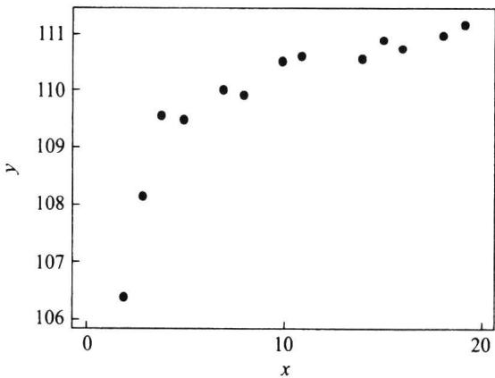
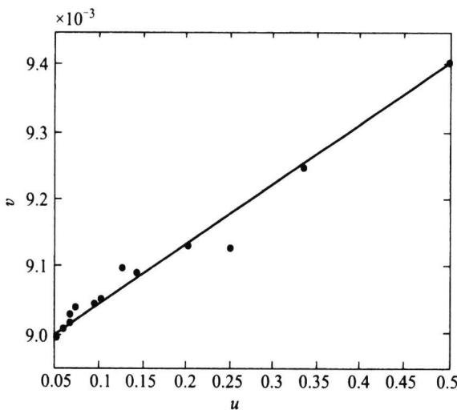
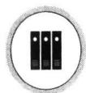

import Guide from '@/components/Guide.astro';
import Knowledge from '@/components/Knowledge.astro';
import Example from '@/components/Example.astro';
import Analysis from '@/components/Analysis.astro';
import Solution from '@/components/Solution.astro';
import Variant from '@/components/Variant.astro';
import Note from '@/components/Note.astro';
import Block from '@/components/Block.astro';
import Method from '@/components/Method.astro';
import Exercise from '@/components/Exercise.astro';

有时, 回归函数并非是自变量的线性函数, 若通过变换可以将之化为线性函数, 从而可用一元线性回归方法对其分析, 这是处理非线性回归问题的一种常用方法. 下面以一个例子说明上述非线性回归的分析步骤.

<Example title="例 8.5.1">
炼钢厂出钢水时用的钢包, 在使用过程中由于钢水及炉渣对耐火材料的侵蚀, 其容积不断增大. 钢包的容积用盛满钢水时的质量 y (单位: kg) 表示, 相应的使用次数用 $x$ 表示. 数据见表8.5.1, 要找出 $y$ 与 $x$ 的定量关系表达式.
表 8.5.1 钢包的质量 $y$ 与使用次数 $x$ 数据
<table><tr><td>序号</td><td>x</td><td>y</td><td>序号</td><td>x</td><td>y</td></tr><tr><td>1</td><td>2</td><td>106.42</td><td>8</td><td>11</td><td>110.59</td></tr><tr><td>2</td><td>3</td><td>108.20</td><td>9</td><td>14</td><td>110.60</td></tr><tr><td>3</td><td>4</td><td>109.58</td><td>10</td><td>15</td><td>110.90</td></tr><tr><td>4</td><td>5</td><td>109.50</td><td>11</td><td>16</td><td>110.76</td></tr><tr><td>5</td><td>7</td><td>110.00</td><td>12</td><td>18</td><td>111.00</td></tr><tr><td>6</td><td>8</td><td>109.93</td><td>13</td><td>19</td><td>111.20</td></tr><tr><td>7</td><td>10</td><td>110.49</td><td></td><td></td><td></td></tr></table>
下面我们分三步进行.
</Example>

## 8.5.1 确定可能的函数形式

为对数据进行分析,首先描出数据的散点图,判断两个变量之间可能的函数关系,图 8.5.1 是本例的散点图.
  
图 8.5.1 钢包质量与使用次数散点图
观察这 13 个点形成的散点图, 我们可以看到它们并不接近一条直线, 用曲线拟合这些点应该是更恰当的. 这里就涉及如何选择曲线函数形式的问题, 首先, 如果可由专业知识确定回归函数形式, 则应尽可能利用专业知识. 若不能由专业知识加以确定函数形式, 则可将散点图与一些常见的函数关系的图形进行比较, 选择几个可能的函数形式, 然后使用统计方法在这些函数形式之间进行比较, 最后确定合适的曲线回归方程. 为此, 必须了解常见的曲线函数的图形, 见图 8.5.2.
本例中,散点图呈现一个明显的向上且上凸的趋势,可能选择的函数关系有很多,比如,参照图8.5.2,我们可以给出如下四个曲线函数:
$$
\frac {1}{y} = a + \frac {b}{x}, \tag{8.5.1}
$$
(2) $y = a + b \ln x$ ,
(8.5.2)
$$
y = a + b \sqrt {x}, \tag{8.5.3}
$$
$$
(4) y - 1 0 0 = a \mathrm{e} ^ {- b / x} (b > 0).\tag{8.5.4}
$$
<table><tr><td>函数名称</td><td>函数表达式</td><td colspan="2">图 像</td><td>线性化方法</td></tr><tr><td>双曲线函数</td><td> $\frac{1}{y} = a + \frac{b}{x}$ </td><td></td><td></td><td> $v=\frac{1}{y}$  $u=\frac{1}{x}$ </td></tr><tr><td>幂函数</td><td> $y=ax^{b}$ </td><td></td><td></td><td> $v=\ln y$  $u=\ln x$ </td></tr><tr><td rowspan="2">指数函数</td><td> $y=ae^{bx}$ </td><td></td><td></td><td> $v=\ln y$  $u=x$ </td></tr><tr><td> $y=ae^{b/x}$ </td><td></td><td></td><td> $v=\ln y$  $u=\frac{1}{x}$ </td></tr><tr><td>对数函数</td><td> $y=a+b\ln x$ </td><td></td><td></td><td> $v=y$  $u=\ln x$ </td></tr><tr><td>S形曲线</td><td> $y=\frac{1}{a+be^{-x}}$ </td><td colspan="2"></td><td> $v=\frac{1}{y}$  $u=e^{-x}$ </td></tr></table>
图8.5.2 部分常见的曲线函数的图形
在初步选出可能的函数关系(即方程)后,我们必须解决两个问题:
\- 如何估计所选方程中的参数？这在8.5.2中讨论.
\- 如何评价所选不同方程的优劣？这在8.5.3中介绍.

## 8.5.2 参数估计

对形如(8.5.1)式至(8.5.4)式的非线性函数,参数估计最常用的方法是“线性化”方法,即通过某种变换,将方程化为一元线性方程的形式.
以(8.5.1)式为例,为了能采用一元线性回归分析方法,我们作如下变换:
$$
u = \frac {1}{x}, \qquad v = \frac {1}{y},
$$
则(8.5.1)的曲线函数就化为如下的直线：
$$
v = a + b u,
$$
这是理论回归函数.对数据而言,回归方程为
$$
v _ {i} = a + b u _ {i} + \varepsilon_ {i},
$$
于是可用一元线性回归的方法估计出 a, b. 图 8.5.3 给出变换后的数据的散点图.
从图 8.5.3 上看出可以认为所有的点近似在一条直线上下波动, 因此, 建立一元线性回归方程是可行的. 整个计算过程及估计列于表 8.5.2 和表 8.5.3 中.
  
图8.5.3 变换后数据的散点图
表 8.5.2 钢包数据的变换值
<table><tr><td>x</td><td>y</td><td>u=1/x</td><td>v=1/y</td><td> $u^2$ </td><td>uv</td></tr><tr><td>2</td><td>106.42</td><td>0.500 000</td><td>0.009 397</td><td>0.250 000</td><td>0.004 698</td></tr><tr><td>3</td><td>108.20</td><td>0.333 333</td><td>0.009 242</td><td>0.111 111</td><td>0.003 081</td></tr><tr><td>4</td><td>109.58</td><td>0.250 000</td><td>0.009 126</td><td>0.062 500</td><td>0.002 281</td></tr><tr><td>5</td><td>109.50</td><td>0.200 000</td><td>0.009 132</td><td>0.040 000</td><td>0.001 826</td></tr><tr><td>7</td><td>110.00</td><td>0.142 857</td><td>0.009 091</td><td>0.020 408</td><td>0.001 299</td></tr><tr><td>8</td><td>109.93</td><td>0.125 000</td><td>0.009 097</td><td>0.015 625</td><td>0.001 137</td></tr><tr><td>10</td><td>110.49</td><td>0.100 000</td><td>0.009 051</td><td>0.010 000</td><td>0.000 905</td></tr><tr><td>11</td><td>110.59</td><td>0.090 909</td><td>0.009 042</td><td>0.008 264</td><td>0.000 822</td></tr><tr><td>14</td><td>110.60</td><td>0.071 429</td><td>0.009 042</td><td>0.005 102</td><td>0.000 646</td></tr><tr><td>15</td><td>110.90</td><td>0.066 667</td><td>0.009 017</td><td>0.004 444</td><td>0.000 601</td></tr><tr><td>16</td><td>110.76</td><td>0.062 500</td><td>0.009 029</td><td>0.003 906</td><td>0.000 564</td></tr><tr><td>18</td><td>111.00</td><td>0.055 556</td><td>0.009 009</td><td>0.003 086</td><td>0.000 501</td></tr><tr><td>19</td><td>111.20</td><td>0.052 632</td><td>0.008 993</td><td>0.002 770</td><td>0.000 473</td></tr><tr><td></td><td>合计</td><td>2.050 881 94</td><td>0.118 266 72</td><td>0.537 217 98</td><td>0.018 834 95</td></tr><tr><td></td><td>均值</td><td>0.157 760 15</td><td>0.009 097 44</td><td></td><td></td></tr></table>

<Note>
为了下面的计算需要，表中合计与均值两行取8位小数.
表 8.5.3 参数估计计算表
<table><tr><td> $\sum u_{i} = 2.050\ 881\ 94$ </td><td>n=13</td><td> $\sum v_{i} = 0.118\ 266\ 72$ </td></tr><tr><td> $\overline{u} = 0.157\ 760\ 15$ </td><td></td><td> $\overline{v} = 0.009\ 097\ 44$ </td></tr><tr><td> $\sum u_{i}^{2} = 0.537\ 217\ 98$ </td><td> $\sum u_{i} v_{i} = 0.018\ 834\ 95$ </td><td></td></tr><tr><td> $n\ \overline{u}^{2} = 0.323\ 547\ 44$ </td><td> $n\ \overline{u}\ \overline{v} = 0.018\ 657\ 78$ </td><td></td></tr><tr><td> $l_{uu} = 0.213\ 670\ 54$ </td><td> $l_{uv} = 0.000\ 177\ 17$ </td><td></td></tr><tr><td></td><td> $\hat{b} = l_{uv}/l_{uu} = 0.000\ 829\ 17$ </td><td></td></tr><tr><td></td><td> $\hat{a} = \overline{v} - \hat{b}\overline{u} = 0.008\ 966\ 63$ </td><td></td></tr><tr><td></td><td> $\hat{y} = \frac{x}{0.000\ 829\ 17 + 0.008\ 966\ 63x}$ </td><td></td></tr></table>
用类似的方法可以得出其他三个曲线回归方程,它们分别是
$$
\hat {y} = 1 0 6. 3 1 4 7 + 3. 9 4 6 6 \ln x,
$$
$$
\hat {y} = 1 0 6. 3 0 1 3 + 1. 1 9 4 7 \sqrt {x},
$$
$$
\hat {y} = 1 0 0 + 1 1. 7 5 0 6 \mathrm{e} ^ {- 1. 1 2 5 6 / x}.
$$
</Note>

## 8.5.3 曲线回归方程的比较

我们上面得到了四个曲线回归方程,在这四个方程中,哪一个更好一点呢?通常
可采用如下两个指标进行选择.
(1) 决定系数 $R^{2}$ . 类似于一元线性回归方程中相关系数, 决定系数定义为
$$
R ^ {2} = 1 - \frac {\sum \left(y _ {i} - \hat {y} _ {i}\right) ^ {2}}{\sum \left(y _ {i} - \bar {y}\right) ^ {2}}.\tag{8.5.5}
$$
$R^2$ 越大, 说明残差越小, 回归曲线拟合越好, $R^2$ 从总体上给出一个拟合好坏程度的度量.
（2）剩余标准差 s. 类似于一元线性回归中标准差的估计公式, 此剩余标准差可用平均残差平方和来获得, 即
$$
s = \sqrt {\frac {\sum \left(y _ {i} - \hat {y} _ {i}\right) ^ {2}}{n - 2}}.\tag{8.5.6}
$$
s 为诸观测点 $y_{i}$ 与由曲线给出的拟合值 $\hat{y}_{i}$ 间的平均偏离程度的度量, s 越小, 方程越好.
在观测数据给定后, 不同的曲线选择不会影响 $\sum_{i=1}^{n}\left(y_{i}-\bar{y}\right)^{2}$ 的取值, 但会影响到残差平方和 $\sum_{i=1}^{n}\left(y_{i}-\hat{y}_{i}\right)^{2}$ 的取值. 因此, 对选择的曲线而言, 决定系数和剩余标准差都取决于残差平方和 $\sum_{i=1}^{n}\left(y_{i}-\hat{y}_{i}\right)^{2}$ , 从而两种选择准则是一致的, 只是从两个不同侧面作出评价.
表8.5.4给出第一个曲线回归方程的残差平方和的计算过程.由于 $n = 13$ ， $\sum_{i = 1}^{13}(y_i - \overline{y})^2 = 21.2105$ ，故其决定系数及剩余标准差分别为
$$
R ^ {2} = 1 - \frac {0 . 5 7 4 3}{2 1 . 2 1 0 5} = 0. 9 7 2 9, \quad s = \sqrt {\frac {0 . 5 7 4 3}{1 3 - 2}} = 0. 2 2 8 5.
$$
其他三个方程的决定系数及剩余标准差可同样计算,我们将它们列在表8.5.5中.
表 8.5.4 第一个方程的残差平方和计算表
<table><tr><td> $y_i$ </td><td> $\hat{y}_i$ </td><td> $\hat{e}_i = y_i - \hat{y}_i$ </td><td> $\hat{e}_i^2$ </td><td> $y_i$ </td><td> $\hat{y}_i$ </td><td> $\hat{e}_i = y_i - \hat{y}_i$ </td><td> $\hat{e}_i^2$ </td></tr><tr><td>106.42</td><td>106.596</td><td>-0.176 001</td><td>0.030 976</td><td>110.59</td><td>110.595</td><td>-0.004 890</td><td>0.000 024</td></tr><tr><td>108.20</td><td>108.190</td><td>0.010 252</td><td>0.000 105</td><td>110.60</td><td>110.793</td><td>-0.192 810</td><td>0.037 176</td></tr><tr><td>109.58</td><td>109.005</td><td>0.575 373</td><td>0.331 054</td><td>110.90</td><td>110.841</td><td>0.058 701</td><td>0.003 446</td></tr><tr><td>109.50</td><td>109.499</td><td>0.000 526</td><td>0.000 000</td><td>110.76</td><td>110.884</td><td>-0.123 761</td><td>0.015 317</td></tr><tr><td>110.00</td><td>110.071</td><td>-0.070 543</td><td>0.004 976</td><td>111.00</td><td>110.955</td><td>0.045 397</td><td>0.002 061</td></tr><tr><td>109.93</td><td>110.250</td><td>-0.320 225</td><td>0.102 544</td><td>111.20</td><td>110.984</td><td>0.215 541</td><td>0.046 458</td></tr><tr><td>110.49</td><td>110.503</td><td>-0.012 769</td><td>0.000 163</td><td></td><td>和</td><td></td><td>0.574 3</td></tr></table>

<Note>
$\hat{y}_{i}$ 用 3 位小数，实际计算中用的是 $\hat{y}_{i}$ 的 6 位小数.
表 8.5.5 四种曲线回归的决定系数及剩余标准差
<table><tr><td>模型编号</td><td>1</td><td>2</td><td>3</td><td>4</td></tr><tr><td> $R^{2}$ </td><td>0.972 9</td><td>0.877 3</td><td>0.785 1</td><td>0.962 3</td></tr><tr><td>s</td><td>0.228 5</td><td>0.486 4</td><td>0.643 7</td><td>0.269 6</td></tr></table>
从表 8.5.5 中可以看出,第一个曲线方程的决定系数最大,剩余标准差最小,在这四个曲线回归方程中,不论用哪个标准,都是第一个方程拟合得最好.因此,近似得比较好的定量关系式就是
$$
\hat {y} = \frac {x}{0 . 0 0 0 8 2 9 1 7 + 0 . 0 0 8 9 6 6 6 3 x}.
$$
</Note>

<Block title="习题8.5">
1. 设曲线函数形式为 $y = a + b\ln x$ ，试给出一个变换将之化为一元线性回归的形式。
2. 设曲线函数形式为 $y = a + b\sqrt{x}$ ，试给出一个变换将之化为一元线性回归的形式。
3. 设曲线函数形式为 $y - 100 = ae^{-x / b}$ ( $b > 0$ ), 试给出一个变换将之化为一元线性回归的形式.
4. 设曲线函数形式为 $y = a + \mathrm{e}^{bx}$ ，问能否找到一个变换将之化为一元线性回归的形式？若能，试给出；若不能，说明理由。
5. 设曲线函数形式为 $y=\frac{1}{a+be^{-x}}$ ，问能否找到一个变换将之化为一元线性回归的形式？若能，试给出；若不能，说明理由.
6. 设曲线函数形式为 $y = ae^{b / x}$ ，问能否找到一个变换将之化为一元线性回归的形式？若能，试给出；若不能，说明理由。
7. 为了检验 X 射线的杀菌作用, 用 200 kV 的 X 射线照射杀菌, 每次照射 6 min, 照射次数为 x, 照射后所剩细菌数为 y, 下表是一组试验结果:
<table><tr><td>x</td><td>y</td><td>x</td><td>y</td><td>x</td><td>y</td></tr><tr><td>1</td><td>783</td><td>8</td><td>154</td><td>15</td><td>28</td></tr><tr><td>2</td><td>621</td><td>9</td><td>129</td><td>16</td><td>20</td></tr><tr><td>3</td><td>433</td><td>10</td><td>103</td><td>17</td><td>16</td></tr><tr><td>4</td><td>431</td><td>11</td><td>72</td><td>18</td><td>12</td></tr><tr><td>5</td><td>287</td><td>12</td><td>50</td><td>19</td><td>9</td></tr><tr><td>6</td><td>251</td><td>13</td><td>43</td><td>20</td><td>7</td></tr><tr><td>7</td><td>175</td><td>14</td><td>31</td><td></td><td></td></tr></table>
根据经验知道 $y$ 关于 $x$ 的曲线回归方程形如
$$
\hat {y} = a \mathrm{e} ^ {b x},
$$
试给出具体的回归方程,并求其对应的决定系数 $R^{2}$ 和剩余标准差 s.

</Block>
