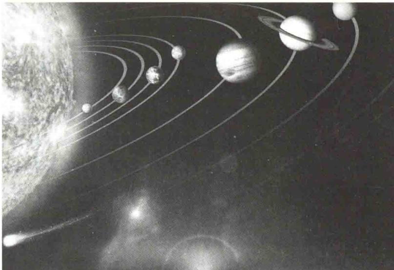

import Guide from '@/components/Guide.astro';
import Knowledge from '@/components/Knowledge.astro';
import Example from '@/components/Example.astro';
import Analysis from '@/components/Analysis.astro';
import Solution from '@/components/Solution.astro';
import Variant from '@/components/Variant.astro';
import Note from '@/components/Note.astro';
import Block from '@/components/Block.astro';
import Method from '@/components/Method.astro';
import Exercise from '@/components/Exercise.astro';

## 第1章 质点运动学

力学是物理学中最古老、发展最完善的学科。力学起源于公元前4世纪古希腊学者亚里士多德关于力产生运动的说法，以及我国《墨经》中关于杠杆原理的论述等。但其成为一门科学则始于17世纪伽利略论述惯性运动，继而牛顿提出了力学的三大运动定律。以牛顿运动定律为基础的力学理论称为经典力学或牛顿力学，所研究的对象是物体的机械运动。经典力学有严谨的理论体系和完备的研究方法，如观察现象，分析和综合实验结果，建立物理模型，应用数学表述，作出推论和预言，以及

用实践检验和校正结果等. 因此, 经典力学曾被人们誉为完美、普遍的理论, 兴盛了约 300 年. 直至 20 世纪初才发现经典力学在高速和微观领域的局限性, 之后经典力学在这两个领域分别被相对论和量子力学取代. 但在一般的技术领域, 如机械制造、土木建筑、水利设施、航空航天等工程技术中, 经典力学仍然是必不可少的重要基础理论.

本篇主要讲述质点力学、刚体的定轴转动、机械振动、机械波以及狭义相对论，着重阐明动量、角动量和能量等概念及相应的守恒定律.

  

本章提要

力学研究的是物体机械运动的规律.宏观物体之间(或物体内各部分之间)相对位置的改变称为机械运动.在经典力学中,通常将力学分为运动学、动力学和静力学.本章只研究运动学规律.运动学是从几何的观点来描述物体的运动,即研究物体的空间位置随时间变化的关系,不涉及引发物体运动和改变运动状态的原因.

为了描述物体的运动,必须做三点准备,即选择参考系、建立坐标系、提出物理模型.

## 1.1.1 运动的绝对性和相对性

众所周知，运动是物质的存在形式，也是物质的固有属性。从这种意义上讲，运动是绝对的。任何物体在任何时刻都在不停地运动着。例如，地球在自转的同时绕太阳公转，太阳又相对于银河系中心以大约234 km/s的速率运动，而银河系又相对于其他星系以大约600 km/s的速率运动。总之，绝对不运动的物体是不存在的。

然而运动又是相对的.例如，一列火车开动了，这显然是指火车相对于地球（车站）而言的.离开特定的环境和条件谈论运动没有任何意义.本书所研究的物体的运动都是在一定环境和特定条件下的运动.

## 1.1.2 参考系

运动是绝对的,但对运动的描述却是相对的.因此,在确定研究对象的位置时,必须先选定一个物体(或相对静止的几个物体)作为基准.这个被选作基准的物体或物体群,就称为参考系.

同一物体,由于所选参考系不同,对其运动的描述就会不同.例如,在做匀速直线运动的车厢中,物体自由下落时,相对于车厢做直线运动,相对于地面做抛物线运动,相对于太阳或其他天体,其运动则更为复杂.这一事实充分说明了对运动的描述是相对的.

从运动学的角度讲,参考系的选择是任意的,通常以对问题的研究最方便、最简单为原则.研究地球上物体的运动时,在大多数情况下,以地球为参考系最为方便(以后如不作特别说明,研究地面上物体的运动时,都是以地球为参考系).但是,当在地球上发射人造“宇宙小天体”时,则应以太阳为参考系.

## 1.1.3 坐标系

科研成果介绍

要想定量地描述物体的运动, 就必须在参考系上建立适当的坐标系. 力学中常用的是直角坐标系. 根据需要, 也可选用极坐标系、自然坐标系、球面坐标系或柱面坐标系等.

  

北斗导航系统

当参考系选定后,无论选择何种坐标系,物体的运动性质都不会改变.坐标系选择得当,可使计算简化.

## 1.1.4 物理模型

任何一个真实的物理过程都是极其复杂的.为了寻找某过程中最基本的规律，人们总是根据所提问题(或所要回答的问题),对真实过程进行理想化的简化,然后经过抽象,提出一个可用数学语言描述的物理模型.

  

物理中的

模型化

当物体的线度比它运动的空间范围小很多时,如绕太阳公转的地球和调度室中铁路运行图上的列车等;或当物体做平动,物体上各部分的运动情况(轨迹、速度、加速度)完全相同时,可以忽略物体的形状、大小,而把它看作一个具有一定质量的几何点,称为质点.

若物体的运动在上述两种情形之外,还可提出质点系的概念.即把这个物体看作由许许多多满足第一种情况的质点所组成的系统.如果弄清楚了组成这个物体的各个质点的运动情况,也就描述了整个物体的运动.

在力学中除了质点模型,在后续章节中还会遇到刚体、理想流体、谐振子及理想弹性介质等物理模型.

综上所述:选择合适的参考系,有利于确定物体的运动性质;建立恰当的坐标系,可定量地描述物体的运动;提出恰当的物理模型,可确定最基本的运动规律.
