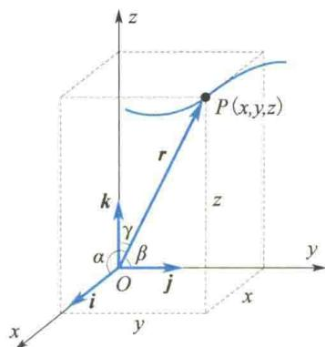
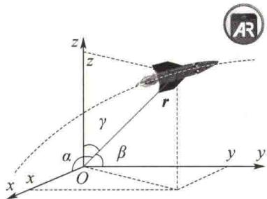
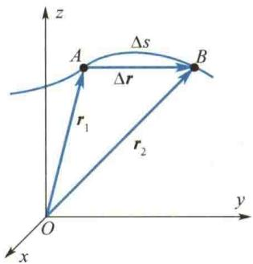
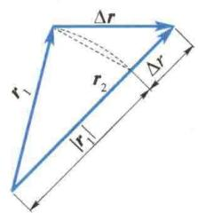
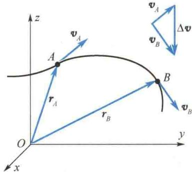
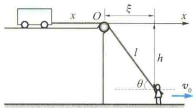

import QRCodeVideo from '@/components/QRCodeVideo.astro';

import Guide from '@/components/Guide.astro';
import Knowledge from '@/components/Knowledge.astro';
import Example from '@/components/Example.astro';
import Analysis from '@/components/Analysis.astro';
import Solution from '@/components/Solution.astro';
import Variant from '@/components/Variant.astro';
import Note from '@/components/Note.astro';
import Block from '@/components/Block.astro';
import Method from '@/components/Method.astro';
import Exercise from '@/components/Exercise.astro';

## 1.2.1 位置矢量

为了表示运动质点的位置,首先应该选定参考系,然后在参考系上选定坐标系的原点和坐标轴.如图1.1所示,质点P在直角坐标系中的位置可由P点的三个坐标x、y、z来确定,或者用从原点O到P点的有向线段 $\overrightarrow{OP}=r$ 来表示,矢量r称为位置矢量(简称位矢,又称矢径).坐标x、y、z也就是位矢r在坐标轴上的三个分量.

在直角坐标系中,位矢 r 可以表示成
$$
r = x i + y j + z k\tag{1.1}
$$
式中，i、j、k 分别表示沿 x 轴、y 轴、z 轴正方向的单位矢量。位矢 r 的大小为
图 1.1 直角坐标系下的位矢
$$
| r | = r = \sqrt {x ^ {2} + y ^ {2} + z ^ {2}}\tag{1.2}
$$
位矢的方向余弦为
$$
\cos \alpha = \frac {x}{r}, \quad \cos \beta = \frac {y}{r}, \quad \cos \gamma = \frac {z}{r}
$$
质点的运动是质点的空间位置随时间变化的过程. 这时质点的坐标 x、y、z 和位矢 r 都是时间 t 的函数. 表示运动过程的函数式称为运动方程, 可以写作
$$
x = x (t), \quad y = y (t), \quad z = z (t)\tag{1.3a}
$$
或
$$
\boldsymbol {r} = \boldsymbol {r} (t)\tag{1.3b}
$$
知道了运动方程,就能确定任意时刻质点的位置,从而确定质点的运动.力学的主要任务之一,正是根据各种问题的具体条件,求解质点的运动方程.
质点在空间的运动路径称为轨迹. 质点的运动轨迹为直线时, 称为直线运动. 质点的运动轨迹为曲线时, 称为曲线运动. 从式(1.3a) 中消去 t 即可得到轨迹方程. 式(1.3a) 就是轨迹的参数方程.
轨迹方程和运动方程最明显的区别就在于,轨迹方程不是时间 t 的显函数.例如,已知某质点的运动方程为
$$
x = 3 \sin {\frac {\pi}{6}} t, \quad y = 3 \cos {\frac {\pi}{6}} t, \quad z = 0
$$
式中，t 以 s 为单位，x、y、z 均以 m 为单位。从 x、y 的表达式中消去 t 后，得轨迹方程为

  
质点运动的描述
$$
x ^ {2} + y ^ {2} = 9, \quad z = 0
$$
其表明质点在平面 z = 0 内做以坐标原点为圆心、半径为 3 m 的圆周运动.

## 1.2.2 位移

如图 1.2 所示, 设质点沿曲线轨迹运动, 在 t 时刻, 质点在 A 点处, 在 $t + \Delta t$ 时刻, 质点运动到 B 点处, A、B 两点的位矢分别用 $r_{1}$ 和 $r_{2}$ 表示. 在 $\Delta t$ 时间间隔内质点位矢的增量
$$
\Delta \boldsymbol {r} = \boldsymbol {r} _ {2} - \boldsymbol {r} _ {1}
$$
<QRCodeVideo title="位移和路程的计算和理解" url="https://api.guangyiedu.com/v3/resource/resource/r/NewQrCode-NG07cELrL0XgKamtxjcC" />  
位移和路程的计算及理解
(1.4)
称为位移,它是描述物体位置变化大小和方向的物理量,在图1.2中就是由起始位置A指向终止位置B的一个矢量.位移是矢量,它的运算遵循矢量加法的平行四边形定则(或三角形定则).
位移的大小只能记作 $|\Delta r|$ ，不能记作 $\Delta r$ . $\Delta r$ 通常表示位矢大小的增量，即 $\Delta r = |r_2| - |r_1|$ ，而 $|\Delta r|$ 则是位矢增量的模（位移的大小），如图1.3所示.在通常情况下， $|\Delta r| \neq \Delta r$ .
  
图1.2 位移
  
图1.3 位移的大小
必须注意,位移表示物体位置的改变,并非质点所经历的路程.例如,在图1.2中,位移是有向线段 $\overrightarrow{AB}$ ,它的量值 $|\Delta r|$ 为割线段AB的长度.路程是标量,即曲线段 $\widehat{AB}$ 的长度,通常记作 $\Delta s$ .一般来说, $|\Delta r|\neq\Delta s$ .显然,只有在 $\Delta t$ 趋近于零时,才有 $|dr|=ds$ .应当指出,即使 $\Delta t\to0,\left|dr\right|=dr$ 这个等式也不成立.
在直角坐标系中，位移的表达式为
$$
\begin{array}{r l} \Delta r & = (x _ {2} - x _ {1}) i + (y _ {2} - y _ {1}) j + (z _ {2} - z _ {1}) k \\ & = \Delta x i + \Delta y j + \Delta z k \end{array}\tag{1.5}
$$
位移的模为
$$
\begin{array}{r l} \mid \Delta r \mid & = \sqrt {(x _ {2} - x _ {1}) ^ {2} + (y _ {2} - y _ {1}) ^ {2} + (z _ {2} - z _ {1}) ^ {2}} \\ & = \sqrt {\Delta x ^ {2} + \Delta y ^ {2} + \Delta z ^ {2}} \end{array}\tag{1.6}
$$
位移和路程的单位均是长度的单位，在国际单位制(SI)中为 m.

## 1.2.3 速度

研究质点的运动,不仅要知道质点的位移,还必须知道在多长时间内通过这段位移,亦即要知道质点运动的快慢程度.
如图 1.2 所示，在时刻 t 到 $t + \Delta t$ 这段时间内，质点的位移为 $\Delta r$ ，那么 $\Delta r$ 与 $\Delta t$ 的比值，称为质点在时刻 t 附近 $\Delta t$ 时间内的平均速度，即
$$
\overline {{{{\boldsymbol {v}}}}} = \frac {\overrightarrow {A B}}{\Delta t} = \frac {\Delta r}{\Delta t}\tag{1.7}
$$
这就是说,平均速度的方向与位移 $\Delta r$ 的方向相同,平均速度的大小与在相应的时间 $\Delta t$ 内单位时间的位移大小相同.
显然，用平均速度描述物体的运动是比较粗糙的。因为在 $\Delta t$ 时间内，质点在各个时刻的运动情况不一定相同，质点的运动可以时快时慢，方向也可以不断地改变，平均速度不能反映质点运动的真实状态。如果要精确地知道质点在某一时刻或某一位置的实际运动状态，应使 $\Delta t$ 尽可能小，即 $\Delta t \to 0$ ，用平均速度的极限值——瞬时速度（简称速度）来描述。
质点在某一时刻或某一位置的瞬时速度,等于该时刻附近 $\Delta t$ 趋近于零时平均速度的极限值,数学表达式为
$$
\pmb {v} = \lim _ {\Delta t \rightarrow 0} \frac {\Delta \pmb {r}}{\Delta t} = \frac {\mathrm{d} \pmb {r}}{\mathrm{d} t}\tag{1.8}
$$
可见,速度等于位矢对时间的一阶导数.
速度的方向就是 $\Delta t$ 趋近于零时，平均速度 $\frac{\Delta r}{\Delta t}$ 或位移 $\Delta r$ 的极限方向，即沿质点所在处轨迹的切线方向，并指向质点前进的一方.
速度是矢量, 具有大小和方向. 描述质点运动时, 也常采用一个叫作速率的物理量. 速率是标量, 等于质点在单位时间内所行经的路程, 而不考虑质点运动的方向. 如图 1.2 所示, 在 $\Delta t$ 时间内质点所行经的路程为曲线段 $\widehat{AB}$ . 设曲线段 $\widehat{AB}$ 的长度为 $\Delta s$ , 那么 $\Delta s$ 与 $\Delta t$ 的比值就称为 $t$ 时刻附近 $\Delta t$ 时间内的平均速率, 即
$$
\overline {{{v}}} = \frac {\Delta s}{\Delta t}\tag{1.9}
$$
平均速率与平均速度不能等同看待.例如,在某一段时间内,质点环行了一个闭合路径,显然质点的位移等于零,平均速度也为零,而质点的平均速率则不等于零.
尽管如此，在 $\Delta t\to 0$ 的极限条件下，曲线段 $AB$ 的长度 $\Delta s$ 与线段 $AB$ 的长度 $|\Delta r|$ 相等，即在 $\Delta t\to 0$ 时， $\mathrm{ds} = |\mathrm{dr}|$ ，所以瞬时速率
$$
v = \lim _ {\Delta t \rightarrow 0} \frac {\Delta s}{\Delta t} = \frac {\mathrm{d} s}{\mathrm{d} t} = \frac {| \mathrm{d} r |}{\mathrm{d} t} = | \boldsymbol {v} |\tag{1.10}
$$
即瞬时速率等于瞬时速度的大小. 瞬时速率也称速率.
由式 $(1.1)$ 可知，在直角坐标系中，速度可表示成
$$
\boldsymbol {v} = \frac {\mathrm{d} \boldsymbol {r}}{\mathrm{d} t} = \frac {\mathrm{d} x}{\mathrm{d} t} \boldsymbol {i} + \frac {\mathrm{d} y}{\mathrm{d} t} \boldsymbol {j} + \frac {\mathrm{d} z}{\mathrm{d} t} \boldsymbol {k} = v _ {x} \boldsymbol {i} + v _ {y} \boldsymbol {j} + v _ {z} \boldsymbol {k}\tag{1.11}
$$
式中， $v_{x}=\frac{dx}{dt},v_{y}=\frac{dy}{dt},v_{z}=\frac{dz}{dt}$ ，分别称为速度v在x轴、y轴、z轴方向上的分量。这时速度v的模可以表示成
$$
v = | \boldsymbol {v} | = \sqrt {v _ {x} ^ {2} + v _ {y} ^ {2} + v _ {z} ^ {2}}\tag{1.12}
$$
速度和速率在量值上都是长度与时间的比值,其单位为 m/s.

## 1.2.4 加速度

在力学中,位矢 r 和速度 v 都是描述物体机械运动的状态参量,即若 r 和 v 已知,质点的力学运动状态就确定了.下面即将引入的加速度则是用来描述速度随时间的变化率的物理量.
在变速运动中,物体的速度是随时间变化的.这个变化可以是运动快慢的变化,也可以是运动方向的变化,一般情况下速度的方向和大小都在变化.加速度就是描述质点的速度(大小和方向)随时间变化快慢的物理量.如图1.4所示, $v_{A}$ 表示质点在时刻t、位置A处的速度, $v_{B}$ 表示质点在时刻 $t+\Delta t$ 、位置B处的速度.从速度矢量图可以看出,在 $\Delta t$ 时间内质点速度的增量为
  
图1.4 速度的增量
$$
\Delta \pmb {v} = \pmb {v} _ {B} - \pmb {v} _ {A}
$$
与平均速度的定义类似,比值 $\frac{\Delta v}{\Delta t}$ 称为时刻t附近 $\Delta t$ 时间内的平均加速度,记为 $\overline{a}$ ,即
$$
\overline {{{a}}} = \frac {\pmb {v} _ {B} - \pmb {v} _ {A}}{\Delta t} = \frac {\Delta \pmb {v}}{\Delta t}\tag{1.13}
$$
平均加速度只反映在 $\Delta t$ 时间内速度的平均变化率.为了准确地描述质点在某一时刻 t（或某一位置处）的速度变化率,须引入瞬时加速度.
质点在某一时刻或某一位置处的瞬时加速度(简称加速度)等于该时刻附近 $\Delta t$ 趋近于零时平均加速度的极限值,其数学表达式为
$$
\boldsymbol {a} = \lim _ {\Delta t \rightarrow 0} \frac {\Delta \boldsymbol {v}}{\Delta t} = \frac {\mathrm{d} \boldsymbol {v}}{\mathrm{d} t} = \frac {\mathrm{d} ^ {2} \boldsymbol {r}}{\mathrm{d} t ^ {2}}\tag{1.14}
$$
可见,加速度是速度对时间的一阶导数,或位矢对时间的二阶导数.
在直角坐标系中,加速度的表达式为
$$
\boldsymbol {a} = \frac {\mathrm{d} ^ {2} \boldsymbol {r}}{\mathrm{d} t ^ {2}} = \frac {\mathrm{d} ^ {2} x}{\mathrm{d} t ^ {2}} \boldsymbol {i} + \frac {\mathrm{d} ^ {2} y}{\mathrm{d} t ^ {2}} \boldsymbol {j} + \frac {\mathrm{d} ^ {2} z}{\mathrm{d} t ^ {2}} \boldsymbol {k} = a _ {x} \boldsymbol {i} + a _ {y} \boldsymbol {j} + a _ {z} \boldsymbol {k}\tag{1.15}
$$
式中， $a_{x} = \frac{\mathrm{d}v_{x}}{\mathrm{d}t} = \frac{\mathrm{d}^{2}x}{\mathrm{d}t^{2}}, a_{y} = \frac{\mathrm{d}v_{y}}{\mathrm{d}t} = \frac{\mathrm{d}^{2}y}{\mathrm{d}t^{2}}, a_{z} = \frac{\mathrm{d}v_{z}}{\mathrm{d}t} = \frac{\mathrm{d}^{2}z}{\mathrm{d}t^{2}}$ ，分别称为加速度 $\pmb{a}$ 在 $x$ 轴、 $y$ 轴、 $z$ 轴方向上的分量.加速度的模为
$$
a = | \boldsymbol {a} | = \sqrt {a _ {x} ^ {2} + a _ {y} ^ {2} + a _ {z} ^ {2}}\tag{1.16}
$$
加速度的方向是当 $\Delta t \rightarrow 0$ 时平均加速度 $\frac{\Delta v}{\Delta t}$ 或速度增量的极限方向.

<Example title="例 1.1">
如图 1.5 所示,一人用绳子拉着小车前进,小车位于高出绳端 h 的平台上,人的速率 $v_{0}$ 不变,求小车的速度和加速度的大小.

<Solution title="解">
小车沿直线运动,以小车前进方向为 x 轴正方向,以定滑轮为坐标原点 O, 小车的坐标为 x, 人的坐标为 $\xi$ , 由速度的定义知, 小车和人的速度大小应分别为
$$
v _ {\mathrm{车}} = \frac {\mathrm{d} x}{\mathrm{d} t}, \quad v _ {\mathrm{人}} = \frac {\mathrm{d} \xi}{\mathrm{d} t} = v _ {0}
$$
由于定滑轮不改变绳长,所以小车坐标的变化率等于定滑轮与人之间的绳长的变化率,即
$$
v _ {\mathrm{车}} = \frac {\mathrm{d} x}{\mathrm{d} t} = \frac {\mathrm{d} l}{\mathrm{d} t}
$$
又由图1.5可得 $l^2 = \xi^2 + h^2$ ，两边对 $t$ 求导得
$$
2 l \frac {\mathrm{d} l}{\mathrm{d} t} = 2 \xi \frac {\mathrm{d} \xi}{\mathrm{d} t}
$$
联立以上各式，得
$$
v _ {\mathrm{车}} = \frac {v _ {\mathrm{人}} \xi}{l} = v _ {\mathrm{人}} \frac {\xi}{\sqrt {\xi^ {2} + h ^ {2}}} = \frac {v _ {0} \xi}{\sqrt {\xi^ {2} + h ^ {2}}}
$$
小车的加速度大小为
$$
a = \frac {\mathrm{d} v _ {\mathrm{车}}}{\mathrm{d} t} = \frac {v _ {0} ^ {2} h ^ {2}}{(\xi^ {2} + h ^ {2}) ^ {\frac {3}{2}}}
$$
  
图1.5 例1.1图

</Solution>
</Example>
