import Guide from '@/components/Guide.astro';
import Knowledge from '@/components/Knowledge.astro';
import Example from '@/components/Example.astro';
import Analysis from '@/components/Analysis.astro';
import Solution from '@/components/Solution.astro';
import Variant from '@/components/Variant.astro';
import Note from '@/components/Note.astro';
import Block from '@/components/Block.astro';
import Method from '@/components/Method.astro';
import Exercise from '@/components/Exercise.astro';

## 1.3.1 曲线运动的描述

若质点的运动轨迹为曲线,则质点所做的运动称为曲线运动.为了描述曲线的弯曲程度,通常引入曲率和曲率半径.这里仅讨论平面上的二维曲线运动.
从曲线上邻近的两点 $P_{1}$ 、 $P_{2}$ 各引一条切线，这两条切线间的夹角为 $\Delta\theta$ ， $P_{1}$ 、 $P_{2}$ 两点间的弧长为 $\Delta s$ ，则 $P_{1}$ 点的曲率定义为
$$
k = \lim _ {\Delta s \rightarrow 0} \frac {\Delta \theta}{\Delta s} = \frac {\mathrm{d} \theta}{\mathrm{d} s}\tag{1.17}
$$
将曲线上无限邻近的两点处的两条切线的夹角 $d\theta$ 称为邻切角. 式(1.17) 表明, 曲线上某点的曲率等于邻切角 $d\theta$ 与所对应的弧元 ds 之比.
一般情况下, 曲线在不同点处有不同的曲率. 曲率越大, 则曲线弯曲得越厉害. 显然, 同一圆周上各点的曲率相同.
过曲线上某点作一圆,若该圆的曲率与曲线在该点的曲率相等,则称它为该点的曲率圆,而其圆心O和半径 $\rho$ 分别称为曲线上该点的曲率中心和曲率半径(见图1.6),且有
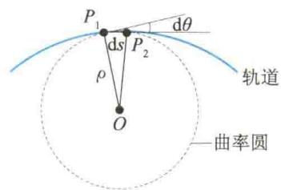  
图 1.6 曲率、曲率圆、曲率半径
$$
\rho = \frac {1}{k} = \frac {\mathrm{d} s}{\mathrm{d} \theta}\tag{1.18}
$$

### 1. 平面曲线运动

质点做曲线运动时， $\Delta \pmb{v}$ 的方向和 $\frac{\Delta \pmb{v}}{\Delta t}$ 的极限方向一般不同于速度 $\pmb{v}$ 的方向，而且加速度的方向总是指向曲线凹进的一边。如果速率是减小的（ $|\pmb{v}_B| < |\pmb{v}_A|$ ），则 $a$ 与 $\pmb{v}$ 成钝角；如果速率是增大的（ $|\pmb{v}_B| > |\pmb{v}_A|$ ），则 $a$ 与 $\pmb{v}$ 成锐角；如果速率不变（ $|\pmb{v}_B| = |\pmb{v}_A|$ ），则 $a$ 与 $\pmb{v}$ 成直角，如图1.7所示。
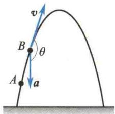
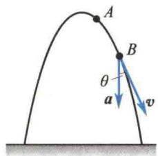
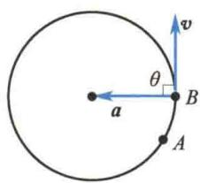  
图 1.7 曲线运动中的加速度
  
切向加速度
为了运算方便,常采用平面自然坐标系讨论加速度,即将加速度沿着质点所在处轨迹的切线方向和法线方向进行分解,这样得到的加速度分量分别叫作切向加速度和法向加速度.
设质点的运动轨迹如图1.8(a)所示，时刻 $t$ 质点在 $P_{1}$ 点，速度为 $\pmb{v}_{1}$ ，时刻 $t + \Delta t$ 质点运动到 $P_{2}$ 点，速度为 $\pmb{v}_{2}, P_{1}, P_{2}$ 两点的邻切角为 $\Delta \theta$ ，在 $\Delta t$ 时间内，速度增量为 $\Delta \pmb{v}$ . 图1.8(b)表示了 $\pmb{v}_{1}, \pmb{v}_{2}, \Delta \pmb{v}$ 三者之间的关系. 图中 $\Delta \pmb{v}$ 就是矢量 $\overrightarrow{BC}$ . 如果在 $\overrightarrow{AC}$ 上截取 $|\overrightarrow{AD}| = |\overrightarrow{AB}| = |\pmb{v}_{1}|$ ，则剩下的部分
$$
| \overrightarrow {D C} | = | \overrightarrow {A C} | - | \overrightarrow {A B} | = | \boldsymbol {v} _ {2} | - | \boldsymbol {v} _ {1} | = | \Delta \boldsymbol {v} _ {\tau} | = \Delta v
$$
即 $\left|\Delta v_{\tau}\right|=\Delta v$ 反映了速度模的增量. 连接 $\overrightarrow{BD}$ ，并记作 $\Delta v_{n}$ ，其反映了速度由于方向改变（大小保持不变）而产生的增量. 于是速度增量 $\Delta v$ 所包含的速度大小的增量和速度方向的增量这两个方面的含义，通过 $\Delta v_{\tau}$ 和 $\Delta v_{n}$ 得到了定量的描述，即 $\Delta v=\Delta v_{\tau}+\Delta v_{n}$ .
由图1.8(c)可看出，当 $\Delta t\to 0$ 时， $\Delta \theta \rightarrow 0$ ，则 $\angle ABD\rightarrow \frac{\pi}{2}$ ，即在极限条件下， $\Delta \pmb{v}_{\mathrm{n}}$ 的方向垂直于过 $P_{1}$ 点的切线，亦即沿曲线在 $P_{1}$ 点的法线方向；同时，在 $\Delta \theta \rightarrow 0$ 的极限条件下， $\Delta \pmb{v}_{\tau}$ 的方向就是 $\pmb{v}_1$ 的方向，亦即沿 $P_{1}$ 点的切线方向.
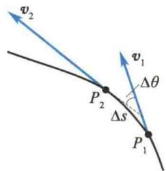  
(a)
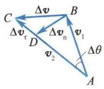  
(b)
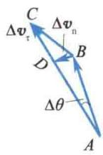  
(c)  
图 1.8 切向加速度与法向加速度
由图1.8(c)还可看出，当 $\Delta \theta \rightarrow 0$ 时， $|\Delta \pmb{v}_{\mathrm{n}}| = v\Delta \theta (v$ 为质点运动到 $P_{1}$ 点时的速率），如果以 $n_0$ 表示 $P_{1}$ 点内法线方向的单位矢量，以 $\tau_0$ 表示 $P_{1}$ 点切线方向（且指向质点前进方向）的单位矢量，则有
$$
a = \lim _ {\Delta t \rightarrow 0} \frac {\Delta \boldsymbol {v}}{\Delta t} = \lim _ {\Delta t \rightarrow 0} \frac {\Delta \boldsymbol {v} _ {\tau}}{\Delta t} + \lim _ {\Delta t \rightarrow 0} \frac {\Delta \boldsymbol {v} _ {n}}{\Delta t} = \frac {\mathrm{d} v}{\mathrm{d} t} \boldsymbol {\tau} _ {0} + v \frac {\mathrm{d} \theta}{\mathrm{d} t} \boldsymbol {n} _ {0}\tag{1.19}
$$
由于 $\frac{\mathrm{d}\theta}{\mathrm{d}t} = \frac{\mathrm{d}\theta}{\mathrm{d}s}\frac{\mathrm{d}s}{\mathrm{d}t} = v\frac{1}{\rho}$ ，式中 $\rho$ 为过 $P_{1}$ 点的曲率圆的半径，则式(1.19）可写为
$$
\boldsymbol {a} = \frac {\mathrm{d} v}{\mathrm{d} t} \boldsymbol {\tau} _ {0} + \frac {v ^ {2}}{\rho} \boldsymbol {n} _ {0} = a _ {\mathrm{r}} \boldsymbol {\tau} _ {0} + a _ {\mathrm{n}} \boldsymbol {n} _ {0}\tag{1.20}
$$
式中， $a_{\mathrm{r}} = \frac{\mathrm{d}v}{\mathrm{d}t}, a_{\mathrm{n}} = \frac{v^2}{\rho}$ 分别为加速度的切向分量和法向分量. $a_{\mathrm{r}} = \frac{\mathrm{d}v}{\mathrm{d}t}$ ，反映速度大小的变化； $a_{\mathrm{n}} = \frac{v^2}{\rho}$ ，反映速度方向的变化. 加速度的模为
$$
| \boldsymbol {a} | = \sqrt {a _ {\tau} ^ {2} + a _ {\mathrm{n}} ^ {2}}\tag{1.21}
$$
在国际单位制中,加速度的单位是 $m/s^{2}$ .

<Example title="例 1.2">
以速度 $v_{0}$ 平抛一小球，不计空气阻力，求t时刻小球的切向加速度的大小 $a_{\tau}$ 、法向加速度的大小 $a_{0}$ 和轨迹的曲率半径 $\rho$ .

<Solution title="解">
由图1.9可知
$$
\begin{array}{r l} a _ {x} & = g \sin \theta = g \frac {v _ {y}}{v} = g \frac {g t}{\sqrt {v _ {0} ^ {2} + g ^ {2} t ^ {2}}} \\ & = \frac {g ^ {2} t}{\sqrt {v _ {0} ^ {2} + g ^ {2} t ^ {2}}} \end{array}
$$
$$
a _ {n} = g \cos \theta = g \frac {\bar {v} _ {x}}{v} = \frac {g \bar {v} _ {0}}{\sqrt {v _ {0} ^ {2} + g ^ {2} t ^ {2}}}
$$
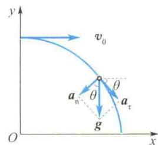  
图1.9 例1.2图
$$
\rho = \frac {v ^ {2}}{a _ {\mathrm{n}}} = \frac {v _ {\mathrm{r}} ^ {2} + v _ {\mathrm{y}} ^ {2}}{a _ {\mathrm{n}}} = \frac {(v _ {0} ^ {2} + g ^ {2} t ^ {2}) ^ {3 / 2}}{g v _ {0}}
$$
</Solution>
</Example>

### 2. 圆周运动

质点做圆周运动时,由于其轨迹的曲率半径处处相等,而速度方向始终在圆周的切线上,因此对圆周运动的描述,常常采用以平面自然坐标系为基础的线量描述和以平面极坐标系为基础的角量描述,现分别简单介绍如下.
在自然坐标系中，位矢 r 是轨迹 s 的函数，即
$$
\boldsymbol {r} = \boldsymbol {r} (s)
$$
如图1.10所示， $O^{\prime}$ 为自然坐标系原点， $\tau_{0}$ 和 $n_{0}$ 分别为切向单位矢量和法向单位矢量。由 $|dr|=ds$ 可知，在自然坐标系中位移、速度可分别表示为
$$
\begin{array}{r l} & \mathrm{d} \boldsymbol {r} = \mathrm{d} s \boldsymbol {\tau} _ {0} \\ \boldsymbol {v} & = \frac {\mathrm{d} \boldsymbol {r}}{\mathrm{d} t} = \frac {\mathrm{d} s}{\mathrm{d} t} \boldsymbol {\tau} _ {0} = v \boldsymbol {\tau} _ {0} \end{array}
$$
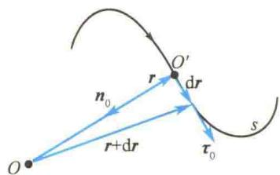  
图1.10 用自然坐标系表示质点的位置
(1.22)
根据式 $(1.20)$ ，圆周运动中的切向加速度和
法向加速度分别为
$$
\left\{ \begin{array}{l} \boldsymbol {a} _ {\tau} = \frac {\mathrm{d} v}{\mathrm{d} t} \boldsymbol {\tau} _ {0} = \frac {\mathrm{d} ^ {2} s}{\mathrm{d} t ^ {2}} \boldsymbol {\tau} _ {0} \\ \boldsymbol {a} _ {\mathrm{n}} = \frac {v ^ {2}}{\rho} \boldsymbol {n} _ {0} = \frac {v ^ {2}}{R} \boldsymbol {n} _ {0} \end{array} \right.\tag{1.23}
$$
式中，R 是圆半径。于是，所谓匀速圆周运动，就是指切向加速度为零的圆周运动，即匀速率圆周运动。
如果以圆心为极点，并任意引一条射线为极轴，那么质点位置对极点的矢径 r 与极轴的夹角 $\theta$ 就叫作质点的角位置。用 d $\theta$ 表示位矢在 dt 时间内转过的角位移。角位移既有大小又有方向，其方向的规定为：右手四指沿质点的旋转方向弯曲，与四指垂直的大拇指的指向则表示角位移的方向，即角位移的方向是按右手螺旋定则规定的。在图 1.11 中，质点逆时针转动，这时角位移的方向垂直于纸面向外。但有
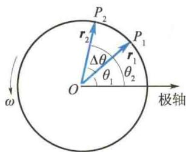  
图1.11 角位移
限大小的角位移不是矢量(因为其合成不服从交换律). 可以证明, 只有在 $\Delta t \rightarrow 0$ 时的角位移才是矢量. 质点做圆周运动时, 其角位移只有两种可能的方向, 因此, 也可以在角位移前冠以正、负号来表示它的方向. 如果过圆心作一垂直于圆面的直线作为坐标轴, 任选一个方向规定为坐标轴的正方向, 则由上述规定的角位移, 其方向与坐标轴正方向相同则取正号, 反之则取负号.
和前面引进速度、加速度的方法一样,也可以引进角速度和角加速度,其大小分别为
$$
\omega = \lim _ {\Delta t \rightarrow 0} \frac {\Delta \theta}{\Delta t} = \frac {\mathrm{d} \theta}{\mathrm{d} t}\tag{1.24}
$$
$$
\alpha = \lim _ {\Delta t \rightarrow 0} \frac {\Delta \omega}{\Delta t} = \frac {\mathrm{d} \omega}{\mathrm{d} t} = \frac {\mathrm{d} ^ {2} \theta}{\mathrm{d} t ^ {2}}\tag{1.25}
$$
角速度和角加速度的方向参考角位移方向的规定.
当质点做圆周运动时， $R =$ 常数，只有角位置是 $t$ 的函数，这样只需一个坐标（即角位置 $\theta$ ）就可描述质点的位置。这和质点的直线运动颇为类似。因此，在匀角加速圆周运动中有
$$
\left\{ \begin{array}{l} \omega = \omega_ {0} + \alpha t \\ \theta = \theta_ {0} + \omega_ {0} t + \frac {1}{2} \alpha t ^ {2} \\ \omega^ {2} - \omega_ {0} ^ {2} = 2 \alpha (\theta - \theta_ {0}) \end{array} \right.\tag{1.26}
$$
不难证明，在圆周运动中，线量和角量之间存在如下关系，即
$$
\left\{ \begin{array}{l} \mathrm{d} s = R \mathrm{d} \theta \\ v = \frac {\mathrm{d} s}{\mathrm{d} t} = R \frac {\mathrm{d} \theta}{\mathrm{d} t} = R \omega \\ a _ {\tau} = \frac {\mathrm{d} v}{\mathrm{d} t} = R \frac {\mathrm{d} \omega}{\mathrm{d} t} = R \alpha \\ a _ {n} = \frac {v ^ {2}}{R} = R \omega^ {2} \end{array} \right.\tag{1.27}
$$
角速度的方向就是角位移的方向,如图 1.12 所示. 按照矢量的矢积运算法则,角速度矢量与线速度矢量之间的关系为
$$
\boldsymbol {v} = \omega \times r
$$
如图 1.13 所示.
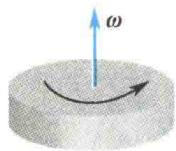
  
图1.12 角速度方向
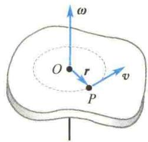  
图1.13 角速度矢量与线速度矢量的关系

<Example title="例 1.3">
一质点做匀减速圆周运动，初始转速 $n = 1500\mathrm{r / min}$ （转每分钟），经 $t = 50~\mathrm{s}$ 后静止.（1）求角加速度 $\alpha$ 和从开始到静止质点的转数 $N$ ；（2）求 $t = 25\mathrm{s}$ 时质点的角速度 $\omega$ ；（3）设圆的半径 $R = 1\mathrm{m}$ ，求 $t = 25\mathrm{s}$ 时质点的速度和加速度的大小.

<Solution title="解">
（1）由题意知 $\omega_0 = 2\pi n = 2\pi \times \frac{1500}{60}\mathrm{rad / s} =$ $50\pi \mathrm{rad / s}$ ，当 $t = 50~s$ 时 $\omega = 0$ ，故由式(1.26）可得
$$
\begin{array}{r l} \alpha & = \frac {\omega - \omega_ {0}}{t} = \frac {- 5 0 \pi}{5 0} \mathrm {rad/ s^ {2}} \\ & = - \pi \mathrm {rad/ s^ {2}} \end{array}
$$
$$
N = \frac {1 2 5 0 \pi}{2 \pi} \mathrm{r} = 6 2 5 \mathrm{r}
$$
从开始到静止，质点的角位移及转数分别为
(2) $t = 25 \, \text{s}$ 时质点的角速度为
$$
\begin{array}{r l} \omega & = \omega_ {0} + \alpha t = 5 0 \pi \mathrm{rad/s} - 2 5 \pi \mathrm{rad/s} \\ & = 2 5 \pi \mathrm{rad/s} \end{array}
$$
$$
\begin{array}{r l} \theta - \theta_ {0} & = \omega_ {0} t + \frac {1}{2} \alpha t ^ {2} \\ & = 5 0 \pi \times 5 0 \mathrm{rad} - \frac {\pi}{2} \times 5 0 ^ {2} \mathrm{rad} \\ & = 1 2 5 0 \pi \mathrm{rad} \end{array}
$$
(3) $t = 25 \, s$ 时质点的速度为
$$
v = R \omega = 1 \times 2 5 \pi \mathrm{m/s} = 7 8. 5 \mathrm{m/s}
$$
相应的切向加速度和法向加速度分别为
$$
\begin{array}{r l} a _ {\tau} & = R \alpha = - \pi \mathrm {m/ s^ {2}} = - 3. 1 4 \mathrm {m/ s^ {2}} \\ a _ {\mathrm{n}} & = R \omega^ {2} = 1 \times (2 5 \pi) ^ {2} \mathrm {m/ s^ {2}} \\ & = 6. 1 6 \times 1 0 ^ {3} \mathrm {m/ s^ {2}} \end{array}
$$
</Solution>
</Example>

## 有限角位移不是矢量的说明

矢量的严格定义为:矢量是在空间中有一定方向和数值,并遵循平行四边形定则的量.
物体绕某一固定轴的有限转动可以用具有大小和方向的线段表示，线段长度表示物体所转过的角度，其方向沿着转动轴的方向（右手螺旋定则）。但两个连续的有限转动不能应用平行四边形定则相加，因为它不符合交换律。例如，一本书先绕轴1转一有限角度 $\theta_{1}$ （如 $90^{\circ}$ ），再绕轴2转一有限角度 $\theta_{2}$ （如 $90^{\circ}$ ），合成后的结果和使书先绕轴2转角度 $\theta_{2}$ ，再绕轴1转角度 $\theta_{1}$ 的合成结果不同（见图1.14）。就是说，这种合成结果和相加的次序有关，不符合矢量加法的平行四边形定则，所以有限角位移不是矢量。
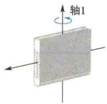  
(a) 书从原位置绕轴1转90°
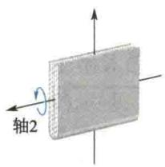  
(d) 书从原位置绕轴2转90°
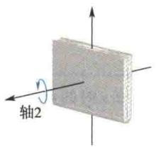
(b) 从绕轴1转90°后的位置再绕轴2转90°
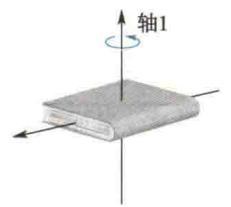  
(e) 从绕轴2转90°后的位置再绕轴1转90°
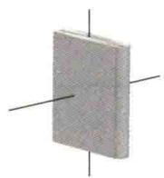  
(c) 最后位置
图1.14 有限角位移不是矢量  
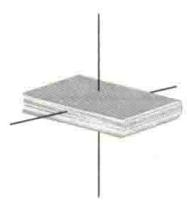  
(f) 最后位置

## 1.3.2 运动学中的两类问题

  
运动学中的两类问题
(1) 由已知的运动方程求速度、加速度. 求解这类问题主要是运用求导的方法.

<Example title="例 1.4">
已知一质点的运动方程为 $r = 3ti - 4t^2 j$ ，式中 $\pmb{r}$ 以 $\mathrm{m}$ 为单位， $t$ 以s为单位，求质点的运动轨迹、速度和加速度.

<Solution title="解">
将运动方程写成分量式, 即
由速度的定义得
$$
x = 3 t, \quad y = - 4 t ^ {2}
$$
消去参变量 t，得轨迹方程为 $4x^{2} + 9y = 0 (x > 0)$ ，这是顶点在坐标原点的抛物线的一部分，如图 1.15 所示.
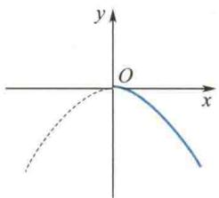  
图1.15 例1.4图
$$
\boldsymbol {v} = \frac {\mathrm{d} \boldsymbol {r}}{\mathrm{d} t} = 3 \boldsymbol {i} - 8 t \boldsymbol {j}
$$
其模为 $v = \sqrt{3^{2} + (8t)^{2}}$ ，与 x 轴正方向的夹角 $\theta = \arctan \frac{-8t}{3}$ .
由加速度的定义得
$$
\boldsymbol {a} = \frac {\mathrm{d} \boldsymbol {v}}{\mathrm{d} t} = - 8 \boldsymbol {j}
$$
即加速度的方向沿 y 轴负方向, 大小为 $8 \, m/s^{2}$ .
</Solution>
</Example>

<Example title="例 1.5">
一质点沿半径为 $1\mathrm{m}$ 的圆周运动，它通过的弧长 $s$ 按 $s = t + 2t^2$ 的规律变化.该质点在 $2\mathrm{s}$ 时的速率、切向加速度和法向加速度分别是多少？
<table><tr><td>解 由速率的定义得 $v = \frac{\mathrm{d}s}{\mathrm{d}t} = 1 + 4t$ 将  $t = 2\mathrm{\;s}$  代入,得  $2\mathrm{\;s}$  时的速率为 $v = (1 + 4\times 2)\mathrm{\;m}/\mathrm{s} = 9\mathrm{\;m}/\mathrm{s}$ </td><td>其法向加速度为 $a_{\mathrm{n}} = \frac{v^{2}}{R} = {81}\mathrm{\;m}/{\mathrm{s}}^{2}$ 由切向加速度的定义得  $a_{\tau } = \frac{{\mathrm{d}}^{2}s}{{\mathrm{d}}^{2}t} = 4\mathrm{\;m}/{\mathrm{s}}^{2}$ .</td></tr></table>
</Example>

<Example title="例 1.6">
一质点沿半径为 $1\mathrm{m}$ 的圆周运动，其角量运动方程为 $\theta = 2 + 3t - 4t^3$ (SI)，求质点在 $2\mathrm{s}$ 时的速率和切向加速度.

<Solution title="解">
因为
$$
\omega = \frac {\mathrm{d} \theta}{\mathrm{d} t} = 3 - 1 2 t ^ {2}
$$
2 s 时的角加速度为
$$
\alpha = - 2 4 \times 2 \mathrm {rad/ s^ {2}} = - 4 8 \mathrm {rad/ s^ {2}}
$$
$$
\alpha = \frac {\mathrm{d} \omega}{\mathrm{d} t} = - 2 4 t
$$
质点的速率为
$$
v = R \omega = - 4 5 \mathrm{m/s}
$$
将 $t = 2\mathrm{s}$ 代入，得 $2\mathrm{s}$ 时的角速度为
切向加速度为
$$
\omega = (3 - 1 2 \times 2 ^ {2}) \mathrm{rad/s} = - 4 5 \mathrm{rad/s}
$$
$$
a _ {\tau} = R \alpha = - 4 8 \mathrm {m/ s^ {2}}
$$
(2) 已知加速度和初始条件, 求速度和运动方程. 求解这类问题要用积分的方法.
</Solution>
</Example>

<Example title="例 1.7">
一质点沿 $x$ 轴运动，其加速度 $a = -kv^2$ ，式中 $k$ 为正常数.设 $t = 0$ 时， $x = 0,v = v_{0}$ .（1）求 $\pmb{v}$ 和 $\pmb{x}$ 作为 $t$ 的函数的表达式；(2）求 $\pmb{v}$ 作为 $\pmb{x}$ 的函数的表达式.

<Solution title="解">
（1）因为 $\mathrm{d}v = a\mathrm{d}t = -kv^2\mathrm{d}t$ 分离变量得
因为 $t = 0$ 时， $x = 0$ ，所以 $c_{2} = 0$ . 于是
$$
\frac {\mathrm{d} v}{v ^ {2}} = - k \mathrm{d} t
$$
$$
x = \frac {1}{k} \ln (1 + k v _ {0} t)
$$
积分得
(2) 因为 $a = \frac{dv}{dt} = \frac{dv}{dx} \frac{dx}{dt} = v \frac{dv}{dx}$
$$
k t = \frac {1}{v} + c _ {1}
$$
所以有
$$
\frac {v \mathrm{d} v}{\mathrm{d} x} = - k v ^ {2}
$$
因为 t=0 时， $v=v_{0}$ ，所以 $c_{1}=-\frac{1}{v_{0}}$ 。代入上式，并整理得
分离变量，并积分得
$$
v = \frac {v _ {0}}{1 + v _ {0} k t}
$$
$$
\begin{array}{l} - \int k \mathrm{d} x = \int \frac {\mathrm{d} v}{v} \\ - k x = \ln v + c _ {3} \end{array}
$$
再由 $\mathrm{dx} = v\mathrm{dt}$ ，将 $v$ 的表达式代入，并积分得
因为 $x = 0$ 时， $v = v_0$ ，所以 $c_3 = -\ln v_0$ 。代入上式，并整理得
$$
x = \int \frac {v _ {0} \mathrm{d} t}{1 + v _ {0} k t} = \frac {1}{k} \ln (1 + k v _ {0} t) + c _ {2}
$$
$$
v = v _ {0} \mathrm{e} ^ {- k x}
$$
</Solution>
</Example>

<Example title="例 1.8">
一质点受阻力作用沿圆周做减速运动，其角加速度与角位置 $\theta$ 成正比，比例系数为 $k(k > 0)$ 且当 $t = 0$ 时， $\theta_0 = 0, \omega = \omega_0$ 。（1）求角速度 $\omega$ 作为 $\theta$ 的函数的表达式；（2）求最大角位移。

<Solution title="解">
（1）依题意得 $\alpha = -k\theta$ ，即
$$
\alpha = \frac {\mathrm{d} \omega}{\mathrm{d} t} = \frac {\mathrm{d} \omega}{\mathrm{d} \theta} \frac {\mathrm{d} \theta}{\mathrm{d} t} = \frac {\mathrm{d} \omega}{\mathrm{d} \theta} \omega
$$
得
$$
\frac {\omega^ {2}}{2} - \frac {\omega_ {0} ^ {2}}{2} = - k \frac {\theta^ {2}}{2}
$$
所以有
所以
$$
- k \theta = \frac {\mathrm{d} \omega}{\mathrm{d} \theta} \omega
$$
$$
\omega = \sqrt {\omega_ {0} ^ {2} - k \theta^ {2}} \quad (\text {取正值})
$$
$$
- \int_ {0} ^ {\theta} k \theta \mathrm{d} \theta = \int_ {\omega_ {0}} ^ {\omega} \omega \mathrm{d} \omega
$$
分离变量并积分，且考虑到 $t = 0$ 时， $\theta_0 = 0,\omega = \omega_0$ ，有
(2) 最大角位移发生在 $\omega = 0$ 时, 所以
$$
\theta = \frac {1}{\sqrt {k}} \omega_ {0} \quad (\text { 只   能   取   正   值 })
$$
</Solution>
</Example>
