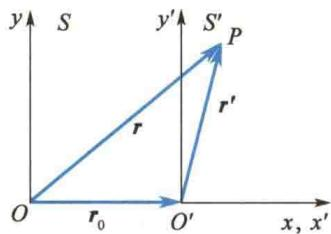
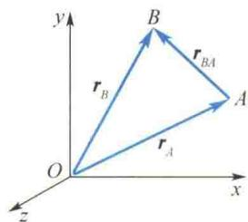
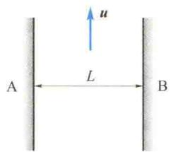
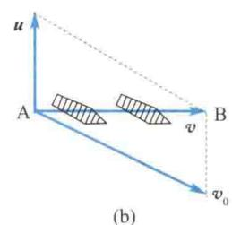
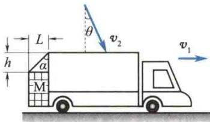
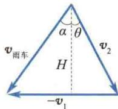

import Guide from '@/components/Guide.astro';
import Knowledge from '@/components/Knowledge.astro';
import Example from '@/components/Example.astro';
import Analysis from '@/components/Analysis.astro';
import Solution from '@/components/Solution.astro';
import Variant from '@/components/Variant.astro';
import Note from '@/components/Note.astro';
import Block from '@/components/Block.astro';
import Method from '@/components/Method.astro';
import Exercise from '@/components/Exercise.astro';

在 1.1 节中曾指出,选取不同的参考系,对同一物体运动的描述就会不同,这反映了运动描述的相对性.下面研究同一质点在有相对运动的两个参考系中的位移、速度和加速度之间的关系.
  
相对运动
当研究大轮船上物体的运动时,既要知道该物体相对于河岸的运动,又要知道该物体相对于轮船的运动.设观察者在河岸,为此把河岸(地球)定义为静止参考系,而把轮船定义为运动参考系.但是,当研究宇宙飞船的发射时,则只能把太阳作为静止参考系,而把地球作为运动参考系.这就是说,“静止参考系”“运动参考系”的称谓都是相对的.一般情况下,研究地面上物体的运动时,把地球作为静止参考系比较方便.
当定义了静止参考系后,对于一个处于运动参考系中的物体,把它相对于静止参考系的运动称为绝对运动,把运动参考系相对于静止参考系的运动称为牵连运动,把物体相对于运动参考系的运动称为相对运动.显然,这些称谓也是相对的.
如图1.16所示，设 $S$ 为静止参考系， $S'$ 为运动参考系。为简单计，假定相应坐标轴保持相互平行， $S'$ 系相对于 $S$ 系沿 $x$ 轴正方向做直线运动。这时两参考系间的相对运动情况，可用 $S'$ 系的坐标原点 $O'$ 相对于 $S$ 系的坐标原点 $O$ 的运动来代表。设有一质点位于 $S'$ 系中的 $P$ 点，它对 $S$ 系的位矢为 $\pmb{r}$ （绝对位矢），对 $S'$ 系的位矢为 $\pmb{r}'$ （相对位矢），而 $O'$ 点对 $O$ 点的位矢为 $\pmb{r}_0$ （牵连位矢）。由矢量加法的三角形定则可知， $\pmb{r}, \pmb{r}', \pmb{r}_0$ 之间有如下关系：
  
图 1.16 运动描述的相对性
$$
\boldsymbol {r} = \boldsymbol {r} _ {0} + \boldsymbol {r} ^ {\prime}\tag{1.28}
$$
即绝对位矢等于牵连位矢与相对位矢的矢量和.
将式 $(1.28)$ 两边对时间求导,可得
$$
\boldsymbol {v} = \boldsymbol {v} _ {0} + \boldsymbol {v} ^ {\prime}\tag{1.29}
$$
式中， $\pmb{v}$ 为绝对速度， $\pmb{v}_0$ 为牵连速度， $\pmb{v}'$ 为相对速度.
将式 $(1.29)$ 两边对时间求导,可得
$$
\boldsymbol {a} = \boldsymbol {a} _ {0} + \boldsymbol {a} ^ {\prime}\tag{1.30}
$$
式中，a 为绝对加速度， $a_{0}$ 为牵连加速度， $a'$ 为相对加速度.
需要说明的是,式(1.28)、式(1.29)、式(1.30)所表示的位矢、速度、加速度的合成定则,只在物体的运动速度远小于光速时才成立.当物体的运动速度与光速接近时,上述三式不再成立,此时遵循的是相对论时空坐标、速度、加速度的变换法则.另外,当两个参考系之间还有相对转动时,它们的速度、加速度之间的关系要复杂得多,此处就不作讨论了.

当讨论处于同一参考系内质点系中各质点间的相对运动时,可以利用以上结论表示质点间的相对位矢和相对速度.
在雨中走还是跑淋雨少？
设某质点系由 A、B 两质点组成。它们对某一参考系的位矢分别为 $r_{A}$ 和 $r_{B}$ ，如图 1.17 所示。质点系内质点 B 对质点 A 的位矢显然是由质点 A 引向质点 B 的矢量 $r_{BA}$ 。由图 1.17 可知，应用矢量减法的三角形定则，则有
  
图1.17 相对位矢
$$
\boldsymbol {r} _ {B A} = \boldsymbol {r} _ {B} - \boldsymbol {r} _ {A}
$$
(1.31)
$r_{BA}$ 称为质点 B 对质点 A 的相对位矢.
将式 $(1.31)$ 对时间求一阶导数,可得质点B对质点A的相对速度为
$$
\pmb {v} _ {B A} = \pmb {v} _ {B} - \pmb {v} _ {A}\tag{1.32}
$$

<Example title="例 1.9">
如图 1.18(a) 所示, 河宽为 L, 河水以恒定速度 u 流动, 岸边有 A、B 两码头, A、B 的连线与岸边垂直, 码头 A 处有船相对于河水以恒定速率 $v_{0}$ 开动, 证明: 船在 A、B 两码头间往返一次所需时间为
$$
t = \frac {\frac {2 L}{v _ {0}}}{\sqrt {1 - \left(\frac {u}{v _ {0}}\right) ^ {2}}}
$$
(船换向时间忽略不计).
  
(a)
  
图1.18 例1.9图

<Solution title="证明">
设船相对于岸边的速度（绝对速度）为 $\pmb{v}$ ，由题意知， $\pmb{v}$ 的方向必须指向 A、B 的连线，此时河水流速 $u$ 为牵连速度，船对水的速度 $\pmb{v}_0$ 为相对速度，于是有
$$
\boldsymbol {v} = \boldsymbol {u} + \boldsymbol {v} _ {0}
$$
据此作出矢量图,如图 1.18(b) 所示,由图知
$$
v = \sqrt {v _ {0} ^ {2} - u ^ {2}}
$$
读者自己可证当船由 B 返回 A 时, 船对岸的速度的模亦由上式给出. 因为在 A、B 两码头往返一次的路程为 2L, 故所需时间为
$$
t = \frac {2 L}{v} = \frac {2 L}{\sqrt {v _ {0} ^ {2} - u ^ {2}}} = \frac {\frac {2 L}{v _ {0}}}{\sqrt {1 - \left(\frac {u}{v _ {0}}\right) ^ {2}}}
$$
讨论：
(1) 若 u = 0，即河水静止，则 $t = \frac{2L}{v_{0}}$ ，这是显然的.
(2) 若 $u = v_{0}$ ，即河水流速 u 等于船对水的速率 $v_{0}$ ，则 $t \to \infty$ ，即船由码头 A（或 B）出发后就永远不能再回到原出发点了.
（3）若 $u > v_{0}$ ，则 t 为一虚数，这是没有物理意义的，即船不能在 A、B 间往返.
综合上述讨论可知,船在 A、B 间往返的必要条件是
$$
v _ {0} > u
$$
</Solution>
</Example>

<Example title="例 1.10">
如图1.19(a)所示，一汽车在雨中沿直线行驶，其速率为 $v_{1}$ ，下落雨滴的速度方向与铅直方向成 $\theta$ 角，偏向汽车前进方向，速率为 $v_{2}$ ，车后有一物体M[尺寸如图1.19(a)所示]，车速 $v_{1}$ 为多大时，物体M刚好不会被雨水淋湿？
  
(a)
  
图1.19 例1.10图  
(b)

<Solution title="解">
根据式(1.32)可得
由图1.19(b)可算得
$$
\pmb {v} _ {\mathrm{雨车}} = \pmb {v} _ {\mathrm{雨}} - \pmb {v} _ {\mathrm{车}} = \pmb {v} _ {2} - \pmb {v} _ {1} = \pmb {v} _ {2} + (- \pmb {v} _ {1})
$$
据此可作出矢量图,如图1.19(b)所示.即此时 $v_{雨车}$ 与铅直方向的夹角为 $\alpha$ ,而由图1.19(a)有
$$
H = v _ {2} \cos \theta
$$
$$
\tan \alpha = \frac {L}{h}
$$
$$
v _ {1} = v _ {2} \sin \theta + H \tan \alpha = v _ {2} \sin \theta + v _ {2} \frac {L}{h} \cos \theta
$$
</Solution>
</Example>
