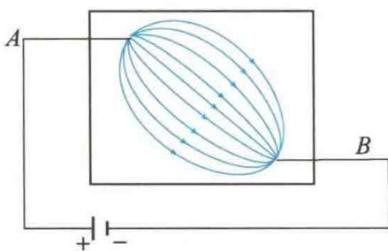
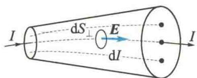
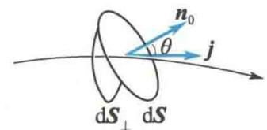
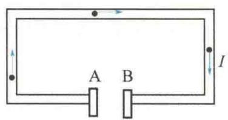
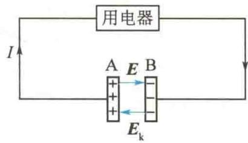

import QRCodeVideo from '@/components/QRCodeVideo.astro';

import Guide from '@/components/Guide.astro';
import Knowledge from '@/components/Knowledge.astro';
import Example from '@/components/Example.astro';
import Analysis from '@/components/Analysis.astro';
import Solution from '@/components/Solution.astro';
import Variant from '@/components/Variant.astro';
import Note from '@/components/Note.astro';
import Block from '@/components/Block.astro';
import Method from '@/components/Method.astro';
import Exercise from '@/components/Exercise.astro';

## 第10章 稳恒磁场

本章提要
<QRCodeVideo title="本章提要" url="https://api.guangyiedu.com/v3/resource/resource/r/NewQrCode-Fsv2PyGAp5DoFkAw6qYV" />
上一章主要介绍了静止电荷产生的静电场的基本性质与基本规律. 如果电荷相对于观察者运动, 那么观察者会测得在它周围空间中不仅存在电场, 也存在磁场. 两运动电荷间的相互作用不仅有电场力, 还有磁力, 电场力通过电场来传递, 磁力通过磁场来传递. 运动电荷、传导电流和变化的电场都是产生磁场的源. 本章主要研究稳恒电流产生的磁场, 它不随时间变化, 称为稳恒磁场. 本章主要内容有稳恒磁场的产生、磁场的基本规律和磁场与磁介质的相互作用.
磁感应强度是描述磁场性质的基本物理量. 磁场的高斯定理和安培环路定理是反映磁场性质的两条基本定理. 对于具有一定对称性的磁场分布, 其磁感应强度可以利用毕奥-萨伐尔定律来求解, 亦可采用安培环路定理来求解. 其中所涉及的对称性分析方法类似于利用电场中的高斯定理求解具有对称性的电场分布的分析方法. 电荷在磁场中运动时受到洛伦兹力作用, 载流导线在磁场中受到安培力和力矩作用. 这些理论与规律在许多领域均得到广泛应用. 本章还将讨论磁场和磁介质的相互作用规律, 并特别介绍实用价值很高的铁磁质的特性.
本章所探讨的概念、规律和方法与上一章静电场类似，但又有所不同，读者在学习过程中应注意与静电场进行比较，融会贯通.

### 1. 电流密度

大量电荷进行有规则的定向运动可形成电流. 导体中的电流定义为单位时间内
<QRCodeVideo title="安培" url="https://api.guangyiedu.com/v3/resource/resource/r/NewQrCode-iq40C06vRlLJ5k1x3oPj" />  
通过导体任意横截面的电荷的电量. 规定正电荷运动的方向为电流的方向. 电流的单位名称为安培, 符号为 A, 1 A = 1 C/s.
当电流在粗细不均匀的导线或大块导体中流动时,对导体的不同部分,电流的大小和方向都可能不一样,如图 10.1 所示.
这时需引入电流密度矢量 j，规定
  
图10.1 电流在大块导体中的分布
$$
j = \frac {\mathrm{d} I}{\mathrm{d} S _ {\perp}} n _ {0}
$$
式中， $n_{0}$ 是与电场强度 E 方向垂直的面元 $dS_{\perp}$ 的法线方向上的单位矢量，它与电场强度 E 方向相同。电流密度矢量 j 的单位名称为安培每平方米，符号为 $A/m^{2}$ 。上式表明：电流密度矢量 j 的方向沿该点电场强度 E 的方向，大小等于通过与该点电场强度方向垂直的单位面积的电流（见图 10.2）。
如果面元 $\mathrm{d}\pmb{S}$ 的法线方向与导体内某点处 $j$ 的方向成 $\theta$ 角， $\mathrm{d}\pmb{S}$ 在垂直于 $j$ 的方向上的投影面积为 $\mathrm{d}\pmb{S}_{\perp}$ ，如图10.3所示，则 $\mathrm{d}S_{\perp} = \mathrm{d}S\cos \theta$ ，通过 $\mathrm{d}\pmb{S}$ 的电流 $\mathrm{d}I = j\cos \theta \mathrm{d}S = j \cdot \mathrm{d}\pmb{S}$ ，而通过导体中任意横截面的电流为
$$
I = \int_ {S} j \cos \theta \mathrm{d} S = \int_ {S} j \cdot \mathrm{d} S
$$
  
图10.2 电流密度矢量的引出
  
图10.3 电流密度的矢量性

### 2. 电动势

要在导体中维持稳恒电流,必须在其两端维持恒定不变的电势差.这一条件是怎样满足的呢?下面以带电电容器放电时产生的电流为例来讨论.
如图 10.4 所示, 当用导线把充电的电容器两极板 A、B 连接起来时, 就有电流从 A 板通过导线流向 B 板, 但此电流不是稳定的, 因为两个极板上的正、负电荷逐渐中和而减少, 极板间的电势差也逐渐减小直至为零, 电流也就停止了. 因此, 单纯依靠静电力的作用, 在导体两端不可能维持恒定的电势差, 也就不可能获得稳恒电流.
为了获得稳恒电流,必须有一种本质上完全不同于静电力的力把图 10.4 中由 A 板经导线流向 B 板的正电荷再送回 A 板,从而使两极板间保持恒定的电势差来维持由 A 板到 B 板的稳恒电流, 如图 10.5 所示. 能把正电荷从电势较低的点 (如电源负极板) 送到电势较高的点 (如电源正极板) 的作用力称为非静电力, 记作 $F_{\mathrm{k}}$ . 提供非静电力的装置称为电源.
  
图 10.4 电容器的放电
  
图10.5 电源
作用在单位正电荷上的非静电力称为非静电场的电场强度,记作 $E_{k}$ , 即
$$
\pmb {E} _ {\mathrm{k}} = \frac {\pmb {F} _ {\mathrm{k}}}{q}
$$
一个电源的电动势 $\mathcal{E}$ 定义为把单位正电荷从负极通过电源内部移到正极时，电源中的非静电力所做的功，即
$$
\mathcal {E} = \int_ {-} ^ {+} E _ {\mathrm{k}} \cdot \mathrm{d} l
$$
电动势与电势一样,也是标量.规定自负极经电源内部到正极的方向为电动势的正方向.由于电源外部 $E_{k}$ 为零,因此电源电动势又可定义为把单位正电荷绕闭合回路一周时,电源中非静电力所做的功,即
$$
\mathcal {E} = \oint_ {L} \boldsymbol {E} _ {\mathrm{k}} \cdot \mathrm{d} \boldsymbol {l}
$$
此定义对非静电力作用在整个回路上的情况(如电磁感应)也适用,这时电动势 $\varepsilon$ 的方向与回路中电流的方向一致.

